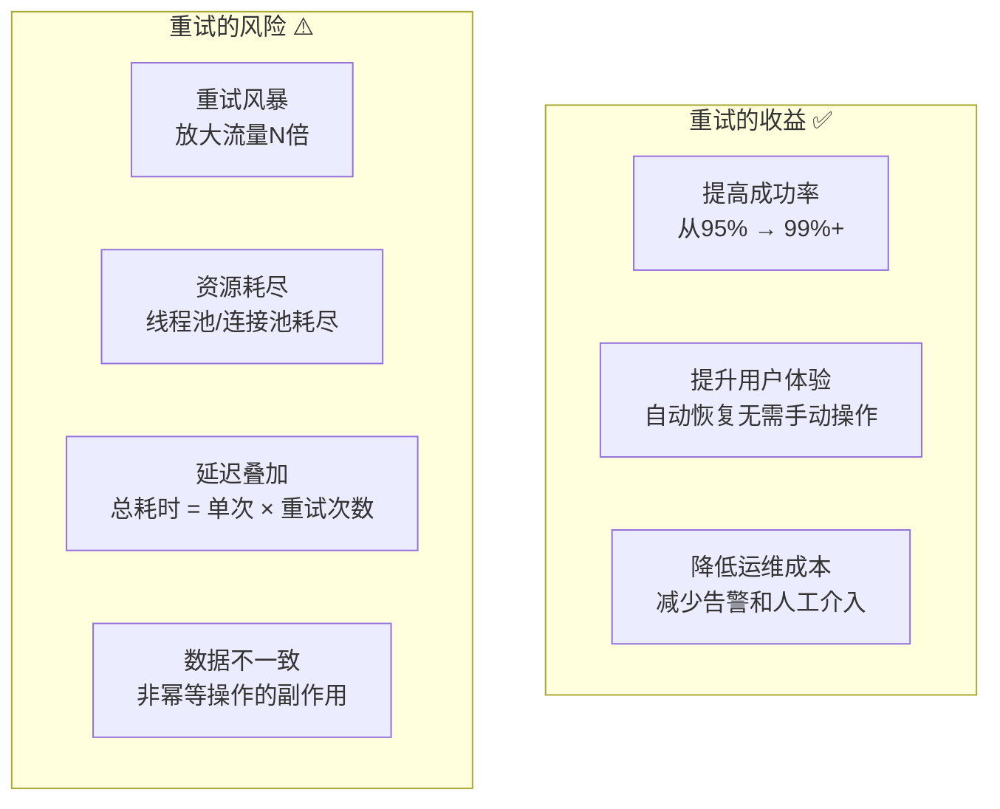
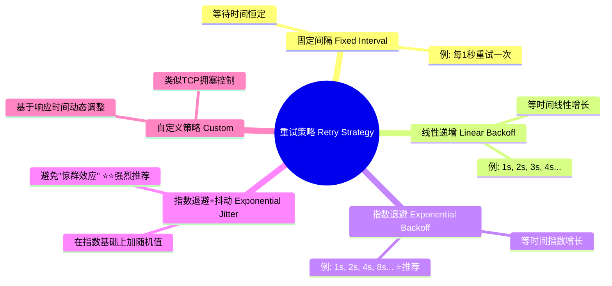
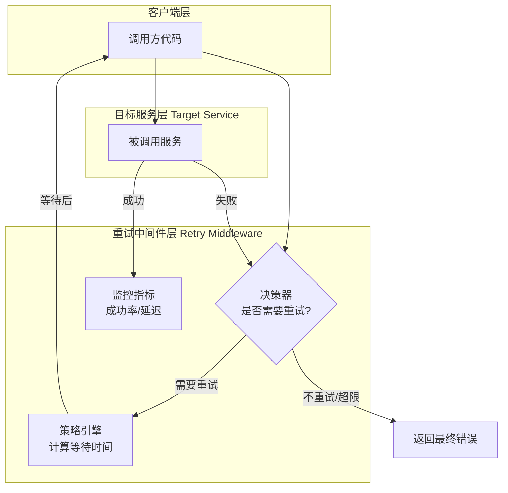
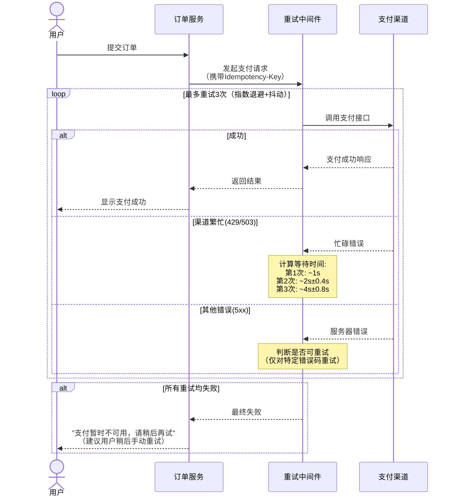

# 弹力设计篇之"重试设计" - [2026重制版]

> **核心变更说明**：本文基于原极客时间专栏第47讲内容进行全面升级，更新至2026年技术栈。主要变更包括：
> - 补充Resilience4j Retry模块完整配置
> - 新增Spring Cloud Circuit Breaker + Retry整合
> - 引入指数退避与抖动（Jitter）最佳实践
> - 添加gRPC/HTTP客户端重试策略对比
> - 包含重试风暴防护机制

---

## 一、问题背景：为什么需要重试

### 1.1 分布式系统中的瞬时故障

在分布式系统中，很多故障是**瞬时的（Transient）**而非永久的：

| 故障类型 | 典型原因 | 持续时间 | 是否可重试 |
|---------|---------|---------|-----------|
| **网络超时** | 拥塞、丢包、DNS解析慢 | 秒~分钟级 | ✅ 推荐 |
| **服务过载** | 突发流量、GC暂停 | 秒~分钟级 | ✅ 推荐（配合退避） |
| **限流触发** | 429 Too Many Requests | 秒级 | ✅ 推荐（需退避） |
| **数据库连接池满** | 连接未释放 | 秒级 | ⚠️ 需谨慎 |
| **第三方API错误** | 5xx Server Error | 分钟级 | ✅ 推荐 |
| **配置变更中** | 服务重启、蓝绿部署 | 分钟级 | ✅ 推荐 |

**不适合重试的场景**：

| 错误类型 | 原因 | 处理方式 |
|---------|------|---------|
| **4xx Client Error** | 参数错误、权限不足 | ❌ 不应重试，直接返回错误 |
| **业务逻辑错误** | 余额不足、库存为0 | ❌ 重试无意义 |
| **认证失败** | Token过期 | ❌ 应刷新Token后重试 |
| **幂等性违规** | 重复提交 | ❌ 返回已有结果 |

### 1.2 重试的收益与风险



**关键认知**：重试是一把双刃剑，必须精心设计策略才能趋利避害。

---

## 二、核心概念与架构图

### 2.1 重试策略分类



### 2.2 重试架构全景图



---

## 三、技术实现细节

### 3.1 Resilience4j Retry 配置与使用

#### Maven依赖
```xml
<dependency>
    <groupId>io.github.resilience4j</groupId>
    <artifactId>resilience4j-retry</artifactId>
    <version>2.1.0</version>
</dependency>
<dependency>
    <groupId>io.github.resilience4j</groupId>
    <artifactId>resilience4j-spring-boot3</artifactId>
    <version>2.1.0</version>
</dependency>
```

#### application.yml 配置
```yaml
resilience4j:
  retry:
    instances:
      # 基础重试配置（用于一般远程调用）
      backendService:
        maxAttempts: 3                    # 最大重试次数（含首次调用）
        waitDuration: 500ms               # 初始等待时间
        enableExponentialBackoff: true     # 启用指数退避
        exponentialBackoffMultiplier: 2.0   # 退避乘数
        randomizationFactor: 0.5           # 抖动因子（0-0.5）
        retryExceptions:                   # 触发重试的异常
          - java.net.SocketTimeoutException
          - java.net.ConnectException
          - org.springframework.web.client.HttpServerErrorException
          - io.github.resilience4j.circuitbreaker.CallNotPermittedException
        ignoreExceptions:                  # 忽略不重试的异常
          - org.springframework.web.client.HttpClientErrorException  # 4xx错误
          - java.lang.IllegalArgumentException
          - com.example.business.BusinessException
        
      # 支付服务的特殊配置（更保守的重试策略）
      paymentGateway:
        maxAttempts: 2                    # 支付只允许重试1次（共2次尝试）
        waitDuration: 1000ms              # 初始等待1秒
        enableExponentialBackoff: true
        exponentialBackoffMultiplier: 3.0   # 更激进的退避（3x）
        randomizationFactor: 0.6
        # retryOnResultPredicate 需要在代码中配置（根据返回结果判断是否重试）
        retryExceptions:
          - com.example.payment.PaymentTimeoutException
          - com.example.payment.GatewayBusyException
          
      # 数据库查询（快速失败策略）
      databaseQuery:
        maxAttempts: 1                    # 不重试，快速失败
        waitDuration: 0ms
```

#### Java代码示例
```java
@Service
@RequiredArgsConstructor
@Slf4j
public class BackendServiceClient {

    private final BackendServiceFeignClient feignClient;
    private final RetryRegistry retryRegistry;

    /**
     * 方式一：注解方式（推荐用于简单场景）
     */
    @Retry(name = "backendService", fallbackMethod = "fallbackGetData")
    public DataResponse getData(String id) {
        log.info("Fetching data for id: {}", id);
        return feignClient.getData(id);
    }

    /**
     * 降级方法（所有重试耗尽后的兜底）
     */
    public DataResponse fallbackGetData(String id, Exception ex) {
        log.warn("All retries exhausted for id={}, error={}", id, ex.getMessage());
        
        // 尝试从缓存获取或返回默认值
        return DataResponse.fromCacheOrDefault(id);
    }

    /**
     * 方式二：编程式方式（更灵活的控制）
     */
    public PaymentResult processPayment(PaymentRequest request) {
        // 获取配置好的Retry实例
        Retry retry = retryRegistry.retry("paymentGateway");

        // 使用Supplier装饰器包装调用
        Supplier<PaymentResult> supplier = Retry.decorateSupplier(retry, () -> {
            log.info("Attempting payment processing...");
            PaymentResult result = feignClient.charge(request);
            
            // 自定义检查：基于业务逻辑决定是否需要重试
            if (result.isPending()) {
                throw new PaymentStillProcessingException("Payment is still processing");
            }
            
            return result;
        });

        try {
            return supplier.get();
        } catch (MaxRetriesExceededException e) {
            log.error("Payment retry limit exceeded", e);
            return PaymentResult.failed("Service temporarily unavailable");
        }
    }
}
```

### 3.2 Spring Cloud OpenFeign 整合重试

```java
@FeignClient(
    name = "inventory-service",
    configuration = InventoryFeignConfig.class,
    fallbackFactory = InventoryFallbackFactory.class
)
public interface InventoryFeignClient {

    @GetMapping("/api/inventory/{productId}")
    @CircuitBreaker(name = "inventory")  // 熔断器
    @RateLimiter(name = "inventory")     // 限流器
    @Retry(name = "inventoryBackend")     // 重试器
    InventoryResponse checkStock(@PathVariable String productId);

    @PutMapping("/api/inventory/reserve")
    @Retry(name = "inventoryBackend")
    ReserveResult reserveStock(@RequestBody ReserveRequest request);
}

/**
 * Feign配置类
 */
@Configuration
public class InventoryFeignConfig {

    @Bean
    public RequestInterceptor requestInterceptor() {
        return template -> {
            // 注入Trace ID用于链路追踪
            String traceId = MDC.get("traceId");
            if (traceId != null) {
                template.header("X-Trace-Id", traceId);
            }
            
            // 注入幂等性Key
            String idempotencyKey = IdempotencyContext.getKey();
            if (idempotencyKey != null) {
                template.header("X-Idempotency-Key", idempotencyKey);
            }
        };
    }

    @Bean
    public ErrorDecoder errorDecoder() {
        return new CustomErrorDecoder();
    }
}

/**
 * 自定义ErrorDecoder：区分可重试和不可重试的错误
 */
public class CustomErrorDecoder implements ErrorDecoder {

    private final Logger log = LoggerFactory.getLogger(CustomErrorDecoder.class);

    @Override
    public Exception decode(String methodKey, Response response) {
        int status = response.status();

        if (status >= 400 && status < 500) {
            // 4xx错误：不应重试（参数问题、权限问题等）
            if (status == 429) {  // Too Many Requests 可重试
                return new TooManyRequestsException(status, "Rate limited");
            }
            return new ClientException(status, "Client error, no retry");
        }

        if (status >= 500) {
            // 5xx错误：可重试
            switch (status) {
                case 503:  // Service Unavailable
                    return new ServiceUnavailableException(status, "Service unavailable");
                case 504:  // Gateway Timeout
                    return new GatewayTimeoutException(status, "Gateway timeout");
                default:
                    return new ServerException(status, "Server error, should retry");
            }
        }

        return new RuntimeException("Unknown HTTP status: " + status);
    }
}
```

### 3.3 高级重试模式：自适应重试（类似TCP）

对于复杂的网络环境，可以使用**自适应重试**算法：

```java
/**
 * 自适应重试策略实现
 * 
 * 思路参考TCP的拥塞控制算法：
 * - 成功时：线性增加（Additive Increase）
 * - 失败时：乘法减少（Multiplicative Decrease）
 * - 加入随机抖动避免同步
 */
public class AdaptiveRetryStrategy implements RetryStrategy {

    private static final long MIN_WAIT_MS = 100;       // 最小等待时间
    private static final long MAX_WAIT_MS = 30000;      // 最大等待时间（30秒）
    private static final double INCREASE_FACTOR = 1.5;  // 成功时增加因子
    private static final double DECREASE_FACTOR = 0.5;  // 失败时减少因子
    private static final double JITTER_FACTOR = 0.2;    // 抖动因子

    private final Map<String, RetryState> stateMap = new ConcurrentHashMap<>();

    @Override
    public long calculateWaitTime(String targetService, int attemptNumber, boolean lastSuccess) {
        RetryState state = stateMap.computeIfAbsent(targetService, k -> new RetryState());

        if (lastSuccess) {
            // 成功：增加等待时间（但不超过最大值）
            state.currentWaitMs = Math.min(
                (long)(state.currentWaitMs * INCREASE_FACTOR),
                MAX_WAIT_MS
            );
            state.consecutiveFailures = 0;
        } else {
            // 失败：大幅减少等待时间
            state.currentWaitMs = Math.max(
                (long)(state.currentWaitMs * DECREASE_FACTOR),
                MIN_WAIT_MS
            );
            state.consecutiveFailures++;
        }

        // 加入随机抖动（避免多个客户端同时重试造成"惊群效应"）
        long jitter = (long)(state.currentWaitMs * JITTER_FACTOR * (Math.random() * 2 - 1));
        long finalWait = Math.max(MIN_WAIT_MS, state.currentWaitMs + jitter);

        log.debug("[AdaptiveRetry] service={}, attempt={}, wait={}ms, consecutiveFailures={}",
                 targetService, attemptNumber, finalWait, state.consecutiveFailures);

        return finalWait;
    }

    @Data
    private static class RetryState {
        private long currentWaitMs = 1000;  // 初始等待1秒
        private int consecutiveFailures = 0;
    }
}
```

### 3.4 gRPC重试策略

gRPC支持重试策略（需要服务端和客户端都支持；实际配置通过Service Config JSON或客户端拦截器完成，下例为示意）：

```protobuf
// proto文件中的service定义
service OrderService {
  // 定义重试策略（在proto层面）
  rpc CreateOrder(CreateOrderRequest) returns (CreateOrderResponse) {
    option (google.api.http) = {
      post: "/v1/orders"
      body: "*"
    };
    // gRPC重试策略注解
    option (grpc.retry_policy) = {
      max_attempts: 3
      initial_backoff: "0.1s"
      max_backoff: "1s"
      backoff_multiplier: 2.0
      retryable_status_codes: [UNAVAILABLE, DEADLINE_EXCEEDED, RESOURCE_EXHAUSTED]
    };
  }
}
```

**Java gRPC客户端配置**：
```java
ManagedChannel channel = ManagedChannelBuilder.forAddress("localhost", 9090)
    .usePlaintext()
    .enableRetry()  // 启用重试
    .maxRetryAttempts(3)
    .retryWithBackoff(
        InitialBackoff.seconds(1),
        MaxBackoff.seconds(10),
        BackoffMultiplier.valueOf(2),
        Jitter.valueOf(0.2)
    )
    .retryOnStatus(Status.Code.UNAVAILABLE)
    .retryOnStatus(Status.Code.DEADLINE_EXCEEDED)
    .build();
```

---

## 四、方案对比表格

### 4.1 重试框架对比

| 特性 | Resilience4j | Spring Retry | Polly (.NET) | gRPC内置 |
|------|-------------|-------------|--------------|----------|
| **语言支持** | Java/Kotlin | Java | C# | 多语言 |
| **注解支持** | ✅ | ✅ | ✅ | Proto定义 |
| **熔断集成** | ✅ 原生 | ⚠️ 需额外配置 | ✅ 原生 | ✅ 原生 |
| **退避算法** | ✅ 多种 | ✅ 多种 | ✅ 多种 | ✅ 指数+抖动 |
| **Metrics** | ✅ Micrometer | ❌ 无 | ✅ 内置 | ✅ 内置 |
| **异步支持** | ✅ Reactor/RxJava | ❌ 仅同步 | ✅ async/await | ✅ 异步流 |
| **线程模型** | 信号量/线程池 | 同步线程 | async/await | 调度器 |

### 4.2 重试策略效果对比

| 策略 | 总等待时间（3次重试） | 震荡风险 | 推荐场景 |
|------|-------------------|----------|---------|
| **固定间隔 1s** | 3秒 | ⚠️⚠️⚠️ 高（惊群效应） | 简单内部调用 |
| **线性递增 1,2,3s** | 6秒 | ⚠️⚠️ 中 | 一般场景 |
| **指数退避 1,2,4s** | 7秒 | ⚠️ 低 | **通用推荐** |
| **指数+抖动** | ~7秒（随机） | ✅ 极低 | **生产环境首选** |
| **自适应** | 动态调整 | ✅ 极低 | 复杂网络环境 |

---

## 五、实战案例（Case Study）

### 案例：电商支付网关的重试设计

**挑战**：
- 支付渠道偶尔不稳定（支付宝/微信/银联）
- 不能重复扣款（必须保证幂等性）
- 用户等待时间不能太长（<10秒）

**解决方案架构**：



**关键配置要点**：

1. **严格限制重试次数**：支付最多2-3次（避免长时间占用用户资金）
2. **使用幂等Key**：每次重试携带相同的Idempotency-Key
3. **差异化退避**：不同渠道使用不同的初始等待时间和倍数
4. **监控重试率**：如果某渠道重试率持续偏高，考虑切换备用渠道

---

## 六、最佳实践清单

### 设计原则

- [ ] **明确区分可重试和不可重试的错误**
- [ ] **设置合理的最大重试次数**（通常2-5次）
- [ ] **使用指数退避+抖动**（避免重试风暴）
- [ ] **确保操作是幂等的**（或配合Idempotency-Key）
- [ ] **设置总体超时时间**（防止无限重试导致用户体验差）
- [ ] **记录重试日志**（包含attempt number、wait time、error details）

### 反模式（Anti-Patterns）

| 反模式 | 问题 | 正确做法 |
|--------|------|---------|
| **无限重试** | 可能永远无法返回 | 设置maxAttempts + timeout |
| **无退避的重试** | 加剧目标服务压力 | 使用exponential backoff |
| **对4xx错误重试** | 浪费资源且不会成功 | 仅对5xx/超时/限流重试 |
| **忽略重试上下文** | 无法追踪问题 | 记录traceId、attempt等元信息 |
| **重试非幂等操作** | 导致数据不一致 | 确保幂等或改用其他方案 |

---

## 七、延伸学习资源

### 官方文档

1. **Resilience4j Retry Module**: https://resilience4j.readme.io/docs/retry
2. **Spring Cloud Circuit Breaker**: https://docs.spring.io/spring-cloud-circuitbreaker/reference/html/
3. **gRPC Retry Design**: https://grpc.io/docs/guides/retry/

### 推荐阅读

1. **《Release It!》** Michael Nygard - Chapter 4: Circuit Breaker & Retry
2. **Google SRE Book** - Chapter 6: Handling Overload
3. **AWS Architecture Blog - Retry with Backoff**

---

## 八、总结

本文全面介绍了分布式系统中的重试设计模式。核心要点：

1. **核心理念**：重试是应对**瞬时故障**的有效手段，但不是万能药
2. **关键决策点**：
   - **何时重试**：仅针对瞬时故障（超时、5xx、限流）
   - **如何重试**：指数退避 + 抖动（Jitter）是生产环境的首选
   - **重试多少次**：根据业务SLA确定（通常2-5次）
   - **总超时多久**：必须设置上限（如10秒、30秒）
3. **技术选型**：
   - Java微服务：**Resilience4j**（功能最全、生态最好）
   - Spring Boot项目：**Spring Retry**（简单易用）
   - .NET应用：**Polly**（成熟稳定）
   - 微服务间通信：**gRPC内置重试** + Service Mesh
4. **重要提醒**：
   - 重试必须配合**幂等性**设计
   - 重试应该与**熔断器**协同工作（先熔断再重试）
   - 监控**重试率**指标，过高的重试率说明上游有问题

**记住**："Retries are not a silver bullet; they're a carefully tuned instrument."（重试不是银弹，而是一件需要精心调校的乐器。）合理使用重试可以显著提高系统的可用性，滥用则可能导致更严重的故障。

---

**参考资料来源**：
- [Resilience4j Official Documentation](https://resilience4j.readme.io/)
- [Spring Cloud Circuit Breaker](https://docs.spring.io/spring-cloud-circuitbreaker/)
- [gRPC Retry Documentation](https://grpc.io/docs/guides/retry/)
- [AWS Architecture - Retry with Jitter](https://aws.amazon.com/blogs/architecture/exponential-backoff-and-jitter/)
