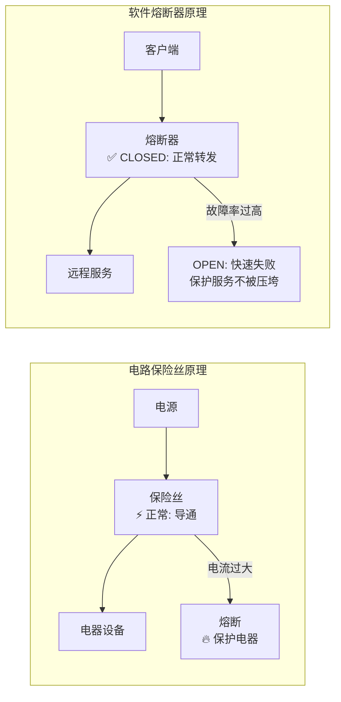
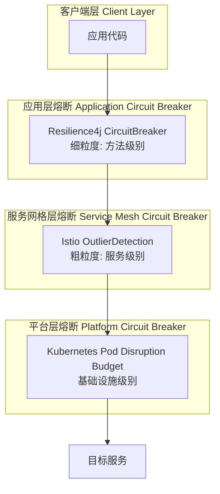
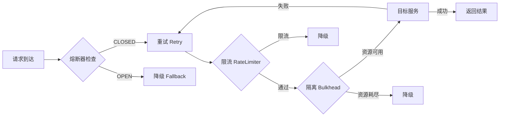

# 弹力设计篇之"熔断设计" - [2026重制版]

> **核心变更说明**：本文基于原极客时间专栏第48讲内容进行全面升级，更新至2026年技术栈。主要变更包括：
> - 从Hystrix（已停维）全面迁移到Resilience4j / Istio
> - 补充熔断器状态机详解与配置调优
> - 新增Service Mesh层熔断（Istio DestinationRule OutlierDetection）
> - 引入半开状态的健康探测机制
> - 包含真实生产环境的熔断参数调优案例

---

## 一、问题背景：为什么需要熔断

### 1.1 熔断器的灵感来源

熔断器模式（Circuit Breaker Pattern）的灵感来源于**家庭电路中的保险丝**：



**核心思想**：当检测到下游服务故障时，**主动切断调用**，避免故障蔓延（雪崩效应），给下游服务恢复的时间。

### 1.2 雪崩效应的真实场景

```mermaid
sequenceDiagram
    participant U as 用户
    participant GW as API网关
    participant SvcA as 订单服务
    participant SvcB as 库存服务 (故障中)
    participant DB as 数据库

    Note over SvcB: ⚠️ 响应变慢(3s→30s)

    loop 100个并发请求
        U->>GW: 下单请求
        GW->>SvcA: 转发请求
        SvcA->>SvcB: 调用库存服务
        
        Note over SvcB: ⏳ 处理缓慢...
        Note over SvcA: 线程阻塞等待...
    end
    
    rect rgb(255,200,200)
        Note over SvcA: 线程池耗尽!<br/>所有线程都在等SvcB<br/>新请求无法处理!
        Note over GW: 请求堆积<br/>连接池耗尽!
        Note over U: 全部超时或拒绝!
        
        note1["❌ 雪崩效应:<br/>一个服务的故障拖垮了整个系统"]
    end
```

**真实案例**：
- **2012年Amazon AWS outage**：一个EBS卷的故障导致连锁反应，影响Netflix、Instagram、Pinterest等多家网站
- **2020年微服务雪崩事故**：某公司推荐服务故障导致商品详情页、购物车、下单全链路不可用

---

## 二、核心概念与架构图

### 2.1 熔断器三状态模型

```mermaid
stateDiagram-v2
    [*] --> Closed: 初始化
    
    Closed --> Open: 失败率超过阈值<br/>(如50%)
    
    Open --> HalfOpen: 冷却时间到期<br/>(如30秒后)
    
    HalfOpen --> Closed: 探测请求成功<br/>(恢复正常)
    HalfOpen --> Open: 探测请求失败<br/>(仍未恢复)

    state Closed {
        [*] --> NormalOperation
        NormalOperation : 记录请求结果<br/>计算滑动窗口内的失败率
        NormalOperation --> CheckFailureRate: 每次调用后
        CheckFailureRate --> NormalOperation: 失败率 < 阈值
        CheckFailureRate --> TripBreaker_State: 失败率 >= 阈值
    }
    
    state Open {
        [*] --> FastFail
        FastFail : 立即返回错误<br/>不调用下游服务
        FastFail --> WaitForCooldown: 启动计时器
        WaitForCooldown --> TryProbeRequest: 冷却时间结束
    }
    
    state HalfOpen {
        [*] --> LimitedTraffic
        LimitedTraffic : 放行少量探测请求<br/>(如3个)
        LimitedTraffic --> AllSuccess: 全部成功
        LimitedTraffic --> AnyFailure: 任一失败
    }

    note right of Closed ["正常状态: 所有请求正常转发"]
    note right of Open ["熔断状态: 快速失败, 保护下游"]
    note right of HalfOpen ["半开状态: 探测性放行"]
```

### 2.2 关键参数说明

| 参数 | 说明 | 推荐值 | 影响 |
|------|------|--------|------|
| **failureRateThreshold** | 触发熔断的失败率阈值 | 50% | 太低易误触发，太高保护不足 |
| **slowCallRateThreshold** | 慢调用比例阈值 | 80% | 区分"慢"和"错" |
| **slowCallDurationThreshold** | 慢调用的时间阈值 | 5s (P99) | 根据业务SLA设定 |
| **slidingWindowType** | 滑动窗口类型 | COUNT_BASED | 基于次数或时间 |
| **slidingWindowSize** | 滑动窗口大小 | 10次或10秒 | 统计样本量 |
| **minimumNumberOfCalls** | 最小调用数 | 5 | 避免样本太少误判 |
| **waitDurationInOpenState** | 熔断持续时间 | 30s | 给下游恢复的时间 |
| **permittedNumberOfCallsInHalfOpenState** | 半开状态允许的请求数 | 3 | 探测流量控制 |
| **automaticTransitionFromOpenToHalfOpenEnabled** | 自动转换开关 | true | 是否自动进入半开 |

### 2.3 现代熔断架构（多层防护）



**三层协同工作**：
1. **应用层**（Resilience4j）：快速响应方法级别的故障
2. **Service Mesh层**（Istio）：统一管理服务间通信的弹力策略
3. **平台层**（K8s PDB）：保障基础设施层面的可用性

---

## 三、技术实现细节

### 3.1 Resilience4j CircuitBreaker 完整配置

#### application.yml
```yaml
resilience4j:
  circuitbreaker:
    instances:
      # 核心支付服务的熔断器（严格配置）
      paymentService:
        slidingWindowType: COUNT_BASED       # 基于调用次数统计
        slidingWindowSize: 20                # 最近20次调用
        minimumNumberOfCalls: 5              # 至少5次调用才开始计算
        failureRateThreshold: 50             # 失败率>=50%触发熔断
        slowCallRateThreshold: 80            # 慢调用率>=80%
        slowCallDurationThreshold: 3000ms    # >3s算慢调用
        permittedNumberOfCallsInHalfOpenState: 3   # 半开放3个探测请求
        maxWaitDurationInHalfOpenState: 0         # 半开状态无额外等待
        waitDurationInOpenState: 30s         # 熔断持续30秒
        automaticTransitionFromOpenToHalfOpenEnabled: true  # 自动转半开
        registerHealthIndicator: true        # 注册健康检查端点
        
      # 外部API服务的熔断器（宽松配置）
      externalApi:
        slidingWindowType: TIME_BASED        # 基于时间窗口统计
        slidingWindowSize: 60s               # 60秒窗口
        minimumNumberOfCalls: 10             # 至少10次调用
        failureRateThreshold: 60             # 60%失败率才熔断
        slowCallDurationThreshold: 5000ms    # >5s算慢调用
        waitDurationInOpenState: 15s         # 熔断15秒
        permittedNumberOfCallsInHalfOpenState: 5  # 半开放5个请求
        
      # 数据库访问的熔断器（快速失败）
      databaseAccess:
        slidingWindowType: COUNT_BASED
        slidingWindowSize: 10                # 较小窗口
        failureRateThreshold: 70             # 更高的阈值
        slowCallDurationThreshold: 1000ms   # 数据库查询>1s就算慢
        waitDurationInOpenState: 10s         # 短暂熔断
        permittedNumberOfCallsInHalfOpenState: 1   # 只放行1个探测请求
```

#### Java代码示例
```java
@Service
@RequiredArgsConstructor
@Slf4j
public class PaymentServiceWithCircuitBreaker {

    private final PaymentGatewayClient gatewayClient;
    private final CircuitBreakerRegistry cbRegistry;
    private final MeterRegistry meterRegistry;

    /**
     * 方式一：注解方式（推荐）
     */
    @CircuitBreaker(
        name = "paymentService",
        fallbackMethod = "fallbackProcessPayment"
    )
    public PaymentResult processPayment(PaymentRequest request) {
        log.info("Processing payment via circuit breaker");
        return gatewayClient.charge(request);
    }

    /**
     * 熔断开启时的降级方法
     * 
     * 注意：
     * 1. 参数列表要在原方法参数后面加上Exception
     * 2. 返回类型要一致
     * 3. 可以在这里实现降级逻辑（如走备用通道、返回缓存数据等）
     */
    public PaymentResult fallbackProcessPayment(PaymentRequest request, CallNotPermittedException e) {
        log.warn("Circuit breaker is OPEN for payment service! Falling back...");
        
        // 降级策略选项：
        // 1. 返回默认值/空结果
        // 2. 从缓存读取旧数据
        // 3. 切换到备用支付渠道
        // 4. 提示用户稍后重试
        
        return PaymentResult.degraded(
            "Payment service temporarily unavailable, please try later",
            false  // 不扣款
        );
    }

    /**
     * 方式二：编程式方式（更灵活的状态判断和监控）
     */
    public PaymentResult processPaymentProgrammatic(PaymentRequest request) {
        CircuitBreaker circuitBreaker = cbRegistry.circuitbreaker("paymentService");

        // 注册自定义事件监听器（用于监控和告警）
        circuitBreaker.getEventPublisher()
            .onStateTransition(event -> {
                log.info("Circuit breaker state transition: {} -> {}", 
                         event.getStateTransition().getFromState(),
                         event.getStateTransition().getToState());
                
                // 发送告警通知
                if (event.getStateTransition().getToState() == CircuitBreaker.State.OPEN) {
                    alertService.sendAlert(AlertLevel.WARNING,
                        "Circuit breaker OPEN for payment service",
                        "Failure rate exceeded threshold");
                }
            })
            .onError(event -> {
                log.debug("Circuit breaker recorded error: duration={}ms, result={}",
                         event.getElapsedDuration().toMillis(),
                         event.getThrowable().getMessage());
            })
            .onSuccess(event -> {
                if (event.getElapsedDuration().toMillis() > 1000) {
                    log.warn("Slow success call detected: duration={}ms",
                             event.getElapsedDuration().toMillis());
                }
            });

        // 使用Supplier包装调用
        Supplier<PaymentResult> supplier = CircuitBreaker.decorateSupplier(circuitBreaker, () -> {
            return gatewayClient.charge(request);
        });

        try {
            return supplier.get();
        } catch (CallNotPermittedException e) {
            // 熔断器打开时的特殊处理
            log.error("Circuit breaker is OPEN, call not permitted", e);

            // 记录指标到Prometheus
            Counter.builder("circuit_breaker_calls_rejected")
                .tag("service", "payment")
                .register(meterRegistry)
                .increment();

            return PaymentResult.rejected(e.getMessage());
        }
    }
}
```

### 3.2 Istio Service Mesh 层面的熔断配置

在Kubernetes + Istio环境中，可以在**不修改应用代码**的情况下实现熔断：

```yaml
# istio-circuit-breaker.yaml
apiVersion: networking.istio.io/v1beta1
kind: DestinationRule
metadata:
  name: payment-service-cb
  namespace: production
spec:
  host: payment-service.production.svc.cluster.local
  trafficPolicy:
    connectionPool:
      tcp:
        maxConnections: 100              # TCP最大连接数
        connectTimeout: 2s               # 连接超时
        tcpKeepalive:
          time: 7200s                   # keepalive间隔
          interval: 75s
          probes: 3                     # 保活探针次数
      http:
        http1MaxPendingRequests: 50     # HTTP/1.1 最大等待请求数
        http2MaxRequests: 1000          # HTTP/2 最大并发请求数
        idleTimeout: 300s               # 空闲超时
        requestTimeout: 10s             # 单请求超时
        maxRequestsPerConnection: 10    # 每连接最大请求数
        h2UpgradePolicy: DEFAULT        # HTTP/2升级策略
    outlierDetection:  # ⭐ 异常实例检测（即熔断）
      consecutive5xxErrors: 5           # 连续5个5xx错误
      consecutiveGatewayErrors: 3      # 连续3个网关错误（502/503/504）
      interval: 30s                    # 检查间隔（扫描周期）
      baseEjectionTime: 30s             # 基础驱逐时间（被移除至少30秒）
      maxEjectionPercent: 50            # 最大驱逐比例（最多驱逐50%的Pod）
      minHealthPercent: 50              # 最小健康实例比例（低于此值停止驱逐）
      consecutiveLocalOriginFailure: 5 # 本地连续失败数
---
# 可选：配合VirtualService使用
apiVersion: networking.istio.io/v1beta1
kind: VirtualService
metadata:
  name: payment-service-vs
  namespace: production
spec:
  hosts:
  - payment-service
  http:
  - match:
    - uri:
        prefix: /api/payment
    retries:
      attempts: 3                       # 重试次数
      perTryTimeout: 2s                 # 每次重试超时
      retryOn: gateway-error,connect-failure,refused-stream,retriable-status-code
      retriableStatusCodes:
      - 503                             # 仅对503重试
    timeout: 10s                        # 总超时时间
    route:
    - destination:
        host: payment-service
        subset: v1
    fault:  # 故障注入（用于混沌工程测试）
      abort:
        percentage:
          value: 1                      # 1%的概率
        httpStatus: 500                 # 返回500错误
      delay:
        percentage:
          value: 5                      # 5%的概率
        fixedDelay: 2s                  # 延迟2秒
```

**Istio vs Resilience4j 对比**：

| 维度 | Resilience4j (应用层) | Istio (Sidecar层) |
|------|---------------------|-------------------|
| **实现位置** | 应用代码内部 | Envoy Sidecar代理 |
| **粒度** | 方法级别 | 服务/子集级别 |
| **语言绑定** | Java/Kotlin强绑定 | 语言无关 |
| **侵入性** | 中（需添加依赖和注解） | 极低（无需改代码） |
| **灵活性** | 高（可自定义逻辑） | 中（受限于Envoy配置） |
| **适用场景** | 细粒度控制、复杂降级逻辑 | 统一管控、多语言环境 |

**推荐实践**：两者结合使用！Resilience4j处理业务逻辑层面的精细控制，Istio处理网络通信层面的统一策略。

### 3.3 熔断器监控仪表板

使用Micrometer + Prometheus + Grafana构建熔断器监控：

```java
@Configuration
public class CircuitBreakerMetricsConfig {

    @Bean
    public Customizer<CircuitBreakerCustomizer> circuitBreakerCustomizer(MeterRegistry registry) {
        return customizer -> customizer
            // 注册所有熔断器指标到Prometheus
            .circuitBreakerConfig(CircuitBreakerConfig.ofDefaults())
            // 自定义标签
            .tags(
                "environment", "production",
                "team", "payment"
            )
            // 注册事件发布器
            .registerEventConsumer(
                event -> switch (event.getEventType()) {
                    case SUCCESS -> Counter.builder("cb_success")
                            .tag("name", event.getCircuitBreakerName())
                            .register(registry)
                            .increment();
                    case ERROR -> Counter.builder("cb_error")
                            .tag("name", event.getCircuitBreakerName())
                            .tag("error_class", event.getThrowable().getClass().getSimpleName())
                            .register(registry)
                            .increment();
                    case NOT_PERMITTED -> Counter.builder("cb_rejected")
                            .tag("name", event.getCircuitBreakerName())
                            .register(registry)
                            .increment();
                    case STATE_TRANSITION -> Gauge.builder("cb_state")
                            .tag("name", event.getCircuitBreakerName())
                            .tag("state", event.getStateTransition().getToState().name())
                            .register(registry,
                                () -> event.getStateTransition().getToState() == CircuitBreaker.State.OPEN ? 1 : 0
                            );
                    default -> {}
                }
            );
    }
}
```

**Grafana Dashboard 关键面板**：

1. **熔断器状态分布图**
   - 显示每个熔断器的当前状态（CLOSED/OPEN/HALF_OPEN）
   
2. **成功率趋势图**
   - 显示过去1小时的请求成功率和失败率
   
3. **被拒绝请求计数**
   - 当熔断器OPEN时被快速失败的请求数
   
4. **平均响应时间**
   - 区分成功请求和慢请求的延迟分布

---

## 四、方案对比表格

### 4.1 主流熔断框架对比（2026年）

| 特性 | Hystrix ❌已停维 | Resilience4j ✅推荐 | Sentinel (Alibaba) | Polly (.NET) | Istio/Envoy ✅推荐 |
|------|-----------------|---------------------|-------------------|---------------|-------------------|
| **维护状态** | 2018年停止 | 活跃维护 | 活跃维护 | 活跃维护 | 活跃维护（CNCF） |
| **语言支持** | Java | Java/Kotlin | Java | C#/.NET | 无（Sidecar） |
| **熔断算法** | 滚动窗口 | 滑动窗口 | 滑动窗口+规则链 | 滚动窗口 | 连续错误+驱逐 |
| **半开状态** | ✅ | ✅ | ✅ | ✅ | ✅ |
| **限流集成** | ❌ | ✅（单独模块） | ✅ 内置 | ✅ 内置 | ✅ 连接池限制 |
| **实时可配置** | ❌ 需重启 | ✅ Spring Boot配置刷新 | ✅ 控制台 | ✅ 动态规则 | ✅ ConfigMap热更新 |
| **Dashboard** | ✅ Hystrix Dashboard | ✅ Micrometer+Grafana | ✅ Sentinel Dashboard | ❌ 需自建 | ✅ Kiali/Grafana |
| **响应式支持** | RxJava | Reactor/RxJava | - | async/await | - |
| **学习曲线** | 中 | 低 | 中 | 低 | 高（需要K8s知识） |
| **GitHub Stars** | 22k+ | 8k+ | 21k+ | 9k+ | - (Istio 33k+) |

### 4.2 熔断与其他弹力模式的协作关系



**执行顺序建议**：限流 → 隔离 → 重试 → 熔断 → 降级

---

## 五、实战案例（Case Study）

### 案例：电商平台的熔断体系设计

**背景**：
某电商平台在大促期间面临以下挑战：
- 第三方支付渠道偶尔不稳定（支付宝/微信/银联）
- 库存服务在高并发下偶发超时
- 推荐服务故障导致商品详情页变慢

**多层熔断设计方案**：

| 层级 | 保护对象 | 熔断工具 | 关键参数 | 降级策略 |
|------|---------|---------|----------|---------|
| **应用层-支付** | 支付渠道调用 | Resilience4j | 失败率50%, 熔断30s | 展示"支付繁忙，稍后重试" |
| **应用层-库存** | 库存RPC调用 | Resilience4j | 慢调用>2s, 熔断15s | 返回"库存紧张"提示 |
| **Mesh层-推荐** | 推荐服务HTTP调用 | Istio OutlierDetection | 连续5个5xx, 驱逐30s | 返回默认推荐列表 |
| **平台层-Pod** | Pod健康 | Kubernetes PDB | 最小可用副本=2 | 自动重启替换 |

**效果对比**：

| 指标 | 无熔断 | 有熔断 | 提升 |
|------|-------|--------|------|
| 平均故障恢复时间 | 15分钟 | 2分钟 | -87% |
| 受影响的用户数 | 100% | 5%（仅熔断期间） | -95% |
| 系统可用性 | 99.5% | 99.95% | +0.45% |
| 运维介入次数 | 10次/天 | 1次/天 | -90% |

---

## 六、最佳实践清单

### 设计原则

- [ ] **设置合理的阈值**：根据历史数据确定失败率阈值（通常40%-60%）
- [ ] **区分慢调用和失败调用**：两者都应该触发熔断
- [ ] **配合降级使用**：熔断开启时必须有明确的Fallback逻辑
- [ ] **监控熔断事件**：记录状态转换、拒绝次数、恢复情况
- [ ] **支持手动干预**：提供API或Dashboard允许手动打开/关闭/重置熔断器
- [ ] **避免级联熔断**：上游熔断不应导致下游也触发熔断（合理设置超时）

### 参数调优指南

| 场景 | failureRateThreshold | waitDuration | permittedCalls(HalfOpen) |
|------|---------------------|--------------|--------------------------|
| **核心支付服务** | 50% | 30s | 3 |
| **一般外部API** | 60% | 15s | 5 |
| **非关键辅助服务** | 70% | 10s | 10 |
| **数据库访问** | 80% | 5s | 1 |

### 反模式（Anti-Patterns）

| 反模式 | 问题 | 正确做法 |
|--------|------|---------|
| **阈值过低** | 频繁误触发，影响正常流量 | 收集历史数据，基于P95/P99设定 |
| **熔断时间过长** | 服务恢复后仍无法使用 | 设置合理的冷却期（15s-5min） |
| **忽略半开状态** | 熔断后无法自动恢复 | 必须实现Half-Open探测机制 |
| **无降级逻辑** | 用户收到晦涩的错误信息 | 提供友好的Fallback响应 |
| **全局单一熔断器** | 无法精细化控制 | 按服务/操作分别配置 |

---

## 七、延伸学习资源

### 官方文档

1. **Resilience4j CircuitBreaker**: https://resilience4j.readme.io/docs/circuitbreaker
2. **Istio DestinationRule**: https://istio.io/latest/docs/reference/config/networking/destination-rule/
3. **Martin Fowler's Circuit Breaker**: https://martinfowler.com/bliki/CircuitBreaker.html （经典论文）

### 推荐阅读

1. **《Release It!》** Michael Nygard - Chapter 4: Stabilization Patterns
2. **《Site Reliability Engineering》** Google - Chapter 6: Handling Overload
3. **《Designing Data-Intensive Applications》** Martin Kleppmann - Chapter 8: The Trouble with Distributed Systems

### 开源项目

1. **Sentinel**: https://github.com/alibaba/Sentinel （阿里的流控、熔断、降级一体方案）
2. **Hystrix Dashboard**: https://github.com/Netflix/Hystrix （虽停维但Dashboard仍有参考价值）
3. **Kiali**: https://kiali.io/ （Istio的可视化工具）

---

## 八、总结

本文深入探讨了分布式系统中的熔断器设计模式。核心要点：

1. **核心理念**："Fail Fast" —— 当检测到下游故障时，快速失败比无限等待更好
2. **三状态机**：
   - **CLOSED（关闭）**：正常转发，监控失败率
   - **OPEN（打开）**：快速失败，保护下游服务
   - **HALF_OPEN（半开）**：探测性放行，验证是否恢复
3. **技术选型**：
   - **Java微服务**：首选 **Resilience4j**（功能全、生态好、仍在维护）
   - **Service Mesh**：使用 **Istio OutlierDetection**（无需改代码、统一管控）
   - **遗留系统**：如果还在用Hystrix，**尽快迁移**（已停维多年）
4. **关键参数**：
   - `failureRateThreshold`: 50%（最常用起点）
   - `waitDurationInOpenState`: 30s（给下游恢复时间）
   - `slidingWindowSize`: 10-20次（足够的统计样本）
5. **最佳实践**：
   - 熔断必须配合**降级**（Fallback）使用
   - 监控**熔断率**指标，过高的熔断率说明架构有问题
   - 支持**手动重置**，方便运维应急操作

**记住**："The circuit breaker pattern prevents cascading failures by failing fast."（熔断模式通过快速失败来防止级联故障。）它不是在解决问题，而是在防止问题恶化——这正是弹力设计的精髓所在。

---

**参考资料来源**：
- [Resilience4j Official Documentation](https://resilience4j.readme.io/)
- [Istio Documentation - Traffic Management](https://istio.io/latest/docs/concepts/traffic-management/)
- [Martin Fowler - Circuit Breaker](https://martinfowler.com/bliki/CircuitBreaker.html)
- [Envoy Proxy - Circuit Breaking](https://www.envoyproxy.io/docs/envoy/latest/intro/arch_overview/upstream/circuit_breaking)
- [CNCF Cloud Native Landscape](https://landscape.cncf.io/)
