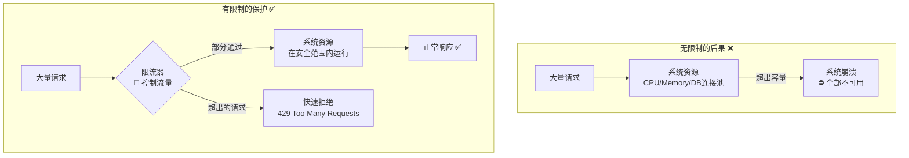
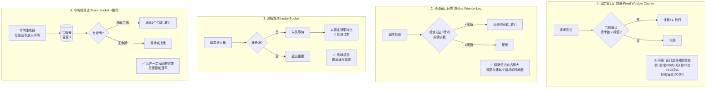

# 弹力设计篇之"限流设计" - [2026重制版]

> **核心变更说明**：本文基于原极客时间专栏第49讲内容进行全面升级，更新至2026年技术栈。主要变更包括：
> - 补充令牌桶/漏桶/滑动窗口算法的现代化实现
> - 新增Resilience4j RateLimiter与Sentinel限流配置
> - 引入分布式限流方案（Redis + Lua脚本）
> - 添加Kubernetes HPA/VPA自动扩缩容配合限流
> - 包含基于响应时间的自适应限流（TCP拥塞控制思想）

---

## 一、问题背景：为什么需要限流

### 1.1 限流的本质

限流（Rate Limiting / Throttling）是一种通过**控制请求速率或并发量**来保护系统不被过载冲垮的技术手段。



### 1.2 限流的四大目标

| 目标 | 描述 | 典型场景 |
|------|------|---------|
| **保护后端服务** | 防止被突发流量压垮 | API网关、微服务入口 |
| **保障SLA承诺** | 确保付费用户的服务质量 | SaaS多租户平台 |
| **应对突发流量** | 平滑处理大促、热点事件 | 双11、秒杀活动 |
| **节约成本** | 避免为峰值过度扩容 | 云原生按需计费 |

### 1.3 真实故障案例

**案例1：2020年某API平台未限流导致数据库宕机**
- **原因**：第三方合作伙伴调用频率从100 QPS突增到50000 QPS
- **影响**：
  - 数据库CPU利用率飙升至100%
  - 连接池耗尽，所有查询阻塞
  - 最终整个平台不可用约30分钟
- **损失**：直接经济损失约50万元，品牌声誉受损

**教训**：**任何对外暴露的接口都应该有明确的限流策略！**

---

## 二、核心概念与架构图

### 2.1 四种经典限流算法



### 2.2 算法对比总结

| 算法 | 精确度 | 内存占用 | 允许突发 | 实现复杂度 | 适用场景 |
|------|--------|---------|---------|-----------|---------|
| **固定窗口** | 低（临界问题） | O(1) | ❌ 不允许 | 极低 | 简单场景，精度要求不高 |
| **滑动窗口日志** | 高 | O(N) N=窗口内请求数 | ❌ 不允许 | 中 | 需要精确控制的场景 |
| **滑动窗口计数器** | 中高 | O(固定) | 部分 | 中 | **生产环境首选** |
| **漏桶** | 高 | O(队列长度) | ❌ 不允许 | 低 | 需要匀速输出的场景 |
| **令牌桶** | 高 | O(1) | ✅ 允许（受桶容量限制） | 中 | **通用推荐** |

### 2.3 多层限流架构

```mermaid
flowchart TB
    subgraph 用户接入层 User Access Layer
        GW[API Gateway<br/>全局限流<br/>IP/User级别]
    end

    subgraph 服务网格层 Service Mesh Layer
        SM[Istio / Envoy<br/>服务级限流<br/>Connection Pool]
    end

    subgraph 应用层 Application Layer
        APP1[Resilience4j<br/>方法级限流]
        APP2[Guava RateLimiter<br/>单机限流]
    end

    subgraph 数据层 Data Layer
        DB[(数据库)<br/>连接池限制]
        CACHE[(Redis)<br/>客户端限制]
    end

    USER[用户请求] --> GW --> SM --> APP1 & APP2 --> DB & CACHE

```

---

## 三、技术实现细节

### 3.1 Resilience4j RateLimiter 配置

#### application.yml
```yaml
resilience4j:
  ratelimiter:
    instances:
      # 核心API的全局限流（严格）
      coreApi:
        limitForPeriod: 100              # 每周期允许100个请求
        limitRefreshPeriod: 1s            # 刷新周期：每秒
        timeoutDuration: 0                # 等待时间：0表示不等待直接拒绝
        registerHealthIndicator: true     # 注册健康检查
        
      # 支付接口的特殊限流（更严格）
      paymentApi:
        limitForPeriod: 20               # 每秒最多20次支付请求
        limitRefreshPeriod: 1s
        timeoutDuration: 100ms            # 允许等待100ms获取令牌
        # 注意: timeoutDuration > 0 时会等待而非立即拒绝
        
      # 外部API调用的宽松限流
      externalApi:
        limitForPeriod: 500              # 每分钟500次
        limitRefreshPeriod: 60s          # 分钟级限流
        timeoutDuration: 0
        
      # 用户维度的动态限流（需自定义实现）
      userBasedApi:
        limitForPeriod: 10               # 每用户每分钟10次
        limitRefreshPeriod: 60s
        timeoutDuration: 0
```

#### Java代码示例
```java
@Service
@RequiredArgsConstructor
@Slf4j
public class RateLimitedService {

    private final ExternalApiClient apiClient;
    private final RateLimiterRegistry rateLimiterRegistry;

    /**
     * 注解方式：简单易用
     */
    @RateLimiter(name = "coreApi", fallbackMethod = "fallbackGetData")
    public DataResponse getData(String id) {
        log.info("Processing request for id: {} (rate limited)", id);
        return apiClient.fetchData(id);
    }

    /**
     * 限流触发时的降级方法
     */
    public DataResponse fallbackGetData(String id, RequestNotPermittedException e) {
        log.warn("Rate limit exceeded for id={}", id);
        
        // 返回降级数据或提示用户稍后重试
        return DataResponse.rateLimited(
            "Too many requests, please try again later",
            429  // HTTP 429 Status Code
        );
    }

    /**
     * 编程式方式：更灵活的控制
     */
    public PaymentResult processPayment(PaymentRequest request) {
        RateLimiter rateLimiter = rateLimiterRegistry.rateLimiter("paymentApi");

        // 装饰Supplier
        Supplier<PaymentResult> supplier = RateLimiter.decorateSupplier(rateLimiter, () -> {
            log.info("Payment request permitted (rate limited)");
            return apiClient.charge(request);
        });

        try {
            return supplier.get();
        } catch (RequestNotPermittedException e) {
            // 被限流了
            log.warn("Payment rate limit exceeded! WaitTime={}ms",
                     e.getWaitDuration().toMillis());

            // 可选：返回具体还需要等待多久
            long waitMs = e.getWaitDuration().toMillis();

            return PaymentResult.rateLimited(
                String.format("Payment service busy, please wait %dms", waitMs),
                waitMs
            );
        }
    }
}
```

### 3.2 分布式限流实现（Redis + Lua）

对于多实例部署的应用，单机限流不够用，需要**分布式限流**：

```java
/**
 * 基于Redis的滑动窗口限流器
 * 
 * 使用Lua脚本保证原子性
 */
@Service
@RequiredArgsConstructor
@Slf4j
public class DistributedRateLimiter {

    private final StringRedisTemplate redisTemplate;
    
    /** Lua脚本：原子性的限流检查和计数 */
    private static final String RATE_LIMIT_SCRIPT =
        "local key = KEYS[1] " +
        "local limit = tonumber(ARGV[1]) " +
        "local window = tonumber(ARGV[2]) " +
        "local now = tonumber(ARGV[3]) " +
        "" +
        "-- 清除过期的窗口数据 " +
        "redis.call('ZREMRANGEBYSCORE', key, '-inf', now - window) " +
        "" +
        "-- 获取当前窗口内的请求数 " +
        "local current = redis.call('ZCARD', key) " +
        "" +
        "if current < limit then " +
        "   -- 未超过限制，计数并放行 " +
        "   redis.call('ZADD', key, now, now .. ':' .. math.random()) " +
        "   redis.call('PEXPIRE', key, window) " +
        "   return {1, limit - current - 1}  -- 返回{允许, 剩余额度} " +
        "else " +
        "   -- 超过限制，拒绝 " +
        "   local ttl = redis.call('PTTL', key) " +
        "   return {0, ttl}  -- 返回{拒绝, 重试等待时间(ms)} " +
        "end";

    /**
     * 检查是否允许通过（滑动窗口算法）
     *
     * @param key 限流键（如 "ratelimit:user:123:api:order"）
     * @param limit 时间窗口内的最大请求数
     * @param windowSeconds 窗口大小（秒）
     * @return RateLimitResult 包含是否允许和剩余信息
     */
    public RateLimitResult tryAcquire(String key, int limit, int windowSeconds) {
        long now = System.currentTimeMillis();
        
        DefaultRedisScript<List<Long>> script = new DefaultRedisScript<>();
        script.setScriptText(RATE_LIMIT_SCRIPT);
        script.setResultType(List.class);

        // 执行Lua脚本
        List<Long> result = redisTemplate.execute(
            script,
            Collections.singletonList(getKey(key)),  // KEYS[1]
            String.valueOf(limit),                  // ARGV[1]: 限制数
            String.valueOf(windowSeconds * 1000),    // ARGV[2]: 窗口(毫秒)
            String.valueOf(now)                      // ARGV[3]: 当前时间戳
        );

        boolean allowed = result.get(0) == 1;
        long remaining = result.get(1);

        if (allowed) {
            log.debug("Rate limit check passed: key={}, remaining={}", key, remaining);
        } else {
            log.warn("Rate limit exceeded: key={}, retryAfter={}ms", key, remaining);
        }

        return RateLimitResult.builder()
            .allowed(allowed)
            .remaining(remaining)
            .key(key)
            .limit(limit)
            .windowSeconds(windowSeconds)
            .build();
    }

    private String getKey(String key) {
        return "ratelimit:" + key;
    }
}

/**
 * 使用示例：用户维度限流
 */
@RestController
@RequestMapping("/api/orders")
public class OrderController {

    private final DistributedRateLimiter rateLimiter;

    @PostMapping
    public ResponseEntity<?> createOrder(
            @RequestBody CreateOrderRequest request,
            @RequestHeader("X-User-ID") String userId) {

        // 构造限流Key：用户ID + API路径
        String limitKey = String.format("user:%s:api:POST:/orders", userId);
        
        // 检查限流：每用户每分钟最多10次下单
        RateLimitResult result = rateLimiter.tryAcquire(limitKey, 10, 60);

        if (!result.isAllowed()) {
            // 返回429 + Retry-After头
            return ResponseEntity.status(HttpStatus.TOO_MANY_REQUESTS)
                .header("X-RateLimit-Limit", "10")
                .header("X-RateLimit-Remaining", "0")
                .header("Retry-After", String.valueOf(result.getRetryAfterMs() / 1000))
                .body(ErrorResponse.rateLimited("Too many requests"));
        }

        // 正常处理业务逻辑
        OrderResponse order = orderService.createOrder(request);
        
        return ResponseEntity.ok()
            .header("X-RateLimit-Limit", "10")
            .header("X-RateLimit-Remaining", String.valueOf(result.getRemaining()))
            .body(order);
    }
}
```

### 3.3 Istio Service Mesh 层面限流

```yaml
# istio-rate-limit.yaml
# 使用Envoy的Local Rate Limiting（全局限流）
apiVersion: networking.istio.io/v1beta1
kind: EnvoyFilter
metadata:
  name: order-service-ratelimit
  namespace: istio-system
spec:
  workloadSelector:
    labels:
      app: order-service
  configPatches:
  - applyTo: HTTP_FILTER
    match:
      context: SIDECAR_INBOUND
      listener:
        portNumber: 8080
        filterChain:
          filter:
            name: "envoy.filters.network.http_connection_manager"
            subType: 
    patch:
      operation: MERGE
      value:
        name: envoy.filters.http.local_ratelimit
        typed_config:
          "@type": type.googleapis.com/envoy.extensions.filters.http.local_ratelimit.v3.LocalRateLimit
          stat_prefix: http_local_rate_limiter
          token_bucket:
            max_tokens: 100           # 令牌桶容量
            tokens_per_fill: 100
            fill_interval: 1s              # 每1秒填充一次
          filter_enabled:
            runtime_key: local_rate_limit_enabled
            default_value:
              numerator: 100
              denominator: 100
          response_status_code: 429    # 被限流时返回的状态码
          descriptors:
          - entries:
            - key: generic_key
              value: "order_service_limit"  # 通用限流标识
            
---
# 使用Envoy的Global Rate Limiting（需要外部Rate Limit Server）
# 更适合复杂的限流场景（如多维度：IP+User+API）
apiVersion: networking.istio.io/v1beta1
kind: EnvoyFilter
metadata:
  name: global-ratelimit
  namespace: istio-system
spec:
  configPatches:
  - applyTo: NETWORK_FILTER
    match:
      listener:
        portNumber: 8080
        filterChain:
          filter:
            name: "envoy.filters.network.http_connection_manager"
    patch:
      operation: MERGE
      value:
        name: envoy.filters.http.ratelimit
        typed_config:
          "@type": type.googleapis.com/envoy.extensions.filters.http.ratelimit.v3.RateLimit
          domain: "ecommerce-ratelimit"  # 域名，对应Rate Limit Server配置
          failure_mode_deny: false       # Rate Limit Server不可达时不拒绝
          rate_limit_service:
            grpc_service:
              envoy_grpc:
                cluster_name: rate_limit_cluster  # 外部gRPC服务
                authority: ratelimit.example.com
            transport_api_version: V3
          timeout:
            seconds: 1
          rate_limits:
          - unit_name: "per_minute"       # 限流维度名称
            actions:
            - { generic_key: { descriptor_value: "orders" } }  # 匹配所有订单相关请求
```

### 3.4 自适应限流（基于响应时间）

借鉴TCP拥塞控制的思想，根据后端服务的实时响应时间动态调整限流阈值：

```java
/**
 * 自适应限流器实现
 * 
 * 思路：
 * 1. 监控最近N个请求的响应时间
 * 2. 计算P99延迟
 * 3. 如果P99 > 阈值，降低限流额度（类似TCP的Multiplicative Decrease）
 * 4. 如果P99 < 阈值，缓慢增加限流额度（Additive Increase）
 */
@Component
public class AdaptiveRateLimiter {

    private final ConcurrentMap<String, AdaptiveState> stateMap = new ConcurrentHashMap<>();
    
    private static final double INCREASE_FACTOR = 1.05;   // 增加5%（AI）
    private static final double DECREASE_FACTOR = 0.8;    // 减少20%（MD）
    private static final long MIN_QPS = 10;               // 最小QPS下限
    private static final long MAX_QPS = 10000;             // 最大QPS上限
    private static final long LATENCY_THRESHOLD_MS = 500;  // P99延迟阈值
    
    /**
     * 检查是否允许通过（自适应限流）
     */
    public synchronized AdaptiveResult checkAdaptive(String serviceKey) {
        AdaptiveState state = stateMap.computeIfAbsent(serviceKey, k -> 
            new AdaptiveState(MAX_QPS / 2)  // 初始值为最大值的一半
        );

        long now = System.currentTimeMillis();
        
        // 记录本次请求
        state.recordRequest(now);
        
        // 检查是否超过当前限额
        if (state.getCurrentQps() > state.getAllowedQps()) {
            return AdaptiveResult.rejected(state.getAllowedQps(), calculateRetryAfter(state));
        }

        // 放行
        state.incrementAllowed();
        return AdaptiveResult.allowed(state.getAllowedQps());
    }

    /**
     * 根据响应时间调整限流额度（应该在请求完成后调用）
     */
    public synchronized void recordLatency(String serviceKey, long latencyMs) {
        AdaptiveState state = stateMap.get(serviceKey);
        if (state == null) return;

        state.recordLatency(latencyMs);

        // 计算最近的P99延迟
        long p99 = state.getP99Latency();

        if (p99 > LATENCY_THRESHOLD_MS) {
            // 响应太慢：减少额度（乘法递减）
            long newAllowed = Math.max(MIN_QPS, (long)(state.getAllowedQps() * DECREASE_FACTOR));
            state.setAllowedQps(newAllowed);
            
            log.info("[AdaptiveRateLimit] Decreasing QPS for {}: {} -> {} (p99={}ms)",
                     serviceKey, state.getAllowedQps(), newAllowed, p99);
        } else {
            // 响应正常：缓慢增加额度（线性增长）
            long newAllowed = Math.min(MAX_QPS, (long)(state.getAllowedQps() * INCREASE_FACTOR));
            state.setAllowedQps(newAllowed);
            
            if (state.getRequestCount() % 100 == 0) {  // 每100次打印一次
                log.debug("[AdaptiveRateLimit] Increasing QPS for {}: {} -> {} (p99={}ms)",
                         serviceKey, state.getAllowedQps(), newAllowed, p99);
            }
        }
    }

    @Data
    private static class AdaptiveState {
        private volatile long allowedQps;
        private final LongAdder requestCounter = new LongAdder();
        private final LongAdder allowedCounter = new LongAdder();
        private final CircularArray latencyHistory = new CircularArray(1000);  // 最近1000个请求的延迟
        private long lastAdjustTime;
        
        // ... 实现略 ...
    }
}
```

---

## 四、方案对比表格

### 4.1 限流工具/框架对比

| 工具 | 类型 | 语言 | 粒度 | 分布式支持 | 适用场景 |
|------|------|------|------|-----------|---------|
| **Resilience4j** | 应用库 | Java | 方法级 | ❌ 单机 | Java微服务应用内部 |
| **Guava RateLimiter** | 应用库 | Java | 单机 | ❌ 单机 | 简单Java应用 |
| **Bucket4j** | 应用库 | Java | 多种 | ✅ Redis/Hazelcast | Java分布式应用 |
| **Sentinel** | 应用框架 | Java | 方法/资源级 | ✅ 控制台规则推送 | 阿里生态、复杂规则 |
| **Istio/Envoy** | Sidecar | 无 | 服务级 | ✅ 全局 | Kubernetes + Service Mesh |
| **Nginx Limit Req** | 反向代理 | 无 | IP/Server级 | ✅ 全局 | 边缘接入层 |
| **CloudFlare** | CDN/WAF | 无 | 全球 | ✅ 全球 | DDoS防护、全球限流 |

### 4.2 限流维度选择指南

| 维度 | 适用场景 | 实现方式 | 示例 |
|------|---------|---------|------|
| **全局** | 保护整个系统 | API Gateway / Nginx | 全站10000 QPS |
| **用户/IP** | 防止单用户滥用 | Redis + 用户ID | 每用户100次/分钟 |
| **接口/API** | 不同接口不同限制 | 应用注解 | 下单接口50 QPS，查询接口200 QPS |
| **租户** | 多租户SaaS | 数据库分区 + 配额 | VIP租户1000 QPS，普通租户100 QPS |
| **地理** | 区域性限流 | Edge CDN | 亚太区5000 QPS，欧洲区3000 QPS |

---

## 五、实战案例（Case Study）

### 案例：电商平台的四层限流体系

**架构设计**：

| 层级 | 位置 | 限流对象 | 阈值 | 工具 |
|------|------|---------|------|------|
| **L7 接入层** | Nginx/云WAF | 全站总流量 | 50000 QPS | Nginx limit_req_module |
| **L4 网关层** | API Gateway (Kong/Spring Cloud Gateway) | 按IP/User | 100 QPS/user | Kong Plugin / Spring Cloud Gateway Filter |
| **L7 应用层** | 微服务实例 | 按接口 | 50 QPS (下单) | Resilience4j / Sentinel |
| **L4 数据层** | MySQL/Redis | 连接池 | 100 connections | HikariCP / Lettuce |

**关键配置示例**：

```11-Nginx基础概述
# 11-Nginx基础概述.conf - 接入层限流
limit_req_zone $binary_remote_addr zone=ip_limit:10m rate=100r/s;  # 每IP每秒100次
limit_req_zone $server_name zone=global_limit:10m rate=10000r/s;  # 全局每秒10000次

server {
    location /api/ {
        limit_req zone=global_limit burst=200 nodelay;  # 允许突发200
        limit_req zone=ip_limit burst=20 nodelay;         # 每IP突发20
        
        limit_req_status 429;  # 被限流时返回429
        
        proxy_pass http://backend;
    }
}
```

---

## 六、最佳实践清单

### 设计原则

- [ ] **分层限流**：每一层都要有自己的限流保护（网关→应用→数据库）
- [ ] **明确限流维度**：全局/用户/接口/租户，根据业务需求选择
- [ ] **设置合理的阈值**：基于性能测试结果 + 安全余量（通常留20%-50% buffer）
- [ ] **返回友好的错误信息**：429状态码 + Retry-After头 + 人类可读的消息
- [ ] **监控限流指标**：被拒绝的请求数、当前QPS、限流命中率
- [ ] **支持动态调整**：通过配置中心/Feature Flag热更新限流参数

### 反模式（Anti-Patterns）

| 反模式 | 问题 | 正确做法 |
|--------|------|---------|
| **只限流不限容** | 限流后请求被拒绝，用户体验差 | 限流 + 自动扩容（HPA）结合使用 |
| **阈值设置过高** | 起不到保护作用，系统仍可能被压垮 | 基于压力测试设定合理阈值 |
| **忽略限流告警** | 不知道何时被限流、被谁限流 | 监控429错误率，设置告警阈值 |
| **单点限流** | 只在网关限流，应用层裸奔 | 多层限流，纵深防御 |
| **硬编码阈值** | 修改需要重新部署 | 使用配置中心动态调整 |

---

## 七、延伸学习资源

### 官方文档

1. **Resilience4j RateLimiter**: https://resilience4j.readme.io/docs/ratelimiter
2. **Istio Rate Limiting**: https://istio.io/latest/docs/tasks/rate-limiting/
3. **Nginx Rate Limiting**: https://docs.11-Nginx基础概述.com/11-Nginx基础概述/http/ngx_http_limit_req_module/

### 推荐阅读

1. **《System Design Interview》** - Rate Limiter章节
2. **AWS Architecture Blog** - Using API Gateway Throttling
3. **Stripe Blog** - Designing Robust & Scalable Rate Limiting

---

## 八、总结

本文全面介绍了分布式系统中的限流设计。核心要点：

1. **核心理念**："Better to reject some requests than to crash the whole system."（拒绝部分请求好过整个系统崩溃。）
2. **算法选择**：
   - **精确控制**：滑动窗口计数器（生产环境最常用）
   - **削峰填谷**：漏桶算法（适合匀速输出场景）
   - **允许突发**：令牌桶算法（**通用推荐**，平衡了精度和灵活性）
3. **技术选型**：
   - **Java应用内部**：**Resilience4j** 或 **Sentinel**
   - **Service Mesh**：**Istio Local/Global Rate Limiting**
   - **边缘接入**：**Nginx** 或 **CloudFlare WAF**
   - **分布式场景**：**Redis + Lua脚本**（自研或使用Bucket4j）
4. **最佳实践**：
   - **多层限流**：网关 → 应用 → 数据库，层层设防
   - **多维限流**：全局 + 用户 + 接口 + 租户
   - **动态可配**：支持热更新，无需重启
   - **友好降级**：429 + Retry-After + 清晰的错误消息
5. **2026趋势**：
   - **自适应限流**：基于实时指标自动调整阈值
   - **AI驱动的智能限流**：预测流量模式，提前限流
   - **Serverless自动限流**：FaaS平台原生能力

**记住**：限流不是目的而是手段——目的是在**保障系统稳定**的前提下，尽可能多地服务合法请求。好的限流策略应该是**透明的**（用户几乎感知不到）、**自适应的**（能根据负载动态调整）、**可观测的**（有完善的监控和告警）。

---

**参考资料来源**：
- [Resilience4j Official Documentation](https://resilience4j.readme.io/)
- [Istio Rate Limiting Documentation](https://istio.io/latest/docs/tasks/rate-limiting/)
- [Nginx Rate Limiting Module](https://docs.11-Nginx基础概述.com/11-Nginx基础概述/http/ngx_http_limit_req_module/)
- [Bucket4j - Java Distributed Rate Limiting](https://bucket4j.com/)
- [CNCF Cloud Native Landscape](https://landscape.cncf.io/)
