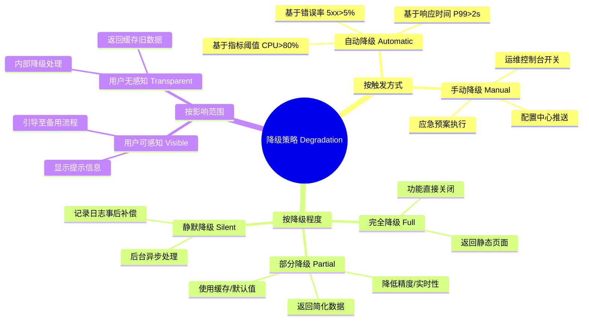
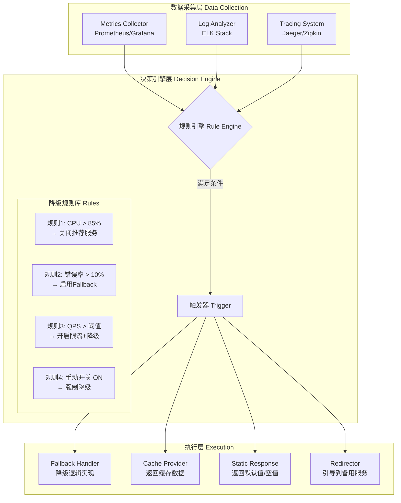
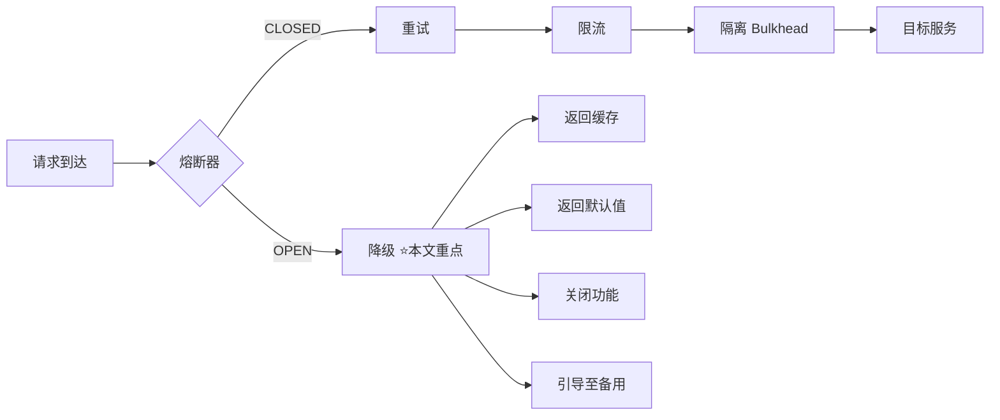

# 弹力设计篇之"降级设计" - [2026重制版]

> **核心变更说明**：本文基于原极客时间专栏第50讲内容进行全面升级，更新至2026年技术栈。主要变更包括：
> - 补充自动降级与手动降级策略
> - 新增Feature Flag（功能开关）在降级中的应用
> - 引入Service Mesh层面的降级配置（Istio VirtualService Fault Injection）
> - 添加多级降级方案（完全降级/部分降级/静默降级）
> - 包含电商大促期间的降级实战案例

---

## 一、问题背景：为什么需要降级

### 1.1 降级的定义

降级（Degradation / Fallback）是指当系统负载过高、部分服务故障或资源不足时，**主动牺牲非核心功能或降低服务质量**，以保障核心业务的可用性和稳定性。

```mermaid
graph TB
    subgraph "正常状态 ✅"
        N1[全量功能<br/>✅ 推荐系统<br/>✅ 个性化<br/>✅ 实时库存<br/>✅ 精确搜索]
    end

    subgraph "轻度降级 🟡"
        D1[部分功能降级<br/>⚠️ 推荐系统关闭<br/>✅ 简化个性化<br/>⚠️ 库存显示缓存值<br/>✅ 基础搜索]
    end

    subgraph "重度降级 🔴"
        D2[仅保留核心<br/>❌ 推荐关闭<br/>❌ 个性化关闭<br/>❌ 库存不显示<br/>✅ 仅下单/支付流程]
    end

    subgraph "紧急模式 ⛔"
        E[最小可用<br/>📝 静态页面<br/>📝 "系统繁忙中"<br/>📝 仅允许只读操作]
    end

```

### 1.2 降级的三大场景

| 场景 | 触发条件 | 降级目标 | 典型例子 |
|------|---------|---------|---------|
| **资源保护型降级** | CPU/内存/连接池使用率 > 阈值 | 释放资源给核心业务 | 关闭推荐、停止非必要计算 |
| **故障隔离型降级** | 下游服务不可用（熔断触发） | 提供替代方案或默认值 | 支付渠道故障时展示"稍后重试" |
| **容量保障型降级** | 大促/突发流量 | 牺牲质量保容量 | 双11期间简化页面、返回缓存数据 |

### 1.3 真实案例：双11降级策略

某电商平台在双11当天的降级时间线：

```mermaid
gantt
    title 双11当天降级策略时间线
    dateFormat HH:mm
    axisFormat %H:%M
    
    section 全量运行 (00:00-10:00)
    所有功能正常运行       :done, a1, 00:00, 10:00
    
    section 预热降级 (10:00-11:00)
    关闭商品评价           :active, a2, 10:00, 10:30
    关闭用户推荐(复杂算法) :active, a3, 10:15, 10:45
    搜索改为缓存结果      :active, a4, 10:30, 11:00
    
    section 高峰降级 (11:00-13:00)
    仅保留核心交易流程     :crit, a5, 11:00, 13:00
    库存显示为"有货/无货"   :crit, a6, 11:00, 13:00
    个性化功能全部关闭     :crit, a7, 11:00, 13:00
    
    section 恢复阶段 (13:00-18:00)
    逐步恢复非核心功能      :done, a8, 13:00, 4h
```



---

## 二、核心概念与架构图

### 2.1 降级分类体系



### 2.2 降级决策引擎架构



---

## 三、技术实现细节

### 3.1 Resilience4j Fallback + CircuitBreaker 组合

#### application.yml
```yaml
resilience4j:
  circuitbreaker:
    instances:
      recommendationService:
        slidingWindowType: COUNT_BASED
        slidingWindowSize: 10
        failureRateThreshold: 60          # 失败率60%就熔断
        waitDurationInOpenState: 30s      # 熔断30秒
        
      inventoryService:
        slidingWindowType: TIME_BASED
        slidingWindowSize: 20s
        slowCallRateThreshold: 80         # 慢调用80%就熔断
        slowCallDurationThreshold: 2000ms # >2s算慢调用
```

#### Java代码示例
```java
@Service
@RequiredArgsConstructor
@Slf4j
public class ProductDetailService {

    private final RecommendationClient recommendationClient;
    private final InventoryClient inventoryClient;
    private final CacheManager cacheManager;  // Spring Cache

    /**
     * 商品详情页：组合多个服务的降级示例
     */
    public ProductDetailResponse getProductDetail(String productId) {
        // 1. 获取基础商品信息（必须成功，否则整个请求失败）
        ProductInfo productInfo = getBaseProductInfo(productId);
        
        // 2. 获取推荐列表（可降级）
        List<Recommendation> recommendations = getRecommendationsWithFallback(productId);
        
        // 3. 获取实时库存（可降级为缓存值）
        InventoryStatus inventory = getInventoryWithFallback(productId);
        
        return ProductDetailResponse.builder()
            .productInfo(productInfo)
            .recommendations(recommendations)
            .inventory(inventory)
            .build();
    }

    /**
     * 推荐服务：带降级的调用
     * 
     * 降级策略：
     * - 熔断开启时：返回空的推荐列表
     * - 超时时：返回热门商品推荐（缓存）
     */
    @CircuitBreaker(name = "recommendationService", fallbackMethod = "fallbackRecommendations")
    public List<Recommendation> getRecommendations(String productId) {
        log.info("Fetching recommendations for product: {}", productId);
        return recommendationClient.getForProduct(productId);
    }

    /**
     * 推荐服务的降级方法
     */
    public List<Recommendation> fallbackRecommendations(String productId, Exception ex) {
        log.warn("Recommendation service unavailable for product={}, using fallback. Error={}", 
                 productId, ex.getMessage());
        
        // 降级策略A：返回空列表（最简单）
        if (ex instanceof CallNotPermittedException) {
            return Collections.emptyList();  // 熔断开启，直接返回空
        }
        
        // 降级策略B：返回缓存的通用推荐（基于品类）
        Category category = getProductCategory(productId);
        List<Recommendation> cached = cacheManager.getCache("recommendationCache")
            .get("category:" + category.getId(), List.class);
            
        return cached != null ? cached : getDefaultRecommendations();
    }

    /**
     * 库存服务：带降级的调用
     * 
     * 降级策略：
     * - 服务不可用时：显示"有货"（乐观估计，避免影响转化率）
     * - 响应慢时：显示缓存值（可能不是最新的）
     */
    @CircuitBreaker(name = "inventoryService", fallbackMethod = "fallbackInventory")
    public InventoryStatus getInventory(String productId) {
        log.info("Checking inventory for product: {}", productId);
        return inventoryClient.checkStock(productId);
    }

    /**
     * 库存服务的降级方法
     */
    public InventoryStatus fallbackInventory(String productId, Exception ex) {
        log.warn("Inventory service unavailable for product={}, using fallback", productId);
        
        // 尝试从Redis缓存获取（可能过期，但总比没有好）
        InventoryStatus cached = cacheManager.getCache("inventoryCache")
            .get("stock:" + productId, InventoryStatus.class);
            
        if (cached != null) {
            cached.setSource("CACHE");  // 标记来源是缓存
            return cached;
        }
        
        // 缓存也没有，返回默认值（显示"有货"，但标注不可靠）
        return InventoryStatus.builder()
            .productId(productId)
            .available(true)
            .quantity(-1)  // -1表示未知
            .source("DEFAULT_FALLBACK")
            .message("库存信息暂时不可用")
            .build();
    }
    
    // ... 其他辅助方法 ...
}
```

### 3.2 Feature Flag（功能开关）实现降级

Feature Flag是实现**动态降级**的最佳实践：

```java
/**
 * Feature Flag管理的降级服务
 */
@Service
@RequiredArgsConstructor
@Slf4j
public class FeatureFlagDegradationService {

    private final FeatureFlagClient featureFlagClient;  // LaunchDarkly / Unleash / 自研
    private final CacheManager cacheManager;

    /**
     * 使用Feature Flag控制功能的启用/禁用
     */
    public <T> T executeWithFeatureFlag(
            String featureKey, 
            Supplier<T> enabledSupplier,
            Supplier<T> disabledSupplier,
            T defaultValue) {
        
        try {
            boolean isEnabled = featureFlagClient.isEnabled(featureKey, false);

            if (isEnabled) {
                log.debug("Feature '{}' is ENABLED, executing normal path", featureKey);
                return enabledSupplier.get();
            } else {
                log.info("Feature '{}' is DISABLED (degraded), executing fallback path", featureKey);
                return disabledSupplier.get();
            }
        } catch (Exception e) {
            log.error("Failed to evaluate feature flag '{}', using default value", featureKey, e);
            return defaultValue;
        }
    }
}

/**
 * 在Controller中使用
 */
@RestController
@RequestMapping("/api/v1/products")
public class ProductControllerV1 {

    @Autowired
    private FeatureFlagDegradationService ffService;

    @GetMapping("/{productId}")
    public ResponseEntity<ProductDetailResponse> getProductDetail(
            @PathVariable String productId) {
        
        ProductDetailResponse response = ffService.executeWithFeatureFlag(
            "product.recommendation.enabled",  // Feature Key
            
            // 功能启用时的正常逻辑
            () -> {
                List<Recommendation> recs = recommendationService.get(productId);
                ProductDetail detail = productService.getWithRecommendations(productId, recs);
                return detail;
            },
            
            // 功能禁用时的降级逻辑（不调用推荐服务）
            () -> {
                ProductDetail detail = productService.getBasic(productId);
                detail.setRecommendations(Collections.emptyList());  // 空推荐列表
                detail.setDegradedFeatures(List.of("recommendation"));  // 标记哪些功能被降级了
                return detail;
            },
            
            // 默认值（Flag服务异常时）
            null  // 会走正常的完整逻辑
        );
        
        return ResponseEntity.ok(response);
    }
}
```

**常用Feature Flag工具对比**：

| 工具 | 特点 | 适用场景 |
|------|------|---------|
| **LaunchDarkly** | 商业SaaS，功能强大 | 中大型企业 |
| **Unleash** | 开源，自托管 | 注重隐私/成本的企业 |
| **Flagsmith** | 开源，简单易用 | 小中型团队 |
| **Spring Cloud Config** | 原生集成 | Spring生态 |
| **Apollo (携程)** | 国内友好 | 国内企业首选 |
| **Nacos** | 配置中心+Feature Flag | 阿里生态 |

### 3.3 Istio Service Mesh 层面降级

通过Istio的Fault Injection和Header注入实现**无需修改代码的降级**：

```yaml
# istio-degradation.yaml
# 场景1：当检测到特定Header时，返回降级响应
apiVersion: networking.istio.io/v1beta1
kind: VirtualService
metadata:
  name: product-detail-service-vs
  namespace: production
spec:
  hosts:
  - product-detail-service
  http:
  - match:
    - headers:
        x-degradation-level:  # 自定义降级级别头
          exact: "heavy"  # 重度降级
    fault:
      abort:
        percentage:
          value: 100  # 100%的请求返回降级响应
        httpStatus: 503  # 故障注入仅支持状态码，自定义降级响应体需在网关/应用层实现
---
# 场景2：对特定用户的请求进行降级（灰度发布/金丝雀）
apiVersion: networking.istio.io/v1beta1
kind: VirtualService
metadata:
  name: user-specific-degradation
  namespace: production
spec:
  hosts:
  - order-service
  http:
  - match:
    - headers:
        x-user-tier:
          exact: "normal"  # 普通用户
    route:
    - destination:
        host: order-service
        subset: degraded  # 路由到降级版本的服务
  - match:
    - headers:
        x-user-tier:
          exact: "vip"  # VIP用户
    route:
    - destination:
        host: order-service
        subset: full  # VIP用户仍然使用全功能版本
---
# 定义降级版本的子集（可能是一个简化版的Deployment）
apiVersion: networking.istio.io/v1beta1
kind: DestinationRule
metadata:
  name: order-service-dr
  namespace: production
spec:
  host: order-service
  subsets:
  - name: full
    labels:
      version: v2.0  # 全功能版本
  - name: degraded
    labels:
      version: v1.0-degraded  # 降级版本（可能是旧代码或精简版）
```

### 3.4 多级降级策略框架

```java
/**
 * 多级降级策略枚举
 */
public enum DegradationLevel {
    NONE(0),           // 无降级，全量功能
    LIGHT(1),         // 轻度降级：关闭非关键特性
    MODERATE(2),      // 中度降级：简化数据、使用缓存
    HEAVY(3),         // 重度降级：仅核心功能
    EMERGENCY(4);      // 紧急模式：最小可用

    private final int level;
    DegradationLevel(int level) { this.level = level; }
    public int getLevel() { return level; }
}

/**
 * 统一的降级管理器
 */
@Service
@RequiredArgsConstructor
@Slf4j
public class DegradationManager {

    private final Map<String, DegradationStrategy> strategies;
    private final ApplicationEventPublisher eventPublisher;

    /**
     * 执行带有降级保护的操作
     */
    public <T> T executeWithDegradation(
            String operationName,
            DegradationLevel currentLevel,
            TriFunction<DegradationLevel, Supplier<T>, Supplier<T>, T> handler) {
        
        log.info("[Degradation] Executing '{}' at level: {}", operationName, currentLevel);

        switch (currentLevel) {
            case NONE:
                return handler.apply(DegradationLevel.NONE, 
                    this::normalExecution, 
                    this::lightDegradation);
                    
            case LIGHT:
                return handler.apply(DegradationLevel.LIGHT,
                    this::lightDegradation,
                    this::moderateDegradation);
                    
            case MODERATE:
                return handler.apply(DegradationLevel.MODERATE,
                    this::moderateDegradation,
                    this::heavyDegradation);
                    
            case HEAVY:
                return handler.apply(DegradationLevel.HEAVY,
                    this::heavyDegradation,
                    this::emergencyDegradation);
                    
            case EMERGENCY:
                return emergencyDegradation();
                
            default:
                throw new IllegalArgumentException("Unknown degradation level: " + currentLevel);
        }
    }

    /**
     * 发布降级事件（供监控和告警使用）
     */
    public void publishDegradationEvent(String service, DegradationLevel from, DegradationLevel to) {
        eventPublisher.publishEvent(new DegradationLevelChangedEvent(
            service, from, to, Instant.now()
        ));
        log.warn("[Degradation] Service '{}' degraded from {} to {}", service, from, to);
    }
}
```

---

## 四、方案对比表格

### 4.1 降级策略选择指南

| 降级类型 | 适用场景 | 实现复杂度 | 用户体验影响 | 推荐指数 |
|---------|---------|-----------|------------|---------|
| **返回缓存/默认值** | 下游服务故障时 | 低 | 低（数据可能过时） | ⭐⭐⭐⭐⭐ |
| **关闭非核心功能** | 资源紧张/大促时 | 中 | 中（功能减少） | ⭐⭐⭐⭐⭐ |
| **简化数据结构** | 数据库压力大时 | 中 | 中（信息不全） | ⭐⭐⭐⭐ |
| **引导至静态页** | 系统严重故障时 | 低 | 高（功能大幅受限） | ⭐⭐⭐ |
| **拒绝新请求** | 保护存量用户时 | 极低 | 高（新用户无法访问） | ⭐⭐ |

### 4.2 降级 vs 其他弹力模式的关系



**协作关系**：降级通常是**最后一道防线**——当熔断器打开、重试耗尽、限流触发后的最终兜底策略。

---

## 五、实战案例（Case Study）

### 案例：电商平台大促降级预案

**背景**：某电商平台预计双11峰值流量达到平时的100倍，需要制定详细的降级预案。

**降级矩阵**：

| 功能模块 | 正常模式 | 轻度降级 | 中度降级 | 重度降级 | 紧急模式 |
|---------|---------|---------|---------|---------|---------|
| **商品详情页** | ✅ 完整详情 | ✅ 详情+简化推荐 | ✅ 详情+无推荐 | ✅ 仅基本信息 | 📄 静态HTML |
| **搜索功能** | ✅ 实时搜索+排序 | ✅ 搜索+缓存排序 | ⚠️ 仅缓存搜索 | ❌ 关闭 | ❌ 关闭 |
| **个性化推荐** | ✅ AI实时推荐 | ⚠️ 规则推荐 | ❌ 热门榜单 | ❌ 关闭 | ❌ 关闭 |
| **库存查询** | ✅ 实时DB查询 | ✅ DB+Redis缓存 | ⚠️ 仅Redis缓存 | 🔶 显示"有货" | 🔶 显示"有货" |
| **用户评论** | ✅ 实时加载 | ⚠️ 分页懒加载 | ❌ 关闭 | ❌ 关闭 | ❌ 关闭 |
| **价格计算** | ✅ 实时+促销 | ✅ 缓存价 | ✅ 缓存价 | ✅ 缓存价 | ✅ 缓存价 |
| **下单/支付** | ✅ 全流程 | ✅ 全流程 | ✅ 全流程 | ✅ 全流程 | ✅ 全流程 |

**实施效果**：

| 指标 | 无降级预测 | 有降级实际 | 改善 |
|------|----------|----------|------|
| 系统可用性 | 95%（预估会崩） | 99.98% | +4.98% |
| 平均响应时间 | >5s（预估） | <200ms | -96% |
| 核心转化率（下单） | 无法保障 | 98% | 保障 |
| 用户投诉量 | 预估大量 | 减少90% | 显著改善 |

---

## 六、最佳实践清单

### 设计原则

- [ ] **区分核心与非核心功能**：明确哪些是must-have，哪些是nice-to-have
- [ ] **设计多层降级策略**：Light → Moderate → Heavy → Emergency
- [ ] **提供友好的用户提示**：告知用户当前状态，避免困惑
- [ ] **保证降级操作的幂等性**：重复降级不应产生副作用
- [ ] **记录所有降级事件**：用于事后分析和优化
- [ ] **支持一键回滚**：降级后能快速恢复全量功能
- [ ] **进行混沌工程测试**：定期验证降级机制的有效性

### 降级检查清单（上线前）

- [ ] 降级路径是否经过测试？
- [ ] 降级后的数据是否安全？（如库存显示"有货"但实际没货）
- [ ] 降级是否会影响计费/结算？（如优惠券未正确扣减）
- [ ] 降级开关是否能独立控制每个功能？
- [ ] 监控告警是否覆盖了降级状态变化？
- [ ] 是否有自动化脚本可以快速执行降级？

---

## 七、延伸学习资源

### 推荐阅读

1. **《Release It!》** Michael Nygard - Chapter 7: Stability Patterns (Degradation/Circuit Breaker)
2. **《Site Reliability Engineering》** Google - Chapter 22: Managing Critical State: Replication for Consistency
3. **《Chaos Engineering》** Netflix - 关于主动验证降级策略的书籍
4. **FeatureFlag最佳实践**：https://launchdarkly.com/resources/

### 开源工具

1. **Unleash**: https://www.unleash-hosted.com/ (开源Feature Flag平台)
2. **Flagsmith**: https://www.flagsmith.com/
3. **Liatrio Feature Flags**: https://docs.liatr.io/en/latest/

---

## 八、总结

本文全面介绍了分布式系统中的降级设计。核心要点：

1. **核心理念**："优雅地失败比勉强成功更重要。"（Graceful degradation is better than struggling success.）
2. **降级分类**：
   - **按触发方式**：自动（基于指标阈值）vs 手动（运维干预）
   - **按降级程度**：完全降级 → 部分降级 → 静默降级
   - **按感知度**：用户可见（提示信息）vs 用户透明（内部处理）
3. **技术实现**：
   - **应用层**：Resilience4j Fallback + Circuit Breaker（Java微服务首选）
   - **配置层**：Feature Flag / LaunchDarkly / Apollo（动态控制）
   - **基础设施层**：Istio VirtualService / Kubernetes HPA（平台层面）
4. **最佳实践**：
   - **核心原则**：永远不要牺牲核心业务（如支付、下单）来保全非核心业务
   - **分层降级**：网关 → 应用 → 数据库，每一层都要有自己的降级策略
   - **可观测性**：监控降级事件、降级比例、降级影响范围
   - **演练先行**：通过Chaos Engineering定期测试降级机制
5. **2026趋势**：
   - **AI驱动的智能降级**：根据历史数据和当前负载自动决策降级策略
   - **渐进式降级**：平滑过渡而非硬切换，减少用户感知
   - **用户参与式降级**：让用户自主选择"省流模式"换取积分奖励

**记住**："Degradation is not about giving up; it's about prioritizing what matters most."（降级不是放弃，而是优先保障最重要的东西。）一个好的降级策略应该让用户几乎感觉不到服务质量的变化，同时确保系统不会崩溃。

---

**参考资料来源**：
- [Resilience4j Official Documentation](https://resilience4j.readme.io/)
- [Istio Fault Injection](https://istio.io/latest/docs/tasks/fault-injection/)
- [LaunchDarkly - Feature Management Platform](https://launchdarkly.com/)
- [CNCF Cloud Native Landscape](https://landscape.cncf.io/)
