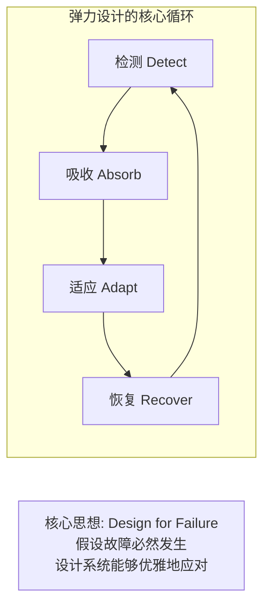
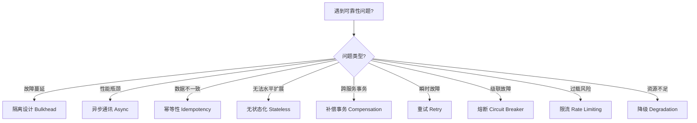
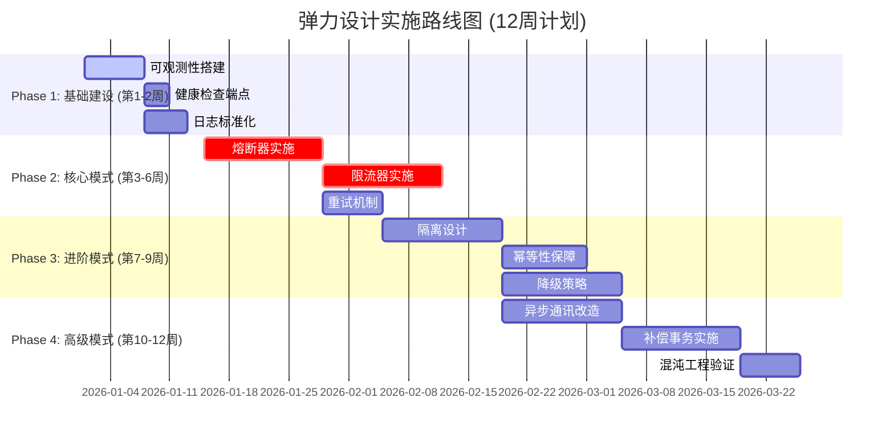
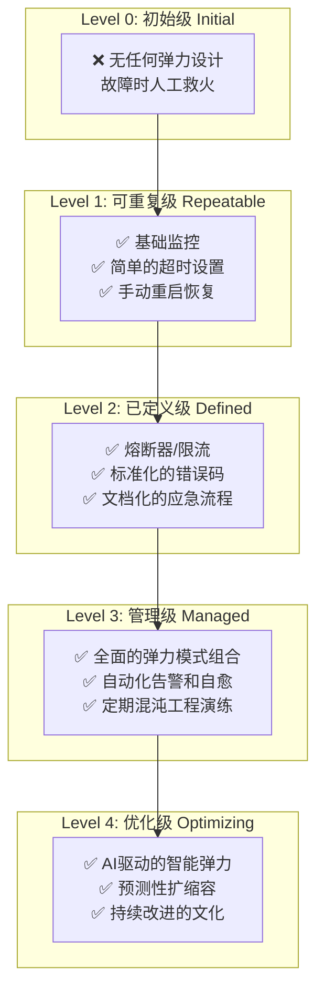
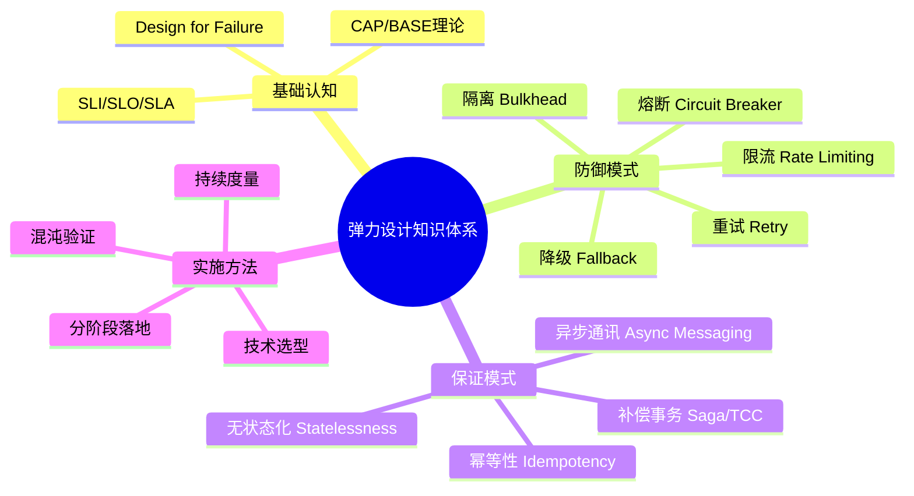

# 弹力设计篇之"弹力设计总结" - [2026重制版]

> **核心变更说明**：本文基于原极客时间专栏第51讲内容进行全面升级，作为弹力设计系列的总结篇。主要变更包括：
> - 系统性回顾全部11种弹力模式及其协作关系
> - 补充2026年最新技术栈选型指南
> - 新增从单体到云原生的演进路线图
> - 引入完整的检查清单和评估框架
> - 提供可落地的实施建议与资源汇总

---

## 一、弹力设计全景回顾

### 1.1 什么是弹力设计

弹力设计（Resilience Engineering）是指系统在面对内部故障、外部攻击、突发流量等各种干扰时，能够**检测异常、吸收冲击、自适应调整并恢复正常运行**的能力。



### 1.2 本系列文章涵盖的11大模式

| 编号 | 模式名称 | 核心目标 | 关键技术 | 难度 |
|------|---------|---------|---------|------|
| **41** | 认识故障和弹力设计 | 建立正确认知 | SLI/SLO/SLA、Chaos Engineering | ⭐ |
| **42** | 隔离设计 (Bulkhead) | 防止故障蔓延 | K8s Namespace/Quota、Resilience4j Bulkhead、Istio DestinationRule | ⭐⭐⭐ |
| **43** | 异步通讯设计 | 解耦、削峰、提升吞吐 | Kafka/Pulsar/RabbitMQ、CloudEvents、Saga | ⭐⭐⭐⭐ |
| **44** | 幂等性设计 | 保证数据一致性 | Snowflake/UUID v7、Redis幂等、数据库唯一约束 | ⭐⭐⭐ |
| **45** | 服务的状态 | 无状态化便于扩展 | K8s Deployment vs StatefulSet、Session/JWT、状态外置化 | ⭐⭐⭐ |
| **46** | 补偿事务 | 分布式事务一致性 | Saga（Choreography/Orchestration）、TCC、Seata、Outbox | ⭐⭐⭐⭐⭐ |
| **47** | 重试设计 | 应对瞬时故障 | Resilience4j Retry、指数退避+Jitter、gRPC重试 | ⭐⭐⭐ |
| **48** | 熔断设计 (Circuit Breaker) | 快速失败保护下游 | Resilience4j CB、Istio OutlierDetection、Hystrix(已停维) | ⭐⭐⭐⭐ |
| **49** | 限流设计 (Rate Limiting) | 控制流量保护系统 | 令牌桶/漏桶算法、Redis分布式限流、Istio Local/Global RL | ⭐⭐⭐⭐ |
| **50** | 降级设计 (Fallback/Degradation) | 牺牲非核心保全核心 | Feature Flag、多级降级策略、Istio Fault Injection | ⭐⭐⭐⭐ |
| **51** | **弹力设计总结** | **系统性整合与落地** | **架构决策框架、实施路线图、评估体系** | ⭐⭐ |

---

## 二、弹力模式的协作关系

### 2.1 执行顺序图

当一次请求到达系统时，各弹力模式按以下顺序协同工作：

```mermaid
flowchart TB
    REQ[📥 用户请求到达] --> L1[L7 接入层<br/>API Gateway / Nginx]

    subgraph 第一道防线：流量控制
        L1 --> RL{限流 Rate Limiter}
        RL -->|通过| AUTH{认证鉴权}
        RL -->|超限| REJECT1[❌ 429 Too Many Requests]
        
        AUTH -->|通过| L2
        AUTH -->|失败| REJECT2[❌ 401/403 Unauthorized]
    end

    subgraph 第二道防线：服务网格层 Service Mesh
        L2[Istio / Envoy Sidecar] --> CB1{熔断器 Circuit Breaker}
        CB1 -->|CLOSED| BH1{隔离 Bulkhead}
        CB1 -->|OPEN| FALLBACK1[降级 Fallback]
        
        BH1 -->|资源可用| APP
        BH1 -->|资源耗尽| FALLBACK2[降级 Fallback]
    end

    subgraph 第三道防线：应用层 Application Layer
        APP[微服务实例] --> RT{重试 Retry}
        RT -->|成功| RESP[✅ 返回结果]
        RT -->|重试耗尽| FALLBACK3[降级 Fallback]
    end

    subgraph 第四道防线：数据层 Data Layer
        APP --> DB[(数据库)]
        APP --> CACHE[(缓存)]
        APP --> MQ[(消息队列)]
        
        DB & CACHE & MQ --> ID{幂等检查 Idempotency}
        ID -->|首次| PROCESS[处理业务逻辑]
        ID -->|重复| RETURN_CACHE[返回缓存结果]
        
        PROCESS --> TX{事务协调 Transaction}
        TX -->|本地事务| COMMIT[提交]
        TX -->|分布式事务| SAGA[Saga补偿]
    end

```

### 2.2 模式选择决策树



---

## 三、2026年技术栈选型指南

### 3.1 Java微服务技术栈推荐

| 能力 | 首选方案 | 备选方案 | 已淘汰/不推荐 |
|------|---------|---------|--------------|
| **熔断器** | Resilience4j 2.x | Sentinel (Alibaba) | ❌ Hystrix (2018停维) |
| **限流** | Resilience4j RateLimiter | Sentinel / Bucket4j | 自研简单实现 |
| **重试** | Resilience4j Retry | Spring Retry | 无退避的重试循环 |
| **隔离** | Resilience4j Bulkhead | HikariCP (DB连接池) | 共享线程池无限制 |
| **降级** | Resilience4j Fallback + Feature Flag | 手动if-else | 硬编码的降级逻辑 |
| **分布式事务** | Seata (AT/TCC/Saga) | Eventuate Tram / Temporal.io | XA两阶段提交 |
| **异步通讯** | Apache Kafka + Spring Kafka | Pulsar / RabbitMQ | 同步阻塞调用 |
| **配置管理** | Nacos / Apollo | Spring Cloud Config | 本地配置文件 |
| **服务发现** | Nacos / Consul | Eureka (维护中) | DNS硬编码 |
| **网关** | Spring Cloud Gateway | Kong / APISIX | Zuul 1.x (过时) |

### 3.2 Kubernetes原生能力利用

| 能力 | K8s原生方案 | 对应的应用层方案 | 建议 |
|------|-----------|----------------|------|
| **健康检查** | Readiness/Liveness Probe | Actuator Health | ✅ 两者都要用 |
| **自动伸缩** | HPA (CPU/Custom Metrics) | Resilience4j (应用级) | ✅ 结合使用 |
| **Pod保护** | Pod Disruption Budget | - | ✅ 必须配置 |
| **资源隔离** | ResourceQuota/LimitRange | Resilience4j Bulkhead | ✅ 平台+应用双层 |
| **网络隔离** | NetworkPolicy | Istio AuthorizationPolicy | ✅ 安全敏感场景 |
| **配置管理** | ConfigMap/Secret | Apollo/Nacos | ✅ 基础设施用K8s，业务用专业工具 |
| **负载均衡** | Service (ClusterIP) | Ribbon (已废弃) | ✅ 用K8s原生或Sidecar |
| **DNS解析** | CoreDNS | - | ✅ 默认即可 |

### 3.3 Service Mesh 选型对比（2026年）

| 特性 | **Istio** (最流行) | **Cilium** (高性能) | **Linkerd** (轻量) |
|------|-------------------|--------------------|------------------|
| **社区成熟度** | ★★★★★ | ★★★★☆ | ★★★☆☆ |
| **性能开销** | 中（Envoy较重） | 低（eBPF加速） | 极低（Rust编写） |
| **学习曲线** | 高 | 中高 | 中 |
| **企业支持** | 多家厂商 | Isovalent (Cisco) | Buoyant |
| **适用规模** | 大型集群 | 大型+需要高性能 | 中小型集群 |
| **中文文档** | 较好 | 一般 | 较少 |
| **推荐场景** | 企业级生产环境 | 高性能/安全要求 | 资源受限环境 |

---

## 四、从0到1的实施路线图

### 4.1 分阶段实施计划



### 4.2 各阶段关键产出物

| 阶段 | 关键产出物 | 验收标准 |
|------|----------|---------|
| **Phase 1** | • Prometheus + Grafana Dashboard<br/>• ELK日志平台<br/>• Jaeger链路追踪<br/>• 统一健康检查规范 | 所有服务都有/metrics、/health、/info端点 |
| **Phase 2** | • Resilience4j集成到所有服务<br/>• 核心接口配置熔断+限流<br/>• 重试策略统一配置<br/>• 弹力指标监控大盘 | 错误率<0.1%，限流命中率<1% |
| **Phase 3** | • 服务间调用隔离<br/>• 关键操作幂等性保障<br/>• 多级降级预案<br/>• Feature Flag平台 | 单点故障不影响其他服务 |
| **Phase 4** | • 核心流程异步化<br/>• 分布式事务方案落地<br/>• Chaos Mesh测试用例库<br/>• 故障演练SOP | MTTR < 5分钟，可用性 > 99.99% |

---

## 五、评估框架与检查清单

### 5.1 弹力成熟度模型（Resilience Maturity Model）



### 5.2 自我评估检查清单

#### 基础设施层（Infrastructure）
- [ ] 所有服务都部署在Kubernetes上并配置了Resource Request/Limit？
- [ ] 配置了Pod Disruption Budget（PDB）防止自愿中断影响可用性？
- [ ] 使用HPA/VPA实现了自动扩缩容？
- [ ] 有跨可用区（Multi-AZ）部署？
- [ ] 数据库有主从复制和自动Failover？

#### 可观测性（Observability）
- [ ] 三大支柱齐全：Metrics（Prometheus）、Logging（ELK）、Tracing（Jaeger）？
- [ ] 定义了SLI/SLO并有对应的告警规则？
- [ ] 有统一的Dashboard展示系统健康度？
- [ ] 关键操作都有结构化日志和Trace ID？

#### 应用层弹力（Application Resilience）
- [ ] 外部调用都配置了合理的Timeout（连接、读取、总体）？
- [ ] 关键依赖配置了Circuit Breaker（如Resilience4j）？
- [ ] 写操作实现了Idempotency（幂等性）？
- [ ] 读操作有合适的Cache策略？
- [ ] 失败时有明确的Fallback（降级）逻辑？

#### 通信层弹力（Communication Resilience）
- [ ] 使用了Service Mesh（如Istio）或SDK实现了服务间通信管控？
- [ ] API Gateway层有限流、认证、路由策略？
- [ ] 异步消息队列用于解耦非实时流程？
- [ ] 消息消费者实现了Exactly-Once语义？

#### 组织与文化（Organization）
- [ ] 有专门的SRE/Platform团队负责可靠性？
- [ ] 定期进行Post-mortem（故障复盘）？
- [ ] 进行Chaos Engineering演练？
- [ ] 有Error Budget机制平衡功能发布和稳定性？

---

## 六、常见误区与避坑指南

### 6.1 十大反模式（Anti-Patterns）

| # | 反模式 | 问题 | 正确做法 |
|---|--------|------|---------|
| 1 | **过度设计** | 引入太多复杂度，维护成本高 | 从实际痛点出发，逐步引入 |
| 2 | **忽略成本** | 为1%的可靠性投入100%的成本 | 基于业务价值做ROI分析 |
| 3 | **只关注技术** | 忽略组织流程和文化 | 人、流程、技术三者并重 |
| 4 | **盲目跟风** | 别人用什么我就用什么 | 基于自身场景选型 |
| 5 | **缺乏度量** | 不知道当前系统的弹性水平 | 建立量化指标和基线 |
| 6 | **不测试弹力** | 设计了但没验证是否有效 | 混沌工程定期演练 |
| 7 | **单一防线** | 只有一层保护 | 多层纵深防御 |
| 8 | **硬编码阈值** | 改参数需重新部署 | 动态配置中心 |
| 9 | **忽视用户体验** | 降级后用户一头雾水 | 友好的提示和引导 |
| 10 | **事后诸葛亮** | 出了问题才想加弹力 | 左移（Shift-Left），设计阶段就考虑 |

### 6.2 成功要素

根据Google SRE团队的经验，成功的弹力设计项目通常具备以下特征：

1. **高层支持**：CTO/VP级别推动，提供资源和授权
2. **小步快跑**：MVP先行，快速迭代，避免大爆炸式改造
3. **度量驱动**：用数据说话，证明改进效果
4. **全员参与**：开发、运维、测试、产品经理共同参与
5. **持续改进**：不是一次性项目，而是持续的过程

---

## 七、延伸学习路径

### 7.1 推荐学习顺序

```
入门阶段（1-2个月）：
├── 《Site Reliability Engineering》（Google SRE书籍）
├── 《Release It!》（Michael Nygard）
├── Resilience4j 官方文档 + 示例代码
└── Kubernetes 官方文档（PDB/HPA/Probe）

进阶阶段（2-3个月）：
├── 《Designing Data-Intensive Applications》（DDIA）
├── 《Microservices Patterns》（Chris Richardson）
├── Istio 实战手册
├── Chaos Engineering 方法论（Gremlin/Chaos Mesh）
└── 分布式事务理论与实践（Seata/Saga）

高级阶段（3-6个月）：
├── CNCF 云原生全景图深度学习
├── eBPF 和 Cilium 网络编程
├── AI for IT Operations (AIOps)
├── 领域驱动设计（DDD）+ 事件风暴
└── 参与开源社区贡献
```

### 7.2 权威资源汇总

#### 官方文档（必读）
| 资源 | 链接 | 说明 |
|------|------|------|
| **CNCF Landscape** | https://landscape.cncf.io/ | 云原生技术全貌 |
| **Kubernetes Docs** | https://kubernetes.io/docs/ | K8s权威文档 |
| **Istio Docs** | https://istio.io/latest/docs/ | Service Mesh首选 |
| **Resilience4j** | https://resilience4j.readme.io/ | Java弹力库 |
| **Prometheus** | https://prometheus.io/docs/ | 监控标准 |
| **OpenTelemetry** | https://opentelemetry.io/ | 可观测性标准 |

#### 经典书籍（强烈推荐）
| 书名 | 作者 | 核心价值 |
|------|------|---------|
| *Site Reliability Engineering* | Google SRE团队 | SRE方法论圣经 |
| *Designing Data-Intensive Applications* | Martin Kleppmann | 分布式系统理论 |
| *Release It!* | Michael Nygard | 弹力设计模式 |
| *Microservices Patterns* | Chris Richardson | 微服务架构实践 |
| *Building Microservices* (2nd Ed.) | Sam Newman | 微服务设计原则 |
| *Chaos Engineering* | Nora Jones et al. | 混沌工程方法 |

#### 在线课程
| 课程 | 平台 | 时长 |
|------|------|------|
| Google Cloud SRE | Coursera | ~20小时 |
| Linux Foundation LFS260 | edX | ~15小时 |
| Istio Service Mesh Fundamentals | Linux Foundation | ~10小时 |

---

## 八、总结与展望

### 8.1 核心要点回顾

经过本系列11篇文章的学习，我们建立了完整的弹力设计知识体系：



### 8.2 2026年及未来趋势

1. **AI驱动的智能运维（AIOps）**
   - 利用机器学习预测故障、自动调优弹力参数
   - 智能根因分析，缩短MTTR

2. **边缘计算的弹力挑战**
   - 资源受限环境下的轻量级弹力方案
   - WASM（WebAssembly）成为新的运行时选择

3. **零信任架构（Zero Trust）**
   - 弹力设计与安全深度融合
   - mTLS + Service Mesh 成为标配

4. **平台工程（Platform Engineering）**
   - 弹力能力作为平台内置特性（Internal Developer Platform）
   - 开发者无需关心底层细节

5. **绿色计算（Green Computing）**
   - 弹力设计不仅要"快"，还要"省"
   - 智能休眠、按需唤醒降低能耗

### 8.3 最终寄语

弹力设计不是一个技术问题，而是一个**系统工程**，涉及：

- 🛠️ **技术**：正确的工具和架构
- 👥 **人员**：具备正确认知的团队
- 📋 **流程**：标准化的操作规程
- 🎯 **文化**：持续改进和学习的心态

正如Amazon CTO Werner Vogels所说：

> **"Everything fails, all the time."**

我们的目标不是消除故障（那是不可能的），而是构建一个**能够优雅应对故障**的系统——这就是弹力设计的终极使命。

希望这个系列能帮助你在构建高可用分布式系统的道路上走得更稳、更远。如果你有任何问题或想要深入探讨某个话题，欢迎随时交流！

---

**系列完结 🎉**

感谢你完整阅读了《弹力设计篇》的全部11篇文章！现在你已经具备了：
- ✅ 系统性的弹力设计知识框架
- ✅ 可落地的技术实施方案
- ✅ 2026年最新的工具和最佳实践
- ✅ 从0到1的完整路线图

下一步行动建议：
1. **评估现状**：使用本文提供的检查清单评估你的系统
2. **识别痛点**：找出最薄弱的环节优先改进
3. **小步快跑**：从一个小的改进开始（比如给一个关键接口加上熔断器）
4. **持续学习**：关注CNCF、Kubernetes、Istio等社区的动态
5. **分享交流**：将所学应用到实践中，并与团队分享

**祝你构建出坚不可摧的弹性系统！💪**

---

**参考资料来源汇总**：
- [Resilience4j Official Documentation](https://resilience4j.readme.io/)
- [Istio Documentation](https://istio.io/latest/docs/)
- [Kubernetes Official Documentation](https://kubernetes.io/docs/)
- [Envoy Proxy Documentation](https://www.envoyproxy.io/docs/envoy/latest/)
- [CNCF Cloud Native Landscape](https://landscape.cncf.io/)
- [Apache Kafka Documentation](https://kafka.apache.org/documentation/)
- [Google SRE Books](https://sre.google/books/)
- [Martin Fowler's Blog - Circuit Breaker](https://martinfowler.com/bliki/CircuitBreaker.html)
- [Chaos Mesh Documentation](https://chaos-mesh.org/)
- [LitmusChaos Documentation](https://litmuschaos.io/)
