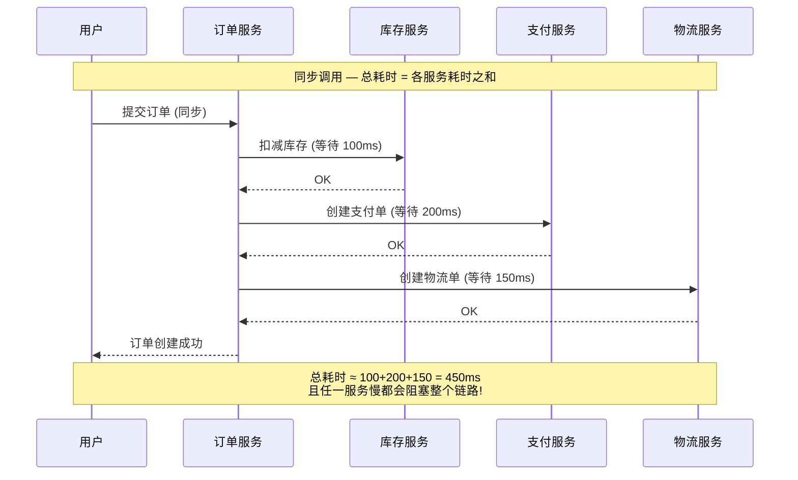
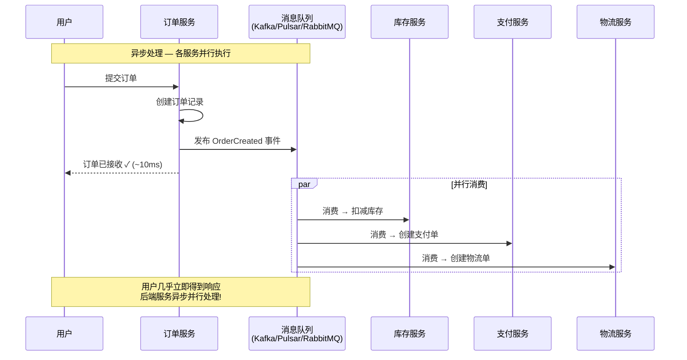
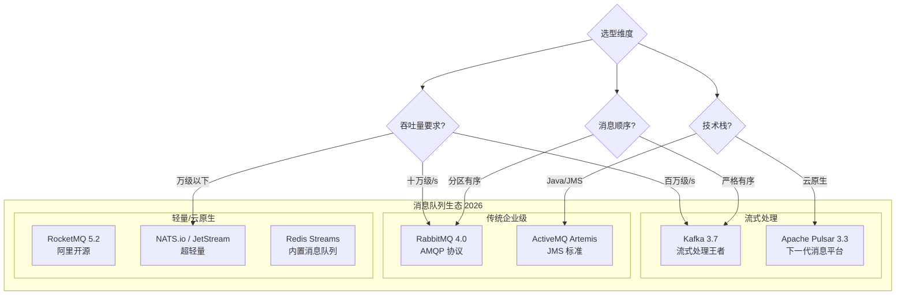
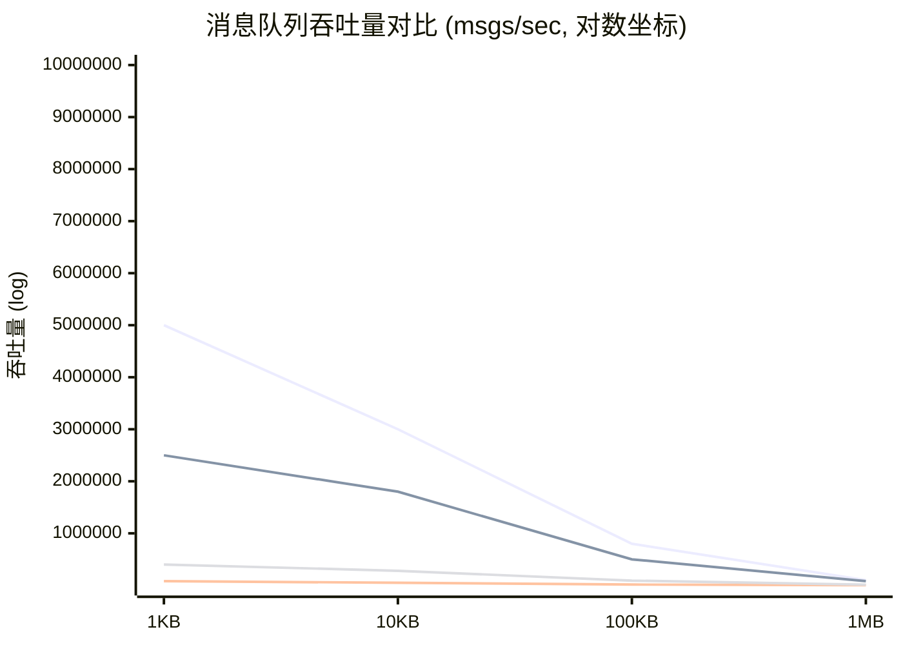
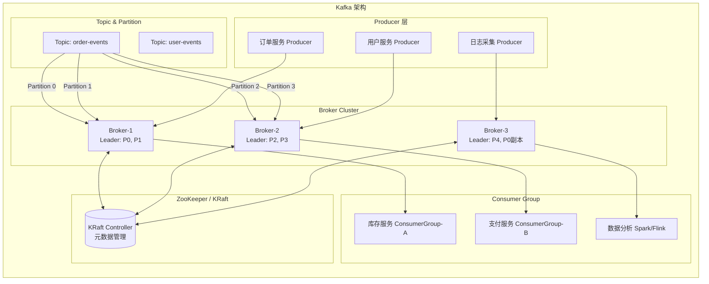
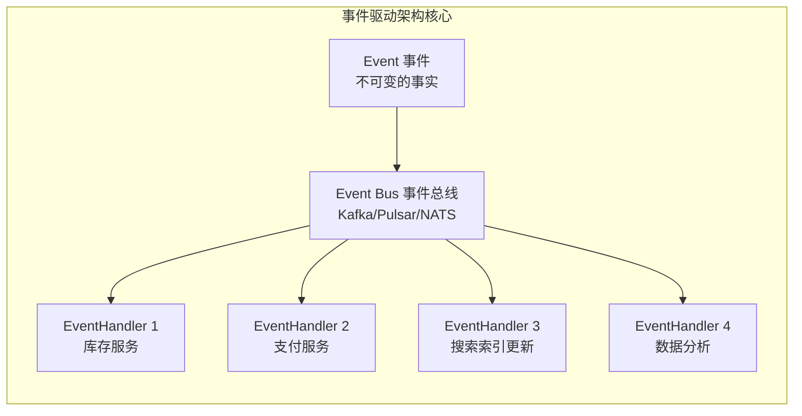
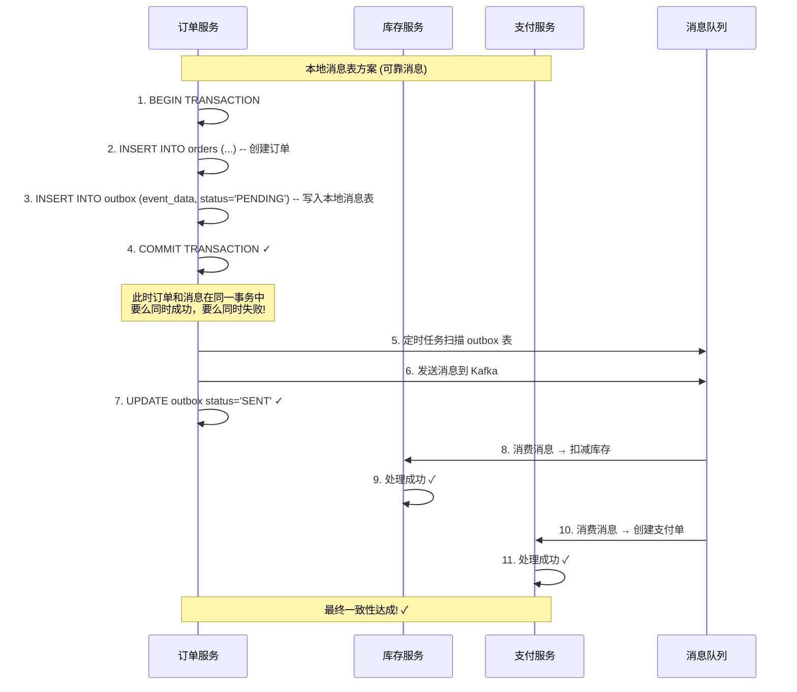
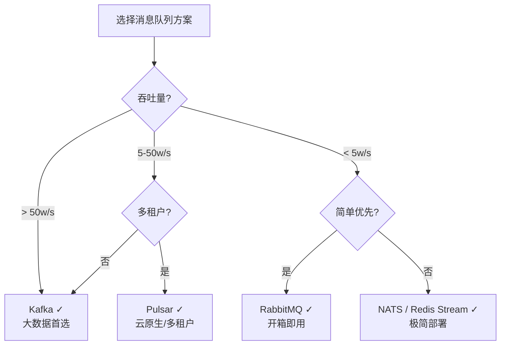

# 性能设计篇之"异步处理" [2026重制版]

> **核心变更说明**：本文基于原极客时间专栏"性能设计篇之异步处理"一讲重写，全面更新至2026年技术栈。新增 Kafka 3.7 / Apache Pulsar 3.3 / RabbitMQ 4.0 深度对比、事件驱动架构(EDA)设计模式、消息队列选型决策树、完整的生产级配置示例和性能基准测试数据。

---

## 一、问题背景：为什么需要异步处理

### 1.1 同步调用的困境

在传统的同步调用模式下，服务 A 调用服务 B 时必须**等待 B 完成处理后才能继续**，这种串行执行方式在分布式系统中会导致严重的性能瓶颈。



### 1.2 异步处理的威力

异步处理将"请求-响应"模式转变为"发布-订阅"模式，各服务可以并行工作：



### 1.3 核心收益总结

| 维度 | 同步调用 | 异步处理 |
|------|----------|----------|
| **响应时间** | 所有依赖之和 | 仅自身处理时间 |
| **系统吞吐量** | 受限于最慢的下游 | 可大幅提升 |
| **解耦程度** | 强耦合 | 松耦合 |
| **削峰能力** | 无 | 天然缓冲 |
| **容错能力** | 下游故障直接影响 | 可重试/降级 |
| **扩展性** | 需整体扩容 | 各消费者独立扩容 |

---

## 二、主流消息队列方案对比

### 2.1 方案全景图



### 2.2 核心指标深度对比

| 特性 | **Kafka 3.7** | **Pulsar 3.3** | **RabbitMQ 4.0** | **RocketMQ 5.2** | **Redis Streams** |
|------|---------------|-----------------|-------------------|-------------------|-------------------|
| **开发语言** | Scala/Java | Java/C++ | Erlang | Java | C |
| **协议** | 自定义 TCP | 自定义 TCP + HTTP | AMQP 0-9-1 / MQTT | 自定义 TCP | RESP |
| **单机吞吐量** | ~**100w/s** | ~**50w/s** | ~**5w/s** | ~**20w/s** | ~**10w/s** |
| **延迟** | ~5-10ms | ~5ms | ~1ms | ~2-5ms | <1ms |
| **消息顺序** | 分区内有序 | 分区内有序 | 有序队列支持 | 严格有序 | FIFO |
| **消息回溯** | ✅ 基于偏移量 | ✅ 基于时间/ID | ❌ 不支持 | ✅ 定时回溯 | ✅ XREADGROUP |
| **持久化** | 日志分段存储 | BookKeeper (LSM) | 消息存储/索引 | CommitLog + ConsumeQueue | AOF/RDB |
| **高可用** | ISR 副本机制 | BookKeeper Quorum 写入 | 镜像队列 | 主从同步 | Sentinel/Cluster |
| **事务支持** | ✅ 幂等生产者 | ✅ 事务 | ✅ Publisher Confirms | ✅ 事务消息 | ✅ MULTI/EXEC |
| **延迟消息** | ⚠️ 需外部实现 | ✅ 原生支持 | ✅ 插件/TTL | ✅ 原生支持 | ⚠️ 有限支持 |
| **死信队列** | ⚠️ 需自行实现 | ✅ DLQ 策略 | ✅ DLQ 原生 | ✅ DLQ 原生 | ⚠️ 需自行实现 |
| **生态成熟度** | ⭐⭐⭐⭐⭐ | ⭐⭐⭐⭐ | ⭐⭐⭐⭐⭐ | ⭐⭐⭐⭐ | ⭐⭐⭐ |
| **GitHub Stars** | ~27k | ~24k | ~13k | ~21k | - |
| **许可证** | Apache 2.0 | Apache 2.0 | MPL 2.0 | Apache 2.0 | BSD 3-Clause |
| **适用场景** | 大数据/日志/事件源 | 多租户/云原生 | 企业应用/任务队列 | 金融/电商交易 | 轻量/缓存集成 |

*数据来源：各项目官方文档及 [Benchmark Games](https://github.com/awslabs/amazon-kafka-client-benchmarks)*

### 2.3 性能基准测试

根据 [Apache Kafka 官方文档](https://kafka.apache.org/documentation/) 和社区报告：


*图例：蓝色=Kafka，橙色=Pulsar，绿色=RabbitMQ，紫色=RocketMQ*

---

## 三、Kafka 深度实践

### 3.1 架构概览

[Kafka](https://kafka.apache.org/) 是 LinkedIn 开源的分布式流处理平台，已成为大数据领域的事实标准。



### 3.2 Docker Compose 部署 (KRaft 模式)

> 注：Kafka 3.x 引入了 KRaft（Kafka Raft）模式，可脱离 ZooKeeper 独立运行。

```yaml
# docker-compose-kafka.yml
version: '3.8'

services:
  # Kafka Broker 1
  kafka-1:
    image: apache/kafka:3.7.0
    container_name: kafka-1
    ports:
      - "9092:9092"
      - 9093:9093   # Controller
    environment:
      KAFKA_NODE_ID: 1
      KAFKA_PROCESS_ROLES: broker,controller
      KAFKA_LISTENER_SECURITY_PROTOCOL_MAP: CONTROLLER:PLAINTEXT,PLAINTEXT:PLAINTEXT,PLAINTEXT_HOST:PLAINTEXT
      KAFKA_CONTROLLER_QUORUM_VOTERS: 1@kafka-1:9093
      KAFKA_CONTROLLER_LISTENERS: CONTROLLER://:9093
      KAFKA_INTER_BROKER_LISTENER_NAME: PLAINTEXT
      KAFKA_PLAINTEXT_LISTENERS: PLAINTEXT://:9092
      KAFKA_PLAINTEXT_HOST_LISTENERS: PLAINTEXT_HOST://:29092
      KAFKA_ADVERTISED_LISTENERS: PLAINTEXT://kafka-1:9092
      KAFKA_CLUSTER_ID: MkU3EABMTcCO5JxWsUYcRA
      KAFKA_LOG_DIRS: /var/lib/kafka/data
      KAFKA_NUM_PARTITIONS: 6
      # 单 Broker 演示环境：副本数设为1（生产环境应部署多 Broker 并使用 3 副本）
      KAFKA_DEFAULT_REPLICATION_FACTOR: 1
      KAFKA_OFFSETS_TOPIC_REPLICATION_FACTOR: 1
      KAFKA_TRANSACTION_STATE_LOG_REPLICATION_FACTOR: 1
      KAFKA_TRANSACTION_STATE_LOG_MIN_ISR: 1
      JMX_PORT: 9999
    volumes:
      - kafka-1-data:/var/lib/kafka/data
    networks:
      - kafka-net

  # Kafka UI (管理界面)
  kafka-ui:
    image: provectuslabs/kafka-ui:latest
    container_name: kafka-ui
    ports:
      - "8080:8080"
    environment:
      DYNAMIC_CONFIG_ENABLED: "true"
      KAFKA_CLUSTERS_0_NAME: local
      KAFKA_CLUSTERS_0_BOOTSTRAPSERVERS: kafka-1:9092
    depends_on:
      - kafka-1
    networks:
      - kafka-net

volumes:
  kafka-1-data:

networks:
  kafka-net:
    driver: bridge
```

### 3.3 Spring Boot 生产级配置

```yaml
# application-kafka.yml
spring:
  kafka:
    bootstrap-servers: kafka-1:9092,kafka-2:9092,kafka-3:9092
    producer:
      # ====== 关键序列化器 ======
      key-serializer: org.apache.kafka.common.serialization.StringSerializer
      value-serializer: org.springframework.kafka.support.serializer.JsonSerializer
      # ====== 可靠性配置 ======
      acks: all                    # 等待所有 ISR 副本确认
      retries: 3                   # 重试次数
      retry-backoff-ms: 100        # 重试退避
      max-in-flight-requests-per-connection: 5
      enable-idempotence: true     # 幂等生产者（精确一次语义）
      compression-type: lz4       # 压缩算法
      batch-size: 16384            # 批次大小 (16KB)
      linger-ms: 5                 # 批次等待时间
      buffer-memory: 33554432      # 缓冲区大小 (32MB)
      # ====== 安全配置 ======
      properties:
        security.protocol: SASL_SSL
        sasl.mechanism: SCRAM-SHA-512
        sasl.jaas.config: |
          org.apache.kafka.common.security.scram.ScramLoginModule required
          username="${KAFKA_USERNAME}"
          password="${KAFKA_PASSWORD}";

    consumer:
      group-id: order-service-group
      auto-offset-reset: earliest
      enable-auto-commit: false       # 手动提交 offset
      auto-commit-interval: 5000
      max-poll-records: 500             # 每次 poll 最大条数
      key-deserializer: org.apache.kafka.common.serialization.StringDeserializer
      value-deserializer: org.springframework.kafka.support.serializer.JsonDeserializer
      properties:
        spring.json.trusted.packages: "*"
        isolation.level: read_committed  # 事务隔离级别
        security.protocol: SASL_SSL
        sasl.mechanism: SCRAM-SHA-512
        sasl.jaas.config: |
          org.apache.kafka.common.security.scram.ScramLoginModule required
          username="${KAFKA_USERNAME}"
          password="${KAFKA_PASSWORD}";

    listener:
      type: BATCH                     # 批量消费
      concurrency: 3                   # 并发消费者数
      ack-mode: MANUAL_IMMEDIATE      # 手动即时确认
      poll-timeout: 3000               # poll 超时
```

### 3.4 生产者代码示例

```java
@Service
@RequiredArgsConstructor
@Slf4j
public class OrderEventPublisher {

    private final KafkaTemplate<String, Object> kafkaTemplate;
    private final TransactionTemplate transactionTemplate;

    /**
     * 发送订单创建事件（带事务）
     */
    public void publishOrderCreated(OrderCreatedEvent event) {
        try {
            // 使用事务模板确保 DB 操作和消息发送原子性
            transactionTemplate.execute(status -> {
                // 1. 数据库操作已在业务层完成

                // 2. 发送 Kafka 消息
                SendResult<String, Object> result = kafkaTemplate.send(
                        "order-events",                          // Topic
                        event.getOrderId(),                      // Key（决定分区）
                        event                                    // Value
                    ).get(5, TimeUnit.SECONDS);              // 同步等待确认

                log.info("订单事件已发送: topic={}, partition={}, offset={}",
                    result.getRecordMetadata().topic(),
                    result.getRecordMetadata().partition(),
                    result.getRecordMetadata().offset());

                return null;
            });
        } catch (Exception e) {
            log.error("发送订单事件失败: orderId={}", event.getOrderId(), e);
            // 发送补偿：写入本地消息表或使用可靠消息方案
            saveToOutbox(event);
            throw new MessagePublishException("消息发送失败", e);
        }
    }

    /**
     * 发送到延迟 Topic（实现延迟消息）
     * 方案：使用不同 TTL 的 Topic 或 Pulsar 延迟消息
     */
    public void publishWithDelay(String topic, Object message, long delayMs) {
        kafkaTemplate.send(topic, message);
        // Kafka 原生不支持延迟消息，可通过以下方式实现：
        // 1. 使用时间轮桶（如 DelayQueue）
        // 2. 迁移到 Pulsar（原生支持）
        // 3. 使用 Kafka Streams 的 windowed 操作
    }
}
```

### 3.5 消费者代码示例

```java
@Service
@RequiredArgsConstructor
@Slf4j
public class OrderEventConsumer {

    private final InventoryService inventoryService;
    private final PaymentService paymentService;
    private final KafkaTemplate<String, Object> kafkaTemplate;

    /**
     * 消费订单创建事件 — 库存扣减
     */
    @KafkaListener(
        topics = "order-events",
        groupId = "inventory-consumer-group",
        containerFactory = "kafkaListenerContainerFactory"
    )
    public void handleOrderCreated(
            @Payload OrderCreatedEvent event,
            @Header(KafkaHeaders.RECEIVED_PARTITION) int partition,
            @Header(KafkaHeaders.OFFSET) long offset,
            Acknowledgment acknowledgment,
            Consumer<?, ?> consumer) {

        String messageId = event.getOrderId() + "-" + partition + "-" + offset;

        try {
            log.info("收到订单事件: orderId={}, partition={}, offset={}",
                event.getOrderId(), partition, offset);

            // 1. 幂等性检查（防止重复消费）
            if (inventoryService.isProcessed(messageId)) {
                log.info("消息已处理过，跳过: {}", messageId);
                acknowledgment.acknowledge();
                return;
            }

            // 2. 业务处理：扣减库存
            boolean success = inventoryService.deductStock(
                event.getProductId(),
                event.getQuantity(),
                event.getOrderId()
            );

            if (success) {
                // 3. 标记已处理（幂等保证）
                inventoryService.markAsProcessed(messageId);
                // 4. 手动确认
                acknowledgment.acknowledge();
                log.info("库存扣减成功: orderId={}, productId={}",
                    event.getOrderId(), event.getProductId());
            } else {
                // 库存不足，发送补偿事件
                kafkaTemplate.send(
                    "order-compensation-events",
                    new StockInsufficientEvent(event.getOrderId())
                );
                acknowledgment.acknowledge();
            }

        } catch (DuplicateMessageException e) {
            // 幂等异常，直接确认
            log.warn("幂等冲突: {}", e.getMessage());
            acknowledgment.acknowledge();

        } catch (Exception e) {
            log.error("处理订单事件失败: {}", messageId, e);
            // 不确认消息，触发重试
            // 注意：需要配置死信队列避免无限重试
        }
    }

    /**
     * 死信队列消费者 — 处理多次重试仍失败的消息
     */
    @KafkaListener(
        topics = "order-events.DLT",
        groupId = "dlt-handler-group"
    )
    public void handleDeadLetter(@Payload Object message) {
        log.error("进入死信队列的消息: {}", message);
        // 发送告警通知运维人员介入
        alertService.sendAlert("Kafka DLT", message.toString());
    }
}
```

---

## 四、事件驱动架构设计

### 4.1 核心概念

事件驱动架构（Event-Driven Architecture, EDA）是异步处理的最高阶形态，其核心思想是：

> **系统中的所有状态变化都以事件的形式记录和传播，任何对状态感兴趣的组件都可以订阅这些事件并做出反应。**



### 4.2 事件设计规范

```java
/**
 * 领域事件基类
 */
public abstract class DomainEvent implements Serializable {
    private final String eventId;         // 全局唯一事件 ID
    private final String eventType;       // 事件类型
    private final String aggregateId;     // 聚合根 ID
    private final long timestamp;         // 事件时间戳
    private final String version;         // 事件版本
    private final Map<String, String> metadata;  // 元数据
}

/**
 * 具体事件示例：订单已创建
 */
@Data
@Builder
public class OrderCreatedEvent extends DomainEvent {
    private String orderId;
    private String userId;
    private List<OrderItem> items;
    private BigDecimal totalAmount;
    private String shippingAddress;

    /** 事件版本控制 */
    public static final String EVENT_TYPE = "order.created";
    public static final String VERSION = "2.0";
}

/**
 * 事件命名规范建议：
 *
 * 格式: {聚合}.{动作}PastTense
 * 示例:
 *   - order.created        (订单已创建)
 *   - order.paid           (订单已支付)
 *   - order.cancelled      (订单已取消)
 *   - inventory.reserved   (库存已预留)
 *   - inventory.released   (库存已释放)
 *   - payment.completed    (支付已完成)
 *   - user.registered      (用户已注册)
 */
```

---

## 五、最终一致性保障

### 5.1 分布式事务挑战

在异步处理中，如何保证多个服务的操作最终一致？



### 5.2 本地消息表实现

```java
@Service
@Transactional
public class OrderService {

    private final OrderMapper orderMapper;
    private final OutboxMapper outboxMapper;

    /**
     * 下单 — 使用本地消息表保证一致性
     */
    public OrderResult createOrder(CreateOrderCommand command) {
        // 1. 创建订单
        Order order = Order.create(command.getUserId(), command.getItems());
        orderMapper.insert(order);

        // 2. 写入本地消息表（同一事务！）
        OutboxMessage outbox = OutboxMessage.builder()
            .aggregateId(order.getId())
            .eventType(OrderCreatedEvent.EVENT_TYPE)
            .payload(JSON.toJSONString(
                OrderCreatedEvent.builder()
                    .orderId(order.getId())
                    .userId(command.getUserId())
                    .items(command.getItems())
                    .totalAmount(order.getTotalAmount())
                    .build()))
            .status(MessageStatus.PENDING)
            .createdTime(LocalDateTime.now())
            .build();
        outboxMapper.insert(outbox);

        // 3. 事务提交后，消息与订单原子性保存
        return OrderResult.success(order.getId());
    }
}

/**
 * 消息转发器 — 将本地消息表中的消息投递到 Kafka
 */
@Component
@RequiredArgsConstructor
@Slf4j
public class OutboxRelayJob {

    private final OutboxMapper outboxMapper;
    private final KafkaTemplate<String, Object> kafkaTemplate;

    /**
     * 定时扫描并发送消息（每秒执行）
     */
    @Scheduled(fixedDelay = 1000)
    public void relayPendingMessages() {
        // 查询待发送的消息（限制批次大小）
        List<OutboxMessage> pendingMessages = outboxMapper.selectPending(
            LocalDateTime.now().minusMinutes(5),  // 5分钟前的也重试
            200                                  // 每批最多200条
        );

        for (OutboxMessage msg : pendingMessages) {
            try {
                SendResult result = kafkaTemplate.send(
                    msg.getEventType(),
                    msg.getAggregateId(),
                    JSON.parseObject(msg.getPayload(), Object.class)
                ).get(3, TimeUnit.SECONDS);

                // 更新状态为已发送
                outboxMapper.markSent(msg.getId(),
                    result.getRecordMetadata().offset());

            } catch (Exception e) {
                log.error("消息投递失败: id={}, aggregateId={}",
                    msg.getId(), msg.getAggregateId(), e);
                // 增加重试计数
                outboxMapper.incrementRetryCount(msg.getId());
            }
        }
    }
}
```

---

## 六、2026 最佳实践总结

### 6.1 选型决策树



### 6.2 生产环境 Checklist

- [ ] **消息不丢失**：Producer 用 `acks=all` + Consumer 手动 ACK
- [ ] **消息不重复**：Consumer 实现幂等处理（唯一键去重）
- [ ] **消息有序**：相同 Key 路由到同一分区
- [ ] **死信队列**：超过重试次数的消息进入 DLQ
- [ ] **积压监控**：Consumer Lag 告警阈值设置
- [ ] **背压处理**：Consumer 处理不过来时暂停拉取
- [ ] **消息追踪**：注入 TraceId 实现全链路追踪
- [ ] **优雅关闭**：注册 ShutdownHook 确保消息处理完再停
- [ ] **容量规划**：根据峰值 QPS 预留 2-3 倍分区
- [ ] **安全加固**：启用 SASL/SSL 加密传输

---

## 七、延伸资源

### 官方文档
- **Apache Kafka**: https://kafka.apache.org/documentation/
- **Apache Pulsar**: https://pulsar.apache.org/docs/
- **RabbitMQ**: https://www.rabbitmq.com/documentation.html
- **RocketMQ**: https://rocketmq.apache.org/docs/

### 经典文章
- "Distributed Log Using Kafka" (LinkedIn Engineering): https://engineering.linkedin.com/distributed-systems-log/distributed-log-using-kafka
- "Building a Distributed Log from Scratch" (Jay Kreps): https://engineering.linkedin.com/distributed-systems/log/log-what-every-software-engineer-should-know-about-real-time-datas-unifying-logging
- "Notes on Distributed Systems for Young Bloods" (Jeff Hodges): https://www.somethingsimilar.com/2013/01/14/notes-on-distributed-systems-for-young-bloods/

### 开源项目
- [Apache Kafka](https://github.com/apache/kafka): 流式处理事实标准
- [Apache Pulsar](https://github.com/apache/pulsar): 下一代云原生消息平台
- [RabbitMQ](https://github.com/rabbitmq/rabbitmq-server): 最流行的 AMQP 实现
- [RocketMQ](https://github.com/apache/rocketmq): 阿里巴巴开源
- [NATS](https://github.com/nats-io/nats-server): 高性能轻量消息系统

---

> **本文版本**：2026 重制版 | 基于原极客时间专栏"性能设计篇之异步处理"一讲重构
> **最后更新**：2026-06-06 | 技术栈：Kafka 3.7 / Pulsar 3.3 / RabbitMQ 4.0 / Spring Boot 3.2 / Java 21
