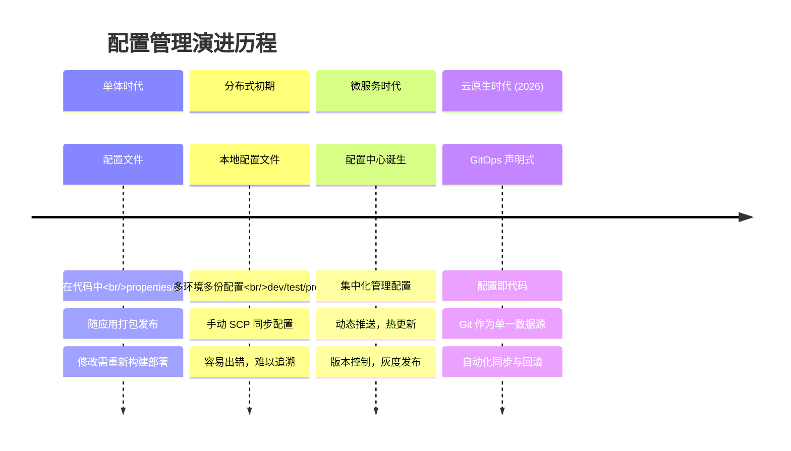
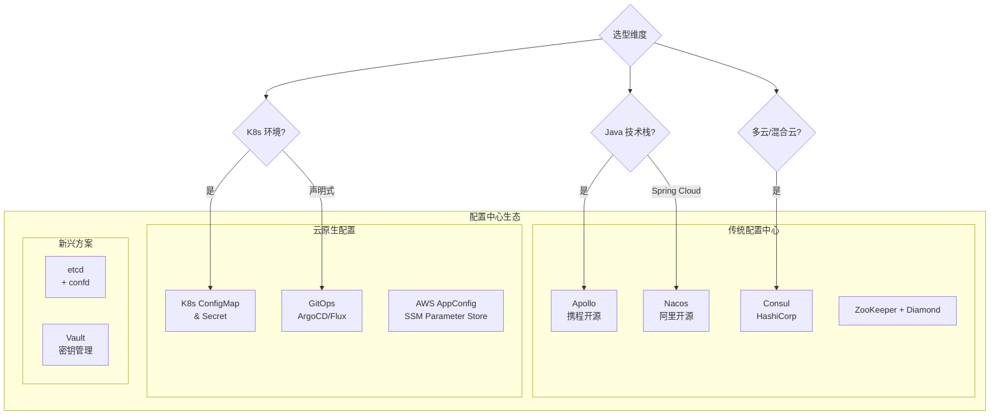
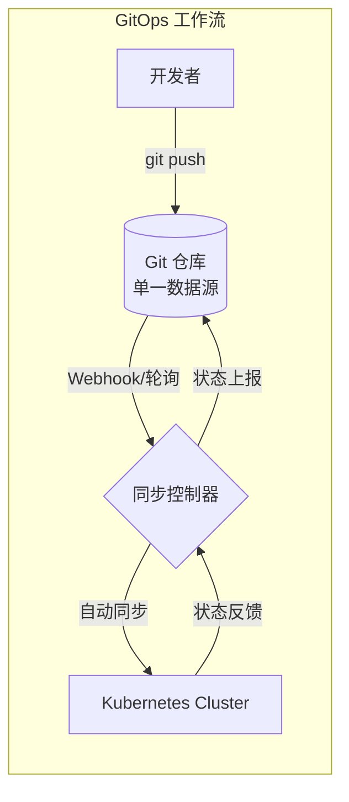
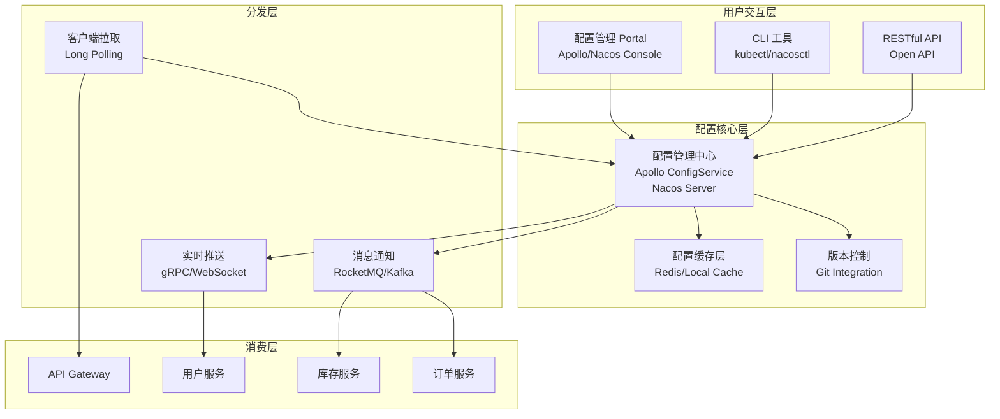
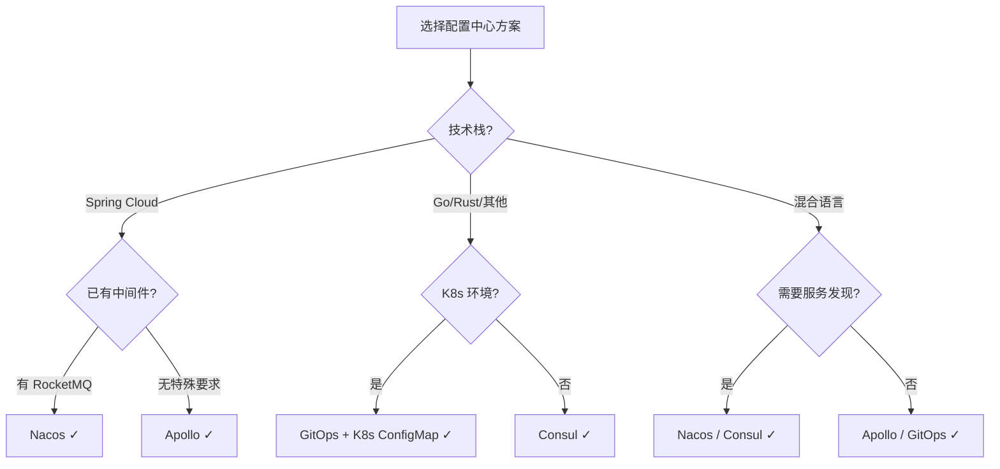

# 管理设计篇之"配置中心" [2026重制版]

> **核心变更说明**：本文基于原极客时间专栏"管理设计篇之配置中心"一讲重写，全面更新至2026年技术栈。新增 Apollo 2.x、Nacos 2.x、Consul、GitOps（ArgoCD/Flux）配置管理方案对比，补充 K8s ConfigMap/Secret 最佳实践，提供完整的生产级部署示例。

---

## 一、问题背景：为什么需要配置中心

### 1.1 从配置文件到配置中心的演进

在单体应用时代，我们将配置写在 `application.properties`、`app.yml` 或 `web.xml` 中，随代码一起打包部署。这种方式在分布式系统下面临严峻挑战：



### 1.2 传统配置管理的痛点

| 痛点 | 描述 | 影响 |
|------|------|------|
| **分散管理** | 配置散落在各服务的配置文件中 | 修改一个参数需要改几十个地方 |
| **环境混乱** | 开发/测试/生产环境配置混在一起 | 测试配置误上线导致事故 |
| **动态性差** | 修改配置需重启服务 | 业务中断，用户体验差 |
| **无版本控制** | 配置变更无法追溯 | 出问题难以定位和回滚 |
| **安全隐患** | 数据库密码等敏感信息硬编码 | 代码泄露导致凭证暴露 |
| **协作困难** | 运维改配置需找开发 | 效率低下，沟通成本高 |

### 1.3 配置分类模型

根据 [12-Factor App](https://12factor.net/config) 方法论，配置应该与代码严格分离：

```
┌─────────────────────────────────────────────────────────────┐
│                      应用程序 (Code)                         │
│              不包含任何运行时配置信息                          │
└─────────────────────────────────────────────────────────────┘
                              │
                              ▼
┌─────────────────────────────────────────────────────────────┐
│                     配置 (Config)                            │
│  ┌───────────┬───────────┬───────────┬───────────────────┐   │
│  │ 静态配置   │ 动态配置   │ 敏感配置   │   特征开关         │   │
│  │ 端口/线程池│ 日志级别   │ 密码/Token│  Feature Flag     │   │
│  │ 启动参数   │ 限流阈值   │ 证书/Key  │  灰度/A-B Test    │   │
│  └───────────┴───────────┴───────────┴───────────────────┘   │
└─────────────────────────────────────────────────────────────┘
```

---

## 二、主流配置中心方案对比

### 2.1 方案全景图



### 2.2 核心功能对比表

| 功能特性 | Apollo | Nacos 2.x | Consul | Spring Cloud Config | GitOps |
|----------|--------|-----------|--------|---------------------|--------|
| **配置实时推送** | ✅ HTTP长轮询 | ✅ gRPC | ✅ HTTP/gRPC | ❌ 需轮询/Git Hook | ✅ Git Webhook |
| **灰度发布** | ✅ 原生支持 | ✅ 支持 | ⚠️ 有限支持 | ❌ 不支持 | ✅ 原生支持 |
| **版本管理** | ✅ 内置 | ✅ 内置 | ✅ KV版本 | ✅ Git历史 | ✅ Git完整历史 |
| **权限控制** | ✅ 基于角色 | ✅ 基于角色 | ✅ ACL | ✅ Git权限 | ✅ Git权限 |
| **多环境** | ✅ Namespace/Cluster | ✅ Namespace | ✅ Datacenter | ✅ Profile | ✅ Branch/Dir |
| **多语言** | ✅ Open API | ✅ SDK丰富 | ✅ 多语言SDK | ⚠️ 主要Java | ✅ 语言无关 |
| **监控告警** | ✅ 内置 | ✅ 内置 | ⚠️ 需集成 | ❌ 需自建 | ✅ CI/CD集成 |
| **运维复杂度** | 中 | 低 | 中 | 高 | 中 |
| **社区活跃度** | ⭐⭐⭐⭐ | ⭐⭐⭐⭐⭐ | ⭐⭐⭐⭐ | ⭐⭐⭐ | ⭐⭐⭐⭐⭐ |
| **Star 数 (GitHub)** | ~28k | ~29k | ~28k | - | ArgoCD:~16k |

---

## 三、Apollo 配置中心深度实践

### 3.1 架构概览

[Apollo](https://github.com/apolloconfig/apollo) 是携程开源的分布式配置中心，2022年发布了 Apollo 2.0 版本。

```mermaid
flowchart LR
    subgraph "Apollo 架构"
        subgraph "Portal (管理端)"
            P[Config Portal<br/>配置管理界面]
        end

        subgraph "Core (核心服务)"
            CS[Config Service<br/>配置服务<br/>提供读取API]
            ADM[Admin Service<br/>配置管理<br/>增删改查]
        end

        subgraph "存储层"
            DB[(MySQL)<br/>配置数据库]
        end

        subgraph "客户端"
            C1[Java Client]
            C2[.NET Client]
            C3[Go Client]
            C4[Open API]
        end
    end

    P <--> ADM
    ADM <--> DB
    CS <--> DB
    C1 <-->|HTTP Long Polling| CS
    C2 <--> CS
    C3 <--> CS
    C4 <--> CS
```

### 3.2 Docker Compose 快速部署

```yaml
# docker-compose-apollo.yml
version: '3.8'

services:
  apollo-configdb:
    image: mysql:8.0
    container_name: apollo-configdb
    environment:
      TZ: Asia/Shanghai
      MYSQL_ROOT_PASSWORD: root
    ports:
      - "13306:3306"
    volumes:
      - ./sql:/docker-entrypoint-initdb.d
    command: --character-set-server=utf8mb4 --collation-server=utf8mb4_bin

  apollo-portal:
    image: apolloconfig/apollo-portal:2.1.0
    container_name: apollo-portal
    depends_on:
      - apollo-configdb
    ports:
      - "8070:8070"
    environment:
      APOLLO_PORTAL_ENVS: dev
      APOLLO_PORTAL_METASERVERS: http://apollo-configservice:8080

  apollo-configservice:
    image: apolloconfig/apollo-configservice:2.1.0
    container_name: apollo-configservice
    depends_on:
      - apollo-configdb
    ports:
      - "8080:8080"
    environment:
      APOLLO_SERVICE_NAME: apollo-configservice
      SERVER_PORT: 8080
      DS_SERVER: apollo-configdb:3306
      DS_USER_NAME: root
      DS_PASSWORD: root

  apollo-adminservice:
    image: apolloconfig/apollo-adminservice:2.1.0
    container_name: apollo-adminservice
    depends_on:
      - apollo-configdb
      - apollo-configservice
    ports:
      - "8090:8090"
    environment:
      APOLLO_SERVICE_NAME: apollo-adminservice
      SERVER_PORT: 8090
      DS_SERVER: apollo-configdb:3306
      DS_USER_NAME: root
      DS_PASSWORD: root
```

### 3.3 Spring Boot 集成

#### Maven 依赖

```xml
<dependency>
    <groupId>com.ctrip.framework.apollo</groupId>
    <artifactId>apollo-client</artifactId>
    <version>2.2.0</version>
</dependency>

<!-- Spring Boot Starter -->
<dependency>
    <groupId>com.ctrip.framework.apollo</groupId>
    <artifactId>apollo-bootstrap-spring-boot-starter</artifactId>
    <version>2.2.0</version>
</dependency>
```

#### application.yml 配置

```yaml
# Apollo 配置
app:
  id: my-application          # 应用ID（与Apollo中一致）
apollo:
  bootstrap:
    enabled: true
    namespaces: application,redis-config,database-config  # 加载的命名空间
    eagerLoad:
      enabled: true  # 启动时预加载配置
  meta: http://localhost:8080  # Config Service 地址
  cache-dir: ./apollo-cache     # 本地缓存目录
  cluster: default              # 集群名称
```

#### 使用示例

```java
@RestController
@RequestMapping("/api/demo")
public class DemoController {

    // 方式一：使用 @Value 注解
    @Value("${server.port:8080}")
    private int serverPort;

    // 方式二：使用 Apollo 注解（支持自动刷新）
    @ApolloConfig
    private Config config;

    // 方式三：监听配置变更
    @ApolloConfigChangeListener({"application", "redis-config"})
    private void onChange(ConfigChangeEvent event) {
        for (String key : event.changedKeys()) {
            ConfigChange change = event.getChange(key);
            log.info("配置变更 - Key: {}, Old: {}, New: {}, Type: {}",
                    key, change.getOldValue(), change.getNewValue(), change.getChangeType());
        }
    }

    @GetMapping("/config")
    public Map<String, String> getConfig() {
        Map<String, String> result = new HashMap<>();
        result.put("serverPort", String.valueOf(serverPort));
        result.put("redisHost", config.getProperty("redis.host", "localhost"));
        result.put("redisPort", config.getProperty("redis.port", "6379"));
        return result;
    }

    // 动态调整日志级别（通过配置中心）
    @PostMapping("/log-level")
    public String setLogLevel(@RequestParam String level) {
        LoggerContext loggerContext = (LoggerContext) LoggerFactory.getILoggerFactory();
        loggerContext.getLogger("root").setLevel(Level.valueOf(level));
        return "日志级别已设置为: " + level;
    }
}
```

---

## 四、Nacos 配置中心

### 4.1 简介

[Nacos](https://nacos.io/)（Dynamic Naming and Configuration Service）是阿里巴巴开源的服务发现和配置管理平台，已成为 Spring Cloud Alibaba 的核心组件。Nacos 2.x 基于 gRPC 重构了内核，性能大幅提升。

### 4.2 Nacos vs Apollo 对比

| 维度 | Nacos 2.x | Apollo 2.x |
|------|-----------|------------|
| **通信协议** | gRPC（长连接） | HTTP 长轮询 |
| **性能（推送延迟）** | <100ms | ~1s |
| **内存占用** | 较低 | 较高 |
| **功能范围** | 配置+服务发现+DNS | 仅配置 |
| **学习成本** | 较低（中文文档完善） | 中等 |
| **适用场景** | Spring Cloud 全家桶 | 复杂配置管理需求 |

### 4.3 Nacos Docker 部署

```bash
# 单机模式启动 Nacos 2.3.0
docker run -d \
  --name nacos-server \
  -e MODE=standalone \
  -e SPRING_DATASOURCE_PLATFORM=mysql \
  -e MYSQL_SERVICE_HOST=192.168.1.100 \
  -e MYSQL_SERVICE_PORT=3306 \
  -e MYSQL_SERVICE_DB_NAME=nacos_config \
  -e MYSQL_SERVICE_USER=root \
  -e MYSQL_SERVICE_PASSWORD=your_password \
  -p 8848:8848 \
  -p 9848:9848 \
  nacos/nacos-server:v2.3.0
```

### 4.4 Spring Boot 集成示例

```java
// Nacos 配置类
@Configuration
@RefreshScope  // 支持配置动态刷新
public class NacosConfig {

    @Value("${nacos.config.timeout:3000}")
    private int timeout;

    @Bean
    public RestTemplate restTemplate() {
        SimpleClientHttpRequestFactory factory = new SimpleClientHttpRequestFactory();
        factory.setConnectTimeout(timeout);
        factory.setReadTimeout(timeout);
        return new RestTemplate(factory);
    }
}
```

```yaml
# bootstrap.yml
spring:
  cloud:
    nacos:
      discovery:
        server-addr: localhost:8848
        namespace: prod
        group: DEFAULT_GROUP
      config:
        server-addr: localhost:8848
        namespace: prod
        group: DEFAULT_GROUP
        file-extension: yaml
        shared-configs:
          - data-id: common.yaml
            group: COMMON_GROUP
            refresh: true
```

---

## 五、Consul 配置管理

### 5.1 Consul 概述

[Consul](https://www.consul.io/) 是 HashiCorp 出品的服务网格解决方案，内置服务发现、健康检查、KV 存储、配置中心等功能。

### 5.2 Consul KV 配置存储

```bash
# 写入配置
consul kv put config/my-app/database/host localhost
consul kv put config/my-app/database/port 3306
consul kv put config/my-app/database/password secret123

# 读取配置
consul kv get config/my-app/database/host

# 监听配置变化
consul watch -type=key -key=config/my-app/database "echo 'Config changed!'"
```

### 5.3 Consul Template 动态渲染

Consul Template 可以监听 Consul KV 变化并自动更新本地配置文件：

```hcl
# config.ctmpl
{{ with consulKV "config/my-app/database" }}
database {
  host = "{{ .Value.host }}"
  port = {{ .Value.port }}
  password = "{{ .Value.password }}"
}
{{ end }}
```

```bash
# 运行 Consul Template
consul-template \
  -template "/etc/templates/config.ctmpl:/etc/app/config.yml" \
  -retry 30s \
  -once=false
```

---

## 六、GitOps 配置管理模式

### 6.1 什么是 GitOps

GitOps 是一种使用 Git 作为声明式基础设施和应用的单一事实来源（Single Source of Truth）的操作模型。由 Weaveworks 在 2017 年提出，已成为云原生配置管理的最佳实践。



### 6.2 ArgoCD 实践

[Argo CD](https://argoproj.github.io/cd/) 是 CNCF 毕业项目，是最流行的 GitOps 持续交付工具。

#### 安装 ArgoCD

```bash
# 安装 ArgoCD 到 Kubernetes
kubectl create namespace argocd
kubectl apply -n argocd -f https://raw.githubusercontent.com/argoproj/argo-cd/stable/manifests/install.yaml

# 获取初始密码
kubectl -n argocd get secret argocd-initial-admin-secret -o jsonpath="{.data.password}" | base64 -d
```

#### Application 配置示例

```yaml
# app-config.yaml
apiVersion: argoproj.io/v1alpha1
kind: Application
metadata:
  name: my-app-config
  namespace: argocd
spec:
  project: default
  source:
    repoURL: https://github.com/org/app-config.git
    targetRevision: main
    path: configs/prod
  destination:
    server: https://kubernetes.default.svc
    namespace: production
  syncPolicy:
    automated:
      prune: true
      selfHeal: true
      allowEmpty: false
    syncOptions:
      - CreateNamespace=true
      - PruneLast=true
```

#### ConfigMap/Secret 管理

```yaml
# kustomization.yaml
apiVersion: kustomize.config.k8s.io/v1beta1
kind: Kustomization

namespace: production

configMapGenerator:
  - name: app-config
    files:
      - application.yml
    options:
      labels:
        app.kubernetes.io/name: my-app

secretGenerator:
  - name: db-credentials
    type: Opaque
    literals:
      - username=admin
      - password=REPLACE_ME  # kustomize不支持环境变量插值，真实密码请改用SealedSecret/ExternalSecret注入
```

### 6.3 FluxCD 替代方案

[Flux](https://fluxcd.io/) 是另一个优秀的 GitOps 工具，更轻量级：

```bash
# 安装 Flux CLI
curl -s https://fluxcd.io/install.sh | sudo bash

# Bootstrap GitOps 仓库
flux bootstrap github \
  --owner=my-org \
  --repository=app-infra \
  --path=clusters/my-cluster \
  --personal=true
```

---

## 七、配置中心架构设计

### 7.1 生产环境推荐架构



### 7.2 配置命名规范建议

```
# 推荐的命名空间设计
AppID: order-service

Namespaces:
  ├── application           # 公共配置（线程池、超时时间）
  ├── datasource.{env}      # 数据库连接配置
  ├── redis.{env}           # Redis 缓存配置
  ├── mq.{env}              # 消息队列配置
  ├── feature-flag.{env}    # 特征开关
  └── business.{env}        # 业务相关配置

# 配置项命名规范
{组件}.{模块}.{属性}.{环境}
例：
spring.datasource.prod.url
thread.pool.core.size
feature.flag.new-checkout.enabled
cache.redis.ttl.seconds
```

---

## 八、安全最佳实践

### 8.1 敏感信息管理

**绝对不要将密码、Token、私钥等敏感信息明文存放在配置中心！**

推荐方案：

| 方案 | 适用场景 | 工具 |
|------|----------|------|
| **Vault** | 企业级密钥管理 | HashiCorp Vault |
| **Sealed Secrets** | Kubernetes 原生 | bitnami-labs/sealed-secrets |
| **External Secrets** | 云原生密钥同步 | external-secrets/external-secrets |
| **AWS Secrets Manager** | AWS 环境 | AWS 原生 |
| **KMS + Envelope Encryption** | 大规模加密 | 各云厂商 |

### 8.2 Vault 集成示例

```hcl
# Vault 配置（vault-server.hcl）
storage "file" {
  path = "./vault/data"
}

listener "tcp" {
  address     = "0.0.0.0:8200"
  tls_disable = true
}

ui = true
disable_mlock = true
```

```bash
# 启用 KV 引擎
vault secrets enable -path=secret kv-v2

# 存储数据库密码
vault kv put secret/db-credentials username="admin" password="SuperSecret123"

# 创建 AppRole 认证策略
vault policy write app-policy - <<EOF
path "secret/data/db-credentials" {
  capabilities = ["read"]
}
EOF
```

---

## 九、2026 最佳实践总结

### 9.1 选型决策矩阵



### 9.2 生产环境 Checklist

- [ ] **配置分离**：代码零配置，所有运行时配置从配置中心加载
- [ ] **命名规范**：建立统一的配置项命名规范和命名空间划分
- [ ] **环境隔离**：开发/测试/预发/生产严格隔离，禁止跨环境复制
- [ ] **版本管理**：所有配置变更可追溯、可审计、可回滚
- [ ] **灰度发布**：重要配置变更先在小流量验证后再全量推送
- [ ] **权限管控**：基于角色的访问控制，操作留痕
- [ ] **加密传输**：配置中心与客户端之间 TLS 加密
- [ ] **敏感保护**：密码/密钥使用专业密钥管理系统
- [ ] **容灾备份**：配置中心集群化部署，定期备份数据库
- [ ] **监控告警**：配置推送成功率、延迟、失败率监控
- [ ] **本地缓存**：客户端实现本地缓存，配置中心不可用时降级
- [ ] **优雅降级**：配置获取失败时的默认值和降级策略

---

## 十、延伸资源

### 官方文档
- **Apollo**: https://www.apolloconfig.com/
- **Nacos**: https://nacos.io/zh-cn/docs/what-is-nacos.html
- **Consul**: https://developer.hashicorp.com/consul/docs
- **ArgoCD**: https://argo-cd.readthedocs.io/
- **Flux**: https://fluxcd.io/docs/

### 经典文章
- "The 12-Factor App - III. Config": https://12factor.net/config
- "GitOps - Operations by Pull Request" (Weaveworks): https://www.gitops.tech/
- "Patterns of Distributed Systems" (martinfowler.com): https://martinfowler.com/articles/patterns-of-distributed-systems.html

### 开源项目
- [Apollo](https://github.com/apolloconfig/apollo): 携程开源配置中心
- [Nacos](https://github.com/alibaba/nacos): 阿里巴巴服务发现与配置
- [Consul](https://github.com/hashicorp/consul): HashiCorp 服务网格
- [ArgoCD](https://github.com/argoproj/argo-cd): GitOps 持续交付
- [Vault](https://github.com/hashicorp/vault): 密钥管理

---

> **本文版本**：2026 重制版 | 基于原极客时间专栏"管理设计篇之配置中心"一讲重构
> **最后更新**：2026-06-06 | 技术栈：Apollo 2.1 / Nacos 2.3 / Consul 1.17 / ArgoCD 2.10
