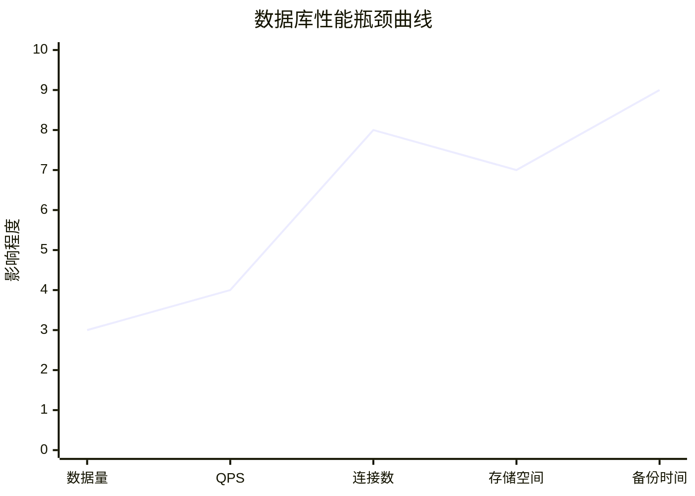
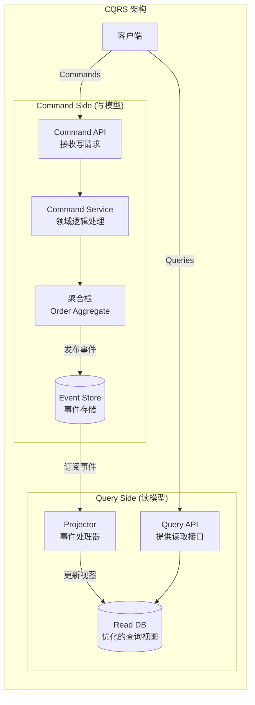
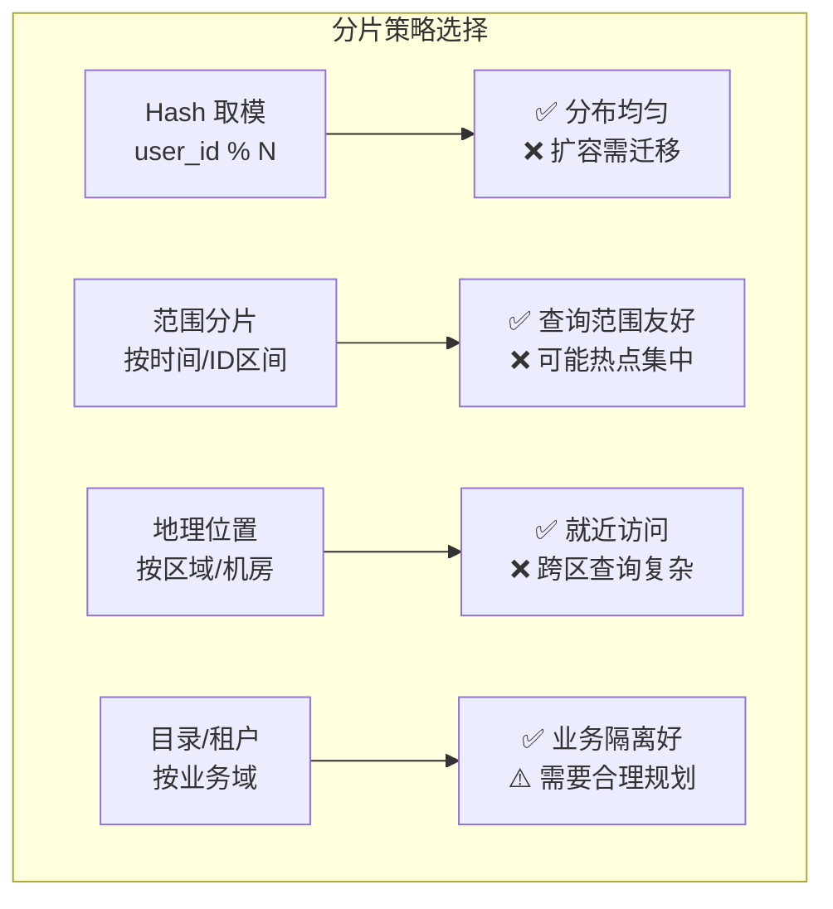
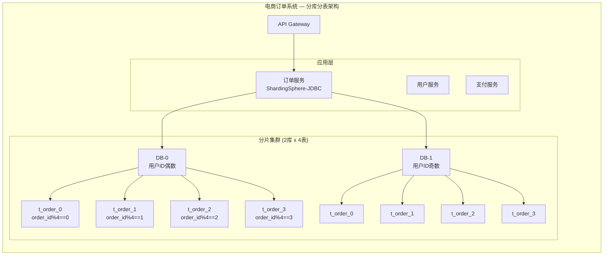

# 性能设计篇之"数据库扩展" [2026重制版]

> **核心变更说明**：本文基于原极客时间专栏"性能设计篇之数据库扩展"一讲重写，全面更新至2026年技术栈。新增 ShardingSphere 5.5 / Vitess / TiDB v7.1 / CockroachDB v23.2 深度对比、CQRS + Event Sourcing 架构模式、完整的分库分表配置示例、NewSQL 选型指南和性能基准测试数据。

---

## 一、问题背景：数据库扩展的挑战

### 1.1 单体数据库的瓶颈

随着业务增长，单体数据库最终会遇到以下瓶颈：



| 瓶颈类型 | 触发条件 | 典型表现 |
|----------|----------|----------|
| **QPS 瓶颈** | 单机 > 3-5w QPS | CPU 100%，响应延迟飙升 |
| **存储瓶颈** | 单表 > 2000万行 | 查询变慢，索引维护成本高 |
| **连接数瓶颈** | 连接 > 5000 | 连接池耗尽，拒绝新连接 |
| **I/O 瓶颈** | 随机读写密集 | IOPS 达到磁盘上限 |
| **网络瓶颈** | 跨机房访问 | 网络延迟放大查询时间 |

### 1.2 数据库扩展的三条路线

```mermaid
flowchart TB
    Start[数据库性能不足] --> Q1{瓶颈类型?}

    Q1 -->|读多写少| A1[读写分离 ✓<br/>主从复制]
    Q1 -->|数据量大| Q2{是否需要强一致?}
    Q1 -->|QPS 高| Q3{能否接受分布式?}

    Q2 -->|是| A2[垂直拆分/优化SQL<br/>+ 分库分表]
    Q2 -->|否| A3[NewSQL (TiDB/CockroachDB) ✓<br/>分布式 SQL 数据库]

    Q3 -->|可以| A4[ShardingSphere/Vitess ✓<br/>中间件方案]
    Q3 -->|不行| A5[缓存 + 异步<br/>减少 DB 压力]

```

---

## 二、读写分离与 CQRS

### 2.1 读写分离架构

```mermaid
flowchart LR
    subgraph "读写分离架构"
        APP[应用服务] --> RW[路由层<br/>Sharding-JDBC / Vitess]

        RW -->|写操作| MASTER[(MySQL Master)<br/>唯一写入节点]
        RW -->|读操作(80%)| SLAVE1[(Slave-1)]
        RW -->|读操作(20%)| SLAVE2[(Slave-2)]

        MASTER <-->|异步复制| SLAVE1
        MASTER <-->|异步复制| SLAVE2
    end

```

**关键注意事项**：
- 主从之间有**复制延迟**（通常 1-100ms）
- 强一致性读必须走 Master
- 可以接受短暂不一致的读操作走 Slave
- 从库越多，Master 的复制压力越大

### 2.2 Spring Boot 读写分离实现

```java
@Configuration
public class DataSourceConfig {

    /**
     * 动态数据源 — 根据注解自动选择主/从
     */
    @Bean
    @Primary
    public DynamicDataSource dynamicDataSource(
            @Qualifier("masterDataSource") DataSource masterDataSource,
            @Qualifier("slaveDataSource") DataSource slaveDataSource) {

        Map<Object, Object> targetDataSources = new HashMap<>();
        targetDataSources.put("master", masterDataSource);
        targetDataSources.put("slave", slaveDataSource);

        DynamicDataSource dataSource = new DynamicDataSource();
        dataSource.setTargetDataSources(targetDataSources);
        dataSource.setDefaultTargetDataSource(masterDataSource); // 默认走主库

        return dataSource;
    }
}

/**
 * 自定义注解 — 标记读操作走从库
 */
@Target({ElementType.METHOD, ElementType.TYPE})
@Retention(RetentionPolicy.RUNTIME)
public @interface ReadOnly {
}

/**
 * AOP 切面 — 根据 @ReadOnly 注解切换数据源
 */
@Aspect
@Component
@Slf4j
public class DataSourceAspect {

    @Around("@annotation(readOnly)")
    public Object around(ProceedingJoinPoint joinPoint, ReadOnly readOnly) throws Throwable {
        try {
            // 切换到从库（读）
            DynamicDataSourceContextHolder.setSlave();
            log.debug("使用从库执行: {}", joinPoint.getSignature().getName());
            return joinPoint.proceed();
        } finally {
            DynamicDataSourceContextHolder.clear();
        }
    }
}

/**
 * 使用示例
 */
@Service
public class ProductService {

    /** 写操作 — 自动走主库 */
    public void createProduct(Product product) {
        productMapper.insert(product);
    }

    /** 读操作 — 注解标记走从库 */
    @ReadOnly
    public Product getProductById(String id) {
        return productMapper.selectById(id);
    }

    /** 需要强一致性的读操作 — 不加注解，走主库 */
    public Product getProductForUpdate(String id) {
        return productMapper.selectByIdForUpdate(id);
    }
}
```

### 2.3 CQRS 模式深度实践

CQRS（Command Query Responsibility Segregation）将命令（写）和查询（读）彻底分离：



---

## 三、分库分表策略

### 3.1 为什么需要分库分表？

当单表数据量超过以下阈值时，应考虑分库分表：

| 数据量级 | 建议 |
|----------|------|
| < 500 万行 | 无需分表，优化索引即可 |
| 500万 - 2000万行 | 考虑分区表或归档旧数据 |
| 2000万 - 5000万行 | 应该考虑分表 |
| > 5000万行 或 > 50GB | 必须分库分表 |

### 3.2 分片策略对比



### 3.3 ShardingSphere 实践

[Apache ShardingSphere](https://shardingsphere.apache.org/) 是 Apache 顶级项目，提供分库分表、读写分离、数据加密等能力。

#### Maven 依赖

```xml
<dependency>
    <groupId>org.apache.shardingsphere</groupId>
    <artifactId>shardingsphere-jdbc-core</artifactId>
    <version>5.5.0</version>
</dependency>
<!-- 如果使用 Spring Boot Starter -->
<dependency>
    <groupId>org.apache.shardingsphere</groupId>
    <artifactId>shardingsphere-jdbc-spring-boot-starter</artifactId>
    <version>5.5.0</version>
</dependency>
```

#### 配置示例

```yaml
# application-sharding.yml
spring:
  shardingsphere:
    # ====== 数据源配置 ======
    datasource:
      names: ds0,ds1,ds0-read-0,ds0-read-1,ds1-read-0,ds1-read-1
      ds0:
        type: com.zaxxer.hikari.HikariDataSource
        driver-class-name: com.mysql.cj.jdbc.Driver
        jdbc-url: jdbc:mysql://mysql-master-0:3306/order_db_0?useSSL=false&serverTimezone=Asia/Shanghai&allowPublicKeyRetrieval=true
        username: ${DB_USERNAME}
        password: ${DB_PASSWORD}
      ds0-read-0:
        type: com.zaxxer.hikari.HikariDataSource
        driver-class-name: com.mysql.cj.jdbc.Driver
        jdbc-url: jdbc:mysql://mysql-replica-0a:3306/order_db_0?useSSL=false&serverTimezone=Asia/Shanghai
        username: ${DB_USERNAME}
        password: ${DB_PASSWORD}
      ds0-read-1:
        type: com.zaxxer.hikari.HikariDataSource
        driver-class-name: com.mysql.cj.jdbc.Driver
        jdbc-url: jdbc:mysql://mysql-replica-0b:3306/order_db_0?useSSL=false&serverTimezone=Asia/Shanghai
        username: ${DB_USERNAME}
        password: ${DB_PASSWORD}
      ds1:
        type: com.zaxxer.hikari.HikariDataSource
        driver-class-name: com.mysql.cj.jdbc.Driver
        jdbc-url: jdbc:mysql://mysql-master-1:3306/order_db_1?useSSL=false&serverTimezone=Asia/Shanghai
        username: ${DB_USERNAME}
        password: ${DB_PASSWORD}
      ds1-read-0:
        type: com.zaxxer.hikari.HikariDataSource
        driver-class-name: com.mysql.cj.jdbc.Driver
        jdbc-url: jdbc:mysql://mysql-replica-1a:3306/order_db_1?useSSL=false&serverTimezone=Asia/Shanghai
        username: ${DB_USERNAME}
        password: ${DB_PASSWORD}
      ds1-read-1:
        type: com.zaxxer.hikari.HikariDataSource
        driver-class-name: com.mysql.cj.jdbc.Driver
        jdbc-url: jdbc:mysql://mysql-replica-1b:3306/order_db_1?useSSL=false&serverTimezone=Asia/Shanghai
        username: ${DB_USERNAME}
        password: ${DB_PASSWORD}

    # ====== 分片规则 ======
    rules:
      sharding:
        # 表分片规则
        tables:
          t_order:
            actual-data-nodes: ds${0..1}.t_order_${0..3}
            table-strategy:
              standard:
                sharding-column: order_id
                sharding-algorithm-name: order-table-inline
          t_order_item:
            actual-data-nodes: ds${0..1}.t_order_item_${0..3}
            table-strategy:
              standard:
                sharding-column: order_id
                sharding-algorithm-name: order-item-inline

        # 绑定表规则（避免跨库关联查询）
        binding-tables:
          - t_order, t_order_item

        # 广播表（小表全量复制到每个节点）
        broadcast-tables:
          - t_dict_config
          - t_system_config

        # 默认分片算法
        default-database-strategy:
          standard:
            sharding-column: user_id
            sharding-algorithm-name: database-inline

        # 自定义分片算法
        sharding-algorithms:
          database-inline:
            type: INLINE
            props:
              algorithm-expression: ds${user_id % 2}
          order-table-inline:
            type: INLINE
            props:
              algorithm-expression: t_order_${order_id % 4}
          order-item-inline:
            type: INLINE
            props:
              algorithm-expression: t_order_item_${order_id % 4}

      # ====== 读写分离规则 ======
    readwrite-splitting:
      data-sources:
        ds0:
          write-data-source-name: ds0
          read-data-source-names: ds0-read-0, ds0-read-1
          load-balancer-name: round_robin
        ds1:
          write-data-source-name: ds1
          read-data-source-names: ds1-read-0, ds1-read-1
          load-balancer-name: round_robin
      load-balancers:
        round_robin:
          type: ROUND_ROBIN

    # ====== 属性配置 ======
    props:
      sql-show: true                    # 显示 SQL 解析结果
      sql-simple: false                  # 简化 SQL 显示
```

---

## 四、NewSQL 方案：TiDB vs CockroachDB

### 4.1 什么是 NewSQL？

NewSQL 是一类现代分布式关系数据库，承诺同时具备：
- **关系模型的易用性**（SQL 接口、ACID 事务）
- **NoSQL 的可扩展性**（水平扩展、自动分片）

### 4.2 核心对比

| 特性 | **TiDB v7.1** | **CockroachDB v23.2** | **Vitess** | **Spanner (GCP)** |
|------|---------------|----------------------|-----------|-------------------|
| **开发公司** | PingCAP | Cockroach Labs | YouTube/独立 | Google |
| **开源协议** | Apache 2.0 | BSL → Apache 2.0 | Apache 2.0 | 商业 |
| **底层存储** | TiKV (RocksDB) | Pebble (LSM-Tree) | MySQL | Colossus (FS) |
| **共识算法** | Raft | Raft | VTGate 协调 | TrueTime/Paxos |
| **兼容性** | MySQL 协议 | PostgreSQL 协议 | MySQL 协议 | ANSI SQL |
| **水平扩展** | ✅ 存储计算分离 | ✅ 存储计算分离 | ✅ 分片管理 | ✅ 全球分布 |
| **强一致事务** | ✅ (Percolator) | ✅ (Serializable) | ✅ (2PC) | ✅ (External Consistency) |
| **HTAP 能力** | ⭐⭐⭐⭐⭐ (TiFlash) | ⭐⭐⭐ | ⭐⭐⭐ | ⭐⭐⭐⭐ |
| **地理分布** | ⭐⭐⭐⭐ | ⭐⭐⭐⭐⭐ | ⭐⭐⭐ | ⭐⭐⭐⭐⭐ |
| **社区活跃度** | ⭐⭐⭐⭐⭐ | ⭐⭐⭐⭐ | ⭐⭐⭐⭐ | - |
| **GitHub Stars** | ~37k | ~30k | ~18k | - |
| **适合场景** | HTAP/OLTP+OLAP混合 | 多地域/全球部署 | 大规模 MySQL 管理 | 云原生企业级 |

### 4.3 TiDB 快速部署

```bash
# 使用 TiUP 安装 TiDB v7.1
curl --proto '=https' --tlsv1.2 -sSf https://tiup-mirror.pingcap.com/install.sh | sh
source ~/.bashrc
tiup cluster

# 部署一个测试集群
tiup cluster deploy my-tidb v7.1 ./topology.yaml --user root
tiup cluster start my-tidb
```

```yaml
# topology.yaml — TiDB 集群拓扑
global:
  user: "tidb"
  ssh_port: 22
  deploy_dir: "/data/tidb-deploy"
  data_dir: "/data/tidb-data"

server_configs:
  pd:
    replication.max-replicas: 3
    schedule.leader-schedule-limit: 4
    schedule.region-schedule-limit: 2048
    replication.location-labels: ["zone"]
  tikv:
    storage.scheduler-worker-pool-size: 4
    storage.block-cache.capacity: "4GB"
    raftstore.apply-pool-size: 3
    raftstore.store-pool-size: 3
    rocksdb.defaultcf.compression: "lz4"
    rocksdb.writecf.compression: "lz4"
  tidb:
    log.level: info
    performance.max-procedures: 500
    performance.stmt-count-limit: 5000
    prepared-plan-cache.enabled: true
    prepared-plan-cache.capacity: 5000
  tiflash:
    logger.level: "info"

pd_servers:
  - host: 10.0.1.1

tidb_servers:
  - host: 10.0.1.2

tikv_servers:
  - host: 10.0.1.3
  - host: 10.0.1.4
  - host: 10.0.1.5

tiflash_servers:
  - host: 10.0.1.6

monitoring_servers:
  - host: 10.0.1.7

grafana_servers:
  - host: 10.0.1.7
```

---

## 五、实战案例：电商订单系统分库分表

### 5.1 整体架构



### 5.2 关键设计要点

```java
/**
 * 订单实体 — 必须包含分片键
 */
@Data
@Table(name = "t_order")
public class Order {
    @TableId(type = IdType.ASSIGN_ID)
    private Long orderId;           // 业务主键（也是分片键）

    private Long userId;             // 用户 ID（数据库分片键）

    private BigDecimal totalAmount;
    private Integer status;

    /** 重要：关联表必须使用相同的分片键和分片算法！ */
    private List<OrderItem> items;
}

/**
 * 分片键设计原则：
 *
 * 1. 选择高基数列作为分片键（如 userId, orderId）
 * 2. 分片键必须在所有查询条件中出现
 * 3. 避免 Cross-Shard JOIN（跨分片关联查询）
 * 4. 全局唯一 ID 生成使用雪花算法或号段模式
 */

/**
 * 雪花算法 ID 生成器
 */
@Component
public class SnowflakeIdGenerator {

    private final Snowflake snowflake = new Snowflake(
        1,   // workerId
        1    // datacenterId
    );

    public long nextId() {
        return snowflake.nextId();
    }
}
```

### 5.3 分库分表的注意事项

| 注意事项 | 说明 | 解决方案 |
|----------|------|----------|
| **跨分片查询** | 无法直接 JOIN 不同库的表 | 应用层组装 / 广播表 / ER 分片 |
| **全局唯一 ID** | 自增 ID 在分片后冲突 | 雪花算法 / 号段模式 / UUID |
| **分页查询** | 需要在各分片分别查再合并 | ShardingSphere 自动处理 |
| **排序问题** | 跨分片排序需要额外处理 | 内存归并排序 |
| **事务支持** | 跨库事务需要 2PC | 尽量避免 / 使用柔性事务 |
| **扩容困难** | Hash 取模扩容需数据迁移 | 一致性哈希 / 预留扩容位 |

---

## 六、2026 最佳实践总结

### 6.1 扩展路径建议

```
┌─────────────────────────────────────────────────────┐
│           数据库扩展推荐路径 (2026)                     │
├─────────────────────────────────────────────────────┤
│                                                      │
│  Phase 1: 读写分离                                    │
│  ├── MySQL 主从复制 (1主N从)                          │
│  └── 中间件: ShardingSphere / ProxySQL               │
│                                                      │
│  Phase 2: 分库分表                                    │
│  ├── ShardingSphere-JDBC (Java 嵌入式)               │
│  ├── Vitess (语言无关 Proxy)                         │
│  └── 分片键: user_id / tenant_id                     │
│                                                      │
│  Phase 3: NewSQL 迁移                                 │
│  ├── TiDB (HTAP 场景首选)                            │
│  ├── CockroachDB (多地域场景)                        │
│  └── 渐进式迁移: 双写 → 切流                         │
│                                                      │
│  Phase 4: CQRS + Event Sourcing                      │
│  ├── 写模型: 事件驱动                                │
│  ├── 读模型: 物化视图/CQRS                           │
│  └── 最终一致性保证                                   │
│                                                      │
└─────────────────────────────────────────────────────┘
```

### 6.2 生产环境 Checklist

- [ ] **分片键选择**：选择高基数、均匀分布的字段作为分片键
- [ ] **避免跨分片操作**：尽量在单个分片内完成事务
- [ ] **全局唯一 ID**：统一使用雪花算法或号段模式生成
- [ ] **容量规划**：每个分片预留 30%-50% 的增长空间
- [ ] **监控告警**：各分片的 QPS、延迟、连接数、磁盘使用率
- [ ] **备份恢复**：每个分片独立备份，定期验证恢复流程
- [ ] **数据校验**：定期做分片间数据一致性校验
- [ ] **扩容预案**：提前制定扩容方案和数据迁移脚本

---

## 七、延伸资源

### 官方文档
- **ShardingSphere**: https://shardingsphere.apache.org/document/current/cn/overview/
- **TiDB**: https://docs.pingcap.com/tidb/stable/
- **CockroachDB**: https://www.cockroachlabs.com/docs/stable/
- **Vitess**: https://vitess.io/docs/

### 经典论文
- "Spanner: Google's Globally-Distributed Database" (OSDI'12): https://research.google/pubs/pub39966/
- "Dynamo: Amazon's Highly Available Key-value Store" (SOSP'07): http://www.allthingsdistributed.com/files/amazon-dynamo-sosp2007.pdf
- "Life Beyond Distributed Transactions" (Pat Helland): https://www.cs.umd.edu/class/fall2017/cmsc828s/notes/beyond.pdf

### 开源项目
- [ShardingSphere](https://github.com/apache/shardingsphere): Apache 顶级分布式数据库中间件
- [TiDB](https://github.com/pingcap/tidb): 开源分布式 HTAP 数据库
- [CockroachDB](https://github.com/cockroachdb/cockroach): 开源云原生分布式 SQL 数据库
- [Vitess](https://github.com/vitessio/vitess): YouTube 出品的大规模 MySQL 编排工具

---

> **本文版本**：2026 重制版 | 基于原极客时间专栏"性能设计篇之数据库扩展"一讲重构
> **最后更新**：2026-06-06 | 技术栈：ShardingSphere 5.5 / TiDB 7.1 / CockroachDB 23.2 / MySQL 8.0 / Java 21
