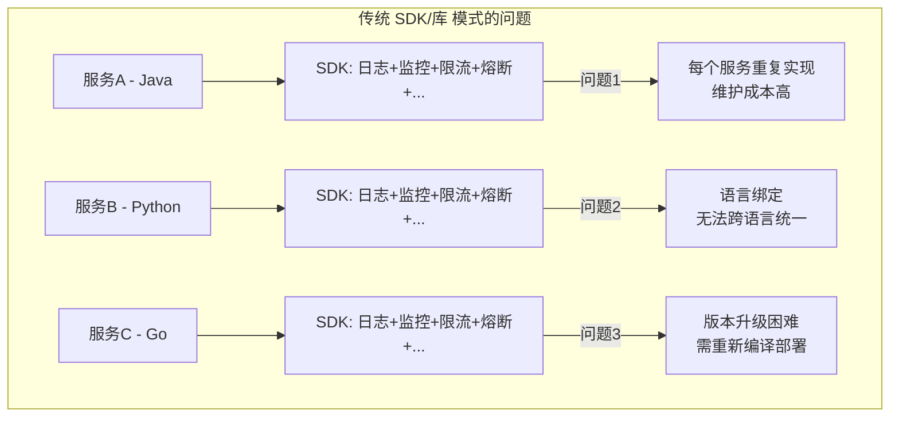
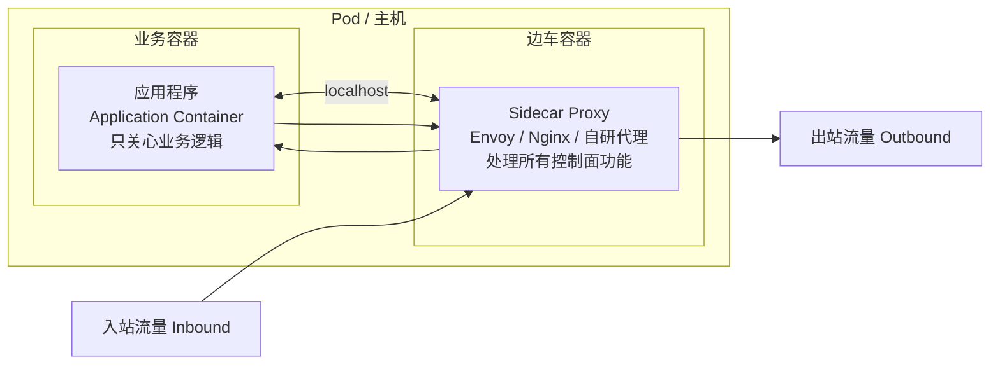
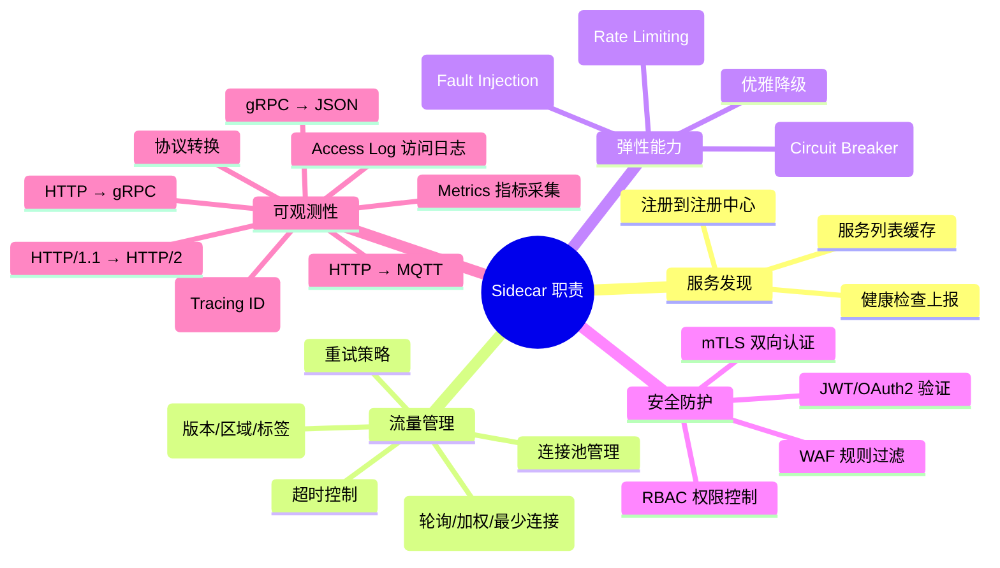
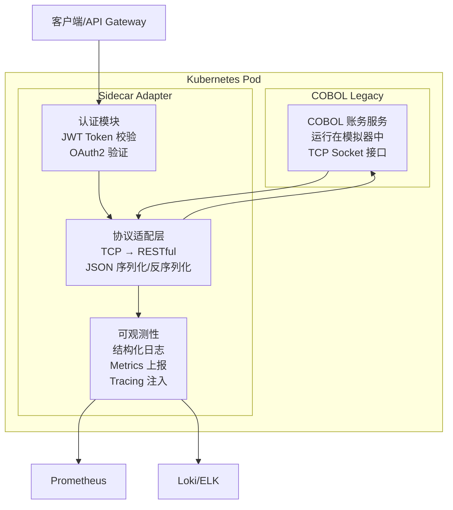

# 管理设计篇之"边车模式" [2026重制版]

> **核心变更说明**：本文基于原极客时间专栏"管理设计篇之边车模式"一讲重写，全面更新至2026年技术栈。新增 Envoy Proxy 最新特性、Docker Compose / Kubernetes 部署实践、Sidecar 与 SDK 对比分析、多语言混合架构案例，补充完整的配置示例和性能数据。

---

## 一、问题背景：为什么需要边车模式

### 1.1 从单体到微服务的控制面困境

在单体应用时代，横切关注点（Cross-Cutting Concerns）如日志、监控、认证、限流等功能通常以库（Library）或框架的形式嵌入到应用代码中。当系统演进为微服务架构后，这种模式暴露出严重问题：



### 1.2 边车模式的灵感来源

"Sidecar"（边车）一词来源于摩托车文化——在摩托车旁边附加一个带轮子的座位，可以搭载额外乘客而不改变摩托车本身的结构。

在软件架构中，**边车模式**的核心思想是：

> 将分布式系统的**控制面**（Control Plane）功能从业务逻辑中剥离，部署为一个独立的伴随进程，与应用程序同生命周期、同部署单元。

### 1.3 控制面 vs 数据面

理解边车模式的关键在于区分两个概念：

| 维度 | 数据面 (Data Plane) | 控制面 (Control Plane) |
|------|---------------------|------------------------|
| **定义** | 处理业务请求的逻辑 | 管理、观测、保护服务的逻辑 |
| **内容** | 业务 API、数据库操作、核心算法 | 日志、监控、认证、限流、熔断、路由 |
| **变化频率** | 高（随业务需求变化） | 低（相对稳定） |
| **责任人** | 业务开发团队 | 平台/基础设施团队 |
| **示例** | 下单逻辑、库存扣减 | JWT验证、Prometheus指标采集 |

---

## 二、边车模式原理深度剖析

### 2.1 架构模型



### 2.2 边车代理的职责清单

一个生产级的边车代理通常承担以下职责：



### 2.3 进程间通信机制

边车与应用之间的通信方式至关重要：

| 方式 | 优点 | 缺点 | 推荐度 |
|------|------|------|--------|
| **本地网络回环 (127.0.0.1)** | 无侵入、标准协议、易调试 | 有一定延迟(~0.1ms) | ⭐⭐⭐⭐⭐ **推荐** |
| **Unix Domain Socket** | 更低延迟、无TCP开销 | 仅限本机、调试不便 | ⭐⭐⭐⭐ |
| **共享内存** | 极高性能 | 实现复杂、有安全风险 | ⭐⭐ |
| **信号量(Signal)** | 简单直接 | 信息量有限、不可靠 | ⭐ |

**最佳实践**：使用 localhost 网络通信，HTTP/gRPC 作为内部协议。

---

## 三、主流边车实现方案

### 3.1 Envoy Proxy — 业界标准

[Envoy](https://www.envoyproxy.io/) 是 Lyft 开源的高性能 L7 代理，已成为 Cloud Native 生态中事实上的边车标准。CNCF 毕业项目，被 Istio、AWS App Mesh 等广泛采用。

#### 核心特性

- **C++17 编写**：极致性能，内存占用低（~15MB）
- **xDS 动态配置API**：支持动态更新路由、集群、监听器等配置
- **高级负载均衡**：支持环形哈希、Maglev、locality-aware 等
- **Observability 原生支持**：内置 Prometheus Stats、分布式追踪、Access Logging
- **协议丰富**：HTTP/1.1、HTTP/2、gRPC、WebSocket、MongoDB、Redis、TCP 等

#### Docker 快速启动

```yaml
# docker-compose-sidecar.yml
version: '3.8'

services:
  app:
    image: my-app:latest
    ports:
      - "8080:8080"
    networks:
      - sidecar-network

  envoy:
    image: envoyproxy/envoy:v1.29.0
    volumes:
      - ./envoy.yaml:/etc/envoy/envoy.yaml
    ports:
      - "10000:10000"   # 入站端口 (Admin)
      - "8000:8000"     # 出站代理端口
      - "9901:9901"     # Admin API
    depends_on:
      - app
    networks:
      - sidecar-network

networks:
  sidecar-network:
    driver: bridge
```

#### Envoy 配置示例（静态）

```yaml
# envoy.yaml - 边车代理配置
static_resources:
  listeners:
    - name: listener_inbound
      address:
        socket_address:
          address: 0.0.0.0
          port_value: 10000
      filter_chains:
        - filters:
            - name: envoy.filters.network.http_connection_manager
              typed_config:
                "@type": type.googleapis.com/envoy.extensions.filters.network.http_connection_manager.v3.HttpConnectionManager
                stat_prefix: ingress_http
                route_config:
                  name: local_route
                  virtual_hosts:
                    - name: backend
                      domains: ["*"]
                      routes:
                        - match:
                            prefix: "/"
                          route:
                            cluster: app_cluster
                http_filters:
                  - name: envoy.filters.http.router
                    typed_config:
                      "@type": type.googleapis.com/envoy.extensions.filters.http.router.v3.Router

  clusters:
    - name: app_cluster
      connect_timeout: 5s
      type: STATIC
      lb_policy: ROUND_ROBIN
      load_assignment:
        cluster_name: app_cluster
        endpoints:
          - lb_endpoints:
              - endpoint:
                  address:
                    socket_address:
                      address: 127.0.0.1
                      port_value: 8080

admin:
  address:
    socket_address:
      address: 0.0.0.0
      port_value: 9901
```

#### Envoy 配置示例（动态 xDS）

```yaml
# envoy-dynamic.yaml - 使用 xDS API 动态配置
dynamic_resources:
  lds_config:
    resource_api_version: V3
    api_config_source:
      api_type: GRPC
      transport_api_version: V3
      grpc_services:
        - envoy_grpc:
            cluster_name: xds_cluster
  cds_config:
    resource_api_version: V3
    api_config_source:
      api_type: GRPC
      transport_api_version: V3
      grpc_services:
        - envoy_grpc:
            cluster_name: xds_cluster

static_resources:
  clusters:
    - name: xds_cluster
      connect_timeout: 5s
      type: STATIC
      lb_policy: ROUND_ROBIN
      load_assignment:
        cluster_name: xds_cluster
        endpoints:
          - lb_endpoints:
              - endpoint:
                  address:
                    socket_address:
                      address: control-plane.example.com
                      port_value: 18000

admin:
  address:
    socket_address:
      address: 0.0.0.0
      port_value: 9901
```

### 3.2 其他边车方案对比

| 方案 | 语言 | 内存占用 | 性能(QPS) | 特点 |
|------|------|----------|-----------|------|
| **Envoy** | C++ | ~15MB | ~200k+ | 功能最全，生态最好 |
| **Nginx** | C | ~5MB | ~150k+ | 成熟稳定，配置简单 |
| **HAProxy** | C | ~3MB | ~200k+ | 四层性能极强 |
| **MOSN (蚂蚁)** | Go | ~30MB | ~100k+ | 国产化，Service Mesh 支持 |
| **Linkerd Proxy** | Rust | ~8MB | ~150k+ | 极轻量，零配置 |
| **自研代理** | Go/Rust | 可控 | 可控 | 完全可控，但成本高 |

---

## 四、Kubernetes 中的 Sidecar 模式

### 4.1 Pod 内 Sidecar 部署

Kubernetes 天然支持 Sidecar 模式——一个 Pod 中可包含多个容器：

```yaml
# deployment-with-sidecar.yaml
apiVersion: apps/v1
kind: Deployment
metadata:
  name: order-service
  labels:
    app: order-service
spec:
  replicas: 3
  selector:
    matchLabels:
      app: order-service
  template:
    metadata:
      labels:
        app: order-service
    spec:
      # ====== 业务容器 ======
      containers:
        - name: order-app
          image: my-registry/order-service:v2.1.0
          ports:
            - containerPort: 8080
              protocol: TCP
          env:
            - name: SERVICE_NAME
              value: "order-service"
            - name: LOG_LEVEL
              value: "INFO"
          resources:
            requests:
              memory: "256Mi"
              cpu: "250m"
            limits:
              memory: "512Mi"
              cpu: "500m"
          readinessProbe:
            httpGet:
              path: /health/ready
              port: 8080
            initialDelaySeconds: 5
            periodSeconds: 10
          livenessProbe:
            httpGet:
              path: /health/live
              port: 8080
            initialDelaySeconds: 15
            periodSeconds: 20

      # ====== Sidecar 容器 (Envoy) ======
        - name: envoy-sidecar
          image: envoyproxy/envoy:v1.29.0
          ports:
            - containerPort: 15001   # 出站流量 (Virtual Outbound)
              name: env-out
              protocol: TCP
            - containerPort: 15006   # 入站流量 (Inbound)
              name: env-in
              protocol: TCP
            - containerPort: 15000   # Envoy Admin
              name: env-admin
              protocol: TCP
          volumeMounts:
            - name: envoy-config
              mountPath: /etc/envoy
              readOnly: true
          resources:
            requests:
              memory: "64Mi"
              cpu: "100m"
            limits:
              memory: "128Mi"
              cpu: "200m"

      volumes:
        - name: envoy-config
          configMap:
            name: envoy-sidecar-config
```

### 4.2 Init Container 初始化

使用 Init Container 进行 iptables 规则设置（透明劫持流量）：

```yaml
spec:
  initContainers:
    - name: istio-init
      image: istio/proxyv2:1.21.0
      args:
        - istio-iptables
        - "-p"             # 出站流量重定向端口（15001）
        - "15001"
        - "-z"             # 入站流量重定向端口（15006）
        - "15006"
        - "-u"             # 不重定向 UID 1337 的流量 (Envoy自身)
        - "1337"
        - "-m"             # 模式: REDIRECT
        - "REDIRECT"
        - "-i"             # 入站重定向端口范围
        - "*"
        - "-x"             # 出站重定向端口范围
        - ""
        - "-b"             # 应用程序端口
        - "8080"
        - "-d"             # 排除的端口 (如 SSH)
        - "15090,15021,15020"
      securityContext:
        capabilities:
          add:
            - NET_ADMIN
            - NET_RAW
        privileged: true
```

---

## 五、Sidecar vs SDK 对比分析

### 5.1 多维度对比


| 维度 | SDK/Library 方式 | Sidecar 方式 |
|------|------------------|--------------|
| **侵入性** | 高（代码依赖） | 低（进程隔离） |
| **语言绑定** | 强（每种语言一套） | 无（语言无关） |
| **性能** | 最优（函数调用） | 次优（IPC开销~0.1ms） |
| **资源消耗** | 低（共享进程内存） | 中（独立进程~50MB） |
| **升级方式** | 重新编译部署 | 独立重启容器 |
| **运维复杂度** | 低 | 中（需管理额外容器） |
| **调试难度** | 低（IDE内调试） | 中（需查看两处日志） |
| **适用场景** | 单一语言栈、性能敏感 | 多语言混合、遗留系统改造 |

### 5.2 选择建议

**选择 SDK 当：**
- 团队只使用一种编程语言
- 对延迟极其敏感（微秒级）
- 资源受限（边缘设备、嵌入式）

**选择 Sidecar 当：**
- 多语言技术栈（Java + Go + Python + ...）
- 需要统一管控控制面功能
- 遗留系统无法修改代码
- 追求平台标准化

---

## 六、实战案例：遗留系统现代化

### 6.1 场景描述

某银行核心账务系统使用 COBOL 语言编写，运行在大型机上，需要将其接入现代微服务体系，增加以下能力：
- HTTP/RESTful API 接口
- 统一日志收集
- 认证鉴权（OAuth2 + JWT）
- 限流熔断保护

### 6.2 解决方案架构



### 6.3 Sidecar 适配器实现（Go 示例）

```go
// main.go - COBOL Legacy Sidecar Adapter
package main

import (
	"context"
	"encoding/json"
	"fmt"
	"log"
	"net"
	"net/http"
	"os"
	"strconv"
	"time"

	"github.com/golang-jwt/jwt/v5"
	"github.com/prometheus/client_golang/prometheus"
	"github.com/prometheus/client_golang/prometheus/promauto"
	"github.com/prometheus/client_golang/prometheus/promhttp"
)

var (
	cobolAddr = os.Getenv("COBOL_SERVICE_ADDR") // 如 "cobol-service:7000"
	listenPort = os.Getenv("LISTEN_PORT")       // 如 "8080"
	jwtSecret  = os.Getenv("JWT_SECRET")
)

// 定义 Prometheus 指标
var (
	requestTotal = promauto.NewCounterVec(
		prometheus.CounterOpts{
			Name: "sidecar_requests_total",
			Help: "Total number of requests proxied to legacy system",
		},
		[]string{"method", "status"},
	)
	requestDuration = promauto.NewHistogramVec(
		prometheus.HistogramOpts{
			Name:    "sidecar_request_duration_seconds",
			Help:    "Request duration to legacy system",
			Buckets: prometheus.DefBuckets,
		},
		[]string{"method", "endpoint"},
	)
)

func main() {
	mux := http.NewServeMux()

	// 健康检查端点
	mux.HandleFunc("/health", healthHandler)

	// 业务 API 端点（需要认证）
	api := http.NewServeMux()
	api.HandleFunc("/api/account/balance", authMiddleware(balanceHandler))
	api.HandleFunc("/api/account/transfer", authMiddleware(transferHandler))

	// 包装日志中间件
	loggedAPI := loggingMiddleware(api)
	mux.Handle("/api/", loggedAPI)

	// Metrics 端点
	mux.Handle("/metrics", promhttp.Handler())

	addr := ":" + listenPort
	log.Printf("Sidecar adapter starting on %s, proxying to %s", addr, cobolAddr)
	if err := http.ListenAndServe(addr, mux); err != nil {
		log.Fatal(err)
	}
}

// authMiddleware - JWT 认证中间件
func authMiddleware(next http.HandlerFunc) http.Handler {
	return http.HandlerFunc(func(w http.ResponseWriter, r *http.Request) {
		tokenString := r.Header.Get("Authorization")
		if tokenString == "" {
			http.Error(w, `{"error":"missing authorization header"}`, http.StatusUnauthorized)
			return
		}

		token, err := jwt.Parse(tokenString, func(token *jwt.Token) (interface{}, error) {
			return []byte(jwtSecret), nil
		})

		if err != nil || !token.Valid {
			http.Error(w, `{"error":"invalid token"}`, http.StatusUnauthorized)
			return
		}

		// 提取 claims 并放入 context
		if claims, ok := token.Claims.(jwt.MapClaims); ok {
			ctx := context.WithValue(r.Context(), "userId", claims["sub"])
			ctx = context.WithValue(ctx, "roles", claims["roles"])
			next.ServeHTTP(w, r.WithContext(ctx))
		} else {
			http.Error(w, `{"error":"invalid claims"}`, http.StatusUnauthorized)
		}
	})
}

// balanceHandler - 查询余额
func balanceHandler(w http.ResponseWriter, r *http.Request) {
	start := time.Now()
	defer func() {
		requestDuration.WithLabelValues("GET", "/balance").Observe(time.Since(start).Seconds())
	}()

	accountId := r.URL.Query().Get("account_id")
	if accountId == "" {
		writeError(w, http.StatusBadRequest, "account_id is required")
		return
	}

	// 通过 TCP 与 COBOL 服务通信
	conn, err := net.DialTimeout("tcp", cobolAddr, 5*time.Second)
	if err != nil {
		log.Printf("Failed to connect to COBOL service: %v", err)
		writeError(w, http.StatusBadGateway, "legacy system unavailable")
		return
	}
	defer conn.Close()

	// 发送查询命令（COBOL 自定义协议）
	cmd := fmt.Sprintf("BALANCE|%s\n", accountId)
	_, err = conn.Write([]byte(cmd))
	if err != nil {
		writeError(w, http.StatusInternalServerError, "communication error")
		return
	}

	// 读取响应
	buf := make([]byte, 1024)
	n, err := conn.Read(buf)
	if err != nil {
		writeError(w, http.StatusInternalServerError, "read error")
		return
	}

	// 解析响应并转换为 JSON
	response := parseCobolResponse(string(buf[:n]))
	json.NewEncoder(w).Encode(response)
	requestTotal.WithLabelValues("GET", strconv.Itoa(http.StatusOK)).Inc()
}

// loggingMiddleware - 结构化日志中间件
func loggingMiddleware(next http.Handler) http.Handler {
	return http.HandlerFunc(func(w http.ResponseWriter, r *http.Request) {
		start := time.Now()
		wrapped := &responseWriter{ResponseWriter: w, statusCode: http.StatusOK}
		next.ServeHTTP(wrapped, r)

		duration := time.Since(start)
		log.Printf("[SIDECAR] method=%s path=%s status=%d duration=%s remote=%s",
			r.Method,
			r.URL.Path,
			wrapped.statusCode,
			duration.String(),
			r.RemoteAddr,
		)
	})
}

// 辅助类型和函数
type responseWriter struct {
	http.ResponseWriter
	statusCode int
}

func (rw *responseWriter) WriteHeader(code int) {
	rw.statusCode = code
	rw.ResponseWriter.WriteHeader(code)
}

func writeError(w http.ResponseWriter, code int, message string) {
	w.Header().Set("Content-Type", "application/json")
	w.WriteHeader(code)
	json.NewEncoder(w).Encode(map[string]string{"error": message})
	requestTotal.WithLabelValues("", strconv.Itoa(code)).Inc()
}

func healthHandler(w http.ResponseWriter, r *http.Request) {
	json.NewEncoder(w).Encode(map[string]string{
		"status":  "healthy",
		"version": "1.0.0",
		"sidecar": "cobol-adapter",
	})
}
```

---

## 七、2026 最佳实践总结

### 7.1 Sidecar 设计原则

1. **单一职责**：Sidecar 只做控制面的事，不包含业务逻辑
2. **协议标准化**：内外部接口使用开放标准协议
3. **优雅降级**：Sidecar 故障不应导致业务完全不可用
4. **资源限制**：合理设置 CPU/Memory limit，防止 OOM
5. **配置外置**：Sidecar 配置通过 ConfigMap/配置中心管理
6. **健康检查**：Sidecar 和业务容器都需要独立的健康检查
7. **日志分离**：Sidecar 和应用的日志分开收集

### 7.2 生产环境 Checklist

- [ ] **资源规划**：每个 Sidecar 预留 64-128MB 内存、100-200m CPU
- [ ] **版本锁定**：Sidecar 镜像版本固定，避免自动升级导致不一致
- [ ] **配置热更新**：支持 xDS API 或 ConfigMap Watch 实现配置动态生效
- [ ] **故障转移**：Sidecar 异常时允许直连或走备用路径
- [ ] **监控告警**：监控 Sidecar 的 CPU/内存/连接数/错误率
- [ ] **安全加固**：Sidecar 容器以非 root 用户运行，关闭 shell
- [ ] **网络策略**：Pod 内容器间通信使用 localhost，禁止外部直接访问 Sidecar

---

## 八、延伸资源

### 官方文档
- **Envoy Proxy**: https://www.envoyproxy.io/docs/envoy/latest/
- **Kubernetes Multi-Container Pods**: https://kubernetes.io/docs/tasks/configure-pod/multi-container/
- **Istio Sidecar Injection**: https://istio.io/latest/docs/setup/additional-setup/sidecar-injection/

### 经典文章
- "Pattern: Sidecar" (Bilgin Ibryam): https://patterns.arcitura.com/cloud-design-patterns/sidecar-pattern
- "The Sidecar Pattern" (Microsoft Azure): https://learn.microsoft.com/en-us/azure/architecture/patterns/sidecar
- "Design Patterns for Microservices: The Sidecar" (Nguyen): https://medium.com/design-patterns-for-microservices/the-sidecar-pattern-2a191e0c6b4b

### 开源项目
- [Envoy](https://github.com/envoyproxy/envoy): CNCF 毕业项目，最流行的边车代理
- [MOSN](https://github.com/mosn/mosn): 蚂蚁金服开源的 Service Mesh 数据面
- [Pilot-Wasm](https://github.com/wasmCloud/composite): WebAssembly 扩展的边车

---

> **本文版本**：2026 重制版 | 基于原极客时间专栏"管理设计篇之边车模式"一讲重构
> **最后更新**：2026-06-06 | 技术栈：Envoy v1.29 / Kubernetes v1.30 / Go 1.22
