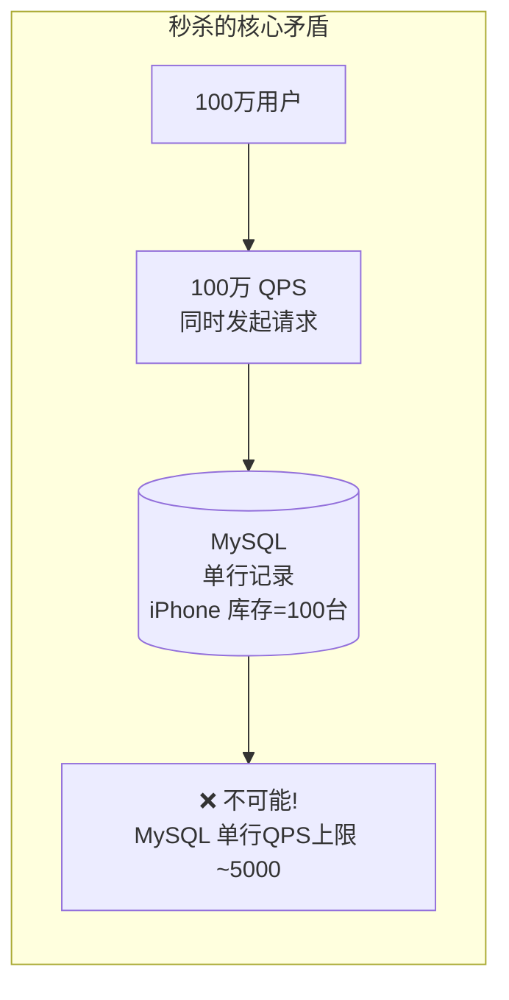
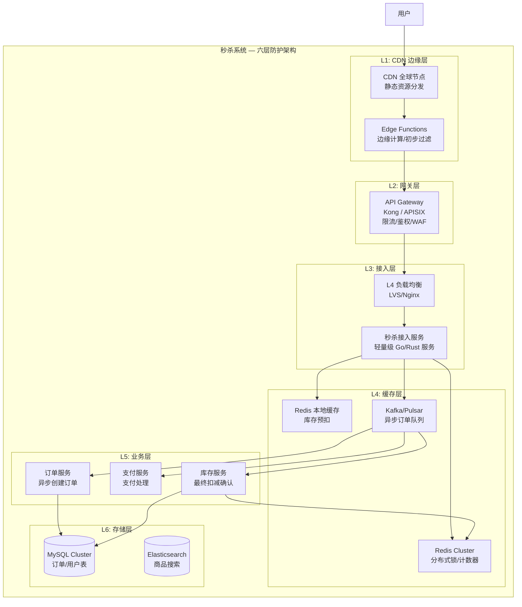
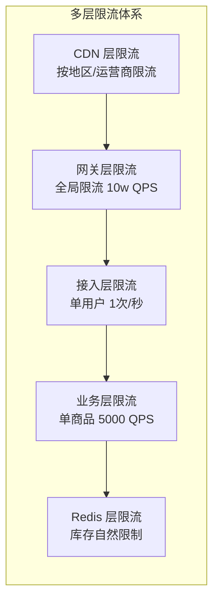

# 性能设计篇之"秒杀" [2026重制版]

> **核心变更说明**：本文基于原极客时间专栏"性能设计篇之秒杀"一讲重写，全面更新至2026年技术栈。新增完整的高并发秒杀架构设计、CDN 边缘计算削峰方案、Redis 预扣库存 + 异步下单、防刷限流完整实现、多级缓存预热策略、性能压测数据和生产级代码示例。

---

## 一、问题背景：秒杀系统的技术挑战

### 1.1 什么是秒杀？

**秒杀（Flash Sale）** 是一种限时限量促销方式——以极低价格销售有限数量的商品，在短时间内吸引大量用户抢购。

```mermaid
gantt
    title 典型秒杀活动时间线（以20:00开始为例）
    dateFormat HH:mm:ss
    axisFormat %H:%M

    section 活动前
    预热阶段 : done, pre, 19:55:00, 20:00:00
    缓存预热   : crit, cache, 19:55:00, 19:59:00
    数据预加载 : active, load, 19:59:00, 20:00:00

    section 活动中
    秒杀开始!  : milestone, m1, 20:00:00, 20:00:00
    流量洪峰   : active, peak, 20:00:00, 20:05:00
    库存售罄   : soldout, 20:05:00, 20:30:00

    section 活动后
    订单处理   : process, 20:30:00, 20:35:00
    数据一致性 : check, 21:00:00, 21:10:00

```



### 1.2 核心挑战分析

| 挑战维度 | 问题描述 | 严重程度 |
|----------|----------|----------|
| **瞬时高并发** | 百万用户同时请求 | ⭐⭐⭐⭐⭐ 致命 |
| **超卖问题** | 库存扣减不一致 | ⭐⭐⭐⭐⭐ 致命 |
| **热点数据** | 所有请求打同一行记录 | ⭐⭐⭐⭐⭐ 致命 |
| **恶意刷单** | 脚本/机器人抢购 | ⭐⭐⭐⭐ 严重 |
| **系统雪崩** | 依赖服务被拖垮 | ⭐⭐⭐⭐ 严重 |
| **用户体验** | 页面加载慢/按钮无响应 | ⭐⭐⭐ 一般 |

### 1.3 为什么秒杀如此困难？



**核心矛盾**：百万级 QPS 的请求 vs 单行数据库记录的写入瓶颈。

---

## 二、秒杀系统架构设计

### 2.1 整体架构图



### 2.2 各层职责详解

| 层级 | 组件 | 核心职责 | 技术手段 |
|------|------|----------|----------|
| **L1: CDN** | Cloudflare/Akamai | 静态资源、JS/CSS/图片 | 全球节点就近访问 |
| **L2: 网关** | Kong/APISIX | IP 限流、黑名单、WAF | 全局限流、人机验证 |
| **L3: 接入** | Go/Rust 高性能服务 | 请求校验、资格检查 | 协程/goroutine |
| **L4: 缓存** | Redis Cluster | 库存预扣、去重、计数 | Lua 脚本原子操作 |
| **L5: 业务** | 微服务集群 | 订单创建、支付、通知 | 异步消息驱动 |
| **L6: 存储** | MySQL + ES | 数据持久化、搜索 | 分库分表 |

---

## 三、核心模块实现

### 3.1 活动预热 — 缓存预热

在秒杀开始前，将商品信息、库存等数据提前加载到 Redis：

```java
@Service
@RequiredArgsConstructor
@Slf4j
public class SeckillWarmUpService {

    private final RedisTemplate<String, Object> redisTemplate;
    private final ActivityMapper activityMapper;

    /** 秒杀活动 Key 前缀 */
    private static final String SECKILL_STOCK_KEY = "seckill:stock:";
    private static final String SECKILL_USER_SET = "seckill:users:";  // 已购买用户 Set
    private static final String SECKILL_ACTIVITY = "seckill:activity:";

    /**
     * 预热秒杀活动数据
     * 在活动开始前 10 分钟执行
     */
    @Scheduled(cron = "0 */5 * * * ?")  // 每5分钟检查一次
    public void warmUpActivities() {
        List<SeckillActivity> activities = activityMapper.selectUpcomingActivities(
            LocalDateTime.now(),
            LocalDateTime.now().plusMinutes(15)
        );

        for (SeckillActivity activity : activities) {
            warmUpActivity(activity);
        }
    }

    /**
     * 预热单个活动
     */
    public void warmUpActivity(SeckillActivity activity) {
        String activityKey = SECKILL_ACTIVITY + activity.getId();
        String stockKey = SECKILL_STOCK_KEY + activity.getProductId();

        // 1. 设置活动状态（未开始）
        redisTemplate.opsForValue().set(
            activityKey,
            SeckillActivityStatus.WAITING.name(),
            Duration.ofMinutes(30)
        );

        // 2. 预加载库存到 Redis（使用 Redis Hash）
        Map<String, String> stockData = new HashMap<>();
        stockData.put("total", String.valueOf(activity.getTotalStock()));
        stockData.put("remaining", String.valueOf(activity.getTotalStock()));
        stockData.put("version", "0");  // 乐观锁版本号

        redisTemplate.opsForHash().putAll(stockKey, stockData);

        // 3. 设置过期保护（防止忘记清理）
        redisTemplate.expire(stockKey, Duration.ofHours(24));

        // 4. 初始化已购买用户集合（用于去重）
        redisTemplate.delete(SECKILL_USER_SET + activity.getId());

        log.info("秒杀活动预热完成: activityId={}, productId={}, stock={}",
            activity.getId(), activity.getProductId(), activity.getTotalStock());
    }
}
```

### 3.2 秒杀核心接口 — Redis 预扣库存

```java
@RestController
@RequestMapping("/api/seckill")
@RequiredArgsConstructor
@Slf4j
public class SeckillController {

    private final SeckillService seckillService;
    private final RateLimiter rateLimiter;  // Guava 令牌桶限流

    /**
     * 秒杀下单接口
     *
     * 完整流程：
     * 1. 用户资格校验（是否登录、是否已购买）
     * 2. Redis 预扣库存（Lua 脚本原子操作）
     * 3. 发送异步订单消息
     * 4. 立即返回"排队中"给用户
     */
    @PostMapping("/{activityId}/order")
    public ResponseEntity<SeckillResult> seckill(
            @PathVariable Long activityId,
            @RequestHeader("X-User-ID") Long userId,
            @RequestHeader("X-Token") String token) {

        // ====== L3: 快速失败校验 ======

        // 1. 限流：单用户每秒最多 1 次请求
        if (!rateLimiter.tryAcquire()) {
            return ResponseEntity.ok(SeckillResult.fail("操作过于频繁，请稍后再试"));
        }

        // 2. Token 校验（快速拒绝无效请求）
        if (!tokenService.validateToken(userId, token)) {
            return ResponseEntity.status(401).body(SeckillResult.fail("身份验证失败"));
        }

        // ====== L4: Redis 原子预扣库存 ======
        SeckillResult result = seckillService.preDeductStock(userId, activityId);

        return ResponseEntity.ok(result);
    }
}
```

```java
@Service
@RequiredArgsConstructor
@Slf4j
public class SeckillService {

    private final StringRedisTemplate stringRedisTemplate;
    private final KafkaTemplate<String, Object> kafkaTemplate;
    private final RedissonClient redissonClient;

    private static final String STOCK_SCRIPT =
        "local stockKey = KEYS[1] " +
        "local userSetKey = KEYS[2] " +
        "local userId = ARGV[1] " +
        "local activityId = ARGV[2] " +
        "" +
        "-- 1. 检查是否重复购买 " +
        "if redis.call('SISMEMBER', userSetKey, userId) == 1 then " +
        "    return {0, 'repeat_purchase'} " +
        "end " +
        "" +
        "-- 2. 顺序扣减库存（Lua脚本原子执行，无需Watch/CAS） " +
        "local current = tonumber(redis.call('HGET', stockKey, 'remaining')) " +
        "if current == nil or current <= 0 then " +
        "    return {0, 'sold_out'} " +
        "end " +
        "" +
        "local version = tonumber(redis.call('HGET', stockKey, 'version')) " +
        "redis.call('HSET', stockKey, 'version', version + 1) " +
        "redis.call('HSET', stockKey, 'remaining', current - 1) " +
        "redis.call('SADD', userSetKey, userId) " +
        "" +
        "return {1, 'success', current - 1}";

    /**
     * Redis 原子预扣库存（Lua 脚本保证原子性）
     */
    @Transactional
    public SeckillResult preDeductStock(Long userId, Long activityId) {
        String stockKey = "seckill:stock:" + activityId;
        String userSetKey = "seckill:users:" + activityId;

        try {
            // 执行 Lua 脚本 — 原子性保证
            DefaultRedisScript<List> script = new DefaultRedisScript<>();
            script.setScriptText(STOCK_SCRIPT);
            script.setResultType(List.class);

            List<Object> result = stringRedisTemplate.execute(
                script,
                Arrays.asList(stockKey, userSetKey),
                String.valueOf(userId),
                String.valueOf(activityId)
            );

            long code = (Long) result.get(0);
            String message = (String) result.get(1);

            if (code == 1) {
                // ====== 预扣成功 → 发送异步订单消息 ======
                int remainingStock = ((Number) result.get(2)).intValue();

                OrderCreatedEvent event = OrderCreatedEvent.builder()
                    .userId(userId)
                    .activityId(activityId)
                    .status(OrderStatus.PENDING)
                    .createTime(LocalDateTime.now())
                    .build();

                kafkaTemplate.send("seckill-orders", event);

                log.info("秒杀预扣成功: userId={}, activityId={}, remaining={}",
                    userId, activityId, remainingStock);

                return SeckillResult.success("排队中，请稍后查看订单状态");

            } else if ("repeat_purchase".equals(message)) {
                return SeckillResult.fail("您已参与过此活动，每人限购一件");
            } else if ("sold_out".equals(message)) {
                return SeckillResult.fail("抱歉，商品已被抢光");
            } else {
                return SeckillResult.fail("系统繁忙");
            }

        } catch (Exception e) {
            log.error("秒杀预扣异常: userId={}, activityId={}", userId, activityId, e);
            return SeckillResult.fail("系统繁忙，请重试");
        }
    }
}
```

### 3.3 异步订单处理

```java
@Component
@RequiredArgsConstructor
@Slf4j
public class SeckillOrderConsumer {

    private final OrderService orderService;
    private final InventoryService inventoryService;
    private final NotificationService notificationService;
    private final KafkaTemplate<String, Object> kafkaTemplate;

    /**
     * 消费秒杀订单消息 — 异步创建正式订单
     */
    @KafkaListener(
        topics = "seckill-orders",
        groupId = "seckill-order-consumer",
        concurrency = "10"  // 10个并行消费者
    )
    public void handleSeckillOrder(
            @Payload OrderCreatedEvent event,
            Acknowledgment acknowledgment) {

        String traceId = MDC.get("traceId");
        log.info("[{}] 处理秒杀订单: userId={}, activityId={}",
            traceId, event.getUserId(), event.getActivityId());

        try {
            // 1. 创建订单记录
            Order order = orderService.createSeckillOrder(event);

            // 2. 最终扣减库存（DB 层面）
            boolean deductSuccess = inventoryService.confirmDeductStock(
                event.getActivityId(),
                order.getId()
            );

            if (deductSuccess) {
                // 3. 更新订单状态为待支付
                orderService.updateStatus(order.getId(), OrderStatus.PENDING_PAYMENT);

                // 4. 发送支付超时消息（30分钟后自动取消）
                kafkaTemplate.send("payment-timeout",
                    PaymentTimeoutEvent.builder()
                        .orderId(order.getId())
                        .timeoutMinutes(30)
                        .build()
                );

                // 5. 发送通知
                notificationService.sendOrderNotification(order);

            } else {
                // 库存扣减失败 — 取消订单
                log.warn("库存最终扣减失败: orderId={}", order.getId());
                orderService.cancelOrder(order.getId(), "库存不足");
                // 回补 Redis 库存
                restoreStock(event.getActivityId());
            }

            acknowledgment.acknowledge();

        } catch (Exception e) {
            log.error("处理秒杀订单失败", e);
            // 不 ack，触发重试
        }
    }
}
```

---

## 四、防刷与限流策略

### 4.1 多维限流体系



### 4.2 Nginx 限流配置

```11-Nginx基础概述
# 11-Nginx基础概述-seckill.conf — 秒杀专用限流配置

# 定义限流区域（漏桶算法）
# $binary_remote_addr: 按 IP 限制
# rate=10r/s: 每秒允许 10 个请求
# burst: 允许突发的请求数（见下方 location 配置）
# nodelay: 不延迟处理（超过直接拒绝）
limit_req_zone $binary_remote_addr zone=per_ip_limit:10m rate=10r/s;
limit_req_zone $server_name zone=global_limit:10m rate=10000r/s;

server {
    listen 80;
    server_name seckill.example.com;

    # 全局限流
    limit_req zone=global_limit burst=50 nodelay;

    location /api/seckill/ {
        # IP 级别限流
        limit_req zone=per_ip_limit burst=5 nodelay;

        # 限流后的返回码（默认 503）
        limit_req_status 429;

        # 代理到后端
        proxy_pass http://seckill-backend:8080;

        # 超时设置
        proxy_connect_timeout 2s;
        proxy_read_timeout 3s;
    }

    # 返回友好的限流提示
    error_page 429 = @too_many_requests;

    location @too_many_requests {
        default_type application/json;
        return 429 '{"code":429,"message":"操作太频繁了，请休息一下再试"}';
    }
}
```

### 4.3 人机验证（滑块验证码）

```java
/**
 * 滑块验证码服务
 * 在秒杀按钮点击时触发
 */
@Service
@RequiredArgsConstructor
public class CaptchaService {

    private final RedisTemplate<String, String> redisTemplate;

    /**
     * 生成滑块验证码
     */
    public CaptchaDTO generateCaptcha(String sessionId) {
        // 1. 生成随机滑动距离和坐标
        int targetX = ThreadLocalRandom.current().nextInt(100, 250);
        int targetY = ThreadLocalRandom.current().nextInt(20, 80);

        // 2. 生成背景图（带缺口）和滑块图
        CaptchaImage bgImage = generateBackgroundWithGap(targetX, targetY);
        CaptchaImage sliderImage = generateSliderBlock(targetX, targetY);

        // 3. 将答案存入 Redis（有效期 60 秒）
        String captchaKey = "captcha:" + sessionId;
        redisTemplate.opsForValue().set(
            captchaKey,
            targetX + "," + targetY,
            Duration.ofSeconds(60)
        );

        return CaptchaDTO.builder()
            .captchaKey(captchaKey)
            .bgImage(bgImage.toBase64())
            .sliderImage(sliderImage.toBase64())
            .expiresIn(60)
            .build();
    }

    /**
     * 验证滑块结果
     */
    public boolean verifyCaptcha(String captchaKey, int slideDistance) {
        String answer = redisTemplate.opsForValue().getAndDelete(captchaKey);
        if (answer == null) {
            return false;  // 已过期或不存在
        }

        String[] parts = answer.split(",");
        int targetX = Integer.parseInt(parts[0]);
        // 允许 ±5px 的误差
        return Math.abs(slideDistance - targetX) <= 5;
    }
}
```

---

## 五、前端优化策略

### 5.1 防止重复提交

```javascript
// seckill.js — 秒杀页面前端逻辑

class SeckillPage {
    constructor() {
        this.isSubmitting = false;
        this.countdownTimer = null;
        this.activityId = this.getUrlParam('activityId');
        this.init();
    }

    async init() {
        // 1. 启动倒计时
        await this.fetchServerTime();  // 与服务器校准时间
        this.startCountdown();

        // 2. 绑定按钮事件
        const btn = document.getElementById('seckill-btn');
        btn.addEventListener('click', this.handleSeckill.bind(this));
    }

    // 防抖提交 — 防止疯狂点击
    async handleSeckill(e) {
        e.preventDefault();

        if (this.isSubmitting) {
            this.showToast('正在处理中，请勿重复点击...');
            return;
        }

        // 检查倒计时是否结束
        if (!this.isCountdownFinished()) {
            this.showToast('活动尚未开始!');
            return;
        }

        // 先展示滑块验证码
        const captchaPassed = await this.showCaptchaChallenge();
        if (!captchaPassed) {
            this.showToast('验证失败');
            return;
        }

        // 正式提交
        this.isSubmitting = true;
        this.setButtonLoading(true);

        try {
            const response = await fetch(`/api/seckill/${this.activityId}/order`, {
                method: 'POST',
                headers: {
                    'Content-Type': 'application/json',
                    'X-User-ID': getCurrentUserId(),
                    'X-Token': getAuthToken(),
                },
            });

            const result = await response.json();

            if (result.success) {
                this.showToast('🎉 抢购成功！正在排队中...', 'success');
                // 轮询订单状态
                this.pollOrderStatus(result.orderId);
            } else {
                this.showToast(result.message || '抢购失败', 'error');
            }
        } catch (error) {
            this.showToast('网络错误，请重试', 'error');
        } finally {
            this.isSubmitting = false;
            this.setButtonLoading(false);
        }
    }

    // 与服务器时间同步（每 5 秒校准一次）
    async fetchServerTime() {
        const resp = await fetch('/api/seckill/time');
        const { serverTime } = await resp.json();
        this.timeOffset = Date.now() - serverTime;
    }

    // 精确倒计时
    startCountdown() {
        this.countdownTimer = setInterval(() => {
            const remaining = this.calculateRemaining();
            this.updateCountdownDisplay(remaining);

            if (remaining <= 0) {
                clearInterval(this.countdownTimer);
                this.enableSeckillButton();
            }
        }, 200);  // 200ms 刷新一次
    }
}

// 页面加载完成后初始化
document.addEventListener('DOMContentLoaded', () => {
    new SeckillPage();
});
```

---

## 六、性能基准与容量规划

### 6.1 性能目标

| 指标 | 目标值 | 说明 |
|------|--------|------|
| **峰值 QPS** | 100,000+ | 支撑百万用户同时抢购 |
| **P99 延迟** | < 200ms | 从用户点击到返回结果 |
| **可用性** | 99.99% | 年停机 < 52 分钟 |
| **零超卖** | 100% 保证 | 库存精确 |
| **防刷能力** | > 99.9% 拦截 | 机器人/脚本拦截率 |

### 6.2 容量规划

```
┌──────────────────────────────────────────────┐
│         秒杀系统容量规划 (100万用户场景)         │
├──────────────────────────────────────────────┤
│                                              │
│  前端 (CDN):                                 │
│    ├── Cloudflare: 200+ 全球边缘节点          │
│    └── 静态资源带宽: 10 Gbps                  │
│                                              │
│  接入层:                                     │
│    ├── API Gateway: 8 核 16G × 3 节点         │
│    ├── Nginx: 4核 8G × 5 节点               │
│    └── 吞吐量: 15w QPS                       │
│                                              │
│  缓存层:                                     │
│    ├── Redis Cluster: 6 主 6 从              │
│    ├── 内存: 64GB 总量                       │
│    └── QPS: 50w+ (纯内存操作)                 │
│                                              │
│  消息队列:                                   │
│    ├── Kafka: 3 broker × 3 partition          │
│    ├── 吞吐量: 50w msg/s                     │
│    └── 保留时间: 7 天                         │
│                                              │
│  业务层:                                     │
│    ├── 订单服务: 8 pod × 4核 8G             │
│    ├── 库存服务: 4 pod × 4核 8G             │
│    └── 支付服务: 4 pod × 2核 4G             │
│                                              │
│  数据库:                                     │
│    ├── MySQL: 一主两从 (32核 128GB SSD)      │
│    └── 连接池: 每服务最大 50 连接             │
│                                              │
└──────────────────────────────────────────────┘
```

---

## 七、2026 最佳实践总结

### 7.1 秒杀系统设计原则

1. **尽量少做事**：能过滤的请求绝不放进去
2. **充分利用缓存**：所有读操作走缓存
3. **异步化一切**：非核心流程全部异步
4. **前端配合**：倒计时、防抖、友好提示
5. **兜底预案**：降级、熔断、人工干预

### 7.2 生产环境 Checklist

- [ ] **全链路压测**：至少进行 3 轮压测，覆盖峰值 120%
- [ ] **限流配置到位**：CDN→网关→接入→业务 四层限流
- [ ] **缓存预热完成**：活动开始前 10 分钟完成数据加载
- [ ] **监控大盘就绪**：QPS、延迟、错误率、库存余量实时展示
- [ ] **告警规则配置**：关键指标异常立即告警
- [ ] **回滚预案**：一键停止秒杀、恢复库存
- [ ] **客服准备**：FAQ 文档、话术模板
- [ ] **法务审核**：活动规则、退款政策

---

## 八、延伸资源

### 经典案例
- **淘宝双11**: https://developer.aliyun.com/article/767553
- **小米抢购**: https://tech.xiaomi.com/
- **12306 架构**: https://www.12306.cn/index/

### 开源项目
- [Seckill-Goods](https://github.com/qiuqiuqiu01/SecKill): Java 秒杀项目参考实现
- [miaosha](https://github.com/qiurunze123/miaosha): 高星 Java 秒杀项目参考实现
- [flash-sale](https://github.com/huangz1990/flash-sale): Go 语言秒杀实现

---

> **本文版本**：2026 重制版 | 基于原极客时间专栏"性能设计篇之秒杀"一讲重构
> **最后更新**：2026-06-06 | 技术栈：Redis 7.2 / Kafka 3.7 / Spring Boot 3.2 / Nginx 1.25 / Go 1.22
