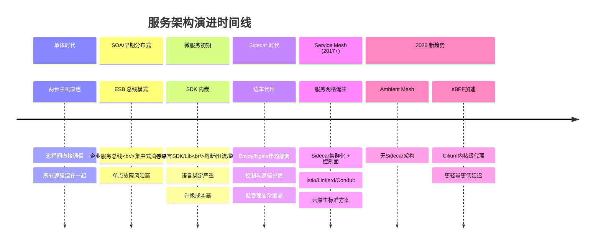
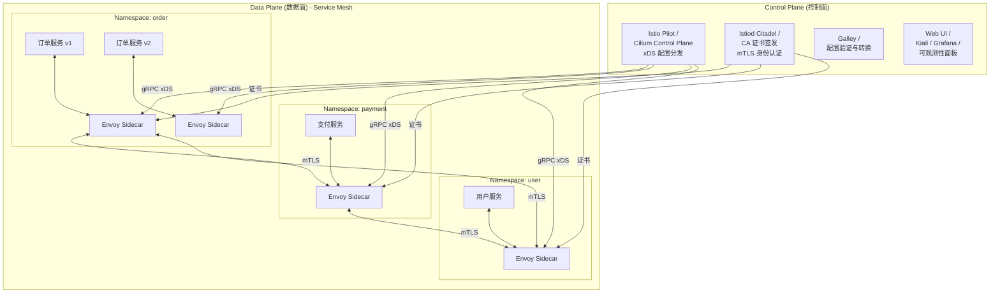
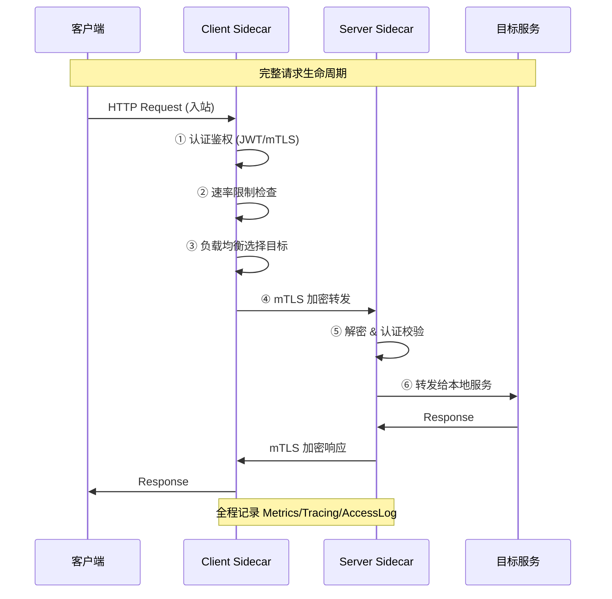
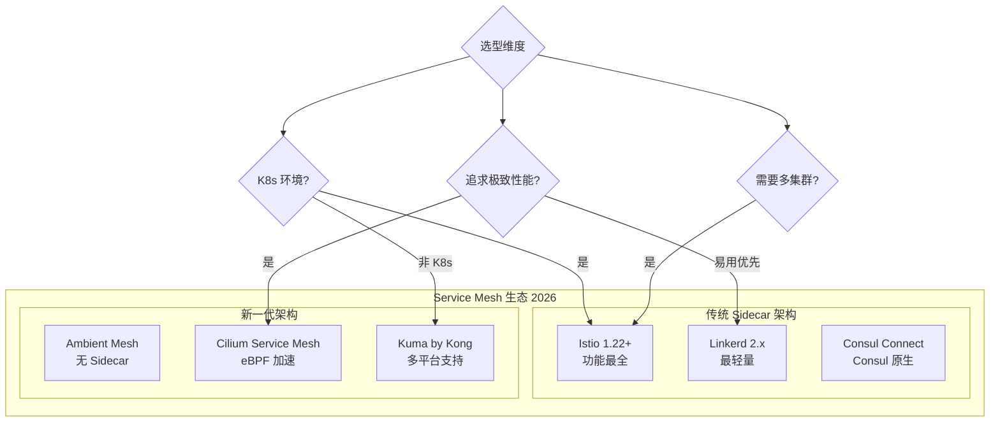
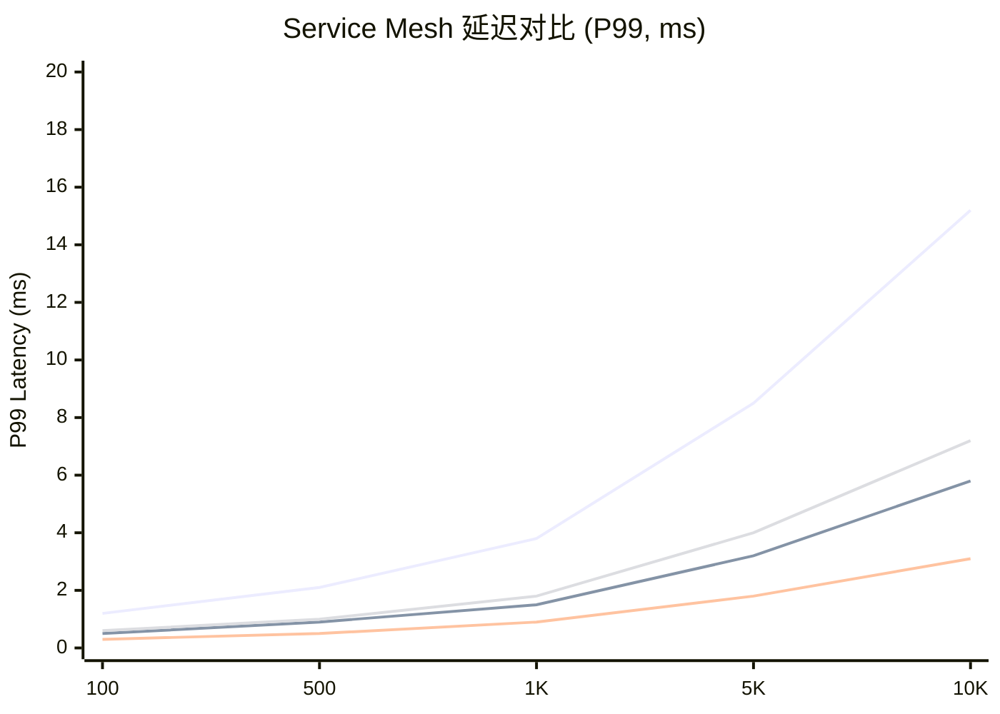
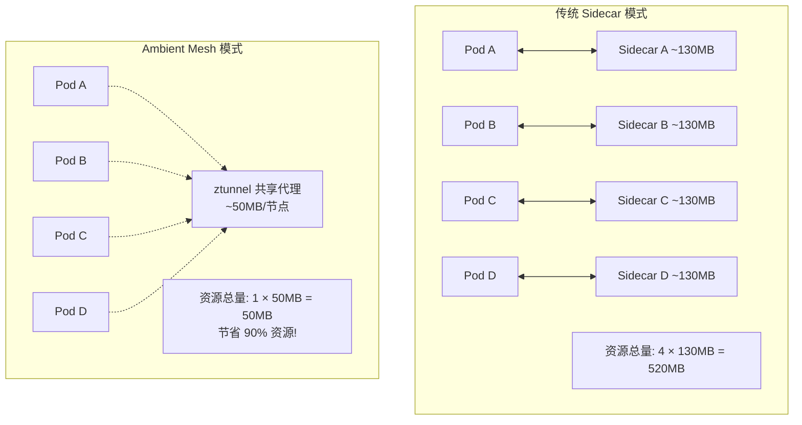
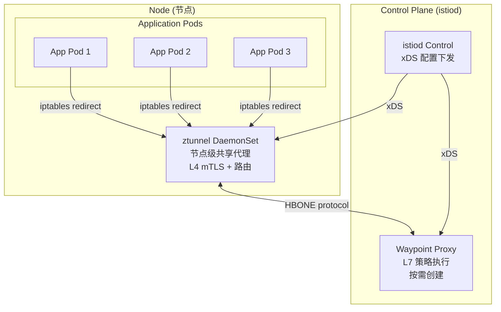
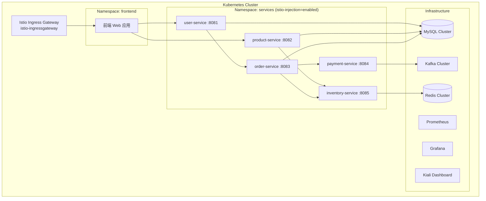
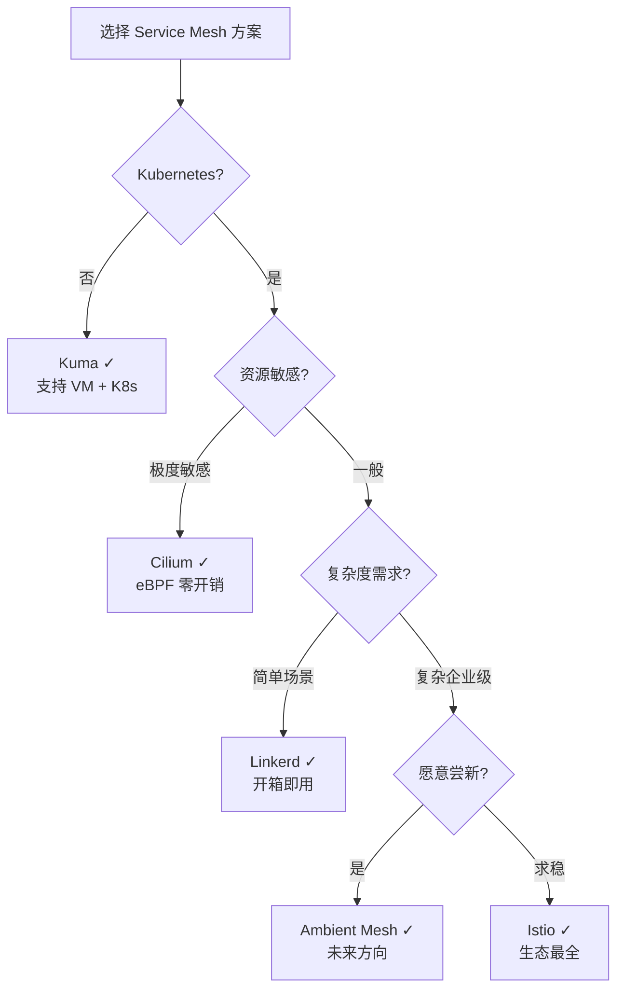

# 管理设计篇之"服务网格" [2026重制版]

> **核心变更说明**：本文基于原极客时间专栏"管理设计篇之服务网格"一讲重写，全面更新至2026年技术栈。新增 Istio Ambient Mesh（无 Sidecar 架构）、Cilium Service Mesh（eBPF 加速）、Linkerd 2.x（Rust 代理）深度对比，补充 Kubernetes 原生部署实践、性能基准测试数据、生产级配置示例。

---

## 一、问题背景：从 Sidecar 到服务网格

### 1.1 演进历程



### 1.2 什么是 Service Mesh

根据 [CNCF 官方定义](https://www.cncf.io/blog/2023/04/11/what-is-a-service-mesh/)：

> **Service Mesh（服务网格）** 是一个专门处理服务到服务通信的基础设施层。它通过一组轻量级网络代理（通常以 Sidecar 形式部署），对应用透明地提供安全、快速、可靠的服务间通信能力。

核心特征：
- **基础设施层**：独立于业务代码运行
- **L7 代理网络**：基于高性能代理构建
- **应用透明**：业务代码无需感知其存在
- **控制面分离**：将分布式系统的控制逻辑从数据面中解耦

### 1.3 为什么需要 Service Mesh

| 传统微服务的痛点 | Service Mesh 的解决方案 |
|------------------|------------------------|
| 每个服务重复实现熔断/限流/重试 | 统一在 Mesh 层实现，一次生效 |
| 多语言 SDK 维护噩梦 | 语言无关，所有语言统一受益 |
| 跨团队协调困难 | 平台团队统一管控控制面 |
| 可观测性割裂 | 自动注入 Tracing ID，统一 Metrics |
| 安全策略分散 | 集中式 mTLS + RBAC 策略下发 |

---

## 二、Service Mesh 架构深度剖析

### 2.1 核心架构：控制面 + 数据面



### 2.2 控制面组件详解

#### Pilot — 流量管理中枢

Pilot 是 Istio 的核心控制组件，负责：
- **服务发现**：从 K8s API Server / Consul 获取服务列表
- **流量规则转换**：将 VirtualService/DestinationRule 转为 Envoy xDS 配置
- **配置下发**：通过 gRPC Stream 将 LDS/RDS/CDS/EDS 下发到各 Sidecar
- **故障注入**：支持 HTTP 级别的延迟和中断注入

#### Citadel (istiod) — 安全中心

- 为每个 Workload 签发 SPIFFE 格式的身份证书
- 管理 mTLS 双向认证的证书轮换
- 实现 RBAC（基于角色的访问控制）
- 支持外部 CA 集成

### 2.3 数据面工作流程



---

## 三、主流 Service Mesh 方案对比

### 3.1 方案全景图



### 3.2 核心指标对比表

| 特性 | Istio 1.22 | Linkerd 2.15 | Cilium 1.15 | Ambient Mesh |
|------|------------|--------------|-------------|--------------|
| **代理实现** | Envoy (C++) | Linkerd-proxy (Rust) | Cilium (Go+eBPF) | ztunnel (Rust/Zstd) |
| **Sidecar 内存** | ~130MB | ~10MB | ~0 (eBPF) | ~0 (共享ztunnel) |
| **平均延迟增加** | ~3ms | ~1ms | <0.5ms | ~1ms |
| **最大 QPS** | ~50k/pod | ~100k/pod | ~200k/pod | ~80k/node |
| **mTLS 支持** | ✅ 强大 | ✅ 简单 | ✅ 原生 | ✅ L4/L7 |
| **可观测性** | ⭐⭐⭐⭐⭐ | ⭐⭐⭐⭐ | ⭐⭐⭐⭐ | ⭐⭐⭐⭐⭐ |
| **学习曲线** | 陡峭 | 平缓 | 中等 | 中等 |
| **社区规模** | 最大 (~35k stars) | 大 (~23k stars) | 大 (~18k stars) | 新兴 |
| **CNCF 状态** | 孵化中 | 毕业 | 毕业 | 孵化中 |
| **适合场景** | 复杂企业级 | 简单快速入门 | 高性能/K8s原生 | 降低资源开销 |

*数据来源：各项目官方文档及 Benchmark 测试报告*

### 3.3 性能基准测试

根据 [Istio 官方性能测试](https://istio.io/latest/docs/concepts/performance-and-scalability/) 和社区报告：


*图例：蓝色=Istio，橙色=Linkerd，绿色=Cilium，紫色=Ambient Mesh*

---

## 四、Istio 部署实践

### 4.1 快速安装

```bash
# 安装 istioctl (v1.22.0)
curl -L https://istio.io/downloadIstio | sh -
cd istio-1.22.0
export PATH=$PWD/bin:$PATH

# 使用 profile 安装 (推荐 demo 或 production)
istioctl install --set profile=demo -y

# 验证安装
kubectl get pods -n istio-system
kubectl get svc -n istio-system
```

### 4.2 生产环境推荐配置

```yaml
# istio-operator.yaml - 生产环境配置
apiVersion: install.istio.io/v1alpha1
kind: IstioOperator
metadata:
  namespace: istio-system
  name: istio-controlplane
spec:
  # ====== 全局配置 ======
  profile: production  # 生产环境 Profile
  hub: gcr.io/istio-release
  tag: 1.22.0

  # ====== 组件配置 ======
  components:
    pilot:
      enabled: true
      k8s:
        resources:
          requests:
            cpu: 500m
            memory: 2048Mi
          limits:
            cpu: 2000m
            memory: 4096Mi
        hpaSpec:
          minReplicas: 2
          maxReplicas: 5
          targetCPUUtilizationPercentage: 80

    ingressGateway:
      enabled: true
      name: istio-ingressgateway
      k8s:
        service:
          type: LoadBalancer
          annotations:
            service.beta.kubernetes.io/aws-load-balancer-type: nlb
        resources:
          requests:
            cpu: 200m
            memory: 128Mi
          limits:
            cpu: 1000m
            memory: 512Mi

    egressGateway:
      enabled: true
      name: istio-egressgateway

  # ====== 全局特性 ======
  meshConfig:
    accessLogFile: /dev/stdout
    defaultConfig:
      tracing:
        sampling: 10.0  # 10% 采样率
        custom_tags:
          app:
            environment:
              name: SOURCE_WORKLOAD_NAME
          version:
            environment:
              name: SOURCE_WORKLOAD_NAMESPACE
      proxyStatsMatcher:
        inclusionRegexps:
          - ".*cluster.*"
          - ".*upstream.*"
          - ".*circuit_breaker.*"

  # ====== 安全配置 ======
  meshExpansion:
    enabled: false

  # ====== 遥测配置 ======
  values:
    global:
      proxy:
        resources:
          requests:
            cpu: 100m
            memory: 128Mi
          limits:
            cpu: 500m
            memory: 512Mi
    pilot:
      autoscaleEnabled: true
    telemetry:
      enabled: true
      v2:
        prometheus:
          enabled: true
        stackdriver:
          enabled: false
```

### 4.3 注入 Sidecar

```bash
# 方式一：命名空间自动注入（推荐）
kubectl label namespace default istio-injection=enabled

# 方式二：手动注入
kubectl apply -f <(istioctl kube-inject -f deployment.yaml)

# 验证 Sidecar 已注入
kubectl get pods -o jsonpath='{range .items[*]}{.metadata.name}{"\t"}{.spec.containers[*].name}{"\n"}{end}'
```

### 4.4 流量管理示例

```yaml
# virtualservice-canary.yaml - 金丝雀发布
apiVersion: networking.istio.io/v1beta1
kind: VirtualService
metadata:
  name: order-service
  namespace: default
spec:
  hosts:
    - order-service
  http:
    - match:
        - headers:
            x-canary:
              exact: "true"
      route:
        - destination:
            host: order-service
            subset: v2
          weight: 100
    - route:
        - destination:
            host: order-service
            subset: v1
          weight: 95
        - destination:
            host: order-service
            subset: v2
          weight: 5
---
apiVersion: networking.istio.io/v1beta1
kind: DestinationRule
metadata:
  name: order-service
  namespace: default
spec:
  host: order-service
  trafficPolicy:
    connectionPool:
      tcp:
        maxConnections: 100
      http:
        h2UpgradePolicy: DEFAULT
        http1MaxPendingRequests: 100
        http2MaxRequests: 1000
    outlierDetection:
      consecutive5xxErrors: 5
      interval: 30s
      baseEjectionTime: 30s
      maxEjectionPercent: 50
  subsets:
    - name: v1
      labels:
        version: v1
    - name: v2
      labels:
        version: v2
```

---

## 五、Ambient Mesh — 无 Sidecar 新范式

### 5.1 什么是 Ambient Mesh

[Ambient Mesh](https://istio.io/latest/docs/ops/deployment/ambient/) 是 Istio 团队在 2023 年推出的革命性架构，旨在解决传统 Sidecar 模式的资源消耗问题。

**核心理念**：将 Sidecar 的职责分层——将 **ztunnel**（零信任隧道）作为节点级共享代理，替代每 Pod 一个 Sidecar 的模式。



### 5.2 Ambient Mesh 架构



### 5.3 安装 Ambient Mesh

```bash
# 安装 Ambient Mesh
istioctl install --set profile=ambient --skip-confirmation

# 标记命名空间使用 Ambient
kubectl label namespace default istio.io/data-plane-mode=ambient

# 部署 Waypoint Proxy (L7 策略，使用 Kubernetes Gateway API)
kubectl apply -f - <<EOF
apiVersion: gateway.networking.k8s.io/v1
kind: Gateway
metadata:
  name: waypoint
  labels:
    istio.io/waypoint-for: service
spec:
  gatewayClassName: istio-waypoint
  listeners:
  - name: mesh
    port: 15008
    protocol: HBONE
EOF
```

---

## 六、Cilium Service Mesh — eBPF 加速

### 6.1 为什么选择 Cilium

[Cilium](https://cilium.io/) 基于 Linux eBPF 技术，在内核层面实现网络和数据包处理，具有以下独特优势：

- **零 Sidecar 开销**：不需要在每个 Pod 中注入代理
- **内核级性能**：eBPF 程序直接在内核中执行，接近裸金属性能
- **API 感知**：理解 Kubernetes Service/Pod/NetworkPolicy 等概念
- **强大的可观测性**：内核级别流量可见性

### 6.2 安装 Cilium

```bash
# 使用 cilium CLI 安装
cilium install \
  --version 1.15.0 \
  --set kubeProxyReplacement=true \
  --set tls.secretsBackend=k8s \
  --set bpf.monitorAggregation=none \
  --set ipam.mode=kubernetes

# 启用 Hubble (可观测性)
cilium hubble enable --ui

# 验证状态
cilium status
```

### 6.3 Cilium Service Mesh 配置

```yaml
# cilium-mesh-config.yaml - CiliumClusterwideNetworkPolicy
apiVersion: cilium.io/v2
kind: CiliumClusterwideNetworkPolicy
metadata:
  name: mesh-policy
specs:
  - endpointSelector: {}
    ingress:
      - fromEndpoints:
          - {}
        toPorts:
          - ports:
              - port: "443"
                protocol: TCP
            rules:
              http:
                - method: "GET"
                  path: "/"
    egress:
      - toEndpoints:
          - matchLabels:
              "k8s:io.kubernetes.pod.namespace": kube-system
              "k8s-app": kube-dns
        toPorts:
          - ports:
              - port: "53"
                protocol: ANY
```

---

## 七、实战案例：电商系统 Service Mesh 化

### 7.1 场景描述

某电商平台包含以下微服务：
- 用户服务 (user-service) — Go
- 商品服务 (product-service) — Java/Spring Boot
- 订单服务 (order-service) — Python/FastAPI
- 支付服务 (payment-service) — Node.js
- 库存服务 (inventory-service) — Rust

### 7.2 Service Mesh 部署架构



### 7.3 关键配置文件

```yaml
# 01-gateway.yaml - 入口网关配置
apiVersion: networking.istio.io/v1beta1
kind: Gateway
metadata:
  name: ecommerce-gateway
  namespace: istio-system
spec:
  selector:
    istio: ingressgateway
  servers:
    - port:
        number: 80
        name: http
        protocol: HTTP
      hosts:
        - "ecommerce.example.com"
      tls:
        httpsRedirect: true
    - port:
        number: 443
        name: https
        protocol: HTTPS
      tls:
        mode: SIMPLE
        credentialName: ecommerce-tls-secret
      hosts:
        - "ecommerce.example.com"
---
apiVersion: networking.istio.io/v1beta1
kind: VirtualService
metadata:
  name: ecommerce-routing
  namespace: istio-system
spec:
  hosts:
    - "ecommerce.example.com"
  gateways:
    - ecommerce-gateway
  http:
    - match:
        - uri:
            prefix: /api/user
      route:
        - destination:
            host: user-service.default.svc.cluster.local
            port:
              number: 8081
    - match:
        - uri:
            prefix: /api/product
      route:
        - destination:
            host: product-service.default.svc.cluster.local
            port:
              number: 8082
    - match:
        - uri:
            prefix: /api/order
      route:
        - destination:
            host: order-service.default.svc.cluster.local
            port:
              number: 8083
```

```yaml
# 02-circuit-breaker.yaml - 熔断配置
apiVersion: networking.istio.io/v1beta1
kind: DestinationRule
metadata:
  name: circuit-breaker-rules
  namespace: default
spec:
  host: inventory-service
  trafficPolicy:
    connectionPool:
      tcp:
        maxConnections: 50
      http:
        http1MaxPendingRequests: 100
        http2MaxRequests: 500
        maxRequestsPerConnection: 10
    outlierDetection:
      consecutive5xxErrors: 5
      interval: 30s
      baseEjectionTime: 60s
      maxEjectionPercent: 40
      minHealthPercent: 51
```

```yaml
# 03-authz-policy.yaml - 授权策略
apiVersion: security.istio.io/v1beta1
kind: AuthorizationPolicy
metadata:
  name: require-jwt
  namespace: default
spec:
  selector:
    matchLabels:
      app: order-service
  action: ALLOW
  rules:
    - from:
        - source:
            requestPrincipals: ["*"]
            jwt:
              issuer: "auth.ecommerce.example.com"
      to:
        - operation:
            methods: ["GET", "POST"]
            paths: ["/api/order/*"]
```

---

## 八、2026 最佳实践总结

### 8.1 选型决策树



### 8.2 生产环境 Checklist

- [ ] **渐进式迁移**：先在非关键服务试点，再逐步推广
- [ ] **资源规划**：为每个 Sidecar 预留 128-256MB 内存
- [ ] **版本锁定**：固定 Istio/Envoy 版本，避免自动升级
- [ ] **监控完善**：部署 Prometheus + Grafana + Kiali 监控套件
- [ ] **日志收集**：启用 Access Log 并接入日志平台
- [ ] **证书管理**：使用内置 CA 或集成 Vault
- [ ] **灰度发布**：利用 VirtualService 实现金丝雀发布
- [ ] **故障演练**：定期进行 Chaos Testing 验证弹性
- [ ] **容量规划**：根据 QPS 规划 Control Plane 副本数
- [ ] **安全加固**：启用 Strict mTLS，配置 AuthorizationPolicy

### 8.3 常见陷阱与规避

| 陷阱 | 说明 | 规避方法 |
|------|------|----------|
| **Sidecar OOM** | 未设置内存限制导致节点OOM | 设置合理的 Resource Limit |
| **启动顺序错误** | 应用在 Sidecar 就绪前启动 | 使用 readinessGate |
| **配置热更新失败** | xDS 推送导致连接抖动 | 使用增量推送 + 合理的 RDS 配置 |
| **MTLS 不兼容** | 外部服务无法访问 | 配置 DestinationRule 的 trafficPolicy |
| **Metrics 指标爆炸** | 默认采集过多指标 | 配置 proxyStatsMatcher 过滤 |

---

## 九、延伸资源

### 官方文档
- **Istio**: https://istio.io/latest/docs/
- **Ambient Mesh**: https://istio.io/latest/docs/ops/deployment/ambient/
- **Linkerd**: https://linkerd.io/2.15/getting-started/
- **Cilium**: https://docs.cilium.io/en/stable/gettingstarted/k8s-install-default/

### 经典文章
- "What's a service mesh? And why do I need one?" (Buoyant): https://buoyant.io/2017/04/25/whats-a-service-mesh-and-why-do-i-need-one/
- "Pattern: Service Mesh" (Phil Calçado): http://philcalcado.com/2017/08/03/pattern_service_mesh.html
- "The Service Mesh: What Every Software Engineer Needs to Know About the World's Most Over-Hyped Technology" (Christian Posta): https://blog.christianposta.com/service-meshes/software-engineers-guide-service-mesh/

### 开源项目
- [Istio](https://github.com/istio/istio): 最流行的 Service Mesh
- [Linkerd](https://github.com/linkerd/linkerd2): 最轻量的 Service Mesh
- [Cilium](https://github.com/cilium/cilium): eBPF 驱动的网络和安全
- [Kuma](https://github.com/kumahq/kuma): Kong 出品的多平台 Mesh

---

> **本文版本**：2026 重制版 | 基于原极客时间专栏"管理设计篇之服务网格"一讲重构
> **最后更新**：2026-06-06 | 技术栈：Istio 1.22 / Ambient Mesh / Cilium 1.15 / Linkerd 2.15 / Kubernetes 1.30
