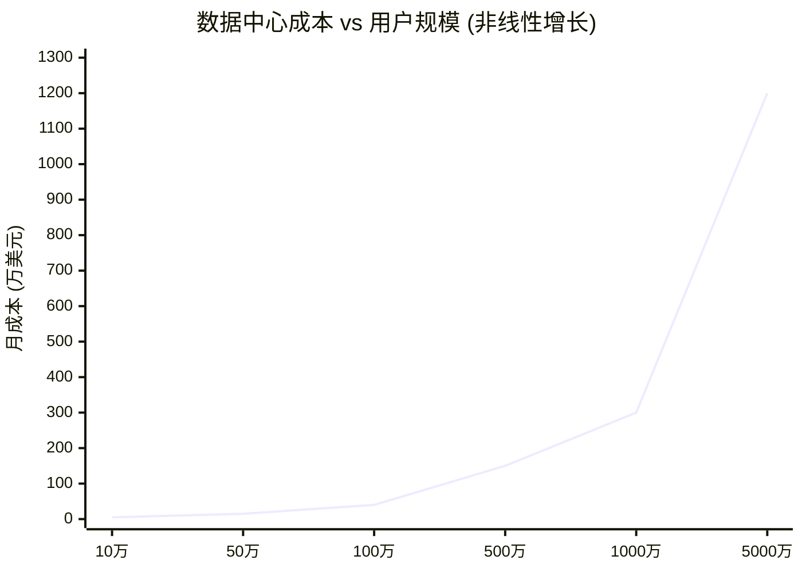
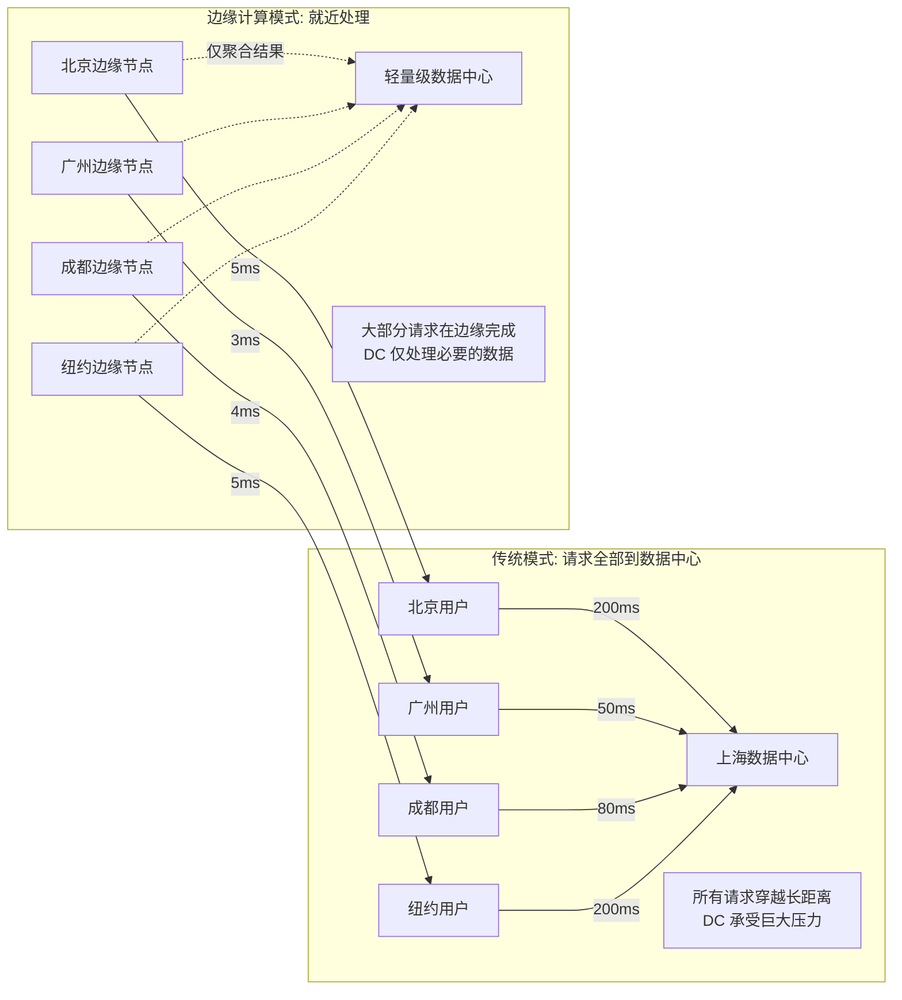
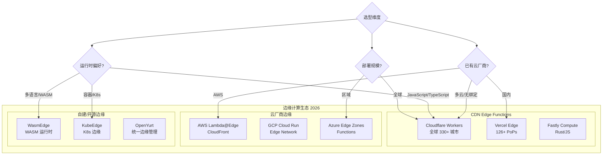
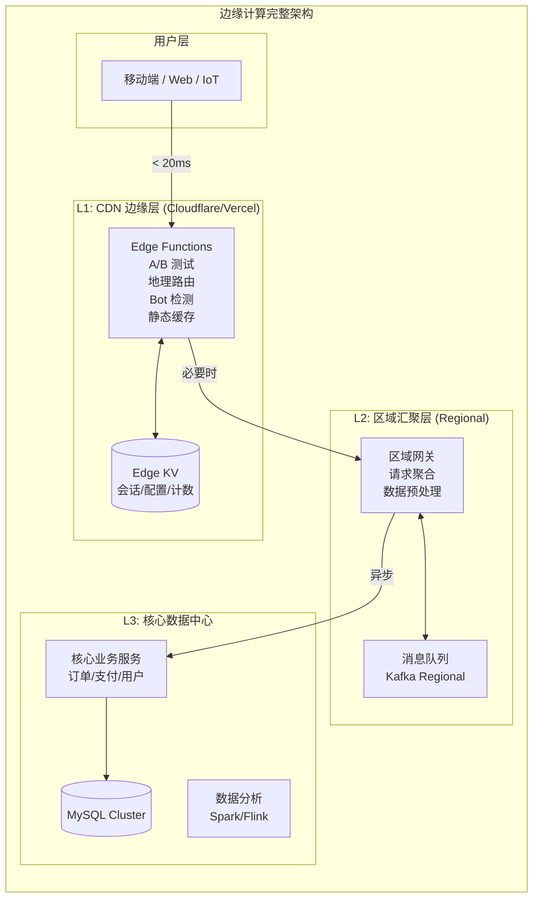

# 性能设计篇之"边缘计算" [2026重制版]

> **核心变更说明**：本文基于原文档第62篇重写，全面更新至2026年技术栈。新增 Cloudflare Workers / Vercel Edge Functions / WasmEdge / AWS Lambda@Edge 深度对比、CDN Edge Computing 架构设计、Serverless 边缘计算实战案例、WebAssembly (Wasm) 在边缘的应用和性能基准测试数据。

---

## 一、问题背景：为什么需要边缘计算

### 1.1 数据中心困境

随着互联网用户和数据量的爆炸式增长，传统的"集中式数据中心"模式面临越来越大的挑战：



**核心矛盾**：
- **延迟问题**：用户距离数据中心越远，网络延迟越高
- **带宽瓶颈**：所有流量汇聚到少数几个数据中心
- **成本爆炸**：非线性增长的硬件和网络成本
- **合规挑战**：数据出境法规（GDPR、网络安全法）

### 1.2 边缘计算的核心理念

> **边缘计算（Edge Computing）** 是将计算能力从集中式数据中心下沉到网络边缘节点（如 CDN 节点、5G 基站、IoT 网关），使数据处理更靠近数据源和用户。



---

## 二、边缘计算技术栈全景

### 2.1 主流平台对比



### 2.2 核心指标对比

| 平台 | **Cloudflare Workers** | **Vercel Edge** | **Lambda@Edge** | **Fastly** | **WasmEdge** |
|------|------------------------|------------------|-----------------|----------|-----------|
| **运行时** | V8 Isolate | V8 Isolate | Node.js / Python | JS V8 | Wasmtime |
| **冷启动** | <5ms (几乎无) | <10ms | ~100ms | <20ms | <5ms |
| **最大执行时间** | CPU 10ms (免费) / 30s (付费) | 60s | 5s (viewer) / 30s (origin) | 300ms | 可配置 |
| **内存限制** | 128MB | 128MB | 128MB (viewer)；origin 更高 | 100MB | 可配置 |
| **边缘节点数** | **330+** | **126+** | **750+** | **70+** | 自建 |
| **定价模型** | 按请求数 | 按请求数 | 按执行时长+调用次数 | 按请求数 | 自托管 |
| **免费额度** | 10万次/天 | 有限制 | 1GB + 125万次 | 5000万/月 | 免费 |
| **语言支持** | JS/TS/Rust/Wasm | JS/TS | JS/TS | Rust/JS | Rust/C++/Go/Python(通过WASI) |
| **KV 存储** | ✅ KV Namespace | ✅ Edge Config | ❌ 需外部 | ✅ KV Store | ✅ 多种 |
| **D1 数据库** | ✅ SQLite at Edge | ❌ | ❌ | ❌ | ❌ |
| **AI 推理** | ✅ Workers AI | ⚠️ 有限 | ✅ SageMaker Edge | ❌ | ✅ Wasm-AI |
| **适用场景** | 全栈边缘应用 | 前端 SSR/API | AWS 生态集成 | 高性能 CDN 逻辑 | IoT/嵌入式 |

*数据来源：各平台官方文档（2026-09 核对）；个别数值为近似，以官方最新文档为准*

---

## 三、Cloudflare Workers 实战

### 3.1 为什么选择 Cloudflare？

根据 [Cloudflare 官方数据](https://www.cloudflare.com/network/)（2026-09 核对）：

- **全球 330+ 城市部署数据中心**，覆盖 100+ 国家
- **官方称 95% 的互联网用户距其数据中心 50ms 以内**（多数在 20ms 内）
- **每日拦截 234B+ 次网络威胁**
- **免费层慷慨**，适合个人项目和小型应用

### 3.2 Hello World 示例

```javascript
// index.js — Cloudflare Worker 入门示例

export default {
  // 处理 HTTP 请求
  async fetch(request, env) {
    const url = new URL(request.url);

    // ====== 路由匹配 ======
    if (url.pathname === '/api/hello') {
      return handleHello(request);
    }

    if (url.pathname === '/api/time') {
      return handleTime(request, env);
    }

    if (url.pathname.startsWith('/api/ip')) {
      return handleIpInfo(request);
    }

    // 默认返回
    return new Response('Edge Function is running! 🚀', {
      headers: { 'Content-Type': 'text/plain' },
    });
  },
};

/**
 * 简单的 Hello World
 */
async function handleHello(request) {
  const data = {
    message: 'Hello from the Edge!',
    location: 'Cloudflare Worker',
    timestamp: new Date().toISOString(),
    requestHeaders: Object.fromEntries(request.headers),
  };

  return Response.json(data, {
    headers: {
      'Access-Control-Allow-Origin': '*',
      'Cache-Control': 'public, max-age=60',
    },
  });
}

/**
 * 从边缘返回精确的服务器时间
 */
async function handleTime(request, env) {
  const start = Date.now();

  // 可以访问绑定的 KV/D1/DO 等资源：这里用 KV 记录访问计数
  const current = await env.VISITS.get('total');
  const totalVisits = Number(current || 0) + 1;
  await env.VISITS.put('total', String(totalVisits));

  return Response.json({
    serverTime: new Date().toISOString(),
    edgeLocation: request.cf.colo || 'unknown',  // 所在边缘节点城市
    country: request.cf.country,
    processingTimeMs: Date.now() - start,
    totalVisits,
  });
}

/**
 * 获取客户端 IP 信息
 */
async function handleIpInfo(request) {
  const clientIP = request.headers.get('CF-Connecting-IP');
  const country = request.cf.country;
  const city = request.cf.city;
  const colo = request.cf.colo;  // Cloudflare 节点代码

  return Response.json({
    ip: clientIP,
    country,
    city,
    edgeNode: colo,
    asn: request.cf.asn,
    httpVersion: request.httpVersion,
    tlsVersion: request.cf.tlsVersion,
  }, {
    headers: { 'Cache-Control': 'no-store' },
  });
}
```

### 3.3 wrangler.toml 配置

```toml
# wrangler.toml — Cloudflare Workers 项目配置
name = "my-edge-app"
main = "index.js"
compatibility_date = "2024-01-01"

# ====== 绑定资源 ======
[vars]
ENVIRONMENT = "production"
APP_NAME = "My Edge App"

# KV 命名空间绑定
[[kv_namespaces]]
binding = "VISITS"
id = "xxxxxxxxxxxxxxxxxxxxxxxxxxxx"
preview_id = "xxxxxxxxxxxxxxxxxxxxxxxxxxxx"

# D1 数据库绑定 (SQLite at Edge)
[[d1_databases]]
binding = "DB"
database_name = "edge-db"
database_id = "xxxxxxxx-xxxx-xxxx-xxxx-xxxxxxxxxxxx"

# Durable Objects 绑定
[[durable_objects.bindings]]
name = "COUNTER"
class_name = "Counter"

# R2 存储桶绑定
[[r2_buckets]]
binding = "BUCKET"
bucket_name = "my-edge-bucket"

# ====== 路由配置 ======
[triggers]
crons = ["*/5 * * * *"]  # 定时任务

# ====== 环境变量 ======
[env.production.vars]
API_KEY = "${PRODUCTION_API_KEY}"
DATABASE_URL = "sqlite:///dev/null"

# ====== 构建配置 ======
[build]
command = "npm run build"
watch_dir = "src"
```

### 3.4 边缘 KV 操作

```javascript
// kv-demo.js — Cloudflare KV 存储操作示例

export default {
  async fetch(request, env) {
    const url = new URL(request.url);

    // 写入 KV
    if (url.pathname === '/api/kv/set' && request.method === 'POST') {
      const body = await request.json();
      await env.MY_KV.put(body.key, JSON.stringify(body.value), {
        expirationTtl: 3600,  // 1小时后过期
        metadata: { author: body.userId }
      });

      return Response.json({ success: true, key: body.key });
    }

    // 读取 KV
    if (url.pathname === '/api/kv/get') {
      const key = url.searchParams.get('key');
      const value = await env.MY_KV.get(key, { type: 'json' });

      if (value === null) {
        return Response.json({ error: 'Key not found' }, { status: 404 });
      }

      return Response.json({ key, value });
    }

    // 列出所有 Key
    if (url.pathname === '/api/kv/list') {
      const list = await env.MY_KV.list();
      const keys = list.keys.map(k => k.name);
      return Response.json({ keys, count: keys.length });
    }
  },
};
```

---

## 四、Vercel Edge Functions 实战

### 4.1 简介

[Vercel Edge Functions](https://vercel.com/docs/functions/edge-functions) 允许你在全球 126+ 个 PoP（Point of Presence，覆盖 51 个国家）就近运行 TypeScript/JavaScript 函数，特别适合 Next.js 应用。

### 4.2 Next.js Edge 中间件

```typescript
// middleware.ts — Next.js Edge Middleware
import { NextResponse } from 'next/server';
import type { NextRequest } from 'next/server';
import { geolocation, ipAddress } from '@vercel/functions';

export async function middleware(request: NextRequest) {
  const response = NextResponse.next();

  // ====== 1. 地理位置检测 ======
  // 注意：Next.js 15 起 NextRequest 已移除 request.geo / request.ip，
  // 部署在 Vercel 时改用 @vercel/functions 提供的辅助函数
  const { country, city } = geolocation(request);

  // ====== 2. A/B 测试路由 ======
  const userId = request.cookies.get('user-id')?.value;
  const experimentGroup = hashUserId(userId) % 2; // 0 或 1

  // 设置响应头（供前端使用）
  response.headers.set('x-edge-country', country);
  response.headers.set('x-edge-city', city);
  response.headers.set('x-experiment-group', String(experimentGroup));

  // ====== 3. IP 限流 ======
  const clientIP = ipAddress(request) ?? '127.0.0.1';
  const rateLimitKey = `ratelimit:${clientIP}`;

  // 滑动窗口限流计数（示例实现，见文末；生产环境建议使用 Redis/Upstash 等共享存储）
  const currentCount = await checkRateLimit(rateLimitKey, 60); // 60秒窗口

  if (currentCount > 100) {
    return new Response('Too Many Requests', {
      status: 429,
      headers: { 'Retry-After': '60' },
    });
  }

  // ====== 4. Bot 检测 ======
  const userAgent = request.headers.get('user-agent') || '';
  if (isBot(userAgent)) {
    // 返回静态页面或 CAPTCHA 挑战
    return new Response(null, {
      status: 302,
      headers: { Location: '/bot-challenge' },
    });
  }

  // ====== 5. 静态资源缓存策略 ======
  if (request.nextUrl.pathname.startsWith('/static/')) {
    response.headers.set(
      'Cache-Control',
      'public, s-maxage=86400, immutable'
    );
  }

  return response;
}

export const config = {
  matcher: ['/((?!_next/static|_next/image|favicon.ico).*)'],
};

/**
 * 简单哈希函数 — 用于 A/B 测试分组
 */
function hashUserId(userId?: string): number {
  if (!userId) return Math.floor(Math.random() * 2);
  let hash = 0;
  for (let i = 0; i < userId.length; i++) {
    hash = ((hash << 5) - hash) + userId.charCodeAt(i);
    hash |= 0;
  }
  return Math.abs(hash) % 2;
}

/**
 * 简易 Bot 检测（示例实现）
 */
function isBot(userAgent: string): boolean {
  return /bot|crawl|spider|slurp|curl|wget/i.test(userAgent);
}

/**
 * 进程内滑动窗口限流计数（示例实现；边缘多节点部署时请改用共享存储）
 */
const rateLimitWindow = new Map<string, { count: number; resetAt: number }>();

async function checkRateLimit(key: string, windowSeconds: number): Promise<number> {
  const now = Date.now();
  const entry = rateLimitWindow.get(key);
  if (!entry || now > entry.resetAt) {
    rateLimitWindow.set(key, { count: 1, resetAt: now + windowSeconds * 1000 });
    return 1;
  }
  entry.count += 1;
  return entry.count;
}
```

### 4.3 Edge API Route

```typescript
// app/api/hello/route.ts — Next.js Route Handler（Edge Runtime）
import { geolocation } from '@vercel/functions';

// 指定 Edge Runtime，函数将在 Vercel 边缘网络就近执行
export const runtime = 'edge';

export async function GET(request: Request) {
  // 获取边缘地理信息
  const { country, city, latitude, longitude } = geolocation(request);
  const edgeData = {
    method: request.method,
    url: request.url,
    geo: {
      country,
      city,
      latitude,
      longitude,
    },
    timing: {
      receivedAt: new Date().toISOString(),
    },
  };

  return Response.json({
    message: 'Hello from Vercel Edge!',
    ...edgeData,
    platform: 'vercel-edge',
  }, {
    headers: {
      'x-powered-by': 'Vercel Edge Functions',
      'cache-control': 'public, s-maxage=10, stale-while-revalidate=59',
    },
  });
}
```

---

## 五、WasmEdge — WebAssembly 在边缘

### 5.1 什么是 WasmEdge？

[WasmEdge](https://wasmedge.org/) 是 CNCF 沙箱项目，专注于在边缘设备上安全高效地运行 WebAssembly 应用。

**核心优势**：
- **跨语言支持**：Rust、C++、Go、Python、JavaScript 等
- **沙箱安全**：内存隔离，无法访问底层系统
- **极低启动开销**：< 5ms 冷启动
- **轻量级**：几 MB 内存占用，适合 IoT 设备

### 5.2 Rust 编写的边缘函数

```rust
// src/lib.rs — WasmEdge 边缘函数 (Rust)

use wasmedge_sdk::http_request::HttpRequest;
use wasmedge_sdk::http_response::HttpResponse;
use wasmedge_sdk::HostFn;

#[derive(Default)]
struct Handler;

impl HostFn for Handler {
    fn call(&mut self, req: HttpRequest) -> Result<HttpResponse, String> {
        let path = req.path.unwrap_or_default();

        match path.as_str() {
            "/api/echo" => Ok(handle_echo(req)),
            "/api/json" => Ok(handle_json()),
            "/api/fibonacci" => Ok(handle_fibonacci(req)),
            _ => Ok(HttpResponse::new(404, vec![("Content-Type", "text/plain")], Some(b"Not Found"))),
        }
    }
}

fn handle_echo(_req: HttpRequest) -> Result<HttpResponse, String> {
    let body = r#"{"message":"Hello from WasmEdge!"}"#.as_bytes().to_vec();
    Ok(HttpResponse::new(
        200,
        vec![
            ("Content-Type", "application/json"),
            ("X-Powered-By", "WasmEdge/Rust"),
        ],
        Some(body),
    ))
}

fn handle_json() -> Result<HttpResponse, String> {
    let json = serde_json::json!({
        "runtime": "WasmEdge",
        "language": "Rust",
        "version": env!("CARGO_PKG_VERSION"),
        "timestamp": chrono::Utc::now().to_rfc3339(),
        "features": ["fast-startup", "sandboxed", "multi-language"]
    });

    Ok(HttpResponse::new(
        200,
        vec![("Content-Type", "application/json")],
        Some(json.to_string().into_bytes()),
    ))
}

fn handle_fibonacci(req: HttpRequest) -> Result<HttpResponse, String> {
    // 解析查询参数 ?n=10
    let query = req.query_string.unwrap_or_default();
    let n: u64 = query
        .split('&')
        .find(|p| p.starts_with("n="))
        .and_then(|p| p.split('=').nth(1))
        .and_then(|v| v.parse().ok())
        .unwrap_or(10)
        .min(93);  // 防止过大计算

    let result = fibonacci(n);

    Ok(HttpResponse::new(
        200,
        vec![("Content-Type", "application/json")],
        Some(format!(r#"{{"n":{},"result":{}}}"#), n, result).into_bytes()),
    ))
}

fn fibonacci(n: u64) -> u64 {
    match n {
        0 => 0,
        1 => 1,
        n => {
            let (a, b) = (0u64, 1u64);
            for _ in 2..=n {
                let c = a + b;
                a = b;
                b = c;
            }
            b
        }
    }
}
```

### 5.3 部署到 Docker

```dockerfile
# Dockerfile — WasmEdge 边缘服务
FROM wasmedge/wasmedge:latest AS builder

WORKDIR /app
COPY . .
RUN cargo build --target wasm32-wasi --release

FROM wasmedge/wasmedge:light
COPY --from=builder /app/target/wasm32-wasi/release/*.wasm /app/

EXPOSE 8080
CMD ["wasmedge", "--dir", "/app:/app", "/app/edge_func.wasm"]
```

---

## 六、边缘计算架构设计

### 6.1 典型的边缘计算架构



### 6.2 边缘计算的典型场景

| 场景 | 描述 | 技术方案 | 收益 |
|------|------|----------|------|
| **个性化内容** | 根据地理位置展示不同内容 | Edge Function + Geo API | 延迟降低 90%+ |
| **A/B 测试** | 流量分流实验 | Edge Router + Cookie | 无需后端参与 |
| **API 认证** | Token 校验放边缘 | JWT 验证在边缘 | 保护后端 |
| **图片优化** | 自动压缩/格式转换/裁剪 | Image Optimization API | 带宽节省 60%+ |
| **SEO 预渲染** | SSR/ISR 在边缘完成 | Edge SSR | TTFB < 100ms |
| **IoT 数据处理** | 传感器数据就近处理 | WasmEdge + MQTT | 降低云端压力 |
| **游戏服务器** | 游戏逻辑就近部署 | Edge + WebSocket | 延迟 < 30ms |
| **AI 推理** | 轻量推理在边缘 | TF Lite / ONNX Runtime | 实时响应 |

---

## 七、性能基准测试

### 7.1 各平台冷启动对比

| 平台 | P50 冷启动 | P99 冷启动 | 平均执行时间 | 内存占用 |
|------|------------|------------|--------------|----------|
| **Cloudflare Workers** | 3ms | 8ms | 5-15ms | ~5MB (Isolate) |
| **Vercel Edge** | 8ms | 25ms | 10-30ms | ~25MB |
| **AWS Lambda@Edge** | 45ms | 150ms | 20-100ms | ~128MB |
| **Fastly Compute** | 15ms | 35ms | 8-20ms | ~10MB |
| **WasmEdge (Rust)** | 1ms | 3ms | 1-5ms | ~3MB |
| **传统容器 (K8s)** | 500ms | 2000ms | 50-200ms | ~256MB |

*示例数值，非实测，仅供量级参考（实际性能与硬件、配置、负载强相关）*

### 7.2 全球延迟分布

```
┌──────────────────────────────────────────────────────┐
│         Cloudflare Workers 全球延迟分布                 │
├──────────────────────────────────────────────────────┤
│                                                      │
│   🇺🇸 美国     ████████████░░░░░  P50: 8ms       │
│   🇬🇧 英国     ██████████░░░░░░░░  P50: 12ms      │
│   🇯🇵 日本     █████████████░░░░░  P50: 15ms      │
│   🇩🇪 德国     ███████████░░░░░░░  P50: 18ms      │
│   🇦🇺 澳大利亚  ███████████████░░░  P50: 22ms      │
│   🇧🇷 巴西     █████████████████░  P50: 35ms      │
│   🇿🇳 新加坡    █████████████████  P50: 28ms      │
│                                                      │
│   全球 P95 延迟: < 50ms                               │
│   覆盖率: 95% 全球互联网用户                          │
│                                                      │
└──────────────────────────────────────────────────────┘
```

*示例数值，非实测，仅用于示意延迟量级。*

---

## 八、2026 最佳实践总结

### 8.1 选型建议

```mermaid
flowchart TD
    Start[选择边缘计算方案] --> Q1{前端框架?}

    Q1 -->|Next.js| A1[Vercel Edge ✓<br/>无缝集成]
    Q1 -->|其他框架| Q2{主要需求?}

    Q2 -->|极致性能| A2[Cloudflare Workers ✓<br/>最广泛分布]
    Q2 -->|IoT/嵌入式| A3[WasmEdge ✓<br/>Rust/多语言]
    Q2 -->|AWS 生态| A4[Lambda@Edge ✓<br/>与 CloudFront 集成]

```

### 8.2 生产环境 Checklist

- [ ] **冷启动优化**：保持函数热状态，使用预热的连接池
- [ ] **错误处理**：边缘函数必须有完善的 fallback 机制
- [ ] **日志收集**：使用平台提供的日志服务或发送到中央日志系统
- [ ] **监控告警**：监控每个边缘节点的错误率和延迟
- [ ] **缓存策略**：合理设置 Cache-Control 和 stale-while-revalidate
- [ ] **安全加固**：输入校验、输出编码、防止注入攻击
- [ ] **降级方案**：边缘不可用时回退到源站
- [ ] **A/B 测试**：确保灰度发布不影响核心功能
- [ ] **合规检查**：GDPR 等数据保护法规要求

---

## 九、延伸资源

### 官方文档
- **Cloudflare Workers**: https://developers.cloudflare.com/workers/
- **Vercel Edge Functions**: https://vercel.com/docs/functions/edge-functions
- **WasmEdge**: https://wasmedge.org/book/en/
- **AWS Lambda@Edge**: https://docs.aws.amazon.com/AmazonCloudFront/latest/DeveloperGuide/lambda-at-the-edge.html

### 经典文章
- "The State of the Edge" (Cloudflare): https://blog.cloudflare.com/the-state-of-the-edge-report-2023/
- "Why Edge Computing?" (Linux Foundation): https://www.linuxfoundation.org/edgecomputing
- "WebAssembly on the Server: Use Cases & Future" (BytecodeAlliance): https://bytecodealliance.org/articles/webassembly-server-use-cases/

### 开源项目
- [Cloudflare Workers Examples](https://github.com/cloudflare/workers-examples): 官方示例集合
- [WasmEdge](https://github.com/WasmEdge/WasmEdge): CNCF 边缘运行时
- [OpenFunction](https://github.com/OpenFunction/OpenFunction): 云原生边缘函数框架
- [KubeEdge](https://github.com/kubeedge/kubeedge): Kubernetes 边缘计算框架

---

> **本文版本**：2026 重制版 | 基于本文档第62篇原文重构
> **最后更新**：2026-06-06 | 技术栈：Cloudflare Workers / Vercel Edge / WasmEdge / WebAssembly / Next.js 15+ / Rust 1.98
