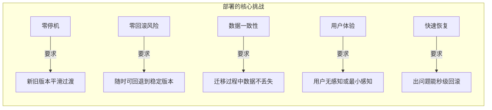
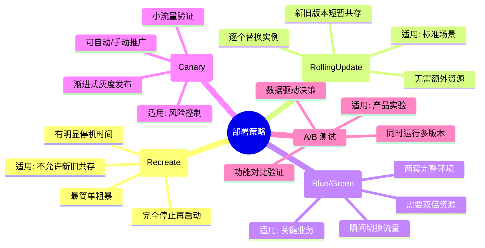
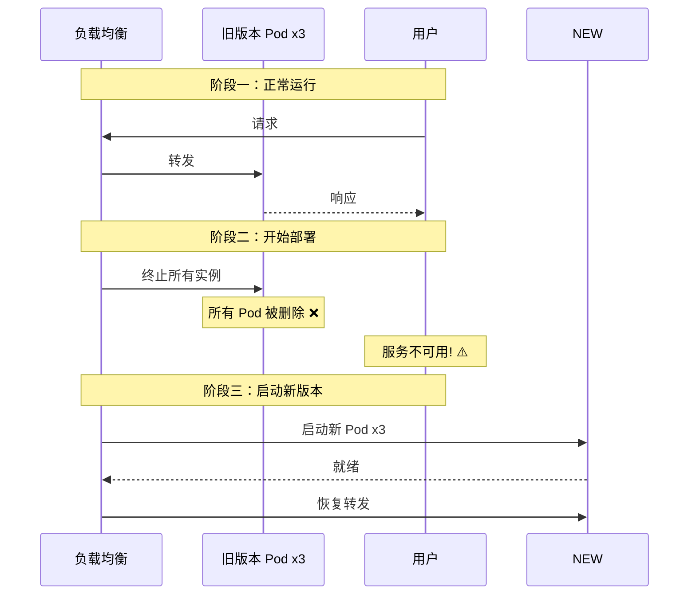
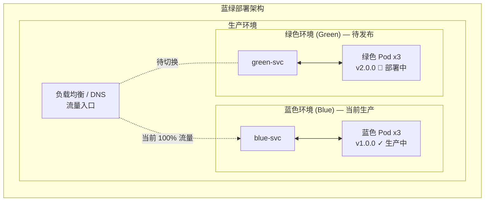
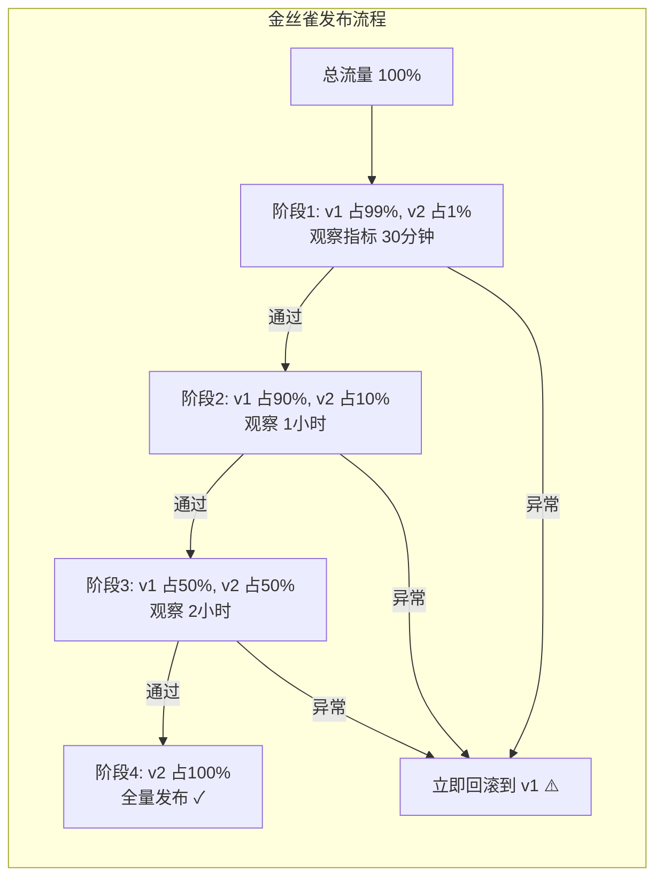
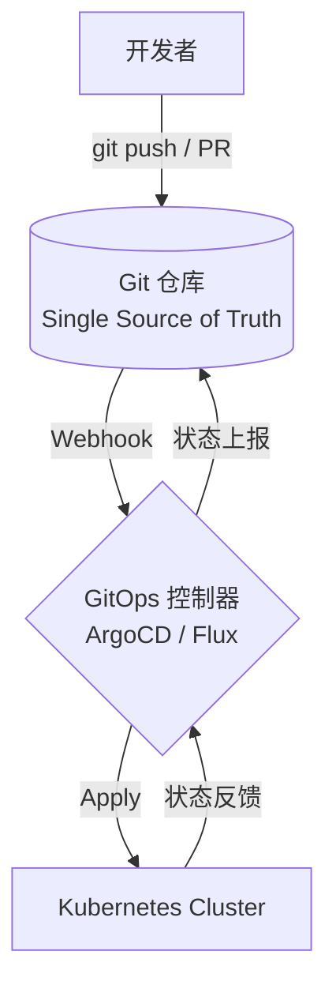
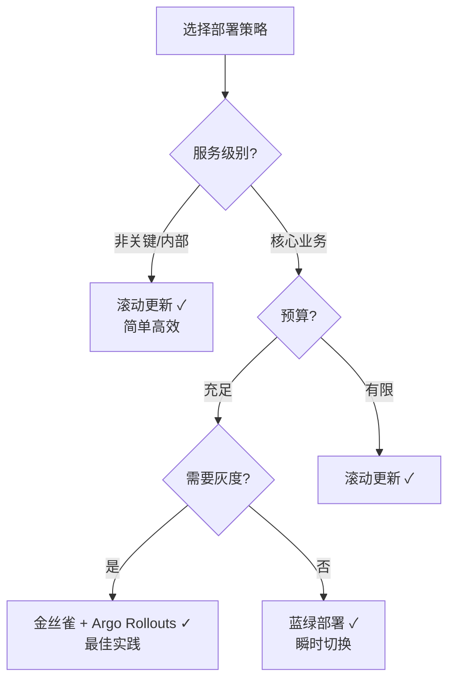

# 管理设计篇之"部署升级策略" [2026重制版]

> **核心变更说明**：本文基于原文档第57篇重写，全面更新至2026年技术栈。新增 GitOps（ArgoCD/FluxCD）部署实践、Kubernetes 原生滚动更新策略、蓝绿/金丝雀完整 YAML 配置、各策略性能对比数据。

---

## 一、问题背景：为什么需要精心设计部署策略

### 1.1 部署的本质

软件部署（Deployment）是将新版本的应用程序发布到生产环境的过程。在分布式系统中，一个服务通常运行多个实例（副本），这使得部署过程变得复杂——我们需要在不中断服务的情况下完成版本切换。



### 1.2 部署策略分类全景图



---

## 二、各部署策略深度剖析

### 2.1 停机部署 (Recreate / Big Bang)

**原理**：先终止所有旧版本实例，然后启动所有新版本实例。



**Kubernetes 配置**：

```yaml
# recreate-deployment.yaml
apiVersion: apps/v1
kind: Deployment
metadata:
  name: my-app-recreate
spec:
  replicas: 3
  strategy:
    type: Recreate  # 明确指定停机部署
  selector:
    matchLabels:
      app: my-app
  template:
    metadata:
      labels:
        app: my-app
        version: v2.0.0
    spec:
      containers:
        - name: my-app
          image: my-registry/my-app:v2.0.0
          ports:
            - containerPort: 8080
          resources:
            requests:
              cpu: 100m
              memory: 128Mi
            limits:
              cpu: 500m
              memory: 512Mi
```

| 优点 | 缺点 |
|------|------|
| ✅ 实现最简单 | ❌ **有明显的服务停机时间** |
| ✅ 不存在新旧版本同时在线的问题 | ❌ 用户体验差 |
| ✅ 状态完全一致 | ❌ 回滚慢（需重新启动旧版本） |

**适用场景**：
- 新旧版本数据库 schema 不兼容
- 必须一次性替换的场景
- 开发/测试环境（可接受短暂中断）

---

### 2.2 滚动更新 (Rolling Update / Ramped)

**原理**：逐个（或分批）替换实例，始终保持部分实例在线。

```mermaid
gantt
    title 滚动更新时序图 (3个副本, maxSurge=1, maxUnavailable=1)
    dateFormat X
    axisFormat %s

    section Pod-1 (旧v1)
    运行中           : done, p1, 0, 3
    终止中           : crit, p1t, 3, 5

    section Pod-2 (旧v1)
    运行中           : done, p2, 0, 4
    运行中           : active, p2a, 4, 7
    终止中           : crit, p2t, 7, 9

    section Pod-3 (旧v1)
    运行中           : done, p3, 0, 6
    运行中           : active, p3a, 6, 10
    终止中           : crit, p3t, 10, 12

    section 新Pod-1 (v2)
    启动中           : active, n1, 3, 5
    运行中           : done, n1r, 5, 12

    section 新Pod-2 (v2)
    启动中           : active, n2, 7, 9
    运行中           : done, n2r, 9, 12

    section 新Pod-3 (v2)
    启动中           : active, n3, 10, 12
    运行中           : done, n3r, 12, 13
```



**Kubernetes 配置**：

```yaml
# rolling-update-deployment.yaml
apiVersion: apps/v1
kind: Deployment
metadata:
  name: my-app-rolling
spec:
  replicas: 6
  strategy:
    type: RollingUpdate
    rollingUpdate:
      maxSurge: 1          # 滚动更新时最多超出期望副本数
      maxUnavailable: 0   # 滚动更新时最多不可用副本数 (0 = 零宕机)
  selector:
    matchLabels:
      app: my-app
  template:
    metadata:
      labels:
        app: my-app
        version: v2.1.0
    spec:
      # ====== 关键：优雅关闭 ======
      terminationGracePeriodSeconds: 30  # 优雅关闭等待时间
      containers:
        - name: my-app
          image: my-registry/my-app:v2.1.0
          ports:
            - containerPort: 8080
              protocol: TCP
          env:
            - name: POD_NAME
              valueFrom:
                fieldRef:
                  fieldPath: metadata.name
          # ====== 就绪探针 ======
          readinessProbe:
            httpGet:
              path: /health/ready
              port: 8080
            initialDelaySeconds: 5
            periodSeconds: 3
            failureThreshold: 3
            successThreshold: 1
          # ====== 存活探针 ======
          livenessProbe:
            httpGet:
              path: /health/live
              port: 8080
            initialDelaySeconds: 15
            periodSeconds: 10
            failureThreshold: 3
          # ====== 生命周期钩子 ======
          lifecycle:
            preStop:
              exec:
                command: ["/bin/sh", "-c", "sleep 5 && curl -X POST localhost:8080/shutdown"]
          resources:
            requests:
              cpu: 100m
              memory: 128Mi
            limits:
              cpu: 500m
              memory: 512Mi
```

**关键参数说明**：

| 参数 | 说明 | 推荐值 |
|------|------|--------|
| `maxSurge` | 更新期间最多额外创建的 Pod 数 | 25% 或绝对值 |
| `maxUnavailable` | 更新期间最多允许不可用的 Pod 数 | 0（零宕机）或 25% |
| `terminationGracePeriodSeconds` | 发送 SIGTERM 后等待时间 | 30~60s |
| `readinessProbe` | 就绪探针——决定是否接收流量 | 必须配置！ |
| `preStop` | 容器终止前执行的钩子 | sleep + 优雅下线 |

| 优点 | 缺点 |
|------|------|
| ✅ 无需额外资源 | ❌ 更新过程中新老版本共存 |
| ✅ 零停机（配置得当的话） | ❌ 同一用户的请求可能落到不同版本 |
| ✅ K8s 默认策略 | ❌ 出问题时回滚较慢 |
| ✅ 实现简单 | ❌ 无法控制流量比例 |

---

### 2.3 蓝绿部署 (Blue/Green)

**原理**：维护两套完全相同的环境（蓝和绿），新版本部署在"绿"环境，验证通过后一键切换流量。



**Kubernetes 实现**：

```yaml
# blue-green-deployment.yaml
apiVersion: apps/v1
kind: Deployment
metadata:
  name: my-app-blue
  labels:
    app: my-app
    env: blue
    version: v1.0.0
spec:
  replicas: 3
  selector:
    matchLabels:
      app: my-app
      env: blue
  template:
    metadata:
      labels:
        app: my-app
        env: blue
        version: v1.0.0
    spec:
      containers:
        - name: my-app
          image: my-registry/my-app:v1.0.0
          ports:
            - containerPort: 8080
---
apiVersion: apps/v1
kind: Deployment
metadata:
  name: my-app-green
  labels:
    app: my-app
    env: green
    version: v2.0.0
spec:
  replicas: 3
  selector:
    matchLabels:
      app: my-app
      env: green
  template:
    metadata:
      labels:
        app: my-app
        env: green
        version: v2.0.0
    spec:
      containers:
        - name: my-app
          image: my-registry/my-app:v2.0.0
          ports:
            - containerPort: 8080
---
# Service 指向蓝色（当前生产）
apiVersion: v1
kind: Service
metadata:
  name: my-app
spec:
  selector:
    app: my-app
    env: blue  # 当前指向蓝色环境
  ports:
    - port: 80
      targetPort: 8080
  type: ClusterIP
```

**流量切换脚本**：

```bash
#!/bin/bash
# switch-to-green.sh — 切换流量到绿色环境

set -e

NAMESPACE="default"
APP_NAME="my-app"

echo "=== 开始蓝绿切换 ==="
echo "当前状态:"
kubectl get svc $APP_NAME -n $NAMESPACE -o wide

# 1. 将 Service 的 selector 从 blue 改为 green
echo ""
echo "步骤1: 切换 Service 选择器到绿色环境..."
kubectl patch svc $APP_NAME -n $NAMESPACE -p '{"spec":{"selector":{"env":"green"}}}'

# 2. 等待 Endpoint 更新
echo ""
echo "步骤2: 等待 Endpoint 更新..."
sleep 5

# 3. 验证切换结果
echo ""
echo "步骤3: 验证切换结果..."
kubectl get endpoints $APP_NAME -n $NAMESPACE -o wide

echo ""
echo "=== 蓝绿切换完成! ==="
echo "流量已切换至绿色环境 (v2.0.0)"
echo "如需回滚，执行: kubectl patch svc $APP_NAME -p '{\"spec\":{\"selector\":{\"env\":\"blue\"}}}'"
```

| 优点 | 缺点 |
|------|------|
| ✅ **瞬时切换**，几乎零停机 | ❌ 需要**双倍资源**（两套完整环境） |
| ✅ 回滚极快（切回去即可） | ❌ 需要保持两套环境的配置同步 |
| ✅ 可以在新环境充分测试后再切 | ❌ 数据库 schema 变更仍需特殊处理 |
| ✅ 适合关键业务 | ❌ 成本较高 |

---

### 2.4 金丝雀部署 (Canary / 灰度发布)

**原理**：将一小部分流量导向新版本，验证通过后逐步扩大流量占比。



**Argo Rollouts 金丝雀配置**：

```yaml
# canary-deployment.yaml
apiVersion: argoproj.io/v1alpha1
kind: Rollout
metadata:
  name: my-app-canary
spec:
  replicas: 10
  strategy:
    canary:
      # ====== 金丝雀配置 ======
      steps:
        # 步骤1: 暂停，设置金丝雀权重为 10%
        - setWeight: 10
        - pause: {duration: 5m}

        # 步骤2: 增加到 30%
        - setWeight: 30
        - pause: {duration: 10m}

        # 步骤3: 增加到 50%
        - setWeight: 50
        - pause: {duration: 10m}

        # 步骤4: 全量发布
        - setWeight: 100

      # ====== 分析模板（用于自动判断是否推进）=====
      analysis:
        templates:
          - templateName: success-rate
        startingStep: 1  # 从第一步开始分析
        args:
          - name: service-name
            value: my-app-canary

      # ====== 流量路由 ======
      canaryService: my-app-canary-canary  # 金丝雀 Service
      stableService: my-app-canary-stable  # 稳定版 Service

  revisionHistoryLimit: 2
  selector:
    matchLabels:
      app: my-app
  template:
    metadata:
      labels:
        app: my-app
    spec:
      containers:
        - name: my-app
          image: my-registry/my-app:v2.2.0
          ports:
            - containerPort: 8080
          readinessProbe:
            httpGet:
              path: /health/ready
              port: 8080
            initialDelaySeconds: 5
            periodSeconds: 5
---
# AnalysisTemplate — 自动化质量门禁
apiVersion: argoproj.io/v1alpha1
kind: AnalysisTemplate
metadata:
  name: success-rate
spec:
  metrics:
    - name: success-rate
      successCondition: result[0] >= 0.95  # 成功率 >= 95%
      provider:
        prometheus:
          query: |
            sum(rate(http_requests_total{service="my-app-canary",code="200"}[5m]))
            /
            sum(rate(http_requests_total{service="my-app-canary"}[5m]))
      failureLimit: 3  # 连续失败 3 次则中止发布

    - name: error-rate
      successCondition: result[0] <= 0.01  # 错误率 <= 1%
      provider:
        prometheus:
          query: |
            sum(rate(http_requests_total{service="my-app-canary",code=~"5.."}[5m]))
            /
            sum(rate(http_requests_total{service="my-app-canary"}[5m]))
      failureLimit: 3

    - name: p95-latency
      successCondition: result[0] < 500  # P95 延迟 < 500ms
      provider:
        prometheus:
          query: histogram_quantile(0.95,
            sum(rate(http_request_duration_seconds_bucket{service="my-app-canary"}[5m])) by (le))
      failureLimit: 3
---
# 金丝雀 Service
apiVersion: v1
kind: Service
metadata:
  name: my-app-canary-canary
spec:
  selector:
    app: my-app
    # Argo Rollouts 会自动添加 rollouts-pod-template-hash label
  ports:
    - port: 80
      targetPort: 8080
---
# 稳定版 Service
apiVersion: v1
kind: Service
metadata:
  name: my-app-canary-stable
spec:
  selector:
    app: my-app
  ports:
    - port: 80
      targetPort: 8080
```

---

## 三、GitOps 部署模式

### 3.1 什么是 GitOps

GitOps 是一种使用 Git 作为声明式基础设施和应用单一事实来源的操作模型。所有变更通过 Git Pull Request 触发，自动化工具负责将期望状态同步到集群。



### 3.2 ArgoCD 完整部署流程

```bash
# 安装 ArgoCD
kubectl create namespace argocd
kubectl apply -n argocd -f https://raw.githubusercontent.com/argoproj/argo-cd/stable/manifests/install.yaml

# 登录 ArgoCD UI（先做端口转发）
kubectl port-forward svc/argocd-server -n argocd 8080:443
argocd login localhost:8080

# 创建应用（声明式）
kubectl apply -f - <<EOF
apiVersion: argoproj.io/v1alpha1
kind: Application
metadata:
  name: my-app-production
  namespace: argocd
spec:
  project: default
  source:
    repoURL: https://github.com/my-org/app-deployments.git
    targetRevision: main
    path: overlays/production
  destination:
    server: https://kubernetes.default.svc
    namespace: production
  syncPolicy:
    automated:
      prune: true
      selfHeal: true
      allowEmpty: false
    syncOptions:
      - CreateNamespace=true
      - PrunePropagationPolicy=foreground
    retry:
      limit: 5
      backoff:
        duration: 5s
        factor: 2
        maxDuration: 3m
EOF
```

### 3.3 Kustomize 多环境管理

```yaml
# overlays/production/kustomization.yaml — 生产环境叠加配置
namespace: production
resources:
  - ../../base
labels:
  - pairs:
      environment: production
      team: platform

configMapGenerator:
  - name: app-config
    behavior: merge
    literals:
      - LOG_LEVEL=INFO
      - DB_POOL_SIZE=20
      - CACHE_TTL=3600

images:
  - name: my-app
    newTag: v2.2.0

replicas: 6
```

---

## 四、各策略对比总结

### 4.1 决策矩阵

| 维度 | 停机部署 | 滚动更新 | 蓝绿部署 | 金丝雀 | GitOps+Canary |
|------|----------|----------|----------|--------|---------------|
| **停机时间** | 有 | 无（配置好） | 无 | 无 | 无 |
| **资源开销** | 最小 | 最小 | **2x** | 较小 | 较小 |
| **回滚速度** | 慢 | 中等 | **极快** | 快 | **极快** |
| **实现复杂度** | 低 | 低 | 中等 | 中高 | 高 |
| **风险控制** | 差 | 一般 | 好 | **最好** | **最好** |
| **用户体验** | 差 | 一般 | 好 | **最好** | **最好** |
| **适用规模** | 小型 | 中大型 | 关键业务 | 所有规模 | 大型企业 |

### 4.2 选型建议



---

## 五、2026 最佳实践总结

### 5.1 生产部署 Checklist

- [ ] **健康检查完备**：readinessProbe + livenessProbe 双保险
- [ ] **优雅关闭**：preStop hook + terminationGracePeriodSeconds
- [ ] **零宕机配置**：maxUnavailable=0（滚动更新）
- [ ] **PDB 保护**：PodDisruptionBudget 防止自愿性中断
- [ ] **自动化回滚**：deployment.spec.revisionHistoryLimit >= 5
- [ ] **监控覆盖**：发布过程中实时监控 Error Rate / P99 Latency
- [ ] **通知机制**：发布开始/完成/失败及时通知相关人员
- [ ] **数据库兼容**：新版本必须向后兼容当前数据库 schema
- [ ] **Feature Flag**：配合功能开关降低发布风险
- [ ] **全链路压测**：每次大版本发布前进行压力测试

### 5.2 推荐技术栈组合

```
┌─────────────────────────────────────────────┐
│           2026 推荐部署技术栈                  │
├─────────────────────────────────────────────┤
│  编排引擎: Kubernetes 1.35+                   │
│  GitOps 工具: ArgoCD 3.5+ 或 Flux 2.9+      │
│  发布策略: Argo Rollouts (金丝雀)             │
│  配置管理: Kustomize / Helm                  │
│  秘钥管理: External Secrets Operator         │
│  监控告警: Prometheus + Grafana + AlertManager │
│  日志收集: Loki / ELK                        │
│  追踪系统: Jaeger / Tempo                    │
│  混沌工程: Chaos Mesh / Litmus               │
└─────────────────────────────────────────────┘
```

---

## 六、延伸资源

### 官方文档
- **Kubernetes Deployments**: https://kubernetes.io/docs/concepts/workloads/controllers/deployment/
- **Argo Rollouts**: https://argoproj.github.io/rollouts/
- **ArgoCD**: https://argo-cd.readthedocs.io/
- **Flux**: https://fluxcd.io/docs/

### 经典文章
- "Deployment Strategies" (Nginx): https://www.11-Nginx基础概述.com/blog/deployment-strategies/
- "Blue-Green Deployments" (Martin Fowler): https://martinfowler.com/bliki/BlueGreenDeployment.html
- "Canary Releases" (Martin Fowler): https://martinfowler.com/bliki/CanaryRelease.html
- "GitOps - Operations by Pull Request": https://www.gitops.tech/

### 开源项目
- [Argo Rollouts](https://github.com/argoproj/argo-rollouts): Kubernetes 声明式发布工具
- [Flux](https://github.com/fluxcd/flux2): GitOps 工具包
- [Keptn](https://github.com/keptn/keptn): 云原生发布编排平台
- [Flagger](https://github.com/fluxcd/flagger): 渐进式交付工具

---

> **本文版本**：2026 重制版 | 基于本文档第57篇原文重构
> **最后更新**：2026-06-06 | 技术栈：Kubernetes 1.37 / ArgoCD 3.5 / Argo Rollouts 1.10 / Flux 2.9
