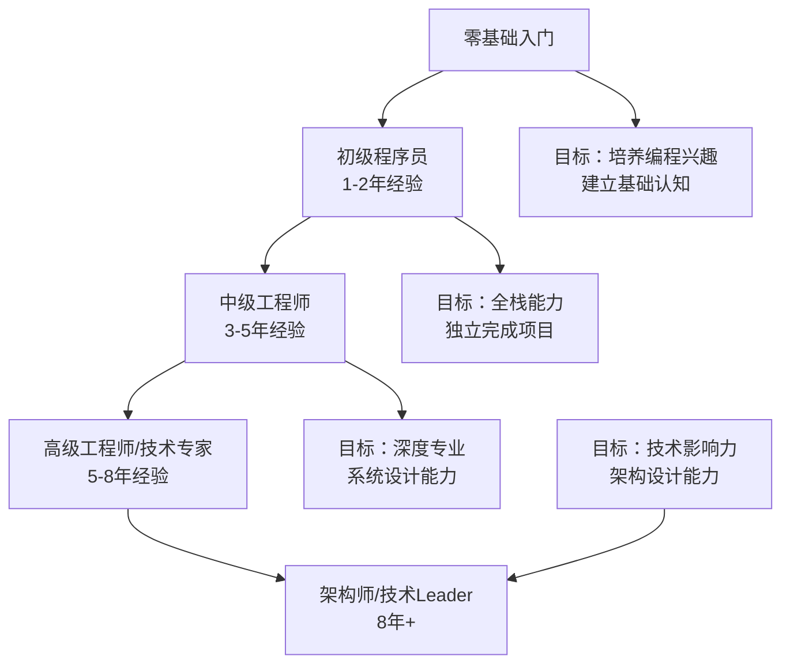
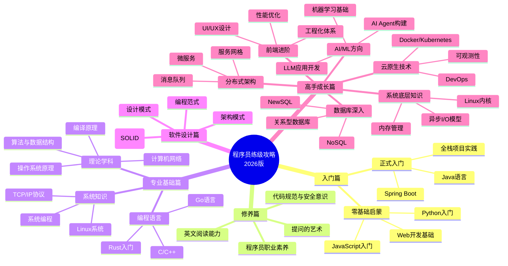
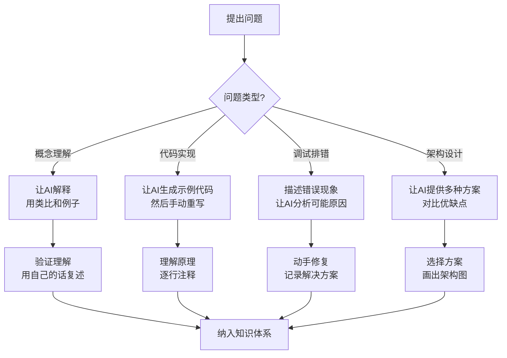

# 程序员练级攻略：开篇词-[2026重制版]

> **核心变更说明**：本文基于2018年版《程序员练级攻略》全面升级，整合了2026年最新技术栈、AI辅助编程工具链、云原生技术生态，以及Stack Overflow 2025开发者调查、JetBrains State of Rust 2025、GitHub Octoverse 2025等权威数据，为新时代程序员提供系统化的成长路径。

本文档旨在为程序员提供系统化的成长路径和练级攻略。

2011年，我在 [技术社区](https://coolshell.cn/) 上发表了《[程序员技术练级攻略](https://coolshell.cn/articles/4990.html)》一文，收到了很多读者的追捧。2018年，我在极客时间专栏中对其进行了首次系统性升级。时光荏苒，转眼间又过去了8年，技术世界发生了翻天覆地的变化：

- **AI编程助手**从概念走向成熟，Copilot、Cursor、Claude Code已成为开发者的标配工具
- **编程语言格局**重塑：TypeScript称霸前端，Rust强势崛起，Python凭借AI生态持续火热
- **云原生技术**成为基础设施标准：Kubernetes、Docker、Service Mesh深入人心
- **前端工程化**进入新纪元：React 19、Vue 3.5、Vite 6构建了全新的开发体验
- **后端架构**演进：微服务、Serverless、事件驱动架构成为主流范式

是的，**老实说，抛开这几年技术的更新迭代不说，那篇文章写得也不算特别系统，同时标准也有点低**。所以，非常有必要基于2026年的技术现状，从头更新一下《程序员练级攻略》这一主题。

## 📊 2026年技术图景概览

根据 **Stack Overflow Developer Survey 2025** 和 **GitHub Octoverse 2025报告**：

| 技术领域 | 主流技术栈（2026） | 市场占有率/使用率 | 趋势 |
|---------|------------------|------------------|------|
| 前端框架 | React 19, Vue 3.5, Next.js 15 | React: 40.58%, Vue: 22.71% | 稳定增长 |
| 编程语言 | TypeScript, Python, Rust, Go, Java 21+ | TS: 68.2%, Python: 65.5% | TS持续领先 |
| 后端框架 | Spring Boot 3.x/4.x, FastAPI, Node.js 22 | Spring Boot: 55% (Java生态) | 云原生适配 |
| 数据库 | PostgreSQL 17, MySQL 8.4 LTS / 9.x, Redis 7.4 | PG: 28.6%, MySQL: 24.8% | PG快速增长 |
| 容器编排 | Kubernetes 1.36, Docker 26 | K8s: 92% (容器编排市场) | 行业标准 |
| AI/ML工具 | PyTorch 2.5, LangChain, Transformers | PyTorch: 86% (学术) | AI Native应用爆发 |

> 注：表中数值为基于上述行业报告的示例性归纳，非精确实测数据，仅供量级参考。

## 🎯 学习目标与受众定位

### 本攻略的核心目标

### 受众定位

1. **零基础学习者**：想转行做程序员的大学生、职场新人
2. **初级程序员**：1-2年经验，想系统提升的开发者
3. **中级工程师**：遇到瓶颈期，寻求突破的技术人员
4. **跨领域转型者**：从其他行业转入IT的专业人士
5. **自学者**：希望通过自学掌握编程技能的学习者

## 📚 知识体系全景图

升级版的《程序员练级攻略》包含**七大篇章**，帮助你从零开始，系统地完成从入门到卓越的进阶之路：

## 🔥 2026年核心技术趋势分析

### 1. AI辅助编程成为新常态

根据 **GitHub Copilot 2025 Impact Report**：
- 使用AI助手的开发者编码效率提升 **55%**
- **74%** 的开发者表示AI帮助他们保持工作专注度
- **92%** 的企业已在开发流程中集成AI工具

**推荐工具链**：
- **GitHub Copilot**：代码补全和生成
- **Cursor**：AI驱动的IDE
- **Claude Code**：复杂代码理解和重构
- **v0.dev**：UI组件快速生成
- **Codex (OpenAI)**：高级代码生成和理解

### 2. 语言生态的新格局

**TypeScript** 已成为Web开发的绝对主力：
- 在GitHub上的新项目中占比超过 **70%**
- 企业级项目的首选语言
- 与JavaScript完全兼容，类型安全

**Rust** 正在改变系统编程：
- 连续多年被评为"最受喜爱的编程语言"（Stack Overflow Survey）
- Linux内核已采用Rust编写模块
- 云原生项目（如AWS Firecracker）大量使用Rust

**Go** 在云原生领域的统治地位：
- Kubernetes、Docker、Prometheus等核心项目都用Go编写
- 简单高效，适合微服务架构
- 强大的并发原语

### 3. 云原生技术成熟落地

根据 **CNCF 2025年度调查报告**：
- **94%** 的企业在生产环境使用容器
- **78%** 使用Kubernetes进行容器编排
- Service Mesh（如Istio）采用率达到 **56%**

**关键技术栈**：
- 容器化：Docker 26, containerd
- 编排：Kubernetes 1.36, Helm 3.16
- 服务网格：Istio 1.24, Linkerd 2.28
- CI/CD：GitHub Actions, GitLab CI, Tekton
- 可观测性：Prometheus, Grafana, Jaeger, OpenTelemetry

### 4. 前端工程化的新高度

**现代前端技术栈（2026）**：
- **框架**：React 19 (Server Components), Vue 3.5 (Composition API), Svelte 5
- **元框架**：Next.js 15, Nuxt 3, SvelteKit 2
- **构建工具**：Vite 6, Turbopack, esbuild
- **CSS方案**：Tailwind CSS 4, CSS Modules, CSS-in-JS
- **状态管理**：Zustand, Jotai, TanStack Query v5
- **测试**：Vitest, Playwright, Testing Library

### 5. 数据库技术的多元化

| 类型 | 代表产品 | 适用场景 | 2026趋势 |
|------|---------|---------|---------|
| 关系型 | PostgreSQL 17, MySQL 8.4 LTS / 9.x | 事务性业务 | PG功能增强 |
| 文档型 | MongoDB 8.0, CouchDB | 灵活Schema | 多模型融合 |
| 键值 | Redis 7.4, Dragonfly | 缓存/会话 | 向量检索 |
| 时序 | TimescaleDB, InfluxDB | IoT/监控 | AI+时序 |
| 图数据库 | Neo4j, NebulaGraph | 社交/推荐 | 知识图谱 |
| 向量数据库 | Pinecone, Milvus, Qdrant | AI/RAG | 爆发式增长 |

## 📖 系列文章导航图

本系列共23篇文章，按照学习路径组织如下：

```mermaid
flowchart LR
    subgraph 入门篇["🚀 入门篇"]
        A1[55-开篇词]
        A2[56-零基础启蒙]
        A3[57-正式入门]
    end

    subgraph 修养篇["💡 修养篇"]
        B1[58-程序员修养]
    end

    subgraph 专业基础篇["📚 专业基础篇"]
        C1[59-编程语言]
        C2[60-理论学科]
        C3[61-系统知识]
    end

    subgraph 设计篇["🎨 软件设计篇"]
        D1[62-软件设计]
    end

    subgraph 高手篇["⚡ 高手成长篇"]
        E1[63-Linux/内存/网络]
        E2[64-异步I/O/Lock-Free]
        E3[65-Java底层]
        E4[66-数据库]
        E5[67-分布式入门]
        E6[68-分布式经典]
        E7[69-分布式工程设计]
        E8[70-微服务]
        E9[71-容器化和运维]
        E10[72-机器学习和AI]
        E11[73-前端基础]
        E12[74-前端性能优化]
        E13[75-UI/UX设计]
        E14[76-技术资源集散地]
    end

    subgraph 总结篇["🎯 总结篇"]
        F1[77-正确打开方式]
    end

    A1 --> A2 --> A3
    A3 --> B1
    B1 --> C1 --> C2 --> C3
    C3 --> D1
    D1 --> E1 --> E2 --> E3 --> E4 --> E5 --> E6 --> E7 --> E8 --> E9 --> E10 --> E11 --> E12 --> E13 --> E14
    E14 --> F1
```

## 💭 我要回答的三个核心问题

通过这一系列文章，我主要想回答以下几个问题：

### 问题一：理论和现实的差距

你是否觉得自己从学校毕业的时候只做过小玩具一样的程序？走入职场后哪怕没有什么经验也可以把文中提到的这些课外练习走一遍。学校课程总是从理论出发，作业项目都看不出有什么实际作用，到了工作上发现自己什么也不会干。

**我的解答**：并不是理论和现实的差距大，而是你还没有找到相关的场景，来感受到那些学院派知识的强大威力。算法与数据结构、操作系统原理、编译原理、数据库原理、计算机原理……这些原理上的东西，是你想要成为一个专家必须要学的东西。**这就是"工人"和"工程师"的差别，是"建筑工人"和"建筑架构师"的差别**。

### 问题二：技术能力的瓶颈

你又是否觉得，在工作当中需要的技术只不过是不断地堆业务功能，完全没有什么技术含量。而你工作一段时间后，自己都感觉得非常地迷茫和彷徨，感觉到达了提高的瓶颈，完全不知道怎么提升了。

**我的解答**：**技术能力的瓶颈，以及技术太多学不过来，只不过是你为自己的能力不足或是懒惰找的借口罢了**。技术的东西都是死的，这些死的知识只要努力就是可以学会的。以绝大多数人努力的程度，和为自己不努力找借口的程度为参考，只要你坚持正常的学习就可以超过大多数人了。

### 问题三：技术太多学不过来

你是否又觉得，要学的技术多得都不行了，完全不知道怎么学？感觉完全跟不上。有没有什么速成的方法？

**我的解答**：**这里没有学习技术的速成的方法，真正的牛人不是能够培训出来的，一切都是要靠你自己去努力和持续地付出**。这里有一篇传世之文《[Teach Yourself Programming in Ten Years](http://norvig.com/21-days.html)》值得每个人在开始前认真读一读。

## ✨ 学习建议与方法论

### 核心学习原则

1. **一定要坚持** - 保持长时间学习，甚至终生学习的态度
2. **一定要动手** - 不管例子多么简单，建议至少自己动手敲一遍
3. **一定要学会思考** - 思考为什么要这样，而不是那样；举一反三
4. **不要乱追新技术** - 基础的东西经过很长时间积累，会在未来至少10年通用
5. **回顾历史** - 看看历史时间线上技术的发展，才能明白明天会是什么样的

### 2026年特色学习方法

#### AI辅助学习法

**推荐的AI学习工作流**：
1. **概念学习**：用Claude/GPT-4解释复杂概念，要求用通俗例子
2. **代码实践**：让AI生成初始代码，但必须自己理解后重写
3. **错误排查**：先自己尝试解决30分钟，再向AI求助
4. **项目实战**：用AI作为Pair Programming伙伴，而非替代思考

#### 项目驱动学习法

不要孤立地学习技术，而是通过**完整的项目**来串联知识点：

| 阶段 | 推荐项目 | 涉及技术 | 学习目标 |
|------|---------|---------|---------|
| 入门 | 个人Blog系统 | HTML/CSS/JS + Python/Node.js | 全栈基础认知 |
| 初级 | 待办事项App | React/Vue + REST API | 前后端分离 |
| 中级 | 电商小程序 | 微信小程序 + 云函数 | 移动端开发 |
| 高级 | 开源工具库 | TypeScript + Rollup | 库开发和发布 |
| 专家 | 分布式系统 | Go/K8s + gRPC | 系统设计和架构 |

## 🎓 本攻略的标准和期望

这篇文章的标准会非常高。《易经》有云："**取法其上，得乎其中，取法其中，得乎其下，取法其下，法不得也**"。所以，我这里会给你立个比较高标准，你要努力达到。相信我，就算是达不到，也会比你一开始期望的要高很多……

### 不同阶段的能力标准

| 阶段 | 时间投入 | 能力标准 | 薪资参考（2026） |
|------|---------|---------|-----------------|
| 入门 | 3-6个月 | 能独立完成简单全栈项目 | 8-15K |
| 初级 | 1-2年 | 熟练使用主流框架，参与团队开发 | 15-25K |
| 中级 | 3-5年 | 深入理解原理，能做技术选型和设计 | 25-40K |
| 高级 | 5-8年 | 架构设计能力，解决复杂问题 | 40-60K |
| 专家 | 8年+ | 技术领导力，行业影响力 | 60-100K+ |

> 注：薪资为人民币月薪的粗略参考区间，随城市、行业与公司差异很大，仅供参考。

## 🔗 推荐资源清单（2026版）

### 权威数据来源

1. **Stack Overflow Developer Survey 2025**
   - 网址：https://survey.stackoverflow.com/2025/
   - 用途：了解全球开发者技术偏好和趋势

2. **GitHub Octoverse 2025**
   - 网址：https://octoverse.github.com/
   - 用途：开源生态和技术采用率数据

3. **JetBrains State of Technology Ecosystem 2025**
   - 网址：https://www.jetbrains.com/lp/devecosystem-2025/
   - 用途：开发工具和语言生态报告

4. **CNCF Annual Survey 2025**
   - 网址：https://www.cncf.io/reports/survey-report-2025/
   - 用途：云原生技术采用情况

5. **TIOBE Index**
   - 网址：https://www.tiobe.com/tiobe-index/
   - 用途：编程语言流行度排名

### 必读经典（不过时）

1. **《Teach Yourself Programming in Ten Years》** - Peter Norvig
   - http://norvig.com/21-days.html
   - 关于学习编程的正确心态和时间预期

2. **《The Pragmatic Programmer》** - Andy Hunt & Dave Thomas
   - 务实程序员的修炼手册

3. **《Clean Code》** - Robert C. Martin
   - 代码整洁之道

4. **《Designing Data-Intensive Applications》** - Martin Kleppmann
   - 数据密集型应用系统设计（简称DDIA）

## 📝 下篇预告

下一篇文章将正式进入**入门篇**的第一章：**零基础启蒙**。我们将讨论：

- 为什么选择Python和JavaScript作为入门语言？
- 如何快速获得编程的成就感？
- 推荐哪些2026年最新的学习资源？
- 第一个实践项目应该做什么？

---

**记住**：这不是一条轻松的路，但这绝对是一条值得的路。在这个AI时代，编程不再是少数人的专利，而是像读写一样的基本技能。而真正的竞争力，不在于你会不会写代码，而在于你能否**用代码创造价值**，能否**理解技术背后的原理**，能否**在变化中把握不变的本质**。

准备好了吗？让我们开始这段旅程吧！ 🚀
