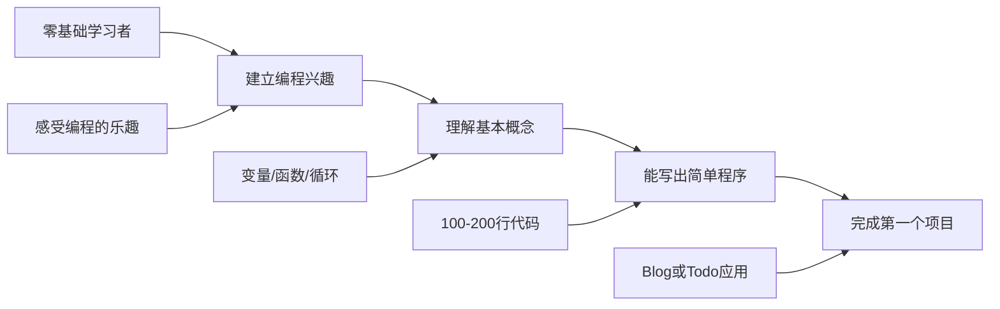
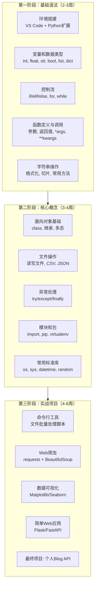
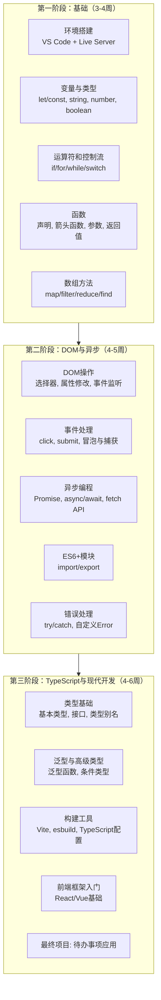
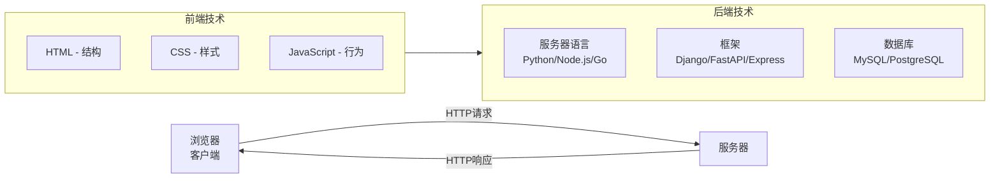
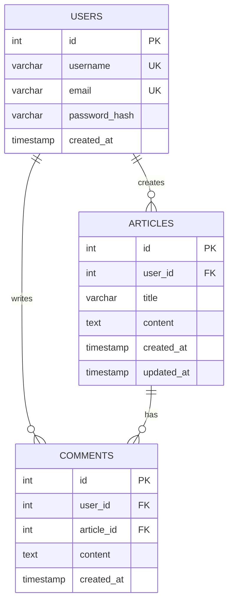
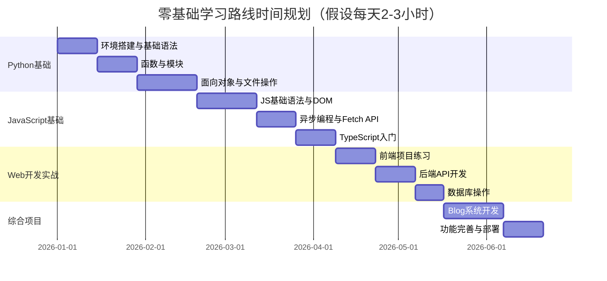

# 程序员练级攻略：零基础启蒙-[2026重制版]

> **核心变更说明**：本文基于2018年版全面升级，更新了2026年最新的编程入门资源、AI辅助学习工具、现代Web开发技术栈，整合了freeCodeCamp、The Odin Project等优质免费课程，以及Codecademy、Coursera等交互式平台。

本文档将为你提供零基础编程启蒙的完整指南。

如果你从来没有接触过程序语言，这里给你两个方面的教程，一个偏后端，一个偏前端。对从零基础开始的人来说，**最重要的是能够对编程有兴趣**，而要对编程有兴趣，就要有成就感。而成就感又来自于用程序打造东西。

2026年的今天，学习编程的环境比以往任何时候都要好：
- **AI编程助手**可以实时解答你的疑问
- **在线IDE**让你无需配置环境就能开始编码
- **交互式教程**提供即时反馈和引导
- **丰富的免费资源**让自学成本几乎为零

## 🎯 学习目标与受众定位

### 本阶段目标



### 适合人群

1. **完全零基础**：从未写过代码的小白
2. **转行者**：想从其他行业转入IT
3. **大学生**：非计算机专业想学编程
4. **爱好者**：对技术好奇但不知从何开始
5. **产品/运营**：想懂一点技术以便更好地与开发沟通

## 📊 为什么选择Python和JavaScript作为入门语言？

根据 **Stack Overflow Developer Survey 2025** 和 **TIOBE Index 2026**：

| 特性 | Python | JavaScript/TypeScript |
|------|--------|---------------------|
| 学习曲线 | ⭐⭐ 平缓 | ⭐⭐⭐ 中等 |
| 语法简洁度 | 非常高 | 较高 |
| 即时反馈 | 强（REPL） | 强（浏览器控制台） |
| 应用领域 | AI/数据/Web/自动化 | Web全栈/移动端 |
| 就业市场 | 🔥🔥🔥 | 🔥🔥🔥🔥 |
| 社区资源 | 极其丰富 | 极其丰富 |
| 2026流行度排名 | #1 (TIOBE) | #1 (GitHub新项目) |

### 选择理由

#### Python的优势

1. **语法接近自然语言**，阅读Python代码就像读英文
2. **强大的标准库和第三方生态**，"batteries included"
3. **在AI/ML领域的统治地位**：PyTorch、TensorFlow、scikit-learn等都优先支持Python
4. **快速原型开发**，几行代码就能实现复杂功能

**应用场景**：
- 数据分析和可视化（Pandas, Matplotlib）
- 机器学习和深度学习（PyTorch, TensorFlow, scikit-learn）
- Web开发（Django, FastAPI, Flask）
- 自动化和脚本编写
- 科学计算（NumPy, SciPy）

#### JavaScript/TypeScript的优势

1. **唯一能在浏览器中运行的语言**，无需安装任何环境
2. **即时视觉反馈**，修改代码立即看到效果
3. **全栈能力**：同一语言可以写前端、后端、移动端
4. **庞大的就业市场**：Web开发岗位需求量最大

**应用场景**：
- 前端开发（React, Vue, Angular）
- 后端开发（Node.js, Deno, Bun）
- 移动端开发（React Native）
- 桌面应用（Electron）

## 🐍 入门语言：Python学习路径

### 推荐学习资源（2026版）

#### 1. 互动式学习平台（首选推荐）

| 平台 | 特点 | 费用 | 适合程度 |
|------|------|------|---------|
| **freeCodeCamp** | 完全免费，项目驱动，社区活跃 | 免费 | ⭐⭐⭐⭐⭐ |
| **Codecademy** | 交互式练习，即时反馈 | 基础免费 | ⭐⭐⭐⭐⭐ |
| **LeetCode** | 算法题库，面试准备 | 基础免费 | ⭐⭐⭐⭐ |
| **Exercism** | 导师代码审查 | 免费 | ⭐⭐⭐⭐ |
| **Hyperskill (JetBrains)** | 项目式学习，游戏化 | 订阅制 | ⭐⭐⭐⭐ |

#### 2. 视频课程

| 课程 | 平台 | 时长 | 特点 |
|------|------|------|------|
| **Python for Everybody** | Coursera/YouTube | 20小时 | 密歇根大学出品，系统全面 |
| **Automate the Boring Stuff with Python** | freeCodeCamp/书 | 15小时 | 实用导向，学完就能用 |
| **CS50's Introduction to Programming with Python** | Harvard/edX | 12小时 | 哈佛品质，思维训练 |
| **程序员的Python基础课** | B站/慕课网 | 10小时 | 中文讲解，适合国内学习者 |

#### 3. 推荐书籍

| 书名 | 作者 | 难度 | 特点 |
|------|------|------|------|
| **《Python编程：从入门到实践》** | Eric Matthes | ⭐⭐ | 项目驱动，适合零基础 |
| **《像计算机科学家一样思考Python》** | Allen Downey | ⭐⭐⭐ | 培养计算思维 |
| **《流畅的Python》** | Luciano Ramalho | ⭐⭐⭐⭐ | 进阶必读，深入理解语言特性 |

### Python学习路线图



### 第一个Python程序

让我们从最经典的"Hello World"开始：

```python
# hello.py - 你的第一个Python程序
print("Hello, World! 🎉")
print("欢迎来到编程的世界！")

# 尝试一些简单的计算
name = input("请输入你的名字: ")
age = input("请输入你的年龄: ")

print(f"\n你好, {name}!")
print(f"明年你就 {int(age) + 1} 岁了")

# 一个简单的小游戏：猜数字
import random

secret_number = random.randint(1, 100)
attempts = 0

print("\n🎮 我已经想好了一个1-100之间的数字，来猜猜看！")

while True:
    guess = int(input("输入你的猜测: "))
    attempts += 1

    if guess < secret_number:
        print("太小了！再试一次 📈")
    elif guess > secret_number:
        print("太大了！再试一次 📉")
    else:
        print(f"🎉 恭喜你！你用了 {attempts} 次猜对了！")
        break
```

**运行方式**：
1. 安装Python：访问 https://www.python.org/downloads/
2. 将代码保存为`hello.py`
3. 在终端运行：`python hello.py`

## 🌐 入门语言：JavaScript/TypeScript学习路径

### 为什么现在要学TypeScript？

根据 **State of JS 2025 Survey**：
- **92%** 的开发者对TypeScript满意或非常满意
- TypeScript在GitHub上的使用率已超过JavaScript
- 所有主流框架都原生支持TypeScript
- 类型系统能在编译时捕获 **约15%** 的常见bug

> 💡 **建议**：直接从TypeScript开始学习，而不是先学JavaScript再转TypeScript。TypeScript是JavaScript的超集，学会了TS就等于同时掌握了JS。

### 推荐学习资源

#### 1. 互动式平台

| 平台 | 特点 | 费用 |
|------|------|------|
| **freeCodeCamp (Responsive Web Design)** | 免费认证，项目驱动 | 免费 |
| **JavaScript.info** | 最全面的JS教程，中文版完善 | 免费 |
| **The Odin Project** | 全栈课程，社区支持 | 免费 |
| **Scrimba** | 互动视频，可以暂停编辑代码 | 基础免费 |
| **Frontend Masters** | 专业级深度课程 | 订阅制 |

#### 2. 推荐书籍

| 书名 | 作者 | 特点 |
|------|------|------|
| **《JavaScript高级程序设计》（第4版）** | Matt Frisbie | JS圣经，权威参考 |
| **《你不知道的JavaScript》** | Kyle Simpson | 深入理解JS核心机制 |
| **《Effective TypeScript》** | Dan Vanderkam | TS最佳实践 |
| **《Learning TypeScript》** | Josh Goldberg | O'Reilly出品，现代化教学 |

#### 3. 官方文档（必收藏）

- **MDN Web Docs**: https://developer.mozilla.org/zh-CN/
  - 最权威的Web技术文档
  - JavaScript、HTML、CSS完整参考
  - Web API文档

- **TypeScript官方手册**: https://www.typescriptlang.org/docs/
  - 从入门到进阶的完整指南
  - 类型体操 playground

### JavaScript/TypeScript学习路线图



### 第一个Web程序

创建你的第一个网页：

```html
<!-- index.html -->
<!DOCTYPE html>
<html lang="zh-CN">
<head>
    <meta charset="UTF-8">
    <meta name="viewport" content="width=device-width, initial-scale=1.0">
    <title>我的第一个网页</title>
    <style>
        body {
            font-family: system-ui, -apple-system, sans-serif;
            max-width: 800px;
            margin: 50px auto;
            padding: 20px;
            background: linear-gradient(135deg, #667eea 0%, #764ba2 100%);
            color: white;
        }
        .container {
            background: rgba(255,255,255,0.95);
            padding: 40px;
            border-radius: 16px;
            box-shadow: 0 20px 60px rgba(0,0,0,0.3);
            color: #333;
        }
        h1 { color: #667eea; }
        button {
            background: #667eea;
            color: white;
            border: none;
            padding: 12px 24px;
            border-radius: 8px;
            cursor: pointer;
            font-size: 16px;
            transition: transform 0.2s;
        }
        button:hover { transform: scale(1.05); }
        #output { margin-top: 20px; padding: 16px; background: #f5f5f5; border-radius: 8px; }
    </style>
</head>
<body>
    <div class="container">
        <h1>🎉 欢迎来到我的网页！</h1>
        <p>这是我的第一个Web项目，虽然简单但充满意义！</p>

        <button onclick="greet()">点击打招呼</button>
        <button onclick="showTime()">显示当前时间</button>
        <button onclick="changeBackground()">换一个背景色</button>

        <div id="output"></div>
    </div>

    <script>
        function greet() {
            const name = prompt('请输入你的名字:');
            if (name) {
                document.getElementById('output').innerHTML =
                    `<h3>Hello, ${name}! 👋</h3><p>欢迎来到编程的世界！</p>`;
            }
        }

        function showTime() {
            const now = new Date();
            document.getElementById('output').innerHTML =
                `<h3>🕐 当前时间</h3><p>${now.toLocaleString('zh-CN')}</p>`;
        }

        const colors = ['#667eea', '#764ba2', '#f093fb', '#f5576c', '#4facfe'];
        let colorIndex = 0;

        function changeBackground() {
            colorIndex = (colorIndex + 1) % colors.length;
            document.body.style.background =
                `linear-gradient(135deg, ${colors[colorIndex]} 0%, ${colors[(colorIndex + 1) % colors.length]} 100%)`;
        }
    </script>
</body>
</html>
```

**运行方式**：
1. 将代码保存为`index.html`
2. 双击文件在浏览器中打开
3. 或者使用VS Code的Live Server插件获得更好的体验

## 💻 开发环境搭建

### 必备工具清单（2026版）

#### 编辑器/IDE

| 工具 | 特点 | 推荐指数 | 适用场景 |
|------|------|---------|---------|
| **Visual Studio Code** | 免费插件生态强大，AI集成 | ⭐⭐⭐⭐⭐ | 万能选择 |
| **Cursor** | AI原生IDE | ⭐⭐⭐⭐⭐ | AI辅助开发 |
| **Neovim** | 高效键盘操作，可定制性强 | ⭐⭐⭐⭐ | 高级用户 |
| **JetBrains IDEs** | 专业功能强大，智能提示 | ⭐⭐⭐⭐⭐ | Java/Python/Go专业开发 |

> 💡 **新手建议**：从VS Code开始，配合以下必备插件：
> - Python / Pylance（Python开发）
> - ES7+ React/Redux/React-Native snippets（前端开发）
> - GitHub Copilot（AI辅助）
> - Error Lens（内联错误提示）
> - GitLens（Git增强）
> - Thunder Client（API测试，替代Postman）

#### 终端工具

| 工具 | 特点 |
|------|------|
| **Warp Terminal** | 现代化终端，AI命令补全 |
| **iTerm2 (macOS)** | 功能强大的macOS终端 |
| **Windows Terminal** | Windows官方现代终端 |
| **Oh My Zsh** | Zsh框架，美化终端 |

#### 版本控制

**Git是必须掌握的工具！**

```bash
# 初始设置
git config --global user.name "Your Name"
git config --global user.email "your@email.com"

# 创建第一个仓库
mkdir my-first-project
cd my-first-project
git init

# 基本工作流
git add .
git commit -m "Initial commit"
git branch -M main
git remote add origin https://github.com/yourusername/my-first-project.git
git push -u origin main
```

**学习资源**：
- [Pro Git 中文版](https://git-scm.com/book/zh/v2/)（免费电子书）
- [GitHub Skills](https://skills.github.com/)（交互式学习）
- [Learn Git Branching](https://learngitbranching.js.org/?locale=zh_CN)（可视化学习）

## 🌍 操作系统基础：Linux入门

虽然Windows和macOS占据着桌面市场，但作为程序员，**了解Linux是必不可少的**。大多数服务器都运行Linux，云原生技术也基于Linux。

### 为什么需要学Linux？

1. **服务器主流操作系统**：90%以上的云服务器运行Linux
2. **开发环境一致性**：本地开发和部署环境保持一致
3. **强大的命令行工具**：文本处理、自动化脚本
4. **开源生态**：大部分开发工具都是开源软件

### 学习路径

| 阶段 | 内容 | 时间 |
|------|------|------|
| 基础 | 文件系统导航、常用命令(ls, cd, cp, mv, rm) | 1周 |
| 进阶 | 权限管理、文本处理(grep, sed, awk)、管道 | 2周 |
| 实战 | Shell脚本编写、进程管理、网络命令 | 2-3周 |

### 推荐资源

- **Linux命令速查表**：https://cheat.sh/
- **The Linux Command Line**（免费电子书）：http://linuxcommand.org/tlcl.php
- **OverTheWire: Bandit**：https://overthewire.org/wargames/bandit/（闯关式学习）

### 常用命令速查

```bash
# 文件操作
ls -la          # 列出文件详情
cd ~            # 回到主目录
pwd             # 显示当前路径
cp file1 file2  # 复制文件
mv old new      # 重命名/移动
rm -rf dir      # 强制删除目录（谨慎使用！）

# 查看内容
cat file.txt    # 显示文件内容
less file.txt   # 分页查看
head -n 20 file # 查看前20行
tail -f log.txt # 实时查看日志

# 搜索
grep "pattern" file  # 在文件中搜索
find . -name "*.py"  # 查找文件

# 系统信息
top             # 查看进程
df -h           # 磁盘使用情况
free -m         # 内存使用情况
```

## 🌐 Web编程入门

为什么是Web而不是别的其他技术呢？**因为你正身处于第三次工业革命的信息化浪潮中，在这个浪潮中，Web互联网是其中最大的发明，所以，这是任何一个程序员都不能错过的**。

### Web开发基础知识



### 前端三剑客

#### HTML（超文本标记语言）

**作用**：定义网页的结构和内容

```html
<!-- 基本结构示例 -->
<!DOCTYPE html>
<html lang="zh-CN">
<head>
    <meta charset="UTF-8">
    <title>页面标题</title>
</head>
<body>
    <!-- 语义化标签 -->
    <header>网站头部</header>
    <nav>导航栏</nav>
    <main>
        <article>
            <h1>文章标题</h1>
            <p>段落内容...</p>
        </article>
        <aside>侧边栏</aside>
    </main>
    <footer>页脚</footer>
</body>
</html>
```

**学习要点**：
- 了解常用标签及其语义
- 学会使用MDN文档查阅
- 不需要记忆所有标签，理解结构即可

#### CSS（层叠样式表）

**作用**：控制网页的外观和布局

```css
/* 现代CSS示例 */
.container {
    max-width: 1200px;
    margin: 0 auto;
    display: grid;
    grid-template-columns: repeat(auto-fit, minmax(300px, 1fr));
    gap: 24px;
}

.card {
    background: white;
    border-radius: 12px;
    padding: 24px;
    box-shadow: 0 4px 6px rgba(0, 0, 0, 0.1);
    transition: transform 0.2s ease;
}

.card:hover {
    transform: translateY(-4px);
}
```

**学习要点**：
- 盒模型（Box Model）
- Flexbox和Grid布局
- 响应式设计（媒体查询）
- CSS变量和现代特性

#### JavaScript

**作用**：让网页具有交互性

前面已有示例，这里强调几个关键概念：

```javascript
// DOM操作 - 动态修改页面
const element = document.getElementById('myElement');
element.textContent = '新的内容';
element.classList.add('active');

// 事件处理
document.querySelector('button').addEventListener('click', () => {
    console.log('按钮被点击了！');
});

// 异步获取数据
async function fetchData() {
    try {
        const response = await fetch('https://api.example.com/data');
        const data = await response.json();
        console.log(data);
    } catch (error) {
        console.error('出错:', error);
    }
}
```

### 后端基础入门

对于初学者，推荐以下几种后端技术栈：

| 技术栈 | 语言 | 框架 | 特点 | 推荐度 |
|--------|------|------|------|--------|
| **FastAPI** | Python | FastAPI | 自动生成文档，高性能 | ⭐⭐⭐⭐⭐ |
| **Express/Koa** | Node.js | Express | JavaScript全栈 | ⭐⭐⭐⭐ |
| **Gin/Echo** | Go | Gin | 高性能，并发强 | ⭐⭐⭐⭐ |
| **Spring Boot** | Java | Spring Boot | 企业级，生态成熟 | ⭐⭐⭐⭐ |

> 💡 **2026建议**：如果你学了Python，强烈推荐**FastAPI**作为后端入门框架。它：
> - 简单易学，类似Flask
> - 自动生成交互式API文档（Swagger UI）
> - 基于ASGI，异步性能优秀
> - 原生支持类型注解和数据验证

### 数据库入门

#### 关系型数据库：PostgreSQL vs MySQL

根据 **DB-Engines Ranking 2026**：

| 特性 | PostgreSQL 17 | MySQL 8.4 LTS / 9.x |
|------|---------------|---------------------|
| 流行度排名 | #4 | #2 |
| 功能完整性 | 更强大 | 够用 |
| JSON支持 | 优秀 | 良好 |
| 并发处理 | MVCC更优 | 良好 |
| 开源协议 | 类MIT宽松协议（更自由） | GPL |
| 云服务支持 | 全面 | 全面 |
| **2026推荐** | ✅ 首选 | ✅ 可选 |

**初学者建议**：从**SQLite**开始（无需安装），然后过渡到**PostgreSQL**。

#### 基本SQL语句

```sql
-- 创建用户表
CREATE TABLE users (
    id SERIAL PRIMARY KEY,
    username VARCHAR(50) UNIQUE NOT NULL,
    email VARCHAR(100) UNIQUE NOT NULL,
    password_hash VARCHAR(255) NOT NULL,
    created_at TIMESTAMP DEFAULT CURRENT_TIMESTAMP
);

-- 插入数据
INSERT INTO users (username, email, password_hash)
VALUES ('zhangsan', 'zhangsan@example.com', 'hashed_password');

-- 查询数据
SELECT id, username, email FROM users WHERE username = 'zhangsan';

-- 更新数据
UPDATE users SET email = 'new@email.com' WHERE id = 1;

-- 删除数据
DELETE FROM users WHERE id = 1;
```

## 🎯 实践项目：个人Blog系统

无论你用Python还是JavaScript，我希望你能做一个非常简单的Blog系统。这个项目将帮助你把所学知识串联起来。

### 项目需求

**基础功能**：
- ✅ 用户注册和登录（不需要密码找回功能）
- ✅ 用户发布文章（纯文本即可，不需要富文本编辑器）
- ✅ 用户评论功能（纯文本）
- ✅ 文章列表展示
- ✅ 文章详情页面

**技术要求**：
- 前端：HTML + CSS + JavaScript
- 后端：Python (FastAPI/Flask) 或 Node.js (Express)
- 数据库：SQLite 或 PostgreSQL

### 数据库设计



### 安全注意事项（必读！）

这是你第一次接触真实的安全问题，非常重要：

1. **密码存储**
   ```python
   # ❌ 错误：明文存储密码
   password = "123456"

   # ✅ 正确：使用bcrypt哈希
   import bcrypt
   password_hash = bcrypt.hashpw(
       password.encode('utf-8'),
       bcrypt.gensalt()
   )
   ```

2. **SQL注入防护**
   ```python
   # ❌ 错误：字符串拼接（易受SQL注入攻击）
   query = f"SELECT * FROM users WHERE name = '{user_input}'"

   # ✅ 正确：使用参数化查询
   query = "SELECT * FROM users WHERE name = %s"
   cursor.execute(query, (user_input,))
   ```

3. **XSS防护**
   ```javascript
   // ❌ 错误：直接插入用户输入
   element.innerHTML = userInput;

   // ✅ 正确：转义或使用textContent
   element.textContent = userInput;
   // 或使用DOMPurify库进行消毒
   ```

### 扩展挑战（可选）

完成基础功能后，可以尝试：

- ⭐ 图片上传功能
- ⭐ Markdown编辑器
- ⭐ 文章搜索功能
- ⭐⭐ 标签分类系统
- ⭐⭐ 分页功能
- ⭐⭐⭐ 用户头像
- ⭐⭐⭐ 文章点赞/收藏
- ⭐⭐⭐⭐ 评论回复嵌套
- ⭐⭐⭐⭐⭐ 部署到公网（使用Vercel/Railway/Render）

## 🤖 AI辅助学习工具（2026新增）

在这个AI时代，善用工具可以让学习效率翻倍：

### 推荐AI工具

| 工具 | 用途 | 价格 | 推荐场景 |
|------|------|------|---------|
| **ChatGPT/Claude** | 概念解释、代码调试 | 免费版够用 | 日常答疑 |
| **GitHub Copilot** | 代码补全、生成 | $10/月 | 编程时实时辅助 |
| **Cursor** | AI驱动的IDE | 免费版可用 | 替代VS Code |
| **v0.dev** | UI组件生成 | 免费 | 快速生成界面 |
| **Exa** | 学术搜索 | 免费 | 查找论文资料 |

### 使用技巧

1. **Prompt工程基础**
   ```
   好的提问示例：
   "我是一个Python初学者，正在学习循环。
    请用简单的例子解释for循环和while循环的区别，
    并给出两个实际的使用场景。"
   ```

2. **让AI帮你Code Review**
   ```python
   # 把你的代码发给AI，让它review
   "请帮我review这段代码，
    指出潜在的问题和改进建议，
    我是一个初学者，请用通俗易懂的方式解释。"
   ```

3. **生成学习计划**
   ```
   "我想在3个月内学会Python Web开发，
   目前零基础，每天能投入2小时。
    请为我制定一个详细的学习计划，
    包括每周的学习目标和实践项目。"
   ```

> ⚠️ **重要提醒**：AI是你的助手，不是替代品！
> - 一定要自己动手写代码，不要直接复制AI生成的代码
> - 理解每一行代码的含义，不懂就问
> - 用AI来加速学习，而不是跳过学习过程

## 📚 学习资源汇总

### 免费资源（优先使用）

| 类别 | 资源名称 | 网址 | 特点 |
|------|---------|------|------|
| 综合学习 | freeCodeCamp | https://www.freecodecamp.org/chinese/ | 完全免费，认证证书 |
| Python | Python官方教程 | https://docs.python.org/zh-cn/3/tutorial/ | 官方权威 |
| JavaScript | JavaScript.info | https://zh.javascript.info/ | 最全面的JS教程 |
| Web开发 | MDN Web Docs | https://developer.mozilla.org/zh-CN/ | Web技术圣经 |
| 算法 | LeetCode | https://leetcode.cn/ | 刷题神器 |
| Git | Learn Git Branching | https://learngitbranching.js.org/?locale=zh_CN | 可视化学习 |
| Linux | OverTheWire: Bandit | https://overthewire.org/wargames/bandit/ | 游戏化学习 |

### 付费资源（可选）

| 类别 | 资源名称 | 价格 | 特点 |
|------|---------|------|------|
| 视频 | Udemy | $10-15/门 | 经常打折，性价比高 |
| 专项课 | Coursera Specialization | 免费/订阅 | 大学级别课程 |
| 互动 | Codecademy Pro | $20/月 | 结构化学习路径 |
| 书籍 | 各类技术书籍 | ¥50-150/本 | 深入系统学习 |

## ⏰ 时间规划建议

### 零基础到能做简单项目的预估时间



| 阶段 | 内容 | 预估时间 | 每日投入 |
|------|------|---------|---------|
| Python基础 | 语法、数据结构、OOP | 6-8周 | 2-3小时 |
| JavaScript基础 | 语法、DOM、异步 | 6-7周 | 2-3小时 |
| Web开发入门 | 前后端结合 | 4-5周 | 2-3小时 |
| 综合项目 | Blog系统 | 4-5周 | 2-3小时 |
| **总计** | **从零到能做项目** | **20-25周（约5-6个月）** | **持续学习** |

## 💡 常见误区避坑指南

### ❌ 误区1：追求速成

**错误想法**："我想30天学会编程找到工作"

**现实**：
- 根据 [Teach Yourself Programming in Ten Years](http://norvig.com/21-days.html)，成为熟练的程序员需要数年时间
- 30天只能了解皮毛，无法胜任真实工作
- **正确做法**：设定合理预期，做好长期学习的准备

### ❌ 误区2：只看不练

**错误想法**："我看完了所有视频教程就会了"

**现实**：
- 编程是技能，不是知识
- 看懂≠会写，会写≠熟练
- **正确做法**：每学一个知识点就动手练习，写代码的时间应该是看教程时间的2-3倍

### ❌ 误区3：贪多嚼不烂

**错误想法**："我要同时学Python、Java、Go、Rust..."

**现实**：
- 同时学多种语言会混淆概念
- 精通一门比略懂十门更有价值
- **正确做法**：先精通一门语言（推荐Python或JavaScript），再学第二门

### ❌ 误区4：遇到困难就放弃

**错误想法**："这个报错解决不了，我不适合学编程"

**现实**：
- 调试和解决问题是程序员的日常工作
- 每个报错都是学习机会
- **正确做法**：
  1. 先自己尝试解决（Google、Stack Overflow）
  2. 整理问题后再问人（参考《提问的智慧》）
  3. 记录解决方案，建立自己的知识库

### ❌ 误区5：忽视基础

**错误想法**："框架才是最重要的，算法数据结构没用"

**现实**：
- 框架会过时，基础原理永不过时
- 基础扎实才能快速学习新技术
- **正确做法**：在学习框架的同时，不要忽略数据结构、算法、网络等基础知识

## ✅ 学习效果自检清单

完成本阶段学习后，你应该能够：

### Python方面
- [ ] 能独立搭建Python开发环境
- [ ] 理解变量、数据类型、控制流、函数、类等基本概念
- [ ] 能读写文件、处理JSON/CSV数据
- [ ] 能使用常用的第三方库（requests, pandas等）
- [ ] 能写100-200行的Python脚本来解决实际问题

### JavaScript/TypeScript方面
- [ ] 能独立创建HTML/CSS/JS网页
- [ ] 理解DOM操作和事件处理
- [ ] 掌握Promise和async/await异步编程
- [ ] 能使用fetch API与后端通信
- [ ] 理解TypeScript的基本类型系统

### 工具使用
- [ ] 熟练使用VS Code及常用插件
- [ ] 掌握Git的基本操作（add, commit, push, pull）
- [ ] 能在终端执行常用命令
- [ ] 会使用ChatGPT/Claude等AI工具辅助学习

### 项目能力
- [ ] 能独立完成前后端分离的小型Web项目
- [ ] 理解HTTP协议的基本概念
- [ ] 能设计和操作简单的数据库
- [ ] 有基本的安全意识（密码哈希、防注入、防XSS）

## 🚀 下篇预告

下一篇文章将进入**正式入门**阶段，我们将讨论：

- 为什么转向Java语言？
- 如何系统地学习编程技能？
- 推荐哪些进阶书籍？
- 如何完成一个更复杂的投票系统项目？

---

**记住**：编程学习就像马拉松，不是百米冲刺。保持好奇心，享受解决问题的过程，每一个bug修复都是进步，每一个项目完成都是里程碑。你已经迈出了第一步，继续加油！💪
