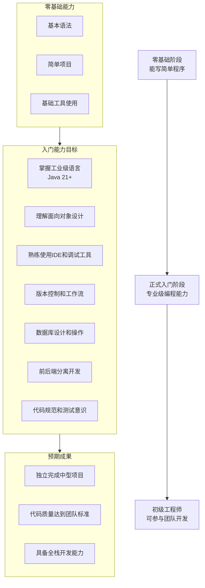
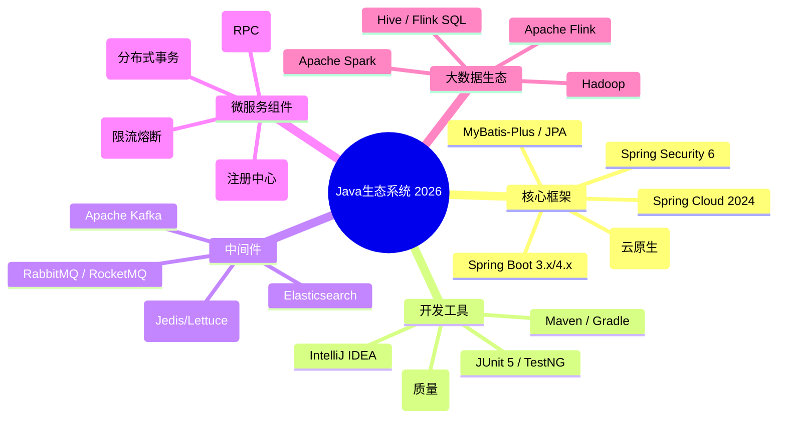
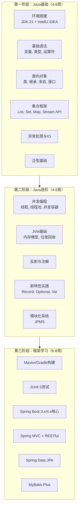
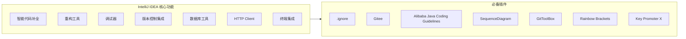
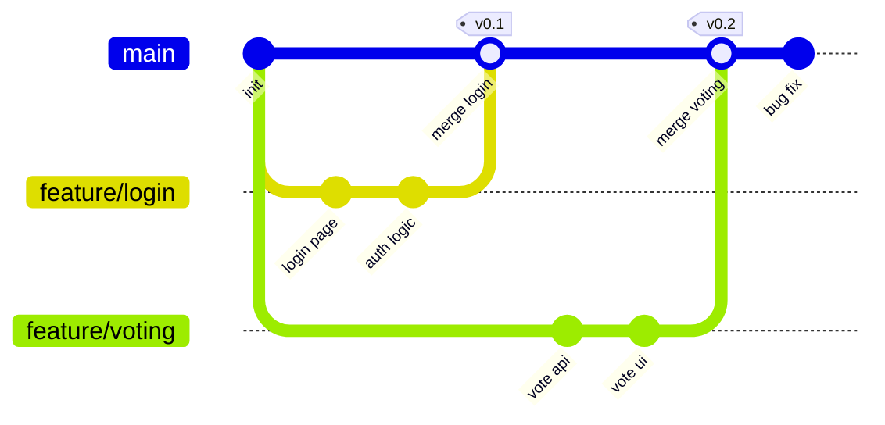
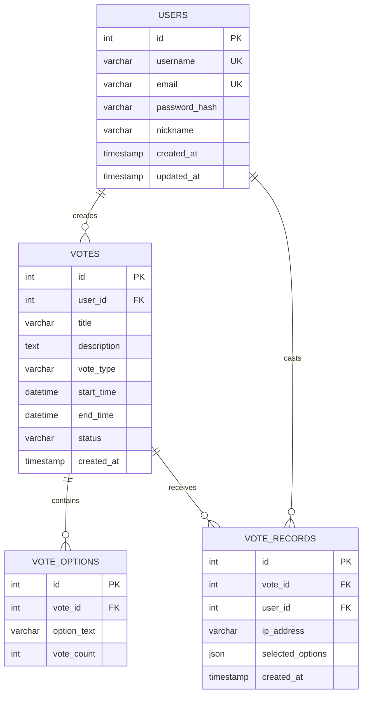

# 程序员练级攻略：正式入门-[2026重制版]

> **核心变更说明**：本文基于2018年版全面升级，更新了Java 21+新特性、Spring Boot 3.x/4.x最新实践、现代开发工具链，整合了IntelliJ IDEA 2026、Maven/Gradle最佳实践，以及前后端分离架构的完整实现方案。

学习了前面文章中的入门级经验和知识后，你可能会有两种反应：

- 一种反应可能是，你对编程有一点兴趣了，甚至有一点点小骄傲。我想说，**请保持这种感觉，但是你也要清醒一下，上面的那些东西还不算真正的入门，你只是入门了一条腿**。

- 另一种反应也可能是，你被吓着了，觉得太难了。如果是这样，我想鼓励你——**"无论你做什么事，你都会面对各式各样的困难，这对每个人来说都是一样的，而只有兴趣、热情和成就感才能让你不畏惧这些困难"**。

这篇文章，我主要是让你成为**更为专业的入门程序员**。请注意，此时你可能需要读一些比较枯燥的书，但我想说，**这些是非常非常重要的**。你一定要坚持住。

## 🎯 本阶段学习目标

### 能力进阶路线



### 预期成果

完成本阶段学习后，你应该能够：
- ✅ 使用**Java 21+**进行专业的企业级开发
- ✅ 掌握**Spring Boot 3.x/4.x**框架进行Web开发
- ✅ 熟练使用**IntelliJ IDEA**等专业IDE
- ✅ 理解并应用**Git工作流**
- ✅ 设计和操作**关系型数据库**
- ✅ 实现前后端分离的RESTful API
- ✅ 编写有质量的代码（遵循规范、有基本测试）

> 💡 **薪资参考**：达到此水平，在2026年可以找到 **15K-25K/月** 的初级开发岗位（一线城市）。

## 💻 为什么选择Java作为主力语言？

根据 **TIOBE Index 2026** 和 **JetBrains Developer Survey 2025**：

| 对比维度 | Java | Python | JavaScript | Go | Rust |
|---------|------|--------|------------|-----|------|
| **企业采用率** | ⭐⭐⭐⭐⭐ | ⭐⭐⭐⭐ | ⭐⭐⭐⭐⭐ | ⭐⭐⭐ | ⭐⭐ |
| **就业市场** | 🔥🔥🔥🔥🔥 | 🔥🔥🔥🔥 | 🔥🔥🔥🔥🔥 | 🔥🔥🔥 | 🔥🔥 |
| **学习曲线** | ⭐⭐⭐ 中等 | ⭐⭐ 简单 | ⭐⭐⭐ 中等 | ⭐⭐⭐ 较简 | ⭐⭐⭐⭐ 较难 |
| **性能** | ⭐⭐⭐⭐ 高 | ⭐⭐⭐ 中等 | ⭐⭐⭐ 中等 | ⭐⭐⭐⭐⭐ 很高 | ⭐⭐⭐⭐⭐ 极高 |
| **生态系统** | 极其成熟 | AI领域强 | Web最强 | 云原生好 | 快速成长 |
| **类型安全** | 静态类型 | 动态类型 | 动态/TS | 静态类型 | 静态类型强 |

### 选择Java的核心理由

#### 1. 工业级语言的标杆

Java是所有语言里面综合实力最强的，这也是为什么**几乎所有大型互联网或分布式系统基本上都是Java技术栈**：
- 阿里巴巴：淘宝、支付宝、阿里云
- 腾讯：微信后台、腾讯云
- 美团、京东、滴滴、字节跳动等
- 金融银行系统：绝大多数核心系统

#### 2. 强大的生态体系



#### 3. 持续演进的语言特性

**Java 17 (LTS) - 2021**：
- Record类（数据载体）
- Pattern Matching for instanceof
- Sealed Classes（密封类）
- Text Blocks（文本块）

**Java 21 (LTS) - 2023**：
- Virtual Threads（虚拟线程）
- Pattern Matching for switch
- Record Patterns
- String Templates（预览；该特性后来已被移除）

**Java 25 (LTS) - 2025 / Java 26 (最新)**：
- Flexible Constructor Bodies（正式）
- Module Import Declarations（正式）
- Compact Source Files & Instance Main Methods（正式）
- Scoped Values（正式）
- Structured Concurrency（预览）

> 💡 **建议**：从**Java 17 LTS**、**Java 21 LTS**或**Java 25 LTS**开始学习，这些是长期支持版本，企业广泛采用。

## 📚 编程技能系统性学习

### 1. Java语言深度学习

#### 推荐学习路径



#### 推荐书籍（按优先级排序）

| 书名 | 作者 | 难度 | 特点 | 必读性 |
|------|------|------|------|--------|
| **《Java核心技术 卷I》** | Cay S. Horstmann | ⭐⭐⭐ | 系统全面，权威教材 | ⭐⭐⭐⭐⭐ |
| **《Head First Java》** | Kathy Sierra | ⭐⭐ | 图文并茂，适合入门 | ⭐⭐⭐⭐ |
| **《Effective Java》** | Joshua Bloch | ⭐⭐⭐⭐⭐ | Java最佳实践圣经 | ⭐⭐⭐⭐⭐ |
| **《深入理解Java虚拟机》** | 周志明 | ⭐⭐⭐⭐⭐ | JVM深度剖析 | ⭐⭐⭐⭐ |
| **《Java并发编程实战》** | Brian Goetz | ⭐⭐⭐⭐⭐ | 并发编程权威 | ⭐⭐⭐⭐ |

#### 核心知识点示例

**Record类（Java 14+）**：
```java
// 传统方式
public class User {
    private final Long id;
    private final String name;
    private final String email;

    public User(Long id, String name, String email) {
        this.id = id;
        this.name = name;
        this.email = email;
    }

    // getter, equals, hashCode, toString...
}

// Record方式（推荐！）
public record User(Long id, String name, String email) {}

// 使用
User user = new User(1L, "张三", "zhangsan@example.com");
System.out.println(user.name());       // 访问器
System.out.println(user.toString());   // 自动生成
```

**Stream API（Java 8+）**：
```java
List<User> users = getUserList();

// 过滤、映射、排序、收集
List<String> names = users.stream()
    .filter(u -> u.getAge() >= 18)
    .map(User::getName)
    .sorted()
    .collect(Collectors.toList());

// 分组统计
Map<String, Long> countByCity = users.stream()
    .collect(Collectors.groupingBy(
        User::getCity,
        Collectors.counting()
    ));
```

**Virtual Threads（Java 21）**：
```java
// 传统平台线程（受限）
ExecutorService executor = Executors.newFixedThreadPool(200);

// 虚拟线程（轻量级，可创建百万级）
try (var executor = Executors.newVirtualThreadPerTaskExecutor()) {
    IntStream.range(0, 10_000).forEach(i -> {
        executor.submit(() -> {
            Thread.sleep(Duration.ofSeconds(1));
            return i;
        });
    });
}
```

### 2. Spring Boot 3.x/4.x 实战

> 📌 **版本说明**：截至2026年9月，Spring Boot最新版本为4.1.x（基于Spring Framework 7与Spring Security 7）。本文示例基于企业中仍广泛使用的3.x编写，核心概念与大部分写法在4.x中保持一致。

#### 为什么选择Spring Boot？

| 特性 | 原生Spring | Spring Boot |
|------|-----------|-------------|
| 配置复杂度 | 高（XML/JavaConfig） | 低（自动配置） |
| 启动速度 | 较慢 | 快（优化后更快） |
| 内嵌服务器 | 需要配置 | Tomcat/Jetty内置 |
| 依赖管理 | 手动 | Starter自动管理 |
| 生产就绪 | 需要额外配置 | 开箱即用 |
| 监控健康检查 | 需要集成 | Actuator内置 |

#### Spring Boot 3.x 新特性

- **基于Java 17+最低要求**
- **Jakarta EE 10**（不再是javax.*）
- **原生镜像支持**（GraalVM Native Image）
- **可观测性改进**（Micrometer Tracing）
- **Docker Compose支持**

#### 项目结构示例

```
my-voting-app/
├── src/main/java/com/example/voting/
│   ├── VotingApplication.java          # 启动类
│   ├── config/                         # 配置类
│   │   ├── SecurityConfig.java
│   │   └── WebConfig.java
│   ├── controller/                     # 控制器层
│   │   └── VoteController.java
│   ├── service/                        # 业务逻辑层
│   │   ├── VoteService.java
│   │   └── impl/VoteServiceImpl.java
│   ├── repository/                     # 数据访问层
│   │   ├── VoteRepository.java
│   │   └── UserRepository.java
│   ├── entity/                         # 实体类
│   │   ├── Vote.java
│   │   └── User.java
│   ├── dto/                            # 数据传输对象
│   │   ├── VoteRequest.java
│   │   └── VoteResponse.java
│   ├── exception/                      # 异常处理
│   │   └── GlobalExceptionHandler.java
│   └── util/                           # 工具类
├── src/main/resources/
│   ├── application.yml                 # 配置文件
│   └── data.sql                        # 初始化数据
├── src/test/java/                      # 测试代码
└── pom.xml                             # Maven配置
```

#### Controller示例（RESTful API）

```java
@RestController
@RequestMapping("/api/v1/votes")
@RequiredArgsConstructor
@Tag(name = "投票管理", description = "投票相关接口")
public class VoteController {

    private final VoteService voteService;

    @PostMapping
    @Operation(summary = "创建投票")
    public ResponseEntity<VoteResponse> createVote(
            @Valid @RequestBody VoteRequest request,
            @AuthenticationPrincipal UserDetails user) {
        VoteResponse response = voteService.createVote(request, user.getUsername());
        return ResponseEntity.status(HttpStatus.CREATED).body(response);
    }

    @GetMapping("/{voteId}")
    @Operation(summary = "获取投票详情")
    public ResponseEntity<VoteResponse> getVote(@PathVariable Long voteId) {
        return ResponseEntity.ok(voteService.getVoteById(voteId));
    }

    @PostMapping("/{voteId}/cast")
    @Operation(summary = "参与投票")
    public ResponseEntity<Void> castVote(
            @PathVariable Long voteId,
            @RequestParam List<Long> optionIds,
            HttpServletRequest request) {
        // 防刷票：检查IP限制
        String clientIp = getClientIp(request);
        voteService.castVote(voteId, optionIds, clientIp);
        return ResponseEntity.ok().build();
    }

    @GetMapping("/{voteId}/results")
    @Operation(summary = "获取投票结果")
    public ResponseEntity<VoteResultResponse> getResults(@PathVariable Long voteId) {
        return ResponseEntity.ok(voteService.getVoteResults(voteId));
    }
}
```

### 3. 数据库设计与操作

#### 技术选型对比

| 技术 | 类型 | 特点 | 适用场景 | 2026推荐度 |
|------|------|------|---------|-----------|
| **Spring Data JPA** | ORM | 自动生成SQL，类型安全 | CRUD密集型应用 | ⭐⭐⭐⭐ |
| **MyBatis-Plus** | SQL映射 | SQL灵活可控 | 复杂查询、遗留系统 | ⭐⭐⭐⭐⭐ |
| **jOOQ** | DSL | 类型安全的SQL构建 | 复杂查询、动态SQL | ⭐⭐⭐ |
| **JDBC Template** | 底层 | 完全控制 | 性能敏感场景 | ⭐⭐ |

> 💡 **新手建议**：从**Spring Data JPA**开始，简单场景足够；遇到复杂查询再引入**MyBatis-Plus**。

#### Entity定义示例

```java
@Entity
@Table(name = "votes", indexes = {
    @Index(name = "idx_vote_status", columnList = "status"),
    @Index(name = "idx_vote_creator", columnList = "creator_id")
})
@NamedQuery(
    name = "Vote.findActive",
    query = "SELECT v FROM Vote v WHERE v.status = 'ACTIVE' AND v.endTime > CURRENT_TIMESTAMP"
)
public class Vote {

    @Id
    @GeneratedValue(strategy = GenerationType.IDENTITY)
    private Long id;

    @Column(nullable = false, length = 200)
    private String title;

    @Column(columnDefinition = "TEXT")
    private String description;

    @Enumerated(EnumType.STRING)
    @Column(nullable = false)
    private VoteType type; // SINGLE, MULTIPLE

    @Column(nullable = false)
    private LocalDateTime startTime;

    @Column(nullable = false)
    private LocalDateTime endTime;

    @Enumerated(EnumType.STRING)
    @Column(nullable = false)
    private VoteStatus status; // DRAFT, ACTIVE, CLOSED

    @ManyToOne(fetch = FetchType.LAZY)
    @JoinColumn(name = "creator_id", nullable = false)
    private User creator;

    @OneToMany(mappedBy = "vote", cascade = CascadeType.ALL, orphanRemoval = true)
    private List<VoteOption> options = new ArrayList<>();

    // 审计字段
    @CreatedDate
    private LocalDateTime createdAt;

    @LastModifiedDate
    private LocalDateTime updatedAt;

    // getters, setters...
}
```

#### Repository接口

```java
public interface VoteRepository extends JpaRepository<Vote, Long>, JpaSpecificationExecutor<Vote> {

    // 方法名派生查询
    List<Vote> findByStatusAndEndTimeAfter(VoteStatus status, LocalDateTime now);

    List<Vote> findByCreatorIdOrderByCreatedAtDesc(Long creatorId);

    // 自定义Query
    @Query("SELECT v FROM Vote v WHERE v.status = :status ORDER BY v.createdAt DESC")
    Page<Vote> findActiveVotes(@Param("status") VoteStatus status, Pageable pageable);

    // 原生SQL（复杂查询时使用）
    @Query(value = """
        SELECT v.*, COUNT(vo.id) as option_count
        FROM votes v
        LEFT JOIN vote_options vo ON v.id = vo.vote_id
        WHERE v.creator_id = :creatorId
        GROUP BY v.id
        """, nativeQuery = true)
    List<Object[]> findVoteStatistics(@Param("creatorId") Long creatorId);
}
```

### 4. 前端技术升级

本阶段前端不再使用jQuery，而是转向**现代前端技术栈**：

| 类别 | 2018年推荐 | 2026年推荐 | 原因 |
|------|----------|----------|------|
| 库/框架 | jQuery | React 19 或 Vue 3.5 | 组件化、生态成熟 |
| CSS框架 | Bootstrap 4 | Tailwind CSS 4 | 原子化CSS、更灵活 |
| 构建工具 | webpack | Vite 6 | 更快的开发体验 |
| HTTP请求 | Ajax/jQuery.ajax | Axios / Fetch API | Promise支持、拦截器 |
| 状态管理 | 无 | Zustand / Pinia | 轻量、简洁 |

#### React 19 示例组件

```tsx
// VoteCard.tsx - 投票卡片组件
import { useState } from 'react';
import { useMutation, useQuery, useQueryClient } from '@tanstack/react-query';
import axios from 'axios';

interface Vote {
  id: number;
  title: string;
  type: 'SINGLE' | 'MULTIPLE';
  options: VoteOption[];
  endTime: string;
  userVoted: boolean;
}

interface VoteOption {
  id: number;
  text: string;
  voteCount: number;
  percentage: number;
}

export function VoteCard({ voteId }: { voteId: number }) {
  const [selectedOptions, setSelectedOptions] = useState<number[]>([]);
  const queryClient = useQueryClient();

  // 获取投票详情
  const { data: vote, isLoading } = useQuery({
    queryKey: ['vote', voteId],
    queryFn: () => axios.get(`/api/v1/votes/${voteId}`).then(r => r.data),
  });

  // 提交投票
  const castVoteMutation = useMutation({
    mutationFn: () =>
      axios.post(`/api/v1/votes/${voteId}/cast`, null, {
        params: { optionIds: selectedOptions },
      }),
    onSuccess: () => {
      // 刷新数据
      queryClient.invalidateQueries({ queryKey: ['vote', voteId] });
    },
  });

  if (isLoading) return <div className="animate-pulse">加载中...</div>;
  if (!vote) return null;

  // 切换选中项：单选直接替换，多选做增删切换
  const toggleOption = (optionId: number) => {
    if (vote.type === 'SINGLE') {
      setSelectedOptions([optionId]);
    } else {
      setSelectedOptions(prev =>
        prev.includes(optionId) ? prev.filter(id => id !== optionId) : [...prev, optionId]
      );
    }
  };

  const isExpired = new Date(vote.endTime) < new Date();

  return (
    <div className="bg-white rounded-xl shadow-lg p-6 max-w-2xl mx-auto">
      <h2 className="text-xl font-bold mb-2">{vote.title}</h2>
      <p className="text-gray-500 text-sm mb-4">
        截止时间: {new Date(vote.endTime).toLocaleString('zh-CN')}
        {isExpired && <span className="text-red-500 ml-2">已结束</span>}
      </p>

      <div className="space-y-3">
        {vote.options.map(option => (
          <button
            key={option.id}
            onClick={() => toggleOption(option.id)}
            disabled={isExpired || vote.userVoted}
            className={`w-full p-4 rounded-lg border-2 transition-all ${
              selectedOptions.includes(option.id)
                ? 'border-blue-500 bg-blue-50'
                : 'border-gray-200 hover:border-blue-300'
            }`}
          >
            <div className="flex justify-between items-center">
              <span>{option.text}</span>
              <span className="font-semibold">{option.percentage.toFixed(1)}%</span>
            </div>
            {/* 进度条 */}
            <div className="mt-2 h-2 bg-gray-100 rounded-full overflow-hidden">
              <div
                className="h-full bg-blue-500 rounded-full transition-all"
                style={{ width: `${option.percentage}%` }}
              />
            </div>
            <div className="text-xs text-gray-500 mt-1">
              {option.voteCount} 票
            </div>
          </button>
        ))}
      </div>

      {!isExpired && !vote.userVoted && (
        <button
          onClick={() => castVoteMutation.mutate()}
          disabled={selectedOptions.length === 0 || castVoteMutation.isPending}
          className="mt-6 w-full py-3 bg-blue-600 text-white rounded-lg font-semibold
                     hover:bg-blue-700 disabled:bg-gray-300 disabled:cursor-not-allowed"
        >
          {castVoteMutation.isPending ? '提交中...' : '提交投票'}
        </button>
      )}
    </div>
  );
}
```

## 🛠️ 专业开发工具链

### IDE选择：IntelliJ IDEA Ultimate



**为什么选择IntelliJ IDEA？**
- Java开发的**事实标准**
- 智能提示和重构功能业界最强
- 与Spring Boot无缝集成
- 内置数据库工具、HTTP Client
- 强大的调试和性能分析工具

> 💡 **免费替代**：如果预算有限，可以使用**Community Edition**（免费），或者**VS Code + Extension Pack for Java**。

### 版本控制：Git高级工作流

#### 推荐的Git工作流：Git Flow简化版



#### Git常用命令速查

```bash
# 日常开发流程
git checkout -b feature/new-feature    # 创建功能分支
git add .                              # 暂存更改
git commit -m "feat: add user login"   # 提交（遵循Conventional Commits）
git push origin feature/new-feature   # 推送到远程

# 合并到主分支
git checkout main
git pull origin main
git merge feature/new-feature         # 合并
git push origin main                   # 推送

# 解决冲突后
git add .
git commit --no-edit                   # 使用默认合并信息

# 撤销操作
git reset HEAD~1                       # 撤销上次commit（保留更改）
git checkout -- file.txt               # 撤销文件修改
git revert <commit-hash>               # 安全撤销（生成新commit）
```

### 构建工具：Maven vs Gradle

| 特性 | Maven | Gradle |
|------|-------|--------|
| 配置格式 | XML | Groovy/Kotlin DSL |
| 构建速度 | 较快 | 更快（增量编译、Build Cache） |
| 学习曲线 | 平缓 | 稍陡 |
| 灵活性 | 约定优于配置 | 高度灵活 |
| 生态插件 | 丰富 | 丰富 |
| Android支持 | 一般 | 官方推荐 |
| **2026推荐** | 企业项目首选 | 新项目首选 |

> 💡 **建议**：初学者先用**Maven**（更常见、资料多），熟悉后再学**Gradle**。

### 其他必备工具

| 工具类别 | 推荐工具 | 用途 |
|---------|---------|------|
| **API测试** | Thunder Client (VS Code插件) / Postman | 测试RESTful API |
| **数据库管理** | DBeaver / DataGrip | 多数据库管理 |
| **接口文档** | Swagger/OpenAPI / Knife4j | 自动生成API文档 |
| **容器化** | Docker Desktop | 本地环境一致性 |
| **环境管理** | SDKMAN! (Java版本管理) | 多版本JDK切换 |
| **代码质量** | SpotBugs / Checkstyle / SonarLint | 静态代码分析 |

## 🌐 网络协议：HTTP深入理解

作为Web开发者，必须深入理解HTTP协议。

### HTTP/2 vs HTTP/1.1 vs HTTP/3

| 特性 | HTTP/1.1 | HTTP/2 | HTTP/3 (QUIC) |
|------|---------|--------|--------------|
| 多路复用 | ❌ | ✅ | ✅ |
| 头部压缩 | ❌ | ✅ HPACK | ✅ QPACK |
| 服务器推送 | ❌ | ✅（主流浏览器已移除支持） | ❌ |
| 连接建立 | TCP + TLS | TCP + TLS | QUIC (UDP) |
| 首包时间 | 较慢 | 快 | 最快 |
| **浏览器支持** | 全部 | 全部 | 主流浏览器 |

### RESTful API设计规范

```yaml
# API设计最佳实践

# 1. URL设计（名词复数，层级清晰）
GET    /api/v1/users              # 获取用户列表
GET    /api/v1/users/{id}         # 获取单个用户
POST   /api/v1/users              # 创建用户
PUT    /api/v1/users/{id}         # 更新用户（全量）
PATCH  /api/v1/users/{id}         # 更新用户（部分）
DELETE /api/v1/users/{id}         # 删除用户

# 2. 使用正确的状态码
200 OK                  # 成功GET/PUT/PATCH
201 Created             # 成功POST（创建资源）
204 No Content          # 成功DELETE
400 Bad Request         # 请求参数错误
401 Unauthorized        # 未认证
403 Forbidden           # 无权限
404 Not Found           # 资源不存在
409 Conflict            # 资源冲突
422 Unprocessable Entity  # 语义错误（验证失败）
500 Internal Server Error # 服务器内部错误

# 3. 请求/响应格式
# Request Header
Content-Type: application/json
Authorization: Bearer <token>
Accept-Language: zh-CN

# Response Body
{
  "code": 200,
  "message": "success",
  "data": { ... },
  "timestamp": "2026-01-15T10:30:00Z"
}
```

## 🔐 安全基础

### 密码存储

```java
// 使用BCrypt（推荐）
@Service
public class UserService {

    private final PasswordEncoder passwordEncoder;

    public User register(RegisterRequest request) {
        // 加密密码
        String encodedPassword = passwordEncoder.encode(request.getPassword());
        User user = new User(request.getUsername(), encodedPassword, request.getEmail());
        return userRepository.save(user);
    }

    public boolean authenticate(String rawPassword, String encodedPassword) {
        return passwordEncoder.matches(rawPassword, encodedPassword);
    }
}
```

### 认证与授权（Spring Security 6）

```java
@Configuration
@EnableWebSecurity
public class SecurityConfig {

    @Bean
    public SecurityFilterChain filterChain(HttpSecurity http) throws Exception {
        http
            .csrf(csrf -> csrf.disable())
            .sessionManagement(session ->
                session.sessionCreationPolicy(SessionCreationPolicy.STATELESS)
            )
            .authorizeHttpRequests(auth -> auth
                .requestMatchers("/api/v1/auth/**").permitAll()
                .requestMatchers("/api/v1/public/**").permitAll()
                .requestMatchers(HttpMethod.GET, "/api/v1/votes/**").permitAll()
                .anyRequest().authenticated()
            )
            .addFilterBefore(jwtAuthenticationFilter, UsernamePasswordAuthenticationFilter.class);

        return http.build();
    }
}
```

## 🧪 测试基础

### 单元测试（JUnit 5 + Mockito）

```java
@ExtendWith(MockitoExtension.class)
class VoteServiceTest {

    @Mock
    private VoteRepository voteRepository;

    @Mock
    private UserRepository userRepository;

    @InjectMocks
    private VoteServiceImpl voteService;

    @Test
    @DisplayName("应该成功创建投票")
    void shouldCreateVoteSuccessfully() {
        // Given
        User creator = new User(1L, "testuser", "test@example.com");
        VoteRequest request = new VoteRequest("测试投票", VoteType.SINGLE,
            List.of(new OptionRequest("选项A"), new OptionRequest("选项B")));

        when(userRepository.findByUsername("testuser")).thenReturn(Optional.of(creator));
        when(voteRepository.save(any())).thenAnswer(invocation -> invocation.getArgument(0));

        // When
        VoteResponse response = voteService.createVote(request, "testuser");

        // Then
        assertThat(response.getTitle()).isEqualTo("测试投票");
        assertThat(response.getStatus()).isEqualTo(VoteStatus.DRAFT);
        verify(voteRepository).save(any(Vote.class));
    }

    @Test
    @DisplayName("重复投票应该抛出异常")
    void shouldThrowExceptionWhenDuplicateVote() {
        // Given - 设置已投票的场景
        when(voteRepository.hasUserVoted(anyLong(), anyString())).thenReturn(true);

        // When & Then
        assertThatThrownBy(() ->
            voteService.castVote(1L, List.of(1L), "127.0.0.1")
        ).isInstanceOf(DuplicateVoteException.class)
         .hasMessage("您已经参与过该投票");

        verify(voteRepository, never()).save(any());
    }
}
```

### 集成测试（Testcontainers）

```java
@SpringBootTest
@Testcontainers
class VoteRepositoryIntegrationTest {

    @Container
    static PostgreSQLContainer<?> postgres = new PostgreSQLContainer<>("postgres:16-alpine")
        .withDatabaseName("testdb")
        .withUsername("test")
        .withPassword("test");

    @DynamicPropertySource
    static void configureProperties(DynamicPropertyRegistry registry) {
        registry.add("spring.datasource.url", postgres::getJdbcUrl);
        registry.add("spring.datasource.username", postgres::getUsername);
        registry.add("spring.datasource.password", postgres::getPassword);
    }

    @Autowired
    private VoteRepository voteRepository;

    @Test
    void shouldSaveAndRetrieveVote() {
        Vote vote = new Vote();
        vote.setTitle("集成测试投票");
        vote.setStatus(VoteStatus.ACTIVE);

        Vote saved = voteRepository.save(vote);

        assertThat(saved.getId()).isNotNull();
        assertThat(voteRepository.findById(saved.getId())).isPresent();
    }
}
```

## 🎯 实践项目：投票系统

### 业务需求

**核心功能**：
- 用户注册和登录（JWT认证）
- 创建投票表单（单选/多选）
- 其他用户投票（防刷票机制）
- 实时显示投票结果（带进度条和百分比）
- 投票倒计时功能
- 响应式设计（适配手机和电脑）

### 技术需求

| 层次 | 技术选型 | 说明 |
|------|---------|------|
| **后端** | Java 21 + Spring Boot 3.x/4.x | RESTful API |
| **前端** | React 19 + TypeScript + Vite 6 | SPA应用 |
| **数据库** | PostgreSQL 17 | 关系型数据 |
| **缓存** | Redis 7.4 | 会话和防刷票 |
| **认证** | Spring Security 6 + JWT | 无状态认证 |
| **部署** | Docker + Docker Compose | 容器化部署 |

### 数据库ER图



### 项目目录结构（完整版）

```
voting-system/
├── backend/                          # 后端项目
│   ├── src/main/java/com/example/voting/
│   │   ├── config/                   # 配置类
│   │   ├── controller/               # REST控制器
│   │   ├── service/                  # 业务逻辑
│   │   ├── repository/               # 数据访问
│   │   ├── entity/                   # 实体
│   │   ├── dto/                      # 数据传输对象
│   │   ├── security/                 # 安全相关
│   │   ├── exception/                # 异常处理
│   │   └── util/                     # 工具类
│   ├── src/test/java/                # 测试
│   └── pom.xml
├── frontend/                          # 前端项目
│   ├── src/
│   │   ├── components/               # 通用组件
│   │   ├── pages/                    # 页面组件
│   │   ├── hooks/                    # 自定义Hooks
│   │   ├── services/                 # API服务
│   │   ├── store/                    # 状态管理
│   │   ├── types/                    # TypeScript类型
│   │   └── utils/                    # 工具函数
│   ├── package.json
│   └── vite.config.ts
├── docker-compose.yml                # Docker编排
├── README.md
└── .github/workflows/                # CI/CD
```

### 扩展挑战（可选）

完成基础功能后，可以尝试：

- ⭐ 微信授权登录（防止刷票）
- ⭐ WebSocket实时推送投票结果
- ⭐ 图表可视化（ECharts/Chart.js）
- ⭐⭐ 投票分享功能（生成海报）
- ⭐⭐ 评论和讨论区
- ⭐⭐⭐ 投票数据分析仪表盘
- ⭐⭐⭐ 导出投票结果（Excel/PDF）
- ⭐⭐⭐⭐ 多语言国际化（i18n）
- ⭐⭐⭐⭐⭐ PWA支持（离线可用）

## 📖 推荐阅读清单

### 必读书籍（按顺序阅读）

| 序号 | 书名 | 作者 | 预计时间 | 重点章节 |
|------|------|------|---------|---------|
| 1 | 《代码大全》（第2版） | Steve McConnell | 4-6周 | 全书都是精华 |
| 2 | 《Java核心技术 卷I》 | Cay Horstmann | 3-4周 | 第3-14章 |
| 3 | 《Head First Java》 | Kathy Sierra | 2-3周 | 全书（快速过一遍） |
| 4 | 《Spring Boot实战》 | Craig Walls | 3-4周 | 第1-8章 |
| 5 | 《MySQL必知必会》 | Ben Forta | 1周 | 全书 |
| 6 | 《鸟哥的Linux私房菜》 | 鸟哥 | 2-3周 | 基础篇前10章 |

### 在线资源

| 资源 | 网址 | 用途 |
|------|------|------|
| Spring官方指南 | https://spring.io/guides | 最佳实践示例 |
| Baeldung | https://www.baeldung.com/ | Spring深度教程 |
| MDN HTTP文档 | https://developer.mozilla.org/zh-CN/docs/Web/HTTP | HTTP协议参考 |
| Pro Git中文版 | https://git-scm.com/book/zh/v2 | Git完整手册 |
| JWT.io | https://jwt.io/ | JWT调试和学习 |

## ⏰ 时间规划

### 正式入门阶段时间安排（假设每天2-3小时）

| 阶段 | 内容 | 时间 | 产出 |
|------|------|------|------|
| Java基础 | 语法、OOP、集合、泛型 | 6-8周 | 能写200行以上Java程序 |
| Java进阶 | 并发、JVM、新特性 | 4-6周 | 理解底层原理 |
| Spring Boot | 框架核心、Web开发 | 6-8周 | 能开发RESTful API |
| 数据库 | SQL、JPA/MyBatis | 3-4周 | 能设计数据库 |
| 前端基础 | React/TypeScript | 4-5周 | 能做SPA页面 |
| 综合项目 | 投票系统 | 4-6周 | 完整的全栈项目 |
| **总计** | **从零到正式入门** | **27-37周（约7-9个月）** | **可求职的水平** |

## ✅ 学习效果自检

完成本阶段后，请对照以下清单自检：

### Java方面
- [ ] 能熟练使用IntelliJ IDEA开发和调试
- [ ] 理解面向对象的四大特性（封装、继承、多态、抽象）
- [ ] 掌握集合框架（List、Set、Map）及Stream API
- [ ] 了解基本的并发编程概念
- [ ] 能阅读和理解Java 8+的新特性代码

### Spring Boot方面
- [ ] 能独立搭建Spring Boot项目
- [ ] 理解IoC和AOP的基本概念
- [ ] 能编写RESTful Controller
- [ ] 会使用Spring Data JPA进行CRUD
- [ ] 了解Spring Security的基本配置

### 工程能力方面
- [ ] 熟练使用Git进行版本控制
- [ ] 能编写基本的单元测试（JUnit 5 + Mockito）
- [ ] 了解Maven/Gradle的基本使用
- [ ] 有基本的代码规范意识
- [ ] 能阅读英文技术文档

### 项目能力
- [ ] 能独立设计数据库表结构
- [ ] 能实现前后端分离的项目
- [ ] 有基本的安全意识（认证、授权、输入校验）
- [ ] 代码有适当的注释和文档

## 🚀 下篇预告

下一篇文章将进入**修养篇**：**程序员修养**。

很多人可能会奇怪，为什么在讲技术之前要先讲"修养"？因为**这看似与程序员练级关系不大，实际上却能反映出程序员的工程师特质和价值观，决定了这条路你到底能走多远**。有修养的程序员才可能成长为真正的工程师和架构师，而没有修养的程序员只能沦为码农——这是码农和工程师的关键区分点。

---

**记住**：你已经完成了从"爱好者"到"准专业人士"的转变。这个阶段的书籍可能会比较枯燥，但请相信我，**你现在投入的每一分钟，都会在未来十倍的回报给你**。坚持住，最艰难的部分已经过去了！💪
