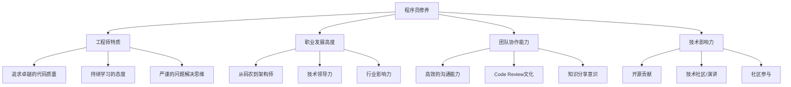
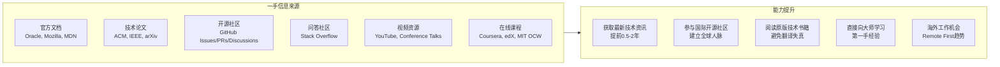
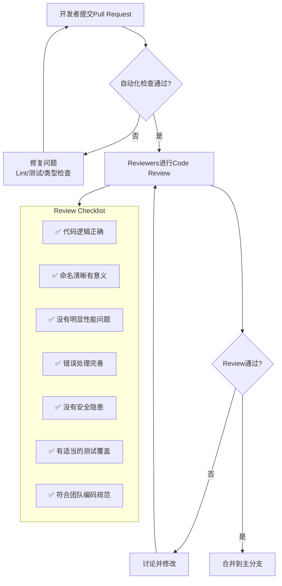
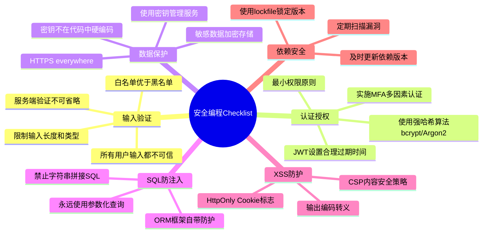
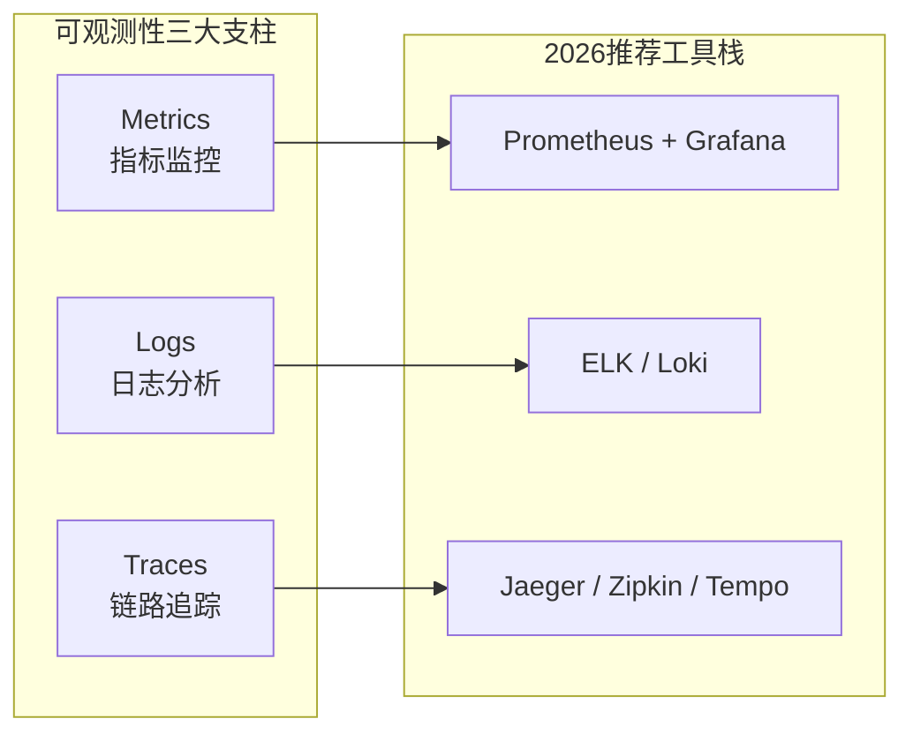
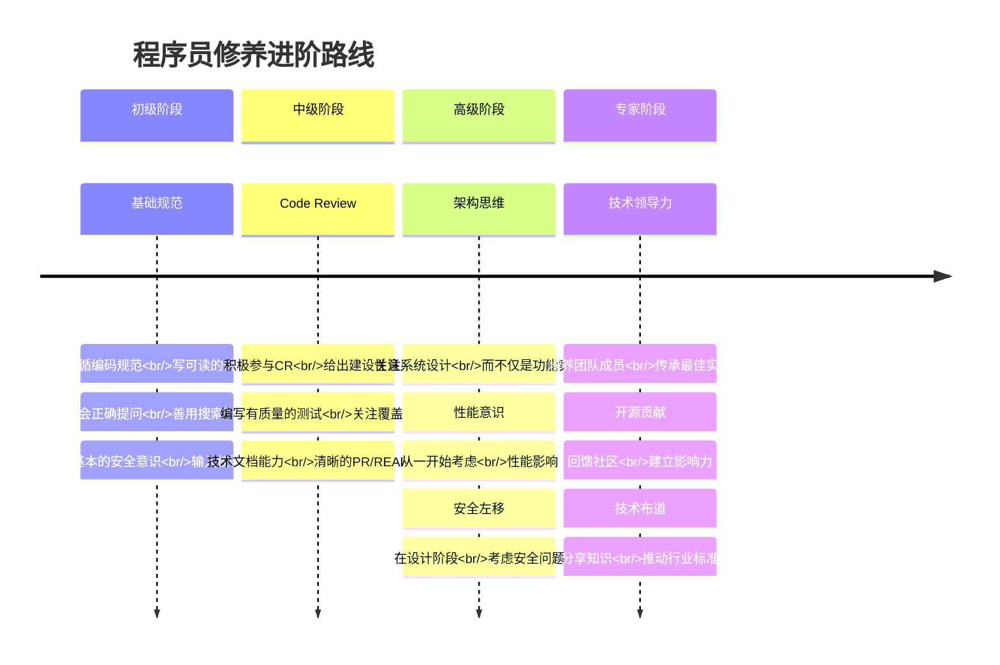

# 程序员练级攻略：程序员修养-[2026重制版]

> **核心变更说明**：本文基于2018年版全面升级，新增AI时代的代码修养、现代Code Review实践、安全编程最新标准（OWASP Top 10 2025）、DevOps文化、技术写作能力等内容，整合2026年最新的工程师文化最佳实践。


在完成上述的入门知识学习之后，我们要向专业的计算机软件开发进军了。但是在学习那些专业的知识前，我们先要抽一部分篇幅来说一下**程序员的修养**。

这是程序员的**工程师文化**，也就是程序员的价值观。因为我觉得如果你的技术修养不够的话，你学再多的知识也是没有用的。**有修养的程序员才可能成长为真正的工程师和架构师，而没有修养的程序员只能沦为码农——这是码农和工程师的关键区分点。**

## 🎯 为什么修养比技术更重要？



### 程序员修养的核心维度

根据 **Quora上的经典讨论** "What are some of the most basic things every programmer should know?" 以及 **《97 Things Every Programmer Should Know》**，我总结出以下核心理念：

| 修养维度 | 核心原则 | 2026年新解读 |
|---------|---------|-------------|
| **架构思维** | Bad architecture causes more problems than bad code | 在AI辅助编码时代，架构设计能力更加关键 |
| **思考习惯** | You will spend more time thinking than coding | AI生成代码很快，但思考和设计无法替代 |
| **实践导向** | The best programmers are always building things | 持续构建项目，而非只看不练 |
| **持续改进** | There's always a better way | 保持对新技术的敏感度，但不盲目追新 |
| **团队协作** | Code reviews by your peers will make all of you better | Code Review是成长最快的方式 |
| **质量优先** | Fewer features for better code is always the right answer | 技术债务会随时间指数级增长 |
| **测试意识** | If it's not tested, it doesn't work | 测试不是可选项，而是必需品 |
| **复用智慧** | Don't reinvent the wheel, library code is there to help | 善用开源生态，专注核心业务 |
| **可维护性** | Code that's hard to understand is hard to maintain | 写给他人看的代码，而非写给机器 |
| **业务理解** | Always know how your business makes money | 技术服务于业务价值 |

## 🌍 英文能力：通往高手之路的必经之门

必须指出，再往下走，有一个技能非常重要，那就是**英文**。如果对这个技能发怵的话，那么你可能无缘成为一个程序员高手了。

### 为什么英文如此重要？



**现实情况**：
- 所有计算机技术的源头都在西方国家
- 最新的技术文档、论文、讨论都是英文
- 开源社区的通用语言是英文
- 一手信息比二手中文资料**至少领先6个月到2年**

### 英文提升行动计划（2026版）

| 方法 | 具体行动 | 频率 | 预期效果 |
|------|---------|------|---------|
| **搜索习惯** | Google只用英文关键词搜索技术问题 | 每次 | 快速找到精准答案 |
| **GitHub实践** | 用英文写commit message、Issue、PR、Wiki | 每天 | 融入开源社区 |
| **视频输入** | YouTube看技术频道（有自动字幕） | 每天15分钟 | 提升听力和技术视野 |
| **词典使用** | Cambridge Dictionary / Google Dictionary插件 | 查词时 | 建立英式思维 |
| **教材选择** | 优先读英文原版书籍和文档 | 学习时 | 获得最准确的知识 |
| **口语练习** | 参加线上英语角或italki找外教 | 每周1-2次 | 提升交流能力 |
| **技术写作** | 尝试用英文写技术社区 | 每月1-2篇 | 输出倒逼输入 |

**推荐资源**：
- **BBC Learning English**: https://www.bbc.co.uk/learningenglish/
- **ESL Resources**: https://www.rong-chang.com/
- **Technology Podcasts**: Software Engineering Daily, The Changelog, Syntax FM

## 💬 问问题的能力：提问的智慧

### 经典必读文章

1. **《How To Ask Questions The Smart Way》** - Eric S. Raymond
   - 原文：http://www.catb.org/~esr/faqs/smart-questions.html
   - 中文版：http://doc.zengrong.net/smart-questions/cn.html
   - **核心观点**：STFW (Search the Fxxking Web) 和 RTFM (Read the Fxxking Manual)

2. **《X-Y Problem》**
   - 原文：http://xyproblem.info/
   - **常见错误**：你问的是Y问题的解决方案，但真正的问题是X

3. **Stack Exchange FAQ**
   - https://meta.stackexchange.com/questions/7931/faq-for-stack-exchange-sites

### 好问题 vs 坏问题对比

| 维度 | ❌ 坏问题 | ✅ 好问题 |
|------|---------|---------|
| **标题** | "救命！Java报错了" | "Spring Boot 3.4启动时报NoSuchBeanDefinitionException" |
| **描述** | "我的代码不工作了" | 详细描述现象、期望行为、实际行为 |
| **环境** | 无 | OS版本、JDK版本、框架版本、依赖版本 |
| **复现步骤** | 无 | 清晰的最小化复现步骤 |
| **尝试过什么** | 无 | 列出已尝试的方法和结果 |
| **代码示例** | 截图/粘贴大量无关代码 | 最小可复现代码（用代码块格式化） |
| **错误信息** | "有个错误" | 完整的错误堆栈 |

### 提问模板（可直接使用）

```markdown
## 问题描述
一句话概括你遇到的问题

## 环境
- 操作系统: macOS 15.2 / Ubuntu 22.04 / Windows 11
- JDK版本: OpenJDK 21.0.2
- Spring Boot: 3.4.1
- 其他相关依赖及版本:

## 期望行为
描述你认为应该发生什么

## 实际行为
描述实际发生了什么（附截图/日志）

## 复现步骤
1. 第一步做什么
2. 第二步做什么
3. ...

## 最小代码示例
\`\`\`java
// 这里贴上能复现问题的最小代码
\`\`\`

## 错误日志
\`\`\`
Exception in thread "main" ...
\`\`\`

## 已尝试的解决方案
- [ ] 方案1: 结果...
- [ ] 方案2: 结果...

## 参考资料
- 相关文档链接:
- 类似问题链接:
```

## ✍️ 写代码的修养：从能写到写好

### 推荐书单（按优先级排序）

| 书名 | 作者 | 核心主题 | 必读性 |
|------|------|---------|--------|
| **《代码大全》（第2版）** | Steve McConnell | 编程实践的百科全书 | ⭐⭐⭐⭐⭐ |
| **《重构：改善既有代码的设计》** | Martin Fowler | 系统化改进代码质量 | ⭐⭐⭐⭐⭐ |
| **《修改代码的艺术》** | Michael Feathers | 安全地修改遗留代码 | ⭐⭐⭐⭐ |
| **《代码整洁之道》** | Robert C. Martin (Uncle Bob) | 整洁代码的原则和模式 | ⭐⭐⭐⭐⭐ |
| **《程序员的职业素养》** | Robert C. Martin | 专业程序员的价值观 | ⭐⭐⭐⭐ |
| **《The Software Craftsman》** | Sandro Mancuso | 软件工艺运动 | ⭐⭐⭐⭐ |

### 2026年代码质量标准

#### 1. 可读性原则

```java
// ❌ 差：变量命名不清晰，逻辑嵌套深
public List<User> getData(List<String> ids, String type, boolean flag) {
    List<User> res = new ArrayList<>();
    if (ids != null) {
        for (String id : ids) {
            if (type.equals("A")) {
                if (flag) {
                    User u = repo.findById(id);
                    if (u != null && u.isActive()) {
                        res.add(u);
                    }
                }
            }
        }
    }
    return res;
}

// ✅ 好：清晰的命名，早返回，逻辑清晰
public List<User> findActiveUsersByIds(
        List<String> userIds,
        UserType userType,
        boolean includeInactive) {

    if (CollectionUtils.isEmpty(userIds)) {
        return Collections.emptyList();
    }

    return userIds.stream()
        .map(userRepository::findById)
        .filter(Objects::nonNull)
        .filter(user -> matchesCriteria(user, userType, includeInactive))
        .toList();
}

private boolean matchesCriteria(User user, UserType type, boolean includeInactive) {
    boolean typeMatches = type == UserType.ALL || user.getType() == type;
    boolean activeMatches = includeInactive || user.isActive();
    return typeMatches && activeMatches;
}
```

#### 2. Code Review 最佳实践



**Code Review 的核心价值**：
- **知识共享**：团队成员了解彼此的代码
- **Bug发现**：多双眼睛比一双眼睛好
- **最佳实践传播**：好的模式被复制
- **团队文化建设**：共同维护代码质量

> 💡 **重要观点**：我认为**没有Code Review的公司都没有必要呆**（因为不做Code Review的公司一定是不尊重技术的）。

#### 3. 单元测试修养

**为什么测试很重要？**

| 观点 | 说明 |
|------|------|
| **测试即文档** | 测试用例展示了代码应该如何被使用 |
| **重构安全保障** | 有测试覆盖才能放心重构 |
| **设计驱动** | 可测试的代码通常是更好的设计 |
| **Bug回归防护** | 防止已修复的问题再次出现 |

**JUnit 5 最佳实践示例**：

```java
@ExtendWith(MockitoExtension.class)
@DisplayName("用户服务单元测试")
class UserServiceTest {

    @Mock
    private UserRepository userRepository;

    @Mock
    private PasswordEncoder passwordEncoder;

    @InjectMocks
    private UserService userService;

    // ========== 测试注册场景 ==========

    @Nested
    @DisplayName("注册功能")
    class RegisterTests {

        @Test
        @DisplayName("应该成功注册新用户")
        void shouldRegisterNewUserSuccessfully() {
            // Given - 准备测试数据
            RegisterRequest request = new RegisterRequest(
                "testuser",
                "SecurePass123!",
                "test@example.com"
            );
            when(passwordEncoder.encode(anyString())).thenReturn("encoded_hash");
            when(userRepository.existsByUsername("testuser")).thenReturn(false);
            when(userRepository.save(any())).thenAnswer(invocation -> invocation.getArgument(0));

            // When - 执行操作
            User result = userService.register(request);

            // Then - 验证结果
            assertThat(result.getUsername()).isEqualTo("testuser");
            assertThat(result.getPasswordHash()).isEqualTo("encoded_hash");
            assertThat(result.getEmail()).isEqualTo("test@example.com");
            verify(passwordEncoder).encode("SecurePass123!");
            verify(userRepository).save(any(User.class));
        }

        @Test
        @DisplayName("当用户名已存在时应抛出异常")
        void shouldThrowWhenUsernameExists() {
            RegisterRequest request = new RegisterRequest(
                "existinguser", "pass", "email@test.com"
            );
            when(userRepository.existsByUsername("existinguser")).thenReturn(true);

            assertThatThrownBy(() -> userService.register(request))
                .isInstanceOf(DuplicateUsernameException.class)
                .hasMessageContaining("用户名已存在");

            verify(userRepository, never()).save(any());
        }

        @Test
        @DisplayName("密码强度不足时应抛出异常")
        void shouldThrowWhenPasswordWeak() {
            RegisterRequest request = new RegisterRequest("user", "123", "email@test.com");

            assertThatThrownBy(() -> userService.register(request))
                .isInstanceOf(WeakPasswordException.class);
        }
    }
}
```

**测试覆盖率目标**：

| 层次 | 覆盖率目标 | 工具 |
|------|-----------|------|
| 核心业务逻辑 | ≥ 80% | JaCoCo |
| 工具类/Utils | ≥ 90% | JaCoCo |
| Controller层 | ≥ 70% | Spring MockMvc |
| 整体项目 | ≥ 70% | SonarQube |

## 🔒 安全防范意识

### OWASP Top 10（2025版）

作为Web开发者，**必须了解OWASP Top 10**——这是Web应用安全领域的权威标准。下表基于OWASP Top 10:2025（截至2026年9月的最新版本）：

| 排名 | 安全风险 | 2026年现状 | 防护措施 |
|------|---------|-----------|---------|
| **A01** | **访问控制失效 (Broken Access Control)** | #1高频漏洞 | 权限校验、RBAC模型 |
| **A02** | **安全配置错误 (Security Misconfiguration)** | 默认配置问题 | 安全基线、硬化指南 |
| **A03** | **软件供应链失效 (Software Supply Chain Failures)** | 依赖与构建链风险（取代2021版的"易受攻击和过时的组件"） | 依赖扫描、SBOM、制品签名验证 |
| **A04** | **加密机制失败 (Cryptographic Failures)** | 数据泄露主因 | 使用标准加密库、密钥管理 |
| **A05** | **注入 (Injection)** | SQL注入仍常见 | 参数化查询、ORM |
| **A06** | **不安全设计 (Insecure Design)** | 架构层面威胁 | 威胁建模、安全设计原则 |
| **A07** | **认证失败 (Authentication Failures)** | 认证绕过 | MFA、强密码策略、JWT安全 |
| **A08** | **软件和数据完整性失败 (Software or Data Integrity Failures)** | 更新链路攻击 | CI/CD安全、签名验证 |
| **A09** | **安全日志和告警失败 (Security Logging & Alerting Failures)** | 攻击检测盲区 | 日志审计、入侵检测 |
| **A10** | **异常条件处理不当 (Mishandling of Exceptional Conditions)** | 2025版新增类别 | 完善异常与错误处理、避免泄露堆栈信息 |

### 安全编程Checklist



### 防御性编程（Defensive Programming）

**核心思想**：编写健壮的代码，即使在被误用时也不会产生灾难性后果。

```java
// ❌ 过于信任调用者
public void processUserInput(String input) {
    // 直接使用，假设input不为null且格式正确
    int value = Integer.parseInt(input);
    database.save(value);
}

// ✅ 防御性编程
public void processUserInput(String input) {
    // 1. 参数校验
    if (input == null || input.isBlank()) {
        throw new IllegalArgumentException("输入不能为空");
    }

    // 2. 格式验证
    if (!input.matches("\\d+")) {
        throw new IllegalArgumentException("输入必须是数字");
    }

    // 3. 边界检查
    int value = Integer.parseInt(input);
    if (value < 0 || value > MAX_ALLOWED_VALUE) {
        throw new IllegalArgumentException("数值超出允许范围");
    }

    // 4. 异常捕获
    try {
        database.save(value);
    } catch (DataAccessException e) {
        log.error("保存数据失败, value={}", value, e);
        throw new BusinessException("数据处理失败，请稍后重试");
    }
}
```

> ⚠️ **注意**：防御性编程也要适度，不要过度防御导致代码臃肿。

## 🚀 软件工程与上线规范

### 测试文化

推荐两本测试经典：

| 书名 | 作者 | 核心价值 |
|------|------|---------|
| **《完美软件：对软件测试的各种幻想》** | Gerald Weinberg | 测试心理学和方法论 |
| **《Google软件测试之道》** | James A. Whittaker | Google测试实践和架构 |

### 上线前Checklist

参考 **Production Readiness Checklist**：

```yaml
# 上线前检查清单

## 功能测试
- [ ] 所有需求都已实现并通过验收
- [ ] 回归测试通过，无已知严重Bug
- [ ] 边界情况和异常流程已测试

## 性能测试
- [ ] 压力测试完成，明确系统容量上限
- [ ] P99响应时间满足SLA要求
- [ ] 数据库慢查询已优化

## 安全检查
- [ ] OWASP Top 10漏洞扫描通过
- [ ] 依赖包无已知CVE漏洞
- [ ] 敏感信息已从代码中移除
- [ ] HTTPS证书有效且配置正确
- [ ] 安全头（CSP, X-Frame-Options等）已配置

## 监控告警
- [ ] 关键业务指标监控已接入
- [ ] 错误日志收集和告警已配置
- [ ] 告警通知渠道畅通（钉钉/企微/邮件）
- [ ] 链路追踪（APM）已启用

## 运维准备
- [ ] 部署脚本和文档完整
- [ ] 回滚方案已准备并可执行
- [ ] 数据库迁移脚本已审查
- [ ] 配置管理（环境变量/配置中心）就绪

## 文档
- [ ] API文档更新（Swagger/OpenAPI）
- [ ] 运维手册更新
- [ ] 变更记录完整
```

### 监控基础（Monitoring 101）

**三大支柱**（来自Google SRE Book）：



**关键指标**：

| 类型 | 指标 | 工具 |
|------|------|------|
| **RED方法** (面向请求) | Rate（速率）、Error（错误）、Duration（延迟） | Prometheus |
| **USE方法** (面向资源) | Utilization（利用率）、Saturation（饱和度）、Errors（错误） | Node Exporter |
| **四大黄金信号** | 延迟、流量、错误、饱和度 | 自定义Dashboard |

## 📖 编程规范速查表

### 各语言规范（2026精选）

| 语言 | 官方/权威规范 | 团队常用规范 |
|------|--------------|-------------|
| **Java** | Oracle Code Conventions, Google Java Style | Alibaba Java Coding Guidelines |
| **Python** | PEP 8, Google Python Style Guide | Black Formatter, Ruff Linter |
| **TypeScript** | Google JS Style, Airbnb JS Guide | ESLint + Prettier, Strict Config |
| **Go** | Effective Go (Official), Go Code Review Comments | golangci-lint |
| **Rust** | Rust API Guidelines, Rust Style Guide | Clippy |
| **C/C++** | Google C++ Style, C++ Core Guidelines | clang-format |

### 前端规范

| 类别 | 推荐规范/工具 |
|------|-------------|
| **HTML** | Google HTML/CSS Style Guide, Front-End Checklist |
| **CSS** | Tailwind CSS (原子化), CSS Guidelines |
| **JavaScript/TypeScript** | Airbnb JavaScript Style, StandardJS |
| **React** | Airbnb React/JSX Style Guide |
| **Vue** | Vue.js Style Guide (Official) |
| **API Design** | Microsoft REST API Guidelines, Zalando RESTful API |

## 💡 总结：修养决定高度

程序员的修养是一个持续修炼的过程，它包括：



**记住这些话**：

> "代码是写给人看的，顺便能让机器执行。" —— Abelson & Sussman

> "任何傻瓜都能写出计算机能理解的代码，优秀的程序员写出人能理解的代码。" —— Martin Fowler

---

**下一篇文章**我们将进入**专业基础篇**的第一章：**编程语言**。我们将深入探讨C、C++、Java、Go、Rust等工业级编程语言的学习路径和精髓。
