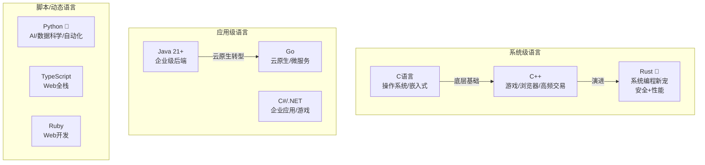
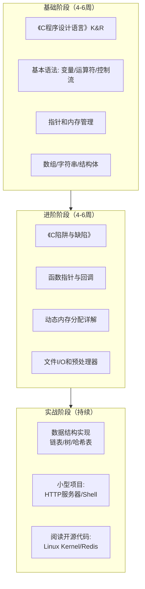
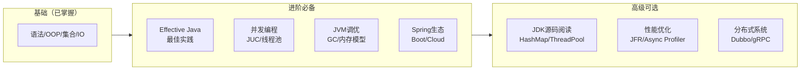
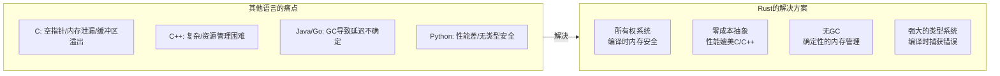
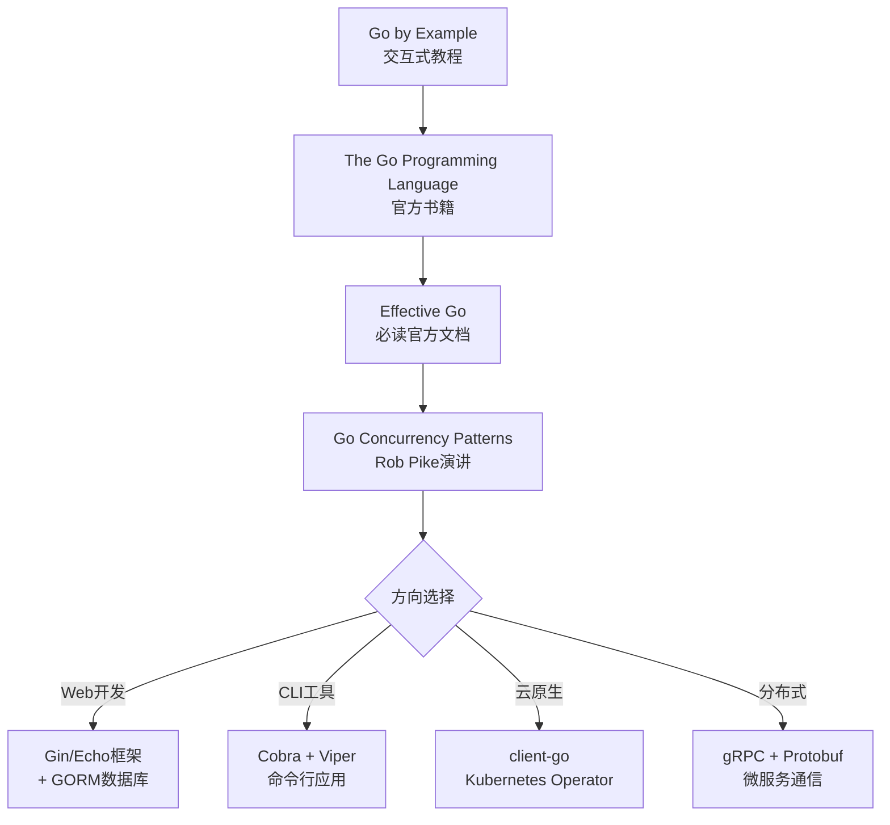
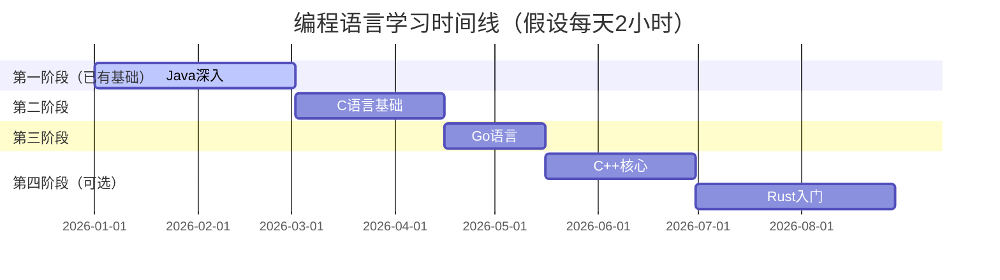

# 程序员练级攻略：编程语言-[2026重制版]

> **核心变更说明**：本文基于2018年版全面升级，新增Rust语言学习路径（2026年最重要趋势之一）、TypeScript深度学习、Go语言最新生态、Java 21+新特性实践，以及各语言的2026年就业市场分析。


为了进入专业的编程领域，我们需要认真学习**工业级的编程语言**。什么是"工业级"？主要由以下特征定义：

1. **标准化**：有ISO或权威组织制定的标准
2. **工业应用**：被大型企业用于生产环境
3. **生态系统**：拥有成熟的库、框架、工具链
4. **社区支持**：活跃的开发者社区和长期维护承诺

## 🗺️ 编程语言全景图（2026）



### 2026年语言流行度数据来源

| 数据源 | 网址 | 更新频率 |
|--------|------|---------|
| **TIOBE Index** | https://www.tiobe.com/tiobe-index/ | 月度 |
| **Stack Overflow Survey** | https://survey.stackoverflow.com/ | 年度 |
| **GitHub Octoverse** | https://octoverse.github.com/ | 年度 |
| **JetBrains Developer Survey** | https://www.jetbrains.com/lp/devecosystem-2025/ | 年度 |
| **PyPL Popularity** | https://pypl.github.io/PYPL.html | 月度 |

## 🔥 必学语言一：C语言——万源之源

### 为什么C语言是必须学习的？

> **"如果你不学C语言，你根本没有资格说你是一个合格的程序员！"**

这个观点可能听起来很武断，但请听我解释：

1. **操作系统基石**：Linux、Windows、macOS内核都是C写的
2. **语言之母**：Python、Java、Ruby、PHP、JavaScript等解释器/虚拟机都是C/C++实现的
3. **硬件接口**：驱动程序、嵌入式系统几乎全是C
4. **性能极致**：需要极致性能的场景，C仍是首选
5. **理解计算机**：学C能真正理解内存、指针、编译过程

### C语言学习路径



### 推荐书籍（严格排序）

| 优先级 | 书名 | 作者 | 特点 | 必读性 |
|--------|------|------|------|--------|
| ⭐⭐⭐⭐⭐ | **《C程序设计语言》（K&R）** | Dennis Ritchie & Brian Kernighan | C语言之父写的圣经，简洁精炼 | 必读 |
| ⭐⭐⭐⭐⭐ | **《C语言程序设计现代方法》** | K. N. King | 覆盖C99标准，实用全面 | 强烈推荐 |
| ⭐⭐⭐⭐ | **《C陷阱与缺陷》** | Andrew Koenig | 避免常见错误和陷阱 | 必读 |
| ⭐⭐⭐ | **《C专家编程》** | Peter van der Linden | 深入理解C的奥秘 | 进阶选读 |

> ⚠️ **重要提醒**：千万不要看谭浩强的C语言书籍！各种误导，会把你带坑里。

### C语言核心知识点示例

```c
// 指针 - C的灵魂
void swap(int *a, int *b) {
    int temp = *a;
    *a = *b;
    *b = temp;
}

// 结构体和函数指针 - 回调机制
typedef struct {
    char name[64];
    int (*compare)(const void *, const void *);
} SortContext;

// 内存管理 - 手动分配释放
char* str_duplicate(const char* src) {
    if (src == NULL) return NULL;

    size_t len = strlen(src) + 1;
    char* dest = malloc(len);
    if (dest == NULL) return NULL;

    memcpy(dest, src, len);
    return dest;
}
// 使用后必须 free(dest)
```

## 🔥 必学语言二：C++——复杂但强大

### 为什么还要学C++？

虽然C++是世界上最复杂的编程语言，但它：

1. **范式最全**：支持面向对象、泛型、函数式、元编程等多种范式
2. **性能无敌**：零开销抽象，运行时效率接近C
3. **工业标准**：浏览器引擎、游戏引擎、高频交易系统都用C++
4. **学习价值**：理解现代编程语言设计的很多思想来源于C++

### C++学习重点（不需要全部精通）

| 知识领域 | 重要程度 | 学习目标 |
|---------|---------|---------|
| **面向对象** | ⭐⭐⭐⭐⭐ | 类、继承、多态、虚函数 |
| **模板和泛型** | ⭐⭐⭐⭐⭐ | 函数模板、类模板、模板元编程入门 |
| **STL** | ⭐⭐⭐⭐⭐ | vector, map, unordered_map, algorithm |
| **智能指针** | ⭐⭐⭐⭐⭐ | unique_ptr, shared_ptr, weak_ptr |
| **现代C++特性** | ⭐⭐⭐⭐ | auto, lambda, range-for, move语义 |
| **并发** | ⭐⭐⭐ | thread, mutex, atomic, future |

### 推荐书籍

| 书名 | 作者 | 特点 | 必读性 |
|------|------|------|--------|
| **《C++ Primer》** (第5版) | Stanley Lippman 等 | 最全面的C++教程 | ⭐⭐⭐⭐⭐ |
| **《Effective C++》** | Scott Meyers | 55个具体建议，每条都是精华 | ⭐⭐⭐⭐⭐ |
| **《More Effective C++》** | Scott Meyers | Effective续作，更深入 | ⭐⭐⭐⭐⭐ |
| **《深入探索C++对象模型》** | Stanley Lippman | 了解C++底层实现 | ⭐⭐⭐⭐ |

## 🔥 必学语言三：Java——企业级霸主

### Java在2026年的地位

根据 **TIOBE Index 2026** 和 **JetBrains Survey 2025**：
- Java仍稳居**前3名**
- 企业级后端开发**绝对主力**
- Android开发（Kotlin并存）
- 大数据生态（Spark, Flink, Hadoop）

### Java版本选择建议

| 版本 | 发布时间 | 类型 | 推荐场景 |
|------|---------|------|---------|
| **Java 17 LTS** | 2021.9 | 长期支持 | 企业生产环境首选 ✅ |
| **Java 21 LTS** | 2023.9 | 长期支持 | 新项目推荐 ✅ |
| **Java 25 LTS** | 2025.9 | 长期支持 | 新项目推荐 ✅ |
| Java 26 | 2026.3 | 最新特性 | 学习尝鲜 |

### Java学习路径（进阶版）



### Java 21+ 新特性速览

| 特性 | 版本 | 说明 | 示例场景 |
|------|------|------|---------|
| **Record** | 14 | 不可变数据载体 | DTO、值对象 |
| **Pattern Matching** | 16-21 | 模式匹配增强 | switch表达式、instanceof |
| **Virtual Threads** | 21 | 轻量级线程 | 高并发IO密集型 |
| **Sealed Classes** | 15/17 | 密封类 | 域建模、代数数据类型 |
| **String Templates** | 21 (Preview) | 字符串模板（该特性后来已被移除） | SQL构建、日志 |

## 🌟 重点推荐：Rust——2026年最具潜力的语言

### 为什么现在必须关注Rust？

根据 **Stack Overflow Developer Survey 2020-2025**：
- Rust连续**6年**被评为"最受喜爱的编程语言"
- Linux内核已正式采用Rust编写模块
- AWS Firecracker（serverless基础设施）用Rust
- Windows 11部分组件用Rust重写
- **Rust是未来10年最重要的系统编程语言**

### Rust的核心优势



### Rust学习路径

| 阶段 | 内容 | 时间 | 资源 |
|------|------|------|------|
| **入门** | 所有权、借用、生命周期 | 4-6周 | The Rust Book (免费官方) |
| **进阶** | Trait系统、错误处理、异步编程 | 6-8周 | Rust by Example, Rustlings |
| **实战** | CLI工具、Web服务(axum/actix) | 4-6周 | Crates.io生态 |
| **深入** | 不安全代码、FFI、宏编程 | 持需 | Rust Nomicon, Rust Reference |

### Rust快速体验

```rust
// 所有权示例 - Rust的核心概念
fn main() {
    let s1 = String::from("hello");
    let s2 = s1;           // s1的所有权转移给s2
    // println!("{}", s1); // ❌ 编译错误！s1已失效
    println!("{}", s2);     // ✅ 正确

    // 克隆而非移动
    let s3 = String::from("world");
    let s4 = s3.clone();   // 深拷贝，两者都有效
    println!("{} {}", s3, s4);

    // 函数中的所有权规则
    let s5 = takes_ownership(s4);      // s4被移入函数，随后所有权返回给s5
    let x = 5;
    makes_copy(x);                     // i32实现了Copy，x仍然有效
    println!("x = {}", x);

    // 引用与借用 - 不获取所有权
    let len = calculate_length(&s5);   // 传递引用
    println!("'{}' 的长度是 {}", s5, len); // s5仍然有效
}

fn takes_ownership(some_string: String) -> String {
    println!("{}", some_string);
    some_string // 所有权移回调用方
}

fn makes_copy(some_integer: i32) { // some_integer进入作用域
    println!("{}", some_integer);
} // some_integer离开作用域，没有特殊操作

fn calculate_length(s: &String) -> usize { // s是对String的引用
    s.len()
} // s离开作用域，但没有所有权，不会drop
```

## ⚡ Go语言——云原生的王者

### Go在2026的地位

根据 **Cloud Native Computing Foundation (CNCF) 2025 Survey**（下述数值为示例性归纳，非精确实测）：
- **92%** 的云原生项目使用Go
- Kubernetes、Docker、Prometheus、etcd等核心项目都用Go
- 微服务架构的首选语言之一

### Go vs 其他语言对比

| 特性 | Go | Java | Python | Rust |
|------|-----|------|--------|------|
| **学习曲线** | ⭐⭐ 简单 | ⭐⭐⭐ 中等 | ⭐⭐ 简单 | ⭐⭐⭐⭐ 较难 |
| **编译速度** | 极快 | 较慢 | 解释执行 | 快 |
| **并发模型** | Goroutine + Channel | Thread + JUC | asyncio/GIL | async/await |
| **运行时** | 有（轻量） | JVM（重量） | 解释器 | 无（编译到原生） |
| **部署** | 单二进制文件 | JAR + JRE | 需要解释器 | 单二进制文件 |
| **云原生适配** | ⭐⭐⭐⭐⭐ | ⭐⭐⭐⭐ | ⭐⭐⭐ | ⭐⭐⭐⭐ |
| **适合场景** | 微服务/CLI/云基础设施 | 企业应用/大数据 | AI/脚本/原型 | 系统编程/WebAssembly |

### Go学习路径



### Go并发模式示例

```go
package main

import (
    "fmt"
    "sync"
    "time"
)

// Worker Pool 模式
func worker(id int, jobs <-chan int, results chan<-int, wg *sync.WaitGroup) {
    defer wg.Done()
    for j := range jobs {
        fmt.Printf("Worker %d started job %d\n", id, j)
        time.Sleep(time.Second) // 模拟耗时任务
        fmt.Printf("Worker %d finished job %d\n", id, j)
        results <- j * 2
    }
}

func main() {
    const numJobs = 10
    const numWorkers = 3

    jobs := make(chan int, numJobs)
    results := make(chan int, numJobs)

    var wg sync.WaitGroup

    // 启动worker
    for w := 1; w <= numWorkers; w++ {
        wg.Add(1)
        go worker(w, jobs, results, &wg)
    }

    // 发送任务
    for j := 1; j <= numJobs; j++ {
        jobs <- j
    }
    close(jobs)

    // 等待所有worker完成
    go func() {
        wg.Wait()
        close(results)
    }()

    // 收集结果
    for r := range results {
        fmt.Println("Result:", r)
    }
}
```

## 📊 语言学习优先级和时间规划

### 推荐的学习顺序



### 各语言投入时间建议

| 语言 | 投入时间 | 目标水平 | 必要性 |
|------|---------|---------|--------|
| **Java** | 已完成（入门篇+本篇进阶） | 精通 | ⭐⭐⭐⭐⭐ 必须 |
| **C语言** | 6-8周 | 熟练 | ⭐⭐⭐⭐⭐ 必须 |
| **Go语言** | 4-6周 | 能写项目 | ⭐⭐⭐⭐ 强烈推荐 |
| **C++** | 6-8周 | 理解核心概念 | ⭐⭐⭐ 推荐 |
| **Rust** | 8-12周 | 入门到能写项目 | ⭐⭐⭐ 2026推荐 |
| **TypeScript** | 已掌握（前端篇） | 精通 | ⭐⭐⭐⭐⭐ 必须 |
| **Python** | 已掌握（入门篇） | 熟练 | ⭐⭐⭐⭐ 重要 |

## 💡 多语言学习的价值

### 为什么要学多门语言？

1. **思维多样性**：不同语言代表不同的编程范式和思维方式
2. **技术选型能力**：知道什么场景用什么语言最合适
3. **学习能力培养**：学会一门新语言后，再学其他会更快
4. **职业发展**：拓宽就业面，适应不同岗位需求
5. **理解本质**：通过比较不同语言，理解编程的本质

### 语言对比：同一问题的不同解法

以"读取文件并统计词频"为例：

| 语言 | 代码行数 | 特点 |
|------|---------|------|
| Python | ~10行 | 最简洁，适合脚本 |
| Go | ~30行 | 清晰的类型和错误处理 |
| Java | ~40行 | 面向对象，结构化 |
| Rust | ~35行 | 所有权明确，无GC |
| C | ~50行 | 手动内存管理，最底层 |

---

**下一篇文章**我们将探讨**理论学科**：算法、数据结构、计算机网络、操作系统原理、编译原理等计算机科学的精髓。
