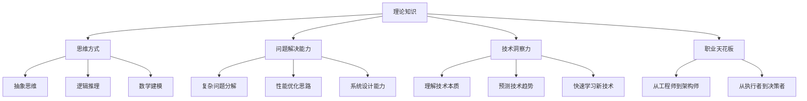
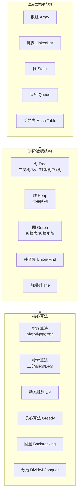
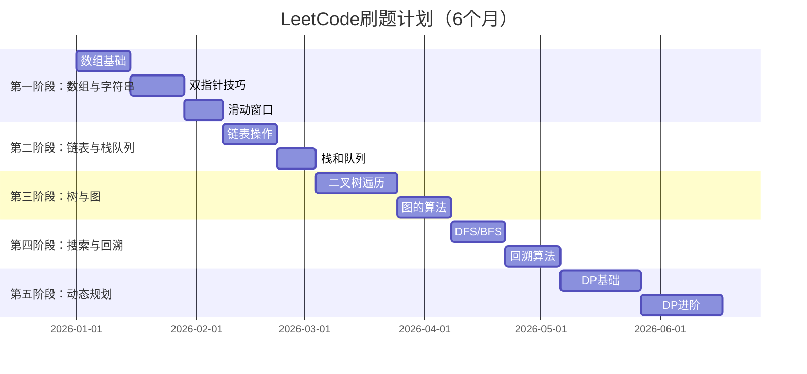
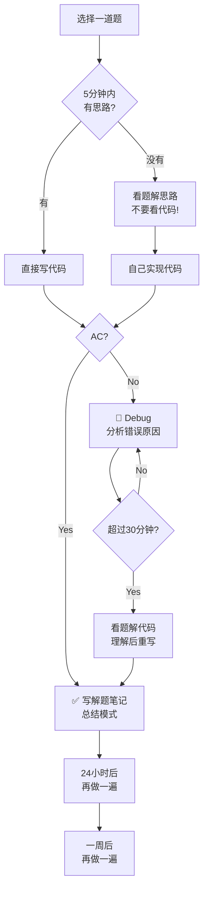
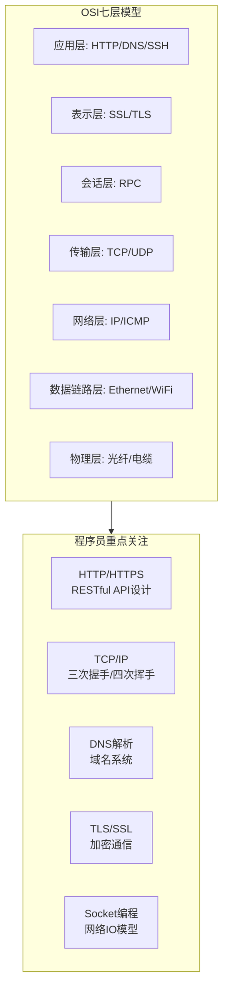
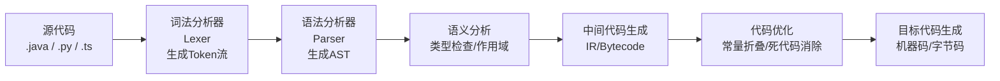

# 程序员练级攻略：理论学科-[2026重制版]

> **核心变更说明**：本文基于2018年版全面升级，新增LeetCode刷题策略（2026面试必备）、算法可视化学习资源、计算机基础知识的实际应用场景、AI时代的算法新趋势（如LLM相关算法），以及与工业实践的结合。


进入专业的编程领域，**算法、数据结构、网络模型、计算机原理**等理论知识是必须要学习的。这些理论知识可以说是计算机科学这门学科最精华的知识了。

## 🎯 为什么理论学科如此重要？



### 常见误区

| 误区 | 真相 |
|------|------|
| "工作中用不到算法" | **算法思维**无处不在：数据库索引(B+树)、缓存淘汰(LRU)、负载调度(一致性哈希) |
| "算法太难了" | 有套路可循，通过练习可以掌握 |
| "会用API就行了" | 只会调用API的是码农，理解原理的是工程师 |
| "等用到再学" | 基础不牢，遇到复杂问题时束手无策 |

## 📊 数据结构与算法

### 为什么算法很重要？

我20年的经验告诉我，无论是做业务还是做底层系统，**经常需要使用算法处理各种各样的问题**：

- 业务上：布隆过滤器判断重复、蓄水池算法做统计
- 系统中：数据库B+树索引、Linux epoll红黑树、Nginx事件驱动
- 架构上：服务调度的背包问题、一致性哈希的环结构

### 学习路径图



### 推荐书籍（按优先级）

| 书名 | 作者 | 难度 | 特点 | 适用场景 |
|------|------|------|------|---------|
| **《算法》（第4版）** | Robert Sedgewick & Kevin Wayne | ⭐⭐⭐ | 图解丰富，50个必知算法 | 入门首选 |
| **《算法导论》** | CLRS | ⭐⭐⭐⭐⭐ | 学术权威，理论完整 | 深入学习 |
| **《算法图解》** | Aditya Bhargava | ⭐⭐ | 图文并茂，通俗易懂 | 零基础入门 |
| **《编程珠玑》** | Jon Bentley | ⭐⭐⭐⭐ | 实际问题导向 | 思维训练 |
| **《剑指Offer》** | 何海涛 | ⭐⭐⭐ | 面试题集 | 国内求职 |

### LeetCode 刷题策略（2026版）

**为什么必须刷题？**
- 国内外大厂面试**必考算法**
- 训练编程能力和代码质量
- 巩固数据结构和算法知识

#### 刷题路线图



#### 必刷题目分类（精选）

| 分类 | 题目数量 | 代表题目 | 重要程度 |
|------|---------|---------|---------|
| **数组** | 30 | 两数之和、三数之和、合并区间 | ⭐⭐⭐⭐⭐ |
| **链表** | 20 | 反转链表、合并K个有序链表、环形链表 | ⭐⭐⭐⭐⭐ |
| **栈/队列** | 15 | 有效括号、最小栈、滑动窗口最大值 | ⭐⭐⭐⭐ |
| **哈希表** | 15 | 字母异位词分组、最长连续序列 | ⭐⭐⭐⭐ |
| **二叉树** | 40 | 层序遍历、最大深度、路径总和、LCA | ⭐⭐⭐⭐⭐ |
| **堆** | 15 | 数组中第K大元素、前K个高频元素 | ⭐⭐⭐⭐ |
| **图** | 20 | 岛屿数量、课程表、网络延迟时间 | ⭐⭐⭐⭐ |
| **贪心** | 15 | 跳跃游戏、划分字母区间 | ⭐⭐⭐ |
| **二分查找** | 15 | 搜索旋转数组、寻找峰值 | ⭐⭐⭐⭐ |
| **动态规划** | 50 | 斐波那契、爬楼梯、背包问题、编辑距离 | ⭐⭐⭐⭐⭐ |
| **回溯** | 20 | 全排列、子集、N皇后、解数独 | ⭐⭐⭐⭐ |

#### 刷题方法论



### 算法在实际工作中的应用

| 场景 | 使用的数据结构/算法 | 实际案例 |
|------|-------------------|---------|
| **数据库索引** | B+树 | MySQL InnoDB索引 |
| **缓存淘汰** | LRU/LFU算法 | Redis内存管理 |
| **分布式ID** | 雪花算法 | Twitter Snowflake |
| **负载均衡** | 一致性哈希 | Dubbo路由 |
| **消息队列** | Ring Buffer | Disruptor |
| **推荐系统** | 协同过滤/图算法 | 商品推荐 |
| **搜索引擎** | 倒排索引 + TF-IDF | Elasticsearch |
| **短链接生成** | Base62/哈希 | URL Shortener |

## 🌐 计算机网络

### 为什么网络知识重要？

在微服务和分布式时代，**几乎每个程序都是网络程序**：
- 前后端分离：HTTP/HTTPS通信
- 微服务架构：RPC调用（gRPC/Dubbo）
- 消息队列：TCP长连接
- 云原生：Service Mesh（Envoy边车代理）

### 学习重点



### 推荐资源

| 资源 | 类型 | 特点 |
|------|------|------|
| **《计算机网络：自顶向下方法》** | 教材 | 经典教材，应用层开始讲解 |
| **《图解TCP/IP》** | 入门 | 图文并茂，适合快速入门 |
| **《TCP/IP详解 卷1》** | 进阶 | 经典但较难啃 |
| **Wireshark数据包分析实战** | 实践 | 抓包工具实操 |
| **Computer Networking: A Top-Down Approach** (Coursera) | 在线课程 | 与Kurose & Ross经典教材配套的在线课程 |

### HTTP协议要点（2026更新）

| 版本 | 特点 | 2026采用率 |
|------|------|-----------|
| **HTTP/1.1** | Keep-Alive、管道化 | 100%（兼容） |
| **HTTP/2** | 多路复用、头部压缩、服务器推送（推送在主流浏览器中已被移除） | 主流浏览器100%支持 |
| **HTTP/3 (QUIC)** | 基于UDP、0-RTT连接、解决队头阻塞 | 快速增长（Google/Meta采用） |

### 实践建议

**一定要用Wireshark抓包！** 看着真实的网络包比看书直观100倍：

```bash
# 安装Wireshark
# macOS: brew install --cask wireshark
# Ubuntu: sudo apt install wireshark

# 过滤HTTP请求
http.request.method == "GET"

# 过滤特定IP
ip.addr == 192.168.1.1

# 分析TCP三次握手
tcp.flags.syn == 1 && tcp.flags.ack == 0
```

## 💻 操作系统原理

### 为什么需要了解操作系统？

操作系统是**计算机世界的物理世界**，上层无论怎么玩（Java NIO、Node.js、Nginx），都逃脱不掉最底层的限制。

### 核心知识点

| 知识点 | 内容 | 重要程度 | 应用场景 |
|--------|------|---------|---------|
| **进程与线程** | 进程状态、上下文切换、线程模型 | ⭐⭐⭐⭐⭐ | 并发编程、性能优化 |
| **内存管理** | 虚拟内存、分页分段、页面置换 | ⭐⭐⭐⭐⭐ | JVM调优、内存泄漏排查 |
| **文件系统** | inode、目录结构、文件IO | ⭐⭐⭐⭐ | 存储系统设计 |
| **I/O模型** | 阻塞/非阻塞、多路复用 | ⭐⭐⭐⭐⭐ | 高并发服务设计 |
| **进程间通信** | 管道、消息队列、共享内存 | ⭐⭐⭐ | 分布式系统 |
| **死锁** | 四条件、预防、避免 | ⭐⭐⭐⭐ | 并发控制 |
| **调度算法** | FCFS、RR、优先级、CFS | ⭐⭐⭐ | 理解系统行为 |

### 推荐书籍

| 书名 | 作者 | 特点 |
|------|------|------|
| **《深入理解计算机系统》(CSAPP)** | Randal Bryant & David O'Hallaron | **程序员必读！** 从程序员视角理解计算机系统 |
| **《现代操作系统》** | Andrew Tanenbaum | 经典教材，全面系统 |
| **《Unix环境高级编程》(APUE)** | W. Richard Stevens | Unix/Linux编程圣经 |
| **《操作系统概念》** | Silberschatz | 学术性强，适合打基础 |

> 💡 **特别强调：《深入理解计算机系统》(CSAPP) 是程序员必读的一本书！**

## 🔀 编译原理

### 为什么学编译原理？

编译原理看似高深，但实际上：

- **理解程序如何运行**：从源代码到机器码的全过程
- **DSL设计能力**：为业务设计领域特定语言
- **工具使用更高效**：理解linters、formatters、transpilers的工作原理
- **前端工程化**：Babel、Webpack、Vite底层都是编译技术

### 核心概念



### 推荐资源

| 资源 | 类型 | 说明 |
|------|------|------|
| **《编译原理》**(龙书) | 教材 | 经典但很难啃 |
| **《计算机程序的构造和解释》(SICP)** | 教材 | MIT经典，用Scheme讲解程序本质 |
| **Crafting Interpreters** | 在线书(免费) | 实践导向，手写解释器 |
| **Engineering a Compiler** | 教材 | 更现代的视角 |

## 🤖 AI时代的算法新趋势（2026新增）

### 与AI/ML相关的算法基础

| 领域 | 需要掌握的算法 | 应用场景 |
|------|--------------|---------|
| **机器学习** | 梯度下降、SVM、K-Means、决策树 | 特征工程、模型选择 |
| **深度学习** | 反向传播、CNN/RNN/Transformer架构 | 模型理解和调优 |
| **LLM应用** | Tokenization、Attention机制、RAG检索增强 | AI应用开发 |
| **向量计算** | 余弦相似度、ANN近似最近邻 | 向量数据库、语义搜索 |
| **推荐算法** | 协同过滤、矩阵分解、深度推荐 | 个性化推荐系统 |

### 学习建议

如果你对AI方向感兴趣，除了传统算法外，还需要补充：

1. **线性代数**：矩阵运算、特征值分解
2. **概率统计**：贝叶斯、分布、假设检验
3. **优化理论**：凸优化、梯度下降变体
4. **信息论**：熵、交叉熵、KL散度

## 📝 总结：理论学习的正确姿势

### 时间投入建议

| 知识领域 | 建议时间 | 目标水平 |
|---------|---------|---------|
| **数据结构与算法** | 持续（每天1-2题） | 能解决中等难度题目 |
| **计算机网络** | 4-6周 | 理解HTTP/TCP/IP核心 |
| **操作系统** | 6-8周 | 理解进程/内存/I/O |
| **编译原理** | 4-6周（可选） | 了解基本流程 |

### 学习原则

1. **理论与实践结合**：每学一个概念就动手实现
2. **画图理解**：数据结构和算法一定要画图
3. **总结归纳**：建立自己的知识体系
4. **持续练习**：算法能力需要长期保持
5. **联系实际**：思考在工作中的应用场景

---

**下一篇文章**我们将探讨**系统知识**：Unix/Linux、TCP/IP深入、C10K问题、Socket编程等实践性极强的内容。
