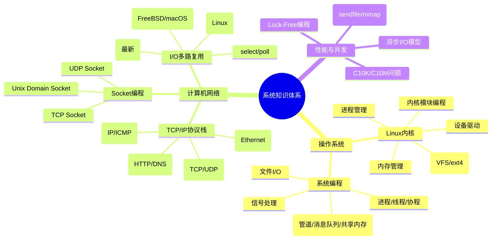
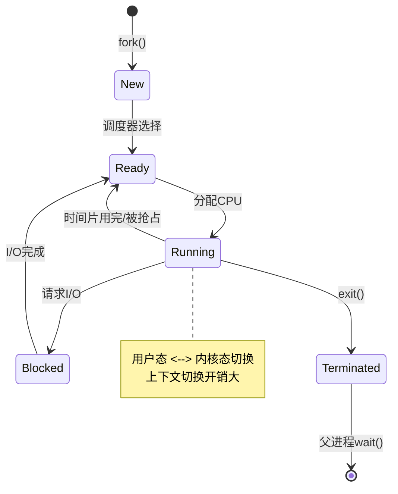
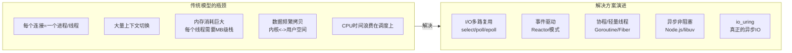
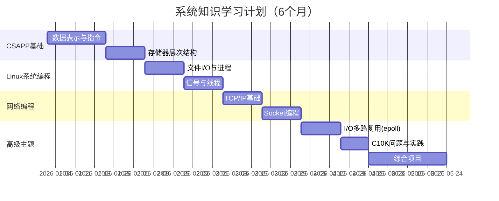

# 程序员练级攻略：系统知识-[2026重制版]

> **核心变更说明**：本文基于2018年版全面升级，新增Linux内核5.x/6.x新特性、epoll深度解析、io_uring（新一代异步IO）、C10K到C10M演进、现代网络编程框架（libuv/netty）、容器底层原理等2026年系统编程核心内容。


进入专业的编程领域，**学习系统知识是非常关键的一部分**。系统知识是理论知识的工程实践，这里面有很多很多的细节。

这些东西，你可以认为是**计算机世界的物理世界**，上层无论怎么玩——无论是Java NIO，还是Nginx，还是Node.js——它们都逃脱不掉最下层的限制。所以，你要好好学习这方面的知识。

## 🎯 系统知识全景图



## 📚 必读书籍（按重要性排序）

### 第一梯队：必读经典

| 书名 | 作者 | 核心价值 | 难度 | 必读性 |
|------|------|---------|------|--------|
| **《深入理解计算机系统》(CSAPP)** | Randal Bryant & David O'Hallaron | **程序员必读！**从程序员视角理解计算机系统全貌 | ⭐⭐⭐⭐ | ⭐⭐⭐⭐⭐ |
| **《Unix网络编程》(UNP)** | W. Richard Stevens | 网络编程圣经，两卷本 | ⭐⭐⭐⭐⭐ | ⭐⭐⭐⭐⭐ |
| **《Unix环境高级编程》(APUE)** | W. Richard Stevens | Unix/Linux系统编程圣经 | ⭐⭐⭐⭐⭐ | ⭐⭐⭐⭐⭐ |
| **《TCP/IP详解 卷1》** | W. Richard Stevens | TCP/IP协议深入浅出 | ⭐⭐⭐⭐ | ⭐⭐⭐⭐⭐ |

### 第二梯队：进阶选读

| 书名 | 作者 | 特点 |
|------|------|------|
| **《Linux/Unix系统编程手册》** | Michael Kerrisk | 超过1500页的百科全书 |
| **《Linux系统编程》** | Robert Love | 突出Linux特有技术 |
| **《TCP/IP网络编程》** | 尹圣雨 | 韩国作者，通俗易懂 |
| **《图解TCP/IP》** | 竹下隆史 | 图文并茂快速入门 |
| **《Wireshark数据包分析实战》** | Chris Sanders | 抓包实践 |

## 💻 Linux系统编程核心

### 进程与线程

#### 进程的生命周期



#### 关键系统调用

```c
#include <stdio.h>
#include <unistd.h>
#include <sys/wait.h>
#include <sys/types.h>

// 多进程示例：父子进程协作
int main() {
    pid_t pid = fork();

    if (pid < 0) {
        // fork失败
        perror("fork failed");
        return 1;
    } else if (pid == 0) {
        // 子进程
        printf("Child process (PID: %d)\n", getpid());
        printf("Parent PID: %d\n", getppid());

        // 子进程执行的任务
        for (int i = 0; i < 3; i++) {
            printf("Child working... %d\n", i);
            sleep(1);
        }

        _exit(0);  // 子进程用_exit退出
    } else {
        // 父进程
        printf("Parent process (PID: %d)\n", getpid());
        printf("Created child with PID: %d\n", pid);

        // 等待子进程结束
        int status;
        waitpid(pid, &status, 0);

        if (WIFEXITED(status)) {
            printf("Child exited with status %d\n", WEXITSTATUS(status));
        }

        printf("Parent done.\n");
    }

    return 0;
}
```

#### 多线程编程

```c
#include <pthread.h>
#include <stdio.h>
#include <unistd.h>

#define THREAD_COUNT 4

// 共享资源
int counter = 0;
pthread_mutex_t mutex = PTHREAD_MUTEX_INITIALIZER;

void* thread_func(void* arg) {
    int thread_id = *(int*)arg;

    for (int i = 0; i < 100000; i++) {
        // 加锁保护共享资源
        pthread_mutex_lock(&mutex);
        counter++;
        pthread_mutex_unlock(&mutex);
    }

    printf("Thread %d done.\n", thread_id);
    return NULL;
}

int main() {
    pthread_t threads[THREAD_COUNT];
    int ids[THREAD_COUNT];

    // 创建线程
    for (int i = 0; i < THREAD_COUNT; i++) {
        ids[i] = i;
        pthread_create(&threads[i], NULL, thread_func, &ids[i]);
    }

    // 等待所有线程结束
    for (int i = 0; i < THREAD_COUNT; i++) {
        pthread_join(threads[i], NULL);
    }

    printf("Final counter value: %d (expected: %d)\n",
           counter, THREAD_COUNT * 100000);

    pthread_mutex_destroy(&mutex);
    return 0;
}
```

### I/O模型演进

这是系统编程中**最重要的知识点之一**！


### epoll深度解析（Linux核心）

为什么Nginx、Redis、Netty都用epoll？因为它高效！

```c
#include <sys/epoll.h>
#include <sys/socket.h>
#include <netinet/in.h>
#include <fcntl.h>
#include <unistd.h>
#include <stdio.h>
#include <stdlib.h>
#include <string.h>

#define MAX_EVENTS 64
#define PORT 8080

// 设置非阻塞IO
int set_nonblocking(int fd) {
    int flags = fcntl(fd, F_GETFL, 0);
    return fcntl(fd, F_SETFL, flags | O_NONBLOCK);
}

int main() {
    // 创建监听socket
    int listen_fd = socket(AF_INET, SOCK_STREAM, 0);
    set_nonblocking(listen_fd);

    int opt = 1;
    setsockopt(listen_fd, SOL_SOCKET, SO_REUSEADDR, &opt, sizeof(opt));

    struct sockaddr_in addr = {
        .sin_family = AF_INET,
        .sin_addr.s_addr = INADDR_ANY,
        .sin_port = htons(PORT)
    };
    bind(listen_fd, (struct sockaddr*)&addr, sizeof(addr));
    listen(listen_fd, SOMAXCONN);

    // 创建epoll实例
    int epfd = epoll_create1(0);

    // 添加监听socket到epoll
    struct epoll_event ev = {
        .events = EPOLLIN,
        .data.fd = listen_fd
    };
    epoll_ctl(epfd, EPOLL_CTL_ADD, listen_fd, &ev);

    struct epoll_event events[MAX_EVENTS];

    printf("Server running on port %d...\n", PORT);

    while (1) {
        // 等待事件（无限期阻塞）
        int nfds = epoll_wait(epfd, events, MAX_EVENTS, -1);

        for (int i = 0; i < nfds; i++) {
            uint32_t evts = events[i].events;
            int fd = events[i].data.fd;

            if (fd == listen_fd) {
                // 新连接到来
                while (1) {
                    struct sockaddr_in client_addr;
                    socklen_t client_len = sizeof(client_addr);
                    int conn_fd = accept(listen_fd,
                        (struct sockaddr*)&client_addr, &client_len);

                    if (conn_fd == -1) {
                        break;  // 没有更多连接
                    }

                    set_nonblocking(conn_fd);

                    // 将新连接加入epoll（LT模式，简化处理）
                    ev.events = EPOLLIN;
                    ev.data.fd = conn_fd;
                    epoll_ctl(epfd, EPOLL_CTL_ADD, conn_fd, &ev);

                    printf("New connection: %d\n", conn_fd);
                }
            } else {
                // 已有连接可读
                char buf[4096];
                ssize_t n = read(fd, buf, sizeof(buf));

                if (n <= 0) {
                    // 连接关闭或出错
                    close(fd);
                    epoll_ctl(epfd, EPOLL_CTL_DEL, fd, NULL);
                    printf("Connection %d closed\n", fd);
                } else {
                    // Echo back
                    write(fd, buf, n);
                }
            }
        }
    }

    close(epfd);
    close(listen_fd);
    return 0;
}
```

**epoll vs select/poll 对比**：

| 特性 | select | poll | epoll |
|------|--------|------|-------|
| **时间复杂度** | O(n) | O(n) | O(1) |
| **最大连接数** | FD_SETSIZE (通常1024) | 无限制 | 无限制 |
| **数据拷贝** | 每次都拷贝fd_set | 每次都拷贝fds数组 | 内核维护，无需拷贝 |
| **触发模式** | LT (水平触发) | LT | LT / ET (边缘触发) |
| **实现方式** | 轮询 | 轮询 | 回调 |

### io_uring：下一代异步IO（2026新增）

Linux 5.1+引入的**革命性IO接口**，性能超越epoll：

```c
// io_uring 基本使用示例（概念性代码）
#include <liburing.h>

int main() {
    struct io_uring ring;

    // 初始化io_uring实例（256个entry）
    io_uring_queue_init(256, &ring, 0);

    // 获取一个submission queue entry
    struct io_uring_sqe *sqe = io_uring_get_sqe(&ring);

    // 准备一个读操作（异步）
    char buf[4096];
    io_uring_prep_read(sqe, fd, buf, sizeof(buf), 0);

    // 设置完成后回调
    io_uring_sqe_set_data(sqe, (void*)"read operation");

    // 提交请求
    io_uring_submit(&ring);

    // 等待完成
    struct io_uring_cqe *cqe;
    io_uring_wait_cqe(&ring, &cqe);

    // 处理结果
    if (cqe->res >= 0) {
        printf("Read %d bytes\n", cqe->res);
    } else {
        printf("Error: %s\n", strerror(-cqe->res));
    }

    io_uring_cqe_seen(&ring, cqe);
    io_uring_queue_exit(&ring);
    return 0;
}
```

**io_uring 的优势**：
- **真正的异步**：无需任何轮询
- **减少系统调用**：批量提交多个请求（配合SQPOLL内核线程可做到零系统调用）
- **高性能**：在存储与网络IO场景下相比传统接口有显著提升（具体幅度因场景而异）
- **统一接口**：支持所有类型的IO操作

## 🌐 C10K 到 C10M 问题

### 什么是C10K问题？

**C10K = Client 10K**：如何在一台服务器上同时处理1万个客户端连接？

这是Dan Kegel在1999年提出的问题。本质是：**操作系统处理大并发请求的能力瓶颈**。

### C10K问题的根源



### 解决方案对比

| 方案 | 代表项目 | 并发能力 | 复杂度 |
|------|---------|---------|--------|
| **per-process/thread** | 传统Apache | ~10K | 低 |
| **select/poll** | 传统网络库 | ~10K | 中 |
| **epoll ET** | Nginx/Redis | ~100K+ | 中高 |
| **异步回调** | Node.js/Twisted | ~100K+ | 高（回调地狱） |
| **协程** | Go | ~10M+ | 中 |
| **io_uring** | 新兴项目 | ~10M+ | 中低 |

### 从C10K到C10M

根据 **The Secret To 10 Million Concurrent Connections** 一文：

| 挑战 | C10K时代 | C10M时代 |
|------|---------|---------|
| **文件描述符** | ulimit调大即可 | 需要特殊处理 |
| **内存** | GB级别足够 | TB级别优化 |
| **CPU上下文切换** | 主要瓶颈 | 必须避免 |
| **内核锁** | 影响不大 | 主要瓶颈 |
| **网卡中断** | 可忽略 | 需要处理 |

**C10M的关键技术**：
- **DPDK**：绕过内核，用户态直接操作网卡
- **XDP**：eBPF在内核网络栈的最前端处理
- **共享内存**：减少数据拷贝
- **NUMA感知**：利用多CPU架构

## 🔧 实践项目建议

### 项目一：Telnet聊天服务器

**需求**：
- 支持多客户端通过 `telnet ip:port` 连接
- 用户注册/登录功能
- 多聊天室管理
- 实时消息广播

**涉及技术**：
- Socket编程（TCP）
- I/O多路复用（epoll）
- 多线程/进程
- 协议设计（自定义文本协议）

### 项目二：简单HTTP服务器

**需求**：
- 解析HTTP请求
- 支持静态文件服务（HTML/CSS/JS/图片）
- 目录浏览功能
- 支持GET方法

**涉及技术**：
- HTTP协议解析
- 文件I/O
- MIME类型识别
- 并发处理（epoll）

### 项目三：生产者-消费者消息队列

**需求**：
- Ring Buffer数据结构
- 多Topic支持
- 多生产者/消费者并发安全
- 消息持久化

**涉及技术**：
- 无锁数据结构（Ring Buffer）
- 读写锁/自旋锁
- 文件持久化（mmap）
- 条件变量同步

## 📊 学习路线总结



## ✅ 学习效果自检

完成本阶段学习后，你应该能够：

- [ ] 用C语言写多进程/多线程程序
- [ ] 理解并实现epoll的事件循环
- [ ] 解释TCP三次握手/四次挥手的过程
- [ ] 用Wireshark分析HTTP/TCP流量
- [ ] 理解C10K问题和解决方案
- [ ] 写一个简单的HTTP服务器或聊天室
- [ ] 使用gdb调试C程序
- [ ] 编写Makefile构建项目

---

**下一篇文章**我们将进入**软件设计篇**：设计模式、设计原则(SOLID)、编程范式、架构模式等内容。
