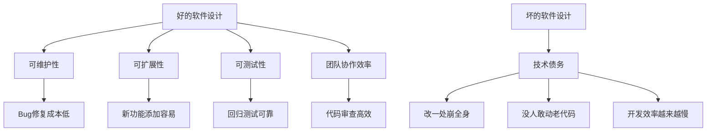
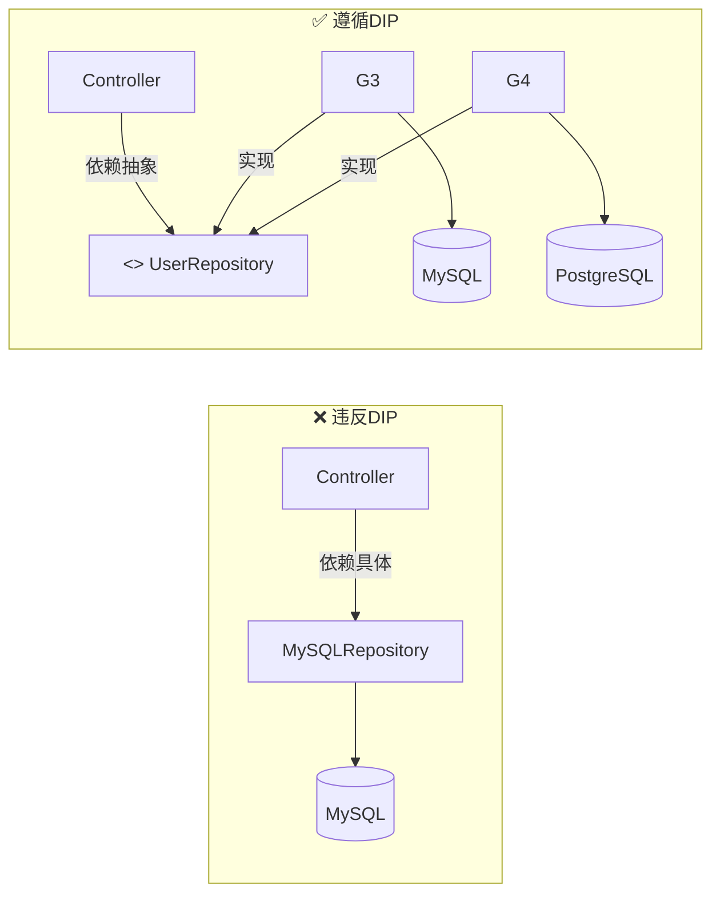
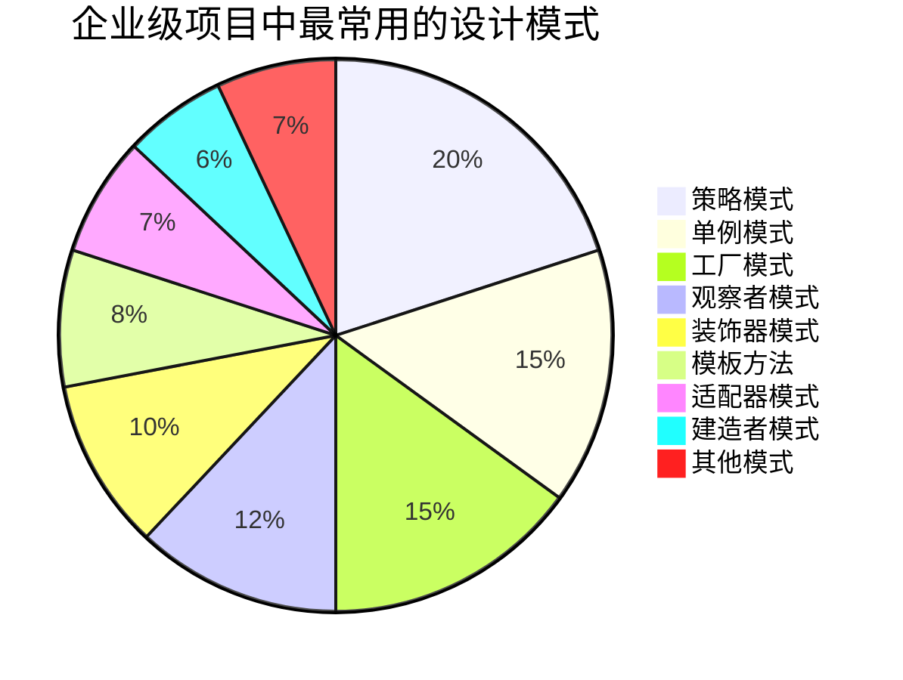
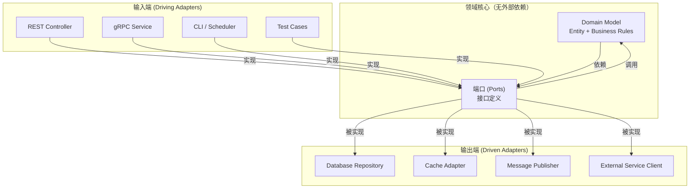

# 程序员练级攻略：软件设计-[2026重制版]

> **核心变更说明**：本文基于2018年版全面升级，新增SOLID原则的2026实践、设计模式的正确使用指南、架构模式（六边形/整洁/CQRS）、DDD领域驱动设计入门、API设计最佳实践（OpenAPI 3.1）、以及反模式和代码坏味道的识别与重构。


**软件设计能力是每个程序员都需要具备的基本素质**。这里描述了软件工程自发展以来的各种设计方法，这是从工程师通往架构师的必备技能。

## 🎯 为什么软件设计如此重要？



### 设计 vs 不设计的区别

| 维度 | 有设计 | 无设计 |
|------|--------|--------|
| **开发初期** | 稍慢（需要思考） | 快速（直接写） |
| **中期迭代** | 平稳 | 开始变慢 |
| **后期维护** | 高效 | **极其痛苦** |
| **新人上手** | 容易 | 困难 |
| **Bug率** | 低 | 高 |

## 📐 SOLID设计原则

### S - 单一职责原则 (Single Responsibility Principle)

> **一个类应该只有一个引起它变化的原因**

```java
// ❌ 违反SRP：User类承担了太多职责
public class User {
    private String name;
    private String email;

    public void saveToDatabase() { /* ... */ }
    public void sendEmail() { /* ... */ }
    public void generateReport() { /* ... */ }
    public void validateInput() { /* ... */ }
}

// ✅ 遵循SRP：每个类只有一个职责
public class User { // 只负责数据
    private final String name;
    private final String email;
    // getters...
}

public class UserRepository { // 只负责持久化
    public void save(User user) { /* ... */ }
}

public class EmailService { // 只负责邮件
    public void sendWelcomeEmail(User user) { /* ... */ }
}
```

### O - 开闭原则 (Open-Closed Principle)

> **对扩展开放，对修改关闭**

```java
// ❌ 违反OCP：每次新增折扣类型都要修改原类
public class DiscountCalculator {
    public double calculateDiscount(String type, double price) {
        switch (type) {
            case "STUDENT": return price * 0.8;
            case "SENIOR": return price * 0.85;
            case "VIP": return price * 0.7;
            default: return price;
        }
    }
}

// ✅ 遵循OCP：通过扩展而非修改
public interface DiscountStrategy {
    double calculate(double originalPrice);
}

record StudentDiscount() implements DiscountStrategy {
    public double calculate(double price) { return price * 0.8; }
}

record VipDiscount() implements DiscountStrategy {
    public double calculate(double price) { return price * 0.7; }
}

// 新增折扣类型只需实现接口，无需修改现有代码
class NewYearDiscount implements DiscountStrategy {
    public double calculate(double price) { return price * 0.65; }
}
```

### L - 里氏替换原则 (Liskov Substitution Principle)

> **子类型必须能够替换其基类型**

```java
// ❌ 违反LSP：正方形不能替换长方形
class Rectangle {
    protected int width, height;
    public void setWidth(int w) { this.width = w; }
    public void setHeight(int h) { this.height = h; }
    public int getArea() { return width * height; }
}

class Square extends Rectangle {
    @Override
    public void setWidth(int w) {
        super.setWidth(w);
        super.setHeight(w);  // 正方形宽高必须相等！
    }
    @Override
    public void setHeight(int h) {
        super.setHeight(h);
        super.setWidth(h);
    }
}

// 使用Rectangle的地方传入Square会出问题！
void test(Rectangle r) {
    r.setWidth(5);
    r.setHeight(10);  // 如果r是Square，宽度也被改成10了！
    assert r.getArea() == 50;  // 失败！实际面积100
}
```

### I - 接口隔离原则 (Interface Segregation Principle)

> **客户端不应该被迫依赖它不使用的方法**

```java
// ❌ 违反ISP：大而全的接口
interface Worker {
    void work();
    void eat();
    void code();
    void test();
    void manage();
}

// ✅ 遵循ISP：小而精的接口
interface Workable {
    void work();
}

interface Feedable {
    void eat();
}

interface Codeable {
    void code();
}

class Developer implements Workable, Feedable, Codeable {
    public void work() { /* ... */ }
    public void eat() { /* ... */ }
    public void code() { /* ... */ }
}

class Robot implements Workable, Codeable {
    public void work() { /* ... */ }
    public void code() { /* ... */ }
    // Robot不需要eat()
}
```

### D - 依赖倒置原则 (Dependency Inversion Principle)

> **依赖抽象，不依赖具体**



## 🏗️ 经典设计模式（GoF 23种）

### 创建型模式

| 模式 | 场景 | 2026应用示例 |
|------|------|-------------|
| **单例模式** | 全局唯一实例 | 数据库连接池、配置管理器 |
| **工厂方法** | 对象创建逻辑复杂 | Spring BeanFactory |
| **抽象工厂** | 产品族创建 | UI主题切换、数据库适配器 |
| **建造者模式** | 复杂对象构建 | HTTP请求构建器、SQL查询构建器 |
| **原型模式** | 对象克隆 | 深拷贝对象图 |

### 结构型模式

| 模式 | 场景 | 2026应用示例 |
|------|------|-------------|
| **适配器模式** | 接口兼容 | 日志框架适配、第三方SDK封装 |
| **装饰器模式** | 动态增强功能 | Java I/O流、Spring AOP代理 |
| **代理模式** | 控制对象访问 | MyBatis Mapper、RPC Stub |
| **外观模式** | 简化子系统 | API Gateway、Facade Service |
| **组合模式** | 树形结构 | DOM树、UI组件树、文件系统 |
| **享元模式** | 细粒度共享 | 字符串常量池、线程池 |

### 行为型模式

| 模式 | 场景 | 2026应用示例 |
|------|------|-------------|
| **策略模式** | 算法可替换 | 支付方式选择、排序策略 |
| **观察者模式** | 事件通知 | EventBus、消息队列消费者 |
| **模板方法** | 算法骨架固定 | AbstractTemplateClass |
| **命令模式** | 操作封装 | 事务操作、撤销重做 |
| **状态模式** | 状态机 | 订单状态流转、TCP连接状态 |
| **责任链模式** | 请求处理链 | Filter Chain、中间件管道 |
| **迭代器模式** | 集合遍历 | Java Collection Iterator |
| **备忘录模式** | 状态快照 | 撤销操作、游戏存档 |
| **中介者模式** | 解耦交互 | 聊天室、MVC Controller |
| **访问者模式** | 操作分离 | 编译器AST遍历、报表生成 |

### 重要提醒

> **不要迷失在23个设计模式中！** 你一定要明白两个原则：
> 1. **Program to an 'Interface', not an 'Implementation'**
> 2. **Favor 'object composition' over 'class inheritance'**

## 📊 设计模式使用频率（2026）



> 注：以上占比为示意数据，非统计实测，仅用于说明各类模式的使用频率差异。

## 🏛️ 架构模式（2026新增）

### 分层架构 (Layered Architecture)

```mermaid
graph TB
    subgraph Presentation["表示层"]
        P1[Controller / REST API]
        P2[DTO / Request/Response]
        P3[参数校验 / Validation]
    end

    subgraph Business["业务层"]
        B1[Service / Use Case]
        B2[Domain Logic]
        B3[Business Rules]
    end

    subgraph Persistence["持久化层"]
        D1[Repository Interface]
        D2[JPA / MyBatis Implementation]
        D3[Entity / ORM Mapping]
    end

    subgraph Infrastructure["基础设施层"]
        I1[Message Queue]
        I2[Cache (Redis)]
        I3[External API Client]
        I4[File Storage]
    end

    Presentation --> Business --> Persistence
    Business -.-> Infrastructure
    Persistence -.-> I2 & I3 & I4

```

### 六边形架构 / 端口适配器架构



### CQRS (Command Query Responsibility Segregation)

适用于**读写差异大**的系统：

```mermaid
flowchart LR
    subgraph WriteSide["写模型 (Command)"]
        W1[Command Handler] --> W2[Aggregate Root]
        W2 --> W3[Event Store]
    end

    subgraph ReadSide["读模型 (Query)"]
        R1[Event Projector] --> R2[Read Database<br/>(Denormalized)]
        R2 --> R3[Query Handler]
        R3 --> R4[API Response]
    end

    W3 -->|"事件发布"| R1

```

## 🔧 重构与代码坏味道

### 常见代码坏味道 (Code Smells)

| 坏味道 | 表现 | 解决方案 |
|--------|------|---------|
| **重复代码 (Duplicated Code)** | 相似代码出现在多处 | 提取方法/类 |
| **过长方法 (Long Method)** | 方法超过50行 | 提取方法 |
| **大类 (Large Class)** | 类超过500行 | 拆分职责 |
| **过长参数列表 (Long Parameter List)** | 参数超过5个 | 使用参数对象/Builder |
| **发散变化 (Divergent Change)** | 一个类因不同原因变化 | 拆分成多个类 |
| **霰弹修改 (Shotgun Surgery)** | 改一个功能要改很多类 | Move Method/Field |
| **特性依恋 (Feature Envy)** | 方法更关心其他类的数据 | Move Method |
| **数据泥团 (Data Clumps)** | 总是一起出现的数据字段 | 提取为类 |
| **基本类型偏执 (Primitive Obsession)** | 用基本类型表示领域概念 | 使用值对象 |
| **switch语句泛滥** | 大量switch/if-else | 多态/策略模式 |

### 重构技巧（部分）

| 技巧 | 说明 |
|------|------|
| **Extract Method** | 将一段代码提取为独立方法 |
| **Extract Class** | 将部分职责提取为新类 |
| **Move Method/Field** | 移动方法或字段到合适的类 |
| **Replace Conditional with Polymorphism** | 用多态替代条件语句 |
| **Introduce Parameter Object** | 将长参数列表合并为对象 |
| **Replace Magic Number with Symbolic Constant** | 用常量替代魔法数字 |
| **Decompose Conditional** | 复杂条件拆分为独立方法 |

## 📚 推荐资源

### 必读书籍

| 书名 | 作者 | 核心价值 |
|------|------|---------|
| **《设计模式：可复用面向对象软件的基础》** (GoF) | Gang of Four | 23种经典设计模式 |
| **《Head First设计模式》** | Eric Freeman | 图文并茂易理解 |
| **《重构：改善既有代码的设计》** | Martin Fowler | 系统化重构方法论 |
| **《敏捷软件开发：原则、模式与实践》** | Robert C. Martin | SOLID原则详解 |
| **《企业应用架构模式》** | Martin Fowler | 企业级架构模式 |
| **《实现领域驱动设计》** | Vaughn Vernon | DDD实战指导 |
| **《整洁架构》** | Robert C. Martin | 架构设计原则 |

### 在线资源

| 资源 | 网址 | 特点 |
|------|------|------|
| **Refactoring Guru** | https://refactoring.guru/design-patterns | 图解设计模式，非常直观 |
| **Source Making** | https://sourcemaking.com/ | 模式和原则全面 |
| **Design Patterns Library** | https://www.dofactory.com/net/design-patterns | 示例代码丰富 |

---

**下一篇文章**我们将进入**高手成长篇**的第一章：**Linux系统、内存和网络**——深入系统底层的知识。
