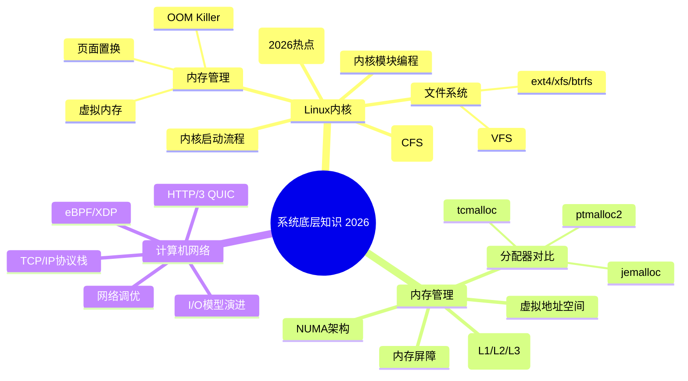
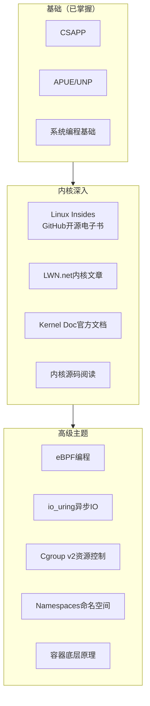
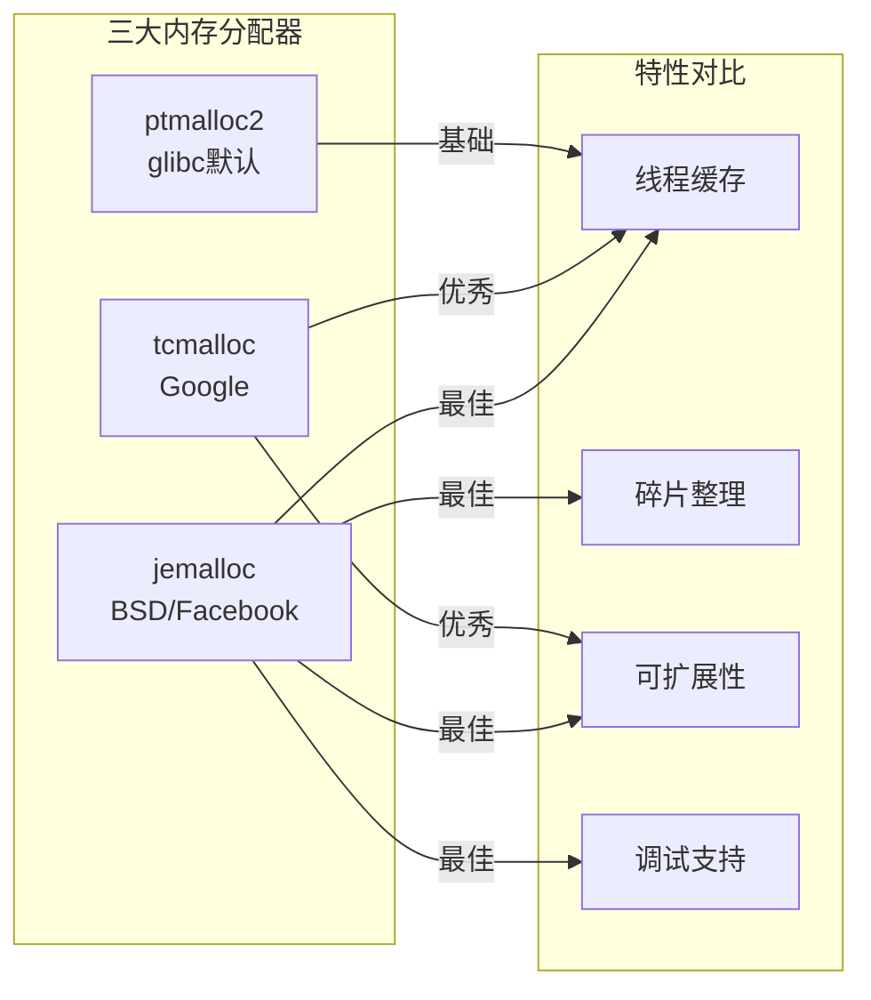
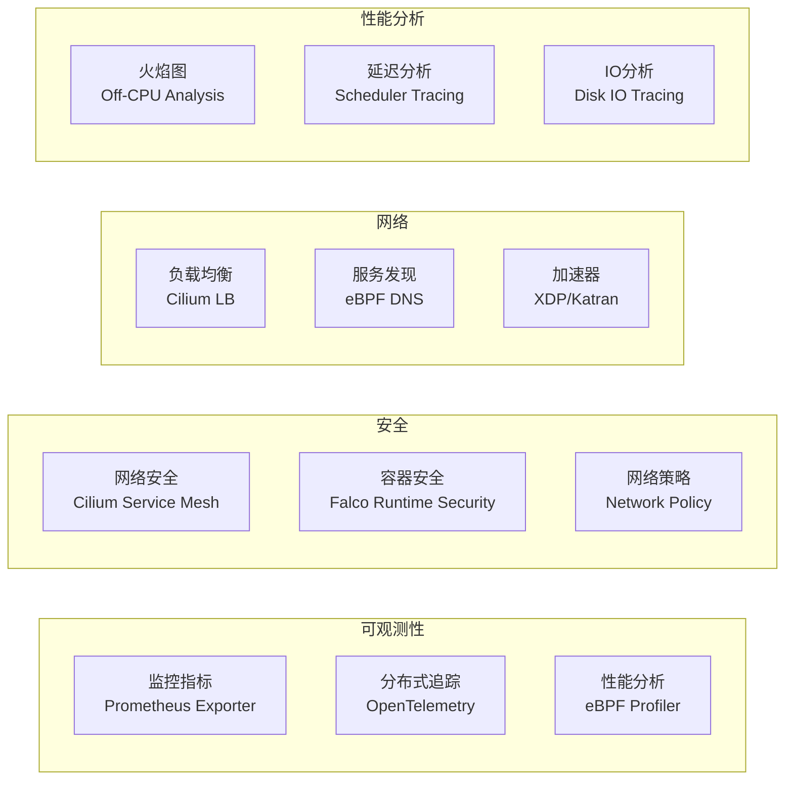
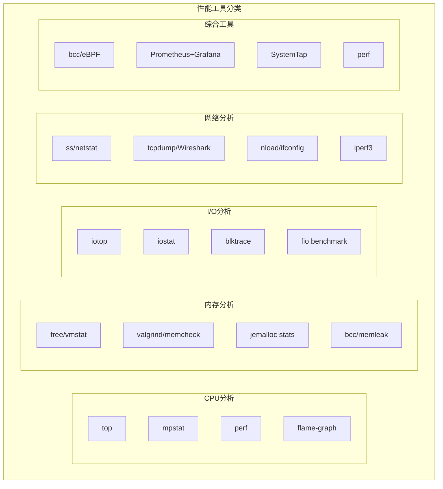

# 程序员练级攻略：Linux系统、内存和网络-[2026重制版]

> **核心变更说明**：本文基于2018年版全面升级，新增Linux内核6.x新特性、io_uring深度实践、eBPF编程入门、内存分配器对比（jemalloc/tcmalloc/ptmalloc）、Cgroup与容器资源隔离、TCP BBR拥塞控制、HTTP/3 (QUIC)协议、网络性能调优实战等2026年系统底层核心内容。


本文章是**高手成长篇**的开篇，内容包括系统底层、数据库、分布式架构、微服务、容器化、AI/ML、前端等多个方向。

**系统底层要是深下去是可以完全不见底的**。学好这些东西，你会对系统有很深的理解，而且可以把这些知识反哺到架构设计上来。

## 🎯 学习路线总览



## 🐧 Linux内核深入学习

### 推荐学习路径



### 核心资源清单

| 资源 | 类型 | 网址 | 特点 |
|------|------|------|------|
| **Linux Insides** | 电子书 | https://github.com/0xAX/linux-insides | **强烈推荐！** 图解内核启动 |
| **LWN Kernel Page** | 文章集 | https://lwn.net/Kernel/ | 内核开发者必读 |
| **Kernel Documentation** | 官方文档 | https://www.kernel.org/doc/ | 权威参考 |
| **Red Hat RHEL Docs** | 企业文档 | https://access.redhat.com/documentation/ | 生产级指南 |
| **Brendan Gregg's Perf** | 性能工具 | http://www.brendangregg.com/linuxperf.html | 性能优化圣经 |
| **Dropbox Tech Blog** | 工程实践 | Dropbox博客 | 底层调优经验 |

## 💾 内存管理深度解析

### "What Every Programmer Should Know About Memory" 系列

这是LWN.net上的经典系列文章，**必须阅读**：

| 部分 | 主题 | 核心内容 |
|------|------|---------|
| Part 1 | Introduction | 内存层次结构概览 |
| Part 2 | CPU Caches | L1/L2/L3缓存原理 |
| Part 3 | Virtual Memory | 虚拟内存、页表、TLB |
| Part 4 | NUMA Systems | 非统一内存访问 |
| Part 5 | Cache Optimization | 缓存友好的代码 |
| Part 6 | Multi-threaded | 多线程内存优化 |
| Part 7 | Performance Tools | perf, valgrind等工具 |
| Part 8 | Future Technologies | 新技术展望 |

### 内存分配器对比（2026版）



| 特性 | ptmalloc2 | tcmalloc (Google) | jemalloc (Facebook) |
|------|-----------|-------------------|---------------------|
| **来源** | glibc默认 | gperftools | FreeBSD/Facebook |
| **线程缓存** | 有（基本） | **优秀** (Thread-Caching) | **最佳** (per-CPU arena) |
| **碎片处理** | 一般 | 较好 | **最佳** (binning) |
| **高并发性能** | 一般 | 好（视负载而定） | **最好**（视负载而定） |
| **谁在用** | 大多数Linux程序 | TensorFlow, Envoy | **Redis, Firefox, Rust, MariaDB** |
| **2026推荐** | 兼容性优先 | 性能敏感场景 | **首选！** |

### 内存屏障（Memory Barrier）

**关键论文**：
- [Memory Barriers: a Hardware View for Software Hackers](http://irl.cs.ucla.edu/~yingdi/web/paperreading/whymb.2010.06.07c.pdf)

```c
// 内存屏障示例：生产者-消费者模型
#include <stdatomic.h>
#include <pthread.h>

atomic_int data_ready = 0;
int shared_data = 0;

void* producer(void* arg) {
    // 1. 准备数据
    shared_data = 42;

    // 2. 内存屏障：确保shared_data的写入对所有线程可见
    atomic_store_explicit(&data_ready, 1, memory_order_release);

    return NULL;
}

void* consumer(void* arg) {
    // 1. 等待数据就绪（带获取语义）
    while (!atomic_load_explicit(&data_ready, memory_order_acquire)) {
        // busy wait 或 sched_yield()
    }

    // 2. 此时shared_data一定可见且正确
    printf("Data: %d\n", shared_data);  // 一定是42

    return NULL;
}
```

## 🌐 计算机网络深度

### TCP/IP 协议栈完整图解

```mermaid
flowchart TB
    subgraph Application["应用层"]
        App[HTTP/HTTPS<br/>DNS/SSH/gRPC]
    end

    subgraph Transport["传输层"]
        TCP[TCP: 可靠传输<br/>三次握手/四次挥手<br/>流量控制/拥塞控制]
        UDP[UDP: 不可靠但快速<br/>DNS/DHCP/实时音视频]
        QUIC[QUIC (HTTP/3):<br/>基于UDP的多路复用<br/>0-RTT连接]
    end

    subgraph Network["网络层"]
        IP[IP: 路由转发<br/>ICMP: ping/traceroute]
        IPv6[IPv6: 128位地址<br/>IPSec安全]
    end

    subgraph Link["链路层"]
        Eth[Ethernet: MAC地址<br/>ARP: IP->MAC]
        Wifi[Wi-Fi 6/7<br/>WPA3加密]
    end

    App --> TCP & UDP & QUIC
    TCP & UDP & QUIC --> IP & IPv6
    IP & IPv6 --> Eth & Wifi
```

### 必读RFC文档（精选）

#### TCP相关核心RFC

| RFC | 标题 | 核心内容 |
|-----|------|---------|
| RFC 793 | Transmission Control Protocol | TCP原始定义（现由RFC 9293整合更新） |
| RFC 2581 | TCP Congestion Control | 慢启动/拥塞避免/快重传/快恢复（现由RFC 5681取代） |
| RFC 2018 | TCP Selective Acknowledgment | SACK选择性确认 |
| RFC 6298 | Computing TCP's Retransmission Timer | Karn/Partridge算法 |
| RFC 7414 | A Survey of Transport Layer Protocols | TCP全景 |

#### HTTP相关核心RFC

| RFC | 标题 | 版本 |
|-----|------|------|
| RFC 7230-7235 | HTTP/1.1 (6个部分) | HTTP/1.1旧标准（已被RFC 9110/9112取代） |
| RFC 7540 | HTTP/2 | HTTP/2定义（已被RFC 9113取代） |
| RFC 7541 | HPACK Header Compression | HTTP/2头部压缩 |
| RFC 9110-9114 | HTTP Semantics / Caching / HTTP/1.1 / HTTP/2 / HTTP/3 | 当前HTTP核心标准族 |
| RFC 8441 | HTTP/2 Extended CONNECT (WebSocket over HTTP/2) | HTTP/2扩展 |
| RFC 7838 | HTTP Alternative Services | Alt-Svc |
| **RFC 9000** | **QUIC: A UDP-Based Multiplexed and Secure Transport** | **HTTP/3传输层** |
| **RFC 9114** | **HTTP/3** | **HTTP over QUIC** |

### HTTP/3 (QUIC) - 2026年必须了解

**为什么需要HTTP/3？**

| 问题 | HTTP/2 | HTTP/3 (QUIC) |
|------|--------|--------------|
| 队头阻塞 (HoL) | **存在**（TCP层面） | **解决**（独立流） |
| 连接建立 | 1-RTT (TLS) + 1-RTT (TCP) | **0-RTT** (连接恢复时) |
| 协议升级 | 需要ALPN协商 | 独立端口 (UDP 443) |
| 迁移网络 | 慢（需重新握手） | **快** (Connection ID) |

### Linux网络栈调优（实战）

```bash
# /etc/sysctl.conf 关键参数

# === TCP缓冲区调整 ===
net.core.rmem_max = 16777216
net.core.wmem_max = 16777216
net.ipv4.tcp_rmem = 4096 87380 16777216
net.ipv4.tcp_wmem = 4096 65536 16777216

# === TCP连接优化 ===
net.ipv4.tcp_fin_timeout = 15
net.ipv4.tcp_keepalive_time = 300
net.ipv4.tcp_keepalive_intvl = 30
net.ipv4.tcp_keepalive_probes = 5
net.ipv4.tcp_max_syn_backlog = 8192
net.ipv4.tcp_tw_reuse = 1

# === TCP拥塞控制 ===
# 可选: cubic (默认), bbr, htcp, vegas
net.ipv4.tcp_congestion_control = bbr   # Google BBR算法

# === 队列长度 ===
net.core.somaxconn = 65535
net.core.netdev_max_backlog = 5000

# === 文件描述符 ===
fs.file-max = 1048576
net.ipv4.ip_local_port_range = 1024 65535
```

## 🔥 eBPF - 2026年最热的内核技术

### 什么是eBPF？

**eBPF (extended Berkeley Packet Filter)** 是Linux内核的革命性技术：

- **无需修改内核代码**即可扩展内核功能
- **事件驱动**：在特定事件发生时执行自定义程序
- **JIT编译**：加载后编译为本地机器码，**接近原生性能**
- **安全性**：验证器确保程序不会崩溃或挂起内核

### eBPF应用场景



### eBPF Hello World示例

```c
// hello_ebp.c - 一个简单的eBPF程序：跟踪进程exec
// （以libbpf/BCC风格宏的伪代码示意，实际API因工具链版本而异）
#include <linux/bpf.h>
#include <bpf/bpf_helpers.h>

struct event_t {
    u32 pid;
    char comm[TASK_COMM_LEN];
};

// 定义BPF映射表，用户态读取
BPF_MAP_DEF(events_map, PERCPU_ARRAY, u64, struct event_t, 256);

SEC("tracepoint/syscalls/sys_enter_execve")
int trace_exec(void *ctx)
{
    struct event_t event = {};
    u64 id = bpf_get_current_pid_tgid();
    event.pid = id >> 32;  // 高32位是PID
    bpf_get_current_comm(&event.comm, sizeof(event.comm));

    // 写入映射表
    u64 index = bpf_get_smp_processor_id();
    bpf_map_update_elem(&events_map, &index, &event, BPF_ANY);

    return 0;
}

char LICENSE[] SEC("license") = "GPL";
```

## 📊 性能分析与工具

### Linux性能工具图谱



### 推荐的性能调优书籍

| 书名 | 作者 | 特点 |
|------|------|------|
| **《Linux Performance and Tuning Guidelines》** | IBM Redbook | 经典全面 |
| **《Systems Performance: Enterprise and the Cloud》** | Brendan Gregg | **必读！** 云时代系统性能 |
| **《Understanding the Linux Kernel》** | Daniel P. Bovet | 内核实现细节 |
| **《BPF Performance Tools》** | Brendan Gregg | eBPF性能工具新书 |

## ✅ 实践项目建议

完成本阶段学习后，建议尝试以下实践：

1. **用eBPF编写一个简单的监控系统**
2. **实现一个基于epoll的高并发Echo服务器**
3. **用io_uring重写上面的服务器并对比性能**
4. **用Wireshark分析一次完整的HTTP/3握手过程**
5. **用perf生成一次函数调用火焰图**

---

**下一篇文章**我们将探讨**异步I/O模型和Lock-Free编程**——高并发系统的核心技术。
