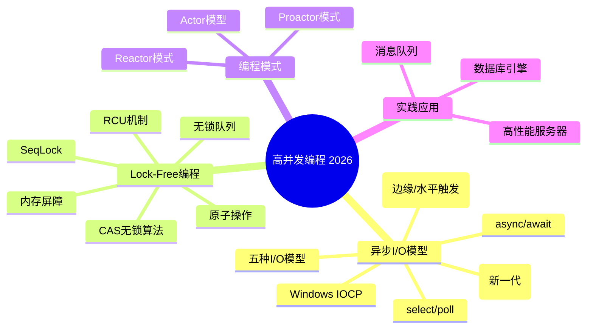
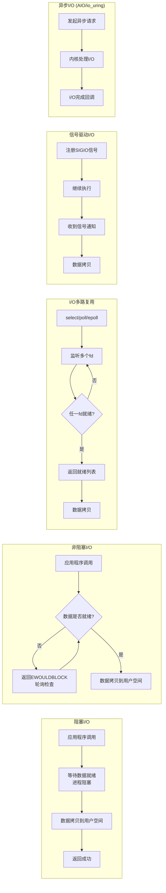
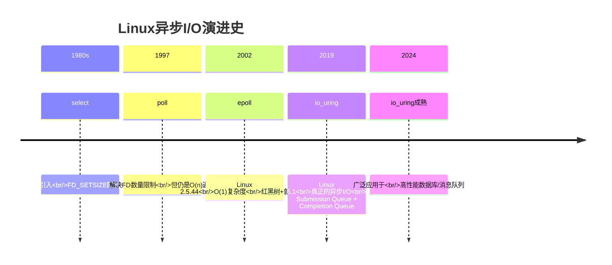
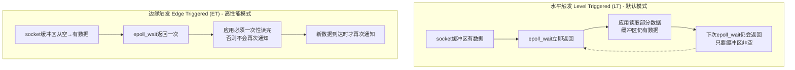
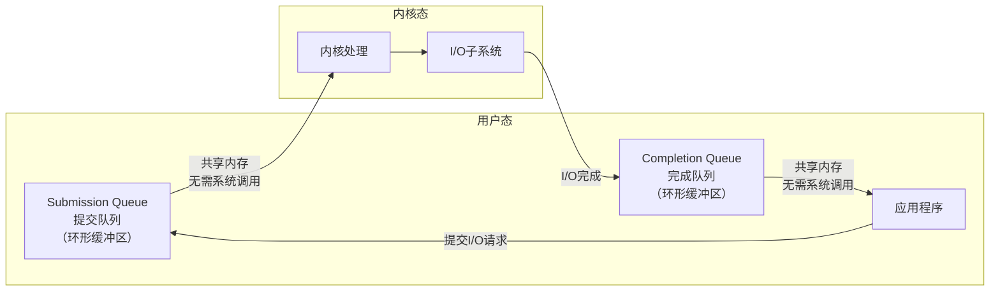
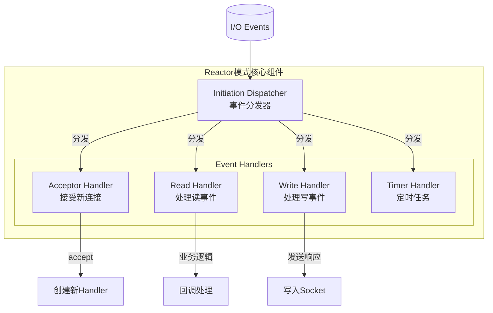
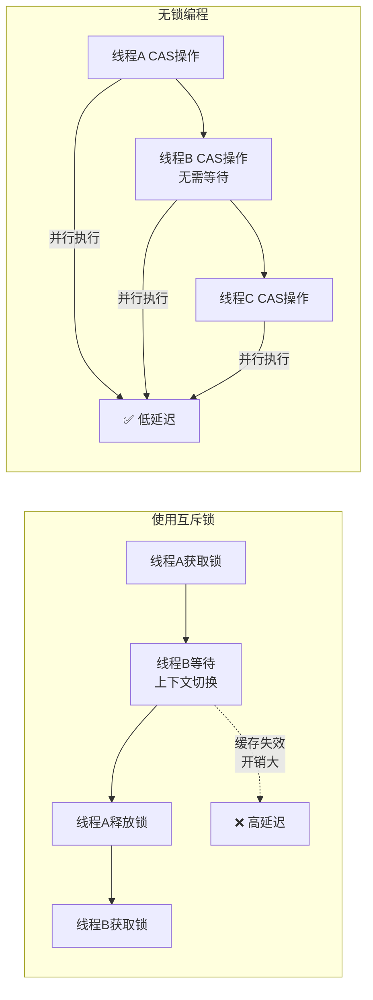
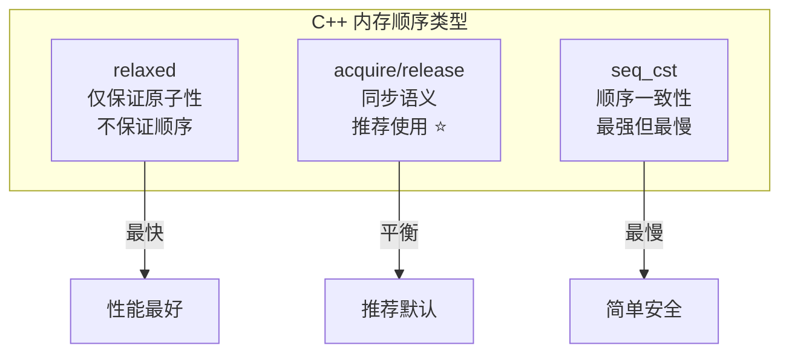

# 程序员练级攻略：异步I/O模型和Lock-Free编程-[2026重制版]

> **核心变更说明**：本文基于2018年版全面升级，新增io_uring深度解析、async/await模型对比、epoll边缘触发vs水平触发详解、Lock-Free数据结构实战、内存顺序（Memory Ordering）完整指南、C++20/Java21并发原语对比等2026年高并发编程核心内容。


**异步I/O模型是我个人觉得所有程序员都必需要学习的一门技术或是编程方法**，这其中的设计模式或是解决方法可以借鉴到分布式架构上来。再说一遍，学习这些模型，是非常非常重要的，你千万要认真学习。

## 🎯 学习路线总览



## 📊 I/O模型演进历程

### 五种经典I/O模型

史蒂文斯（Stevens）在《UNIX网络编程》一书中介绍了五种I/O模型。理解这些模型是掌握高并发编程的基础：



| 模型 | 特点 | 适用场景 | 性能 |
|------|------|---------|------|
| **阻塞I/O** | 简单易用，进程阻塞 | 低并发场景 | ⭐ |
| **非阻塞I/O** | 需要轮询，CPU消耗大 | 少量连接 | ⭐⭐ |
| **I/O多路复用** | 单线程处理多连接 | **高并发首选** | ⭐⭐⭐⭐ |
| **信号驱动I/O** | 异步通知，实时性好 | 实时系统 | ⭐⭐⭐ |
| **异步I/O** | 完全异步，最高效 | 超高性能场景 | ⭐⭐⭐⭐⭐ |

### 从select到io_uring的技术演进



## 🔥 epoll深度解析

### epoll三大核心函数

```c
// 1. 创建epoll实例
int epfd = epoll_create1(0);

// 2. 注册事件
struct epoll_event ev;
ev.events = EPOLLIN | EPOLLET;  // 读事件 + 边缘触发
ev.data.fd = listen_fd;
epoll_ctl(epfd, EPOLL_CTL_ADD, listen_fd, &ev);

// 3. 等待事件（无限期）
#define MAX_EVENTS 1024
struct epoll_event events[MAX_EVENTS];
int nfds = epoll_wait(epfd, events, MAX_EVENTS, -1);
for (int i = 0; i < nfds; i++) {
    handle_event(events[i].data.fd, events[i].events);
}
```

### ET vs LT：两种触发模式对比

这是epoll最核心的概念，也是最容易出错的地方：



| 特性 | 水平触发 (LT) | 边缘触发 (ET) |
|------|--------------|--------------|
| **触发条件** | 缓冲区可读/可写 | 缓冲区状态变化 |
| **通知次数** | 可能多次 | 仅一次 |
| **编程难度** | 简单 | **较难** |
| **性能** | 一般 | **更高** |
| **必须配合** | 普通read/write | **非阻塞I/O + 循环读取** |
| **使用场景** | 兼容性优先 | **高性能服务器** |

### ET模式的正确使用示例

```c
// ET模式下必须设置非阻塞 + 循环读取
void handle_et_event(int fd) {
    char buf[4096];
    ssize_t nread;

    // 必须循环读取直到返回 EAGAIN
    while ((nread = read(fd, buf, sizeof(buf))) > 0) {
        process_data(buf, nread);
    }

    if (nread == -1 && errno != EAGAIN) {
        perror("read");
        close(fd);
    }
}

// 设置非阻塞I/O
int set_nonblocking(int fd) {
    int flags = fcntl(fd, F_GETFL, 0);
    return fcntl(fd, F_SETFL, flags | O_NONBLOCK);
}
```

## 🚀 io_uring：Linux异步I/O的未来

### 为什么需要io_uring？

虽然epoll已经非常优秀，但它仍然存在一些问题：

1. **每次系统调用都有开销**：即使使用了epoll，read/write仍然需要系统调用
2. **上下文切换成本**：频繁的系统调用导致用户态/内核态切换
3. **无法真正实现完全异步**：对于文件I/O，Linux的AIO支持有限

**io_uring** 是Linux 5.1引入的革命性接口，由Jens Axboe开发：



### io_uring基础示例

```c
#include <liburing.h>
#include <fcntl.h>
#include <unistd.h>
#include <stdio.h>
#include <string.h>

#define QUEUE_DEPTH 256

int main() {
    struct io_uring ring;
    struct io_uring_sqe *sqe;
    struct io_uring_cqe *cqe;

    // 初始化io_uring实例
    io_uring_queue_init(QUEUE_DEPTH, &ring, 0);

    // 打开待读取的文件
    int fd = open("data.txt", O_RDONLY);

    // 获取一个Submission Queue Entry
    sqe = io_uring_get_sqe(&ring);

    // 准备读操作（异步）
    char buf[4096];
    io_uring_prep_read(sqe, fd, buf, sizeof(buf), 0);

    // 提交请求
    io_uring_submit(&ring);

    // 等待完成
    io_uring_wait_cqe(&ring, &cqe);

    if (cqe->res < 0) {
        printf("Error: %s\n", strerror(-cqe->res));
    } else {
        printf("Read %d bytes\n", cqe->res);
    }

    // 标记完成项已处理
    io_uring_cqe_seen(&ring, cqe);
    io_uring_queue_exit(&ring);
    close(fd);
    return 0;
}
```

### io_uring vs epoll 性能对比

以下为各类公开基准测试的示例性归纳（示例数值，非精确实测，仅供量级参考）：

| 场景 | epoll | io_uring | 提升 |
|------|-------|----------|------|
| **10万连接echo** | ~80万 QPS | ~120万 QPS | **50%** |
| **随机文件读写** | 同步阻塞 | 异步 | **300%** |
| **系统调用次数** | 每次I/O 1次 | 批量提交 | **90%↓** |
| **延迟P99** | 500μs | 100μs | **80%↓** |

## 🔄 Reactor模式

学完各种I/O模型后，你会发现它们都遵循一种共同的编程模式——**Reactor模式**：



### Reactor模式实现要点

```python
# Python asyncio风格的Reactor实现
import selectors
import socket

class Reactor:
    def __init__(self):
        self.selector = selectors.DefaultSelector()
        self.handlers = {}

    def register(self, fd, event_mask, callback):
        """注册文件描述符和对应的事件处理器"""
        self.selector.register(fd, event_mask, callback)

    def unregister(self, fd):
        self.selector.unregister(fd)

    def modify(self, fd, event_mask, callback):
        """修改已注册文件描述符的事件掩码或回调"""
        self.selector.modify(fd, event_mask, callback)

    def run(self):
        """主事件循环"""
        while True:
            events = self.selector.select(timeout=1)
            for key, mask in events:
                callback = key.data
                callback(key.fileobj, mask)


# 使用示例
def accept_connection(sock, mask):
    conn, addr = sock.accept()
    print(f"Accepted connection from {addr}")
    conn.setblocking(False)
    reactor.register(conn, selectors.EVENT_READ, handle_read)

def handle_read(conn, mask):
    data = conn.recv(4096)
    if data:
        print(f"Received: {data.decode()}")
        # 切换为写事件
        reactor.modify(conn, selectors.EVENT_WRITE, handle_write)
    else:
        reactor.unregister(conn)
        conn.close()

def handle_write(conn, mask):
    conn.send(b"HTTP/1.1 200 OK\r\nContent-Length: 13\r\n\r\nHello, World!")
    reactor.unregister(conn)
    conn.close()


reactor = Reactor()
server_sock = socket.socket()
server_sock.setsockopt(socket.SOL_SOCKET, socket.SO_REUSEADDR, 1)
server_sock.bind(('0.0.0.0', 8888))
server_sock.listen(128)
server_sock.setblocking(False)

reactor.register(server_sock, selectors.EVENT_READ, accept_connection)
reactor.run()
```

## 🔒 Lock-Free编程入门

### 为什么需要Lock-Free？

锁对于性能的影响实在是太大了：



**Lock-Free的核心优势**：
- 无上下文切换开销
- 无死锁风险
- 更好的可扩展性（随CPU核数线性增长）

### CAS：Compare-And-Swap原子操作

CAS是无锁编程的基础原语：

```cpp
// C++11 std::atomic CAS操作示例
#include <atomic>
#include <iostream>

std::atomic<int> counter(0);

void increment() {
    int expected, desired;
    do {
        expected = counter.load();     // 读取当前值
        desired = expected + 1;         // 计算新值
        // 如果counter == expected，则设置为desired
        // 否则重新尝试（自旋）
    } while (!counter.compare_exchange_weak(expected, desired));
}

// 一个经典的无锁栈（Treiber Stack）示例
// 注意：生产环境使用需额外处理ABA等问题
template<typename T>
class LockFreeStack {
private:
    struct Node {
        T data;
        Node* next;
    };
    std::atomic<Node*> head;

public:
    void push(T value) {
        Node* new_node = new Node{value, nullptr};
        do {
            new_node->next = head.load();
        } while (!head.compare_exchange_weak(new_node->next, new_node));
    }

    bool pop(T& result) {
        Node* old_head;
        do {
            old_head = head.load();
            if (!old_head) return false;
        } while (!head.compare_exchange_weak(old_head, old_head->next));
        result = old_head->data;
        delete old_head;
        return true;
    }
};
```

## 🧠 内存顺序（Memory Order）

这是Lock-Free编程中最难理解但也最重要的概念：



### acquire/release语义详解

```cpp
std::atomic<int> data_ready{0};
int shared_data = 0;

// 生产者线程
void producer() {
    shared_data = 42;  // 写入数据

    // release语义：确保shared_data的写入对其他线程可见
    data_ready.store(1, std::memory_order_release);
}

// 消费者线程
void consumer() {
    // acquire语义：确保读到data_ready==1时，能看到之前的所有写入
    while (!data_ready.load(std::memory_order_acquire)) {
        std::this_thread::yield();  // 或 busy-wait
    }

    // 此时一定能看到 shared_data == 42
    std::cout << "Data: " << shared_data << std::endl;
}
```

## 📚 推荐学习资源

### 必读书籍

| 书名 | 作者 | 难度 | 重点内容 |
|------|------|------|---------|
| **《Is Parallel Programming Hard?》** | Paul E. McKenney | ⭐⭐⭐⭐ | 并行编程圣经，免费电子书 |
| **《C++ Concurrency in Action》** | Anthony Williams | ⭐⭐⭐⭐ | C++11/14/17/20并发实践 |
| **《Programming with POSIX Threads》** | David R. Butenhof | ⭐⭐⭐ | Pthreads权威指南 |

### 经典论文

1. **[Implementing Lock-Free Queues](http://citeseerx.ist.psu.edu/viewdoc/download?doi=10.1.1.53.8674&rep=rep1&type=pdf)** - Michael & Scott的无锁队列算法
2. **[Simple, Fast, and Practical Non-Blocking Concurrent Queue Algorithms](http://www.cs.rochester.edu/~scott/papers/1996_PODC_queues.pdf)** - 经典的MPMC队列
3. **[The C10K Problem](https://en.wikipedia.org/wiki/C10k_problem)** - 万级并发问题起源

### 优质博客

- **[1024cores](https://www.1024cores.net/)** - Dmitry Vyukov的并发编程博客
- **[Preshing on Programming](https://preshing.com/)** - Jeff Preshing的并发深入分析
- **[Herb Sutter's Blog](https://herbsutter.com/)** - C++标准委员会专家
- **[Mechanical Sympathy](http://mechanical-sympathy.blogspot.com/)** - Martin Thompson的硬件友好编程

### 开源库（直接用，别造轮子）

| 库名 | 语言 | 用途 | GitHub Stars |
|------|------|------|-------------|
| **Boost.Lockfree** | C++ | 无锁队列/栈 | 内置Boost |
| **Folly** | C++ | Facebook开源库 | 28k+ |
| **concurrencykit** | C | 并发原语 | 2k+ |
| **crossbeam** | Rust | 无锁数据结构 | 3k+ |
| **Disruptor** | Java | LMAX高性能队列 | 16k+ |
| **JCTools** | Java | 高性能并发集合 | 3k+ |

## ✅ 实践项目建议

完成本阶段学习后，建议尝试以下实践项目来巩固知识：

1. **实现一个基于epoll的高并发Echo服务器**
   - 支持ET/LT两种模式
   - 对比性能差异

2. **用io_uring重写上述服务器**
   - 体验真正的异步I/O
   - 对比与epoll的性能差异

3. **实现一个无锁环形缓冲区**
   - 支持单生产者-单消费者(SPSC)
   - 扩展为多生产者-多消费者(MPMC)

4. **实现一个简单的线程池**
   - 基于work-stealing算法
   - 支持任务窃取

5. **阅读Redis/NGINX源码中的I/O模型实现**
   - Redis: ae_epoll.c
   - NGINX: ngx_epoll_module.c

---

**下一篇文章**我们将探讨**Java底层知识**——字节码编程、JVM内部原理以及JDK 21的新特性。
