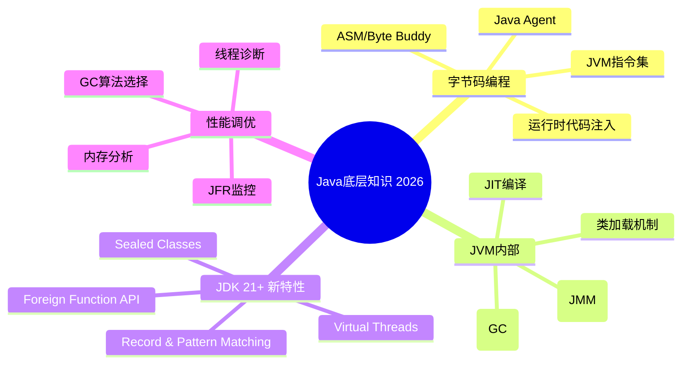
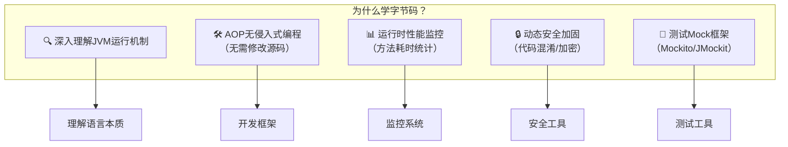
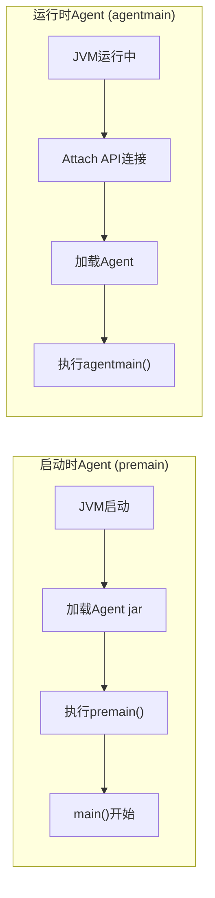
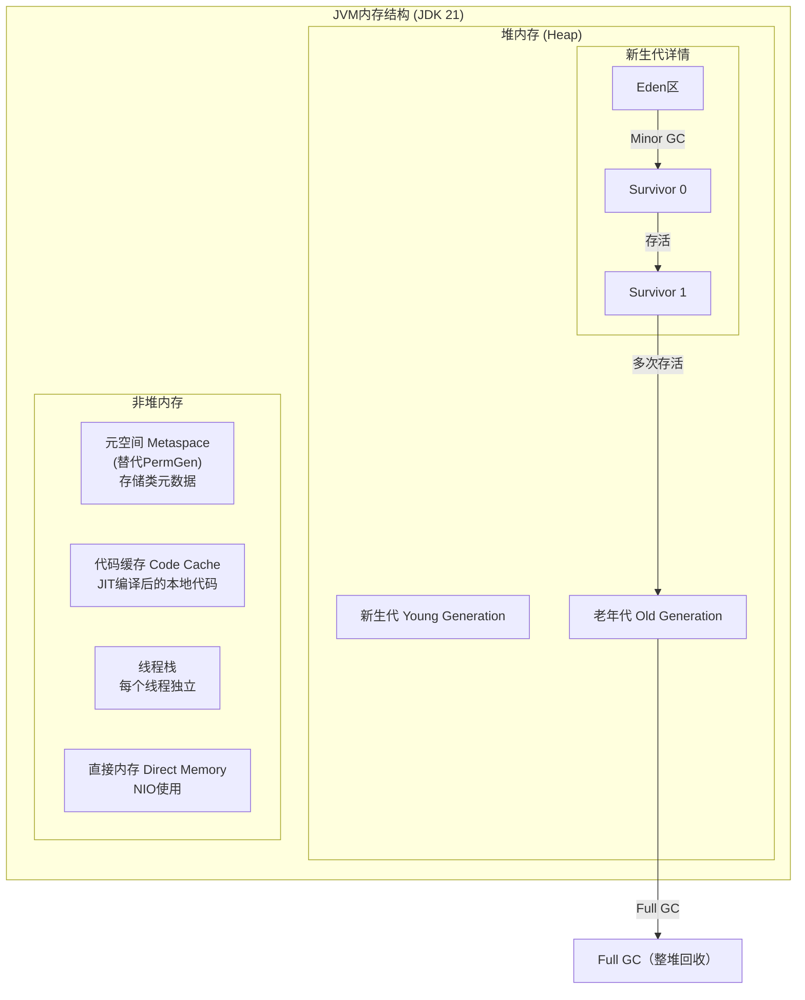
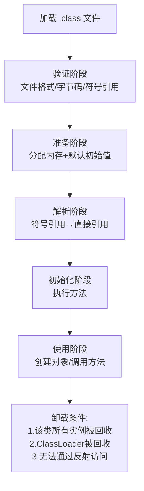
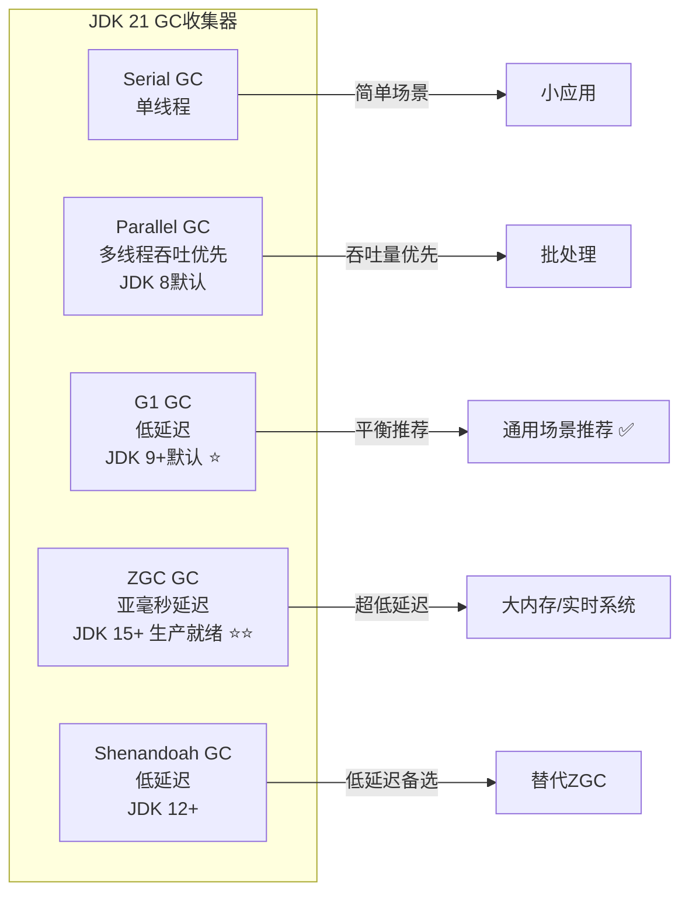

# 程序员练级攻略：Java底层知识-[2026重制版]

> **核心变更说明**：本文基于2018年版全面升级，新增JDK 21 LTS新特性（Virtual Threads、Record、Pattern Matching、Sealed Classes）、字节码编程进阶（Byte Buddy/JiteScript）、JVM调优实战（ZGC/G1对比）、Java Agent深度实践、JFR生产级监控等2026年Java核心技术内容。


前两篇文章分享的是系统底层方面的内容，今天我们进入高手成长篇的第二部分——**Java底层知识**。

**Java最黑科技的玩法就是字节码编程**，也就是动态修改或是动态生成Java字节码。Java的字节码相当于汇编，学习其中的细节很有意思。使用字节码编程可以玩出很多高级玩法，最高级的还是在Java程序运行时进行字节码修改和代码注入。

## 🎯 Java底层知识体系



## 🔧 字节码编程

### 为什么需要了解字节码？



### Java字节码基础

每个.class文件都包含：

| 区域 | 内容 | 说明 |
|------|------|------|
| **Magic Number** | `0xCAFEBABE` | 标识Class文件 |
| **Version** | Major/Minor version | JDK版本 |
| **Constant Pool** | 常量池 | 字符串、类名、方法名等 |
| **Access Flags** | 访问标志 | public/final/interface等 |
| **This Class** | 当前类 | 全限定名 |
| **Super Class** | 父类 | 除Object外都有 |
| **Interfaces** | 接口列表 | 实现的接口 |
| **Fields** | 字段表 | 成员变量 |
| **Methods** | 方法表 | 方法信息+字节码 |
| **Attributes** | 属性表 | Code/LineNumberTable等 |

### 字节码指令示例

```java
// 源代码
public class HelloWorld {
    public static int add(int a, int b) {
        return a + b;
    }
}
```

对应的字节码：
```
public static int add(int, int);
  Code:
   stack=2, locals=2, args_size=2
    0: iload_0       // 将第一个int参数压栈
    1: iload_1       // 将第二个int参数压栈
    2: iadd          // 栈顶两个int相加
    3: ireturn       // 返回int结果
```

### Byte Buddy：现代字节码操作库

**Byte Buddy** 是目前最强大的字节码操作库，2015年获Oracle Duke's Choice大奖：

```java
import net.bytebuddy.ByteBuddy;
import net.bytebuddy.dynamic.DynamicType;
import net.bytebuddy.implementation.MethodDelegation;
import net.bytebuddy.matcher.ElementMatchers;

// 示例1：动态创建类
DynamicType.Unloaded<?> dynamicType = new ByteBuddy()
    .subclass(Object.class)
    .name("com.example.HelloWorld")
    .defineMethod("sayHello")
    .returns(String.class)
    .annotateMethod(AnnotationDescription.Builder.ofType(Deprecated.class).build())
    .intercept(MethodDelegation.to(HelloWorld.class))
    .make();

// 示例2：方法拦截（AOP）
class TimingInterceptor {
    @RuntimeType
    public static Object intercept(@Origin Method method,
                                   @SuperCall Callable<?> callable) throws Exception {
        long start = System.nanoTime();
        try {
            return callable.call();  // 调用原方法
        } finally {
            long duration = System.nanoTime() - start;
            System.out.printf("%s took %d ns%n", method.getName(), duration);
        }
    }
}

// 应用拦截器
new ByteBuddy()
    .subclass(TargetClass.class)
    .method(ElementMatchers.named("importantMethod"))
    .intercept(MethodDelegation.to(TimingInterceptor.class))
    .make()
    .load(ClassLoader.getSystemClassLoader())
    .getLoaded();
```

## 🤖 Java Agent技术

### 什么是Java Agent？

Java Agent是一种特殊的Java程序，可以在JVM启动时或运行时**动态修改类的字节码**：



### 编写一个简单的Java Agent

```java
import java.lang.instrument.ClassFileTransformer;
import java.lang.instrument.Instrumentation;
import java.security.ProtectionDomain;

public class MyAgent {

    // 启动时执行（-javaagent选项）
    public static void premain(String agentArgs, Instrumentation inst) {
        System.out.println("[Agent] JVM starting with args: " + agentArgs);

        // 注册类文件转换器
        inst.addTransformer(new MyClassTransformer());
    }

    // 运行时附加执行
    public static void agentmain(String agentArgs, Instrumentation inst) {
        System.out.println("[Agent] Attached to running JVM");
        inst.addTransformer(new MyClassTransformer());

        // 重定义已加载的类
        inst.retransformClasses(MyTargetClass.class);
    }
}

// 类转换器：在类加载时修改字节码
class MyClassTransformer implements ClassFileTransformer {
    @Override
    public byte[] transform(ClassLoader loader, String className,
                           Class<?> classBeingRedefined,
                           ProtectionDomain protectionDomain,
                           byte[] classfileBuffer) {
        if (!"com/example/MyTargetClass".equals(className)) {
            return null;  // 不处理其他类
        }

        System.out.println("[Agent] Transforming: " + className);

        // 使用ASM或Byte Buddy修改字节码
        return transformWithByteBuddy(classfileBuffer);
    }
}
```

### MANIFEST.MF配置

```
Manifest-Version: 1.0
Premain-Class: com.example.MyAgent
Agent-Class: com.example.MyAgent
Can-Redefine-Classes: true
Can-Retransform-Classes: true
Boot-Class-Path: byte-buddy-1.14.10.jar
```

### 使用方式

```bash
# 方式1：启动时加载
java -javaagent:path/to/agent.jar -jar myapp.jar

# 方式2：运行时附加（JDK 9+无需tools.jar，Attach API位于jdk.attach模块）
# 通过 Attach API 附加：VirtualMachine.attach(pid).loadAgent("path/to/agent.jar")
```

## 🏗️ JVM内部原理

### JVM内存结构（JDK 21）



### 类加载机制



### 双亲委派模型

```java
// 简化的ClassLoader加载流程
protected Class<?> loadClass(String name, boolean resolve) {
    // 1. 检查是否已加载
    Class<?> c = findLoadedClass(name);

    if (c == null) {
        try {
            if (parent != null) {
                c = parent.loadClass(name, false);  // 委派给父加载器
            } else {
                c = findBootstrapClassOrNull(name);  // 启动类加载器
            }
        } catch (ClassNotFoundException e) {
            // 父加载器无法完成，自己尝试加载
            c = findClass(name);
        }
    }

    if (resolve) {
        resolveClass(c);
    }
    return c;
}
```

## 🗑️ 垃圾回收机制

### JDK 21中的垃圾收集器



### G1 vs ZGC 对比（2026年推荐）

| 特性 | G1 GC | ZGC (JDK 21) |
|------|-------|---------------|
| **最大停顿时间** | ~200ms | **<1ms** ⭐ |
| **适用堆大小** | <16GB | **TB级别** ⭐ |
| **并发标记** | 有 | 有 |
| **压缩整理** | 增量 | 并发 |
| **内存开销** | 较高 | 较低 |
| **成熟度** | 非常成熟 | **生产就绪** (JDK 15+) |
| **推荐场景** | 通用 | **大内存/低延迟** |

### GC调优参数（JDK 21）

```bash
# 推荐：G1 GC配置（通用场景）
java -XX:+UseG1GC \
     -Xmx4g -Xms4g \                    # 固定堆大小
     -XX:MaxGCPauseMillis=200 \          # 目标停顿200ms
     -XX:G1HeapRegionSize=16m \          # Region大小
     -XX:+G1UseAdaptiveIHOP \           # 自适应IHOP
     -XX:InitiatingHeapOccupancyPercent=45 \
     -jar app.jar

# 推荐：ZGC配置（低延迟场景）
java -XX:+UseZGC \
     -Xmx16g -Xms16g \
     -XX:ConcGCThreads=2 \               # 并发GC线程数
     -XX:+ZGenerational \                 # JDK 21+ 分代ZGC
     -jar app.jar
```

## ✨ JDK 21 LTS 新特性速览

### Virtual Threads（虚拟线程）- 最重要特性！

这是JDK 21最重要的新特性，彻底改变了Java并发编程方式：

```java
// 传统平台线程（昂贵）
ExecutorService executor = Executors.newFixedThreadPool(200);
executor.submit(() -> {
    // 阻塞操作会占用一个真正的OS线程
    Thread.sleep(1000);
});

// 虚拟线程（廉价！）
try (var executor = Executors.newVirtualThreadPerTaskExecutor()) {
    for (int i = 0; i < 1_000_000; i++) {  // 创建百万个虚拟线程没问题！
        executor.submit(() -> {
            // 阻塞操作只挂起虚拟线程，不占用OS线程
            HttpClient client = HttpClient.newHttpClient();
            HttpResponse<String> response = client.send(
                HttpRequest.newBuilder(URI.create("https://example.com"))
                      .GET().build(),
                HttpResponse.BodyHandlers.ofString()
            );
            return response.body();
        });
    }
}
// 虚拟线程 vs 平台线程对比
// - 创建成本：~1KB vs ~1MB
// - 可创建数量：数百万 vs 数千
// - 调度方式：JVM调度器(M:N) vs OS调度器(1:1)
```

### Record（记录类）- 不可变数据载体

```java
// 传统写法
public final class Person {
    private final String name;
    private final int age;

    public Person(String name, int age) {
        this.name = name;
        this.age = age;
    }
    public String getName() { return name; }
    public int getAge() { return age; }
    @Override
    public boolean equals(Object o) { ... }
    @Override
    public int hashCode() { ... }
    @Override
    public String toString() { ... }
}

// Record 写法（自动生成上述所有方法）
public record Person(String name, int age) {}

// 使用
Person p = new Person("张三", 25);
System.out.println(p.name());      // 自动生成的getter
System.out.println(p.toString());   // Person[name=张三, age=25]

// Record + Pattern Matching (JDK 21)
if (obj instanceof Person(String name, int age)) {
    System.out.printf("%s is %d years old%n", name, age);
}
```

### Pattern Matching（模式匹配）

```java
// switch 表达式 + 模式匹配
static String formatter(Object obj) {
    return switch (obj) {
        case Integer i -> String.format("int %d", i);
        case Long l    -> String.format("long %d", l);
        case Double d  -> String.format("double %f", d);
        case String s  -> String.format("String %s", s);
        case null      -> "null";
        default        -> obj.toString();
    };
}

// record 解构模式
record Point(int x, int y) {}
void printSum(Object obj) {
    if (obj instanceof Point(var x, var y)) {
        System.out.println(x + y);  // 直接解构
    }
}
```

### Sealed Classes（密封类）

```java
// 定义允许哪些子类继承
public sealed interface Shape
    permits Circle, Rectangle, Triangle { }

// 必须是final, sealed, 或 non-sealed
public final class Circle implements Shape {
    private final double radius;
    // ...
}

public non-sealed class Rectangle implements Shape {
    // 允许进一步扩展
}
```

## 📊 JVM监控与诊断工具

### JFR：JDK Flight Recorder（生产级首选）

```bash
# 启动JFR记录
java -XX:StartFlightRecording=duration=60s,filename=recording.jfr \
     -jar app.jar

# 运行时启动（JDK 9+）
jcmd <pid> JFR.start duration=60s filename=app.jfr

# 分析记录
jfr print --events GC,CPULoad app.jfr > report.txt
```

### 常用JVM命令行工具

| 工具 | 用途 | 示例 |
|------|------|------|
| `jps` | 列出Java进程 | `jps -l` |
| `jstat` | GC统计 | `jstat -gcutil <pid> 1000` |
| `jmap` | 堆转储 | `jmap -dump:format=b,file=heap.hprof <pid>` |
| `jstack` | 线程转储 | `jstack -l <pid>` |
| `jcmd` | 诊断命令 | `jcmd <pid> VM.flags` |
| `jfr` | Flight Recorder | 见上文 |

## 📚 推荐学习资源

### 必读文档

| 资源 | 类型 | 说明 |
|------|------|------|
| **[JVM Specification](https://docs.oracle.com/javase/specs/jvms/se21/jvms21.pdf)** | 官方规格书 | JVM权威文档 |
| **[JVM Anatomy Park](https://shipilev.net/jvm-anatomy-park/)** | 系列博文 | Aleksey Shipilëv深入解读 |
| **[JSR-133: JMM Cookbook](http://gee.cs.oswego.edu/dl/jmm/cookbook.html)** | 论文 | Doug Lea的JMM实现指南 |

### 经典书籍

| 书名 | 作者 | 重点 |
|------|------|------|
| **《Inside the Java Virtual Machine》** | Bill Venners | JVM内部机制 |
| **《Java Performance》** | Scott Oaks | 性能调优圣经 |
| **《The Garbage Collection Handbook》** | Richard Jones 等 | GC算法详解 |

### 在线课程

1. **Coursera: Java Programming and Software Engineering Fundamentals**
2. **Oracle Java Tutorials**: https://docs.oracle.com/javase/tutorial/
3. **JVM Internals by Red Hat**: https://developers.redhat.com/blog/category/java/

---

**下一篇文章**我们将探讨**数据库**——关系型数据库与NoSQL的选型与实践，包括PostgreSQL 17、MySQL 8.4 LTS/9.x、Redis 7.x等版本的核心特性。
