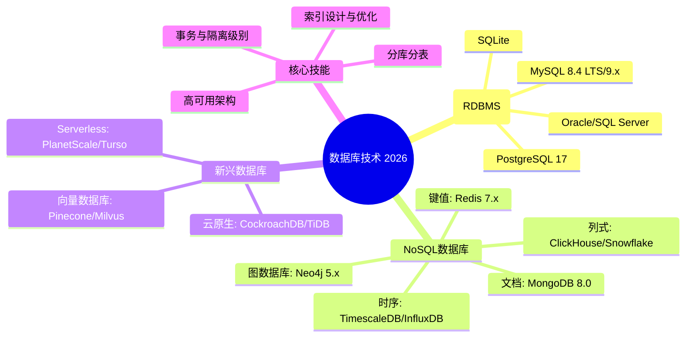
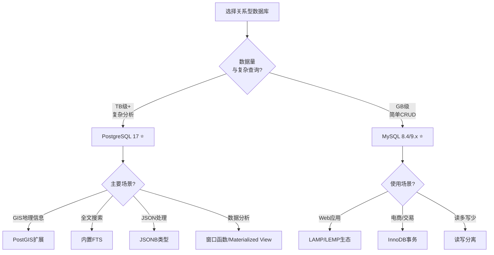
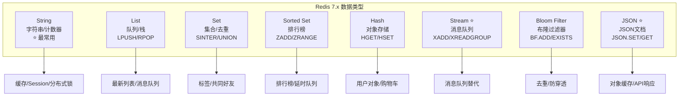
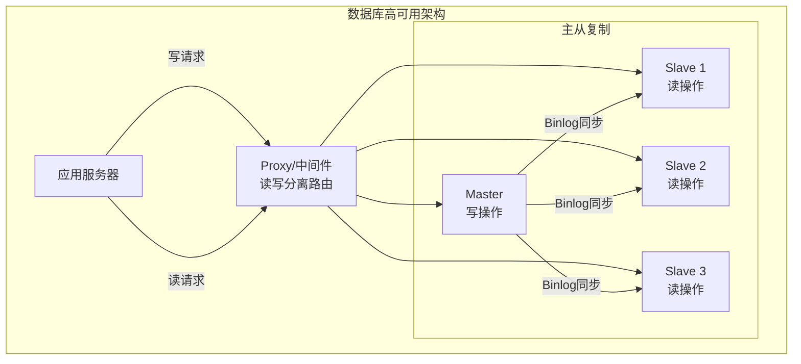
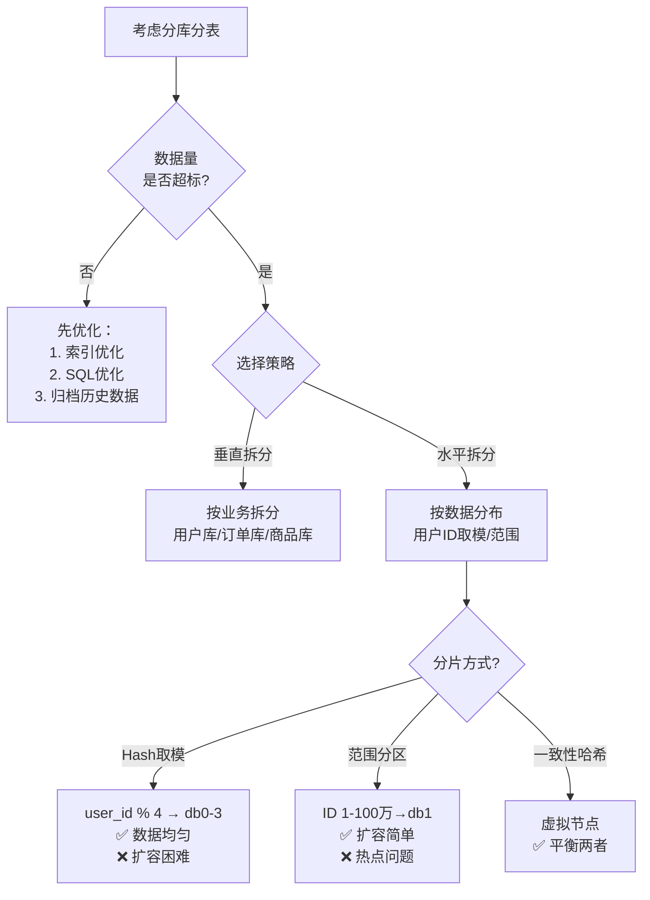
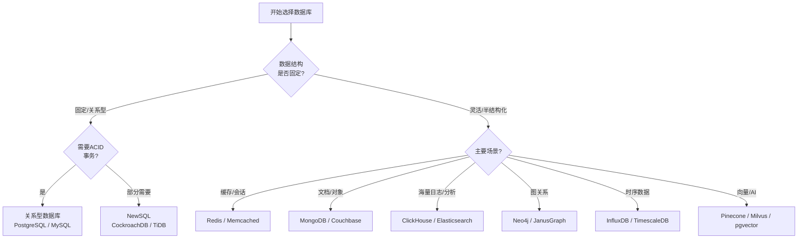

# 程序员练级攻略：数据库-[2026重制版]

> **核心变更说明**：本文基于2018年版全面升级，新增PostgreSQL 17新特性、MySQL 8.4 LTS与9.x更新、Redis 7.x数据结构、MongoDB 8.0引擎优化、时序数据库TimescaleDB、图数据库Neo4j 5.x、数据库选型决策树、分库分表最佳实践等2026年数据库核心技术内容。


对于数据库方向，重点就是两种数据库，一种是以SQL为代表的关系型数据库，另一种是以非SQL为代表的NoSQL数据库。**对于一个程序员，你可能觉得数据库的事都是DBA的事，然而我想告诉你你错了，这些事才真正是程序员的事。**因为程序是需要和数据打交道的，所以程序员或架构师不仅需要设计数据模型，还要保证整体系统的稳定性和可用性，数据是整个系统中关键中的关键。

## 🎯 数据库技术体系



## 📊 关系型数据库

### PostgreSQL 17 vs MySQL 8.4 LTS/9.x 选型指南



### PostgreSQL 17 核心特性（2024年发布）

| 特性 | 说明 | 使用场景 |
|------|------|---------|
| **JSON Path 查询** | SQL/JSON标准支持 | 半结构化数据 |
| **Logical Replication 改进** | 更灵活的主从复制 | 高可用架构 |
| **Parallel Vacuum** | 并行清理索引（PG 15引入），17增强流式I/O读取 | 大表维护 |
| **PSQL 新命令** | \dconfig 显示配置 | 运维便利 |
| **性能提升** | 查询优化器改进 | 通用 |

```sql
-- PostgreSQL 17 JSON 示例
CREATE TABLE products (
    id SERIAL PRIMARY KEY,
    name TEXT,
    attributes JSONB
);

-- 插入JSON数据
INSERT INTO products (name, attributes)
VALUES ('iPhone', '{"color": "black", "storage": "256GB", "price": 999}');

-- JSONPath 查询 (PG 17)
SELECT name, attributes->>'color' as color,
       (attributes->>'price')::numeric as price
FROM products
WHERE attributes @> '{"storage": "256GB"}';

-- 创建GIN索引加速JSON查询
CREATE INDEX idx_products_attributes ON products USING GIN (attributes);
```

### MySQL 9.x 新特性

MySQL 9.0属于Innovation创新版本（非LTS），当前LTS为8.4。9.x引入的代表性特性包括：

| 特性 | 说明 |
|------|------|
| **JavaScript 存储过程** | 可在MySQL（企业版）内执行JS代码 |
| **EXPLAIN ANALYZE** | 执行计划 + 实际执行统计（8.0.18已引入，此处一并列出） |
| **Vector 类型** | 原生向量支持（AI应用） |
| **Performance Schema 增强** | 更细粒度的监控 |
| **Replication 改进** | 延迟复制优化 |

```sql
-- MySQL 9.0 JavaScript存储程序示例
CREATE FUNCTION js_add(a INT, b INT)
RETURNS INT
LANGUAGE JAVASCRIPT AS $$
    return a + b;
$$;

-- Vector 类型示例 (用于AI/ML)
CREATE TABLE embeddings (
    id INT PRIMARY KEY,
    content TEXT,
    embedding VECTOR(1536)  -- OpenAI维度
);

-- 向量相似度搜索
SELECT content, COSINE_DISTANCE(embedding, '[0.1,0.2,...]') as distance
FROM embeddings
ORDER BY distance
LIMIT 10;
```

### 索引设计最佳实践

索引是数据库性能优化的核心：

```mermaid
flowchart LR
    subgraph IndexTypes["索引类型"]
        BTree["B-Tree索引<br/>默认索引<br/>等值/范围查询"]
        Hash["Hash索引<br/>精确匹配<br/>= IN操作"]
        FullText["全文索引<br/>文本搜索<br/>LIKE '%word%'"]
        GIN["GIN索引<br/>数组/JSON<br/>PostgreSQL专用"]
        Spatial["空间索引<br/>GIS数据<br/>地理位置"]
    end

    BTree --> Use1[WHERE id = 100]
    Hash --> Use2[WHERE name = '张三']
    FullText --> Use3[WHERE content LIKE '%关键词%']
    GIN --> Use4[WHERE data @> '{key: value}']
    Spatial --> Use5[WHERE location <@ query_box]
```

**索引设计原则**：
1. **选择性高的列优先**：唯一性越高越好
2. **遵循最左前缀原则**：联合索引 `(a,b,c)` 可查 `a`, `a,b`, `a,b,c`
3. **避免过度索引**：每个索引都会增加写入开销
4. **覆盖索引**：查询字段都在索引中时无需回表

```sql
-- 联合索引示例（订单系统）
CREATE INDEX idx_orders_user_status_time
ON orders(user_id, status, created_at);

-- 这个查询会命中索引
SELECT * FROM orders
WHERE user_id = 123 AND status = 'paid'
ORDER BY created_at DESC;

-- 但这个不会（缺少user_id）
SELECT * FROM orders WHERE status = 'paid';  -- 全表扫描！
```

## 🚀 NoSQL数据库

### Redis 7.x 核心数据结构与应用场景

Redis是最流行的键值数据库，7.x版本带来了许多重要更新：



### Redis 7.x 新特性

| 特性 | 版本 | 说明 |
|------|------|------|
| **Functions** | 7.0 | 服务端脚本的库化管理（Lua升级版） |
| **ACL 权限体系增强** | 6.0引入/7.0细化 | 用户级别的命令权限控制 |
| **Sharded Pub/Sub** | 7.0 | 集群模式下按分片发布订阅 |
| **Multi-part AOF** | 7.0 | AOF拆分为base+增量，简化重写 |
| **Commands Stats** | 7.0 | INFO commandstats 命令级统计增强 |

```python
# Redis 7 Functions 示例（Lua脚本升级版）
# 注册一个函数
redis.execute_command('FUNCTION', 'LOAD', '#!lua name=mylib\n'
    'redis.register_function("myfunc", function(keys, args)\n'
    '    return redis.call("incr", keys[1])\n'
    'end)')

# 调用函数
result = redis.fcall("myfunc", 1, "mycounter")
```

### MongoDB 8.0 核心改进

MongoDB 8.0 是最新稳定版本：

| 特性 | 说明 |
|------|------|
| **Queryable Encryption** | 字段级加密查询 |
| **Time Series Collections** | 原生时序数据支持 |
| **Change Streams 改进** | 更强的一致性保证 |
| **Sharded Clusters** | 分片集群性能提升 |
| **$lookup 性能** | 关联查询优化 |

```javascript
// MongoDB 8.0 时序集合示例
db.createCollection(
    "temperature",
    {
        timeseries: {
            timeField: "timestamp",
            metaField: "sensorId",
            granularity: "hours"
        }
    }
);

// 自动按时间聚合
db.temperature.insertMany([
    { timestamp: new Date(), sensorId: "A", value: 25.3 },
    { timestamp: new Date(), sensorId: "B", value: 26.1 }
]);

// 时序查询（自动压缩）
db.temperature.aggregate([
    { $match: { sensorId: "A", timestamp: { $gte: ISODate("2024-01-01") } } },
    { $group: {
        _id: { $dateTrunc: { date: "$timestamp", unit: "day" } },
        avgValue: { $avg: "$value" }
    }}
]);
```

## 🏗️ 数据库高可用架构

### 主从复制 vs 读写分离



### 分库分表策略

**什么时候需要分库分表？**

| 指标 | 单机上限 | 需要拆分 |
|------|---------|---------|
| **单表行数** | ~2000万行 | >2000万 |
| **单表大小** | ~10GB | >10GB |
| **QPS** | ~5000单表 | >5000 |



## 📈 各大公司数据库实践案例

### 推荐阅读的工程实践

| 公司 | 文章/分享 | 核心经验 |
|------|----------|---------|
| **Uber** | [Why Uber Switched from Postgres to MySQL](https://eng.uber.com/mysql-migration/) | Schema迁移、兼容性考量 |
| **Airbnb** | [Scaling Financial Reporting](https://medium.com/airbnb-engineering/tracking-the-money-scaling-financial-reporting-at-airbnb-6d742b80f040) | 分区策略演进 |
| **Discord** | [How Discord Stores Billions of Messages](https://blog.discordapp.com/how-discord-stores-billions-of-messages-7fa6ec7ee4c7) | Cassandra + ScyllaDB实践 |
| **Instagram** | [Sharding & IDs at Instagram](https://instagram-engineering.com/sharding-ids-at-instagram-1cf5a71e5a5c) | Snowflake ID生成器 |
| **Booking.com** | [Evolution of MySQL System Design](https://www.percona.com/live/mysql-conference-2015/sessions/bookingcom-evolution-mysql-system-design) | MySQL集群演化史 |

## 🔧 数据库选型决策树



## 📚 推荐学习资源

### 必读书籍

| 书名 | 作者 | 重点 |
|------|------|------|
| **《高性能MySQL》** | Baron Schwartz 等 | MySQL调优圣经 |
| **《Designing Data-Intensive Applications》** | Martin Kleppmann | **必读！** 数据系统设计 |
| **《PostgreSQL Performance》** | Gregory Smith | PG性能优化 |
| **《Redis实战》** | Josiah L. Carlson | Redis深入实践 |

### 在线资源

| 资源 | URL | 说明 |
|------|-----|------|
| **MySQL官方手册** | https://dev.mysql.com/doc/ | 权威参考 |
| **PostgreSQL Wiki** | https://wiki.postgresql.org/ | 社区知识库 |
| **Awesome MySQL** | https://shlomi-noach.github.io/awesome-mysql/ | 工具/资源合集 |
| **Use The Index, Luke** | https://use-the-index-luke.com/ | 索引教程 |

---

**下一篇文章**我们将探讨**分布式架构入门**——CAP理论、一致性模型、分布式系统设计的核心理论与实践。
