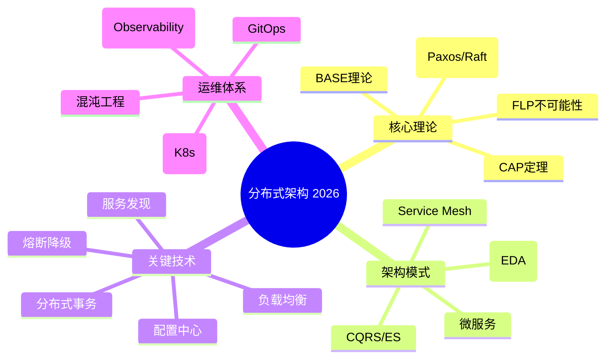
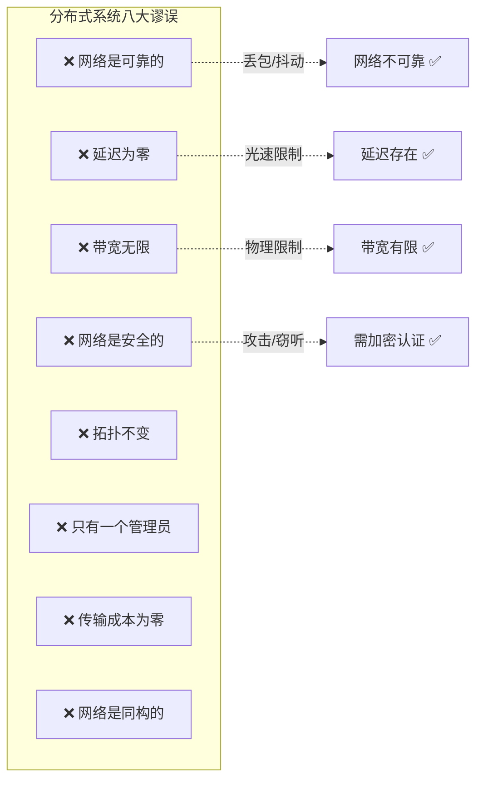
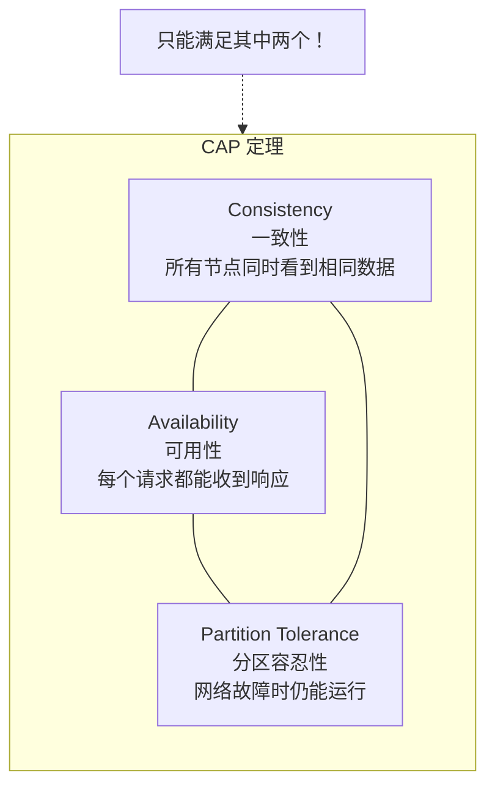
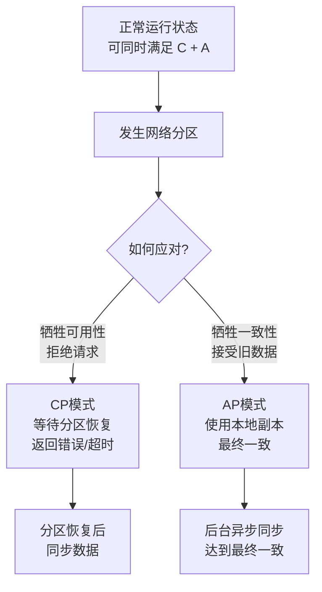
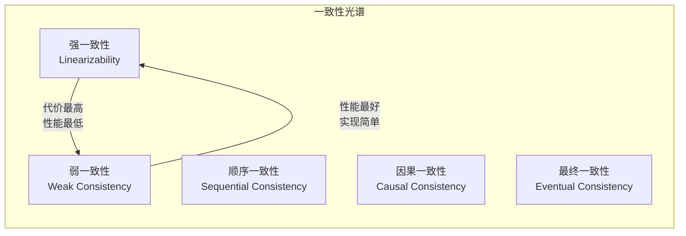
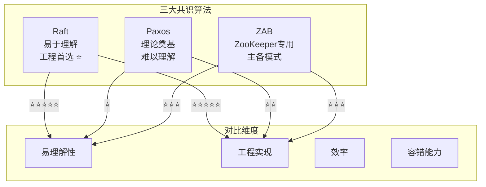
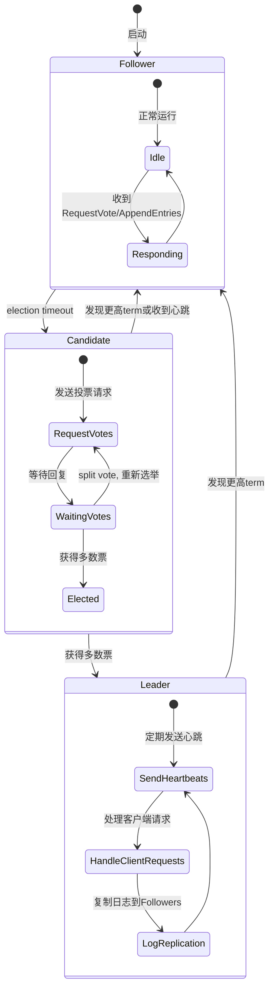
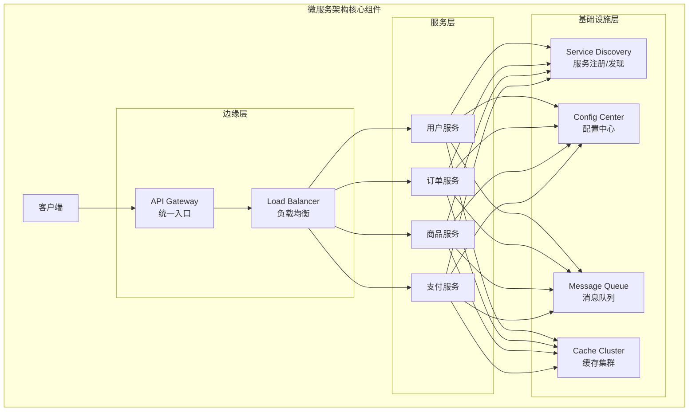
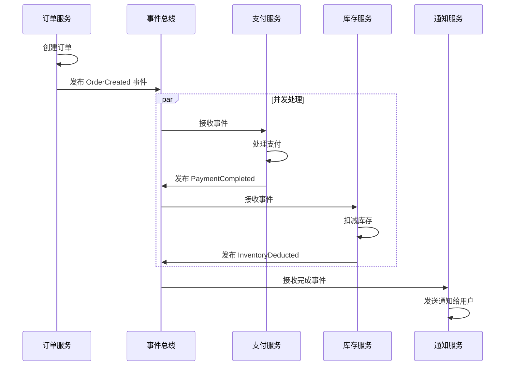

# 程序员练级攻略：分布式架构入门-[2026重制版]

> **核心变更说明**：本文基于2018年版全面升级，新增CAP理论现代解读、FLP不可能性原理详解、BASE与最终一致性、事件驱动架构(EDA)、Service Mesh入门、云原生12要素、Kubernetes服务发现等2026年分布式架构核心概念。


学习分布式系统跟学习其它技术非常不一样。**分布式系统之所以复杂，就是因为它太容易出错了。这意味着，你要把处理错误的代码当成正常功能的代码来处理。**

## 🎯 分布式系统全景图



## 📐 分布式系统面临的挑战

### 八大谬误（The 8 Fallacies）

这是分布式系统新手最容易犯的错误：



**记住：在分布式系统中，错误是不可能避免的，我们能做的不是避免错误，而是要把错误的处理当成功能写在代码中。**

## 🔄 CAP理论深度解读

### CAP定理的三要素



### CAP 的实际含义（重要澄清）

CAP理论经常被误解。以下是正确的理解：

| 组合 | 含义 | 代表系统 | 适用场景 |
|------|------|---------|---------|
| **CP** | 保证一致性和分区容忍 | ZooKeeper、etcd、HBase | 配置中心、协调服务 |
| **AP** | 保证可用性和分区容忍 | Cassandra、DynamoDB、CouchDB | 内容分发、社交网络 |
| **CA** | （理论上）单机系统 | 传统RDBMS | 非分布式场景 |

**关键洞察**：在真实系统中，P是必须选择的（网络分区必然发生），所以实际是在C和A之间做权衡。

### CAP Twelve Years Later（重要论文）

Eric Brewer在2012年重新审视了CAP理论，提出以下观点：

1. **"二选一"过于简化**：一致性有程度之分（强一致/最终一致），可用性也有等级
2. **分区很少发生**：大多数时间可以同时提供C和A
3. **更好的框架**：用**延迟**（Latency）而非可用性来衡量



## 📊 一致性模型详解

### 从强一致到最终一致



### BASE理论与ACID对比

| 特性 | ACID（传统） | BASE（分布式） |
|------|-------------|---------------|
| **原子性 Atomicity** | 全部成功或全部失败 | 允许部分成功 |
| **一致性 Consistency** | 强一致 | 最终一致 |
| **隔离性 Isolation** | 严格隔离 | 最终隔离 |
| **持久性 Durability** | 持久化 | 尽力而为 |
| **基本可用 Basically Available** | - | 系统始终可用 |
| **软状态 Soft State** | - | 允许中间状态 |
| **最终一致 Eventually Consistent** | - | 经过一段时间后一致 |

**eBay的经典总结**："在对数据库进行分区后，为了可用性（Availability）牺牲部分一致性（Consistency）可以显著地提升系统的可伸缩性（Scalability）。"

## 🤝 分布式共识算法

### Paxos、Raft 和 ZAB 对比



### Raft算法核心流程

Raft将共识分解为三个相对独立的子问题：



### Raft选举过程（简化）

```
Term 3:
  所有节点都是Follower
  ↓ (election timeout)
Node B 变为Candidate, term=4, 投票给自己
  Node B → Node A: RequestVote(term=4)
  Node B → Node C: RequestVote(term=4)
  Node A: term=4 > term=3, 更新term, 投票给B ✓
  Node C: term=4 > term=3, 更新term, 投票给B ✓
  ↓ Node B获得3票中的2票（包括自己）
Node B 成为Leader!
  开始发送AppendEntries心跳...
```

## 🏗️ 分布式架构设计模式

### 微服务架构基础组件



### 服务发现机制对比

| 方案 | 类型 | 优点 | 缺点 | 适用场景 |
|------|------|------|------|---------|
| **Consul** | DNS + HTTP | 健康检查丰富 | CP倾向 | 中小型集群 |
| **etcd** | gRPC | 强一致、Watch机制 | 单纯KV存储 | K8s/配置中心 |
| **ZooKeeper** | ZAB协议 | 成熟稳定 | 重量级 | Hadoop生态 |
| **Nacos** | HTTP/gRPC | 功能全面（注册+配置） | 较新 | Spring Cloud |
| **Eureka** | REST | AP可用性高 | 2.0已停止开发 | 旧Spring Cloud |

### 事件驱动架构（Event-Driven Architecture）

EDA是现代分布式架构的重要模式：



**EDA的优势**：
- **松耦合**：服务间通过事件通信，不直接依赖
- **可扩展**：新增消费者只需订阅事件
- **高可用**：事件总线本身可做冗余
- **可追溯**：所有事件可记录用于审计

## 📖 推荐学习资源

### 必读书籍

| 书名 | 作者 | 重点 |
|------|------|------|
| **《Designing Data-Intensive Applications》** | Martin Kleppmann | **必读！** 数据系统设计圣经 |
| **《Distributed Systems: Principles and Paradigms》** | Tanenbaum & van Steen | 经典教材 |
| **《Distributed Systems for Fun and Profit》** | Mixu | 免费电子书，通俗易懂 |

### 经典论文

| 论文 | 主题 | 难度 |
|------|------|------|
| **[Byzantine Generals Problem](https://www.microsoft.com/en-us/research/uploads/prod/2016/12/The-Byzantine-Generals-Problem.pdf)** | 拜占庭将军问题 | ⭐⭐⭐⭐ |
| **[CAP Twelve Years Later](https://www.infoq.com/articles/cap-twelve-years-later-how-the-rules-have-changed)** | CAP理论修正 | ⭐⭐⭐ |
| **[In Search of an Understandable Consensus Algorithm (Raft)](https://raft.github.io/raft.pdf)** | Raft算法 | ⭐⭐⭐ |
| **[Dynamo: Amazon's Highly Available Key-Value Store](http://bnrg.eecs.berkeley.edu/~randy/Courses/CS294.F07/Dynamo.pdf)** | Dynamo论文 | ⭐⭐⭐ |

### 入门教程

1. **[System Design Primer](https://github.com/donnemartin/system-design-primer)** - GitHub上最受欢迎的系统设计资源
2. **[An introduction to distributed systems](https://github.com/aphyr/distsys-class)** - 分布式系统知识图谱
3. **[Scalable Web Architecture and Distributed Systems](http://www.aosabook.org/en/distsys.html)** - 可扩展架构入门

---

**下一篇文章**我们将探讨**分布式架构经典图书和论文**——深入Paxos/Raft/Dynamo等经典论文，以及Google/Amazon/Facebook的大规模分布式系统实践经验。
