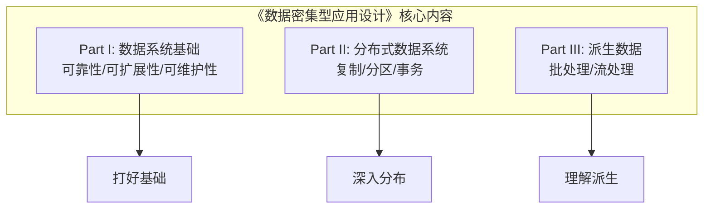
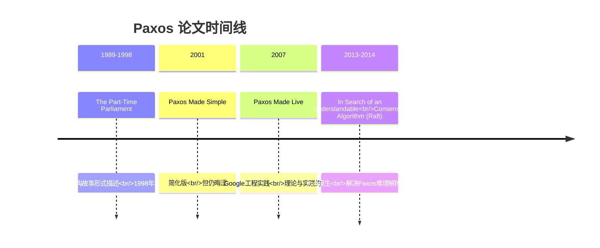
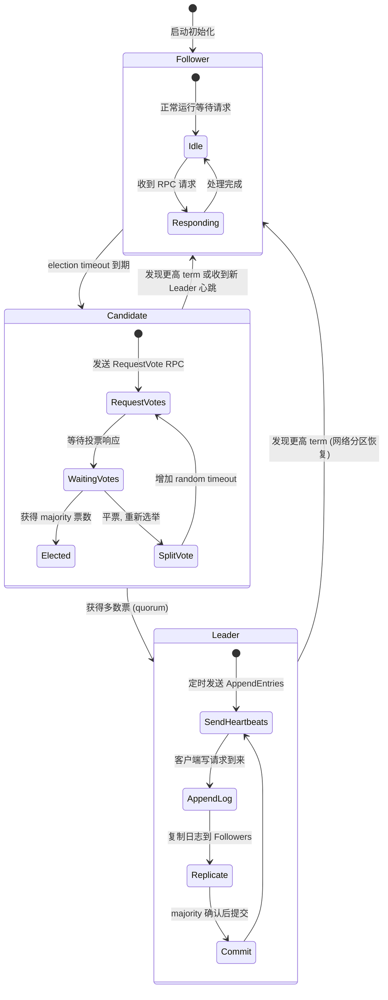
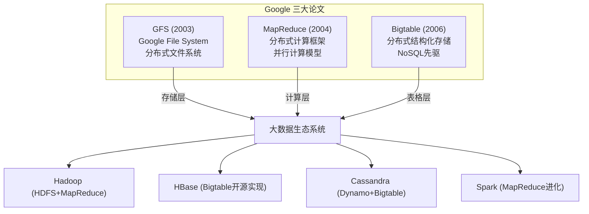
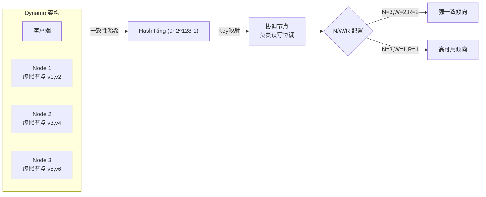
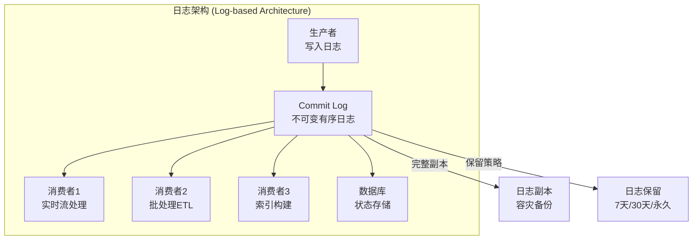
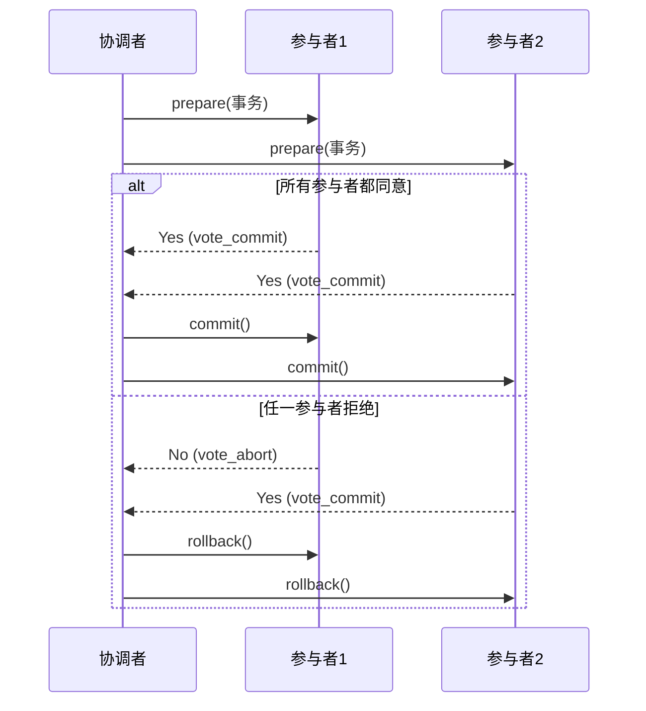
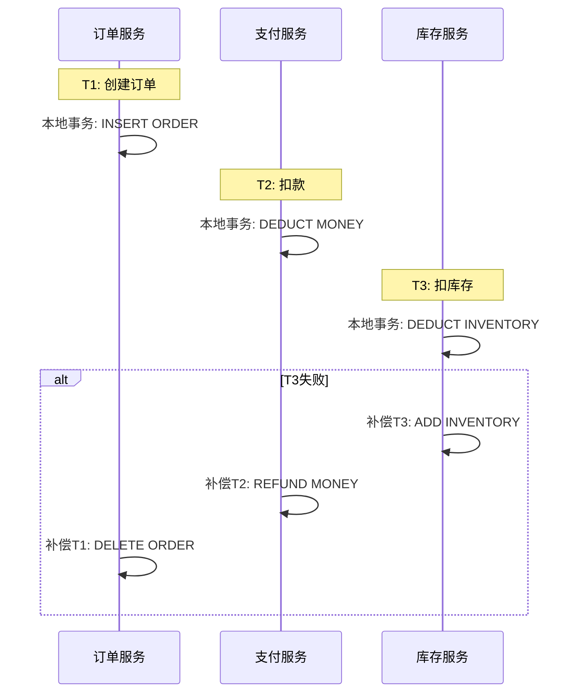

# 程序员练级攻略：分布式架构经典图书和论文-[2026重制版]

> **核心变更说明**：本文基于2018年版全面升级，新增DDIA深度解读、Raft可视化演示、Spanner TrueTime解析、F1分布式RDBMS、CRDT无冲突数据类型、分布式事务 Saga/TCC 模式、日志架构（Kafka/Log）、顶级会议论文追踪方法等分布式系统前沿内容。


今天分享的内容是分布式架构方面的**经典图书和论文**，并给出了导读文字，几乎涵盖了分布式系统架构方面的所有关键的理论知识。这些内容非常重要，是学好分布式架构的基石，请一定要认真学习。

## 📚 经典图书

### 必读：Designing Data-Intensive Applications (DDIA)



**为什么这本书如此重要？**

Martin Kleppmann的这本书（豆瓣评分9.7）被公认为分布式系统领域的"圣经"。它不是简单地罗列技术，而是：

1. **从问题出发**：先提出真实场景中的挑战，再引出解决方案
2. **对比分析**：每种方案都有优缺点，没有银弹
3. **工程视角**：大量来自Google/Amazon/LinkedIn的真实案例
4. **抽丝剥茧**：从"提出问题"到"解决方案"再到"优化方案"

### 其他重要书籍

| 书名 | 作者 | 难度 | 核心价值 |
|------|------|------|---------|
| **《Distributed Systems: Principles and Paradigms》** | Tanenbaum & Steen | ⭐⭐⭐⭐ | 经典教材，七大原理 |
| **《Distributed Systems for Fun and Profit》** | Mikito Takada（Mixu） | ⭐⭐ | 免费电子书，通俗易懂 |
| **《Scalable Web Architecture and Distributed Systems》** | Kate Matsudaira（收录于AOSA） | ⭐⭐ | 免费在线书，实战导向 |
| **Principles of Distributed Computing（ETH Zurich课程讲义）** | Roger Wattenhofer 等 | ⭐⭐⭐⭐⭐ | 算法层面，偏理论 |

## 📄 经典论文精读

### 一、Paxos 算法系列

Paxos是Leslie Lamport于1990年提出的分布式一致性算法，被誉为"最难理解的算法"。

#### Paxos论文演进路线



#### Raft算法可视化（推荐学习）

Raft将共识分解为三个子问题：



**推荐资源**：
- [Raft - The Secret Lives of Data](http://thesecretlivesofdata.com/raft/) - 动画演示
- [Raft Consensus Algorithm Visualization](http://kanaka.github.io/raft.js/) - 交互式可视化
- [Raft GitHub](https://raft.github.io/) - 官方站点

### 二、Google 三大论文（GFS / MapReduce / Bigtable）

这三篇论文奠定了现代大数据的基础：



### 三、Amazon Dynamo 论文

[Dynamo: Amazon's Highly Available Key-Value Store](http://bnrg.eecs.berkeley.edu/~randy/Courses/CS294.F07/Dynamo.pdf) 是NoSQL运动的开山之作。

**核心贡献**：
1. **一致性哈希 + 虚拟节点**：解决数据分布和节点增减问题
2. **Vector Clock**：版本冲突检测与解决
3. **Quorum机制 (NWR)**：可调节的一致性与可用性权衡
4. **Gossip协议**：去中心化的成员资格管理
5. **Hinted Handoff**：临时故障时的写入优化



### 四、Spanner: Google 的全球分布式数据库

[Spanner: Google's Globally-Distributed Database](https://static.googleusercontent.com/media/research.google.com/zh-CN//archive/spanner-osdi2012.pdf) 是数据库领域的里程碑式论文。

**TrueTime API**：
```java
// Spanner 的 TrueTime API 接口
interface TT {
    // 返回一个绝对时间区间，保证包含了真实的当前时间
    TTinterval now();
}

// 使用示例：实现外部一致性的事务
TTinterval timestamp = tt.now();  // 获取当前时间区间
// 执行事务...
// 提交时指定 commit timestamp >= timestamp.latest
```

**为什么 TrueTime 如此重要？**
- 通过GPS + 原子钟提供**有界的时间不确定性**（通常 <10ms）
- 可以实现真正的**外部一致性**（External Consistency）
- 支持**跨地域的无缝事务**

### 五、F1: 基于 Spanner 的分布式 RDBMS

[F1: The Fault-Tolerant Distributed RDBMS Supporting Google's Ad Business](http://research.google.com/pubs/archive/38125.pdf) 展示了如何在Spanner上构建完整的SQL数据库。

**F1的核心特性**：
- **完全兼容SQL**：支持复杂查询、JOIN、索引
- **自动分片**：基于Spanner的自动数据分布
- **同步复制**：跨数据中心的高可用
- **Schema变更**：在线DDL操作

### 六、日志架构（The Log）

[The Log: What every software engineer should know about real-time data's unifying abstraction](https://engineering.linkedin.com/distributed-systems/log-what-every-software-engineer-should-know-about-real-time-datas-unifying) 是Jay Kreps（Kafka联合创始人）的经典文章。



**日志的核心思想**：
1. **日志 = 状态变化的有序记录**：所有数据变更都写入日志
2. **日志是不可变的**：只能追加，不能修改
3. **日志是唯一的真理来源**：其他数据都是从日志派生的
4. **解耦生产者和消费者**：通过日志实现松耦合

## 🔬 分布式事务模式

### 两阶段提交 (2PC)



**2PC的问题**：
- **阻塞**：协调者故障会导致参与者阻塞
- **单点故障**：协调者是瓶颈
- **不确定状态**：参与者vote_commit后不知道最终结果

### Saga 模式（长活事务）

Saga将长事务拆分为多个本地事务：



### TCC (Try-Confirm-Cancel)

| 阶段 | 操作 | 说明 |
|------|------|------|
| **Try** | 预留资源 | 冻结余额/锁定库存 |
| **Confirm** | 确认执行 | 实际扣减 |
| **Cancel** | 取消执行 | 释放预留 |

## 📖 最新论文获取渠道

跟踪分布式系统前沿最可靠的方式，是关注顶级会议的官网论文列表与获奖论文：OSDI、SOSP、NSDI、SIGCOMM、EuroSys、ATC 等。各会议官网每年都会公开完整论文集，部分还提供论文演讲视频。

## ✅ 学习建议

1. **先读DDIA**：建立全局认知
2. **精读Raft**：配合动画理解
3. **浏览Dynamo/Spanner**：了解工业实践
4. **阅读The Log**：理解统一抽象
5. **关注顶级会议**：OSDI/SOSP/SIGCOMM/NSDI 新论文

---

**下一篇文章**我们将探讨**分布式架构工程设计**——设计原则、设计模式以及工程实践。
