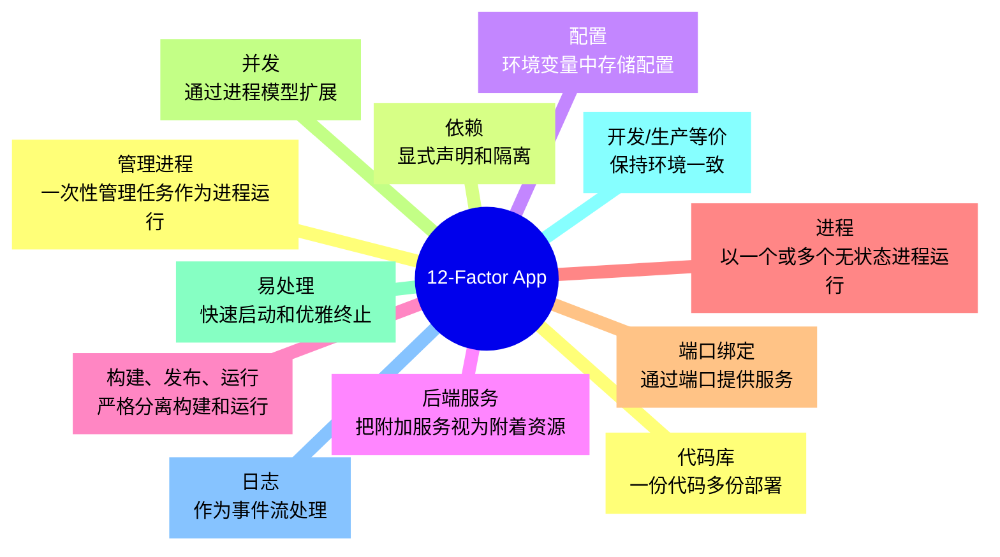
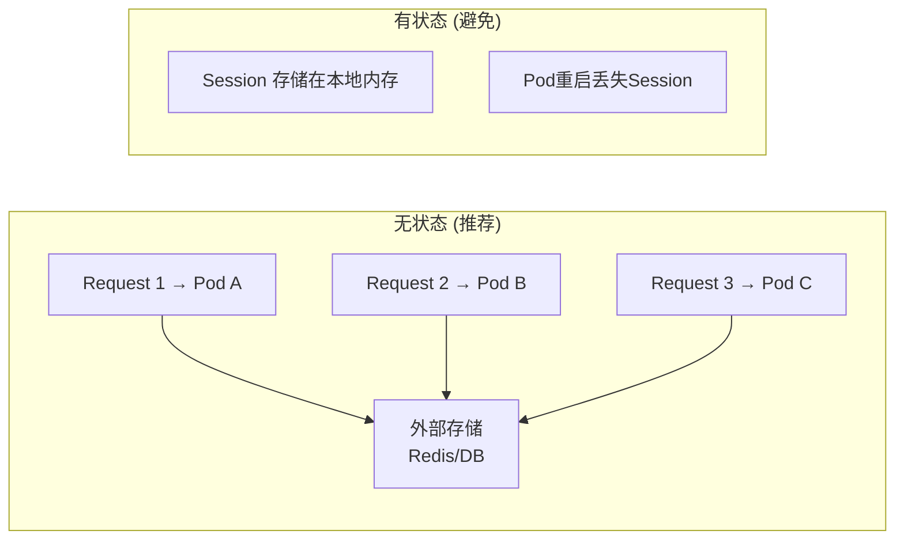
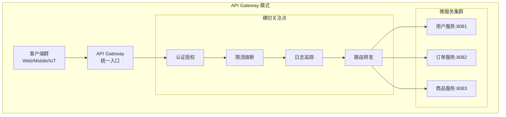
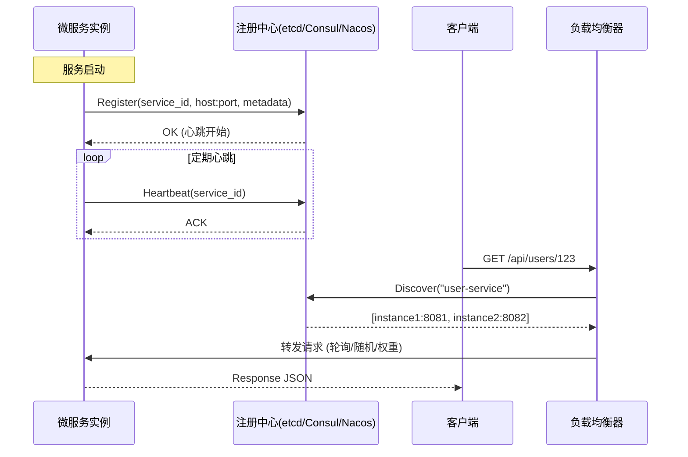
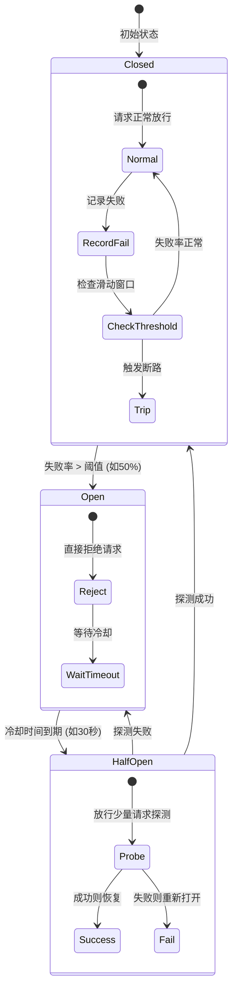
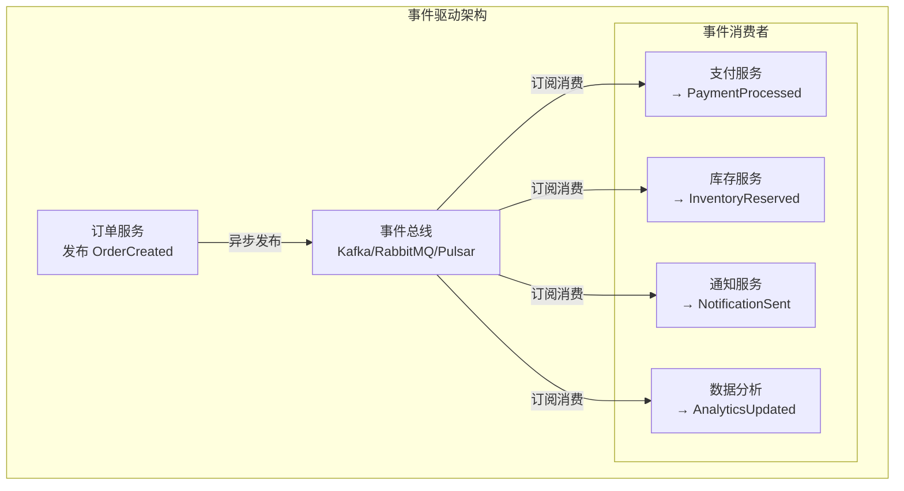
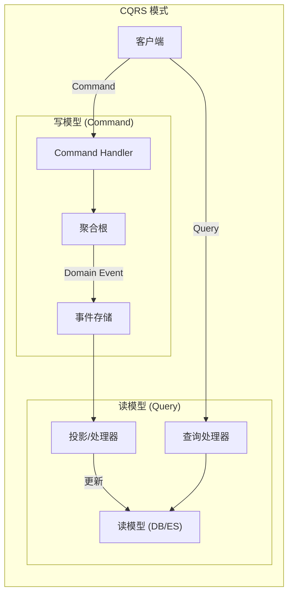
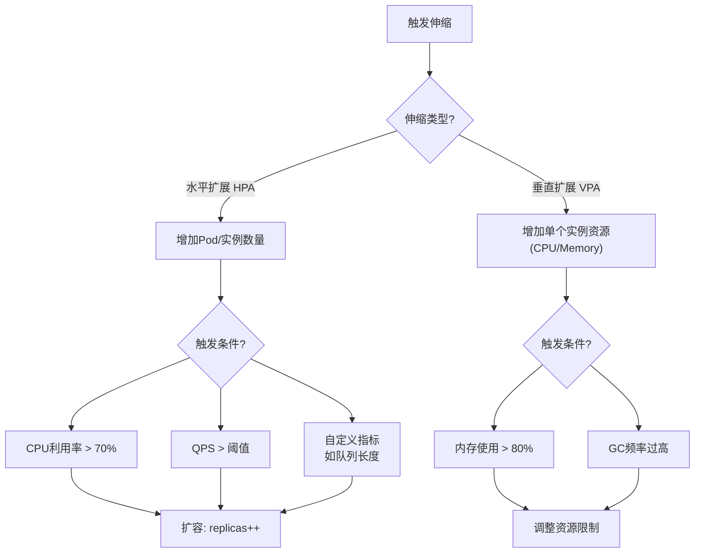
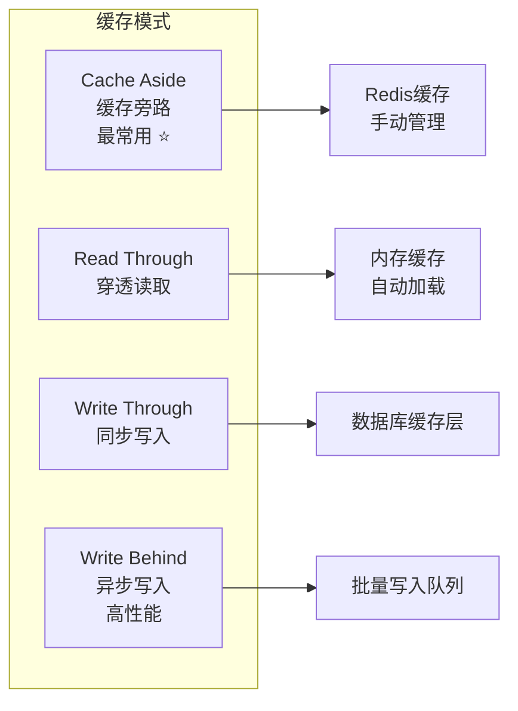
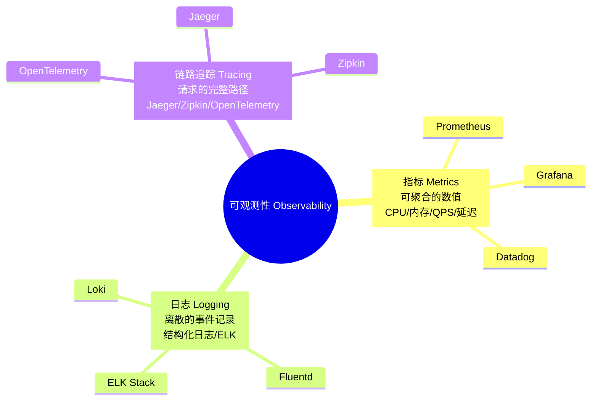

# 程序员练级攻略：分布式架构工程设计-[2026重制版]

> **核心变更说明**：本文基于2018年版全面升级，新增12-Factor App云原生方法论、Service Mesh架构模式、事件驱动架构(EDA)最佳实践、CQRS模式、API网关选型、混沌工程(Chaos Engineering)、GitOps运维模式、SLO/SLI/SLA可观测性体系等2026年分布式工程设计核心内容。


要学好分布式架构，你首先需要学习一些架构指导性的文章和方法论，即**分布式架构设计原则**。有了方法论后，你还需要学习一些比较细节的落地的技术——**设计模式**。最后，你需要通过大量的**工程实践**来内化这些知识。

## 🏗️ 分布式架构设计原则

### 12-Factor App（十二要素应用）

12-Factor 是构建SaaS应用的**方法论**，由Heroku在2011年提出，至今仍是云原生应用的黄金标准：



### 关键原则详解

#### 1. 配置外置（Factor III）

```yaml
# ❌ 错误：硬编码配置
# database:
#   host: localhost
#   port: 3306

# ✅ 正确：使用环境变量
database:
  host: ${DB_HOST:localhost}
  port: ${DB_PORT:3306}
  password: ${DB_PASSWORD}   # 绝不提交密码到代码库！
```

#### 2. 无状态进程（Factor VII）



#### 3. 日志即事件流（Factor XI）

```python
import logging
import json
from datetime import datetime

# 结构化JSON日志（推荐）
logger = logging.getLogger(__name__)

def handle_request(request):
    logger.info(json.dumps({
        "timestamp": datetime.utcnow().isoformat(),
        "level": "INFO",
        "service": "user-service",
        "trace_id": request.headers.get("X-Trace-ID"),
        "user_id": request.user.id,
        "action": "get_profile",
        "duration_ms": 42,
        "status_code": 200
    }))

# 输出到stdout，让基础设施收集
# docker logs / kubectl logs 即可查看
```

## 🎨 核心设计模式

### API Gateway（API网关）



**主流API网关对比**：

| 网关 | 语言 | 特点 | 适用场景 |
|------|------|------|---------|
| **Kong** | Lua/OpenResty | 插件丰富、社区活跃 | 通用API网关 |
| **APISIX** | Lua | 高性能、动态路由 | 云原生环境 |
| **Envoy** | C++ | Service Mesh数据面 | K8s + Istio |
| **Spring Cloud Gateway** | Java | Spring生态集成 | Java微服务 |
| **Traefik** | Go | 自动服务发现 | Docker/K8s原生 |

### 服务发现与服务注册



### 断路器模式（Circuit Breaker）



**开源实现**：
- Java: [Resilience4j](https://github.com/resilience4j/resilience4j), [Sentinel](https://github.com/alibaba/Sentinel)
- Go: [sony/gobreaker](https://github.com/sony/gobreaker), [go-zero/core/breaker](https://github.com/zeromicro/go-zero)
- Python: [Pybreaker](https://github.com/dgilland/pybreaker)

### 事件驱动架构（Event-Driven Architecture）



**消息队列选型**：

| 特性 | Kafka | RabbitMQ | RocketMQ | Pulsar |
|------|-------|----------|----------|--------|
| **吞吐量** | 极高 | 中 | 高 | 极高 |
| **延迟** | ms级 | 低 | ms级 | ms级 |
| **消息顺序** | 分区内有序 | 有序 | 有序 | 有序 |
| **持久化** | 磁盘 | 内存/磁盘 | 磁盘 | 分层存储 |
| **适用场景** | 大数据/日志 | 业务消息 | 电商/金融 | 流批一体 |

### CQRS（命令查询职责分离）



## 🔧 工程实践

### 弹性伸缩策略



**Kubernetes HPA示例**：
```yaml
apiVersion: autoscaling/v2
kind: HorizontalPodAutoscaler
metadata:
  name: api-hpa
spec:
  scaleTargetRef:
    apiVersion: apps/v1
    kind: Deployment
    name: api-server
  minReplicas: 3
  maxReplicas: 100
  metrics:
  - type: Resource
    resource:
      name: cpu
      target:
        type: Utilization
        averageUtilization: 70
  - type: Pods
    pods:
      metric:
        name: http_requests_per_second
      target:
        type: AverageValue
        averageValue: "1000"
  behavior:
    scaleUp:
      stabilizationWindowSeconds: 60
      policies:
      - type: Percent
        value: 100
        periodSeconds: 15
    scaleDown:
      stabilizationWindowSeconds: 300
      policies:
      - type: Percent
        value: 10
        periodSeconds: 60
```

### 缓存策略



**Cache Aside 示例**：
```python
import redis
import json

r = redis.Redis(host='cache', port=6379, db=0)

def get_user(user_id):
    # 1. 先查缓存
    cache_key = f"user:{user_id}"
    cached = r.get(cache_key)
    
    if cached:
        return json.loads(cached)  # Cache Hit
    
    # 2. 缓存未命中，查数据库
    user = db.query("SELECT * FROM users WHERE id = %s", user_id)
    
    if user:
        # 3. 写入缓存（设置过期时间）
        r.setex(cache_key, 3600, json.dumps(user))  # TTL = 1小时
    
    return user  # Cache Miss
```

### 可观测性三大支柱



### SLO / SLI / SLA 定义

| 术语 | 全称 | 定义 | 示例 |
|------|------|------|------|
| **SLI** | Service Level Indicator | 服务质量指标 | 请求延迟 < 500ms 的比例 |
| **SLO** | Service Level Objective | 目标值 | 月度可用性 ≥ 99.9% |
| **SLA** | Service Level Agreement | 合同承诺 | 低于SLO时的赔偿 |

**Error Budget（错误预算）**：
```
月度SLO = 99.9% → 允许停机时间 = 43.2分钟
已用停机 = 10分钟 → 剩余预算 = 33.2分钟
```

## 📚 推荐资源

### 设计模式参考

| 资源 | URL | 重点 |
|------|-----|------|
| **Azure Cloud Design Patterns** | https://docs.microsoft.com/en-us/azure/architecture/patterns/ | 最全面的设计模式集合 |
| **microservices.io Patterns** | https://microservices.io/patterns/ | 微服务专用模式 |
| **AWS Well-Architected** | https://aws.amazon.com/architecture/well-architected/ | AWS最佳实践 |

### 工程实践案例

| 公司 | 文章 | 核心经验 |
|------|------|---------|
| **Netflix** | [Chaos Engineering](https://www.usenix.org/conference/srecon17americas/program/presentation/rosenthal) | 混沌工程实践 |
| **Google** | [Building Software Systems At Google](https://www.youtube.com/watch?v=modXC5IWTJI) | SRE经验总结 |
| **Facebook** | [Automate and Abstract](https://architecht.io/lessons-from-facebook-on-engineering-for-scale-f5716f0afc7a) | 自动化与抽象 |
| **Microsoft** | [On Designing Internet-Scale Services](https://www.usenix.org/legacy/event/lisa07/tech/full_papers/hamilton/hamilton_html/index.html) | 大规模服务设计 |

---

**下一篇文章**我们将探讨**微服务架构**——Spring Cloud 2024、gRPC、GraphQL、Service Mesh等微服务核心技术。
