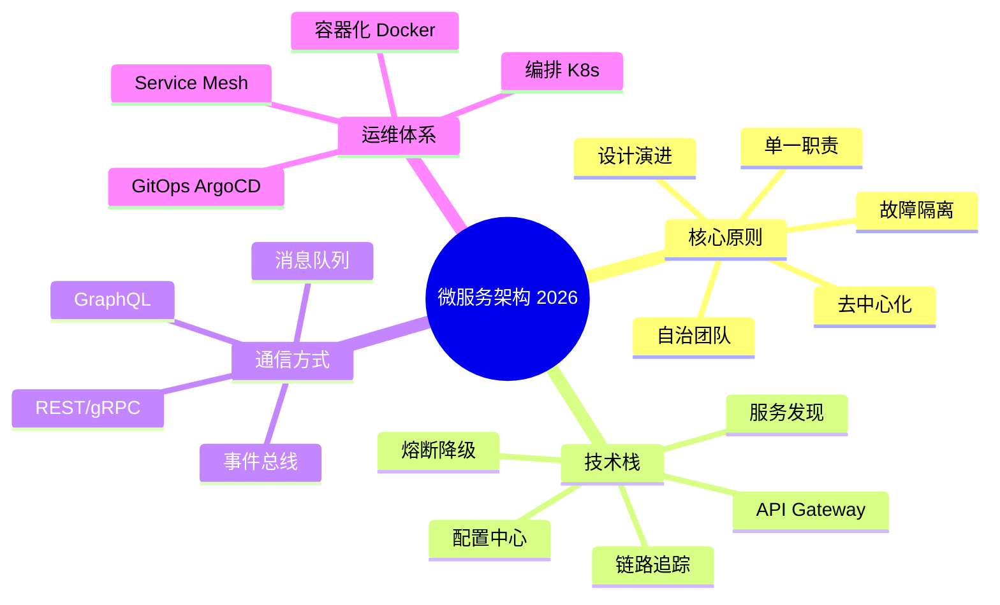
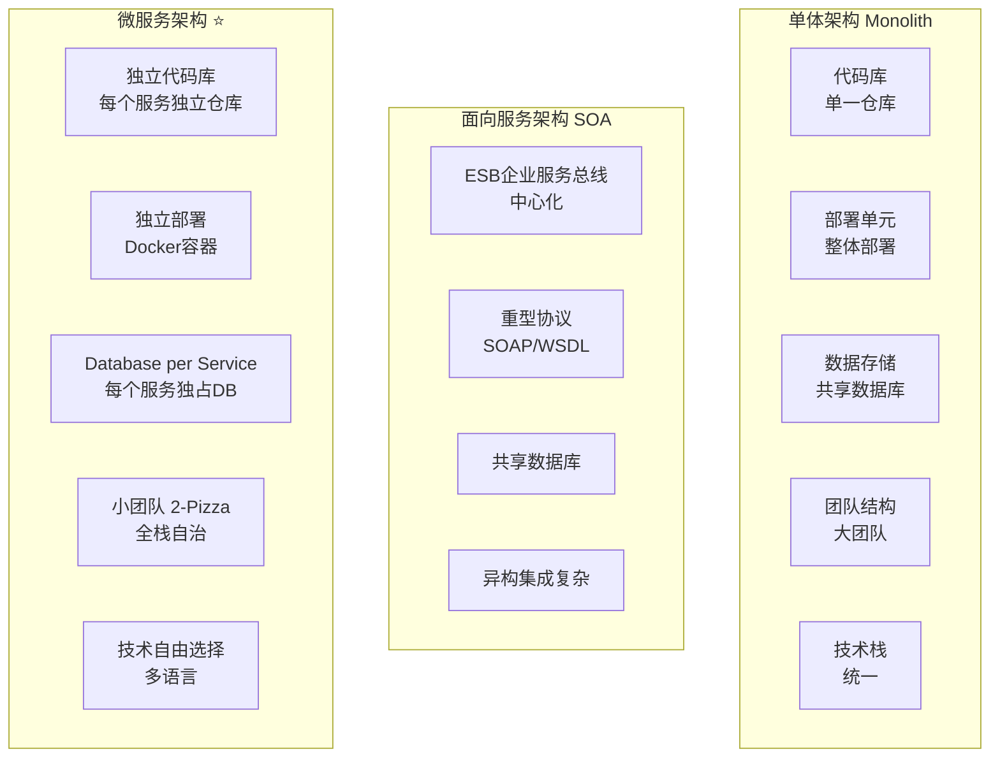
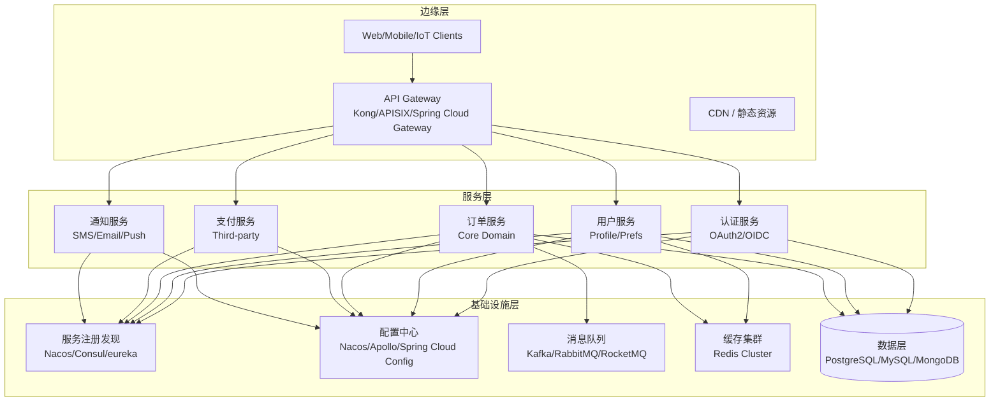
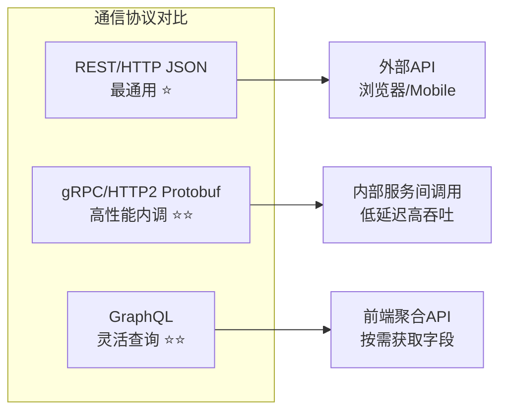
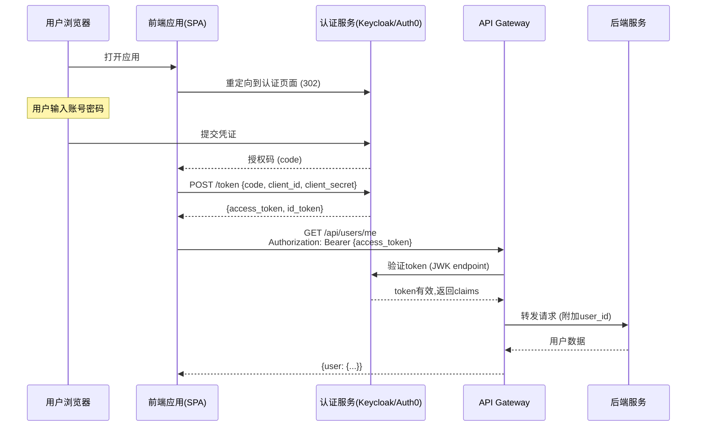
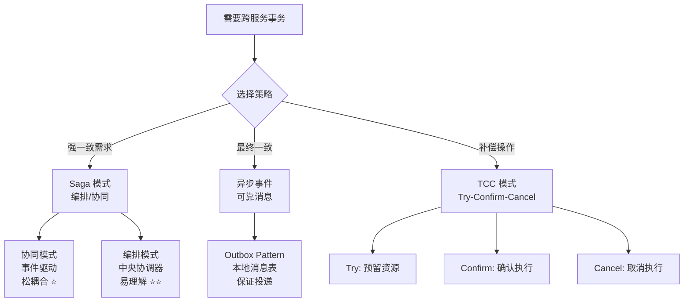
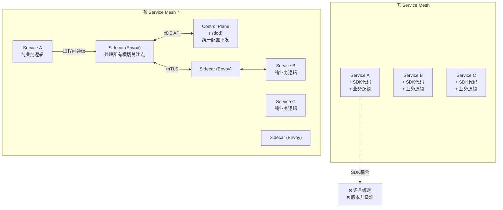

# 程序员练级攻略：微服务-[2026重制版]

> **核心变更说明**：本文基于2018年版全面升级，新增Spring Cloud生态、gRPC与GraphQL对比、Service Mesh (Istio)深度实践、微服务安全(OAuth2/OIDC)、领域驱动设计(DDD)在微服务中的应用、事件溯源(Event Sourcing)、CQRS模式实现等2026年微服务架构核心内容。


**微服务是分布式系统中最近比较流行的架构模型，也是SOA架构的一个进化。** 微服务架构并不是银弹，所以也不要寄希望于微服务架构能够解决所有的问题。微服务架构主要解决的是如何快速地开发和部署我们的服务。同时我也觉得，微服务中有很多很不错的想法和理念，所以学习微服务是每一个技术人员迈向卓越的架构师的必经之路。

## 🎯 微服务架构全景



## 🏗️ 微服务 vs 单体 vs SOA

### 架构对比



| 维度 | 单体应用 | SOA | 微服务 |
|------|---------|-----|--------|
| **部署** | 整体部署 | 部分独立 | **完全独立** |
| **数据库** | 共享 | 共享为主 | **独立（Database per Service）** |
| **通信** | 函数调用 | ESB + SOAP | **轻量级API/消息** |
| **团队规模** | 大团队 | 中型团队 | **小团队（2-pizza）** |
| **故障影响** | 全局 | 部分 | **隔离** |
| **适用场景** | 初创期/简单应用 | 企业集成 | **大规模复杂系统** |

## 🔌 微服务核心组件

### 典型微服务架构图



## 💬 通信协议选型

### REST vs gRPC vs GraphQL 对比



| 特性 | REST (JSON) | gRPC (Protobuf) | GraphQL |
|------|-------------|-----------------|---------|
| **协议** | HTTP/1.1 | HTTP/2 | HTTP/1.1/2 |
| **序列化** | JSON | Protobuf (二进制) | JSON |
| **性能** | 一般 | **极高**（通常数倍到数十倍） | 一般 |
| **类型安全** | 弱 | **强** (IDL定义) | 强 (Schema) |
| **代码生成** | 手动 | **自动** | 可选 |
| **浏览器支持** | **原生** | 需网关转换 | **原生** |
| **流式支持** | SSE/WebSocket | **双向流** | Subscription |
| **工具链** | 成熟 | grpcurl/Postman | GraphiQL/Altair |

### gRPC 示例（Proto定义）

```protobuf
// user.proto
syntax = "proto3";
package user.v1;

import "google/protobuf/timestamp.proto";

option go_package = "github.com/example/api/gen/go/user/v1;userv1";

service UserService {
  // RPC 定义
  rpc GetUser(GetUserRequest) returns (GetUserResponse);
  rpc CreateUser(CreateUserRequest) returns (CreateUserResponse);
  rpc ListUsers(ListUsersRequest) returns (stream User);  // 服务端流
}

message GetUserRequest {
  string user_id = 1;
}

message GetUserResponse {
  User user = 1;
}

message User {
  string id = 1;
  string name = 2;
  string email = 3;
  repeated string roles = 4;  // 数组
  google.protobuf.Timestamp created_at = 5;  // 时间戳
}
```

## 🛡️ 微服务安全

### OAuth 2.0 + OpenID Connect 认证流程



### 安全最佳实践

| 层面 | 措施 | 工具/方案 |
|------|------|----------|
| **传输加密** | TLS 1.3 everywhere | Let's Encrypt / mTLS |
| **认证授权** | OAuth 2.0 + OIDC | Keycloak / Auth0 / Casdoor |
| **服务间安全** | mTLS + JWT | Istio mTLS / SPIFFE |
| **API限流** | Rate Limiting | Kong / APISIX / Sentinel |
| **敏感数据** | 加密存储 | Hash密码 / KMS加密PII |
| **审计日志** | 操作可追溯 | ELK / Splunk |

## 🔄 数据一致性策略

### 分布式事务解决方案



### Outbox Pattern（本地消息表）

```python
# 伪代码示例：Outbox Pattern 实现
import sqlalchemy as db

def create_order(order_data):
    with db.session.begin():  # 本地事务
        # 1. 写入业务表
        order = Order(**order_data)
        session.add(order)
        
        # 2. 写入Outbox表（同一事务）
        outbox = Outbox(
            aggregate_type="Order",
            aggregate_id=order.id,
            event_type="OrderCreated",
            payload=json.dumps({
                "order_id": str(order.id),
                "user_id": order.user_id,
                "amount": order.amount
            })
        )
        session.add(outbox)
    # 事务提交后，两者原子性保证

# 后台轮询或CDC将outbox消息发布到消息队列
def poll_outbox():
    unpolled = session.query(Outbox).filter(Outbox.processed == False).limit(100)
    for msg in unpolled:
        kafka_producer.send("order-events", msg.payload)
        msg.processed = True
        session.commit()
```

## 📦 Spring Cloud 2024 生态

### 核心组件（2024年推荐）

| 组件 | 替代方案 | 说明 |
|------|---------|------|
| **注册中心** | Nacos / Consul | 替代Eureka（2.0已停止开发） |
| **配置中心** | Nacos / Apollo | 集中管理配置 |
| **远程调用** | OpenFeign | 声明式HTTP客户端 |
| **负载均衡** | LoadBalancer | 客户端负载均衡 |
| **熔断降级** | Sentinel / Resilience4j | 替代Hystrix |
| **网关** | Spring Cloud Gateway | 替代Zuul 1.x |

### 示例：Spring Boot 3 + Nacos 微服务

```java
// 1. 引入依赖 (build.gradle)
dependencies {
    implementation 'org.springframework.cloud:spring-cloud-starter-bootstrap'
    implementation 'com.alibaba.cloud:spring-cloud-starter-alibaba-nacos-discovery'
    implementation 'com.alibaba.cloud:spring-cloud-starter-alibaba-nacos-config'
}

// 2. bootstrap.yml
spring:
  application:
    name: user-service
  cloud:
    nacos:
      discovery:
        server-addr: ${NACOS_HOST:nacos}:8848
      config:
        server-addr: ${NACOS_HOST:nacos}:8848
        file-extension: yaml
        shared-configs:
          - data-id: common.yaml
            group: DEFAULT_GROUP
            refresh: true

// 3. 主启动类
@SpringBootApplication
@EnableDiscoveryClient
public class UserServiceApplication {
    public static void main(String[] args) {
        SpringApplication.run(UserServiceApplication.class, args);
    }
}
```

## 🌐 Service Mesh（服务网格）

### 为什么需要 Service Mesh？

当微服务数量增多时，每个服务都需要处理：
- 服务发现
- 负载均衡
- 熔断重试
- 认证授权
- 链路追踪
- ...

这导致**大量重复的SDK代码**侵入业务逻辑。



### Istio 架构概览

| 组件 | 功能 |
|------|------|
| **Envoy** | Sidecar代理，数据面 |
| **istiod** | Control Plane，配置管理 |
| **Citadel** | 证书管理（mTLS） |
| **Galley** | 配置验证 |
| **Kiali** | 可视化仪表盘 |

> 注：自 Istio 1.5 起，Pilot/Citadel/Galley 的职责已合并进单一的 istiod；Citadel、Galley 在此按其历史职责列出。

## 📚 推荐资源

### 必读书籍

| 书名 | 作者 | 重点 |
|------|------|------|
| **《Building Microservices》** | Sam Newman | 微服务设计圣经 |
| **《Microservices Patterns》** | Chris Richardson | 模式与实践 |
| **《Domain-Driven Design》** | Eric Evans | DDD领域驱动设计 |

### 在线资源

| 资源 | URL |
|------|-----|
| **microservices.io** | https://microservices.io/patterns/ |
| **Martin Fowler - Microservices** | https://martinfowler.com/articles/microservices.html |
| **Awesome Microservices** | https://github.com/mfornos/awesome-microservices |

---

**下一篇文章**我们将探讨**容器化和自动化运维**——Docker、Kubernetes、Helm 3、Terraform/OpenTofu、GitOps等云原生核心技术。
