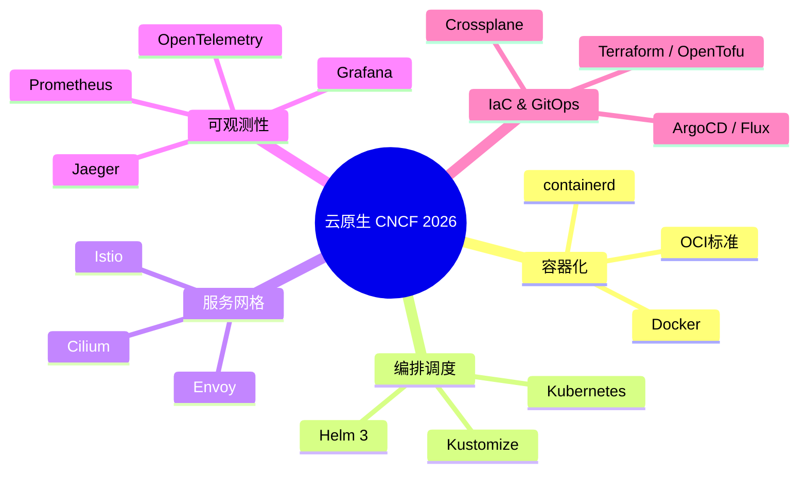
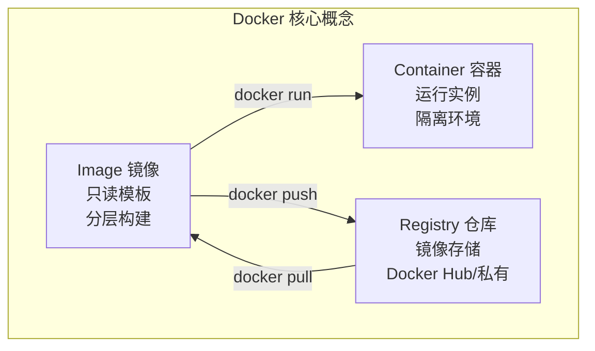
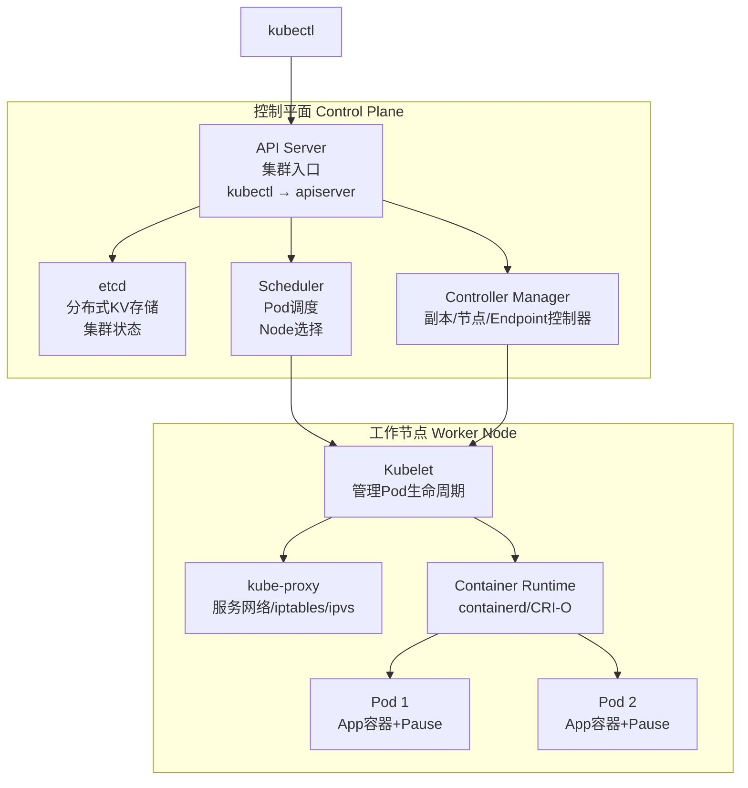
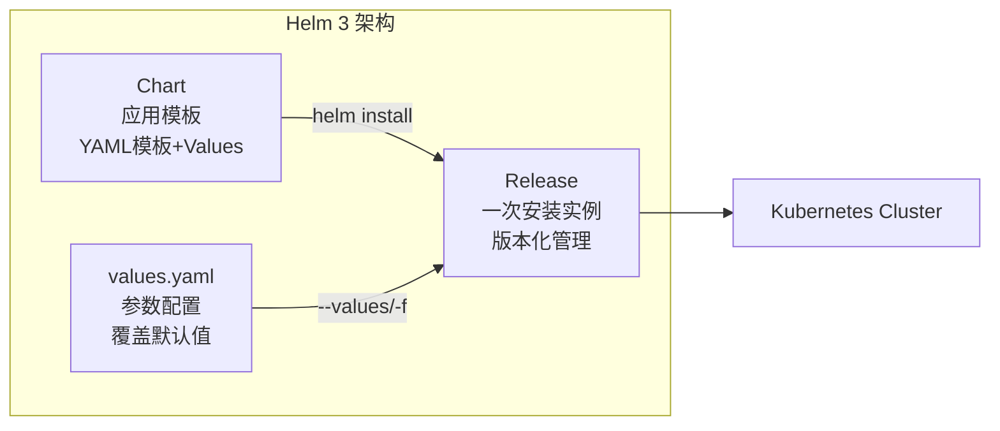
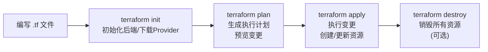
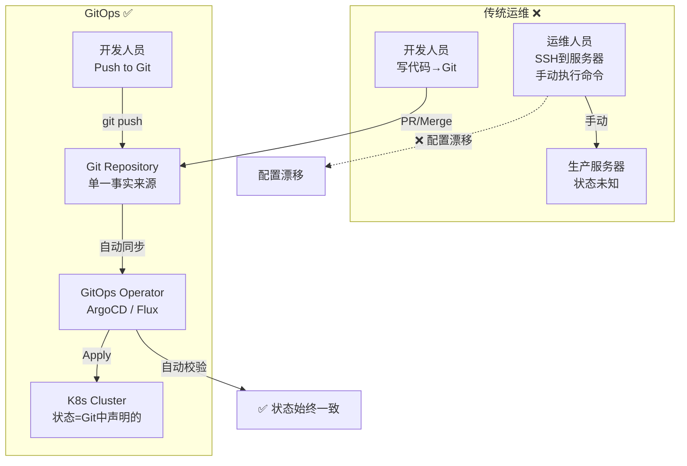
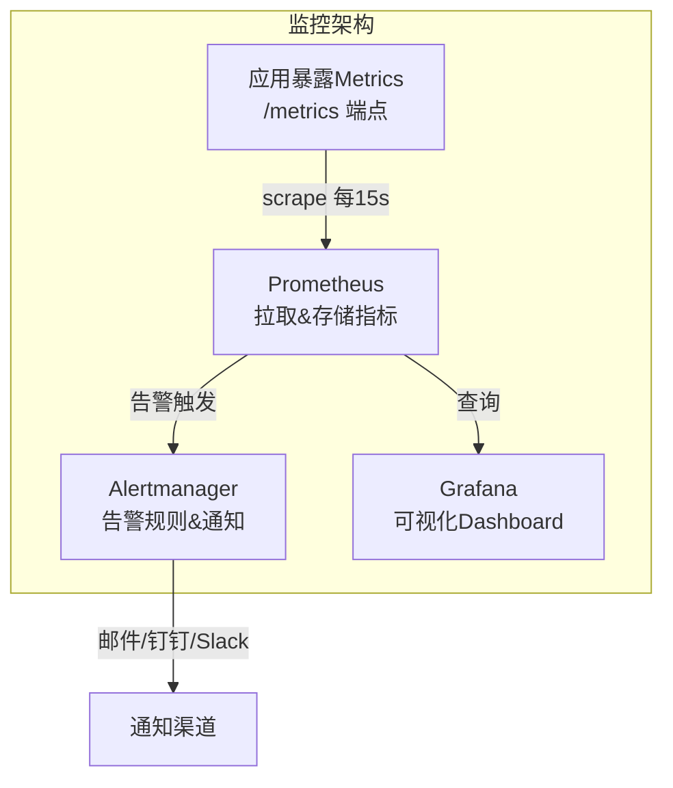

# 程序员练级攻略：容器化和自动化运维-[2026重制版]

> **核心变更说明**：本文基于2018年版全面升级，新增Docker新特性、Kubernetes核心概念、Helm 3 Charts包管理、Terraform/OpenTofu基础设施即代码(IaC)、GitOps工作流(ArgoCD/Flux)、Prometheus + Grafana监控栈、eBPF可观测性、混沌工程实践等2026年云原生运维核心内容。


这篇文章我们来重点学习 **Docker 和 Kubernetes**，它们已经是分布式架构和自动化运维的必备工具了。对于这两个东西，你千万不要害怕，因为技术方面都不算复杂，只是它们的玩法和传统运维不一样，所以你不用担心，只要你花上一点时间，一定可以学好的。

## 🎯 云原生技术栈



## 🐳 Docker 核心概念

### Docker 三大核心概念



### Dockerfile 最佳实践

```dockerfile
# ========== 多阶段构建（推荐）==========
# Stage 1: 构建
FROM node:20-alpine AS builder
WORKDIR /app
COPY package*.json ./
RUN npm ci --omit=dev

# Stage 2: 运行（最小镜像）
FROM node:20-alpine AS runtime
WORKDIR /app
RUN addgroup -g 1001 appgroup && \
    adduser -D -u 1001 -G appgroup -s /bin/sh -h /app appuser
COPY --from=builder /app/node_modules ./node_modules
COPY --chown=appuser:appgroup . .
USER appuser
EXPOSE 3000
CMD ["node", "server.js"]
```

**关键优化点**：
1. **多阶段构建**：最终镜像只包含运行时依赖
2. **Alpine基础镜像**：显著小于完整版Debian基础镜像
3. **非root用户**：安全性最佳实践
4. **.dockerignore**：排除不需要的文件

## ☸️ Kubernetes 核心概念

### K8s 架构总览



### 核心资源对象

| 资源 | 作用 | 类比 |
|------|------|------|
| **Pod** | 最小部署单位（1-N个容器） | 进程组 |
| **Deployment** | 声明式更新（无状态） | ReplicaSet升级版 |
| **StatefulSet** | 有状态应用（有序标识） | 数据库/队列 |
| **DaemonSet** | 每Node运行一个Pod | 日志采集/监控 |
| **Job/CronJob** | 批量任务/定时任务 | Cron |
| **Service** | 服务发现 + 负载均衡 | VIP/DNS |
| **ConfigMap** | 配置文件挂载 | 环境变量/文件 |
| **Secret** | 敏感信息（Base64编码） | 密码/证书 |
| **Ingress** | HTTP(S) 七层路由 | 反向代理 |
| **PVC/PV** | 存储声明/持久卷 | 磁盘/NFS |
| **Namespace** | 资源隔离（虚拟集群） | 多租户 |

### Deployment 示例

```yaml
# api-deployment.yaml
apiVersion: apps/v1
kind: Deployment
metadata:
  name: api-server
  labels:
    app: api
spec:
  replicas: 3  # 副本数
  selector:
    matchLabels:
      app: api
  template:
    metadata:
      labels:
        app: api
    spec:
      containers:
      - name: api
        image: registry.example.com/api:v1.2.0
        ports:
        - containerPort: 8080
        resources:
          requests:
            memory: "256Mi"
            cpu: "250m"
          limits:
            memory: "512Mi"
            cpu: "500m"
        livenessProbe:
          httpGet:
            path: /healthz
            port: 8080
          initialDelaySeconds: 15
          periodSeconds: 10
        readinessProbe:
          httpGet:
            path: /ready
            port: 8080
          initialDelaySeconds: 5
          periodSeconds: 5
        env:
        - name: DATABASE_URL
          valueFrom:
            secretKeyRef:
              name: db-secret
              key: url
---
apiVersion: v1
kind: Service
metadata:
  name: api-service
spec:
  selector:
    app: api
  ports:
  - protocol: TCP
    port: 80
    targetPort: 8080
  type: ClusterIP
```

## 📦 Helm 3：Kubernetes 包管理器

### 为什么需要 Helm？

直接用 `kubectl apply` 管理 K8s 资源的问题：
1. **YAML 复制粘贴**：多个环境大量重复
2. **参数硬编码**：修改需手动编辑多处
3. **版本管理困难**：无法回滚到特定版本

**Helm 解决这些问题**：



### Helm Chart 结构

```
my-app/
├── Chart.yaml           # Chart元信息
├── values.yaml          # 默认值
├── charts/              # 依赖的子Chart
│   └── postgresql/
├── templates/           # YAML模板
│   ├── deployment.yaml
│   ├── service.yaml
│   ├── ingress.yaml
│   ├── configmap.yaml
│   ├── _helpers.tpl     # 公共模板函数
│   └── NOTES.txt        # 安装后提示信息
└── README.md
```

### 使用示例

```bash
# 安装 Helm Chart
helm install my-app ./my-chart \
  --namespace production \
  --set image.tag=v1.3.0 \
  --set replicaCount=5 \
  -f values-prod.yaml

# 升级（无缝滚动）
helm upgrade my-app ./my-chart \
  --set image.tag=v1.4.0

# 回滚到上一版本
helm rollback my-app 1

# 查看历史版本
helm history my-app
```

## 🏗️ Terraform：基础设施即代码 (IaC)

### Terraform 工作流



### Terraform 示例（AWS）

```hcl
# main.tf - 创建 VPC + EKS 集群
provider "aws" {
  region = "ap-northeast-1"
}

# VPC
resource "aws_vpc" "main" {
  cidr_block           = "10.0.0.0/16"
  enable_dns_hostnames = true
  enable_dns_support   = true
  
  tags = {
    Environment = "production"
    ManagedBy   = "terraform"
  }
}

# EKS Cluster
resource "aws_eks_cluster" "main" {
  name     = "production-cluster"
  role_arn = aws_iam_role.cluster.arn
  version  = "1.31"

  vpc_config {
    subnet_ids = aws_subnet.private[*].id
  }

  depends_on = [
    aws_iam_role_policy_attachment.cluster_AmazonEKSClusterPolicy
  ]
}

# 输出
output "cluster_endpoint" {
  value = aws_eks_cluster.main.endpoint
}
```

## 🔄 GitOps：以 Git 为单一事实来源

### 传统运维 vs GitOps



### ArgoCD 示例

```yaml
# argocd-application.yaml
apiVersion: argoproj.io/v1alpha1
kind: Application
metadata:
  name: production-apps
  namespace: argocd
spec:
  project: default
  source:
    repoURL: https://github.com/org/infra-repo.git
    targetRevision: HEAD
    path: k8s/overlays/production
  destination:
    server: https://kubernetes.default.svc
    namespace: production
  syncPolicy:
    automated:
      prune: true       # 自动删除Git中没有的资源
      selfHeal: true     # 自动修复漂移
    syncOptions:
    - CreateNamespace=true
    - PrunePropagationPolicy=foreground
```

## 📊 可观测性栈

### Prometheus + Grafana 监控



### 关键 Prometheus 查询

```promql
# CPU使用率 > 80%
rate(container_cpu_usage_seconds_total{container!="POD"}[5m]) * 100 > 80

# 内存使用率
container_memory_working_set_bytes{container!="POD"} 
  / container_spec_memory_limit_bytes{container!="POD"} * 100 > 85

# HTTP错误率 (5xx)
sum(rate(http_requests_total{status=~"5.."}[5m])) 
  / sum(rate(http_requests_total[5m])) * 100 > 1

# P99延迟直方图
histogram_quantile(0.99, 
  rate(http_request_duration_seconds_bucket[5m])
)
```

## ✅ 实践建议

### 学习路径建议

1. **第一阶段（1周）**：Docker 基础
   - Dockerfile编写
   - docker compose 多容器编排
   - 镜像构建与优化

2. **第二阶段（2周）**：Kubernetes 核心
   - Pod/Deployment/Service
   - ConfigMap/Secret
   - Ingress + PVC

3. **第三阶段（2周）**：进阶工具
   - Helm 3 包管理
   - Prometheus + Grafana
   - ArgoCD GitOps

4. **第四阶段（持续）**：生产实践
   - 灾难恢复演练
   - 性能调优
   - 安全加固

---

**下一篇文章**我们将探讨**机器学习和人工智能**——PyTorch、LangChain、LLM应用开发、RAG系统等AI时代程序员必须掌握的核心技能。
