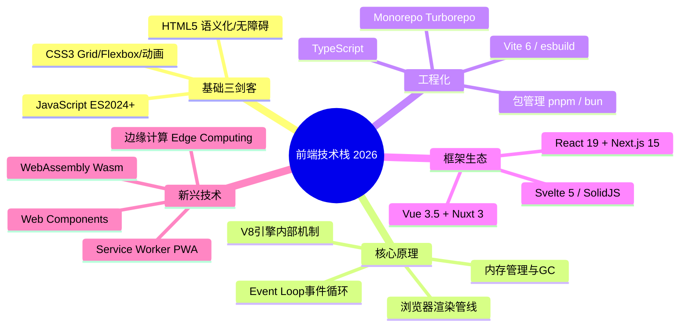
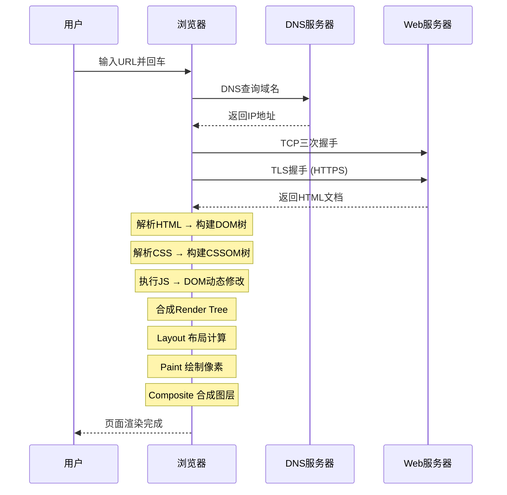
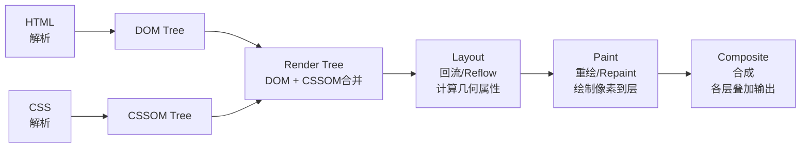
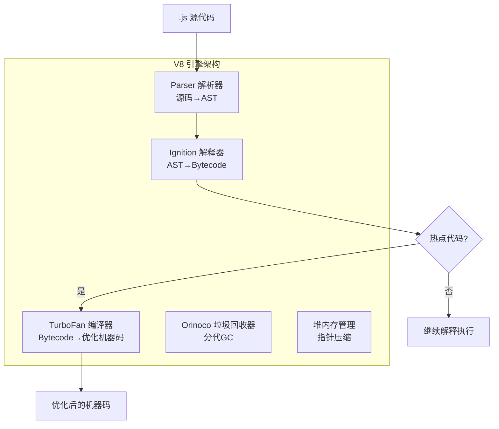
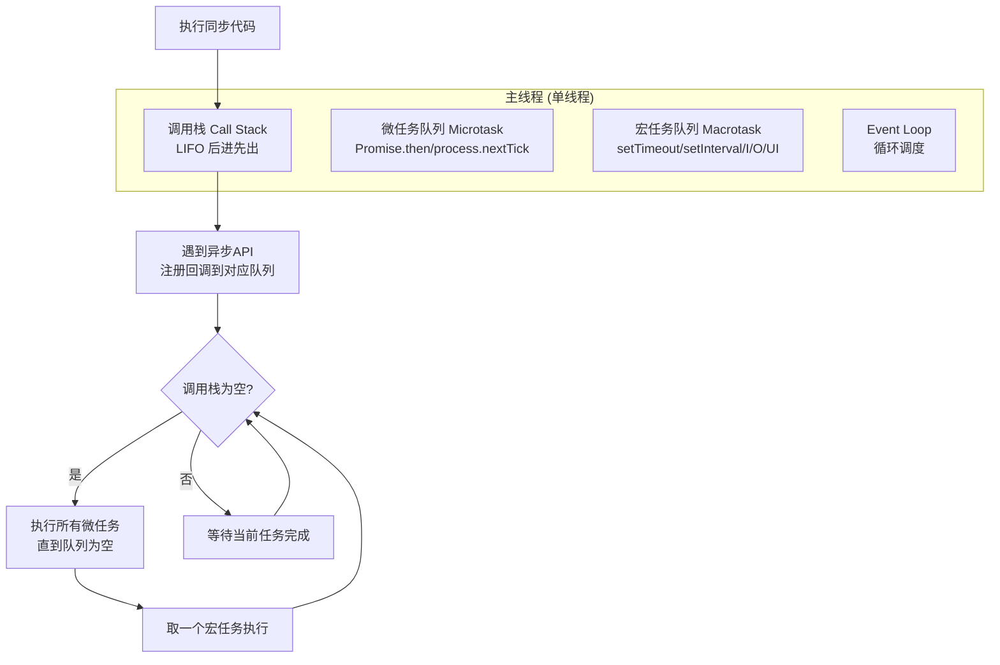
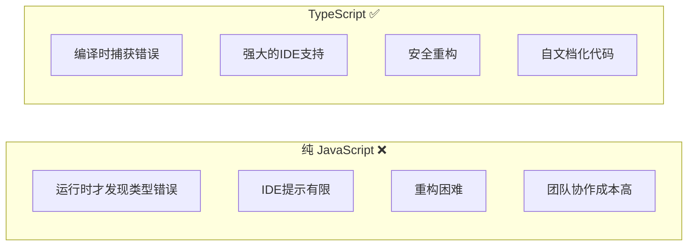
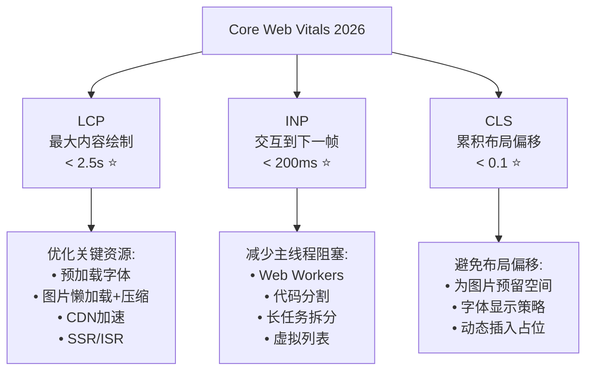

# 程序员练级攻略：前端基础和底层原理-[2026重制版]

> **核心变更说明**：本文基于2018年版全面升级，新增React 19新特性、Next.js 15 App Router、Vue 3.5 Composition API、TypeScript类型系统、Vite 6构建工具、浏览器渲染管线深度解析、Web Components标准、WebAssembly (Wasm) 入门、Service Worker与PWA等2026年前端核心技术内容。


对于前端的学习和提高，我的基本思路是这样的：**前端的三个最基本的东西HTML5、CSS3和JavaScript（ES2024+）是必须要学好的**。我一直认为学习任何知识都要从基础出发，所以这篇文章我会着重介绍基础知识和基本原理，尤其是JavaScript的核心原理、浏览器的工作原理和网络协议HTTP，这些都是前端程序员需要花力气啃下来的硬骨头。

## 🎯 前端技术体系



## 🌐 浏览器渲染原理深度解析

### 从URL到页面完整流程



### 渲染管线五大步骤



**关键性能指标**：
- **FP (First Paint)**: 首次绘制
- **FCP (First Contentful Paint)**: 首次有内容绘制
- **LCP (Largest Contentful Paint)**: 最大内容绘制 (**Core Web Vital ⭐**)
- **TTI (Time to Interactive)**: 可交互时间
- **CLS (Cumulative Layout Shift)**: 累积布局偏移 (**Core Web Vital ⭐**)

## ⚙️ JavaScript 深度解析

### V8 引擎工作原理



### Event Loop 事件循环（核心！）



**任务优先级**：`同步代码 > 微任务 > 宏任务` (UI Rendering 在宏任务之间)

```javascript
// 经典面试题：输出顺序？
console.log('1 - 同步');

setTimeout(() => console.log('2 - setTimeout'), 0);

Promise.resolve().then(() => console.log('3 - Promise'));

console.log('4 - 同步');

// 输出: 1, 4, 3, 2
// 解释: 同步(1,4) → 微任务(Promise 3) → 宏任务(setTimeout 2)
```

### JavaScript 内存管理

```javascript
// 常见内存泄漏场景

// ❌ 1. 意外的全局变量
function leak1() {
    leaked = "I'm global!";  // 没有 var/let/const
}

// ❌ 2. 闭包引用
function leak2() {
    const bigData = new Array(1000000).fill('*');
    return function() {
        // 闭包保持对 bigData 的引用，无法释放
        return bigData.length;
    };
}

// ❌ 3. 被遗忘的定时器
function leak3() {
    const data = new Array(1000000).fill('*');
    setInterval(() => {
        console.log(data.length);  // data 无法被GC
    }, 1000);
}

// ✅ 正确做法：手动清理
function goodPractice() {
    let data = new Array(1000000).fill('*');
    const timer = setInterval(() => { /* ... */ }, 1000);

    return () => {
        clearInterval(timer);  // 清理定时器
        data = null;          // 解除引用
    };
}
```

## 📝 TypeScript 核心类型系统

### 为什么需要 TypeScript？



### TypeScript 类型系统要点

```typescript
// 1. NoInfer<T> - 禁止泛型参数推断 (TS 5.4+)
function createArray<T>(length: number, value: NoInfer<T>): T[] {
    return Array.from({ length }, () => value);
}
// createArray(3, 'hello') 推断为 string[], 而非 'hello'[]

// 2. 模板字面量类型 (Template Literal Types, TS 4.1+)
type Color = `#${string}`;  // 匹配所有 # 开头的字符串

// 3. satisfies 操作符 - 类型约束但不改变类型 (TS 4.9+)
type RecordKeys = keyof Record<string, unknown>;
const config = {
    api: 'https://api.example.com',
    timeout: 5000,
} satisfies RecordKeys;
// config 保持原始类型，但检查是否满足 RecordKeys

// 4. 条件类型增强
interface Cart {
    items: Product[];
    checkout(): void;
}
type CartKey = keyof Cart;  // 'items' | 'checkout'
```

## 🚀 React 19 + Next.js 15

### React 19 核心变化

| 特性 | 说明 |
|------|------|
| **Actions** | 简化异步操作，替代 useEffect |
| **Server Components** | 服务端组件默认 |
| **use() Hook** | 统一资源获取 |
| **Ref as a prop** | ref 直接作为props传递 |
| **Hydration 改进** | 更好的水合体验 |

### Next.js 15 App Router 示例

```tsx
// app/users/[id]/page.tsx
import { Metadata } from 'next';
import { getUser } from '@/lib/data';

// 服务端组件（默认）
export async function generateMetadata({ params }): Promise<Metadata> {
    const { id } = await params;  // Next.js 15起params为Promise，需await
    const user = await getUser(id);
    return { title: `${user.name} - 用户详情` };
}

export default async function UserProfile({ params }) {
    const { id } = await params;
    const user = await getUser(id);

    return (
        <main className="max-w-4xl mx-auto py-8">
            <h1 className="text-3xl font-bold">{user.name}</h1>
            
            {/* Client Component 用于交互 */}
            <FollowButton userId={params.id} />
            
            <section className="mt-6">
                <h2>用户信息</h2>
                <pre>{JSON.stringify(user, null, 2)}</pre>
            </section>
        </main>
    );
}
```

## 🛠️ 前端工程化工具链

### Vite 6 vs 传统构建工具对比

| 特性 | Vite 6 | webpack 5 | esbuild |
|------|--------|-----------|---------|
| **启动速度** | **⚡ 极快** (<100ms) | 慢 (数秒) | 极快 |
| **HMR** | **原生ESM** | 需编译 | 支持 |
| **生产构建** | Rollup | 自身 | 内置 |
| **插件生态** | 兼容Rollup | 最丰富 | 较少 |
| **配置复杂度** | **简单** | 复杂 | 简单 |

### Vite 项目配置示例

```typescript
// vite.config.ts
import { defineConfig } from 'vite';
import react from '@vitejs/plugin-react-swc';
import path from 'path';

export default defineConfig({
    plugins: [react()],
    resolve: {
        alias: {
            '@': path.resolve(__dirname, './src'),
        },
    },
    server: {
        port: 3000,
        proxy: {
            '/api': {
                target: 'http://localhost:8080',
                changeOrigin: true,
            },
        },
    },
    build: {
        target: 'es2022',
        sourcemap: true,
        rollupOptions: {
            output: {
                manualChunks: {
                    vendor: ['react', 'react-dom'],
                    utils: ['lodash', 'dayjs'],
                },
            },
        },
    },
});
```

## 📊 性能优化核心指标

### Core Web Vitals (核心Web指标)



### 性能检测工具

| 工具 | 用途 | URL |
|------|------|-----|
| **Lighthouse** | 全面审计 | Chrome DevTools内置 |
| **PageSpeed Insights** | 在线评分 | pagespeed.web.dev |
| **WebPageTest** | 多地点测试 | webpagetest.org |
| **Chrome DevTools Performance** | 本地分析 | 浏览器内置(F12) |

---

**下一篇文章**我们将探讨**前端性能优化和框架**——更深入的性能调优技巧、状态管理方案以及大型前端项目的架构设计。
