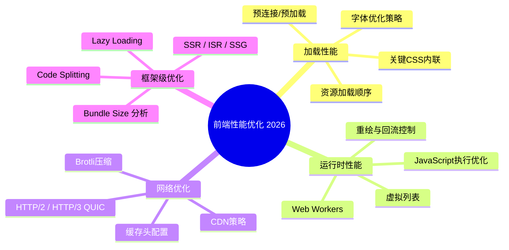
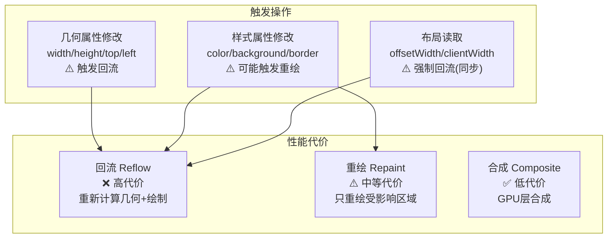
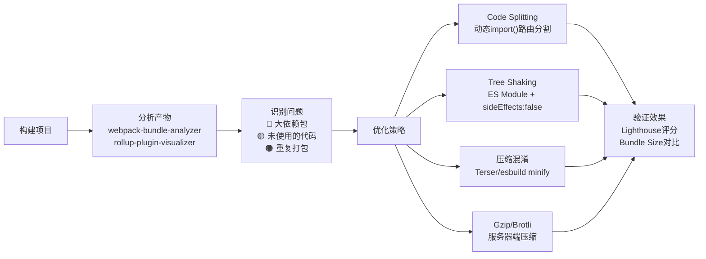
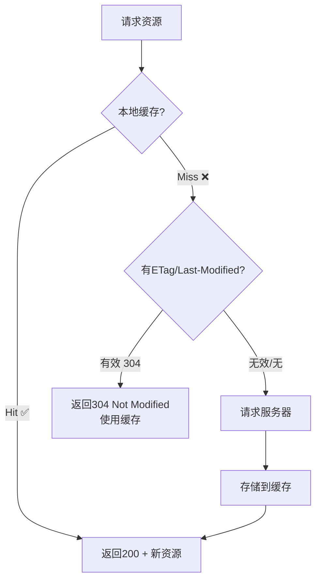

# 程序员练级攻略：前端性能优化和框架-[2026重制版]

> **核心变更说明**：本文基于2018年版全面升级，新增React Server Components性能优化、Next.js ISR/SSR策略选择、Vue 3.5 Reactivity系统优化、Bundle分析工具(webpack-bundle-analyzer)、Tree Shaking深度实践、CSS性能优化(contain/layout/paint)、Web Worker多线程、Service Worker缓存策略、边缘计算(Edge Computing)前端应用等2026年前端性能核心技术。


在掌握了前端基础和底层原理之后，接下来我们需要进入**前端性能优化**和**框架深入**的阶段。性能优化是前端工程师的核心竞争力之一，而深入理解主流框架的内部机制，则是从"会用"到"精通"的关键跨越。

## 🎯 前端性能优化体系



## ⚡ 加载性能优化

### 关键渲染路径 (Critical Rendering Path)

```mermaid
gantt
    title 关键渲染路径优化 (CRP)
    dateFormat X
    axisFormat %s

    section DOM
    HTML解析           :a1, 0, 1

    section CSSOM
    CSS下载             :b1, 0, 2
    CSS解析             :b2, after b1, 1, 1

    section Render Tree
    构建Render Tree     :c1, after a1, 1, 1

    section Layout与Paint
    布局计算           :d1, after c1, 1, 1
    绘制像素           :e1, after d1, 1, 1

    section JavaScript
    JS下载与执行       :f1, 0, 5
```

### 实战优化策略

#### 1. 关键CSS内联

```html
<!-- index.html -->
<!DOCTYPE html>
<html>
<head>
    <!-- ✅ 关键CSS内联，消除渲染阻塞 -->
    <style>
        /* 只包含首屏需要的样式 */
        body { margin: 0; font-family: system-ui; }
        .hero { min-height: 100vh; display: flex; align-items: center; }
        .loading { animation: spin 1s linear infinite; }
        @keyframes spin { to { transform: rotate(360deg); } }
    </style>
    
    <!-- ❌ 其余CSS异步加载 -->
    <link rel="preload" href="/styles.css" as="style" onload="this.onload=null;this.rel='stylesheet'">
    <noscript><link rel="stylesheet" href="/styles.css"></noscript>
</head>
<body>
    <div class="hero">
        <!-- 首屏内容立即可见 -->
        <h1>Hello World</h1>
    </div>
    
    <!-- 异步加载非关键JS -->
    <script src="/app.js" defer></script>
</body>
</html>
```

#### 2. 资源提示 (Resource Hints)

```html
<head>
    <!-- DNS预解析 -->
    <link rel="dns-prefetch" href="//cdn.example.com">
    <link rel="dns-prefetch" href="//api.example.com">
    
    <!-- 预连接 (TCP + TLS握手) -->
    <link rel="preconnect" href="//fonts.googleapis.com" crossorigin>
    
    <!-- 预加载重要资源 -->
    <link rel="preload" as="font" href="/fonts/inter-var-latin.woff2" type="font/woff2" crossorigin>
    <link rel="preload" as="image" href="/hero-banner.webp">
</head>
```

## 🔄 运行时性能优化

### 回流(Reflow) vs 重绘(Repaint) 对比



### 性能优化技巧清单

| 技巧 | 说明 | 影响 |
|------|------|------|
| **使用 transform 替代 top/left** | GPU加速合成 | 避免回流 |
| **will-change: transform** | 提示浏览器优化 | 创建独立层 |
| **虚拟列表** | 只渲染可视区域 | O(1) 渲染 |
| **防抖/节流** | 控制事件频率 | 减少JS执行 |
| **requestAnimationFrame** | 动画帧同步 | 流畅60fps |
| **IntersectionObserver** | 元素可见性检测 | 替代scroll事件 |

### 虚拟列表实现示例

```tsx
// VirtualList.tsx - 高性能长列表组件
import { useRef, useState, useEffect, useCallback } from 'react';

interface VirtualListProps<T> {
    items: T[];
    itemHeight: number;
    containerHeight: number;
    renderItem: (item: T, index: number) => React.ReactNode;
}

export function VirtualList<T>({
    items,
    itemHeight,
    containerHeight,
    renderItem,
}: VirtualListProps<T>) {
    const [scrollTop, setScrollTop] = useState(0);
    const containerRef = useRef<HTMLDivElement>(null);

    // 可见区域起始索引
    const startIndex = Math.floor(scrollTop / itemHeight);
    // 可见区域结束索引 (+2用于缓冲)
    const endIndex = Math.min(
        startIndex + Math.ceil(containerHeight / itemHeight) + 2,
        items.length
    );

    // 可见项
    const visibleItems = items.slice(startIndex, endIndex);

    // 总内容高度
    const totalHeight = items.length * itemHeight;
    // 上方偏移量
    const offsetY = startIndex * itemHeight;

    const handleScroll = useCallback((e: React.UIEvent<HTMLDivElement>) => {
        setScrollTop(e.currentTarget.scrollTop);
    }, []);

    return (
        <div
            ref={containerRef}
            onScroll={handleScroll}
            style={{ height: containerHeight, overflow: 'auto' }}
        >
            {/* 占位容器 */}
            <div style={{ height: totalHeight, position: 'relative' }}>
                {/* 可视窗口 */}
                <div style={{ transform: `translateY(${offsetY}px)` }}>
                    {visibleItems.map((item, i) =>
                        renderItem(item, startIndex + i)
                    )}
                </div>
            </div>
        </div>
    );
}

// 使用：10万条数据也流畅
<VirtualList
    items={Array.from({ length: 100000 }, (_, i) => ({ id: i }))}
    itemHeight={50}
    containerHeight={600}
    renderItem={(item) => <div className="p-4 border-b">Item {item.id}</div>}
/>
```

## 📦 打包体积优化

### Bundle 分析工作流



### Next.js 代码分割最佳实践

```typescript
// app/dashboard/page.tsx - 使用动态导入实现路由级代码分割
import { useState } from 'react';
import dynamic from 'next/dynamic';

// ✅ 懒加载重型组件（不阻塞首屏）
const HeavyChart = dynamic(() => import('./HeavyChart'), {
    loading: () => <div className="animate-pulse h-64 bg-gray-200 rounded" />,
    ssr: false,  // 仅客户端渲染
});

// ✅ 条件加载（按需）
const AdminPanel = dynamic(() => import('./AdminPanel'), {
    loading: null,  // 不显示loading
});

export default function DashboardPage() {
    const [isAdmin] = useState(false);

    return (
        <main>
            <h1>Dashboard</h1>
            <HeavyChart />
            {isAdmin && <AdminPanel />}
        </main>
    );
}
```

### webpack-bundle-analyzer 配置

```javascript
// webpack.config.js 或 next.config.js
const withBundleAnalyzer = require('@next/bundle-analyzer')({
    enabled: process.env.ANALYZE === 'true',
});

module.exports = withBundleAnalyzer({
    // ...其他配置
});
```

运行 `ANALYZE=true npm run build` 即可查看可视化报告。

## 🌐 网络层优化

### HTTP 缓存策略矩阵



### Nginx 缓存配置示例

```11-Nginx基础概述
# /etc/11-Nginx基础概述/conf.d/cache.conf

# 静态资源 - 强缓存（带hash的文件）
location ~* \.(js|css|png|jpg|jpeg|gif|ico|svg|woff|woff2)$ {
    expires 1y;
    add_header Cache-Control "public, immutable";
    access_log off;
}

# HTML文件 - 协商缓存
location ~* \.html$ {
    expires -1;
    add_header Cache-Control "no-cache";
    etag on;
}

# API响应 - 不缓存
location /api/ {
    add_header Cache-Control "no-store";
    proxy_pass http://backend:8080;
}

# Brotli压缩
gzip on;
gzip_vary on;
gzip_types text/plain text/css application/json application/javascript image/svg+xml;
gzip_proxied any;
brotli on;
brotli_comp_level 6;
brotli_types text/plain text/css application/json application/javascript image/svg+xml;
```

## 🧪 性能测试与监控

### Lighthouse CI 集成

```json
// package.json
{
    "scripts": {
        "lighthouse": "lighthouse http://localhost:3000 --output=html --output-path=./reports",
        "lighthouse:ci": "lhci autorun --collect.url=http://localhost:3000"
    },
    "devDependencies": {
        "@lhci/cli": "^0.14.0"
    }
}
```

```yaml
# .github/workflows/lighthouse.yml
name: Lighthouse CI
on: [push]
jobs:
  lighthouse:
    runs-on: ubuntu-latest
    steps:
      - uses: actions/checkout@v4
      - uses: actions/setup-node@v4
      - run: npm ci
      - run: npm run build
      - run: npm run start &
      - run: npx wait-on http://localhost:3000
      - run: npm run lighthouse:ci
      - uses: actions/upload-artifact@v4
        with:
          name: lighthouse-report
          path: ./reports
```

### Core Web Vitals 监控

```typescript
// lib/web-vitals.ts - 生产环境性能监控
import { onCLS, onINP, onLCP, onFCP, onTTFB } from 'web-vitals';
import type { Metric } from 'web-vitals';

// 发送到后端分析平台
function sendToAnalytics(metric: Metric) {
    const body = JSON.stringify({
        name: metric.name,
        value: metric.value,
        rating: metric.rating, // good | needs-improvement | poor
        url: window.location.href,
        timestamp: Date.now(),
    });

    if (navigator.sendBeacon) {
        navigator.sendBeacon('/api/vitals', body);
    } else {
        fetch('/api/vitals', { method: 'POST', body });
    }
}

// 注册所有Core Web Vitals指标
onCLS(sendToAnalytics);
onINP(sendToAnalytics);
onLCP(sendToAnalytics);
onFCP(sendToAnalytics);
onTTFB(sendToAnalytics);
```

## 📚 推荐资源

### 必读书籍

| 书名 | 作者 | 重点 |
|------|------|------|
| **《High Performance Browser Networks》** | Ilya Grigorik | 网络性能圣经 |
| **《Web Performance in Action》** | Jeremy Wagner | 全面实战指南 |
| **《Designing for Performance》** | Tom Barker | 设计阶段优化 |

### 工具推荐

| 类别 | 工具 | 用途 |
|------|------|------|
| **审计** | Lighthouse | Google官方审计工具 |
| **分析** | Chrome DevTools Performance | 详细时间线 |
| **监控** | Sentry Performance | 生产环境RUM |
| **Bundle** | webpack-bundle-analyzer | 包体积可视化 |
| **CI** | Lighthouse CI | PR级别自动检测 |

---

**下一篇文章**我们将探讨**UI/UX设计**——设计原则、原子设计方法论、Material Design/Tailwind CSS设计系统以及设计师必备的设计思维。
