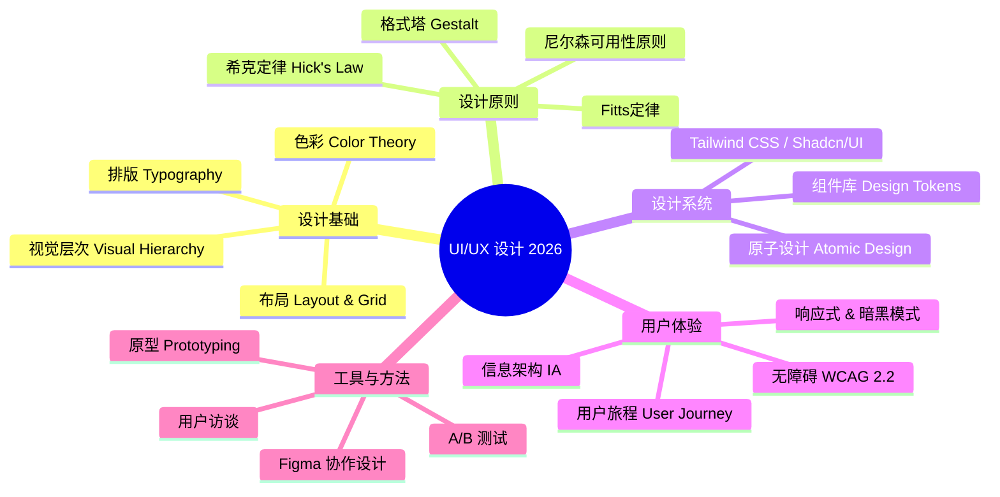
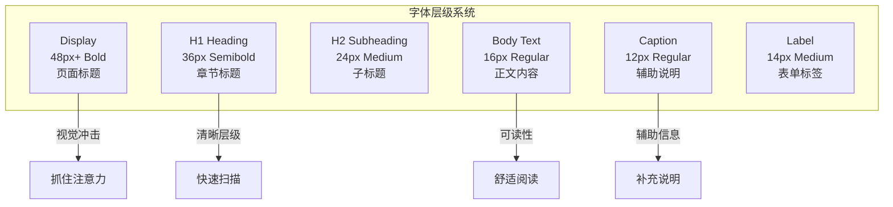
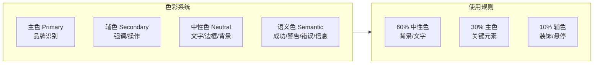
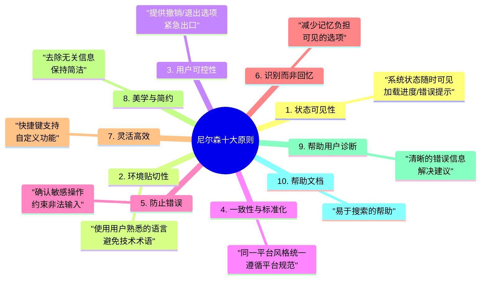
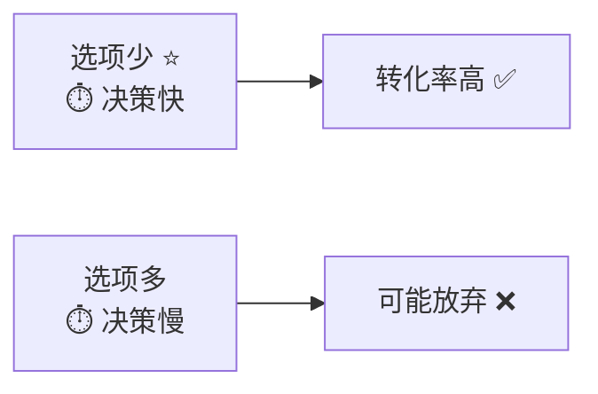
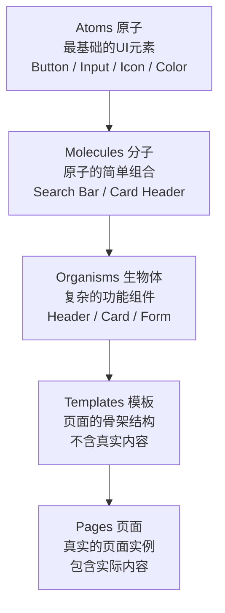
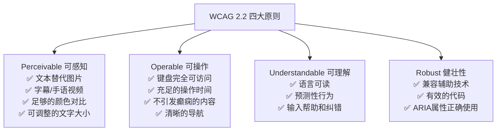
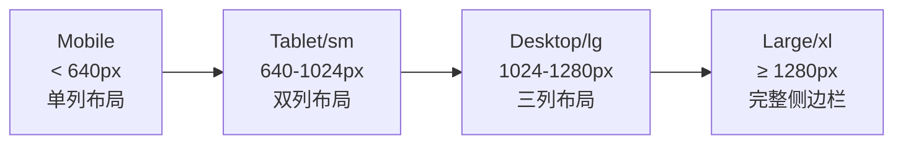

# 程序员练级攻略：UI-UX设计-[2026重制版]

> **核心变更说明**：本文基于2018年版全面升级，新增原子设计(Atomic Design)方法论、Figma协作设计、设计系统(Design System)构建、Tailwind CSS实用优先、无障碍设计(WCAG 2.2)、暗黑模式/响应式设计最佳实践、微交互(Micro-interactions)、用户研究方法、A/B测试与数据驱动设计等2026年UI/UX设计核心内容。


**程序员需要懂设计吗？我的答案是肯定的——你不需要成为专业设计师，但必须具备基本的设计素养和审美能力。** 在现代软件开发中，前端工程师往往承担着"实现设计"的角色，理解设计原则能让你更好地还原设计稿，甚至在设计师缺席时也能产出合格的界面。

## 🎨 UI/UX 知识体系



## 📐 设计基础四要素

### 排版 (Typography)

排版是界面设计的基石：



**现代Web字体推荐**：
- **Inter**: 最流行的UI字体（GitHub、Vercel等使用）
- **Geist**: Vercel出品的Inter继任者
- **Plus Jakarta Sans**: Google Fonts收录的开源替代
- **Noto Sans SC**: 中文场景首选

### 色彩理论 (Color Theory)



**WCAG 2.2 对比度要求**：
| 等级 | 正常文本 | 大文本(18pt+/14pt bold) |
|------|---------|------------------------|
| **AA** | 4.5:1 | 3:1 |
| **AAA** | 7:1 | 4.5:1 |

```css
/* ✅ 通过AA标准 */
.text-primary { color: #1e40af; } /* 对比度 8.59:1 */
.bg-white { background-color: #ffffff; }

/* ❌ 未通过 */
.text-light { color: #93c5fd; } /* 对比度 2.07:1 - 不合格! */
```

## 🔬 核心设计原则

### 尼尔森十大可用性原则（Jakob Nielsen）



### Fitts 定律在UI中的应用

> 目标越大或距离越近，点击所需时间越短。

**实际应用**：
1. **按钮尺寸**：最小点击区域 44×44px（Apple HIG）
2. **导航栏**：重要操作放在屏幕边缘（无限大目标）
3. **下拉菜单**：鼠标靠近时自动展开（减少距离）

### 希克定律 (Hick's Law)

> 选项越多，决策时间越长。



**优化策略**：
- 表单字段分组（每步≤7个选项）
- 下拉菜单限制数量
- 使用搜索替代长列表
- 渐进式披露信息

## 🧩 原子设计 (Atomic Design)

### 五层原子模型



### 实战示例：Shadcn/UI 组件体系

```tsx
// 基于 Tailwind CSS + Radix UI 的原子组件

// === Atom: Button ===
interface ButtonProps extends React.ButtonHTMLAttributes<HTMLButtonElement> {
    variant?: 'default' | 'destructive' | 'outline' | 'secondary' | 'ghost' | 'link';
    size?: 'default' | 'sm' | 'lg' | 'icon';
}

const Button = React.forwardRef<HTMLButtonElement, ButtonProps>(
    ({ className, variant = 'default', size = 'default', ...props }, ref) => {
        return (
            <button
                ref={ref}
                className={cn(
                    // 基础样式
                    'inline-flex items-center justify-center whitespace-nowrap rounded-md text-sm font-medium',
                    // 变体样式
                    variantStyles[variant],
                    // 尺寸样式
                    sizeStyles[size],
                    // 焦点样式（无障碍！）
                    'focus-visible:outline-none focus-visible:ring-2 focus-visible:ring-offset-2',
                    // 禁用状态
                    'disabled:pointer-events-none disabled:opacity-50',
                    className
                )}
                {...props}
            />
        );
    }
);

// === Molecule: Search Input ===
function SearchInput({ onSearch, placeholder = '搜索...' }) {
    const [value, setValue] = useState('');
    
    return (
        <div className="flex items-center gap-2 rounded-lg border px-3 py-2">
            <SearchIcon className="h-4 w-4 text-muted-foreground" />
            <Input
                value={value}
                onChange={(e) => setValue(e.target.value)}
                onKeyDown={(e) => e.key === 'Enter' && onSearch(value)}
                placeholder={placeholder}
                className="border-0 focus-visible:ring-0"
            />
            {value && (
                <Button variant="ghost" size="icon" onClick={() => setValue('')}>
                    <XIcon className="h-4 w-4" />
                </Button>
            )}
        </div>
    );
}

// === Organism: UserCard ===
function UserCard({ user }: { user: User }) {
    return (
        <Card>
            <CardHeader className="flex-row items-center gap-4">
                <Avatar src={user.avatar} alt={user.name} />
                <div className="flex-1">
                    <CardTitle>{user.name}</CardTitle>
                    <CardDescription>@{user.handle}</CardDescription>
                </div>
                <Button variant="outline" size="sm">关注</Button>
            </CardHeader>
            <CardContent>
                <p className="text-sm text-muted-foreground">{user.bio}</p>
            </CardContent>
        </Card>
    );
}
```

## ♿ 无障碍设计 (Accessibility / a11y)

### WCAG 2.2 四大原则 (POUR)



### React + ARIA 无障碍实践

```tsx
// ✅ 无障碍的模态框组件
import { useEffect, useRef, useCallback } from 'react';

function Modal({ isOpen, onClose, title, children }) {
    const modalRef = useRef<HTMLDivElement>(null);
    const previousFocusRef = useRef<HTMLElement>(null);

    // 打开时保存焦点，关闭时恢复
    useEffect(() => {
        if (isOpen) {
            previousFocusRef.current = document.activeElement as HTMLElement;
            modalRef.current?.focus();
            
            // 捕获焦点（焦点陷阱）
            document.addEventListener('keydown', handleKeyDown);
            document.body.style.overflow = 'hidden';
        }
        
        return () => {
            document.removeEventListener('keydown', handleKeyDown);
            document.body.style.overflow = '';
            previousFocusRef.current?.focus();
        };
    }, [isOpen]);

    // ESC关闭 + 焦点陷阱
    const handleKeyDown = useCallback((e: KeyboardEvent) => {
        if (e.key === 'Escape') onClose();
        
        // Tab焦点循环
        if (e.key === 'Tab' && modalRef.current) {
            trapFocus(e, modalRef.current);
        }
    }, [onClose]);

    if (!isOpen) return null;

    return (
        <div
            role="presentation"
            onClick={onClose}
            className="fixed inset-0 bg-black/50 z-40"
        >
            {/* 模态框内容 */}
            <div
                ref={modalRef}
                role="dialog"
                aria-modal="true"
                aria-labelledby="modal-title"
                aria-describedby="modal-description"
                className="fixed left-1/2 top-1/2 -translate-x-1/2 -translate-y-1/2 rounded-lg bg-white p-6 shadow-xl z-50"
                onClick={(e) => e.stopPropagation()}  // 防止冒泡关闭
            >
                <h2 id="modal-title">{title}</h2>
                <div id="modal-description">{children}</div>
                
                <button
                    onClick={onClose}
                    aria-label="关闭对话框"
                    className="absolute right-4 top-4 p-2 hover:bg-gray-100 rounded"
                >
                    ✕
                </button>
            </div>
        </div>
    );
}
```

### 无障碍检查清单

| 检查项 | 工具 | 说明 |
|--------|------|------|
| **颜色对比度** | [Contrast Checker](https://webaim.org/resources/contrastchecker/) | AA/AAA级别 |
| **键盘导航** | 手动测试 | Tab顺序合理 |
| **屏幕阅读器** | VoiceOver/NVDA/JAWS | 语义正确 |
| **ARIA验证** | axe DevTools | 自动检测问题 |
| **焦点管理** | Chrome DevTools | Focus ring可见 |

## 🌙 暗黑模式 & 响应式设计

### 暗黑模式实现方案

```typescript
// lib/theme.ts - 暗黑模式管理
type Theme = 'light' | 'dark' | 'system';

// CSS变量定义（Tailwind方式）
const themeConfig = {
    light: {
        '--background': '0 0% 100%',
        '--foreground': '222.2 84% 4.9%',
        '--card': '0 0% 100%',
        '--primary': '222.2 47.4% 11.2%',
        '--muted': '210 40% 96.1%',
    },
    dark: {
        '--background': '222.2 84% 4.9%',
        '--foreground': '210 40% 98%',
        '--card': '222.2 84% 4.9%',
        '--primary': '210 40% 98%',
        '--muted': '217.2 32.6% 17.5%',
    }
};

// 切换函数
function setTheme(theme: Theme) {
    const root = window.document.documentElement;
    
    if (theme === 'system') {
        const systemTheme = window.matchMedia('(prefers-color-scheme: dark)').matches
            ? 'dark'
            : 'light';
        root.classList.remove('light', 'dark');
        root.classList.add(systemTheme);
    } else {
        root.classList.remove('light', 'dark');
        root.classList.add(theme);
    }

    localStorage.setItem('theme', theme);
}
```

### 响应式断点系统



## 🛠️ 设计工具推荐

| 类别 | 工具 | 特点 |
|------|------|------|
| **UI设计** | Figma | 行业标准，实时协作 |
| **原型** | Framer | 高保真交互原型 |
| **图标** | Lucide Icons | 开源、一致性强 |
| **配色** | Coolors.co | 配色生成器 |
| **字体** | Fontshare | 免费商用字体 |
| **无障碍** | Stark for Figma | 一键a11y检测 |
| **手绘** | Excalidraw | 白板风格的绘图工具 |

---

**下一篇文章**我们将探讨**技术资源集散地**——汇总2026年最值得关注的免费学习资源、交互式教程、开源项目和社区。
