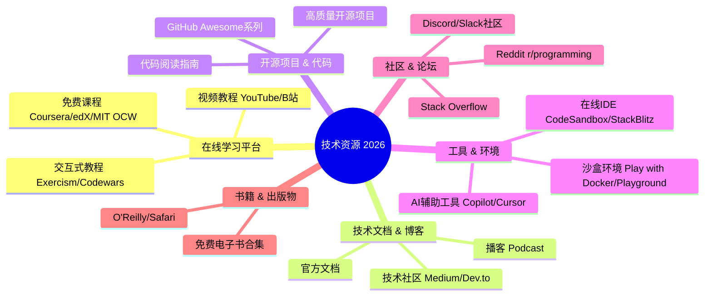
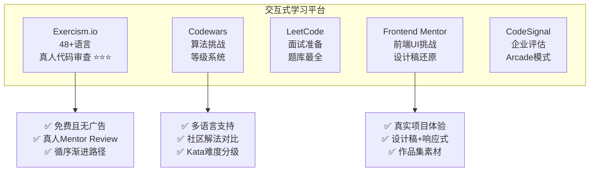
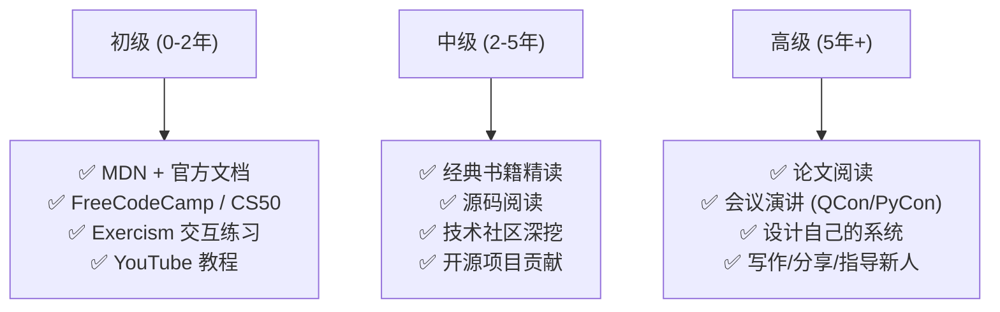

# 程序员练级攻略：技术资源集散地-[2026重制版]

> **核心变更说明**：本文基于2018年版全面升级，新增2026年最新免费学习平台、交互式编程教程、AI辅助学习工具、高质量开源项目推荐、技术社区/播客/Podcast精选、开发者社区与论坛、在线沙盒环境、技术书籍免费获取渠道等2026年程序员必备资源地图。


**在信息爆炸的时代，找到高质量的学习资源比学习本身更重要。** 这篇文章我将为你整理一份2026年的程序员技术资源清单——从入门到精通，从理论到实践，从免费到付费，覆盖你成长道路上的每一个阶段。

## 🎯 资源分类总览



## 📚 在线学习平台

### 大学级别免费课程

| 平台 | URL | 特色 | 推荐课程 |
|------|-----|------|---------|
| **MIT OpenCourseWare** | ocw.mit.edu | MIT官方免费课程 | 6.004 / 6.031 / 6.824 |
| **Stanford Online** | online.stanford.edu | 斯坦福公开课 | CS144 / CS229 |
| **CS50 (Harvard)** | cs50.harvard.edu | **最推荐的计算机导论** | CS50x |
| **Coursera** | coursera.org | 大学合作证书 | Andrew Ng ML专项 |
| **edX** | edx.org | MIT/Harvard/Berkeley | CS169.1x 软件工程 |
| **Khan Academy** | khanacademy.org | 基础友好 | 计算机科学基础 |

### 交互式编程学习（强烈推荐⭐）



### AI 辅助学习工具（2025-2026新趋势）

| 工具 | 用途 | 特点 |
|------|------|------|
| **GitHub Copilot** | 代码补全 | 多模型支持，IDE集成 |
| **Cursor** | AI编辑器 | 对话式编程，内置Agent |
| **ChatGPT / Claude** | 概念解释 | 学习新技术最快方式 |
| **Phind** | 技术搜索 | 面向开发者的搜索引擎 |
| **ExplainCode.ai** | 代码解读 | 一键解释复杂代码 |
| **Warp Terminal** | AI终端 | 自然语言转命令 |

## 📖 官方文档与技术社区

### 必收藏的官方文档

| 技术 | 文档地址 | 备注 |
|------|---------|------|
| **MDN Web Docs** | developer.mozilla.org | Web开发圣经 |
| **Python Docs** | docs.python.org | Python权威参考 |
| **Rust Book** | doc.rust-lang.org/book | Rust最佳入门 |
| **React Docs** | react.dev | 新版文档，交互式示例 |
| **Next.js Docs** | nextjs.org/docs | 全栈框架指南 |
| **PostgreSQL Docs** | www.postgresql.org/docs | 数据库权威 |
| **Linux Man Pages** | man7.org/linux/man-pages | 系统调用/库函数 |

### 高质量技术社区（中文）

| 博客/作者 | 方向 | 特点 |
|-----------|------|------|
| **酷壳 (coolshell.cn)** | 综合技术 | 深度技术文章 |
| **阮一峰的网络日志** | 前端/Web | 入门友好，每周科技周刊 |
| **美团技术团队** | 后端/架构 | 大厂实践经验 |
| **阿里云开发者社区** | 云原生/AI | 阿里系技术分享 |
| **字节跳动技术社区** | 大规模系统 | 字节跳动技术沉淀 |
| **InfoQ 中文站** | 架构/DevOps | 行业会议内容 |

### 高质量技术社区（英文）

| 博客/作者 | 方向 | 特点 |
|-----------|------|------|
| **Martin Fowler** | 软件架构 | 架构模式定义者 |
| **Dan Abramov (Overreacted)** | React深度 | React核心团队成员 |
| **The Pragmatic Engineer** | 工程文化 | Gergely Orosz，职业发展 |
| **Julia Evans** | 系统底层 | 漫画风格讲解底层 |
| **Bartosz Milewski** | 函数式编程 | Category Theory for Programmers |
| **Ben Dodson (bendodson.com)** | Apple生态 | iOS/macOS开发 |

### 推荐技术播客 (Podcast)

| 播客 | 语言 | 频率 | 主题 |
|------|------|------|------|
| **软件随想录** | 中文 | 双周 | 技术杂谈 |
| **CodePod** | 中文 | 周更 | 前端技术 |
| **内核恐慌** | 中文 | 不定期 | 操作系统/底层 |
| **The Changelog** | 英文 | 周更 | 开源项目访谈 |
| **Syntax.fm** | 英文 | 周更 | Web开发 |
| **Software Engineering Daily** | 英文 | 日更 | 软件工程全领域 |

## 💻 GitHub 开源项目精选

### Awesome 系列（资源聚合）

| 项目 | 地址 | 内容 |
|------|------|------|
| **[Awesome](https://github.com/sindresorhus/awesome)** | github.com/sindresorhus/awesome | 最全的Awesome列表索引 |
| **[Awesome Python](https://github.com/vinta/awesome-python)** | - | Python资源大全 |
| **[Awesome Go](https://github.com/avelino/awesome-go)** | - | Go语言资源 |
| **[Awesome Java](https://github.com/akullpp/awesome-java)** | - | Java生态系统 |
| **[Awesome Self-Hosted](https://github.com/awesome-selfhosted/awesome-selfhosted)** | - | 自托管应用合集 |

### 值得深入阅读的源码项目

| 项目 | 语言 | Stars | 学习价值 |
|------|------|-------|---------|
| **Redis** | C | 65k+ | 数据结构 + 网络模型 |
| **NGINX** | C | 21k+ | 高性能服务器架构 |
| **Linux Kernel** | C | 170k+ | 操作系统核心 |
| **SQLite** | C | 5k+ | 数据库引擎实现 |
| **V8 JavaScript Engine** | C++ | 26k+ | JS引擎内部机制 |
| **Go Runtime** | Go | 120k+ | 运行时/调度器/GC |
| **TensorFlow** | C++/Python | 185k+ | ML框架设计 |
| **Chromium** | C++ | 100k+ | 浏览器渲染引擎 |

## 🛠️ 在线开发环境

### 云端 IDE 与沙盒

| 工具 | 适用场景 | 特点 |
|------|---------|------|
| **GitHub Codespaces** | 完整开发环境 | VS Code云端版，按需计费 |
| **StackBlitz** | 前端项目 | 即时运行React/Vue/Angular |
| **CodeSandbox** | 前端原型 | 类似Codesandbox，更多模板 |
| **Replit** | 多语言 | 最易用的在线IDE |
| **Gitpod** | PR预览 | 自动为PR创建环境 |
| **Playground (各语言)** | 小段代码测试 | Go/Rust/TypeScript等官方 |

### Docker 在线实验

| 平台 | 地址 | 说明 |
|------|------|------|
| **Play with Docker** | labs.play-with-docker.com | 免费Docker实验环境 |
| **Play with Kubernetes** | labs.play-with-k8s.com | 4小时免费K8s |
| **Katacoda** | katacoda.com (已停) | 交互式场景教程 |

## 🔧 AI 编程助手使用指南

### Prompt Engineering for Learning

```markdown
# 向AI提问的最佳实践模板

## 角色设定
"你是一位资深[技术领域]工程师，有10年以上经验..."

## 任务描述
"请帮我解释[概念]，要求："
"- 使用类比和生活中的例子"
"- 包含代码示例"
"- 指出常见的误区"

## 约束条件
"- 回答控制在500字以内"
"- 使用中文"
"- 标注重点术语"

## 进阶追问
"请给出一个可以运行的完整示例..."
"这个方案有什么优缺点？"
"有没有更好的替代方案？"
```

## 👥 开发者社区

### 论坛与问答

| 社区 | 类型 | 特点 |
|------|------|------|
| **Stack Overflow** | 问答 | 全球最大程序员问答站 |
| **SegmentFault** | 问答 | 中文技术问答 |
| **知乎 - 编程话题** | 讨论 | 中文讨论氛围好 |
| **Reddit r/programming** | 新闻/讨论 | 国际热门技术话题 |
| **Hacker News** | 新闻/讨论 | 创业圈+技术圈 |
| **V2EX** | 综合 | 中国程序员社区 |
| **掘金** | 文章 | 前端为主的技术社区 |

### Discord/Slack 技术社区

| 社区 | 主题 | 加入方式 |
|------|------|---------|
| **The Odin Project** | Web开发 | discord.gg/theodinproject |
| **Python Discord** | Python | pythondiscord.com |
| **Rust Community** | Rust | rust-lang.org/community |
| **KCD (Kubernetes)** | K8s | kubernetes.community |
| **Next.js Discord** | Next.js | nextjs.org/discord |

## 📖 技术书籍获取渠道

### 正版渠道

| 渠道 | 特点 | 价格区间 |
|------|------|---------|
| **O'Reilly Safari** | 电子书+视频订阅 | $49/月 |
| **Manning** | MEAP早期访问 | 单本$30-50 |
| **Packt** | 经常打折 | $5-15/本 |
| **图灵社区** | 中文技术书 | ¥30-80/本 |
| **异步社区** | 人民邮电出版 | ¥30-70/本 |
| **Amazon Kindle** | 电子书 | ¥20-100/本 |

### 免费合法资源

| 资源 | 地址 | 说明 |
|------|------|------|
| **Project Gutenberg** | gutenberg.org | 公版经典著作 |
| **Free Programming Books** | github.com/EbookFoundation/free-programming-books | GitHub上整理的免费书籍 |
| **GitHub Trending Books** | github.com - 搜索 | 各类开源书籍 |

## ✅ 2026年学习建议

### 按阶段选择资源



---

**下一篇文章是本系列的收官之作——我们将探讨《程序员练级攻略的正确打开方式》，总结全部23篇文章的学习路线图和成长方法论。**
