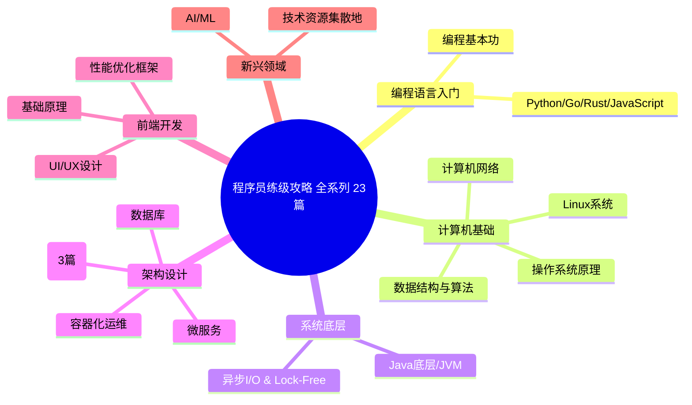
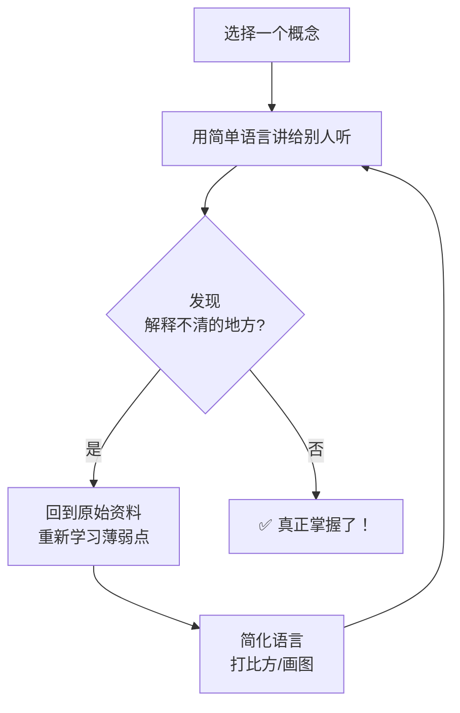
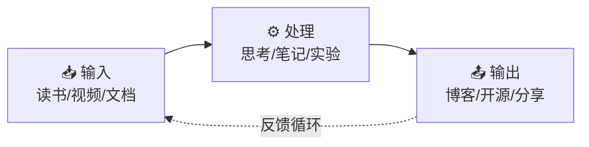
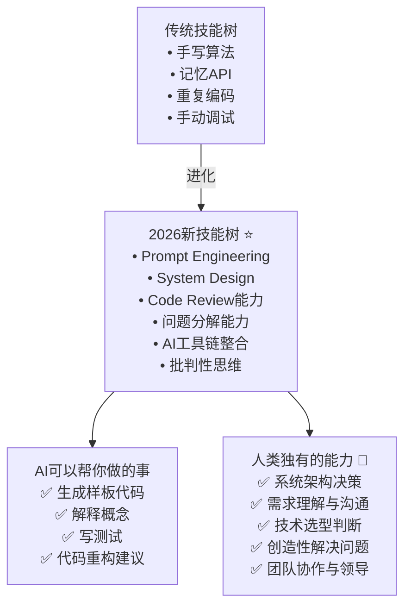
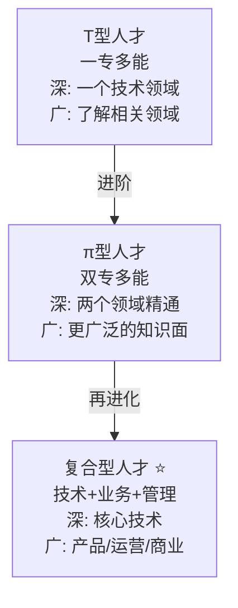
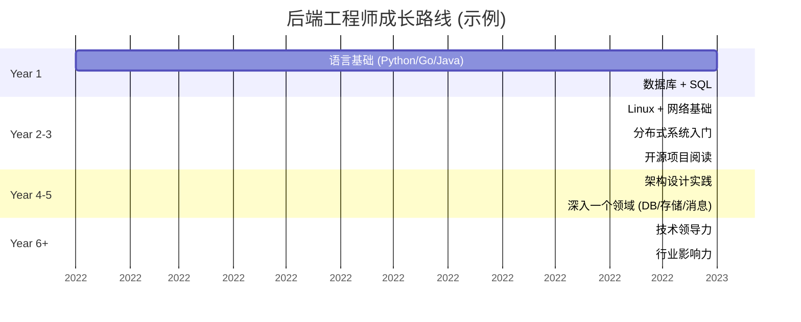
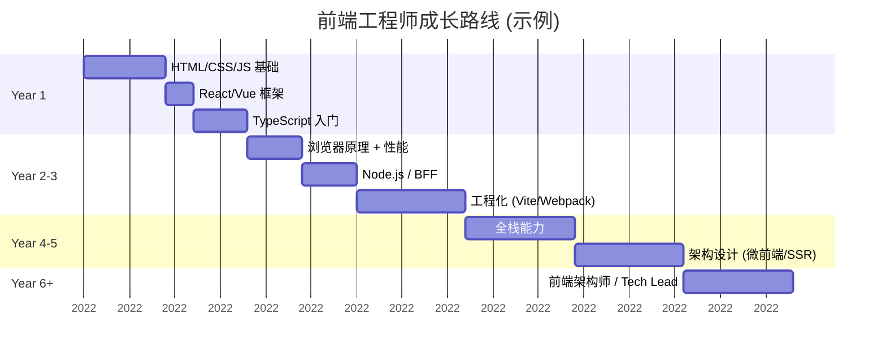
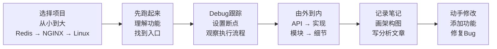
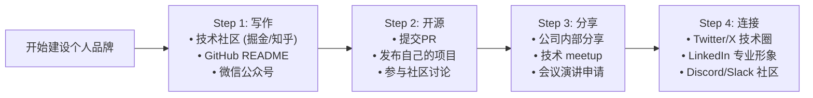

# 程序员练级攻略的正确打开方式-[2026重制版]

> **核心变更说明**：本文基于2018年版全面升级，新增2026年程序员职业发展路径图、AI时代技能树更新、T型人才 vs π型人才 vs 复合型人才对比、技术深度与广度的平衡、终身学习方法论、从初级到CTO的成长路线、开源贡献与个人品牌建设、远程工作与全球化机会等2026年程序员成长核心指南。

**这是《程序员练级攻略》系列的最后一篇文章。** 在本系列前面的22篇文章中，我们系统地覆盖了从编程基础到系统底层、从分布式架构到前端设计、从机器学习到UI/UX的全方位知识体系。但知道"学什么"只是第一步，更重要的是**怎么学**以及**如何将知识转化为能力**。

这篇文章，我想和你聊聊：**如何正确地使用这份练级攻略，以及如何在AI时代持续成长。**

## 🎯 本系列文章总览

## 📈 程序员成长路径

### 职业发展阶段

```mermaid
flowchart LR
    subgraph L1["Level 1: 初级 (0-2年)"]
        J1["能独立完成<br/>分配的任务"]
        J2["掌握1-2门<br/>编程语言"]
        J3["了解基本的数据<br/>结构和算法"]
    end

    subgraph L2["Level 2: 中级 (2-5年)"]
        M1["独立设计和<br/>实现功能模块"]
        M2["理解系统底层<br/>原理"]
        M3["具备代码审查<br/>和优化能力"]
    end

    subgraph L3["Level 3: 高级 (5-8年)"]
        S1["主导系统架构<br/>设计"]
        S2["解决复杂的技术<br/>难题"]
        S3["指导团队成员<br/>成长"]
    end

    subgraph L4["Level 4: 专家 (8年+)"]
        E1["定义技术方向<br/>和标准"]
        E2["跨领域影响力<br/>(开源/演讲/写作)"]
        E3["培养下一代<br/>技术人才"]
    end

    L1 -->|"夯实基础"| L2
    L2 -->|"深入原理<br>+ 广度扩展"| L3
    L3 -->|"建立影响力"| L4

```

### 各阶段核心能力要求

| 阶段 | 技术深度 | 技术广度 | 工程实践 | 软技能 |
|------|---------|---------|---------|--------|
| **初级** | 语言熟练 | 了解生态 | Git/IDE | 沟通协作 |
| **中级** | 原理理解 | 多栈涉猎 | CI/CD/测试 | 技术分享 |
| **高级** | 领域专家 | 架构视野 | 性能调优/安全 | 团队管理 |
| **专家** | 行业前沿 | 技术战略 | 技术决策 | 领导力/影响力 |

## 🧠 学习方法论

### 费曼学习法（最有效的学习方法）

**具体操作**：
1. **选择主题**：比如 "epoll的工作原理"
2. **假装教学**：想象你在给一个5岁的孩子讲解
3. **发现漏洞**：卡住的地方就是你的盲区
4. **回顾补漏**：针对性学习
5. **简化表达**：用自己的话总结

### 刻意练习 (Deliberate Practice)

> 不是所有的练习都是有效的。**刻意练习**需要满足四个条件：

| 条件 | 说明 | 示例 |
|------|------|------|
| **明确目标** | 具体可衡量的目标 | "本周实现一个epoll echo服务器" |
| **专注投入** | 全神贯注，非舒适区 | 不看答案，自己思考 |
| **即时反馈** | 立即知道对错 | 运行测试、代码审查 |
| **重复迭代** | 反复练习直到熟练 | 同一模式多次实现 |

### 输入-处理-输出循环

**关键原则：没有输出的学习是低效的**

## 🤖 AI时代的技能进化

### AI不会取代你，但会用AI的人会

### T型 vs π型 vs 复合型人才

**我的建议**：
- **0-3年**：先成为T型人才，在一个领域深耕
- **3-5年**：拓展第二专长，向π型发展
- **5年+**：补充产品和管理能力，成为复合型人才

## 🗺️ 推荐学习路线图

### 后端工程师路线

### 前端工程师路线

## 📝 实践建议

### 每日/每周/每月习惯

| 周期 | 活动 | 时间投入 |
|------|------|---------|
| **每日** | 写代码（工作之外的项目） | 30min-1h |
| **每日** | 阅读技术文章/文档 | 20-30min |
| **每周** | 总结所学（博客/笔记） | 1-2h |
| **每周** | 开源贡献或Code Review | 2-3h |
| **每月** | 深入学习一个主题 | 8-10h |
| **每季度** | 学习一门新技术/工具 | 20-30h |
| **每年** | 参加一次技术会议 | 2-3天 |

### 如何阅读源码

### 推荐的源码阅读顺序

| 阶段 | 项目 | 语言 | 学习重点 |
|------|------|------|---------|
| **入门** | Redis | C | 数据结构 + 事件驱动 |
| **入门** | LevelDB | C++ | LSM-Tree存储引擎 |
| **进阶** | NGINX | C | 模块化设计 + 高并发 |
| **进阶** | etcd | Go | Raft共识算法实现 |
| **高阶** | Linux Kernel | C | 进程调度/内存管理 |
| **高阶** | V8 Engine | C++ | JIT编译/GC机制 |

## 🌟 建立个人品牌

### 为什么需要个人品牌？

在2026年的技术世界，**个人品牌 = 职业护城河**：

1. **更好的机会**：优质公司主动找你
2. **更高的话语权**：技术决策更有影响力
3. **人脉网络**：连接全球优秀开发者
4. **被动收入**：咨询/培训/写作/演讲

### 个人品牌建设路径

## 🎯 给不同阶段读者的建议

### 给初学者（0-2年）

> **不要急于求成，打好地基比什么都重要。**

1. **选定一门语言深入学习**：不要同时学5门语言
2. **刷算法题**：LeetCode Hot 100，每天1-2道
3. **完成完整项目**：从前端到后端到部署，走通全流程
4. **读经典书籍**：《CSAPP》《SICP》《代码大全》
5. **找导师**：有经验的人带你少走很多弯路

### 给中级开发者（2-5年）

> **开始建立自己的技术体系，而不是被动接收知识。**

1. **深入理解原理**：不只是会用，要知道为什么
2. **阅读源码**：每周花时间读一个优秀项目的代码
3. **参与开源**：从小的PR开始，建立贡献记录
4. **写技术社区**：输出倒逼输入，最好的学习方式
5. **拓展技术广度**：了解前端/运维/产品/设计

### 给高级开发者（5年+）

> **从执行者变成决策者，从个人贡献者变成团队赋能者。**

1. **培养架构思维**：学会做技术选型和权衡
2. **提升软技能**：沟通、谈判、演讲、写作
3. **建立行业认知**：关注技术趋势和商业变化
4. **带团队/带新人**：通过教别人来深化理解
5. **考虑专业化方向**：深耕一个细分领域成为专家

## 📚 本系列文章索引速查

| 编号 | 文章标题 | 核心内容 |
|------|---------|---------|
| 55 | 开篇词 | 攻略目标/2026技术趋势/学习原则 |
| 56 | 零基础启蒙 | Python/JS入门/Blog项目 |
| 57 | 正式入门 | Java/Spring Boot/投票系统 |
| 58 | 程序员修养 | 英文/提问的智慧/Code Review/安全 |
| 59 | 编程语言 | C/C++/Java/Rust/Go |
| 60 | 理论学科 | 算法/网络/OS/编译原理 |
| 61 | 系统知识 | Linux编程/epoll/C10K |
| 62 | 软件设计 | SOLID/设计模式/架构模式 |
| 63 | Linux系统、内存和网络 | 内核/内存分配器/eBPF |
| 64 | 异步I/O模型和Lock-Free编程 | epoll/io_uring/Reactor/CAS |
| 65 | Java底层知识 | 字节码编程/JVM/JDK21新特性 |
| 66 | 数据库 | PostgreSQL17/MySQL8.4 LTS/9.x/Redis7/MongoDB8 |
| 67 | 分布式架构入门 | CAP/BASE/一致性模型/Raft |
| 68 | 经典图书和论文 | DDIA/Paxos/Dynamo/Spanner |
| 69 | 分布式工程设计 | 12-Factor/API Gateway/CQRS |
| 70 | 微服务 | Spring Cloud/gRPC/Service Mesh |
| 71 | 容器化和自动化运维 | Docker/K8s/Helm3/Terraform/OpenTofu |
| 72 | 机器学习和人工智能 | PyTorch/LangChain/RAG/LLM应用 |
| 73 | 前端基础和底层原理 | V8引擎/Event Loop/TypeScript/React19 |
| 74 | 前端性能优化和框架 | Core Web Vitals/Virtual List/SSR |
| 75 | UI/UX设计 | 原子设计/WCAG无障碍/Figma |
| 76 | 技术资源集散地 | 学习平台/开源项目/社区/AI工具 |
| **77** | **正确打开方式** | **学习方法论/成长路径/个人品牌** |

---

## ✨ 最后的话

**写完这23篇文章，我最大的感悟是：技术学习的道路没有终点，但有正确的方法。**

在这个AI飞速发展的时代，**唯一不变的就是变化本身**。今天你学的框架可能明年就过时了，但你建立的**思维方式、解决问题的能力、以及对技术的深刻理解**，这些是不会过时的。

希望这份练级攻略能够成为你技术成长路上的**地图和指南针**。记住：

> **不要只是收藏，要去行动；不要只是阅读，要去实践；不要只是模仿，要去创造。**

祝你在这条路上越走越远，成为一名真正优秀的工程师。

—— 本文档整理团队

---

*本系列文章基于2018年极客时间专栏全面升级至2026年版本，所有技术栈均已更新至最新稳定版本。*
