# 程序员面试攻略（2026重制版）

> **核心变更说明**：本系列文章基于原版《程序员面试攻略》全面重制，整合了以下四大维度的2026年最新要素：
>
> - **面试准备维度**：技术面试已从传统的"刷题+背八股"模式，全面转向**系统设计能力、AI辅助工程实践、以及远程协作能力**的综合评估。简历需要从"技能罗列"升级为**价值叙事**，突出量化成果和AI工具使用经验。
> - **面试技巧维度**：从"面对面白板编程"全面转向**在线协作、异步评估、以及AI辅助的多维度考核**。掌握远程面试最佳实践、应对AI生成答案的策略、薪资谈判新技巧至关重要。
> - **面试风格维度**：从"一刀切"的标准化流程，演变为**高度分化、场景化、以及AI辅助的多元评估体系**。不同类型公司（国际大厂、国内大厂、初创公司、Remote-First）的面试风格差异巨大。
> - **实力建设维度**："技术实力"的定义已从"会写代码"升级为**系统思维、技术判断力、以及持续学习能力的综合体现**。开源贡献和个人品牌建设成为建立不可替代竞争力的关键途径。

---

## 一、面试前的准备

### 1.1 背景知识：为什么面试准备如此重要？

在深入具体的准备策略之前，我们需要先理解一个核心问题：**为什么面试前的准备工作对成功与否至关重要？**

#### 面试的本质是信息不对称的博弈

从信息论的角度来看，面试本质上是一个**信息不对称的博弈过程**：

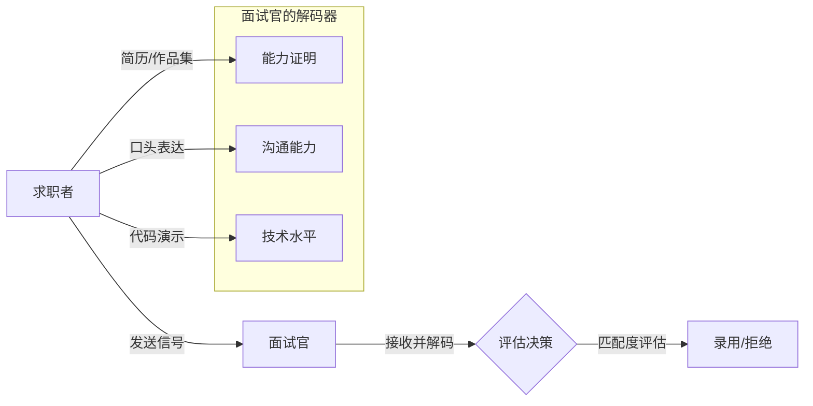

在这个模型中：
- **求职者（发送方）**需要通过简历、表达、代码等多种渠道传递自己的能力信号
- **面试官（接收方）**通过自己的"解码器"（经验、偏见、公司文化）来解读这些信号
- **关键问题**：如果你的编码方式与对方的解码方式不匹配，再优秀的能力也可能被误解

这就是为什么**充分的准备本质上是优化你的编码效率，确保信号能够准确传达**。

#### 2026年技术招聘市场的三大变化

与5年前相比，2026年的技术招聘市场发生了根本性的变化：

| 维度 | 2020年及以前 | 2026年 |
|------|-------------|--------|
| **评估重点** | 算法题 + 框架知识 | System Design + AI工程 + 业务理解 |
| **面试形式** | 现场白板编程 | 在线协作IDE + Take-home Project |
| **技能要求** | 单一语言专家 | 全栈 + AI/ML基础 + 云原生 |
| **软技能权重** | 10-15% | 30-40%（远程协作能力） |
| **薪资谈判** | 年涨幅5-10% | 跳槽涨幅20-50%，AI人才溢价更高 |

**核心洞察**：2026年的企业不再寻找"会写代码的人"，而是在寻找**能够用AI工具放大生产力、具备系统思维、并且能在分布式团队中高效协作的工程师**。

---

### 1.2 2026更新内容：新时代的面试准备清单

#### 简历革命：从"技能罗列"到"价值叙事"

**传统简历 vs 2026年简历**

传统的简历写作遵循"个人信息 → 技能列表 → 工作经历"的线性结构。但在2026年，这种格式已经过时。现代简历需要体现以下特征：

**① 成果导向的价值叙事**

❌ **传统写法**：
> "负责后端API开发，使用Spring Boot和MySQL，参与了订单系统的开发"

✅ **2026年写法**：
> "主导重构订单微服务架构，通过引入事件驱动模式和CQRS，将P99延迟从800ms降低至120ms，支撑了双十一10倍流量峰值；同时利用GitHub Copilot辅助开发，团队交付效率提升40%"

**关键差异**：后者包含了**量化成果、技术决策理由、以及AI工具使用经验**——这三点是2026年面试官最看重的。

**② 技术栈的分层展示**

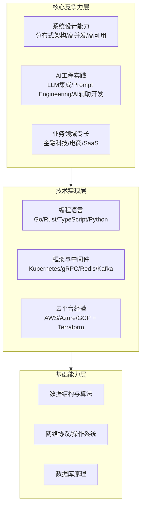

在简历中，你应该用这种**金字塔结构**来展示技术栈：
- **顶层（核心竞争力）**：占据60%篇幅，这是你区别于其他候选人的关键
- **中层（技术实现）**：30%篇幅，证明你能够落地想法
- **底层（基础能力）**：10%篇幅，默认你应该掌握，不需要过度强调

**③ 必须包含的2026新元素**

根据对100+技术岗位JD的分析，以下是2026年简历中**必须出现的关键词**（按重要性排序）：

1. **AI/ML相关**：LLM Integration, RAG, Prompt Engineering, AI-Assisted Development
2. **云原生**：Kubernetes, Docker, Service Mesh (Istio), GitOps
3. **系统设计**：Microservices, Event-Driven Architecture, CQRS, Saga Pattern
4. **数据工程**：Data Pipeline, Stream Processing (Apache Flink/Kafka Streams)
5. **安全意识**：OWASP Top 10, Zero Trust Architecture, DevSecOps
6. **远程协作**：Async Communication Tools, Documentation Culture, Time Zone Management

**简历的ATS优化（Applicant Tracking System）**

2026年，90%以上的大公司使用ATS系统进行初筛。你需要了解以下优化技巧：

- **关键词密度**：确保职位描述中的关键词在你的简历中出现3-5次
- **格式兼容性**：使用简单的排版（避免表格、图形、特殊字体），提交PDF版本
- **量化指标**：ATS算法会给带有数字（如"提升40%"、"节省$200K"）的简历更高评分
- **项目链接**：GitHub、个人博客、技术文章链接会被爬取并作为评估依据

#### 技术知识准备：从"背诵"到"理解"

**System Design Interview 准备（2026版）**

System Design已经成为国内外大厂面试的**必考环节**，其重要性甚至超过了算法题。以下是2026年System Design Interview的标准框架：

**① 必须掌握的设计模式**

| 类别 | 具体模式 | 应用场景 |
|------|---------|---------|
| **数据密集型** | CQRS, Event Sourcing, Materialized View | 高读写分离场景 |
| **分布式一致性** | Two-Phase Commit (2PC), Saga, TCC | 跨服务事务 |
| **高可用设计** | Circuit Breaker, Bulkhead, Rate Limiting | 容错与限流 |
| **缓存策略** | Cache-Aside, Read-Through, Write-Behind | 性能优化 |
| **消息队列** | Pub/Sub, Work Queue, Dead Letter Queue | 异步解耦 |

**② 常见System Design题目分类**

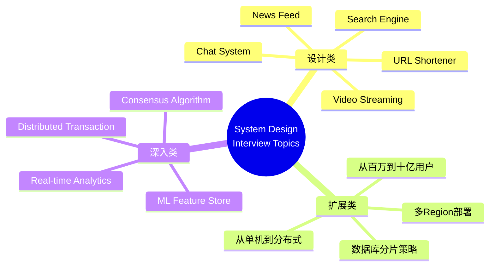

**推荐学习资源**：
- 《Designing Data-Intensive Applications》（DDIA）— 必读经典
- "System Design Primer" on GitHub — 开源免费
- Grokking the System Design Interview — 互动式课程
- ByteByteGo (YouTube) — 图文并茂的系统设计讲解

**AI辅助面试准备的实战方法**

2026年，AI工具已经深度渗透到面试准备的全流程。以下是具体的使用策略：

**① 使用ChatGPT/Claude进行模拟面试**

**Prompt模板**：
```
你是一位资深的技术面试官（来自Google/Amazon级别），现在要对我进行System Design面试。
请出题：设计一个类似于Twitter的社交媒体Feed系统。

要求：
1. 先让我阐述我的设计方案
2. 然后逐步追问细节（数据存储、缓存策略、扩展性、一致性保证）
3. 最后给出评分和改进建议

请开始提问。
```

**② 用AI生成Behavioral Question的回答框架**

对于"Tell me about a time when..."这类行为面试问题，你可以这样使用AI：

```
我需要准备一个关于"解决复杂技术问题"的STAR格式回答。
背景：我们的支付系统在高并发下出现了数据不一致的问题
任务：需要在2周内定位并修复，且不能停机
行动：（请帮我展开3个关键行动点）
结果：（请帮我想一个量化的结果）

请将上述内容组织成一段2分钟的口语化回答，要求真实、有细节、展现问题解决能力和领导力。
```

**③ 利用AI进行代码Review和优化**

在准备算法题时，不要只是刷题。完成一道题后，让AI帮你分析：

- 时间/空间复杂度是否最优？
- 是否有边界情况未考虑？
- 代码可读性和命名是否规范？
- 如果这是生产环境代码，还需要哪些错误处理？

#### 行为面试准备：STAR方法论2.0

行为面试（Behavioral Interview）在国外大厂中占比高达40-50%。2026年的行为面试已经从简单的"讲故事"升级为**结构化的能力评估**。

**STAR方法论回顾**

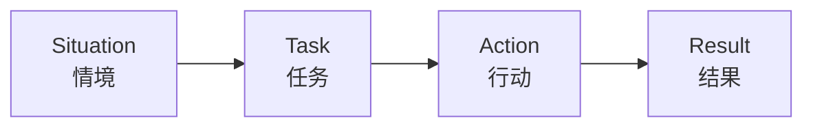

- **Situation（情境）**：描述背景，控制在20%时间
- **Task（任务）**：明确你要解决的问题，10%
- **Action（行动）**：你具体做了什么，50%（最重要）
- **Result（结果）**：量化成果，20%

**2026年新增的STAR+框架**

传统STAR方法在2026年已经不够用了。新的**STAR+L**框架增加了两个维度：

**L = Learning（反思与成长）**

完整的回答结构应该是：
1. **S**：我们在做X项目时遇到了Y挑战...
2. **T**：我的职责是...
3. **A**：我采取了以下措施...（详细展开）
4. **R**：最终结果是...（量化数据）
5. **L**：事后复盘，我学到了...如果再做一次，我会改进...

**为什么要加L？**
- 展现你的**成长型思维**（Growth Mindset）
- 证明你不是在背答案，而是真的经历过
- 让面试官看到你的**自我反思能力**——这对高级岗位至关重要

**2026年高频行为面试问题TOP 10**

基于对Amazon、Google、Meta、字节跳动、阿里巴巴等公司的面试题库分析，以下是最常问的行为问题：

| 排名 | 问题类型 | 考察点 | 建议准备的故事类型 |
|------|---------|--------|------------------|
| 1 | 冲突解决 | 情商、沟通力 | 与产品经理/同事的技术分歧 |
| 2 | 失败经历 | 韧性、学习能力 | 项目延期/Bug导致的事故 |
| 3 | 领导力 | 影响力、赋能 | 无头衔情况下推动变革 |
| 4 | 创新能力 | 思维灵活性 | 引入新技术/AI工具提升效率 |
| 5 | 优先级管理 | 判断力、时间管理 | 多任务并行时的取舍决策 |
| 6 | 远程协作 | 异步沟通、文档能力 | 跨时区团队的项目经验 |
| 7 | 技术深度 | 问题定位能力 | 生产环境故障排查案例 |
| 8 | 教练指导 | Mentorship | 帮助Junior成员成长的例子 |
| 9 | 数据驱动 | 分析能力 | 用数据说服 stakeholders 的案例 |
| 10 | AI伦理 | 责任感 | 使用AI时的伦理考量 |

**准备建议**：为每个类别准备**2-3个不同场景的故事**，总共有15-20个故事库。每个故事都要反复练习，直到能够自然地讲出来，而不是在背诵。

#### 作品集建设：2026年的"敲门砖"

在2026年，**作品集的重要性已经超过了简历本身**。一个优秀的作品集应该包括：

**① GitHub Profile 优化**

- **README.md**：不是简单的自我介绍，而是一个**技术品牌页面**
  - 个人简介（一句话说明你是谁）
  - 技能标签（使用Badge样式）
  - 精选项目（3-5个，每个配图+简短描述）
  - 博客/技术文章链接
  - Contact信息

- **贡献图表**：保持活跃，但不要为了绿格子而commit垃圾代码
  - 建议：每周至少3-4次有意义的contribution
  - 可以参与开源项目的issue讨论、PR review

- **Pinned Repositories**：置顶展示你最自豪的项目
  - 至少有一个完整的应用（不是Demo或Todo List）
  - 最好包含：CI/CD配置、测试覆盖、文档、Deployment说明

**② 技术社区/写作**

2026年，**写作能力已经成为高级工程师的核心竞争力之一**。原因很简单：

> 在远程工作时代，你不能随时拍别人的肩膀解释你的想法。你必须通过文档、RFC、技术提案来影响他人。

**建议的写作主题**：
- 深度技术解析（如"我在生产环境中遇到的XXX问题"）
- 架构设计思考（如"为什么我们选择了Y而不是Z"）
- AI工程实践（如"如何将LLM集成到现有系统中"）
- 面试经验分享（如"我在Google面试中学到的X件事"）

**发布平台选择**：
- **个人网站**（最佳）：使用Hugo/Gatsby搭建，展示技术能力
- **Dev.to / Medium**：社区活跃度高，容易获得反馈
- **知乎 / 掘金**：中文技术圈影响力大
- **微信公众号**：适合建立个人品牌（但SEO较差）

**③ Take-home Assignment 应对策略**

越来越多的公司在正式面试前会发放Take-home Assignment（带回家的编程任务）。这既是机会也是陷阱：

**机会**：
- 你可以充分展示代码质量、架构能力、文档习惯
- 不受时间压力，能发挥出最佳水平
- 相比现场编码，更能反映真实工作状态

**陷阱**：
- 可能花费大量时间（有些任务需要10-20小时）
- 公司可能不会认真review你的代码
- 存在知识产权风险（你的代码可能被公司使用）

**应对策略**：
1. **先确认时间投入**：询问预期的工作量和截止日期
2. **设定时间上限**：不超过6-8小时，否则ROI太低
3. **优先级排序**：功能完整性 > 代码完美 > 额外功能
4. **注重文档**：README、API文档、架构图、测试说明
5. **加入AI使用说明**：诚实标注哪些部分使用了AI辅助（反而加分）

---

### 1.3 实践建议：你的面试准备行动计划

#### 准备时间线（以目标面试日为Day 0）

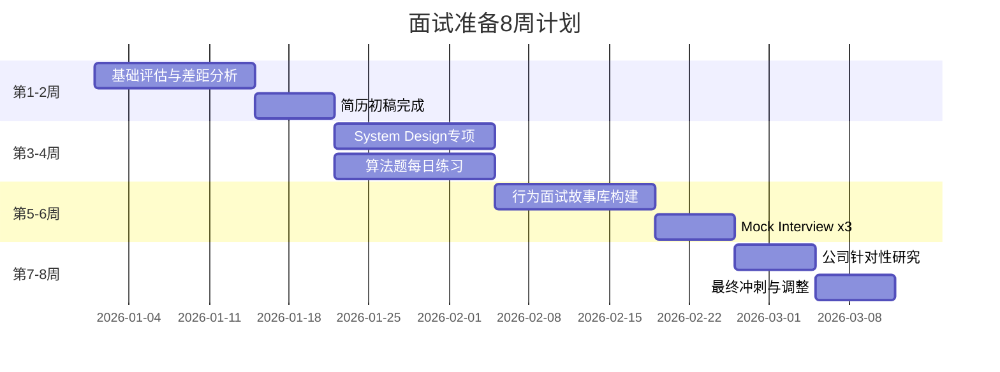

#### 每日准备Routine（建议2-3小时/天）

| 时段 | 内容 | 时长 |
|------|------|------|
| **早晨（30min）** | 算法题1道（LeetCode Easy/Medium） | 30min |
| **午休（30min）** | 阅读技术文章/行业动态 | 30min |
| **晚上（60-90min）** | System Design / 项目实战 / 写作 | 60-90min |
| **周末（半天）** | Mock Interview / 开源贡献 / 深度学习 | 4h |

#### 资源分配预算（可选）

如果你愿意投资于面试准备，以下是2026年性价比最高的资源：

| 资源类型 | 推荐选项 | 价格 | 适用阶段 |
|----------|---------|------|---------|
| **System Design课程** | Grokking SDI / Design Gurus | $50-100 | 第3-4周 |
| **Mock Interview** | Pramp (免费) / interviewing.io ($$$) | $0-200 | 第5-6周 |
| **算法题库** | LeetCode Premium | $35/月 | 全程 |
| **AI工具** | ChatGPT Plus / Claude Pro | $20/月 | 全程 |
| **书籍** | DDIA / CtCI / 编程珠玑 | $30-50/本 | 参考 |

---

### 1.4 资源推荐：2026年面试必备工具箱

#### 学习资源

**📚 必读书籍**
1. *Designing Data-Intensive Applications* (Martin Kleppmann) — 系统设计圣经
2. *Cracking the Coding Interview* (Gayle Laakmann McDowell) — 算法面试经典
3. *The Staff Engineer's Guide* (Will Larson) — 高级工程师路径
4. *An Elegant Puzzle* (Will Larson) — 工程管理实践
5. *Building Evolutionary Architectures* (Neal Ford) — 渐进式架构

**🎥 视频课程**
1. **System Design**:
   - ByteByteGo YouTube Channel (免费)
   - Grokking the System Design Interview (付费)
   - MIT 6.824 (Distributed Systems, 免费)

2. **Algorithm**:
   - NeetCode.io (免费YouTube + 付费Pro)
   - AlgoExpert (付费)
   - CS61B (UC Berkeley, 免费)

3. **AI/ML for Engineers**:
   - Fast.ai Practical Deep Learning (免费)
   - Andrew Ng's Machine Learning Specialization (Coursera)
   - LangChain Documentation & Tutorials

**🛠️ 工具平台**
1. **LeetCode** — 算法练习
2. **Pramp** — 免费Peer-to-Peer Mock Interview
3. **interviewing.io** — 专业Mock Interview（匿名，表现好可直接获得面试机会）
4. **Exponent** — Behavioral Interview Prep
5. **Notion/Obsidian** — 知识管理与笔记

#### AI辅助工具

| 使用场景 | 推荐工具 | Prompt技巧 |
|----------|---------|-----------|
| **模拟面试** | ChatGPT / Claude（最新版本） | 设定角色、指定题型、要求追问 |
| **代码审查** | GitHub Copilot / Cursor | 要求分析复杂度、边界情况 |
| **简历优化** | ChatGPT / Jasper | 提供原始内容，要求量化、精炼 |
| **System Design** | Claude (擅长长文本) | 描述需求，要求画架构图、计算容量 |
| **行为面试** | ChatGPT | 提供情境，要求生成STAR+L回答 |

#### 薪资数据来源（2026年参考）

- **Levels.fyi** — 全球科技公司薪资透明化数据库
- **Blind** — 匿名职场社区（含薪资讨论）
- **OfferGhosting / 看准网** — 国内薪资数据
- **Glassdoor** — 公司评价与薪资范围

**2026年中国市场薪资参考**（一线城市，年薪人民币）：

| 职级 | 初级(1-3y) | 中级(3-5y) | 高级(5-8y) | 专家(8y+) |
|------|------------|------------|------------|-----------|
| 后端开发 | 200-350K | 350-550K | 550-850K | 850K-1.5M |
| 前端开发 | 180-300K | 300-450K | 450-700K | 700K-1.2M |
| AI/ML工程师 | 250-400K | 400-650K | 650K-1M | 1M-2M |
| DevOps/SRE | 220-380K | 380-600K | 600-900K | 900K-1.5M |
| 全栈工程师 | 200-350K | 350-550K | 550-850K | 850K-1.5M |

*注：以上为Base Salary，不含RSU、Bonus、Sign-on Bonus。AI相关岗位普遍有20-40%溢价。*

---

### 1.5 总结与行动清单

#### 核心要点回顾

1. **简历革命**：从技能罗列转向价值叙事，突出量化成果和AI实践经验
2. **System Design**：成为2026年面试的核心战场，必须系统性准备
3. **AI辅助**：善用ChatGPT/Claude进行模拟面试、代码优化、回答准备
4. **行为面试**：用STAR+L框架准备15-20个真实故事
5. **作品集**：GitHub + 技术社区 + Take-home Project，构建个人技术品牌

#### 本周行动清单（立即开始）

- [ ] **Day 1**: 审视当前简历，识别需要改进的地方
- [ ] **Day 2-3**: 使用AI工具优化简历，加入量化数据和2026关键词
- [ ] **Day 4**: 创建/更新GitHub Profile README
- [ ] **Day 5**: 选择一个System Design Topic开始学习
- [ ] **Day 6**: 完成第一道LeetCode Medium题，并用AI Review
- [ ] **Day 7**: 写下第一个Behavioral Story（STAR+L格式）

#### 心态提醒

> **面试准备不是欺骗，而是更好地呈现真实的自己。**

记住："工夫都是花在平时的。"面试准备的本质不是临时抱佛脚，而是：
- 系统性地梳理你已经掌握的知识
- 学会用对方能理解的"语言"来传达你的价值
- 发现不足并有针对性地弥补

在这个过程中，你会收获的不仅仅是一份offer，更是对自己职业生涯的一次深度审视和重新定位。

---

## 二、面试中的技巧

### 2.1 背景知识：面试是一场"实时表演"

#### 面试的心理学本质

在探讨具体技巧之前，我们需要先理解一个事实：**面试不是考试，而是一场有剧本的即兴表演**。

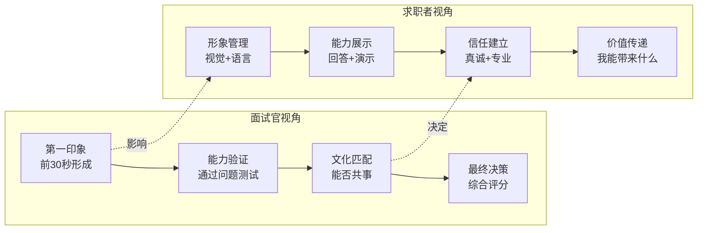

**关键洞察**：
- **面试官的决策过程**：70%在面试前15分钟就已经做出初步判断，后续问题只是在验证这个判断
- **求职者的任务**：不是"证明你是最聪明的"，而是**让面试官相信你是"最合适的"**
- **2026年的变化**：由于远程面试的普及，非语言线索（肢体语言、眼神交流）的重要性下降，但**书面表达、逻辑清晰度、屏幕共享技巧**变得更加重要

#### 2026年面试形式的演变

| 维度 | 传统面试 | 2026年面试 |
|------|---------|-----------|
| **媒介** | 现场面对面 | Zoom/Google Meet + 在线协作IDE |
| **时长** | 单轮45-60分钟 | 多轮短时（30min x 5-6轮） |
| **编码方式** | 白板/纸笔 | 共享屏幕 + 在线编辑器 (CodeSignal, HackerRank) |
| **评估范围** | 技术为主 | 技术(50%) + 行为(30%) + 文化(20%) |
| **决策周期** | 1-2周 | 异步评估可长达2-4周 |
| **互动性** | 实时同步 | 同步 + 异步（Take-home, Video intro） |

---

### 2.2 2026更新内容：新时代的面试实战技巧

#### 远程面试的最佳实践

**技术环境准备清单**

在2026年，90%以上的初筛和技术轮都是通过视频会议进行的。以下是确保流畅体验的完整检查清单：

**① 硬件要求**

| 设备 | 最低配置 | 推荐配置 | 备注 |
|------|---------|---------|------|
| **电脑** | 8GB RAM, i5 | 16GB RAM+, i7/M1 | 双显示器更佳 |
| **摄像头** | 笔记本内置 | 1080p外置摄像头 | 眼神交流的关键 |
| **麦克风** | 笔记本内置 | 领夹式/桌面降噪麦 | 音质影响专业度 |
| **网络** | 10Mbps上行 | 50Mbps+上行 | 准备4G/5G备用 |
| **灯光** | 自然光 | 环形灯/柔光灯箱 | 避免背光、顶光 |

**② 软件与环境**

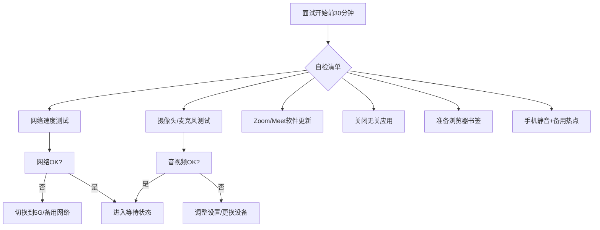

**③ 屏幕共享技巧**

远程面试中，屏幕共享是展示代码的主要方式。以下技巧可以让你看起来更专业：

- **提前组织好桌面**：
  - 关闭所有无关窗口和通知
  - 创建一个干净的桌面或使用虚拟桌面
  - 准备好要展示的项目文件夹、文档、浏览器标签页

- **使用双显示器策略**：
  - 主屏：显示面试官的视频（保持眼神接触）
  - 副屏：显示你的代码/笔记/题目
  - 共享时只共享副屏内容

- **字体和主题优化**：
  - 使用大号等宽字体（18pt+）
  - 选择高对比度的配色方案（避免纯黑背景）
  - 开启行号显示（方便讨论特定行）

**视频面试的非语言沟通**

虽然视频面试限制了肢体语言的发挥，但你仍然可以通过以下方式传递积极信号：

| 技巧 | 具体做法 | 效果 |
|------|---------|------|
| **眼神接触** | 看着摄像头而不是屏幕上的面试官脸 | 传递自信和诚实 |
| **姿势** | 坐直，身体稍微前倾 | 表现出兴趣和专注 |
| **微笑** | 适当微笑（尤其是开场和结束时） | 营造友好氛围 |
| **手势** | 使用手部动作辅助说明（但不要过多） | 增强表达力 |
| **点头** | 当面试官说话时适度点头 | 表示你在认真倾听 |
| **沉默** | 思考问题时不要害怕短暂的沉默 | 显示深思熟虑 |

#### 应对"答不上来"的场景

在面试中被问住是正常的，关键是你如何应对。以下是分层次的应对策略：

**层次1：部分知道的情况**

**场景**：你对问题有一定了解，但不确定细节或最优解

**错误做法**：
> "嗯...我不太确定，可能是用HashMap吧..."

**正确做法**（2026版）：
> "这个问题涉及到X领域。我的理解是，我们可以从Y角度切入。具体来说，我会考虑A方案和B方案的trade-off。
>
> 如果时间允许，我想先画出架构图来梳理一下思路。[开始画图/写伪代码]
>
> 不过我需要确认一下：您提到的'高并发'具体是指QPS在什么量级？这会影响我对缓存策略的选择。"

**为什么这样更好？**
- 展示了**结构化思维**（先定义问题，再给方案）
- **主动澄清需求**（而不是盲目猜测）
- **可视化思考过程**（画图比空谈更有说服力）
- **诚实但有建设性**（承认不确定性但给出方向）

**层次2：完全不知道的情况**

**场景**：问题完全超出你的知识范围

**传统建议**：直接说"我不知道"

**2026年进阶建议**：

> "坦率地说，这个问题超出了我目前的知识范围。但我可以尝试从几个角度来分析：
>
> 首先，从原理上来说，这类问题通常涉及[A]和[B]两个核心挑战。
>
> 其次，如果我在工作中遇到类似问题，我会采取这样的排查步骤：[列出2-3个步骤]
>
> 最后，这是一个很好的学习机会。如果方便的话，您能给我一些提示或者关键词吗？我想了解这个领域的最佳实践。"
>

**后续行动（关键！）**：
1. **记录问题**：面试结束后立即写下这个问题
2. **深入研究**：用AI工具、文档、论文彻底搞懂
3. **Follow-up邮件**：24-48小时内发送一封感谢信，附上你的学习成果

**Follow-up Email模板**：
```
Subject: Thank you - [Your Name] - [Position] Interview

Hi [Interviewer Name],

Thank you for taking the time to speak with me yesterday about the [Position] role.
I particularly enjoyed our discussion on [Topic].

During our conversation, you asked about [Question]. I've spent some time researching this topic and wanted to share what I learned:

[Brief summary of your findings, 2-3 paragraphs]

This experience reinforced my interest in joining [Company], where I can continue learning from talented engineers like yourself.

Best regards,
[Your Name]
[LinkedIn/GitHub link]
```

**为什么这样做有效？**
- 展示**学习能力**（比"知道答案"更重要）
- 表现出**主动性**和**求知欲**
- 创造第二次印象机会
- 很多面试官会因此重新考虑你的 candidacy

#### 尖锐问题的回答艺术

**问题1："你为什么要离开现在的公司？"**

**陷阱分析**：
- 说前公司坏话 → 显得你不忠诚、难相处
- 说得太模糊 → 显得你没有主见
- 说得太具体 → 可能暴露你的弱点

**2026年推荐回答框架**：

> "我在当前公司已经工作了X年，这段经历非常宝贵，我学到了[A]和[B]。
>
> 但我认为现在是时候迎接新的挑战了。具体来说，我在寻找：
> 1. **更大的技术规模**：我们目前的系统处理X QPS，我希望能在百万级QPS的环境中历练
> 2. **更深的技术领域**：我对贵公司的[Y]方向非常感兴趣，这与我的职业规划高度契合
> 3. **更强的团队协作**：我了解到贵公司有很棒的工程文化，这是我非常看重的
>
> 当然，任何公司都有不完美的地方，但我更愿意聚焦于未来的可能性，而不是过去的遗憾。"

**关键点**：
- **正向表述**：用"我要去哪里"替代"我要逃离什么"
- **具体化**：提到具体的数字、技术、文化元素
- **价值观一致**：强调的理由应该与目标公司相符

**问题2："你最大的缺点是什么？"**

**常见错误**：
- ❌ "我太追求完美了"（假，面试官听过一万遍）
- ❌ "我工作太拼命了"（这不是缺点）
- ❌ "我没有缺点"（傲慢且不真实）

**2026年推荐策略：真实的成长型缺点**

选择一个**真实存在、你已经意识到、并且正在积极改进**的缺点。

**示例回答**：

> "我觉得我最大的挑战是**在快速变化的环境下，有时会过于关注技术细节而忽略大局**。
>
> 举个例子：在上个项目里，我们面临紧迫的deadline，我花了大量时间优化一个模块的性能，虽然最终提升了20%，但这导致整体进度延迟了两天。事后复盘时，我意识到有时候'足够好'比'完美'更重要。
>
> 为了改进这一点，我现在会：
> 1. 在项目初期就明确优先级和trade-off
> 2. 定期与PM和team lead对齐进度预期
> 3. 使用时间盒（time-boxing）来限制技术探索的时间
>
> 这个改进过程还在持续中，但我已经能看到积极的改变。"

**为什么这样回答有效？**
- **真实性**：描述了一个具体的失败案例（有细节）
- **自我认知**：准确识别了自己的模式
- **行动计划**：展示了具体的改进措施
- **结果导向**：提到了已经看到的改善

**问题3："你如何看待AI对程序员工作的影响？"**

这是2026年**几乎必问的问题**，尤其是对于中高级岗位。

**错误的极端回答**：
- ❌ "AI会取代程序员"（显得恐慌、缺乏信心）
- ✅ "AI只是工具，无法替代人类创造力"（太泛泛，没有深度）

**推荐回答框架（分层递进）**：

> "这是一个非常好的问题，我也一直在思考这个问题。我的看法是分三个层面：
>
> **短期来看（1-2年）**：AI主要扮演'超级助手'的角色。在我的日常工作中，我已经在使用GitHub Copilot来加速代码编写，用ChatGPT来做技术调研和文档撰写。这让我的效率提升了约40%，让我能把更多时间花在架构设计和code review上。
>
> **中期来看（3-5年）**：AI会改变'什么是初级工作'的定义。重复性的编码工作会被自动化，但对**系统设计、业务理解、跨团队协调**的要求会更高。这也是为什么我现在在加强System Design和soft skills方面的训练。
>
> **长期来看（5-10年）**：我认为不会是'AI取代人类'，而是'会用AI的人取代不会用AI的人'。未来的核心竞争力将是：**定义问题的能力、判断AI输出质量的能力、以及将技术与业务目标结合的能力**。
>
> 所以，我的策略是拥抱AI而非恐惧它，主动学习如何更好地利用这些工具来放大自己的生产力。"

**加分项**：如果你能举一个自己实际使用AI解决复杂问题的例子，效果会更好。

#### 结尾提问的艺术：反转被动为主动

面试结束时的"Do you have any questions for us?"环节，是你的**黄金机会**。很多候选人浪费了这个机会，要么说"没有问题"，要么问一些可以在Google上找到答案的问题。

**根据面试表现调整策略**

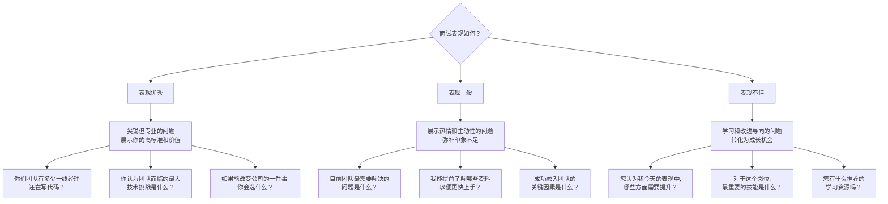

**高质量问题库（按类别分类）**

**关于团队与技术**：
1. "能否介绍一下团队的技术栈演进路线图？未来12个月会有哪些重大变更？"
2. "团队内部的知识分享机制是怎样的？有没有tech talk或者blog文化？"
3. "你们如何平衡技术债务和新功能开发？"

**关于文化与成长**：
4. "您最喜欢在这个团队工作的哪一点？最希望改善的是什么？"
5. "一个工程师从加入团队到能够独立负责一个module，通常需要多长时间？"
6. "公司如何支持员工的持续学习？（会议预算、培训、读书俱乐部等）"

**关于业务与影响力**：
7. "这个角色的工作如何直接影响公司的业务指标？"
8. "团队最近引以为豪的技术成就是什么？"
9. "您认为未来一年行业最大的变化趋势是什么？公司如何应对？"

**关于AI与工具链**（2026新增）：
10. "团队目前在哪些环节使用了AI辅助开发工具？效果如何？"
11. "公司对于使用AI生成的代码有哪些政策或guidelines？"
12. "您认为AI会在多大程度上改变这个角色的日常工作？"

#### 薪资谈判策略（2026年版）

**谈判时机**

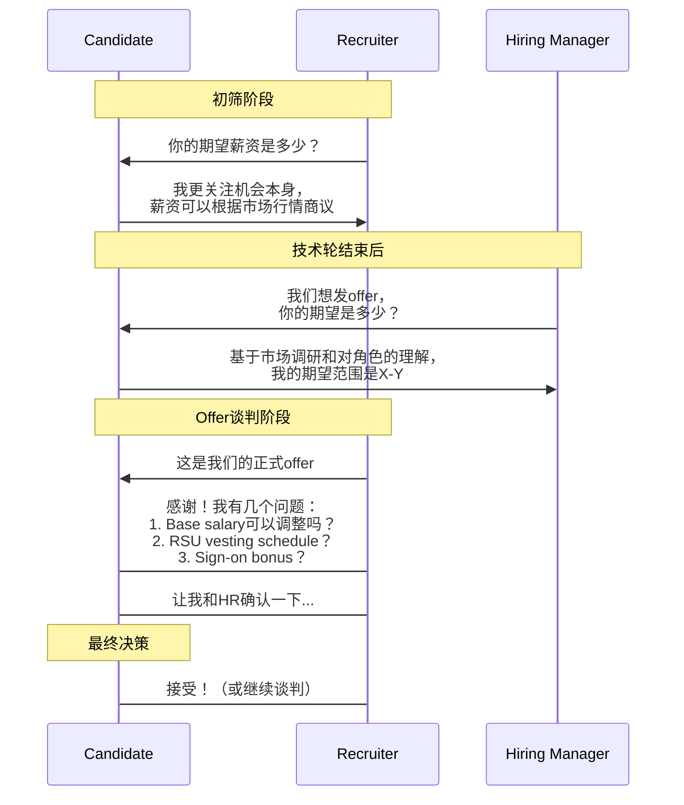

**核心原则**：
- **初筛阶段**：不要给出具体数字，可以说"市场价"或"open to discuss"
- **收到Offer后**：这是你最有筹码的时候，不要急着接受
- **永远不要第一个给出数字**（除非对方坚持）

**2026年薪资构成要素**

在谈判时，不要只关注Base Salary。完整的薪酬包包括：

| 组成项 | 权重 | 谈判空间 | 备注 |
|--------|------|---------|------|
| **Base Salary** | 40-50% | 中等 | 年度涨幅3-8% |
| **Annual Bonus** | 10-20% | 取决于绩效 | 目标值通常是15-25% |
| **RSU/Stock** | 20-35% | 高（取决于公司） | 注意vesting schedule |
| **Sign-on Bonus** | 5-15% | 高 | 一次性，用于补偿 forfeiture |
| **福利** | 5-10% | 低 | 医疗保险、退休金、带薪休假 |

**谈判技巧**：
1. **做足功课**：使用Levels.fyi、Blind、OfferGhosting了解市场价
2. **总包思维**：不要纠结于某一项，看Total Compensation
3. **争取RSU**：如果是上市公司，RSU的上涨空间可能远大于Base
4. **Sign-on Bonus作为杠杆**：如果你放弃了前公司的unvested stock，要求sign-on bonus补偿
5. **书面确认**：所有承诺都要写在offer letter里

**2026年特殊考量**：
- AI相关岗位普遍有20-40%溢价
- 远程工作者可能面临地域性薪资差异（但正在缩小）
- 有些公司提供"AI工具津贴"或"学习预算"，这也是隐含价值

---

### 2.3 实践建议：面试当天的Checklist

#### 面试前一天

- [ ] 确认面试时间、链接、参会人员（添加到日历，设提醒）
- [ ] 测试所有设备（摄像头、麦克风、网络）
- [ ] 准备好纸质笔记（简历副本、项目列表、准备的问题）
- [ ] 提前研究面试官背景（LinkedIn、GitHub、技术社区）
- [ ] 准备好水和零食（放在手边但不出镜）
- [ ] 提前休息（保证7-8小时睡眠）

#### 面试当天

**面试前30分钟**：
- [ ] 再次检查设备
- [ ] 上洗手间（避免中途离开）
- [ ] 做几次深呼吸放松
- [ ] 打开面试链接，提前5分钟进入waiting room

**面试过程中**：
- [ ] 保持微笑和眼神接触（看着摄像头）
- [ ] 积极倾听，适当点头
- [ ] 回答问题时先思考3秒再开口（避免语无伦次）
- [ ] 不确定的问题可以请求clarification
- [ ] 记录关键信息（面试官名字、下一步流程）

**面试后30分钟内**：
- [ ] 写下面试笔记（问了什么问题、自己的回答、需要改进的地方）
- [ ] 发送Thank You email（个性化，不要模板化）
- [ ] 如果有follow-up问题，立即开始研究

#### 常见失误及预防

| 失误类型 | 后果 | 预防措施 |
|----------|------|---------|
| **迟到/技术故障** | 第一印象极差 | 提前15分钟准备，备选设备 |
| **负面评价前雇主** | 显得不忠诚 | 只说正面原因，聚焦未来 |
| **过度谦虚** | 能力被低估 | 用数据和事实展示成就 |
| **打断面试官** | 显得不礼貌 | 耐心听完再回应 |
| **撒谎/夸大** | background check暴露 | 保持诚实，不知道就说不知道 |
| **不提问** | 缺乏兴趣 | 准备5-10个高质量问题 |
| **谈判过早/过激** | offer被撤回 | 收到正式offer后再谈薪资 |

---

### 2.4 资源推荐：面试工具箱

#### 练习平台

| 平台 | 用途 | 价格 | 特色 |
|------|------|------|------|
| **Pramp** | Peer Mock Interview | 免费 | 与其他候选人互相练习 |
| **interviewing.io** | 专业Mock Interview | 按次付费/免费 | 匹配大厂工程师，表现好可直接获得面试机会 |
| **Exponent** | Behavioral Prep | $12/月 | 结构化的行为面试练习 |
| **CodeSignal** | 在线编码评估 | 公司付费 | 很多公司用它做OA |
| **HackerRank** | 算法练习 | 免费/付费 | 题库丰富，支持多语言 |

#### AI辅助工具

| 工具 | 场景 | Prompt示例 |
|------|------|-----------|
| **ChatGPT** | 模拟面试 | "你是一位Google面试官，请问我System Design问题..." |
| **Claude** | 代码Review | "请分析这段代码的时间复杂度和潜在bug..." |
| **Gemini** | 技术调研 | "对比Kafka和Pulsar在X场景下的优劣..." |
| **Perplexity** | 快速查找 | "2026年微服务最佳实践有哪些更新？" |
| **Grammarly** | 书面沟通 | 检查Follow-up email的语法和语气 |

#### 推荐阅读

**📖 面试技巧类**
1. *Cracking the Coding Interview* — 算法面试圣经
2. *The Google Resume* — 大厂面试全攻略
3. *Secrets of a Master Networker* — 人际关系与沟通
4. *Never Split the Difference* — FBI谈判专家的谈判技巧（适用于薪资谈判）

**🧠 心理学与沟通类**
1. *Thinking, Fast and Slow* — 决策心理学（理解面试官的思维）
2. *Influence* — 说服力六原则（应用于自我营销）
3. *Crucial Conversations* — 高难度沟通技巧

---

### 2.5 总结

#### 核心要点回顾

1. **远程面试是新常态**：技术环境、屏幕共享、视频礼仪缺一不可
2. **答不上来不是灾难**：关键是展示学习能力和成长心态
3. **尖锐问题是机会**：用STAR+L框架，真实且有深度地回答
4. **结尾提问定胜负**：根据面试表现调整策略，展示你的价值取向
5. **薪资谈判讲策略**：时机、总包思维、书面确认

#### 心态提醒

> **最好的面试技巧是：做真实的自己，同时是这个版本的"最佳状态"。**

记住："形象和谈吐对于面试成功与否非常重要。"但在2026年，这句话有了新的含义：
- **形象** = 专业度（技术环境整洁、表达清晰）
- **谈吐** = 逻辑性和结构化（能用AI辅助但不依赖AI）
- **真实** = 诚实面对自己的不足，同时展示改进的决心

面试不是一场零和博弈，而是**双向选择的过程**。你也在评估这家公司是否值得你投入接下来的几年职业生涯。

---

## 三、面试风格

### 3.1 背景知识：为什么理解面试风格如此重要？

#### 面试风格的"光谱理论"

在探讨具体公司的面试风格之前，我们需要建立一个认知框架：**没有"最好"的面试风格，只有"最匹配"的面试风格**。

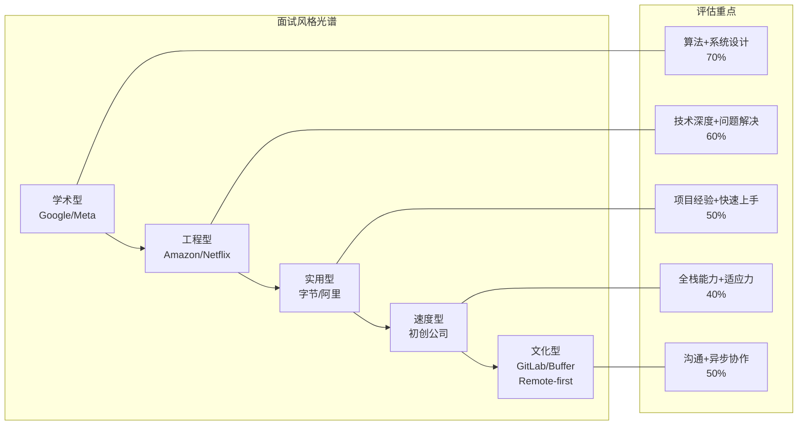

**核心洞察**：
- **学术型**：重视基础算法、系统设计原理、研究潜力
- **工程型**：关注实际工程能力、可维护性、scalability思维
- **实用型**：强调项目经验、业务理解、快速交付能力
- **速度型**：看重多面手、创业精神、抗压能力
- **文化型**：注重价值观匹配、异步沟通、自我驱动

#### 2026年面试风格的三大趋势

**趋势一：从"算法为王"到"System Design核心"**

5年前，LeetCode刷题是面试准备的绝对重心。但到了2026年，格局已经发生了根本性变化：

| 年份 | 算法权重 | System Design权重 | 行为面试权重 | 原因 |
|------|---------|-------------------|-------------|------|
| 2020 | 60% | 20% | 20% | AI工具尚未普及，手工编码是主要生产力 |
| 2023 | 45% | 35% | 20% | 微服务架构普及，系统设计成为刚需 |
| 2026 | 25% | 45% | 30% | AI辅助编程成熟，设计能力和soft skills更稀缺 |

**深层原因**：
1. AI工具（Copilot、Cursor、GPT-4）已经能够解决大部分Medium难度的算法题
2. 企业面临的核心挑战从"如何实现"转向"如何设计"
3. 远程协作要求更强的文档能力和沟通能力

**趋势二：从"同步白板"到"异步评估"**

传统的"飞到现场、白板编程"模式正在被以下方式取代：

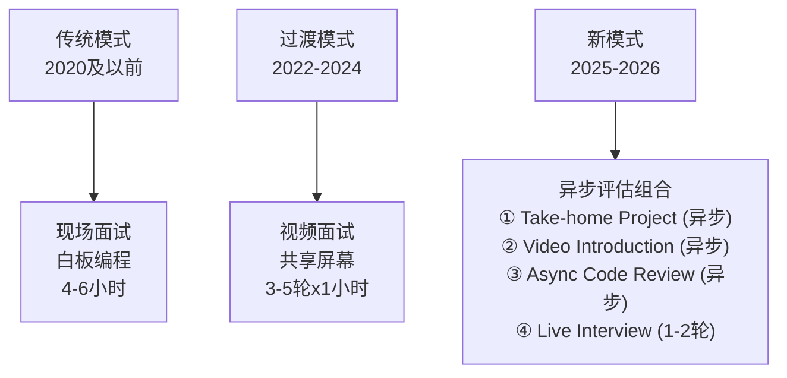

**异步评估的优势**：
- 对求职者更友好（可以在最佳状态下完成）
- 更能反映真实工作状态（不靠临场发挥）
- 降低bias（面试官可以反复review）
- 时间和地域限制减少

**对求职者的新要求**：
- 文档写作能力变得至关重要
- 自我管理和时间分配能力
- 在没有实时反馈的情况下展示思考过程

**趋势三：AI在面试中的双刃剑效应**

2026年，AI已经成为面试准备和面试过程中的重要元素：

**积极方面**：
- 求职者可以用AI模拟面试、优化简历、准备行为问题答案
- 面试官可以用AI辅助生成题目、评估代码质量
- 异步评估中，AI可以初步筛选候选人的written work

**挑战与风险**：
- 如何区分"候选人自己写的"vs "AI生成的"？
- 面试官开始使用"反AI"题目（需要创造性思维的开放性问题）
- 过度依赖AI可能导致基础能力退化

---

### 3.2 2026更新内容：不同类型公司的面试风格详解

#### 国际科技巨头（FAANG+）

**Google：学术型面试的代表**

**面试特点**：
- **算法题依然重要**，但难度有所降低（不再追求tricky解法）
- **System Design**成为必考环节，且非常深入
- **Behavioral Interview**采用STARL方法（Google版本）
- 强调**Generalist**能力（不限定于某一语言或框架）

**典型流程（2026版）**：

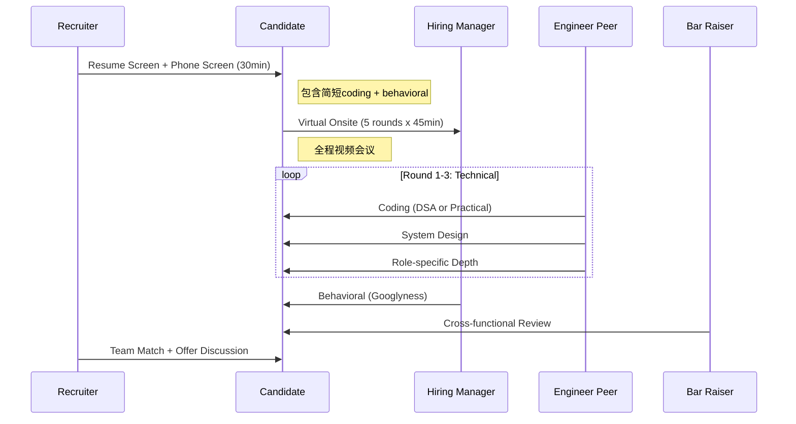

**Google特有的"Bar Raiser"机制**：
- Bar Raiser是经过特殊培训的面试官，独立于hiring team
- 他们有权否决任何offer，即使其他面试官都给了strong hire
- 目的是保持 hiring bar的一致性，避免团队因急需人而降低标准

**备考建议**：
1. 刷LeetCode（重点是Medium难度，Hard了解思路即可）
2. 精读DDIA（《Designing Data-Intensive Applications》）
3. 准备5-8个Behavioral Stories（用Google的STARL框架）
4. 了解Google的产品和技术栈（展示你对公司的兴趣）

**Amazon：领导力原则驱动的面试**

**面试特点**：
- **16条 Leadership Principles (LPs)** 是面试的核心评价标准
- 几乎每个问题都会对应到某条LP
- **Writing Exercise**（2026年新增）：在面试前完成一份书面文档
- **The Bar Raiser**同样存在，但更强调cultural fit

**Amazon Leadership Principles（精选高频考察项）**：

| LP | 中文含义 | 典型面试问题 | 权重 |
|-----|---------|-------------|------|
| **Customer Obsession** | 客户至上 | "Tell me about a time you went above and beyond for a customer" | ⭐⭐⭐⭐⭐ |
| **Ownership** | 主人翁精神 | "Describe a project where you took end-to-end ownership" | ⭐⭐⭐⭐⭐ |
| **Learn and Be Curious** | 学习与好奇 | "How do you stay current with technology trends?" | ⭐⭐⭐⭐ |
| **Dive Deep** | 深入探究 | "Walk me through how you debugged a complex production issue" | ⭐⭐⭐⭐⭐ |
| **Have Backbone; Disagree and Commit** | 敢于异议 | "Tell me about a time you disagreed with your manager" | ⭐⭐⭐⭐ |
| **Deliver Results** | 交付成果 | "Give an example of a tight deadline you met" | ⭐⭐⭐⭐ |

**回答技巧**：
> 每个回答都要明确提到对应的Leadership Principle。
>
> 例如："这是一个体现**Ownership**和**Customer Obsession**的例子。当时我们的支付系统出现了..."

**Meta（Facebook）：Move Fast的文化**

**面试特点**：
- 相比Google和Amazon，Meta的面试相对**轻松一些**
- 编码题偏向**Practical**（实际工作中会遇到的场景）
- System Design侧重**大规模分布式系统**
- 文化上强调**Impact**和**Speed**

**独特之处**：
- **Power Day**：所有面试集中在一天完成（4-5轮）
- **Coding + System Design混合**：有些轮次会同时包含两者
- **Behavioral**通常只占1轮，但问得很深

**Microsoft：转型中的巨人**

**面试特点**：
- 从传统的"白板三题"转向**更实用的评估方式**
- 大量使用**Take-home Assignment**和**Async Code Review**
- 强调**As One**文化和**Growth Mindset**
- Azure云相关岗位需求量大

**2026年新增**：
- **AI/ML专项面试**（对于相关岗位）：会测试Prompt Engineering、Model Evaluation等
- **Open Source Contribution**可以作为加分项（Microsoft越来越重视开源社区）

#### 国内互联网大厂（BAT + 字节跳动 + 新势力）

**字节跳动：极致的数据驱动**

**面试特点**：
- **算法题难度高**（接近竞赛水平）
- **System Design**注重**高并发、大数据量**场景
- **数据驱动文化**：面试中会问你如何用数据做决策
- **Context, not Control**：强调自驱力和context-setting能力

**典型流程**：
1. **简历筛选**（ATS系统，关键词匹配很重要）
2. **在线笔试**（算法题3-5道，限时90分钟）
3. **技术一面**（算法 + 项目深挖）
4. **技术二面**（System Design + 架构能力）
5. **技术三面**（交叉面试，跨team面试官）
6. **HR面**（薪资谈判 + 文化匹配）

**备考策略**：
- 刷LeetCode Hot 100 + 牛客网高频题
- 准备项目细节（会被问到数据库设计、缓存策略、性能优化等）
- 了解字节的技术栈（Go、微服务、推荐系统、音视频处理）

**阿里巴巴：Java生态的王者**

**面试特点**：
- **Java深度**是核心（JVM、并发编程、Spring全家桶）
- **中间件知识**（RocketMQ、Dubbo、Nacos、Sentinel）
- **分布式系统**（CAP理论、Paxos/Raft、分库分表）
- **HR面**非常重要（阿里价值观考核严格）

**常见问题类型**：
1. Java基础（HashMap源码、线程池参数、GC调优）
2. 中间件原理（Kafka为什么快？Redis持久化机制？MySQL索引结构？）
3. 分布式场景（如何设计一个秒杀系统？分布式事务怎么保证？）
4. 项目实战（你遇到过哪些生产事故？怎么解决的？）

**腾讯：产品技术并重**

**面试特点**：
- **Tencent Technology**（TT）标准：有明确的技能等级划分
- **游戏后台**岗位竞争激烈，待遇优厚
- **微信部门**技术门槛最高（要求极强的系统设计能力）
- 注重**工程化能力**（代码质量、测试覆盖率、CI/CD）

#### 初创公司与独角兽

**初创公司的面试风格特点**

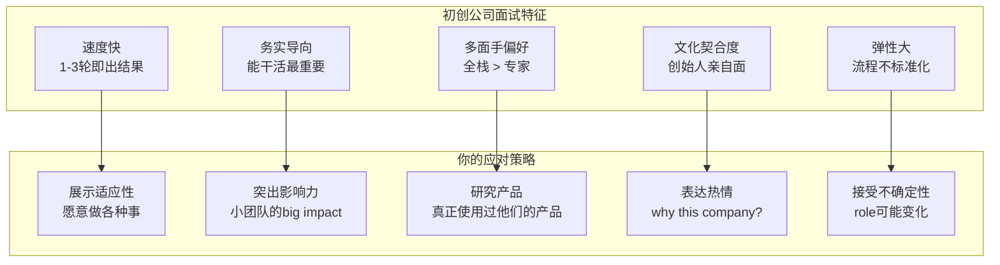

**优势**：
- 决策链短，可能当天就给offer
- 能接触到核心技术决策
- 成长空间大（title晋升快）
- 股权/期权可能有巨大upside

**风险**：
- 流程不规范，可能遇到unprofessional的情况
- 工作强度大（996甚至更大）
- 公司存活率低（10个初创9个死）
- 薪资可能低于大厂（但期权补偿）

**如何判断一家初创公司是否值得加入**：
1. **创始人背景**：是否有成功退出经历？行业声誉如何？
2. **融资情况**：A轮还是D轮？投资人是谁？
3. **产品市场匹配度（PMF）**：有没有真实的付费客户？
4. **技术债务情况**：代码质量如何？有没有tech debt budget？
5. **团队质量**：CTO是谁？核心工程师来自哪里？

#### Remote-First 公司（新时代的选择）

2026年，Remote-First公司已经成为很多工程师的首选。这类公司的面试风格与传统公司截然不同：

**代表公司**

| 公司名称 | 总部所在地 | 核心业务 | 特色 |
|----------|-----------|---------|------|
| **GitLab** | 全球分布（无总部） | DevOps平台 | 100% remote，公开 handbook |
| **Buffer** | 全球分布 | 社交媒体管理 | 透明薪资，四天工作制 |
| **Zapier** | 全球分布 | 自动化工具 | 异步优先，时区灵活 |
| **Stripe** | 旧金山/remote | 支付基础设施 | 高工程标准，remote-friendly |
| **Shopify** | 渥太华/remote | 电商平台 | Digital by default |

**Remote-First公司的面试特色**

**① 异步评估为主**

典型的申请流程可能是：
1. 提交简历 + Video introduction（录制2-3分钟自我介绍视频）
2. 完成Take-home assignment（通常是3-7天的一个小项目）
3. Async code review（面试官review你的代码，你review他们的）
4. 1-2轮video call（主要是culture fit chat）
5. Reference check + Offer

**② 重视Written Communication**

因为日常工作都是异步的，所以：
- 你的邮件、Slack消息、文档写作能力会被仔细评估
- Take-home project的README质量很重要
- 面试过程中可能会让你写一份简短的design doc

**③ Culture Add over Culture Fit**

传统公司强调Culture Fit（你是否符合现有文化），而Remote-First公司更强调**Culture Add**（你能为团队带来什么新的视角和多样性）。

**④ 透明度极高**

很多Remote-First公司公开：
- 薪资范围（如Buffer公开每个人的薪资）
- 面试流程和评分标准
- 公司handbook（包括决策流程、价值观讨论）
- 甚至面试问题库！

**⑤ 时区友好**

- 面试时间会配合你的时区
- 不要求你在特定时间online
- 重视async communication skills（能否在没有实时对话的情况下高效工作？）

---

### 3.3 实践建议：针对不同风格的准备策略

#### 诊断你的目标公司类型

在开始准备之前，先明确你要面试的公司属于哪种类型：

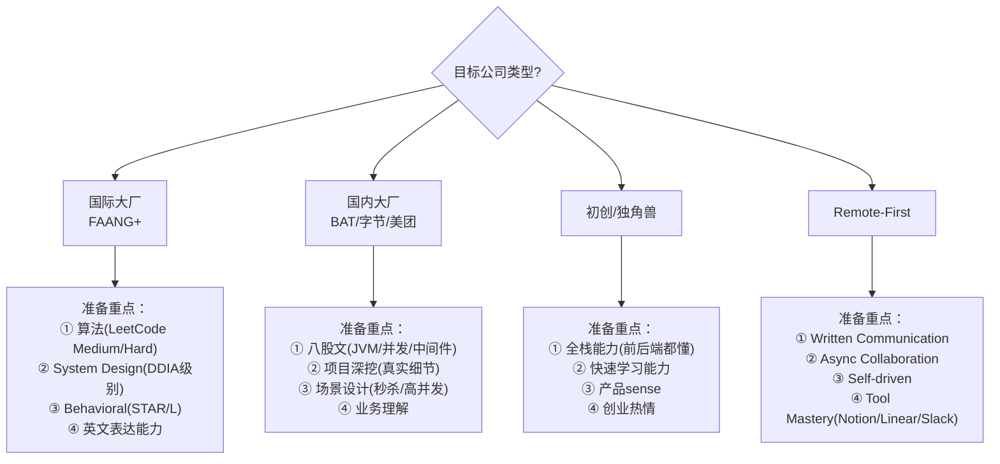

#### 通用准备清单（适用于所有类型）

无论面试哪家公司，以下准备工作都是必须的：

| 维度 | 准备内容 | 时间投入 |
|------|---------|---------|
| **简历优化** | 量化成果、关键词优化、作品集链接 | 2-3天 |
| **算法练习** | LeetCode 100-200题（按题型分类） | 持续进行 |
| **System Design** | 掌握15-20种常见系统的设计 | 2-3周 |
| **项目复盘** | 准备3-5个项目的详细故事 | 3-5天 |
| **Behavioral** | 准备15-20个STAR+L故事 | 1周 |
| **公司调研** | 产品、技术栈、文化、最新动态 | 2-3天 |
| **Mock Interview** | 至少3次完整模拟 | 1周 |

#### 针对性策略示例

**如果你的目标是Google：**

**Week 1-2**: 算法冲刺
- 每天完成2-3道LeetCode（重点：Graph, DP, String）
- 使用NeetCode.io的视频教程学习解题模式
- 用AI分析自己的代码，寻找优化空间

**Week 3-4**: System Design深度学习
- 通读DDIA（至少前10章）
- 练习ByteByteGo上的Top 30系统设计题
- 每个设计都要画图、计算容量、讨论trade-off

**Week 5**: Behavioral Preparation
- 用Google的STARL框架准备8个故事
- 重点覆盖：Leadership、Conflict Resolution、Failure、Innovation
- 和朋友mock，录音回放改进表达

**Week 6**: 最终冲刺
- 完成2-3次完整Mock Interview（使用interviewing.io或Pramp）
- 复习所有笔记和错题
- 放松心态，保证睡眠

**如果你的目标是字节跳动：**

**Week 1**: 算法强化
- 牛客网高频题 + LeetCode Hot 100
- 重点：动态规划、贪心、图论（字节喜欢考这些）
- 注意时间控制（笔试通常很紧张）

**Week 2-3**: 项目深挖准备
- 复盘你简历上的每个项目
- 准备好被问到以下问题：
  - 数据库设计（为什么选这个？容量多少？索引怎么建？）
  - 缓存策略（用什么？一致性怎么保证？穿透/击穿/雪崩怎么处理？）
  - 并发问题（锁怎么做？分布式锁？）
  - 性能瓶颈（QPS多少？慢查询怎么优化？）

**Week 4**: 系统设计专项
- 高并发场景：秒杀、抢红包、Feed流
- 大数据处理：离线计算、实时计算
- 微服务治理：服务发现、熔断降级、配置中心

**Week 5**: HR面准备
- 了解字节的核心价值观（始终创业、坦诚清晰、追求极致...）
- 准备好"为什么选择字节？"的回答
- 薪资预期调研（使用OfferGhosting、看准网）

---

### 3.4 资源推荐：面试风格适配工具箱

#### 公司特定资源

| 公司 | 推荐资源 | 链接/备注 |
|------|---------|-----------|
| **Google** | "Get that Job at Google" YouTube系列 | TechLead出品 |
| **Amazon** | Leadership Principles深度解读 | 官方LP页面 + 社区面经 |
| **Meta** | "System Design Interview" by Alex Xu | 两本书籍 + YouTube |
| **字节跳动** | 牛客网面经 + 力扣题库 | 中文社区活跃 |
| **阿里巴巴** | JavaGuide + 尚硅谷面试题 | GitHub开源 |

#### Mock Interview平台对比

| 平台 | 价格 | 优势 | 适合人群 |
|------|------|------|---------|
| **Pramp** | 免费 | Peer-to-peer，灵活时间 | 预算有限者 |
| **interviewing.io** | $60-200/次 | 匹配大厂工程师，匿名 | 想要真实体验者 |
| **Exponent** | $12/月 | 结构化的behavioral prep | 行为面试薄弱者 |
| **CodeSignal** | 公司付费 | 很多OA用这个平台 | 练习平台熟悉度 |
| **Karat** | 公司付费 | 第三方 interviewing firm | 了解评估标准 |

#### 信息获取渠道

**官方渠道**：
- 公司官网的Engineering Blog
- 技术负责人的Twitter/LinkedIn
- 公司在GitHub上的开源项目
- YouTube上的Tech Talks（如Google I/O, AWS re:Invent）

**非官方渠道（更有价值）**：
- Blind（匿名员工吐槽，了解真实文化）
- Glassdoor（面试经验分享，注意时效性）
- Reddit（r/cscareerquestions, r/experienceddevs）
- 一亩三分地（留学生论坛，面经丰富）
- V2EX（中文技术社区，国内公司信息多）
- 即刻（国内程序员社交App，很多内推机会）

---

### 3.5 总结

#### 核心要点回顾

1. **面试风格高度分化**：学术型、工程型、实用型、速度型、文化型各有侧重
2. **System Design已成核心**：算法权重下降，设计和soft skills上升
3. **异步评估是新趋势**：Take-home、Video Intro、Async Review越来越普遍
4. **AI是双刃剑**：善用AI准备，但要展现独立思考能力
5. **Remote-First是新选择**：适合重视work-life balance的工程师

#### 选择建议

> **没有最好的公司，只有最适合你的公司。**

在选择目标公司时，考虑以下维度：

| 维度 | 问题 |
|------|------|
| **技术成长** | 你想成为专家还是通才？ |
| **职业路径** | 你想做IC（Individual Contributor）还是Management？ |
| **工作生活平衡** | 你能接受多大强度的加班？ |
| **地理位置** | 你想去大城市还是prefer remote？ |
| **薪酬期望** | 你更看重Base还是Equity upside？ |
| **文化匹配** | 你喜欢fast-paced还是steady的环境？ |

#### 最后的建议

原版文章中指出："国外的知名公司就没有那么容易了，真是全方位的考察。"这句话在2026年依然适用，而且变得更加复杂——因为你不仅要面对不同公司的不同风格，还要面对**同一公司内部不同team的不同风格**。

**最终的建议**：
1. **不要试图讨好所有人**：找到与你价值观匹配的公司
2. **不要伪造人设**：面试是双向选择，伪装出来的match不会长久
3. **持续积累**：真正的实力是任何面试风格都无法掩盖的
4. **保持好奇心**：每场面试都是一次学习机会，即使失败了也有收获

---

## 四、实力才是王中王

### 4.1 背景知识：什么是真正的"技术实力"？

#### 从"工匠"到"架构师"的能力金字塔

原版文章中强调："程序员面试中，最重要的事还是自己技术方面的能力。"这句话在2026年不仅没有过时，反而更加重要。但我们需要重新定义什么是"技术实力"。

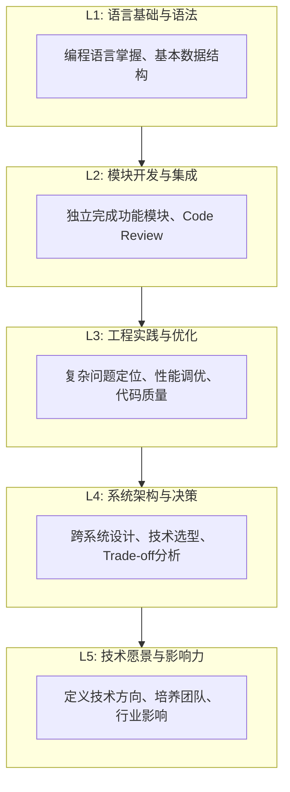

**关键认知转变**：
- **2020年及以前**：L1-L2就能找到不错的工作
- **2023年左右**：需要达到L3才能进入大厂
- **2026年**：AI工具已经能够胜任L1-L2的大部分工作，**L3成为入门门槛，L4才是稀缺资源**

#### AI时代的"新基本功"

当GitHub Copilot可以自动生成函数、ChatGPT可以解释复杂算法时，什么能力是AI无法替代的？

| 能力维度 | AI能做的 | AI不能做的（人类核心竞争力） |
|----------|---------|---------------------------|
| **编码实现** | ✅ 生成 boilerplate code | ❌ 架构设计和技术选型 |
| **Bug修复** | ✅ 定位常见错误模式 | ❌ 复杂系统的根因分析 |
| **文档撰写** | ✅ 生成API文档初稿 | ❌ 技术决策记录（ADR）和设计 rationale |
| **代码审查** | ✅ 检查style和常见反模式 | ❌ 评估业务逻辑正确性和可维护性 |
| **问题定义** | ❌ 理解模糊需求 | ✅ 将业务需求转化为技术方案 |
| **技术判断** | ❌ 权衡trade-off | ✅ 基于经验做出最优决策 |
| **沟通协作** | ❌ 建立信任关系 | ✅ 跨团队协调、stakeholder管理 |
| **创新思维** | ❌ 提出原创性解决方案 | ✅ 发现问题和机会 |

**结论**：2026年的"技术实力" = **深度技术理解 + 工程实践经验 + AI工具驾驭力 + 沟通协作能力**

---

### 4.2 2026更新内容：构建不可替代的技术竞争力

#### 核心技术栈：从广度到深度的战略选择

**后端工程师的成长路径**

基于原版文章的建议，结合2026年的市场现状，以下是后端工程师的技术进阶路线图：

```mermaid
flowchart LR
    subgraph L12 ["L1-L2: 入门期 (0-2年)"]
        A[语言基础<br/>Go/Java/Python]
        B[数据结构<br/>数组/链表/树/图]
        C[数据库基础<br/>SQL/索引/事务]
        D[Web框架<br/>Spring/Gin/Django]
    end

    subgraph L3G ["L3: 成长期 (2-5年)"]
        E[操作系统<br/>进程/线程/I/O模型]
        F[网络编程<br/>TCP/IP/HTTP/Socket]
        G[分布式基础<br/>CAP/RPC/消息队列]
        H[工程实践<br/>CI/CD/Test/监控]
    end

    subgraph L4G ["L4: 成熟期 (5-8年+)"]
        I[系统设计<br/>高可用/高并发/高扩展]
        J[云原生<br/>K8s/Service Mesh/IaC]
        K[数据工程<br/>流处理/数据湖/OLAP]
        L[安全与合规<br/>零信任/加密/审计]
    end

    subgraph L5G ["L5: 专家期 (8年+)"]
        M[技术战略<br/>技术选型/路线图]
        N[团队建设<br/>Mentorship/文化塑造]
        O[行业洞察<br/>趋势判断/商业价值]
    end

    L12 --> L3G --> L4G --> L5G
```

**薪资参考**（一线城市年薪，人民币）：

| 级别 | 年限 | 初级公司 | 中型公司 | 大厂（BAT/TMD） | 外企（Google/Meta） |
|------|------|---------|---------|------------------|---------------------|
| L1-L2 | 0-2年 | 150-250K | 200-300K | 250-400K | $120-180K |
| L3 | 2-5年 | 250-400K | 350-550K | 450-700K | $180-280K |
| L4 | 5-8年 | 400-600K | 550-850K | 700K-1.2M | $280-450K |
| L5 | 8年+ | 600K-1M | 800K-1.5M | 1M-2M+ | $450-800K |

*注：AI/ML相关岗位普遍有20-40%溢价*

**必须掌握的"硬核"基础知识**

无论技术如何演进，以下基础知识永远不会过时：

**① 计算机科学基础**
- 数据结构与算法（不只是为了面试，而是为了写出高效的代码）
- 操作系统原理（进程调度、内存管理、文件系统）
- 计算机网络（TCP/IP、HTTP/2、QUIC、DNS）
- 编译原理（词法分析、语法树、优化）

**② 分布式系统理论**
- CAP定理、PACELC
- 一致性协议（Paxos、Raft、ZAB）
- 分布式事务（2PC、Saga、TCC）
- 时间与时钟（Logical Clock、Vector Clock）

**③ 数据库 internals**
- 存储引擎（B+ Tree、LSM Tree、列存）
- 查询优化器（执行计划、代价模型）
- 事务隔离级别与MVCC
- 分库分表策略

> **为什么这些很重要？**
>
> 因为当你了解了这些底层原理后，无论上层技术如何变化（今天用Redis明天用Valkey，今天用MySQL明天用TiDB），你都能快速理解其本质，并做出正确的技术判断。

#### 开源贡献：建立技术影响力的最佳途径

原版文章提到："好在这个世界有开源项目，加入开源项目会比加入一个公司的门槛要低得多。"这句话在2026年更加适用。

**为什么开源贡献如此重要？**

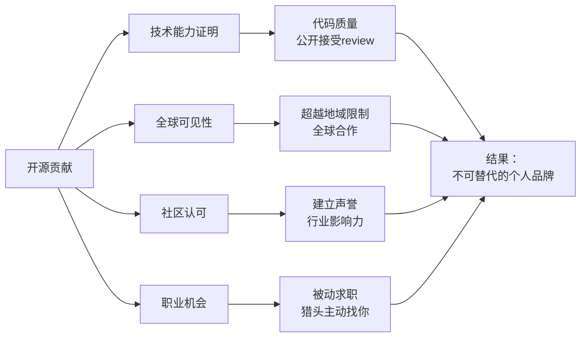

**实际收益**：
1. **被动求职**：很多开源maintainer会被大厂直接recruit
2. **薪资溢价**：有知名开源贡献的候选人通常能拿到更高的offer
3. **学习加速**：与世界顶级开发者合作，成长速度远超在公司闭门造车
4. **人脉积累**：开源社区是全球化的networking平台

**如何开始开源贡献？**

**阶段一：新手友好（Week 1-4）**

| 行动 | 具体做法 | 预期成果 |
|------|---------|---------|
| **Fix typo** | 找一个热门项目的README，修正错别字 | 第一次PR被merge |
| **文档改进** | 为某个库补充缺失的使用示例 | 学会markdown和git workflow |
| **Test coverage** | 给缺少测试的函数添加unit test | 理解代码逻辑 |
| **Bug report** | 使用某个工具时发现bug，提交issue（带复现步骤） | 学习如何写好的bug report |

**推荐的新手友好项目**：
- **VS Code**: 文档改进、localization
- **React/Vue/Angular**: 文档、examples
- **TensorFlow/PyTorch**: tutorials、examples
- **Kubernetes**: docs、test cases
- **任何你日常使用的库**: 你最了解它的痛点！

**阶段二：实质性贡献（Month 2-6）**

| 贡献类型 | 难度 | 说明 |
|---------|------|------|
| **Feature implementation** | ⭐⭐⭐ | 实现一个小feature（先提issue讨论） |
| **Performance optimization** | ⭐⭐⭐⭐ | 优化热点路径的性能 |
| **Refactoring** | ⭐⭐⭐ | 改善代码结构但不改变行为 |
| **Dependency update** | ⭐⭐ | 升级依赖版本，修复breaking changes |
| **Tooling improvement** | ⭐⭐⭐ | 改进CI/CD、linting、build process |

**阶段三：Maintainer / Core Contributor（Month 6+）**

- 成为某个项目的active maintainer
- 参与architecture decisions
- Review他人的PR
- 在conference/community分享你的经验

**开源贡献的策略建议**

1. **从小处着手**：不要一开始就想做big feature，先建立trust
2. **选择活跃的项目**：避免contribute到已dead的项目
3. **持之以恒**：每周固定时间（如周五下午）用于开源
4. **写好commit message**：这是你的public record，要专业
5. **学会沟通**：在PR comment中礼貌地讨论technical disagreement
6. **不要over-commit**：保证quality > quantity

#### 个人品牌建设：让机会来找你

在2026年，**个人品牌已经成为高级工程师的必备资产**。

**为什么需要个人品牌？**

> "你的network是你的net worth." — 未知

更现实地说：
- **80%以上的高级岗位不会公开发布**，而是通过referral和headhunter
- 有强个人品牌的工程师，**job offer是自己找上门来的**
- 在remote-first时代，**你的online presence就是你的完整简历**

**个人品牌的构成要素**

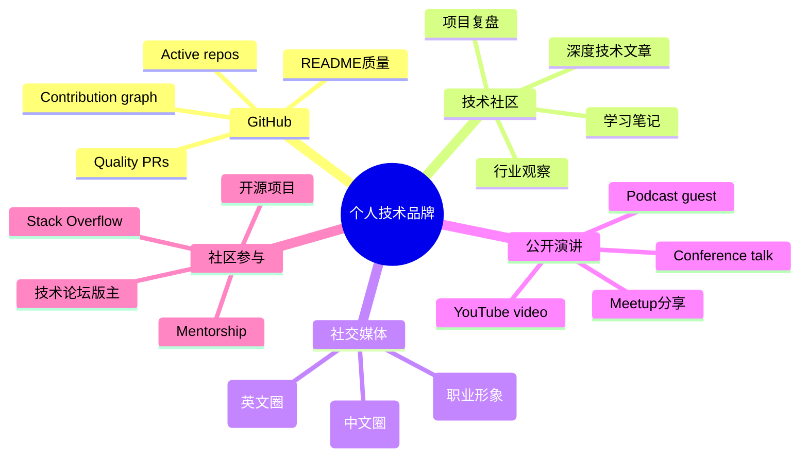

**内容创作策略（2026版）**

**① 写作平台选择**

| 平台 | 优势 | 劣势 | 适合内容 |
|------|------|------|---------|
| **个人网站 (Hugo/Gatsby)** | 完全控制、SEO友好 | 需要维护 | 长文、系列教程 |
| **Dev.to** | 社区活跃、易获得反馈 | 流量不稳定 | 技术分享、quick tips |
| **Medium** | 国际读者多、排版优美 | paywall争议 | 行业分析、career advice |
| **掘金/知乎** | 中文流量大 | 广告多 | 中文技术文章 |
| **微信公众号** | 移动端友好、社交传播 | SEO差、封闭生态 | 个人思考、行业观察 |

**② 内容类型推荐（按ROI排序）**

1. **"我在生产环境中遇到的XXX问题"** （最高ROI）
   - 原因：真实、有细节、帮助他人避坑
   - 示例："我们的Kafka集群为什么在双十一挂了？"

2. **"如何从零搭建XXX系统"** （高ROI）
   - 原因：实用性强、搜索量大、容易获得backlink
   - 示例："从零搭建一个百万级用户的实时聊天系统"

3. **"技术选型对比：A vs B vs C"** （中等ROI）
   - 原因：帮助他人做决策、展示你的判断力
   - 示例："2026年Go vs Rust vs Java：后端开发的最佳选择？"

4. **"读书笔记 / 学习总结"** （低ROI但有长期价值）
   - 原因：强迫自己深入理解、建立thought leadership
   - 示例：《DDIA》读书笔记系列

**③ AI辅助写作的最佳实践**

2026年，几乎每个技术博主都在使用AI辅助写作。关键是**如何正确使用**：

✅ **应该做的**：
- 用AI进行brainstorming和outline生成
- 用AI检查grammar和expression
- 用AI将中文草稿翻译成英文版本
- 用AI生成Mermaid图表或代码示例

❌ **不应该做的**：
- 让AI完全代写（缺乏personal voice）
- 不验证AI生成的技术细节（可能有hallucination）
- 发布前不加入自己的insights和experience

**最佳实践**：
> "我先用AI生成初稿，然后加入我的真实案例和数据，最后用自己的语言重写关键段落。这样效率提高了3倍，同时保持了authenticity。"

#### 职业发展路径：从IC到Manager的选择

**IC（Individual Contributor）vs Manager 的决策框架**

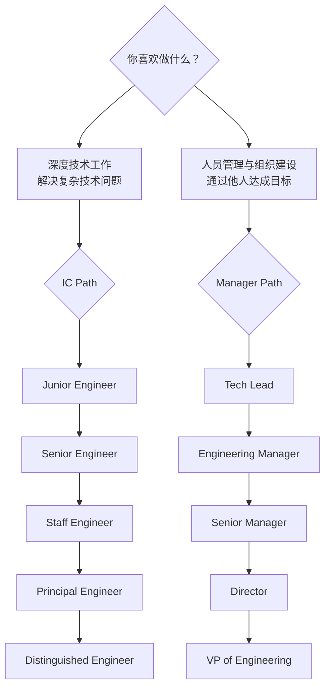

**如何选择？问自己这些问题**：

| 问题 | 偏向IC | 偏向Manager |
|------|--------|------------|
| 什么让你更有成就感？ | 写出优雅的代码、解决难题 | 帮助团队成员成长、看到团队成功 |
| 你更喜欢哪种工作方式？ | 深度focus、长时间不被打扰 | 多任务切换、频繁会议和沟通 |
| 你的能量来源是什么？ | 独立思考和探索 | 与人互动、激励他人 |
| 你对未来的期望是什么？ | 成为某一领域的顶级专家 | 建立和管理大型工程组织 |

**重要提醒**：
- **IC不是"升不上去才做的"，而是一个 deliberate choice**
- 在Google/Meta等公司，Staff/Principal Engineer的compensation等同于甚至超过同级别的Manager
- **IC path同样需要leadership**：只是你的influence是通过technical excellence而非authority实现的

**2026年的新兴角色**

除了传统的IC和Manager之外，2026年出现了一些新的职业路径：

| 新角色 | 描述 | 要求 | 薪资范围 |
|--------|------|------|---------|
| **AI Platform Engineer** | 构建和管理LLM基础设施 | ML + Infra + System Design | 高（AI premium） |
| **Developer Advocate** | 连接公司与开发者社区 | Technical + Communication + Community | 中高 |
| **Staff+ Platform Engineer** | 跨团队的platform建设 | Architecture + Influence + Strategy | 很高 |
| **Engineering Productivity** | 改进开发工具链和流程 | Internal tools + Data + Process | 中高 |
| **Solutions Architect** | 帮助客户成功使用产品 | Deep product knowledge + Customer facing | 高（含commission） |

---

### 4.3 实践建议：构建实力的行动指南

#### 日常技术提升Routine

需要认识到："学习不要图快，要学会找到掌握知识的方法，而不是死记硬背。"以下是适合2026年的学习方法：

**每日（30-60分钟）**：
- [ ] 刷一道LeetCode（保持手感）
- [ ] 阅读一篇高质量技术文章（Hacker News, Lobsters）
- [ ] 浏览GitHub Trending，了解新技术动态

**每周（3-5小时）**：
- [ ] 深入学习一个技术主题（看书/课程/官方文档）
- [ ] 写一篇技术笔记或blog post
- [ ] 参与一次开源 contribution（PR或review）
- [ ] 和同事/friend进行一次技术discussion

**每月（1天）**：
- [ ] 完成一个side project或prototype
- [ ] 参加一次线下/线上tech meetup或conference
- [ ] 复盘本月的学习成果，调整下月计划

**每季度（2-3天）**：
- [ ] 深度阅读一本经典技术书籍
- [ ] 更新个人简历和portfolio
- [ ] 进行一次mock interview（保持面试状态）

#### "跳槽"还是"深耕"？2026年的策略

原版文章中指出："适当的跳槽还是很有必要的。"但在2026年，这个问题的答案变得更加 nuanced。

**什么时候该跳槽？**

| 信号 | 说明 |
|------|------|
| **技术停滞** | 当前岗位无法提供新的技术挑战 |
| **薪资倒挂** | 市场价明显高于当前薪资（>30%） |
| **文化不匹配** | 价值观与公司文化严重冲突 |
| **职业天花板** | 清楚看到未来2-3年内无晋升可能 |
| **公司风险** | 公司业务萎缩、裁员频繁 |

**什么时候该留下？**

| 信号 | 说明 |
|------|------|
| **高速成长** | 公司处于上升期，有大量learning opportunity |
| **核心项目** | 你负责的是公司的战略性项目 |
| **优秀团队** | Team里有你可以学习的mentor和peer |
| **Work-life balance** | 当前的工作节奏和生活目标匹配 |
| **Equity upside** | 公司未上市或有significant unvested equity |

**跳槽的最佳时机**

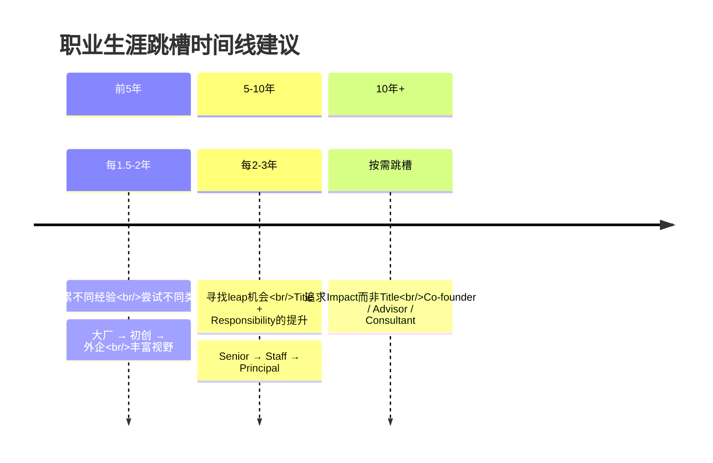

**2026年特殊考量**：
- **Remote工作的普及**使得地理限制减少，可以global job search
- **AI行业的爆发**创造了大量高薪机会（但bubble risk也存在）
- **经济不确定性**使得"稳定"变得相对更有价值

#### 持续学习：对抗技术焦虑的唯一武器

> "这个世界上唯一不变的就是变化本身。" — Heraclitus

在技术日新月异的2026年，**学习能力比任何具体技术都重要**。

**学习方法升级：费曼学习法 2.0（AI辅助版）**

传统的费曼学习法：
1. 选择一个概念
2. 用简单的语言解释给"小学生"
3. 发现解释不清的地方
4. 回顾并简化

**2026 AI增强版**：

```mermaid
flowchart TD
    A[选择学习主题] --> B[用AI生成学习路线图<br/>Prompt: "我想学习X，<br/>请为我制定一个4周的学习计划"]
    B --> C[深入学习核心概念<br/>读官方文档/经典书籍]
    C --> D[用AI模拟教学场景<br/>Prompt: "假装你是X领域的专家，<br/>我是初学者，请向我解释Y概念"]
    D --> E[动手实践<br/>写code/build project]
    E --> F[教给AI听<br/>Prompt: "我现在来向你解释X概念，<br/>请指出我的理解错误和不准确之处"]
    F --> G[根据反馈迭代<br/>补全knowledge gap]
    G --> H[输出成文章/视频<br/>teaching others = best learning]

```

**为什么这种方法有效？**
- AI作为"不知疲倦的学生"，可以无限次地听你讲解
- AI能精准指出你的knowledge gap和misconception
- Teaching others（即使是教AI）是最deep的学习方式

---

### 4.4 资源推荐：实力构建工具箱

#### 必读书籍（分级书单）

**📚 L1-L2 基础巩固**
1. *The C Programming Language* (K&R) — C语言圣经
2. *Computer Systems: A Programmer's Perspective* (CSAPP) — 系统基础
3. *Algorithms* (Sedgewick/Wayne) — 算法与数据结构
4. *Designing Data-Intensive Applications* (Kleppmann) — 分布式系统必读

**📖 L3-L4 进阶提升**
5. *The Art of Computer Programming* (Knuth) — 算法艺术的巅峰
6. *Distributed Systems: Principles and Paradigms* (Tanenbaum) — 分布式理论
7. *Site Reliability Engineering* (Google) — SRE实践
8. *Building Secure & Reliable Systems* (Google) — 安全与可靠

**🧠 L5 战略思维**
9. *The Staff Engineer's Guide* (Will Larson) — 高级工程师路径
10. *An Elegant Puzzle* (Will Larson) — 工程管理
11. *High Output Management* (Andy Grove) — 管理经典
12. *The Phoenix Project* (Gene Kim) — DevOps转型小说

#### 在线学习平台对比（2026版）

| 平台 | 优势 | 劣势 | 价格 | 适合人群 |
|------|------|------|------|---------|
| **Coursera** | 大学课程、证书权威 | 更新较慢 | 免费-$79/月 | 系统学习理论基础 |
| **edX** | MIT/Harvard课程 | 互动性一般 | 免费-$250/门 | 学术导向 |
| **Udemy** | 课程数量巨大、价格低 | 质量参差不齐 | $10-20/门 | 快速上手特定技术 |
| **Pluralsight** | 技术技能聚焦 | 缺乏深度 | $29/月 | 企业培训风格 |
| **Frontend Masters** | 前端领域极深 | 仅前端 | $39/月 | 前端工程师 |
| **极客时间** | 中文、国内实战案例 | 质量波动 | 订阅制 | 国内开发者 |
| **YouTube** | 免费、覆盖面广 | 质量参差、碎片化 | 免费 | 补充学习 |

#### 技术社区参与

| 社区 | 类型 | 特点 | 参与方式 |
|------|------|------|---------|
| **GitHub** | 代码托管 | 全球最大开源社区 | PR、Issue、Discussion |
| **Stack Overflow** | Q&A | 技术问答权威 | 回答问题、reputation |
| **Hacker News** | 新闻聚合 | 技术前沿讨论 | Comment、Submit |
| **Lobsters** | 技术社区 | 高质量技术讨论 | Submit、Comment |
| **Reddit (r/programming)** | 论坛 | 广泛话题 | 参与 discussion |
| **即刻** | 中文社交 | 国内技术圈子 | 发帖、评论 |
| **V2EX** | 中文论坛 | 老牌技术社区 | 分享、讨论 |
| **Discord/Slack** | 即时通讯 | 实时交流 | 加入tech community server |

---

### 4.5 总结：实力是唯一的通行证

#### 核心要点回顾

1. **技术实力定义升级**：从"会写代码"到"系统思维 + 工程实践 + AI驾驭 + 沟通协作"
2. **基础知识永不过时**：CS基础、分布式理论、数据库internals是护城河
3. **开源贡献是最好的投资**：建立技术影响力、拓展人脉、被动求职
4. **个人品牌是新必需品**：写作、演讲、社区参与，让机会来找你
5. **学习能力是终极竞争力**：费曼学习法2.0，AI辅助下的高效学习

#### 回归本质的智慧

原版文章的最后说了一段非常深刻的话：

> "要应付并通过面试并不难，但是，千万不要应付你的人生，你学技术不是用来面试的，它至少来说是你谋生的技能，要尊重自己的谋生技能，说不定，哪天你还要用这些技能造福社会、改变世界的。"

这段话在2026年更加振聋发聩：

- **AI可以帮你写代码，但不能帮你拥有技术直觉**
- **AI可以帮你准备面试，但不能替你在生产环境救火**
- **AI可以生成技术文章，但不能替代你的独特经验和洞察**

**真正的实力，是你关掉AI之后依然能够解决问题的能力。**

#### 最后的行动号召

如果你现在正处于职业生涯的迷茫期，或者感觉遇到了瓶颈，记住：

> **最好的种树时间是十年前，其次是现在。**

从今天开始：
1. 选一个你最感兴趣的技术方向，深入下去
2. 在GitHub上找到一个你使用的开源项目，提交第一个PR
3. 开始写技术社区，记录你的学习和思考
4. 每周固定时间学习和实践，坚持一年

一年后的你会感谢现在开始行动的自己。

---

## 延伸资源

### 原版文章
- [92 原版：面试前的准备](https://time.geekbang.org/column/article/13067)
- [93 原版：面试中的技巧](https://time.geekbang.org/column/article/13069)
- [94 原版：面试风格](https://time.geekbang.org/column/article/13191)
- [95 原版：实力才是王中王](https://time.geekbang.org/column/article/13192)

### 系统设计与架构
- [System Design Primer](https://github.com/donnemartin/system-design-primer) — 开源免费的系统设计指南
- [System Design Interview Cheat Sheet](https://github.com/donnemartin/system-design-primer) — 面试速查表
- [The Complete FAANG Interview Preparation Guide](https://techinterviewhandbook.org) — FAANG面试完整指南
- [ByteByteGo](https://bytebytego.com) — 图文并茂的系统设计讲解
- [Designing Data-Intensive Applications (DDIA)](https://dataintensive.net) — 分布式系统圣经

### 面试准备工具
- [The Complete Guide to Behavioral Interviews](https://exponent.com) — 行为面试完整指南
- [Remote Interview Best Practices](https://careers.google.com/how-we-hire/) — 远程面试最佳实践
- [Salary Negotiation Guide](https://levels.fyi/blog/negotiate-your-compensation) — 薪资谈判指南

### 职业发展与实力建设
- [The Staff Engineer's Guide](https://staffeng.com) — 高级工程师路径指南
- *A Philosophy of Software Design* (John Ousterhout) — 软件设计哲学
- [How to Become a Senior Software Engineer](https://khalilstemmler.medium.com) — 高级工程师成长之路

### 学习资源汇总
- **LeetCode** — 算法练习（leetcode.com）
- **Pramp** — 免费Peer-to-Peer Mock Interview（pramp.com）
- **interviewing.io** — 专业Mock Interview（interviewing.io）
- **Exponent** — Behavioral Interview Prep（exponent.com）
- **NeetCode.io** — 算法视频教程（neetcode.io）
- **Grokking the System Design Interview** — System Design互动课程（educative.io）
