# 高效学习方法论（2026重制版）

> **核心变更说明**：本篇整合了原《高效学习》系列的全部五篇文章（96-100），涵盖学习态度、信息筛选、深度方法论、代码阅读策略、以及克服学习障碍的完整体系。在AI可以瞬间生成任何答案的2026年，"学习"的本质已经从**信息获取**转向**能力构建**和**思维模式升级**。本文融入了AI辅助学习的边界、第二大脑理论、Zettelkasten知识管理法、第一性原理思维、费曼技巧的AI增强版、认知负荷理论等现代学习方法论，帮助你在技术快速迭代的时代建立可持续的高效学习系统。

---

## 一、端正学习态度

### 1.1 学习的"逆人性"本质

原版文章开篇就指出："学习是一件'逆人性'的事，就像锻炼身体一样，需要人持续付出，会让人感到痛苦，并随时想找理由放弃。"这句话在2026年不仅没有过时，反而更加深刻。

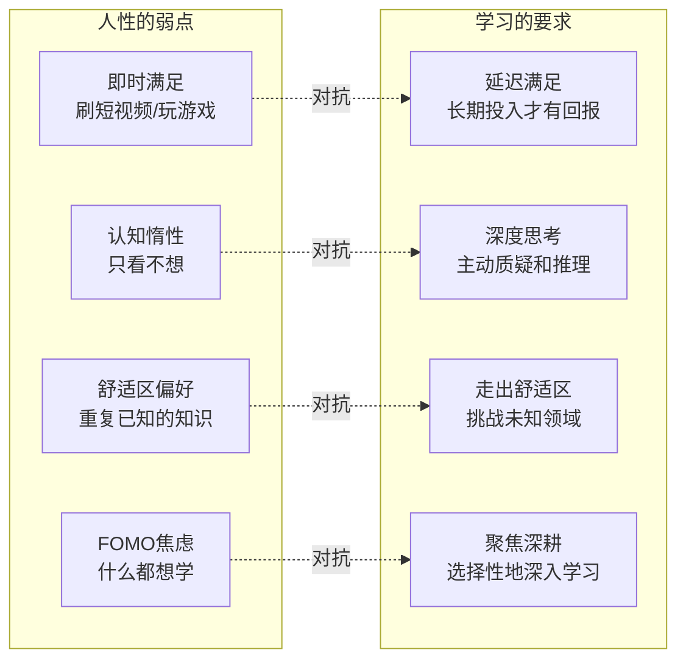

**2026年的新挑战**：

当AI可以在几秒钟内生成任何答案、写出任何代码、总结任何书籍时，人类面临的诱惑前所未有地强大：

- **为什么还要辛苦学算法？** AI已经能解决大部分LeetCode题目了
- **为什么还要深入理解原理？** 遇到问题问ChatGPT不就行了？
- **为什么要记忆知识？** 所有信息都在云端，随时可查

**但真相是**：
- **AI给出的答案可能是错的**（hallucination问题依然存在）
- **没有基础判断力，你无法验证AI输出的正确性**
- **真正的竞争力不是"知道答案"，而是"提出正确的问题"**

### 1.2 学习的层次模型（2026更新版）

原版文章提到了Edgar Dale的"学习金字塔"理论。让我们在此基础上进行扩展：

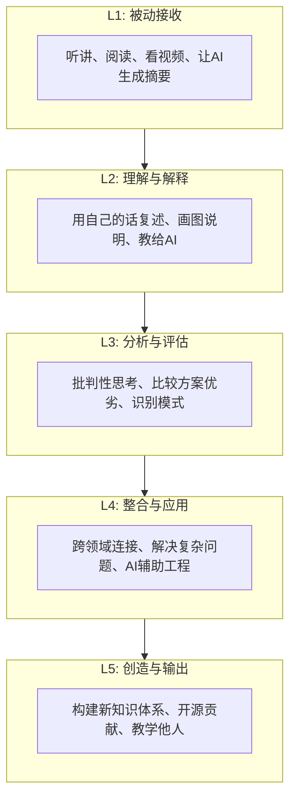

**关键洞察**：
- **L1-L2是"假学习"**：让你产生"我懂了"的幻觉，但实际上什么都没记住
- **L3-L4是"真学习"**：需要主动思考和大量实践
- **L5是"大师级学习"**：你不仅掌握了知识，还能创造新的知识

**2026年的陷阱**：AI工具让你很容易停留在L1-L2层面，因为获取信息太容易了。**真正的学习者会刻意逼迫自己进入L3-L5**。

### 1.3 重新定义"学习"

#### 从"知识积累"到"能力构建"

传统观念认为学习 = 积累更多的知识。但在信息爆炸的2026年，这个定义已经过时：

| 维度 | 传统学习观 | 2026学习观 |
|------|-----------|-----------|
| **目标** | 掌握更多知识 | 构建可迁移的能力 |
| **方法** | 阅读、记忆、背诵 | 思考、实践、创造 |
| **度量** | 读了多少书、看了多少课 | 解决了多少问题、创造了什么价值 |
| **工具** | 书籍、课程 | AI辅助 + 实践项目 + 社区 |
| **结果** | 知识库（容易遗忘） | 思维模式和直觉（内化为能力） |

**核心转变**：
> 学习不是为了"知道更多"，而是为了"变得更强"。
>
> 更强的意思是：面对未知问题时，你有**方法论**去解决它；面对复杂系统时，你有**思维模型**去分析它；面对技术选型时，你有**判断力**去做决策。

#### 四维学习观（2026诠释）

原版文章提出了四个关于学习的重要观点，让我们用2026的语言重新诠释：

**① 学习是为了找到方法，而不是答案**

```
❌ 传统思维：我要记住所有API的用法
✅ 2026思维：我要学会如何快速查找和理解任何API

❌ 传统思维：我要背下所有排序算法的实现
✅ 2026思维：我要理解算法的设计思路，需要时能快速实现或找到最优解

❌ 传统思维：我要读完这本500页的书
✅ 2026思维：我要从这本书中提炼出能改变我思维方式的核心洞察
```

**② 学习是为了理解原理，而不是表面知识**

> "一旦理解和掌握了这些本质的东西，你就会发现，整个复杂多变的世界在变得越来越简单。"

在2026年，这个观点更加重要，因为：
- 技术栈的半衰期越来越短（平均2-3年）
- 框架和工具层出不穷（今天React，明天可能就是别的）
- 但底层原理（操作系统、网络、分布式系统理论）几十年不变

**投资于那些变化慢的知识，才能获得最高的长期回报。**

**③ 学习是为了发现未知，了解自己**

英文说："You don't know what you don't know." 在2026年，这个问题更加严重——因为AI会让你觉得你"什么都能做到"，从而掩盖了你真正的knowledge gap。

**危险信号**：
- 你能用AI生成代码，但不理解它为什么这样工作
- 你能回答面试题，但不能解释设计决策背后的trade-off
- 你知道很多技术的名字，但没有深入掌握任何一个

**应对策略**：
- 定期做"白板测试"：关掉所有工具，看你能否画出系统架构图
- 参与开源项目：真实的code review会让你暴露所有gap
- 教授他人：如果你不能用简单语言解释清楚，说明你没真懂

**④ 学习是为了改变自己，而不仅仅是成长**

需要认识到："学习是为了改变自己的思考方式，改变自己的思维方式，改变自己与生俱来的那些垃圾和低效的算法。"

这是一个非常深刻的观点。学习的终极目的不是"增加"，而是**"替换"**：
- 用科学的思维方式替代直觉猜测
- 用结构化的分析方法替代混乱的试错
- 用数据驱动的决策替代拍脑袋
- 用成长型思维替代固定型思维

### 1.4 对抗"快餐文化"：深度学习 vs 浅层消费

#### 信息时代的悖论

我们生活在一个前所未有的信息丰富时代，但同时也是一个**深度思考稀缺**的时代。

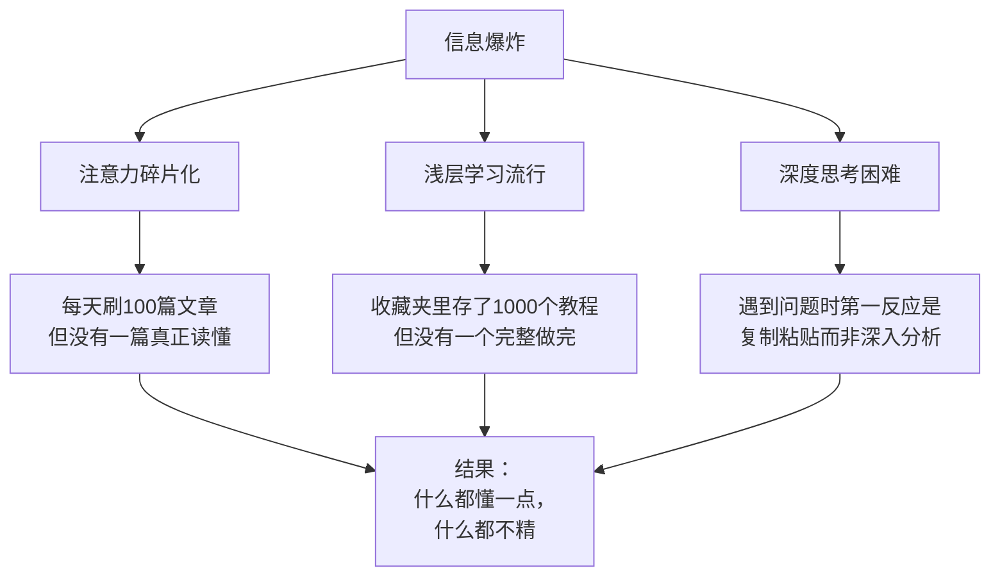

**症状自查**：你是否有以下表现？

| 行为 | 是/否 |
|------|------|
| 微信公众号/知乎的文章只看标题和加粗部分？ | |
| 技术书买了不少，但很少完整读完一本？ | |
| 遇到问题先Google/Copy，而不是先思考？ | |
| 觉得自己"学了很多"，但实际项目还是不会做？ | |
| 经常感到"知识焦虑"，怕错过新技术？ | |

如果以上大部分答案是"yes"，你可能陷入了**"收集者谬误"**——误以为收藏=学习，浏览=掌握。

#### 如何逃离"快餐文化"？

**原则一：少即是多（Less is More）**

与其泛读100篇肤浅的文章，不如**深读5篇高质量的经典**。

**如何识别高质量信息源？**

| 特征 | 高质量信息源 | 低质量信息源 |
|------|-------------|-------------|
| **来源** | 原始论文、官方文档、经典书籍 | 二手解读、营销号、短视频 |
| **深度** | 有详细推导、数据和引用 | 只有结论，没有论证过程 |
| **时效性** | 经典内容不过时 | 追逐热点，快速过时 |
| **作者** | 该领域的practitioner或researcher | 内容农场、流量导向 |
| **互动性** | 引发思考，有讨论空间 | 喂投式内容，不需要思考 |

**推荐的高质量信息源（2026版）**：

| 类别 | 推荐资源 | 说明 |
|------|---------|------|
| **学术论文** | ACM Digital Library, arXiv.org | 第一手研究，最权威 |
| **经典书籍** | DDIA, SRE Book, CSAPP | 经过时间检验的智慧 |
| **官方文档** | 各语言的官方文档、RFC | 准确且及时 |
| **深度博客** | Martin Fowler's Blog, High Scalability | 业界专家的经验分享 |
| **技术社区** | Hacker News, Lobsters | 高质量讨论，筛选机制好 |

**原则二：主动输入 vs 被动接收**

```mermaid
flowchart LR
    subgraph 被动学习（低效）
        A1[看视频]
        A2[听播客]
        A3[刷文章]
        A4[让AI总结]
    end

    subgraph 主动学习（高效）
        B1[做笔记+画图]
        B2[写代码验证]
        B3[教给别人/AI]
        B4[做项目应用]
        B5[参与讨论/辩论]
    end

    A1 -->|"转化为"| B1
    A2 -->|"转化为"| B2
    A3 -->|"转化为"| B3
    A4 -->|"质疑和验证"| B4

```

**具体做法**：
- 每读一章书，必须写下至少3个关键要点（用自己的话）
- 每学一个概念，必须写代码验证或画图解释
- 每看完一个教程，必须做一个相关的小project
- 每遇到一个有趣的观点，必须思考"这在我的工作中如何应用？"

**原则三：输出倒逼输入**

这是最高效的学习方法：**为了教而学**。

当你知道下周要给团队做一个技术分享时，你的学习效率会是平时的5-10倍。因为你不仅要理解，还要能够清晰地表达；不仅要知其然，还要知其所以然（否则会被提问难住）。

**输出形式建议**：
1. **技术社区**：把学到的东西写成文章（最低门槛）
2. **内部分享**：给team做presentation（中等门槛）
3. **开源贡献**：用学到的技术修复bug或添加feature（高门槛）
4. **录制视频**：做成tutorial发布到YouTube/B站（最高门槛）

### 1.5 AI时代的"新文盲"危机

#### 什么是"AI依赖症"？

2026年出现了一种新的现象：**过度依赖AI导致的基础能力退化**。

**症状表现**：

| 场景 | 正常行为 | AI依赖行为 |
|------|---------|-----------|
| **写代码** | 先思考架构，再动手写 | 直接让AI生成，不做review就提交 |
| **Debug** | 先分析日志和代码逻辑 | 直接把error message丢给ChatGPT |
| **学习新概念** | 读文档、写代码实验 | 让AI解释一遍就觉得懂了 |
| **技术选型** | 做POC、对比测试 | 问AI"哪个更好？"然后直接采纳 |
| **写文档** | 自己组织语言和结构 | 让AI生成，不加修改直接用 |

**风险**：
1. **判断力退化**：无法识别AI的错误输出
2. **创造力萎缩**：丧失独立解决问题的能力
3. **知识空洞化**：看似什么都知道，实际什么都不扎实
4. **面试暴露**：离开AI后表现断崖式下跌

#### 如何健康地使用AI辅助学习？

**黄金法则：AI是你的copilot，不是autopilot。**

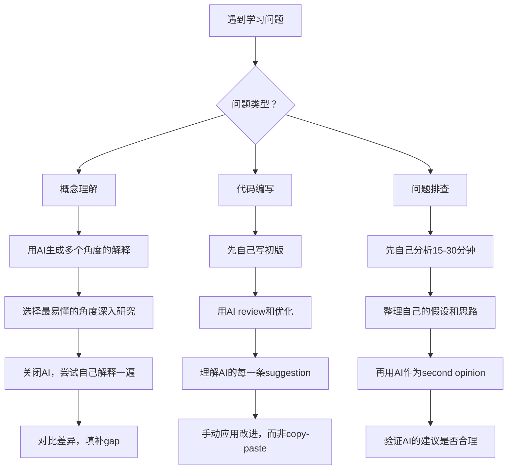

**核心原则**：
1. **永远先自己思考**：即使最终要用AI，也要先经过自己的大脑
2. **质疑AI的输出**：不要盲目信任，特别是技术细节
3. **理解后再使用**：如果AI给出了代码，确保你理解每一行
4. **保持手动能力**：定期练习不用AI完成工作（如每月一次"AI detox day"）

### 1.6 第二大脑理论：Zettelkasten知识管理法

在信息爆炸的时代，**如何管理和利用学到的知识**成为核心竞争力。这里介绍一种经过验证的方法：Zettelkasten（卡片盒笔记法）。

#### 什么是Zettelkasten？

Zettelkasten是德国社会学家Niklas Luhmann发明的一种知识管理系统，他凭借这个方法一生出版了70多本书和400多篇学术论文。

**核心理念**：
- 不是线性地"存储"知识，而是建立知识之间的**网络连接**
- 每条笔记都是一个独立的"原子化"想法
- 通过链接将相关的想法连接起来，形成**涌现性的洞察**

#### Zettelkasten的工作流程

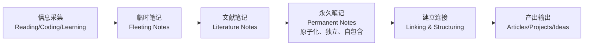

**实施步骤**：

**Step 1: 采集（Capture）**
- 读书、看文章、写代码时的灵光一闪
- 快速记录，不要追求完美
- 工具：手机备忘录、Obsidian Quick Capture、Notion

**Step 2: 文献笔记（Literature Notes）**
- 用自己的话总结原文的核心观点
- 一篇文献/一章书 = 一条文献笔记
- 包含：摘要、关键引文、你的初步想法

**Step 3: 永久笔记（Permanent Notes）——核心！**
- 每条笔记只包含**一个想法**（原子性）
- 用**完整的句子**书写（不是关键词）
- 必须是你**自己的话**（不能抄原文）
- 注明**来源**（方便追溯）

示例：
```
---
tags: [distributed-systems, consistency]
source: DDIA Chapter 5
---

# 线性一致性与因果一致性

线性一致性（Linearizability）是最强的一致性保证，
它要求数据库看起来就像只有一个数据副本，
所有操作都原子地生效。

但在实践中，线性一致性的性能代价很高，因为需要
协调多个节点。对于大多数应用来说，因果一致性
（Causal Consistency）已经足够，而且性能更好。

关键洞察：不要默认使用最强的一致性级别，
要根据业务需求选择合适的trade-off。
```

**Step 4: 连接（Linking）**
- 新笔记写完后，思考它与哪些已有笔记相关
- 使用双向链接 `[[note-name]]` 建立 connection
- 这一步会产生**创造性洞察**（两个看似无关的概念突然产生了联系）

**Step 5: 产出（Output）**
- 当你需要写文章、做决策、解决问题时
- 通过浏览和搜索你的笔记网络
- 相关的想法会自动"涌现"出来

#### 工具推荐（2026版）

| 工具 | 类型 | 优势 | 劣势 | 价格 |
|------|------|------|------|------|
| **Obsidian** | 本地Markdown | 隐私、插件生态强、免费 | 需要自己配置同步 | 免费 |
| **Roam Research** | 大纲式笔记 | 双向链接原生支持 | 性能问题、价格贵 | $15/月 |
| **Notion** | All-in-one | 数据库功能强大、协作友好 | 离线体验差 | 免费-$8/月 |
| **Logseq** | 开源本地 | 类似Roam but free | 相对小众 | 免费 |
| **Heptabase** | 视觉化 | 白板式组织、适合思考 | 较新、生态待完善 | $7/月 |

**我的推荐**：对于技术人员，**Obsidian**是最好的选择——基于Markdown、本地存储、丰富的社区插件、完全控制你的数据。

### 1.7 学习节奏：对抗倦怠的策略

#### 为什么大多数人无法坚持学习？

需要认识到："坚持是一件反人性的事，所以，它才难能可贵，也更有价值。"

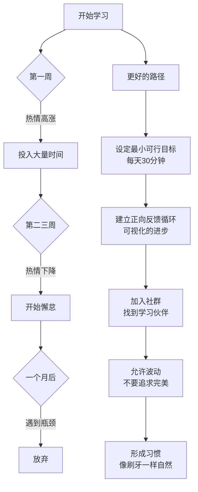

**可持续学习的五个要素**：

**① 最小可行目标（Minimum Viable Goal）**

不要一开始就定"每天学习4小时"这种不可能持续的目标。

**推荐**：
- 每天**30分钟**的专注学习（比0强无穷倍）
- 每周**1篇**技术笔记或blog post
- 每月**1本**经典技术书的深度阅读
- 每季度**1个**完整的side project

**② 正向反馈循环（Positive Feedback Loop）**

学习之所以难以坚持，是因为反馈太延迟了——你可能学了半年才看到效果。

**加速反馈的方法**：
- **可视化进度**：用GitHub graph、Notion dashboard、habit tracker记录
- **公开承诺**：在社交媒体上宣布学习目标（social pressure）
- **即时奖励**：完成一个小目标后给自己小奖励（一杯咖啡、一集剧）
- **分享成果**：把学到的东西立刻应用到工作中或分享出去

**③ 社群力量（Community）**

一个人走得快，一群人走得远。

**参与方式**：
- 加入学习小组（线上或线下）
- 找一个accountability partner（互相监督）
- 参与技术社区的discussion
- 参加线下meetup或conference

**④ 允许不完美（Embrace Imperfection）**

完美主义是学习的敌人。

> "Done is better than perfect."

- 错过一天没关系，第二天继续就好
- 不需要每个知识点都彻底搞懂再往下走
- 可以先建立整体认知，再逐步深入细节
- 接受"暂时不懂"的状态，给它时间发酵

**⑤ 与工作结合（Learning by Doing）**

最好的学习是在真实项目中学习。

- 当前工作中的痛点 → 学习方向
- 项目中遇到的技术难题 → 深入研究的契机
- Code Review中的feedback → 改进的依据

### 1.8 学习者的心态修炼

#### 成长型思维（Growth Mindset）

心理学家Carol Dweck的研究表明，人的思维模式可以分为两种：

| 固定型思维 (Fixed Mindset) | 成长型思维 (Growth Mindset) |
|---------------------------|----------------------------|
| 能力是天生的 | 能力可以通过努力发展 |
| 避免挑战 | 拥抱挑战 |
| 遇到困难就放弃 | 面对挫折坚持不懈 |
| 认为努力是无能的表现 | 认为努力是通往精通的必经之路 |
| 无视有用的负面反馈 | 从批评中学习 |
| 他人的成功威胁到自己 | 从他人的成功中获得启发和激励 |

**如何在日常中培养成长型思维？**

1. **把"我不会"改成"我还不会"**
   - ❌ "我不擅长System Design"
   - ✅ "我还不擅长System Design，但我可以通过学习和练习提升"

2. **把"失败了"改成为了"学习了"**
   - ❌ "这次面试失败了"
   - ✅ "我从这次面试中学到了X、Y、Z，下次会做得更好"

3. **赞美过程而非天赋**
   - 当别人夸你"聪明"时，内心要知道：这是努力的成果
   - 当夸奖别人时，说"你在这个问题上很用心"而不是"你真聪明"

#### 对抗Imposter Syndrome（冒名顶替综合征）

很多优秀的技术人员都有这种感觉：
> "我不配在这里。其他人都是真正的专家，而我只是个骗子，迟早会被揭穿。"

**真相是**：
- 越有能力的人，越容易有这种感觉（Dunning-Kruger效应的反面）
- 这种感觉永远不会完全消失，但你可以学会与之共存
- 它其实是一种动力——推动你不断学习和改进

**应对策略**：
1. **记录成就**：维护一个"成功清单"，记录你解决的问题、获得的认可
2. **接受"足够好"**：你不是要成为全世界最厉害的人，只要比昨天的自己强就行
3. **帮助他人**：当你教导Junior时，你会意识到自己其实已经懂得很多
4. **公开谈论**：在安全的场合分享这种感觉，你会发现很多人都有同样的困扰

---

## 二、源头、原理和知识地图

### 2.1 信息质量决定学习上限

原版文章中强调："对于一个学习者来说，找到优质的信息源可以让你事半功倍。"这句话在2026年具有了全新的紧迫性——因为**信息的数量已经不再是瓶颈，质量才是**。

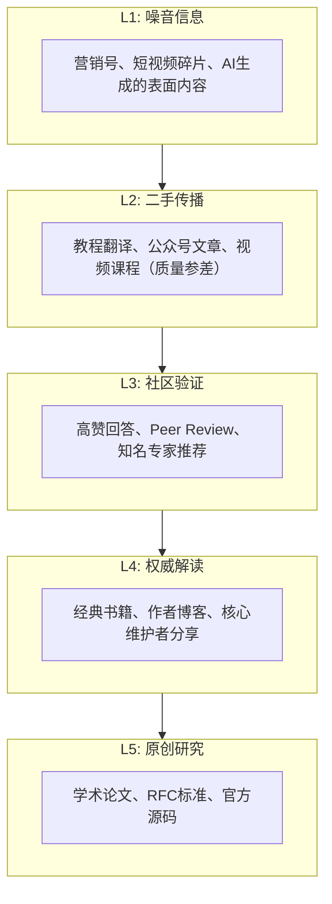

**关键洞察**：
- **90%的人停留在L2-L3层面**：消费被消化过的二手信息
- **前10%的学习者深入到L4-L5**：直接接触一手资料
- **差距来源**：不是智商差异，而是**信息选择策略**

### 2.2 "垃圾进，垃圾出"（GIGO）在学习中的体现

如果你学习的源头就是错误或肤浅的，那么无论你的学习方法多么高效，最终产出的理解都是有缺陷的：

| 现象 | 根本原因 | 后果 |
|------|---------|------|
| 对概念的理解是片面的 | 只看了教程，没读官方文档 | 遇到edge case就懵 |
| 知道用法但不懂原理 | 只会API调用，不了解internals | 无法优化和debug |
| 被误导而不自知 | 信息源有错误或过时 | 传播错误知识给他人 |
| 缺乏判断力 | 没有建立自己的知识体系 | 无法识别AI输出的错误 |

### 2.3 第一手资料的获取与验证

#### 什么算"第一手资料"？

在技术领域，信息源的权威性层级如下：

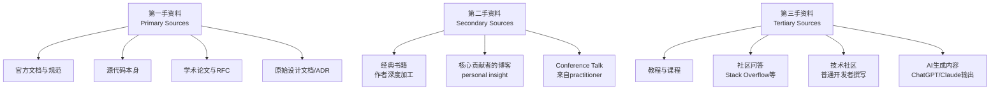

**2026年的新挑战**：AI生成的内容大量充斥在网络上，使得区分L2和L3变得更加困难。

#### 如何验证信息的可靠性？

**① 追溯到源头（Trace to Source）**

当你看到一个技术claim时，问自己：
- 这个说法的原始出处是什么？
- 有没有链接到官方文档或论文？
- 作者是否有足够的credibility来做出这个声明？

**示例**：
> ❌ "Redis比Memcached快30%" （没有来源的数据）
> ✅ "根据Redis官方benchmark（https://redis.io/docs/latest/operate/），在SET操作上..."

**② 交叉验证（Cross-Reference）**

不要只看一个来源。对于重要的知识点，至少找3个独立的来源进行对比：

| 来源A说 | 来源B说 | 来源C说 | 结论 |
|---------|---------|---------|------|
| X的性能更好 | Y更适合大规模场景 | Z的成本更低 | 需要进一步分析trade-off |

**③ 时间戳检查（Timestamp Verification）**

技术在快速变化。检查信息的发布时间：
- **>2年前的内容**：可能已经过时（特别是工具链和框架相关）
- **<6个月的内容**：较新但可能缺乏深度
- **经典书籍/论文**：虽然年代久远，但原理层面的内容通常不过时

**④ AI内容的特殊验证**

当使用AI获取信息时，必须进行额外验证：

```
Prompt模板（用于验证AI输出）：
"你刚才给出的关于X的回答，请提供：
1. 官方文档的链接支持
2. 如果有相关的RFC或论文，请引用
3. 有哪些常见的误区或例外情况？
4. 这个答案在哪个版本/时间点是准确的？"
```

### 2.4 技术知识的"冰山模型"

需要特别强调："基础知识和原理性的东西是无比重要的。这些基础知识就好像地基一样，只要足够扎实，就可以盖出很高很高的楼。"

让我们用冰山模型来可视化这个观点：

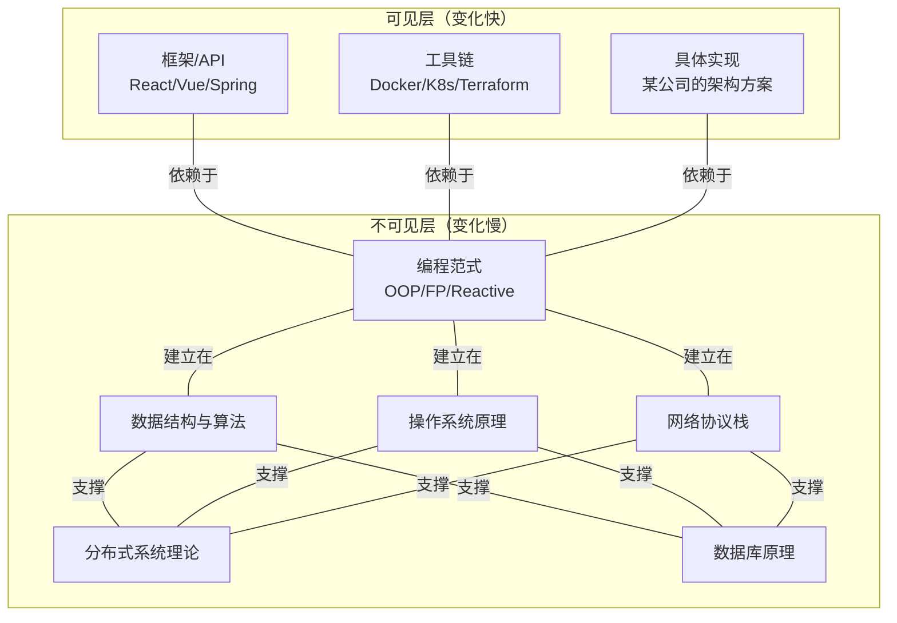

**投资回报率分析**：

| 知识类型 | 学习难度 | 半衰期 | ROI（长期） | 建议 |
|----------|---------|--------|------------|------|
| **框架/工具** | 低 | 1-2年 | ⭐⭐ | 够用即可，不需要深究 |
| **编程语言** | 中 | 5-10年 | ⭐⭐⭐⭐ | 掌握1-2门精通 |
| **系统原理** | 高 | 20年+ | ⭐⭐⭐⭐⭐ | **重点投资！** |

**实际案例**：

假设你在2018年深入学习Kubernetes的每个细节：
- 2018-2020：你是K8s专家，很值钱
- 2020-2023：K8s生态变化很大，你需要不断追赶
- 2023-2026：很多抽象层出现（Crossplane, KubeVirt等），底层知识依然有用

但如果你在2018年深入学习了**分布式系统理论**（CAP, Paxos, 一致性哈希）：
- 这些知识在任何分布式系统中都适用
- 无论上层框架如何变化，底层原理不变
- 你能更快地理解和掌握新技术

### 2.5 构建个人知识地图（Knowledge Graph）

#### 什么是知识地图？

原版文章中，这里介绍一种"联想记忆法"——通过从一个核心技术点出发，逐步展开成一个完整的知识树。这就是知识地图的雏形。

在2026年，我们可以用更系统化的方法来构建和维护知识地图：

**① 从核心出发的辐射式结构**

以"后端开发"为例：

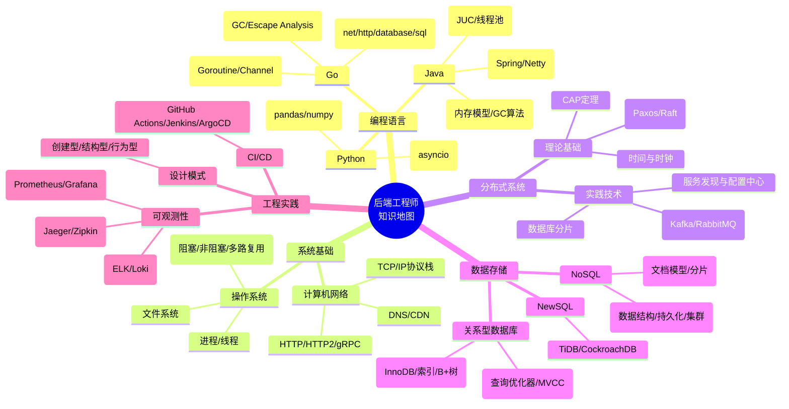

**② 知识节点的关系类型**

在构建知识地图时，不仅要记录"我知道什么"，还要记录知识点之间的关系：

| 关系类型 | 说明 | 示例 |
|----------|------|------|
| **is-a** (继承) | A是B的一种 | Go是一种编程语言 |
| **has-a** (组成) | A包含B | TCP连接包含状态机 |
| **uses** (依赖) | A使用B | HTTP使用TCP作为传输层 |
| **similar-to** (类比) | A类似于B | gRPC类似RPC but uses Protocol Buffers |
| **solves** (解决) | A解决B的问题 | Circuit Breaker解决级联故障问题 |
| **trade-off-with** (权衡) | A和B是trade-off | 强一致性与高性能 |

**③ 动态更新机制**

知识地图不是一次性的产物，而是需要持续维护的生命体：

```mermaid
flowchart LR
    A[学习新知识] --> B[定位到知识地图中的位置]
    B --> C{已存在?}
    C -->|是| D[更新已有节点的细节]
    C -->|否| E[创建新节点]
    E --> F[建立与其他节点的连接]
    D --> G[标记为"已复习"]
    F --> G
    G --> H{需要深入?}
    H -->|是| I[加入"待研究"列表]
    H -->|否| J[标记为"了解即可"]

```

**工具实现建议**：

| 工具 | 适用场景 | 特点 |
|------|---------|------|
| **Obsidian + Dataview** | 本地知识图谱 | 双向链接、Graph view插件 |
| **Notion Database** | 结构化知识管理 | 数据库视图、关系字段 |
| **Heptabase** | 视觉化思考 | 白板式的知识组织 |
| **Excalidraw** | 手绘风格图谱 | 直观、适合头脑风暴 |
| **Mermaid** | 代码生成图表 | 可嵌入Markdown、版本控制友好 |

### 2.6 技术学习的"第一性原理"方法

#### 什么是第一性原理思维？

第一性原理（First Principles Thinking）是由亚里士多德提出的思维方式，后来被Elon Musk推广到工程领域。其核心理念是：

> **把问题拆解到最基本的真理，然后从那里重新构建。**

而不是用类比思维（"别人都这么做，所以我也要这么做"）。

#### 在技术学习中应用第一性原理

**案例：学习Kubernetes**

❌ **类比思维路径**：
> "大家都说K8s很重要，所以我应该学。我先去报个班，跟着教程把常用的命令记住..."

✅ **第一性原理路径**：

```
Step 1: 问"为什么需要Kubernetes？"
→ 因为需要管理大量容器化的服务

Step 2: 问"容器管理的本质问题是什么？"
→ 调度（把Pod放到合适的Node上）
→ 服务发现（让服务之间能找到彼此）
→ 配置管理（统一管理配置）
→ 自愈能力（失败自动重启）

Step 3: 问"这些问题有没有更简单的解法？"
→ 对于小规模：Docker Compose就够了
→ 对于中等规模：可能Nomad更简单
→ 对于大规模：K8s确实是最佳选择

Step 4: 深入K8s的设计决策
→ 为什么用etcd而不是ZooKeeper？（CRDT vs ZAB）
→ 为什么调度器是这样设计的？（两阶段调度）
→ 为什么网络模型是CNI？（可插拔的哲学）

Step 5: 动手实践
→ 从minikube开始，自己搭建集群
→ 尝试破坏它（kill node、删pod），看自愈机制
→ 读源码理解关键组件的实现
```

**结果**：用第一性原理学习的人，不仅知道"怎么做"，还知道"为什么这样做"，以及"什么时候不该这么做"。

### 2.7 从新手到专家的Deliberate Practice路径

Anders Ericsson的"刻意练习"（Deliberate Practice）理论告诉我们：**专家不是天生的，而是通过特定的练习方法训练出来的**。

#### 刻意练习的四要素

| 要素 | 说明 | 技术学习中的应用 |
|------|------|------------------|
| **明确的目标** | 具体、可衡量的目标 | "本周掌握Go的并发模式"而不是"学Go" |
| **专注的练习** | 全神贯注，不被打扰 | 深度工作模式，每次至少45分钟 |
| **即时反馈** | 立刻知道自己做得对不对 | Code Review、自动化测试、AI review |
| **走出舒适区** | 在稍微超出能力的区域练习 | 做比你当前水平稍难的项目 |

#### 应用到技术学习的具体方法

**Level 1: 新手阶段（0-1年）**
- 目标：建立整体认知，能够完成基本任务
- 方法：跟随tutorial，做大量的copy-paste练习
- 反馈：程序能否运行？有没有error？
- 示例：跟着官方文档搭建一个web server

**Level 2: 初级阶段（1-3年）**
- 目标：理解why，不只是how
- 方法：读源码、读官方文档、做side project
- 反馈：Code Review、性能profiling、bug report
- 示例：不只用框架，尝试自己实现一个简化版的ORM

**Level 3: 中级阶段（3-5年）**
- 目标：能够做architecture decision
- 方法：参与开源、阅读论文、做system design
- 反馈：Peer review、production incident postmortem
- 示例：为一个真实项目选择并论证技术选型

**Level 4: 高级阶段（5-8年+）**
- 目标：定义best practice，影响行业
- 方法：写paper/blog、做conference talk、mentor他人
- 反馈：Community recognition、career impact
- 示例：提出一个新的design pattern或tool

### 2.8 知识地图的日常维护Routine

#### 每周知识回顾流程

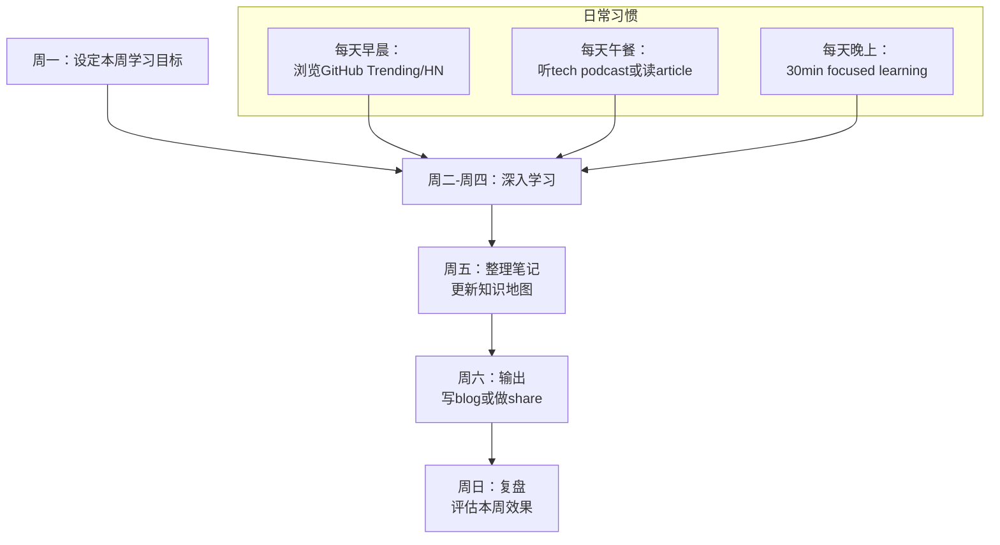

#### 季度知识审计

每季度花半天时间，对自己的知识体系进行全面审查：

| 审计维度 | 问题 | 行动 |
|----------|------|------|
| **覆盖度** | 我的知识地图有哪些空白？ | 补充缺失的关键节点 |
| **深度** | 哪些领域我只是"知道名字"？ | 选择1-2个深入钻研 |
| **时效性** | 哪些知识已经过时？ | 更新或标记为"历史参考" |
| **连通性** | 哪些知识点是孤岛？ | 建立与其他领域的联系 |
| **实用性** | 哪些知识我从未在实践中使用？ | 要么用起来，要么降低优先级 |

---

## 三、深度、归纳和坚持实践

### 3.1 深度学习的复利效应

原版文章中给出了一个6点的系统学习模板，并说："基本上来说，如果你按照我上面所提的这6大点来学习一门技术，你一定会学习到技术的精髓，而且学习的高度在一开始就超过很多人了。"

让我们量化一下"深度学习"的长期回报：

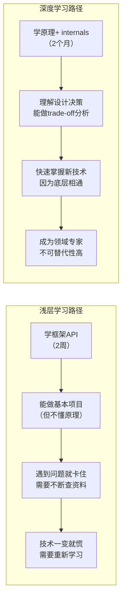

**5年后对比**：

| 维度 | 浅层学习者 | 深度学习者 |
|------|-----------|-----------|
| **可迁移能力** | 低（换框架就要重新学） | 高（底层原理通用） |
| **问题解决速度** | 慢（依赖搜索和试错） | 快（基于原理直接定位） |
| **薪资水平** | 平均 | Top 20% |
| **职业安全感** | 低（容易被替代） | 高（稀缺且难以复制） |
| **学习新技术的速度** | 线性增长 | 指数增长（触类旁通） |

### 3.2 "懂了"的四个层次

很多时候我们以为自己"懂了"，但实际上只是停留在最表层。真正的深度学习需要达到以下层次：

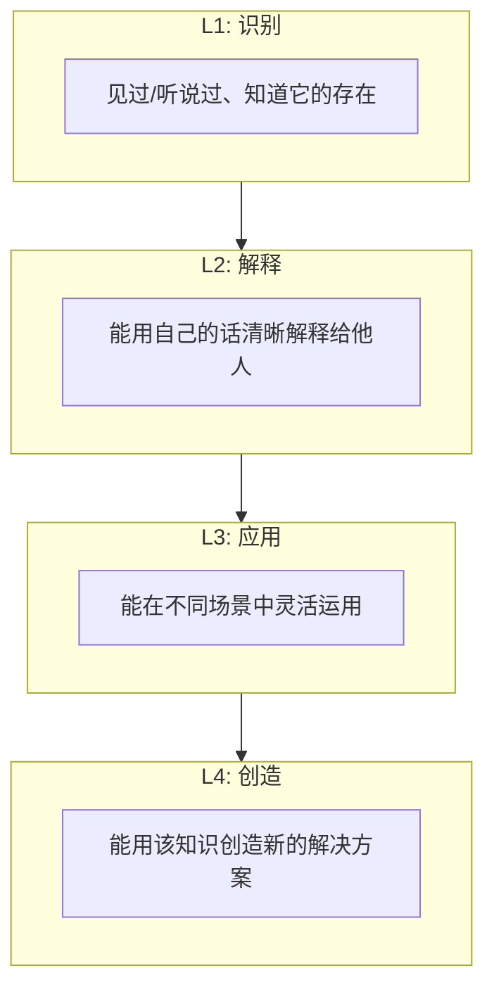

**自测**：对于你最近学的技术，你在哪个层次？

| 问题 | L1 | L2 | L3 | L4 |
|------|----|----|----|-----|
| 你能说出它的定义吗？ | ✅ | ✅ | ✅ | ✅ |
| 你能用通俗语言解释它吗？ | ❌ | ✅ | ✅ | ✅ |
| 你能举出3个不同的应用场景吗？ | ❌ | ❌ | ✅ | ✅ |
| 你能改进它或用它解决新问题吗？ | ❌ | ❌ | ❌ | ✅ |

### 3.3 六维技术学习模板（2026增强版）

原版6点模板已经非常出色。在此基础上，我增加了第7个维度——**AI时代的特殊考量**：

#### 完整的7维学习框架

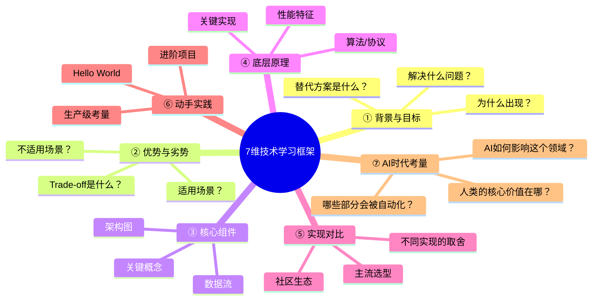

**详细说明**：

**① 背景与目标（Context & Goals）**

在深入学习任何技术之前，先回答：
- 这个技术是为了解决什么问题而诞生的？
- 在它出现之前，人们是如何解决这类问题的？
- 它的目标用户是谁？使用场景是什么？

> 示例：学习Kubernetes之前，先理解容器编排的痛点——手动管理大量容器的复杂性。

**② 优势与劣势（Pros & Cons）**

任何技术都有trade-off。理解这些trade-off是深度学习的标志：

| 技术优势 | 代价/劣势 |
|----------|----------|
| 高性能 | 复杂度高 |
| 易用性 | 灵活性受限 |
| 强一致性 | 可用性降低 |
| 简单部署 | 扩展性差 |

**关键思维**：没有完美的技术，只有最适合当前场景的技术。

**③ 核心组件（Core Components）**

画出技术的架构图，标识核心组件及其职责：

```
[以Redis为例]
┌─────────────────────────────┐
│         Redis Server         │
├───────────┬─────────────────┤
│  Network  │   Data Store     │
│  Layer    │                 │
│           │ ┌─────┬───────┐ │
│  TCP/Unix │ │String│ Hash │ │
│  Socket   │ │List │ Set  │ │
│           │ │ZSet │Stream│ │
│           │ └─────┴───────┘ │
│  Request  │   Persistence   │
│  Parser   │   (RDB/AOF)    │
└───────────┴─────────────────┘
```

**④ 底层原理（Underlying Principles）**

这是区分"使用者"和"理解者"的关键：
- 使用什么数据结构？（如Redis用Skip List实现有序集合）
- 用什么算法？（如LRU近似算法用于缓存淘汰）
- 有哪些关键的design decision？（如Redis单线程模型的选择）

**⑤ 实现对比（Implementation Comparison）**

同一个问题通常有多种解法。对比不同的实现：

| 方案 | 优点 | 缺点 | 适用场景 |
|------|------|------|---------|
| A | ... | ... | ... |
| B | ... | ... | ... |
| C | ... | ... | ... |

**⑥ 动手实践（Hands-on Practice）**

这是最重要的一环！理论必须结合实践：

- **Level 1**: 跟着tutorial跑通Hello World
- **Level 2**: 修改参数，观察行为变化
- **Level 3**: 用它构建一个小项目
- **Level 4**: 读源码，理解实现细节
- **Level 5**: 尝试改进或扩展功能

**⑦ AI时代考量（AI-Era Considerations）— 新增！**

在2026年，学习任何技术都要问：
- AI工具是否已经能够自动完成这项工作？
- 如果是，那我学习它的价值在哪里？
- 哪些部分是AI无法替代的（判断力、架构决策、edge case处理）？

> 示例：学习SQL时意识到——虽然AI可以生成SQL查询，但**理解查询执行计划、优化性能、设计合理的schema**仍然是人类的核心价值。

### 3.4 举一反三：如何培养思维的迁移能力

需要认识到："人与人最大的差别就是举一反三的能力。"这种能力可以拆解为三个子能力：

#### 能力一：联想能力（Association）

**训练方法**：每当学到一个新的概念，问自己：
- 这和我已知的哪个概念类似？
- 在其他领域中有没有类似的模式？
- 如果把这个概念应用到完全不同的场景，会怎样？

**示例**：
- 学到TCP的滑动窗口 → 联想到漏桶算法（rate limiting）
- 学到MVC模式 → 联想到前端组件的数据流
- 学到发布-订阅模式 → 联想到事件驱动架构

#### 能力二：抽象能力（Abstraction）

**训练方法**：面对具体问题时，尝试提取其通用模型：

```
具体问题 → 提取模式 → 抽象模型 → 应用于新领域

示例：
"如何在分布式系统中保证数据一致性？" 
→ 提取: 多个参与者需要对某个状态达成一致
→ 抽象: Consensus Problem
→ 应用: 区块链共识、数据库复制、Paxos/Raft
```

**练习建议**：
- 每周选择一个解决的问题，尝试抽象出通用模型
- 阅读设计模式书籍（GoF），理解每种模式的本质
- 学习数学（数学是最高的抽象语言）

#### 能力三：自省能力（Self-Reflection / 思辨）

**训练方法**：对自己的结论进行"左右互搏"：

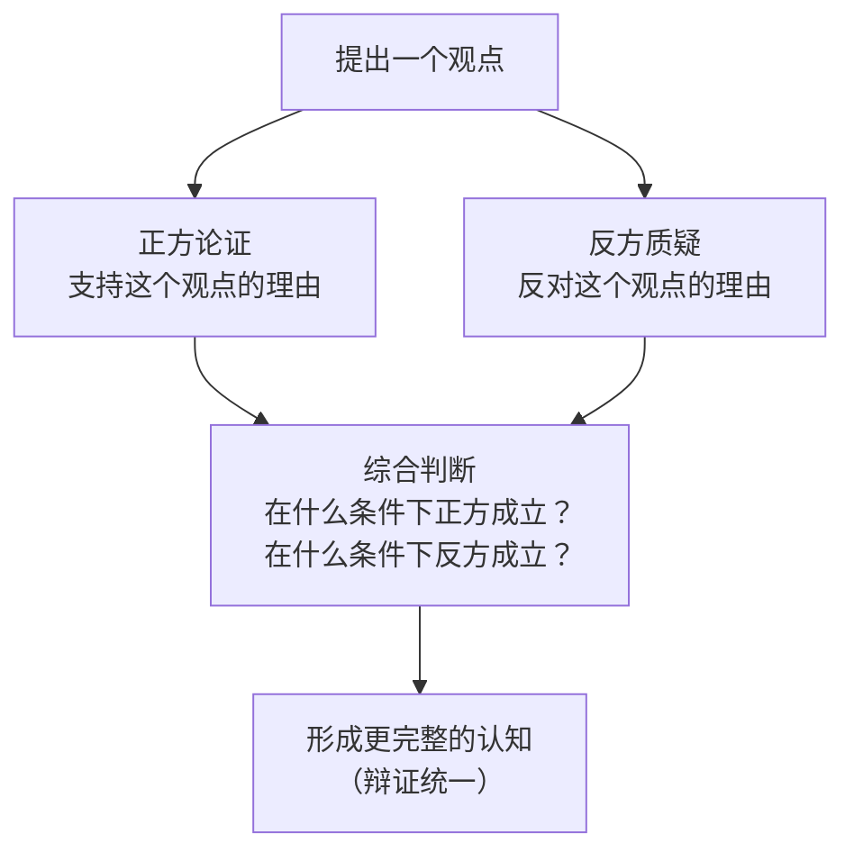

**实际案例**：

> **观点**："微服务架构优于单体架构"
>
> **正方**：独立部署、技术栈灵活、故障隔离、团队自治
>
> **反方**：分布式复杂性、运维成本高、调试困难、数据一致性挑战
>
> **综合**：微服务适合大型团队和复杂业务；单体适合小团队和简单业务。关键是根据实际情况选择，而不是盲目跟风。

### 3.5 总结与归纳：从信息到智慧的升华

值得注意的一点是："总结和归纳是提高学习能力的一个非常重要的手段。"

#### 归纳的层次

| 层次 | 说明 | 方法 |
|------|------|------|
| **L1: 信息收集** | 收集原始素材 | 笔记、截图、bookmark |
| **L2: 分类整理** | 按主题组织信息 | 文件夹结构、tag系统 |
| **L3: 模式识别** | 发现共性规律 | 对比分析、寻找pattern |
| **L4: 原理提炼** | 抽象出底层原则 | 写成"定律"或"原则" |
| **L5: 方法论形成** | 形成可复用的方法论 | 可以指导未来的行动 |

**示例：从多次Code Review中归纳出的原则**

```
原始反馈（L1）:
- "这个函数太长了，超过100行"
- "变量名看不懂是什么意思"
- "这里有重复的代码"
- "错误处理不够"

分类整理（L2）:
→ 可读性问题: 函数过长、命名不清
→ 可维护性问题: 代码重复
→ 健壮性问题: 错误处理不足

模式识别（L3）:
→ 所有这些问题都指向一个共同模式：缺乏对"读者"（未来的维护者）的考虑

原理提炼（L4）:
→ Principle: "Code is read more often than it's written."
→ Corollary: "Write code for humans, optimize for machines."

方法论形成（L5）:
→ 我的Code Review Checklist:
  1. 函数长度 < 50行?
  2. 变量名是否self-documenting?
  3. 是否有DRY违反?
  4. Error path是否清晰?
  5. 边界条件是否处理?
```

#### 输出倒逼输入：费曼技巧2.0（AI辅助版）

传统的费曼技巧是用简单的语言向他人解释概念。在2026年，我们可以用AI作为"永远有耐心的学生"：

**操作步骤**：

1. **选择一个你刚学到的概念**
2. **假装要教给一个完全不懂的人（或AI）**
3. **用最简单的语言解释**
4. **当你卡住或说不清楚时 → 回去重新学习那个点**
5. **简化语言和类比，直到连小学生都能听懂**

**AI辅助版本的具体Prompt**：

```
角色设定：
你是一个好奇心很强但完全不懂[技术领域]的小白。
我想向你解释[概念名称]，请你扮演我的学生。

规则：
1. 当我解释不清楚时，你要追问"为什么？"或"我不明白"
2. 当我用术语时，你要要求我用日常语言替换
3. 当你觉得我的解释有漏洞时，你要指出来
4. 最终目标是让你真正理解这个概念

请开始：我先解释...
[你的解释...]
```

**为什么这种方法有效？**
- 强迫你进行**主动回忆**（active recall），这是最高效的记忆方式
- 暴露你的**knowledge gap**（你以为懂了其实没懂的地方）
- 训练你的**表达能力**（能把复杂东西讲简单才是真懂）

### 3.6 项目驱动的学习法（Project-Based Learning）

需要特别强调："实践出真知。只有实践过，你才能对学到的东西有更深的体会。"

#### 如何选择合适的学习项目？

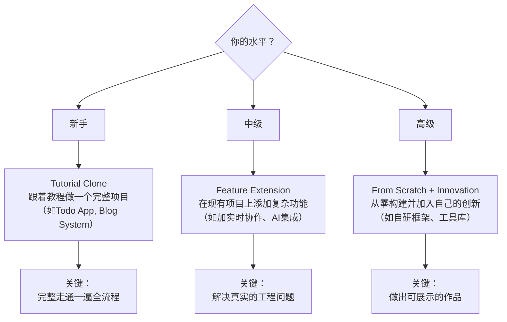

**项目选择的原则**：
1. **兴趣驱动**：选你真正想做的东西，而不是"应该"做的
2. **适度挑战**：比当前能力稍难20%，既不会太容易也不会太难
3. **可展示性**：完成后能放到GitHub/resume上
4. **完整性**：包含前端后端部署测试，是一个"真正的产品"

### 3.7 吃自己的狗粮（Eat Your Own Dog Food）

需要认识到："吃自己的狗粮，你才能够有最真实的体会。那些大公司里的开发人员，写完代码，自己不测试，自己也不运维，我实在不知道他们怎么可能明白什么是好的设计，好的软件？"

这句话在2026年更加深刻——因为很多开发者现在**连写代码都让AI代劳了**，离"真实体验"更远了。

**如何践行"吃自己的狗粮"？**

| 场景 | 做法 |
|------|------|
| **你自己写的库** | 在你的side project中使用它 |
| **你自己设计的API** | 自己作为consumer调用一下，体验是否好用 |
| **你自己写的文档** | 过一个月再看，看自己能否看懂 |
| **你自己搭建的系统** | 自己当user用几天，发现UX问题 |
| **你自己推荐的工具** | 先自己深入使用，再推荐给别人 |

**好处**：
- 发现设计和实现中的问题（因为你真的在使用）
- 产生改进的动力（因为痛点是你自己感受到的）
- 建立credibility（因为你真的用过，不是纸上谈兵）

### 3.8 建立正向反馈循环

需要认识到："坚持也不是要苦苦地坚持，有循环有成就感的坚持才是真正可以持续的。"

#### 设计你的学习反馈系统

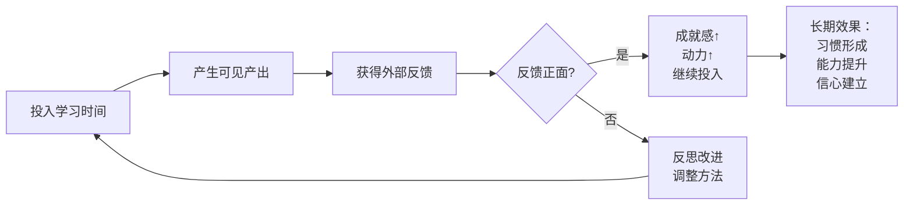

**具体的反馈来源**：

| 反馈类型 | 来源 | 频率 |
|----------|------|------|
| **自动化反馈** | Test passing、Lint clean、Benchmark提升 | 每次commit |
| **Peer feedback** | Code Review comments、PR discussion | 每次PR |
| **User feedback** | GitHub stars/issues、blog comments、用户反馈 | 持续 |
| **Community recognition** | 被引用、被邀请talk、获得award | 不定期 |
| **Career impact** | 面试通过、offer、升职、加薪 | 季度/年度 |

**加速反馈的方法**：
1. **公开学习**：把学习过程发到社交媒体（增加social pressure）
2. **参与社区**：在开源项目中contribute（获得real-world feedback）
3. **教别人**：做tech talk或写tutorial（教学是最好的学习）
4. **记录进度**：用habit tracker可视化进步（提供即时满足感）

---

## 四、如何学习和阅读代码

### 4.1 "Code Tells You How, Comments Tell You Why"

原版文章开头就引用了Jeff Atwood的名言，并进行了扩展：

| 维度 | 代码 (Code) | 文档/书 (Documentation) |
|------|-----------|------------------------|
| **What** | ✅ 告诉你做了什么 | ✅ 告诉你是什么 |
| **How** | ✅ 具体实现细节 | ✅ 概念性的方法 |
| **Why** | ❌ 很难直接看出 | ✅ 设计决策的原因 |
| **细节程度** | 极高（每一个if-else） | 较粗（省略实现细节） |
| **时效性** | 总是最新的 | 可能过时 |
| **可靠性** | 不会撒谎（但可能难懂） | 可能有过时或错误信息 |

**2026年的新维度**：

| 维度 | AI生成的代码 | 人类写的代码（优秀） |
|------|-------------|-------------------|
| **可读性** | 通常较好（风格统一） | 因人而异 |
| **Why的解释** | ❌ 完全没有 | ✅ 通过commit message、ADR体现 |
| **Edge case处理** | ⚠️ 取决于prompt质量 | ✅ 通常更全面 |
| **创造性** | ❌ 基于已有模式组合 | ✅ 可能有创新性设计 |
| **维护成本** | 如果不理解 = 灾难 | 如果写得好 = 易维护 |

**核心结论**：
> 在AI时代，**产生代码的成本趋近于零，但理解代码的成本没有降低——甚至更高了**（因为你需要理解AI生成的、可能包含隐含bug或suboptimal pattern的代码）。

### 4.2 读代码的能力层级

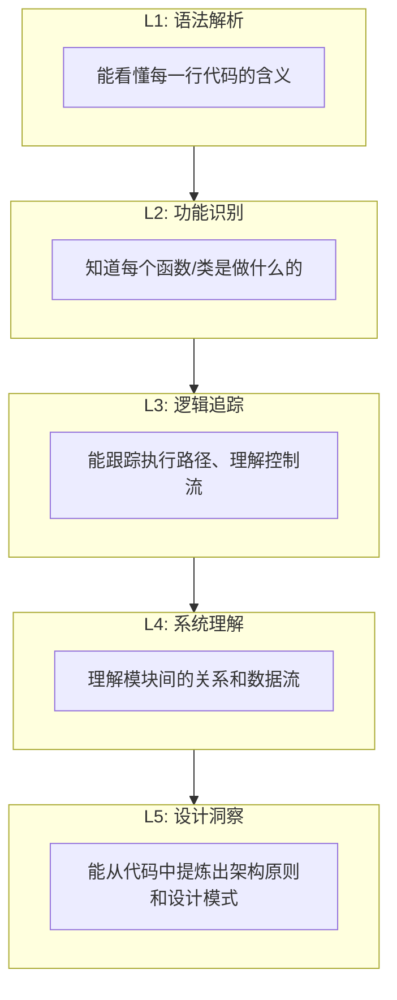

**自测**：你在哪个层次？

- L1-L2：能读懂代码，但不理解为什么这样写
- L3：能debug，能跟踪问题
- L4：能做code review，能提出改进建议
- L5：能从别人的代码中学到设计智慧，提升自己的水平

**目标**：每个人都应该至少达到L4，因为这是进行有效Code Review的前提。

### 4.3 读文档 vs 读代码：决策框架

下面给出一个清晰的决策框架。让我们在2026年扩展它：

#### 决策树：什么时候读什么？

```mermaid
flowchart TD
    A{你的目标？} --> B[了解思想/原理]
    A --> C[了解具体实现]

    B --> D["📖 读文档/书籍<br/>Effective C++ / DDIA / RFC<br/>效率高，获得Why"]

    C --> E{需要什么粒度？}
    E --> F[宏观架构<br/>模块关系、数据流]
    E --> G[微观实现<br/>具体算法、边界情况]

    F --> H["📖 读架构文档 + 画图<br/>README / ADR / Design Doc"]
    G --> I{"有源码吗？"}

    I -->|有| J["💻 读源码<br/>最准确、最详细<br/>但耗时最长"]
    I -->|没有| K["📖 + 🤖 读文档 + 问AI<br/>用AI辅助解释和推测"]

    J --> L{代码质量？}
    L -->|好且有注释| M["直接读，效率高"]
    L -->|差或无注释| N["先用AI生成解释<br/>再对照源码验证"]

```

**2026年新增场景**：

| 场景 | 推荐方法 | 原因 |
|------|---------|------|
| 学习新语言的惯用法 | 读该语言的标准库源码 | 最佳实践范例 |
| 理解框架的设计哲学 | 读官方文档 + 核心module源码 | 获得Why和How |
| Debug生产问题 | 读相关源码 + 加日志 | 最准确的定位方式 |
| Code Review同事的PR | 读diff + 运行代码 | 理解实际行为 |
| 学习系统设计 | 读开源系统的源码 + 架构文档 | 真实世界的scale经验 |
| 快速了解一个库的功能 | 让AI总结 + 读README | 效率优先 |

### 4.4 大型项目源码阅读方法论

文中分享了"剥洋葱皮"式的阅读方法。让我们将其系统化：

#### 阶段0：准备工作（Pre-Reading）

在打开IDE之前，先完成以下准备：

| 准备项 | 内容 | 工具 |
|--------|------|------|
| **了解项目背景** | 这个项目做什么？解决什么问题？ | README, Wikipedia, Blog posts |
| **明确阅读目的** | 我为什么要读这个代码？想学到什么？ | 写下1-3个具体问题 |
| **选择入口点** | 从哪里开始读？ | Main function / Public API / Example usage |
| **准备环境** | 能运行吗？能调试吗？ | Clone, build, run tests |
| **准备工具** | IDE配置好了吗？ | IDE with good navigation (VS Code, GoLand, etc.) |

**关键原则**：**不要试图从头读到尾！** 大型项目动辄百万行代码，没有人是这样读的。

#### 阶段1：宏观浏览（30分钟 - 1小时）

```
Step 1: 看目录结构
→ 了解项目的组织方式（按功能？按层？按module？）

Step 2: 读README和CONTRIBUTING
→ 了解构建方式、测试方法、架构概览

Step 3: 找entry point
→ 从main()或public API开始

Step 4: 画出高层架构图
→ 不需要细节，只需要知道主要组件和它们之间的关系
```

**输出产物**：一张手绘的系统架构草图（不需要漂亮，自己能看懂就行）

#### 阶段2：追踪主线（2-4小时）

选择一条关键的执行路径，深入追踪：

```mermaid
flowchart LR
    A[用户请求] --> B[Router/Handler]
    B --> C[Middleware链]
    C --> D[Business Logic]
    D --> E[Data Access Layer]
    E --> F[Database/Cache]
    F --> G[Response Serialization]
    G --> H[返回给用户]

```

**在每一步问自己**：
- 这里做了什么？（功能）
- 为什么这样做？（设计决策）
- 有哪些edge case？（健壮性）
- 性能如何？（效率）

#### 阶段3：聚焦模块（按需深入）

当你对整体有了了解后，选择你最感兴趣的模块深入研究：

| 分析维度 | 具体做法 |
|----------|---------|
| **接口定义** | 这个module暴露了什么API？契约是什么？ |
| **数据结构** | 用了什么数据结构？为什么选这个？ |
| **算法** | 核心算法是什么？时间/空间复杂度？ |
| **错误处理** | 怎么处理异常？有哪些error code？ |
| **并发模型** | 是线程安全吗？用了什么同步机制？ |
| **可扩展性** | 如何扩展？插件机制？配置驱动？ |

### 4.5 代码阅读的"降噪"技巧

文中提到："根据二八原则，20%的代码是正常的逻辑，80%的代码是在处理各种错误的。"这告诉我们：**学会忽略噪音，聚焦信号**。

#### 常见的"噪音"类型及处理方式

| 噪音类型 | 示例 | 处理方式 |
|----------|------|---------|
| **Boilerplate code** | Getter/setter、序列化代码 | 知道存在即可，不需要逐行读 |
| **Error handling** | 大量的if err != nil | 第一次读时跳过，debug时再看 |
| **Logging/Metrics** | 日志记录、指标上报 | 了解"在哪里log了什么"即可 |
| **Compatibility shim** | 向后兼容的wrapper | 除非研究兼容性问题，否则跳过 |
| **Generated code** | protobuf生成的代码 | 不要读！看.proto文件即可 |
| **Test code**（首次阅读时） | 单元测试、集成测试 | 先读production code，test作为参考 |

**IDE技巧**：
- 使用**折叠功能**（fold）隐藏不关心的代码块
- 使用**搜索功能**（find in files）快速定位关键字
- 使用**调用图**（call hierarchy）理解函数间关系
- 使用**Git blame**查看某行代码的历史和原因

### 4.6 AI辅助代码阅读（2026新能力）

在2026年，AI工具极大地增强了代码阅读能力：

#### 场景一：快速理解陌生代码库

```
Prompt模板：
"我正在阅读[项目名]的源码，这是一个[简短描述]。
请帮我：
1. 用一段话概括这个项目的核心功能和架构
2. 列出主要的module及其职责
3. 推荐我应该首先阅读哪3个文件
4. 指出这个项目中值得学习的设计模式和最佳实践"
```

#### 场景二：解释复杂的代码片段

```
Paste code here...

"请帮我分析这段代码：
1. 它的功能是什么？
2. 它使用了什么算法或设计模式？
3. 有哪些潜在的bug或性能问题？
4. 如果要改进，你会建议什么？"
```

#### 场景三：追踪数据流

```
"在这个系统中，当用户发起[操作X]时，
请帮我追踪数据的完整流向：
1. 从API entry point开始
2. 经过哪些service/component
3. 最终写入哪个database/cache
4. 中间经过了哪些transform"

请用Mermaid图表的形式展示这个流程。"
```

**⚠️ 重要提醒**：

> **永远不要完全信任AI对代码的解释！**
>
> AI可能会：
> - hallucinate不存在的函数或逻辑
> - 忽略重要的edge case
> - 给出过时的信息（如果训练数据不够新）
>
> **正确做法**：把AI的解释作为"假设"，然后自己去源码中验证。

### 4.7 不同阶段的代码阅读策略

#### 新手阶段（0-2年）：以"模仿"为主

| 目标 | 方法 | 资源推荐 |
|------|------|---------|
| 学会写干净的代码 | 读优秀的开源项目 | GitHub上的trending repos |
| 理解常见模式 | 读经典书籍中的示例代码 | *Refactoring*, *Clean Code* |
| 学习语言惯用法 | 读标准库源码 | Go stdlib, Python stdlib, Java JDK source |

**推荐的首读项目**（按难度排序）：
1. **TodoMVC**（各种框架的同一个app实现）— 对比不同风格的代码
2. **RealWorld example apps** — 生产级别的示例代码
3. **小型CLI工具**（如ripgrep, fd, bat）— Rust/Go写的，代码质量极高

#### 成长期（2-5年）：以"分析"为主

| 目标 | 方法 | 资源推荐 |
|------|------|---------|
| 理解大规模系统设计 | 读知名开源系统的源码 | Kubernetes, etcd, Redis, PostgreSQL |
| 学习架构决策 | 读ADR（Architecture Decision Records） | 各大公司的GitHub org |
| 提升Code Review能力 | 读开源社区的PR discussion | Kubernetes PRs, React PRs |

**推荐的进阶阅读项目**：
1. **Redis**（C语言）— 数据结构大师级实现
2. **LevelDB / RocksDB**（C++）— LSM Tree的经典实现
3. **11-Nginx基础概述**（C）— 事件驱动架构的典范
4. **SQLite**（C）— 数据库实现的完整教程
5. **Linux Kernel**（C）— 操作系统 internals 的终极资源

#### 专家期（5年+）：以"批判"为主

| 目标 | 方法 |
|------|------|
| 发现设计缺陷 | 读代码时主动找问题 |
| 提出改进方案 | 不仅看到"是什么"，思考"应该是什么" |
| 提取可复用的模式 | 将学到的设计应用到自己的项目中 |
| 贡献回社区 | 提交PR修复bug或改进文档 |

### 4.8 Code Review：最高级的代码阅读

虽然没有专门讲Code Review，但它实际上是**最高级的代码阅读形式**——你不仅要读懂，还要给出有价值的反馈。

#### Code Review的CHECKLIST

**✅ 功能正确性**
- [ ] 代码是否实现了预期的功能？
- [ ] 是否考虑了所有edge case？
- [ ] 错误处理是否完善？

**✅ 代码质量**
- [ ] 命名是否清晰表达意图？
- [ ] 函数/类是否遵循单一职责？
- [ ] 是否有重复代码可以抽取？

**✅ 性能**
- [ ] 是否有不必要的循环或拷贝？
- [ ] 数据库查询是否高效？（N+1问题等）
- [ ] 内存使用是否合理？

**✅ 安全性**
- [ ] 是否有注入风险？（SQL injection, XSS等）
- [ ] 敏感数据是否妥善处理？
- [ ] 权限检查是否存在？

**✅ 可维护性**
- [ ] 测试覆盖是否充分？
- [ ] 注释是否必要且准确？
- [ ] 是否符合团队的coding convention？

**✅ AI生成代码的特殊检查**
- [ ] 这段代码看起来像是AI生成的吗？（风格突变）
- [ ] 是否验证了AI输出的正确性？
- [ ] 是否有AI常见的"幻觉"或suboptimal pattern？

#### 给出建设性Feedback的艺术

❌ **差的review comment**：
> "这段代码不好。"

✅ **好的review comment**：
> "我注意到这里使用了O(n²)的嵌套循环。考虑到数据量可能在10万级别，这可能会导致性能问题。建议使用hash map来优化查找过程，将复杂度降到O(n)。如果你有其他考量，请告诉我。"

**结构**：观察 → 影响 → 建议 → 开放式提问

---

## 五、面对枯燥和量大的知识

### 5.1 认知负荷理论（Cognitive Load Theory）

原版文章开头就指出："一般来说，枯燥的东西通常是你不感兴趣的东西，而你不感兴趣的东西，可能是你并不知道有什么用的东西。"

从认知心理学的角度，这可以用**Cognitive Load Theory**来解释：

```mermaid
flowchart TD
    A[工作记忆容量<br/>有限：7±2个chunk] --> B{信息输入量}

    B --> C[内在认知负荷<br/>Intrinsic Load<br/>内容本身的复杂度]
    B --> D[外在认知负荷<br/>Extraneous Load<br/>呈现方式的复杂度]
    B --> E[相关认知负荷<br/>Germane Load<br/>用于理解和学习的部分]

    C --> F{总负荷 > 容量？}
    D --> F
    E --> F

    F -->|是| G["❌ 认知过载<br/>→ 学习失败<br/>→ 感到frustrated<br/>→ 放弃"]
    F -->|否| H["✅ 有效学习<br/>→ 理解并内化<br/>→ 产生成就感<br/>→ 继续前进"]

```

**三种认知负荷**：

| 负载类型 | 定义 | 可控性 | 降低方法 |
|----------|------|--------|---------|
| **Intrinsic（内在）** | 内容本身的难度 | 部分可控 | 分解为小块、先学prerequisite |
| **Extraneous（外在）** | 呈现方式造成的额外负担 | 高度可控 | 更好的教材、可视化、清晰的组织 |
| **Germane（相关）** | 用于构建schema的认知努力 | 应该最大化 | 主动思考、联系已知知识、举例 |

**关键洞察**：
> 枯燥感往往不是因为"内容无聊"，而是因为**认知负荷过高或过低**——要么太难理解（overload），要么太简单无挑战（boredom）。

### 5.2 "量大的知识"焦虑的根源

需要认识到："我们整个世界进入了前所未有的信息爆炸时代，人们担忧的不再是无知识可学，而是有学不完的知识。"

2026的情况更加极端：

```mermaid
graph TB
    subgraph 信息爆炸
        A1[新框架/工具<br/>每周都有新的]
        A2[技术社区/教程<br/>每天数千篇]
        A3[开源项目<br/>GitHub每秒新增]
        A4[AI生成的内容<br/>无限量]
        A5[课程/视频/播客<br/>24/7不断产出]
    end

    subgraph 个人限制
        B1[时间: 每天24h]
        B2[精力: 专注力有限]
        B3[注意力: 易被分散]
        B4[记忆: 会遗忘]
        B5[理解力: 需要时间消化]
    end

    A1 & A2 & A3 & A4 & A5 -->|"远远超过"| B1 & B2 & B3 & B4 & B5

```

**结果**：FOMO（Fear of Missing Out）+ 决策瘫痪 + 浅层消费 → **什么都学了点，什么都不精**

### 5.3 对抗枯燥：让抽象变具体

用一个真实的例子说明了这个问题："当初上大学学习《计算机网络》时，直接学习那个七层协议...让我感觉枯燥得不行。直到有一天...我看到了网卡、网线和Hub...我才真正明白网络原来有这么好玩。"

#### 为什么会感到枯燥？

| 原因 | 心理机制 | 解决方向 |
|------|---------|---------|
| **缺乏具体场景** | 抽象概念无法在大脑中形成image | 找到real-world application |
| **不知道有什么用** | 无法建立"为什么重要"的连接 | 明确value proposition |
| **难度不匹配** | 太难（frustration）或太简单（boredom） | 调整到"最近发展区" |
| **缺乏反馈** | 不知道自己是否理解了 | 增加即时反馈机制 |
| **被动接收** | 只是看/听，没有主动参与 | 动手实践、输出 |

#### 让枯燥知识变得有趣的策略

**策略一：找到"为什么"（Find the Why）**

在学习任何新概念之前，先问：
- 这个东西解决了什么问题？
- 在没有它之前，人们是怎么做的？
- 谁在使用它？用它做出了什么酷的东西？

> 示例：学习操作系统之前，先了解几个著名的OS bug导致的灾难（如Therac-25医疗事故），你会突然对process scheduling产生浓厚的兴趣。

**策略二：从应用倒推原理（Application-First Learning）**

```mermaid
flowchart LR
    A[先用起来<br/>感性认识] --> B[遇到问题<br/>产生好奇]
    B --> C[去查资料<br/>寻找答案]
    C --> D[理解原理<br/>理性认识]
    D --> E[回到应用<br/>验证理解]

```

**示例路径**：
1. 先用Docker跑一个container → 感觉很神奇
2. 遇到网络问题 → 想知道容器之间怎么通信
3. 去查Docker networking文档 → 了解bridge/network模式
4. 读Linux network namespace源码 → 理解底层实现
5. 自己实现一个简单的container runtime → 彻底掌握

**策略三：增加感官维度（Multi-sensory Learning）**

人类的大脑更喜欢多感官的信息：

| 维度 | 做法 | 工具 |
|------|------|------|
| **视觉** | 画图、画架构图、用不同颜色标记 | Excalidraw, Mermaid, 白纸笔 |
| **听觉** | 听podcast、看video tutorial | YouTube, 播客App |
| **动觉** | 写代码、动手实验、做project | IDE, Terminal |
| **语言** | 把概念讲出来、写下来 | Blog, AI对话 |

**策略四：游戏化（Gamification）**

将学习变成游戏：

| 游戏化元素 | 具体做法 |
|------------|---------|
| **进度条** | 用habit tracker可视化学习进度 |
| **积分系统** | 每完成一个知识点给自己加分 |
| **成就徽章** | 设定里程碑（如"读完DDIA"、"解决100道LeetCode"） |
| **排行榜** | 和朋友一起学习，互相比较进度 |
| **Boss战** | 把最难的概念设计成"最终boss"，打败它！ |

### 5.4 对抗量大：少即是多的艺术

需要认识到："一点一点学，一口一口吃。你可以使用我前面说过的那些方法，注重基础，画知识图，多问为什么，多动手，然后坚持住。"

#### 信息节食（Information Diet）

就像我们需要控制饮食一样，我们也需要控制信息的摄入：

```mermaid
pie title 你的信息摄入结构应该是
    "深度学习 (30%)" : 30
    "广度浏览 (20%)" : 20
    "实践输出 (30%)" : 30
    "休息放空 (20%)" : 20
```

**信息节食的原则**：

| 原则 | 说明 | 做法 |
|------|------|------|
| **质量 > 数量** | 读一篇深度文章 > 刷10篇浅薄文章 | 关注信息源的质量而非数量 |
| **深度 > 广度** | 彻底搞懂一个领域 > 浅尝辄止十个领域 | 选择1-2个方向深耕 |
| **创造 > 消费** | 输出 > 输入 | 每学习1小时，至少输出15分钟 |
| **主动 > 被动** | 有目的地搜索 | 无目的刷feed |
| **慢 > 快** | 深度阅读 | 快速skim |

#### 二八法则应用于学习

在任何领域，**20%的核心知识覆盖了80%的应用场景**。

**做法**：
1. 先识别出该领域的**核心20%**是什么
2. 集中精力彻底掌握这20%
3. 剩余80%作为参考，需要时再查

**示例：学习Kubernetes**
- 核心20%：Pod, Service, Deployment, ConfigMap, Ingress — 掌握这些就能应付80%的场景
- 剩余80%：RBAC, NetworkPolicy, Operator, CRD — 需要时再深入

#### 建立"Just-in-Time"学习体系

不要试图提前学会所有东西。采用**JIT学习法**：

```mermaid
stateDiagram-v2
    [*] --> 遇到问题: 在工作中遇到不懂的
    遇到问题 --> 快速定位: 快速判断这是什么领域
    快速定位 --> JIT学习: 只学当前需要的部分
    JIT学习 --> 解决问题: 应用所学解决问题
    解决问题 --> 记录笔记: 记录关键点和经验
    记录笔记 --> [*]: 回归工作

    note right of JIT学习
        时间限制：30min-2h
        目标：够用即可
        深入留到周末
    end note
```

**优势**：
- 学习动机最强（因为有实际问题要解决）
- 效率最高（只学需要的）
- 记忆最牢（立即应用）

### 5.5 认真阅读文档：被低估的超能力

有一个重要的观点："我发现很多技术问题都是出在技术人员不认真读技术手册上。我自己也一样。"

#### 为什么大家都不爱读文档？

| 原因 | 心理 | 现实 |
|------|------|------|
| **太长了** | 文档通常很长 | 其实只需要读相关章节 |
| **太枯燥** | 技术文档语言正式 | 但这是最准确的信息来源 |
| **习惯Google** | 遇到问题先搜索 | 搜索结果往往来自文档，但可能过时或有误 |
| **觉得浪费时间** | 想"直接问人更快" | 但别人的回答也可能不准确 |
| **英文障碍** | 很多官方文档是英文 | 2026年了，这不应该再是借口 |

#### 读文档的最佳实践

**① 先读什么？**

| 优先级 | 文档类型 | 示例 |
|--------|---------|------|
| ⭐⭐⭐⭐⭐ | Official Documentation | Go Docs, Python Docs, MDN |
| ⭐⭐⭐⭐ | RFC / Standard Specs | HTTP RFC, OAuth 2.0 spec |
| ⭐⭐⭐ | API Reference | OpenAPI spec, Javadoc |
| ⭐⭐ | Tutorials / Getting Started | 官方tutorial |
| ⭐ | Blog posts / Articles | 第三方解读（需验证） |

**② 怎么读才高效？**

```
Step 1: 快速扫描（5分钟）
→ 读Table of Contents
→ 读Introduction/Overview
→ 了解文档的整体结构

Step 2: 定位相关章节（10分钟）
→ 根据你的问题，找到对应的section
→ 不要从头读到尾！

Step 3: 深度阅读（30-60分钟）
→ 仔细读相关章节
→ 运行其中的example
→ 做笔记

Step 4: 验证理解（15分钟）
→ 用你自己的话复述
→ 写代码测试
→ 如果有疑问，回到原文确认
```

**③ 文档阅读的ROI分析**

| 活动 | 时间投入 | 收获 | ROI |
|------|---------|------|-----|
| 读官方文档 | 1-2小时 | 最准确、最全面的信息 | ⭐⭐⭐⭐⭐ |
| Google + Stack Overflow | 30分钟 | 可能解决问题，但可能有误导 | ⭐⭐⭐ |
| 问同事/Slack | 15分钟 | 快速答案，但依赖他人时间 | ⭐⭐⭐ |
| 问AI（ChatGPT） | 5分钟 | 快速但有hallucination风险 | ⭐⭐⭐⭐ |
| 盲目试错 | 2-4小时 | 可能解决，但浪费大量时间 | ⭐ |

**结论**：读文档的短期成本较高，但长期ROI最高。

### 5.6 实用学习技巧集锦（2026增强版）

原版文章最后给出了8个实用技巧。让我们在2026年的语境下重新审视它们：

| # | 原技巧 | 2026增强版 | AI时代的特殊考量 |
|---|--------|-----------|------------------|
| 1 | **用不同的方式学习同一个东西** | ✅ 依然有效 | 加入一种方式：让AI用不同风格解释同一概念 |
| 2 | **不要被打断** | ⚠️ 更加重要 | 关闭所有通知，使用Focus Mode；AI工具也可能成为分心源 |
| 3 | **总结压缩信息** | ✅ 更加重要 | 用AI帮助总结，但要确保自己能还原细节 |
| 4 | **把未知关联到已知** | ✅ 最有效的方法之一 | 让AI帮你找类比："请用[熟悉的概念]来解释[新概念]" |
| 5 | **用教的方式来学习** | ✅ 费曼技巧 | AI是最好的"学生"——永远有耐心、永远可以追问 |
| 6 | **学以致用** | ✅ 最重要的一点 | AI降低了"做"的门槛，但没有降低"理解"的门槛 |
| 7 | **不要记忆** | ✅ 核心原则 | 这在AI时代更加正确——让AI帮你记，你负责理解 |
| 8 | **多犯错误** | ✅ 成长的必经之路 | AI可以帮助你预防低级错误，但不能替代从错误中学习的过程 |

### 5.7 对抗拖延：微习惯策略

需要认识到："坚持是一件反人性的事。"与其靠意志力硬撑，不如用**微习惯**（Micro Habits）降低启动门槛。

#### 微习惯设计原则

| 原则 | 说明 | 示例 |
|------|------|------|
| **小到荒谬** | 小到不可能失败 | 不是"每天学1小时"，而是"每天打开书1分钟" |
| **无需意志力** | 不需要"决定"去做 | 把它绑定到现有习惯上（trigger） |
| **立即奖励** | 完成后立刻有正向反馈 | 打勾、喝杯咖啡、发个朋友圈 |
| **渐进增长** | 从小开始，逐步增加 | 第一周5分钟，第二周10分钟... |

**示例：建立"晨间学习"微习惯**

```
Trigger: 每天早上煮咖啡的时候
Action: 打开技术文章/书籍，读5分钟
Reward: 咖啡好了，带着新知识开始一天的工作

进阶：第二周增加到10分钟...
```

### 5.8 时间管理：深度工作 vs 浅层工作

Cal Newport的**Deep Work**概念在2026年更加珍贵——因为在分心经济中，**专注力是最稀缺的资源**。

#### 一日学习时间分配建议

```mermaid
gantt
    title 理想的一天（学习者版）
    dateFormat HH:mm
    axisFormat %H:%M

    section 深度工作块
    专注学习(困难内容)   :0830, 90m
    午休后深度工作       :1400, 90m
    晚间项目实践         :2000, 120m

    section 浅层工作块
    邮件/消息/行政      :1000, 60m
    会议/沟通           :1530, 90m

    section 休息恢复
    早晨routine         :0700, 60m
    午休                :1200, 60m
    运动               :1730, 45m
    放松               :2200, 60m
```

**关键原则**：
- **最好的时间给最难的内容**（通常是早晨）
- **批量处理浅层任务**（邮件、消息集中在某个时间段）
- **保护深度工作时间**（关闭通知、告诉同事"我在focus mode"）

### 5.9 对抗遗忘：间隔重复（Spaced Repetition）

值得注意的是"不要记忆"的原则，但这并不意味着完全不记忆——而是要用**科学的方法**记忆。

**艾宾浩斯遗忘曲线**告诉我们：如果不复习，遗忘的速度非常快。

**解决方案：Anki / 间隔重复系统**

| 方法 | 说明 | 工具 |
|------|------|------|
| **Flashcard** | 问题-答案卡片 | Anki (免费), Quizlet |
| **Active Recall** | 合上书，尝试回忆 | 自测 |
| **Interleaving** | 混合练习不同类型的问题 | 设计自己的练习set |
| **Elaboration** | 为新知识创建更多连接 | 写blog、画图、教别人 |

**我的建议**：
- 对于**事实性知识**（API参数、配置项）：用Anki
- 对于**概念性知识**（原理、模式）：用费曼技巧
- 对于**技能性知识**（写code、debug）：用刻意练习

### 5.10 建立支持系统：你不是一个人在战斗

需要认识到："一个人长跑很辛苦，有人同行就会好很多。"

**学习伙伴的类型**：

| 类型 | 作用 | 如何找到 |
|------|------|---------|
| **Accountability Partner** | 互相监督打卡 | 朋友圈喊话、学习群 |
| **Study Group** | 一起讨论问题 | 本地meetup、在线community |
| **Mentor** | 指导方向 | 公司senior、开源社区、付费coaching |
| **Community** | 提供氛围和资源 | Discord/Slack/Discord server |

**线上学习社区推荐**：
- **Dev.to**: 开发者社区，可以发布学习进展
- **Indie Hackers**: 独立开发者社区
- **GitHub Discussions**: 围绕具体项目的讨论
- **各种Discord Server**: 几乎每个技术栈都有active的Discord community

---

## 总结

### 核心要点回顾

**端正学习态度**：
1. **学习是逆人性的**：需要刻意对抗即时满足、认知懒惰等本能
2. **从知识积累转向能力构建**：目标是变得更强大，而不只是知道更多
3. **深度 > 广度**：在快餐文化时代，深度学习是稀缺能力
4. **AI是Copilot不是Autopilot**：保持独立思考和能力
5. **Zettelkasten知识管理**：建立属于你的"第二大脑"
6. **可持续 > 强度**：每天30分钟 > 周末突击10小时
7. **成长型思维**：相信能力可以通过努力发展

**源头、原理和知识地图**：
1. **信息质量 > 信息数量**：投入精力寻找和验证第一手资料
2. **基础知识是护城河**：投资于变化慢的原理性知识
3. **知识地图 > 知识堆砌**：建立结构化的、相互关联的知识网络
4. **第一性原理思维**：追问"为什么"，而不是盲从"怎么做"
5. **刻意练习**：有目标、有反馈、走出舒适区的持续训练
6. **动态维护**：知识体系是活的，需要定期审计和更新

**深度、归纳和坚持实践**：
1. **深度 > 广度**：投资于变化慢的底层原理，获得长期复利
2. **7维学习模板**：背景→优劣→组件→原理→对比→实践→AI考量
3. **举一反三的能力**：联想 + 抽象 + 自省，三者缺一不可
4. **归纳的五个层次**：从信息收集到方法论形成
5. **费曼技巧2.0**：用AI作为"学生"，强迫自己真正理解
6. **项目驱动学习**：在做中学，在真实问题中成长
7. **正向反馈循环**：让学习变得可持续，而不是靠意志力死撑

**如何学习和阅读代码**：
1. **读代码 > 写代码**（在某些阶段）：理解力是创造力的基础
2. **决策框架**：根据目标选择读文档还是读代码
3. **三阶段阅读法**：宏观浏览 → 主线追踪 → 模块深入
4. **降噪技巧**：忽略80%的boilerplate，聚焦20%的核心逻辑
5. **AI辅助阅读**：作为accelerator而非replacement，必须验证
6. **Code Review是最高级的阅读**：不仅读懂，还能给出value-added feedback
7. **输出倒逼输入**：通过写作和贡献深化理解

**面对枯燥和量大的知识**：
1. **枯燥的本质**：往往是认知负荷不当或缺乏具体场景
2. **让抽象变具体**：从应用倒推原理，增加感官维度，游戏化
3. **量大的应对**：信息节食、二八法则、JIT学习
4. **读文档是超能力**：ROI最高、最准确、被严重低估
5. **微习惯降低门槛**：从小开始，绑定trigger，渐进增长
6. **深度工作 > 时长**：保护专注时间，批量处理浅层任务
7. **间隔重复对抗遗忘**：科学的记忆方法
8. **社群力量**：找到学习伙伴，不再孤独前行

### 核心智慧总结

**功夫在平时**

需要认识到："工夫都是花在平时的。而训练这方面能力的最好方式就是在工作中写文档，在工作之余写blog。只有写得多了，写得好了，你这样的能力才能训练出来。"

这段话在2026年有了新的含义：
- **写作不仅是表达能力训练，更是思维训练**
- **Blog不仅是展示平台，更是知识沉淀的外化**
- **文档不仅是工作产出，更是思考过程的结晶**

**渔而非鱼**

需要认识到："你想通过这些简单链接的方式，为我的读者打开一个全新的世界，他们可以在这个世界中自己找食吃，而不需要依赖我，这才是我想给大家带来的东西。"

这句话道出了高效学习的终极目标：

> **不是给你鱼（现成的知识），而是教你钓鱼（获取和消化知识的能力）。**

在2026年，这个能力比以往任何时候都更加重要——因为信息无限，而注意力有限；因为技术瞬息万变，而原理永恒不变。

**Grow up through the pain**

需要认识到："Grow up through the pain，是非常有道理的。"痛苦是成长的信号，舒适区是能力的坟墓。

在2026年，这句话有了新的含义：
- **AI消除了很多"痛苦"**（不需要手动写boilerplate了）
- **但也可能消除了很多"成长"**（如果不主动寻求challenge的话）
- **真正的学习者会主动寻找pain point**：选择困难的项目、读hardcore的论文、解决棘手的bug

**学习是一辈子的投资**

需要认识到："把学习当成投资，这是这个世界上回报最好的投资。"

在2026年，这句话的含义更加丰富：
- **投资标的变了**：不是"知识的数量"，而是"思维的深度"
- **回报形式变了**：不只是薪资提升，更是**选择权的扩大**——你有更多的职业选项、更强的适应能力、更高的不可替代性
- **风险也变了**：最大的风险不是"学错了方向"，而是**停止学习**——在技术半衰期只有2-3年的时代，停止学习=快速贬值

**最后的行动号召**

如果你现在的状态是：
- 买了很多书但没读完
- 收藏了很多文章但从没打开
- 想学很多东西但不知道从哪开始
- 感觉被技术浪潮推着走，很焦虑

那么，从今天开始，做一件事：

**选定一个你最感兴趣的技术方向，每天花30分钟，坚持一个月。**

不用多，就30天。看看一个月后的你和今天的你有什么不同。

> 不要追求学习的数量，而要追求学习的质量。
>
> 不要追求"学完了"的感觉，而要追求"我能用它解决问题"的能力。
>
> 不要一个人孤独地学，而要在实践中、在社区中、在教导中去验证和深化你的理解。

**Start before you're ready.**

---

## 延伸资源

### 必读书籍（学习方法论类）

| 书名 | 作者 | 核心思想 | 适用场景 |
|------|------|---------|---------|
| *How to Take Smart Notes* | Sönke Ahrens | Zettelkasten方法详解 | 知识管理入门 |
| *Ultralearning* | Scott Young | 极端学习策略 | 快速掌握新技能 |
| *Make It Stick* | Brown et al. | 认知科学视角的学习方法 | 科学学习 |
| *Atomic Habits* | James Clear | 习惯养成机制 | 建立学习routine |
| *Deep Work* | Cal Newport | 深度工作的价值 | 提升专注力 |
| *A Mind for Numbers* | Barbara Oakley | 如何学习数学和科学 | 克服学习恐惧 |
| *Peak* | Anders Ericsson | 刻意练习研究 | 专家成长路径 |
| *The Art of Learning* | Josh Waitzkin | 国际象棋+太极双料大师的学习之道 | 全方位学习 |

### 必读的经典书籍（按领域分类）

**📚 计算机科学基础**
1. *Computer Systems: A Programmer's Perspective* (CSAPP) — 系统基础圣经
2. *Introduction to Algorithms* (CLRS) — 算法权威教材
3. *The C Programming Language* (K&R) — C语言经典
4. *Structure and Interpretation of Computer Programs* (SICP) — 编程范式启蒙

**📖 分布式系统**
5. *Designing Data-Intensive Applications* (DDIA) — 必读！
6. *Distributed Systems: Principles and Paradigms* (Tanenbaum)
7. *Streaming Systems* (Akidau, Chernyak & Lax) — 流处理系统原理

**🔧 工程实践**
8. *Clean Code* (Robert Martin) — 代码整洁之道
9. *The Pragmatic Programmer* (Hunt & Thomas) — 程序员修炼之道
10. *Site Reliability Engineering* (Google) — SRE手册
11. *Building Secure & Reliable Systems* (Google)

**🧠 思维与方法论**
12. *How to Solve It* (Polya) — 问题解决方法论
13. *How to Think Like a Mathematician* (Kevin Houston) — 数学思维
14. *The Art of Doing Science and Engineering* (Richard Hamming) — Hamming的智慧

**📖 代码阅读相关**
15. *Code Reading* (Diomidis Spinellis) — 系统化的代码阅读方法论
16. *The Art of Readable Code* (Dustin Boswell) — 如何写出易读的代码
17. *Refactoring* (Martin Fowler) — 通过重构理解代码坏味道

### 工具与平台

| 类别 | 推荐 | 用途 |
|------|------|------|
| **笔记工具** | Obsidian / Notion | Zettelkasten / 知识库 |
| **任务管理** | Todoist / Linear | 学习计划跟踪 |
| **习惯追踪** | Habitica / Streaks | 可视化学习进度 |
| **专注工具** | Forest / Freedom | 防止分心 |
| **阅读管理** | Readwise / Pocket | 文章收藏与回顾 |
| **AI辅助** | ChatGPT / Claude | 学习伙伴（非替代品） |
| **间隔重复** | Anki / Quizlet | 科学记忆 |

### 实践平台

| 平台 | 类型 | 特色 | 价格 |
|------|------|------|------|
| **GitHub** | 代码托管 + 社区 | 真实世界的project | 免费 |
| **Exercism** | 编程练习 | 有mentor review | 免费 |
| **Codewars** | 算法 kata | 游戏化体验 | 免费 |
| **LeetCode** | 算法面试题 | 行业标准 | Free/$35/月 |
| **Frontend Mentor** | 前端项目 | 真实UI challenge | 免费-$12/月 |
| **Dev.to/Hashnode** | 技术社区 | 社区反馈 | 免费 |

### 高质量在线资源（2026精选）

| 类型 | 资源名称 | URL/说明 | 特色 |
|------|---------|----------|------|
| **学术论文** | arXiv.org | cs.DC, cs.PL分类 | 最新研究成果 |
| **官方文档** | 各语言/框架官网 | Go Docs, Python Docs, MDN | 最准确、最及时 |
| **技术社区** | Martin Fowler's Blog | martinfowler.com | 软件架构深度思考 |
| **开源项目** | GitHub Trending | github.com/trending | 发现热门项目 |
| **问答社区** | Stack Overflow | stackoverflow.com | 高质量问题（过滤低质量） |
| **新闻聚合** | Hacker News | news.ycombinator.com | 技术前沿讨论 |
| **深度讨论** | Lobsters | lobste.rs | 高质量技术社区 |
| **视频频道** | Ben Eater (YouTube) | 计算机基础可视化 | 从零造CPU |
| **视频频道** | 3Blue1Brown (YouTube) | 数学直觉可视化 | 美丽数学讲解 |
| **播客** | The Changelog | changelog.com | 开源与技术访谈 |
| **播客** | Software Engineering Daily | sedaily.com | 工程实践daily |

### 学习社区

| 社区 | 特点 | 加入方式 |
|------|------|---------|
| **GitHub Discussions** | 围绕开源项目的技术讨论 | 关注你使用的项目 |
| **Dev.to** | 技术社区社区，互动性强 | 注册并开始写作 |
| **Indie Hackers** | 独立开发者社区 | 对build in public感兴趣 |
| **本地Meetup** | 线下面对面交流 | Meetup.com搜索技术活动 |
| **Discord Servers** | 实时聊天社区 | 加入技术相关的server |

### 推荐阅读的开源项目（按领域分类）

**🔧 系统编程**
| 项目 | 语言 | 行数(约) | 学习重点 |
|------|------|----------|---------|
| Redis | C | 100K+ | 数据结构、事件驱动、网络编程 |
| 11-Nginx基础概述 | C | 500K+ | 模块化架构、master-worker |
| SQLite | C | 200K+ | 数据库完整实现 |
| Linux Kernel | C | 30M+ | OS internals终极资源 |

**🌐 分布式系统**
| 项目 | 语言 | 学习重点 |
|------|------|---------|
| etcd | Go | Raft共识算法实现 |
| Kubernetes | Go | 控制器模式、声明式API |
| Apache Kafka | Java/Scala | 分布式日志、ISR机制 |
| TiDB | Go | 分布式事务、SQL layer |

**📚 应用层**
| 项目 | 语言 | 学习重点 |
|------|------|---------|
| Git | C | 版控制算法、object model |
| Docker | Go | container runtime、layered FS |
| Prometheus | Go | TSDB实现、pull model |
| PostgreSQL | C | 查询优化器、MVCC |

### 科学学习原则

- **Active Recall**：主动回忆比被动阅读有效得多
- **Spaced Repetition**：间隔重复对抗遗忘曲线（Anki等工具）
- **Interleaving**：混合练习不同类型的问题（而非批量同类）
- **Elaboration**：为新知识建立更多连接（类比、举例）
- **Concrete Examples**：用具体例子理解抽象概念
- **Dual Coding**：文字+图像双通道编码

### AI辅助信息获取的最佳实践

| 使用场景 | Prompt模板 | 注意事项 |
|----------|-----------|---------|
| **文献综述** | "请总结X领域的最新研究进展，重点关注2024-2026年的论文" | 要求提供具体论文标题和链接 |
| **概念解释** | "请用三种不同的方式解释X概念：类比、正式定义、实例" | 验证关键事实的准确性 |
| **技术对比** | "对比A和B在X场景下的优劣，给出具体的benchmark数据" | 不要只依赖AI的结论，查证原始数据 |
| **学习路线** | "我想学习X，请为我制定一个3个月的学习计划，包含每周的具体任务" | 根据自己的情况调整 |
| **源码导读** | "请帮我分析这段代码的核心逻辑，解释每个函数的作用" | 结合官方文档交叉验证 |

---

**原版文章链接**：
- [96 原版](https://time.geekbang.org/column/article/14271)
- [97 原版](https://time.geekbang.org/column/article/14321)
- [98 原版](https://time.geekbang.org/column/article/14360)
- [99 原版](https://time.geekbang.org/column/article/14380)
- [100 原版](https://time.geekbang.org/column/article/14389)

**核心参考书目**：
- *How to Take Smart Notes* — Zettelkasten方法圣经
- *Ultralearning* — Scott Young的极端学习策略
- *Make It Stick* — Brown, Roediger & McDaniel
- *Deep Work* — Cal Newport
- *Atomic Habits* — James Clear
- *Make Time* — Jake Knapp & John Zeratsky
- *First Principles Thinking* — Elon Musk的思维武器
- *Code Reading: The Open Source Perspective* — Diomidis Spinellis
