# 高效沟通指南（2026重制版）

> **核心变更说明**：本指南整合了原101-106六篇文章的核心内容，涵盖以下主题：
> - **Talk = Code**：在AI时代，沟通能力从"软技能"升级为"核心硬技能"
> - **沟通阻碍**：六大障碍的系统化识别与应对策略
> - **沟通方式**：尊重-倾听-情绪控制三大基石 + Hook/BLUF/数据说话三大技巧
> - **沟通技术**：逻辑思维、信息完整性、维度切换、金句构建
> - **管理沟通**：Coaching式领导力、提问艺术、反馈机制
> - **实战场景**：1-on-1、绩效沟通、客户谈判、离职挽留等七大场景指南
>
> 在远程工作、全球化团队和AI辅助编程普及的2026年，**沟通能力已经成为技术人最稀缺也最有价值的竞争力之一**。

---

## 一、Talk 和 Code 同等重要（原101）

### 1.1 从"Talk is cheap"到"Talk is the bottleneck"

原版文章开头就挑战了Linus的名言："Talk is cheap, show me the code"，并指出大众对这句话的误解导致了"真正的技术人员是只用代码说话的"这种错误认知。

在2026年，这个观点需要被进一步强化：

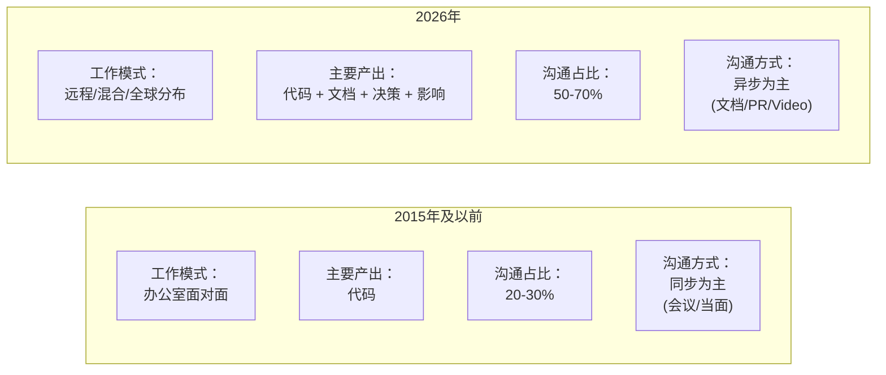

**关键数据**：
- 根据GitHub的调研，**一个工程师平均花费50-70%的时间在沟通相关活动上**（读代码、写文档、code review、meeting）
- 在remote-first公司，这个比例更高——因为所有协作都需要通过文字或video进行
- **AI可以帮你写代码，但不能帮你沟通**——解释设计决策、说服stakeholder、协调跨团队资源，这些仍然需要人

### 1.2 沟通的本质：编码-解码-反馈循环

用计算机通信的类比来解释沟通原理：

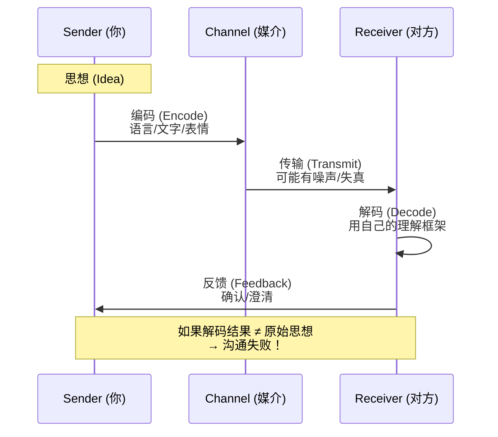

**2026年的新挑战**：

| 挑战 | 说明 | 影响 |
|------|------|------|
| **异步延迟** | 无法即时确认对方是否理解 | 信息失真可能持续数小时不被发现 |
| **文化差异** | 全球化团队有不同的沟通风格 | 同一句话在不同文化中有不同含义 |
| **信息过载** | Slack/Email/Notion中信息量爆炸 | 重要信息被淹没 |
| **缺乏非语言线索** | video call中缺少body language | 更难判断对方的真实反应 |
| **时区错开** | 无法实时讨论 | 决策周期变长 |

### 1.3 Talk vs Code 的价值对比（2026版）

需要认识到："无论是Code还是Talk其实都是要和人交流的。"让我们量化一下两者的价值：

| 维度 | Code的价值 | Talk的价值 |
|------|-----------|-----------|
| **执行** | 让机器做事情 | 让人达成共识 |
| **持久性** | 代码是活的（会变化） | 决策是死的（有记录） |
| **影响范围** | 用户（通过产品） | 团队/组织/行业 |
| **可替代性** | AI可以生成大部分代码 | AI无法替代信任建立和影响力 |
| **职业天花板** | IC path的天花板较高 | Management/Architecture path必需 |
| **2026年稀缺性** | 逐渐 commoditized | 越来越稀缺 |

**结论**：
> Code决定你能做什么，Talk决定你能**带领多少人一起做什么**。
>
> 在AI时代，前者的重要性相对下降，后者的重要性急剧上升。

---

## 二、新时代的高效沟通模型

### 2.1 远程协作沟通的全栈模型

在2026年，一个完整的技术沟通包含以下层次：

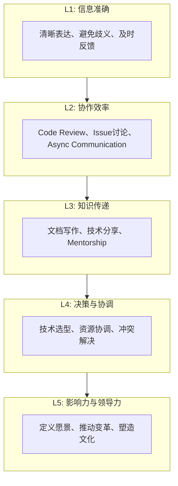

**每一层都需要不同的沟通技能**：

| 层级 | 主要形式 | 关键技能 | 工具 |
|------|---------|---------|------|
| L5 | Vision doc, Strategy memo, Town hall | Storytelling, Influence, EQ | Notion, Slides, Video |
| L4 | ADR, RFC, Design review meeting | Negotiation, Trade-off analysis, Data-driven | Google Docs, Miro, Linear |
| L3 | Blog post, Tech talk, 1-on-1 | Teaching, Listening, Empathy | GitHub, YouTube, Zoom |
| L2 | PR comment, Slack discussion, Standup | Clarity, Conciseness, Async-first | Slack, Discord, GitHub |
| L1 | Email, IM, Comment | Grammar, Precision, Timeliness | Gmail, Slack, Notion |

### 2.2 异步沟通优先（Async-First Communication）

虽然没有专门讲异步沟通（因为2020年这还不是主流），但在2026年，**async-first已经成为remote-first公司的标配原则**。

#### 什么是异步沟通？

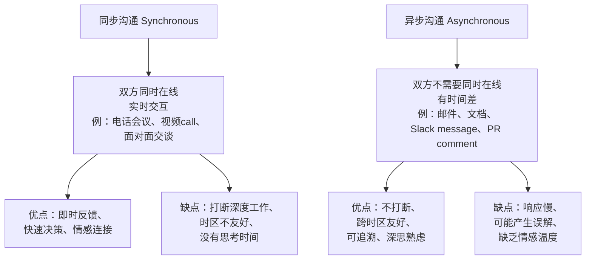

#### Async-First 的核心原则

| 原则 | 说明 | 实践 |
|------|------|------|
| **Write > Talk** | 能写就不要开会 | 用doc替代meeting |
| **Public > Private** | 能公开就不要私聊 | 用channel而不是DM |
| **Documented > Spoken** | 能记录下来就不要口头说 | 会议必须有notes或recording |
| **Pull > Push** | 让人自己拉取信息而非推送 | 用wiki/notion而不是spam通知 |

**何时使用同步沟通？**

| 场景 | 推荐方式 | 原因 |
|------|---------|------|
| 紧急生产事故 | 📞 同步（phone/video） | 需要立即响应 |
| 复杂技术辩论 | 🎥 同步（video + 共享屏幕） | 需要实时whiteboard |
| 敏感话题（绩效、离职） | 🎥 同步（video） | 需要情感连接 |
| 日常技术讨论 | 📝 异步（Slack/PR comment） | 给予思考和回复时间 |
| 信息同步 | 📝 异步（doc/email） | 可随时查阅 |
| Brainstorming | 🔄 先异步收集想法，再同步讨论 | 结合两者优势 |

### 2.3 技术文档写作：2026年工程师的核心技能

值得注意的是文档的重要性（"信息应该是公开透明的"），但没有展开。在2026年，**文档写作能力已经成为高级工程师的必备技能**。

#### 为什么文档如此重要？

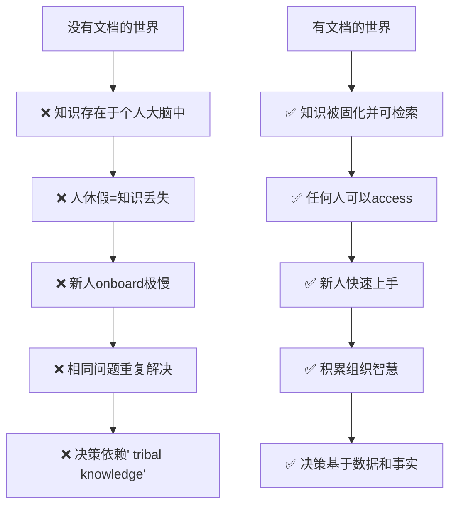

#### 必须掌握的文档类型

| 文档类型 | 目的读者 | 内容 | 更新频率 |
|----------|---------|------|---------|
| **README** | 所有用户 | 项目简介、安装、使用 | 随项目变更 |
| **API Doc** | API消费者 | 接口定义、参数、示例 | 随API变更 |
| **Architecture Doc (ADR)** | 开发团队 | 设计决策、trade-off、rationale | 架构变更时 |
| **Runbook / Playbook** | On-call engineer | 操作手册、故障排查SOP | 流程变更时 |
| **Postmortem** | 全团队 | 事故分析、根因、改进措施 | 事故发生后 |
| **RFC (Request for Comments)** | 社区/团队 | 提案讨论、征集意见 | 新feature前 |

#### 好文档的标准（Google风格）

Google有一套著名的文档写作指南，核心原则如下：

| 原则 | 说明 | 示例 |
|------|------|------|
| **为读者而写** | 考虑读者的背景和需求 | 不假设读者知道内部缩写 |
| **结构清晰** | 使用标题、列表、表格 | 信息层次分明 |
| **简洁精确** | 用最少的字表达最多的意思 | 删除冗余，避免废话 |
| **使用示例** | 具体的例子胜过抽象描述 | Show, don't just tell |
| **保持更新** | 过时的文档不如没有文档 | 设定review周期 |

### 2.4 信息透明度：打破层级壁垒

实践经验强烈主张："我一直都秉承的原则是，将信息源头的信息原模原样分享出去...真正的团队管理，不应该屏蔽信息，信息应该是公开透明的。"

这个观点在2026年更加重要，因为：

**① Remote work要求更高的透明度**

当你无法拍同事的肩膀问问题时，**信息的可获得性**决定了团队的效率。

**② Async communication 要求更完整的上下文**

因为没有即时的follow-up question，**初始信息必须尽可能完整**。

**③ Trust is built on transparency**

员工越了解公司的状况（包括坏消息），越能做出好的决策，也越能感受到被尊重。

#### 透明度的层次模型

```mermaid
graph TB
    subgraph L5 ["L5: 完全透明"]
        A[财务数据、战略决策过程、薪资范围（如Buffer）]
    end

    subgraph L4 ["L4: 高度透明"]
        B[OKR/目标、重大决策reasoning、Board notes]
    end

    subgraph L3 ["L3: 中度透明"]
        C[产品路线图、团队目标、架构决策(ADR)]
    end

    subgraph L2 ["L2: 基础透明"]
        D[项目状态、meeting notes、code review公开]
    end

    subgraph L1 ["L1: 不透明"]
        E[信息按需分配、need-to-know basis]
    end

    L1 --> L2 --> L3 --> L4 --> L5
```

**大多数公司处于L1-L2，领先的remote-first公司处于L3-L4，极少数（如Buffer）达到L5。**

---

## 三、实践建议：提升你的沟通效能

### 3.1 日常沟通Checklist

#### 写作/消息发送前的自检

在点击Send之前，问自己：

| # | 问题 | 检查项 |
|---|------|--------|
| 1 | **目的是什么？** | 我希望对方看完后做什么？ |
| 2 | **对象是谁？** | 对方的背景是什么？需要多少context？ |
| 3 | **够简洁吗？** | 能否删除30%的文字而不损失信息？ |
| 4 | **够清楚吗？** | 有没有可能被误解的地方？ |
| 5 | **行动明确吗？** | 对方是否清楚地知道下一步该做什么？ |
| 6 | **语气合适吗？** | 是否专业但不冷漠？友好但不随意？ |
| 7 | **格式易读吗？** | 是否使用了列表、加粗、代码块等？ |

#### Code Review Comment 的黄金标准

❌ **差的comment**：
> "这里不太好"

✅ **好的comment**：
> "我发现这里使用了`sync.Map`，考虑到这个函数会被多个goroutine并发调用，这是正确的选择。不过有一个潜在的性能问题：在高并发场景下，锁竞争可能会成为瓶颈。如果性能测试显示这里有瓶颈，可以考虑使用`segmented lock`或者改用无锁的数据结构。你怎么看？"

**结构**：肯定 → 观察到的问题 → 具体建议 → 开放式提问

### 3.2 会议沟通的最佳实践

虽然我们倡导async-first，但会议仍然是必要的。以下是高效会议的原则：

#### 会议前的准备

| 准备项 | 内容 | 时间投入 |
|--------|------|---------|
| **明确目的** | 这个会议要解决什么问题？能否用doc替代？ | 5分钟 |
| **邀请对的人** | 只邀请必须参加的人（减少 attendees） | 5分钟 |
| **提前分发材料** | 至少24小时前发agenda和相关doc | 取决于材料复杂度 |
| **设定时间盒** | 明确开始/结束时间和每个议题的时长 | 5分钟 |

#### 会议中的原则

| 原则 | 做法 |
|------|------|
| **准时开始** | 即使有人迟到也不要等（尊重准时的人） |
| **Follow agenda** | 不要跑题，off-topic的内容另外约时间 |
| **鼓励参与** | 特别注意安静的人，主动询问他们的意见 |
| **记录决议** | 每个discussion都要以action item结束 |
| **按时结束** | 如果没讨论完，另约时间，不要超时 |

#### 会议后的跟进

| 行动 | 时限 |
|------|------|
| 发送meeting notes | 24小时内 |
| 分配action items并设定deadline | 会议结束时 |
| 追踪action items的完成情况 | 持续进行 |

### 3.3 向上沟通：如何与Leader有效对话

后续文章中会详细讲这个话题，但在这里先给出一些基本原则：

| 场景 | 策略 |
|------|------|
| **汇报进度** | 用数据说话（完成了X%，剩余Y%），不只是"还在做" |
| **提出问题** | 同时带上至少一个proposed solution |
| **请求资源** | 说明ROI，为什么这笔投资值得 |
| ** disagree** | 用数据和事实支撑你的观点，私下沟通 |
| **分享好消息** | 及时分享，让leader也能向上report |

---

## 四、沟通阻碍和应对方法（原102）

### 4.1 沟通失败的代价

虽然没有直接量化沟通失败的成本，但他通过多个案例展示了其严重性。让我们用数据来说话：

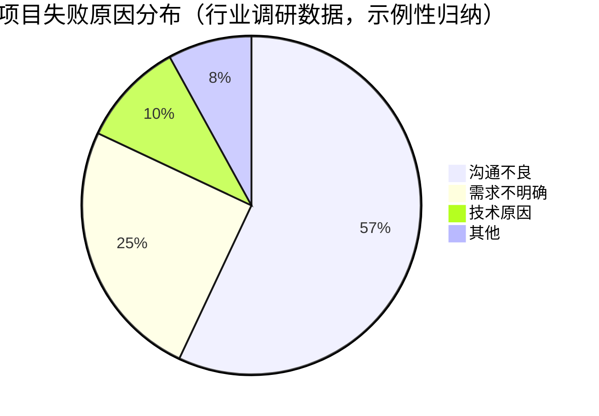

**关键发现**：
- **57%的项目失败归因于沟通问题**——这是最大的单一因素
- 在remote团队中，这个比例可能更高（因为缺少面对面交流的"纠错"机会）
- 沟通失败不仅导致项目延期，还会造成**团队关系恶化、人才流失、决策质量下降**

### 4.2 沟通阻碍的分类模型

实践经验识别了6大沟通阻碍。让我们在2026年的语境下重新审视它们：

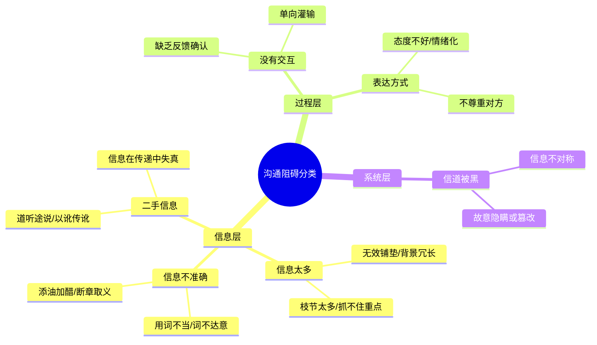

### 4.3 障碍一：信息不准确（Inaccuracy）

#### 2026年新表现

| 传统形式 | 2026新形式 |
|----------|-----------|
| 口头表述不清 | Slack消息过于简短，缺乏context |
| 写作错误 | AI生成的文档可能有hallucination |
| 记忆偏差 | 引用过时的文档或deprecated API |

#### 应对策略

**策略A：写作前的"冷却期"**

```
Step 1: 写下你想表达的内容
Step 2: 放置15-30分钟（去做别的事）
Step 3: 回来重新阅读，问自己：
   - 如果我是读者，我能理解吗？
   - 有没有可能被误解的地方？
   - 有没有遗漏重要的context？
Step 4: 修改后再发送
```

**策略B：使用"接收者测试"**

> "如果我收到这条消息，我会怎么理解？我会采取什么行动？"

**策略C：结构化表达模板**

对于重要信息，使用固定格式：

```markdown
## [主题]

**背景 (Context)**: 为什么要说这件事
**问题/请求 (Ask)**: 我需要什么
**方案/建议 (Proposal)**: 我的建议是什么
**影响 (Impact)**: 这会影响谁/什么
**下一步 (Next Steps)**: 需要对方做什么，什么时候
```

### 4.4 障碍二：信息过多（Information Overload）

#### 2026年新挑战

- **Notification fatigue**: 平均每个knowledge worker每天收到50-100+条notification
- **Channel proliferation**: Slack + Email + Notion + Jira + Linear + ... = 信息分散
- **Long-form aversion**: 人们倾向于写长文但不读长文

#### 应对策略

**原则：BLUF (Bottom Line Up Front)**

把最重要的信息放在最前面：

```
❌ 差的邮件:
[3段背景介绍]...[2段详细过程]...
[最后] 所以我想请一周假。

✅ 好的邮件:
【结论】我想申请6月10日-17日的年假。
【理由】[1-2句话说明]
【安排】已与XX确认手头工作可交接。
```

**工具化解决方案**：

| 问题 | 工具 | 做法 |
|------|------|------|
| Notification overload | 设定Do Not Disturb时段 | 关闭非紧急通知 |
| Channel太多 | 统一到少数几个channel | 减少tool fragmentation |
| 信息找不到 | 建立single source of truth | Wiki/Notion作为知识库 |
| Long doc没人读 | 提供Executive Summary | 先给TL;DR版本 |

### 4.5 障碍三：没有交互（No Interaction）

#### 危害

实践经验描述的场景："一个问题出去（比如：想听听大家有什么意见...）没有任何回应，一片寂静。"

这在remote团队中更加常见——因为**沉默的成本更低**（不需要面对尴尬的眼神接触）。

#### 应对策略

**① 创造安全的发言环境**

- 作为leader/facilitator，**先分享自己的不成熟想法**
- 明确表示"没有错误答案"、"所有意见都欢迎"
- 对每一次发言都给予positive reinforcement（至少说"谢谢分享"）

**② 使用structured input方式**

不要问开放式问题"大家有什么意见？"，而是：

```
❌ 开放式："大家对X有什么看法？"
✅ 结构化：
  Option A: 支持，因为...
  Option B: 反对，因为...
  Option C: 其他想法：______
  请回复 A/B/C + 你的理由
```

**③ Async-first的讨论方式**

对于复杂议题，使用doc-based discussion而非meeting：

1. 先写doc阐述问题和proposed solution
2. 给大家24-48小时时间阅读和comment
3. 收集feedback后，再开short sync meeting做decision

### 4.6 障碍四：表达方式不当（Delivery Issues）

#### 2026年特殊场景

| 场景 | 问题 | 影响 |
|------|------|------|
| **Text-only communication** | 缺乏tone of voice | 文字容易被误读为cold/aggressive |
| **Video call fatigue** | Zoom fatigue导致注意力下降 | 会议效率降低 |
| **Cross-cultural team** | 直接 vs 含蓄风格的冲突 | 误解意图 |
| **Async text debate** | 容易升级为conflict | 关系受损 |

#### 应对策略

**文字沟通的情绪管理**：

| 技巧 | 说明 |
|------|------|
| **使用emoji适度调节语气** | 👍 表示认可, 🤔 表示思考, ❓ 表示疑问 |
| **避免绝对性词语** | 把"总是/从不"改成"通常/很少" |
| **三明治法** | 肯定 → 建议 → 肯定 |
| **假设善意** | 先假设对方的意图是正面的 |

**示例**：

```
❌ 可能引起冲突的表达:
"你的代码写得有问题。这里完全错了。"

✅ 更好的表达:
"👍 我review了你提交的PR，整体思路很清晰！
🤔 不过在第45行这里，我有一个疑问：
使用sync.Map在这里可能会导致性能瓶颈，
因为在高并发下锁竞争会比较严重。
💡 你是否考虑过用segmented lock或者无锁方案？
我很想听听你的想法。"
```

### 4.7 障碍五：二手信息（Second-hand Information）

#### 2026年新风险

- **AI-generated misinformation**: AI可能会编造不存在的citation或data
- **Social media amplification**: 错误信息在Twitter/微博上被快速传播
- **Corporate grapevine**: 公司内部的小道消息往往失真严重

#### 应对策略

**黄金法则：Go to the Source**

> "流言止于智者，不是因为智者聪明，而是智者会到信息源头上去求证。" — 实践经验

**具体做法**：

| 信息类型 | 如何验证 |
|----------|---------|
| 技术事实 | 查官方文档、RFC、源码 |
| 行业新闻 | 找原始报道，看primary source |
| 公司内部信息 | 问当事人或查official channel |
| AI输出 | 交叉验证至少2个来源 |

### 4.8 障碍六：信道被黑（Channel Compromised）

#### 2026年表现形式

| 形式 | 说明 | 危害 |
|------|------|------|
| **选择性披露** | Leader只告诉部分人信息 | 团队分裂、trust erosion |
| **信息过滤** | 中间层修改上级指令 | 指令变形、执行偏差 |
| **Delay tactics** | 故意延迟传达坏消息 | 丧失反应时机 |
| **Spin control** | 重新包装负面信息 | 员工被误导 |

#### 应对策略

**如果你是Leader**：

- **默认透明**：除非有legal/compliance限制，否则公开所有信息
- **Context sharing**: 不仅告诉做什么，还要告诉为什么
- **Encourage pushback**: 让team可以challenge你的决定

**如果你是Individual Contributor**：

- **多source验证**: 不要只从一个channel获取信息
- **直接沟通**: 重要事项直接找stakeholder确认
- **Document everything**: 重要对话留written record

---

## 五、建立低摩擦沟通系统

### 5.1 个人沟通健康检查

每月自检以下指标：

| 维度 | 自问 | Green/Yellow/Red |
|------|------|-------------------|
| **响应及时性** | 我的Slack/email平均响应时间？ | <2h / <8h / >24h |
| **清晰度** | 我的message需要多少次clarification？ | 很少 / 偶尔 / 经常 |
| **关系质量** | 我和key stakeholder的关系如何？ | 良好 / 一般 | 紧张 |
| **会议效率** | 我参加的meeting有多少是必要的？ | >80% / 50-80% | <50% |
| **文档习惯** | 我的重要决策都有记录吗？ | 总是 / 经常 | 很少 |

### 5.2 团队沟通契约（Team Communication Contract）

建议与你的team共同制定一份communication contract：

```markdown
## Team Communication Contract

### Response Time Expectations
- Urgent (production incident): < 30 min
- Normal (PR review, question): < 24h
- Low priority (FYI): No response needed

### Channel Usage
- #general: Team announcements
- #dev: Technical discussions
- DM: Only for sensitive/personal topics
- Email: External communication only

### Meeting Norms
- Default: 25 min max
- Agenda required 24h in advance
- Notes published within 24h after meeting

### Documentation Standards
- All design decisions documented as ADR
- PR description follows template
- Runbook updated when process changes
```

---

## 六、沟通方式及技巧（原103）

### 6.1 有效沟通的底层逻辑

#### 沟通的三层模型

值得注意的一点是："好的沟通方式有很多种，我主要介绍最常用的三种：**尊重、倾听和情绪控制**。"

让我们将这三种方式系统化：

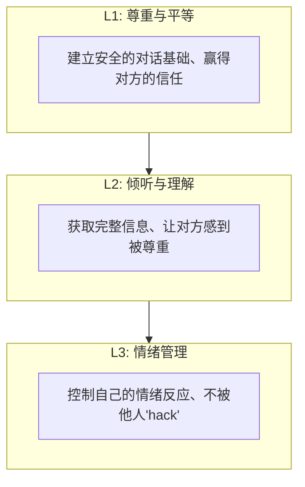

**这三者是有顺序的**：
- **没有尊重（L1）** → 对方不愿意和你交流
- **没有倾听（L2）** → 你无法获得足够信息做出好决策
- **没有情绪控制（L3）** → 你的理性判断会被情绪劫持

#### 2026年沟通的新维度

| 维度 | 2020年 | 2026年 |
|------|--------|--------|
| **媒介** | 面对面为主 | Video + Async text为主 |
| **受众** | 同办公室同事 | 全球分布、多文化背景 |
| **目标** | 信息传递 | 影响力构建 + 决策推动 |
| **挑战** | 语言障碍 | 时区、文化、工具fragmentation |

### 6.2 三大沟通基石

#### 基石一：尊重（Respect）

##### 实践经验的两条原则

**原则一：我可以不同意你，但是会捍卫你说话的权利**

> "即便在你不认同对方的情况下，也要尊重对方的表达，认真聆听，这个时候有可能你会发现不一样的东西，从而改变自己最初不准确的认知。"

**2026实践**：
- 在code review中，即使你认为某个approach是错的，也要先理解对方为什么这样选择
- 在design review中，即使你强烈反对某个方案，也要让作者完整阐述rationale
- 在Slack discussion中，不要因为不同意就ignore或dismiss

**原则二：赢得对方的尊重需要先尊重对方**

> "在你对他人表现出足够的尊重之后...他更乐于跟你交谈，而且交流的内容也会更为细致和深入"

**2026实践**：
- 回复message时先acknowledge："Thanks for the detailed explanation. Let me think about this..."
- Meeting中认真听每个人发言（包括junior）
- Publicly credit他人的贡献（"As XX suggested..."）

**关键认知：尊重 ≠ 同意**

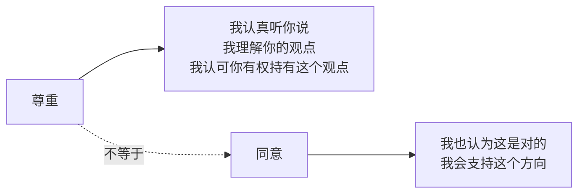

**你可以完全尊重一个人，同时100%不同意他的观点。**

#### 基石二：倾听（Listening）

##### 实践经验的定义

> "倾听与听或者听到有很大不同，它是解读别人所说信息的过程，包含听到、专注、理解、回应和记忆五大元素。"

##### 2026年倾听的特殊重要性

在remote环境中，**倾听的成本更高**（需要主动阅读长文、主动追问），但**价值也更大**（因为你无法通过观察body language来补充信息）。

**倾听的三个层次**：

| 层次 | 行为 | 效果 |
|------|------|------|
| **Level 1: 听到 (Hearing)** | 物理上接收到声音/文字 | 知道对方说了话 |
| **Level 2: 理解 (Understanding)** | 明白对方的意思 | 知道对方说了什么 |
| **Level 3: 共情 (Empathy)** | 感受对方的情感和动机 | 知道对方为什么这么说 |

**大多数人的沟通停留在Level 1-2，真正的高手达到Level 3。**

##### Active Listening 技巧

| 技巧 | 做法 | 示例 |
|------|------|------|
| **Paraphrasing** | 用自己的话复述 | "所以你的意思是..." |
| **Clarifying** | 问澄清性问题 | "当你说X的时候，具体是指...？" |
| **Reflecting feeling** | 反映情绪 | "听起来你对这个决定有些frustrated..." |
| **Summarizing** | 定期总结 | "到目前为止我们讨论了三点..." |
| **Non-verbal attending** | 肢体语言 | 点头、眼神接触(视频时看camera)、不做其他事 |

##### Async环境下的Active Listening

```
收到长文后的回复模板：

👍 感谢详细的分享！我已经仔细阅读了。

📝 我的理解是：
[用3-5句话总结核心要点]

❓ 我有几个问题想确认：
1. [问题1]
2. [问题2]

💭 我的初步想法是：
[你的思考，如果有的话]

请告诉我我的理解是否准确。
```

#### 基石三：情绪控制（Emotional Regulation）

##### 实践经验的核心观点

> "能否控制好自己的情绪对于沟通效果来说至关重要。...EQ高的人一般都是可以控制自己情绪的人。"

**两条实操原则**：

**原则一：不要过早或过度打断/反驳**

> "打断别人说话，是很不礼貌的事儿。断章取义是件非常可怕的事儿..."

**2026补充**：在text-based communication中，"打断"表现为——对方还没说完你就开始reply。**等对方把想法完整表达出来再回应。**

**原则二：求同存异，冷静客观**

> "切莫在冲动之下，说出很多一些过分或过激的话，因为言语的力量是巨大的，杀伤力有时难以预估。"

**2026新增：文字的情绪放大效应**

研究表明，**同样的内容，文字比面对面更容易传达出负面情绪**。因为缺少tone of voice和facial expression来soften message。

**应对策略**：

| 场景 | ❌ 不要做 | ✅ 应该做 |
|------|----------|----------|
| 收到让你生气的消息 | 立即回复（带着情绪） | 等30分钟再回复 |
| 看到明显错误的意见 | 直接反驳并纠正 | 先问"能展开说说吗？" |
| 被批评时 | 防御性反驳 | "感谢feedback，让我想想" |
| 想要激烈表达时 | 用exclamation mark和大写 | 冷静后用事实和数据说话 |

**情绪管理的终极心法**（来自实践经验）：

> "情绪是自己的，不是别人的，不应该被别人hack了。"
>
> "无论发生什么事，自己才是自己心情的主人，而不是别人。"

### 6.3 三大实战技巧

#### 技巧一：引起对方的兴趣（Hook Their Attention）

实践经验用自己的真实案例说明了这一点的重要性——如何在一个看似不可能的情况下（穿着随意、被银行副行长轻视）成功引起对方兴趣。

#### 通用公式：Pain Point + Value Proposition

```
Hook = [对方的痛点] + [你能提供的独特价值]
```

**场景化应用**：

| 场景 | Hook策略 |
|------|---------|
| **面试开场** | "我在上一个项目中解决了X难题，这与贵公司Y产品的挑战非常相似..." |
| **技术方案提案** | "目前我们的系统每天因Z问题损失$X，我的方案可以在Y时间内解决这个问题..." |
| **向上汇报** | "团队上周完成了X功能，这将使我们的用户留存率提升Y%..." |
| **客户沟通** | "我注意到贵公司在Q3面临X挑战，我们的产品可以帮助您..." |

**2026新增：Research-based Hook**

在重要沟通前做功课（15-30分钟）：
- 对方的近期关注点是什么？
- 行业/公司的最新动态？
- 对方的个人兴趣（LinkedIn/Twitter）？

**信息就是武器。**

#### 技巧二：直达主题，强化观点（Be Concise, Be Powerful）

##### BLUF方法（Bottom Line Up Front）

需要特别强调："确定自己的目标，学会抓重点，知道自己要什么和不要什么。"

**BLUF模板**：

```markdown
## [标题]

**结论 (Bottom Line)**: [一句话说明你的核心观点/请求]

**背景 (Context)**: [2-3句话说明为什么]
**细节 (Details)**: [支撑结论的关键信息]
**行动项 (Action Items)**: [需要对方做什么]
```

**信息过滤的三步法**：

```
原始想法（500字）
    ↓ Step 1: 删除所有废话和重复
过滤后（300字）
    ↓ Step 2: 只保留key points
提炼后（150字）
    ↓ Step 3: 提炼成一句"金句"
最终输出（20字以内）
```

**练习建议**：每次写完email/message后，问自己"能不能删掉50%的文字而不损失信息？"

#### 技巧三：基于数据和事实（Data & Evidence-Based）

需要认识到："你跟别人沟通，要尽量少说'可能、也许、我觉得就这样'等字眼，你最好通过数据和证据...让你的观点有不可被辩驳不可被质疑的特性。"

##### 数据的力量

| 表达方式 | 说服力 | 示例 |
|----------|--------|------|
| "我觉得性能有问题" | ⭐ | 主观，可被challenge |
| "响应时间感觉慢" | ⭐⭐ | 仍是主观感受 |
| "P99延迟超过2秒" | ⭐⭐⭐⭐⭐ | 客观，无可辩驳 |

##### 数据准备Checklist

| 数据类型 | 来源 | 准备时机 |
|----------|------|---------|
| **Performance metrics** | Monitoring system (Prometheus/Grafana) | Tech discussion前 |
| **Business metrics** | Dashboard (Mixpanel/Amplitude) | Proposal前 |
| **User feedback** | Survey, NPS, Support tickets | Product decision前 |
| **Benchmark data** | 自己跑的test / 第三方report | Architecture debate前 |
| **Industry data** | Market research, Competitor analysis | Strategy discussion前 |

**注意**：数据要准确、有来源、有时效性。**不要为了说服而编造或cherry-pick data。**

### 6.4 进阶：影响力构建

#### 从沟通到影响的跃迁

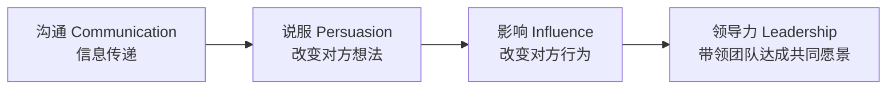

**每一级都需要前一级的技能作为基础，但每一级都需要额外的能力：**

| 层级 | 核心技能 | 关键差异 |
|------|---------|---------|
| Communication | 清晰表达 | 让对方**understand** |
| Persuasion | 逻辑+情感 | 让对方**agree** |
| Influence | trust+credibility | 让对方**act on your suggestion** |
| Leadership | vision+empowerment | 让对方**follow you voluntarily** |

#### 非暴力沟通（NVC）简介

虽然原版文章没有涉及NVC，但它是2026年值得学习的沟通方法论：

**NVC的四要素**：

1. **Observation（观察）**：客观描述事实（不带评判）
2. **Feeling（感受）**：表达你的情绪
3. **Need（需求）**：识别 underlying need
4. **Request（请求）**：提出具体的、可行的请求

**示例转换**：

```
❌ 暴力表达:
"你总是delay交付！你太不负责任了！"

✅ NVC表达:
"When I see that the feature was delivered 2 weeks after the deadline (O),
I feel frustrated and worried (F),
because I need reliability to plan our roadmap and keep commitments to customers (N).
Can we discuss what caused the delay and how we can prevent this in the future? (R)"
```

---

## 七、沟通技术（原104）

### 7.1 为什么需要"沟通技术"？

#### 从"会说话"到"有技术地说话"

需要认识到："你的逻辑能力一定要强。...对于我们程序员来说，我们是可以用缜密逻辑疯狂地碾压别人的。"

这句话揭示了一个重要事实：**程序员天然具备成为沟通高手的潜质——因为我们每天都在和最严密的"对话对象"（计算机）打交道，我们的思维已经被训练得非常逻辑化。**

问题在于：很多人把这种逻辑能力只用在code上，没有用在talk上。

#### 四大沟通技术的定位

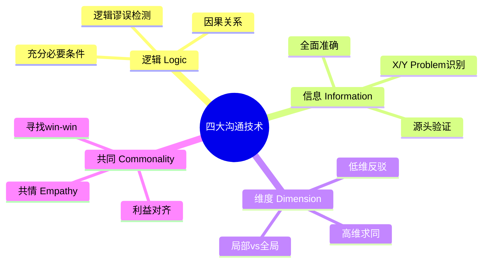

### 7.2 四大沟通技术详解

#### 技术一：逻辑（Logic）—— 用理性征服

##### 实践经验的案例：进度条设计的逻辑分析

实践经验用一个非常精彩的案例展示了如何用逻辑"碾压"产品经理：

**背景**：产品团队发现40%的用户在下载到一半时取消下载，想通过"假进度条"（快速跳到90%）来留住用户。

**逻辑拆解**：

```
前提假设: "用户看到90%进度 → 会愿意等待剩余10%"
    ↓
质疑前提: 这个假设是否成立？
    ↓
反例: 网页加载超过5秒时，无论进度条多少，用户都会离开
    ↓
关键洞察: 进度条欺骗只在"等待时间短(<15秒)"时有效
    ↓
应用: 视频下载通常需要30秒+，远超15秒阈值
    ↓
结论: 该方案不仅无效，反而会让用户认为"卡死了"
    ↓
最终判定: 假进度条是"愿意等短时间"的充分条件，
       但不是"愿意等到下载完成"的充分或必要条件
```

**这个案例展示了逻辑沟通的力量**：
- 不是靠emotion或authority
- 而是靠**清晰的推理链**和**无可辩驳的事实**
- 让对方自己得出"我的方案是错的"这个结论

##### 2026年常用的逻辑工具

| 工具 | 说明 | 应用场景 |
|------|------|---------|
| **充分/必要条件分析** | A是B的充要条件？ | 技术选型论证 |
| **反例构造** | "什么情况下你的方案不成立？" | 方案review |
| **归谬法** | "如果按你的逻辑推演，会导致..." | 驳斥错误观点 |
| **第一性原理** | 拆解到最基本的truth | 架构决策 |
| **Occam's Razor** | 最简单的解释往往是最好的 | Debug、troubleshooting |

#### 技术二：信息（Information）—— 全面且准确

##### X/Y Problem：隐藏的真实问题

实践经验专门讲了X/Y Problem——这是技术沟通中最常见的陷阱之一。

**定义**：
- **Y Problem**: 对方口头提出的问题（表面需求）
- **X Problem**: 对方真正想要解决的问题（真实需求）

**经典示例**：

```
Y: "怎么截取字符串的最后三位？"
↓ (Stack Overflow上的真实问题)
X: "我要获取文件的扩展名"
↓ (真正的需求)
Better Solution: 使用pathlib.splitext() 或 os.path.splitext()
而不是手动截取最后3个字符
```

**2026年企业版X/Y Problem**：

| Y (表面) | X (真实) | 如何挖掘X |
|-----------|----------|-----------|
| "我们要做微服务架构" | 我们需要更快的迭代速度 | 问"Why? What's the pain point?" |
| "我们需要上K8s" | 我们需要更好的部署自动化 | 问"What problem does K8s solve for you?" |
| "我们要引入AI" | 我们有具体的业务场景需要AI | 问"Use case是什么? ROI如何?" |

**应对策略**：

当对方提出一个solution-oriented的问题(Y)时：

```
Step 1: 接受Y作为切入点
Step 2: 问 "Why do you need Y?"
Step 3: 继续问 "Why?" (5 Whys technique)
Step 4: 找到root cause (X)
Step 5: 重新评估：Y是否是解决X的最佳方案？
Step 6: 如果不是，提出Z方案
```

##### 信息完整性的CHECKLIST

| 维度 | 问题 | Check项 |
|------|------|---------|
| **准确性** | 信息本身正确吗？ | 有source吗？可验证吗？ |
| **完整性** | 是否有遗漏的关键信息？ | 5W1H都覆盖了吗？ |
| **时效性** | 信息是最新的吗？ | 有date stamp吗？ |
| **相关性** | 信息与当前讨论相关吗？ | 还是noise？ |
| **偏见性** | 信息是否有bias？ | 谁提供的？有什么agenda？ |

#### 技术三：维度（Dimension）—— 高低维切换

##### 核心原则

值得注意的一点是："如果你要找不同就要到细节上去；如果你要找共同，就要到大局上去。"

这在沟通中极其重要：

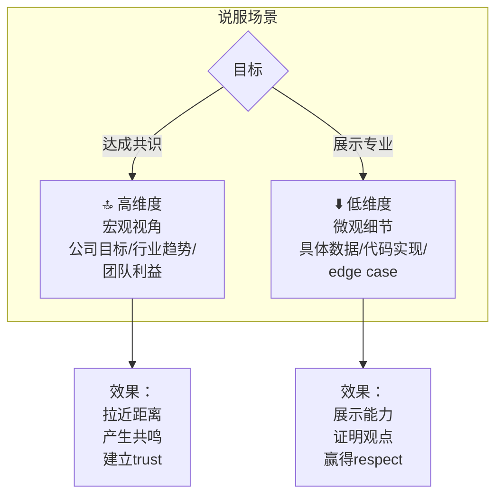

**实战应用**：

| 场景 | 维度选择 | 示例话术 |
|------|---------|---------|
| **与peer debate技术方案** | 先高后低 | "从公司战略看，我们都希望系统能支撑10x增长（高）。但在具体实现上，我对你提到的并发模型有一些concerns...（低）" |
| **向Leader汇报坏消息** | 先低后高 | "具体来说，这次事故影响了X个用户，持续了Y分钟（低）。但从整体看，这暴露了我们监控体系的gap，我建议..."（高） |
| **跨部门冲突协调** | 始终高维 | "我们虽然在implementation上有分歧（低），但我们的目标是一致的：都是为了让用户体验更好（高）。让我们回到这个共同点来讨论..."(高) |

**何时用哪个维度？**

| 情况 | 推荐 | 原因 |
|------|------|------|
| 对方情绪激动 | 高维度 | 降低对抗性 |
| 需要展示专业性 | 低维度 | 证明你懂details |
| 需要达成共识 | 高维度 | 找common ground |
| 需要做决策 | 低维度 | 用事实和数据说话 |
| 对方是决策者 | 高→低 | 先alignment再detail |
| 对方是执行者 | 低→高 | 先给context再specifics |

#### 技术四：共同（Commonality）—— 化敌为友

##### 从对立到协作

需要认识到："寻找'共同'的过程，其实也可以理解成为化'敌'为'友'的过程。"

**核心方法：共情 + 共享 + 共利 + 共识**

| 步骤 | 做法 | 效果 |
|------|------|------|
| **① 共情 (Empathy)** | "我理解你的frustration..." | 拉近距离 |
| **② 共享 (Share)** | 分享自己的类似经历 | 建立"我也是"的连接 |
| **③ 共利 (Align)** | 找到双方的共同利益点 | 从zero-sum到positive-sum |
| **④ 共识 (Consensus)** | 在共同基础上达成一致 | 形成action plan |

**实战对话示例**：

```
❌ 对抗式:
A: "你的方案不行！"
B: "你的才不行！"

✅ "共同"式:
A: "我理解你对性能的担忧（共情），我在上一个项目中也遇到过类似的挑战（共享）。
   我们的目标都是让系统更稳定（共利）。
   既然如此，让我们看看能不能结合两个方案的优点（共识）..."
B: "同意，那我们来具体讨论..."
```

### 7.3 进阶：金句构建与影响力

#### 什么是"金句"？为什么重要？

需要特别强调："无论干什么，你一定要有一个非常犀利的观点，也就是金句。"

**金句的特征**：
- ✅ 短小精悍（< 20字）
- ✅ 有记忆点（押韵、对比、反转）
- ✅ 包含insight（不只是陈述事实）
- ✅ 可引用、可传播

**为什么金句重要？**
- **瞬间抓住注意力**：在信息过载时代，只有犀利的内容能被记住
- **体现思考深度**：能提炼出金句说明你真正理解了本质
- **增强影响力**：人们更容易记住和传播一句精彩的话

#### 如何获得金句？

**来源一：大量阅读+深度思考**

实践经验推荐的三本书：
1. *Rework* (Jason Fried & David Heinemeier Hansson, 37signals) — 打破常规思维
2. *The Art of Thinking Clearly* (Rolf Dobelli) — 52个思维陷阱
3. *Socratic Logic* (Peter Kreeft) — 逻辑学入门

**来源二：从实践中提炼**

每次遇到有趣的观察或深刻的领悟时，记录下来，然后反复打磨：

```
原始想法: "代码写得烂主要是因为没时间"
→ 初步提炼: "没有时间写好代码，但有时间修bug"
→ 加入insight: "Technical debt is just deferred learning"
→ 最终金句: "We don't have time to write clean code,
   but we always have time to debug messy code."
```

**来源三：AI辅助生成+人工精炼**

```
Prompt:
"请基于以下观点，帮我生成3个不同风格的'金句'版本：
要求：简短有力、有insight、易于记忆。
观点：[你的核心观点]"
```

然后从中选择最好的，或者融合多个版本的优点。

---

## 八、好老板要善于提问（原105）

### 8.1 为什么管理者需要善于提问？

#### 从"给答案"到"问问题"的范式转变

实践经验开篇就指出了一个关键的管理误区：

> "管理者要想尽一切办法让员工自己思考问题，想出答案；而不是灌输，什么事儿都是自己在想，自己讲给员工听。"

这个观点在2026年更加重要，原因如下：

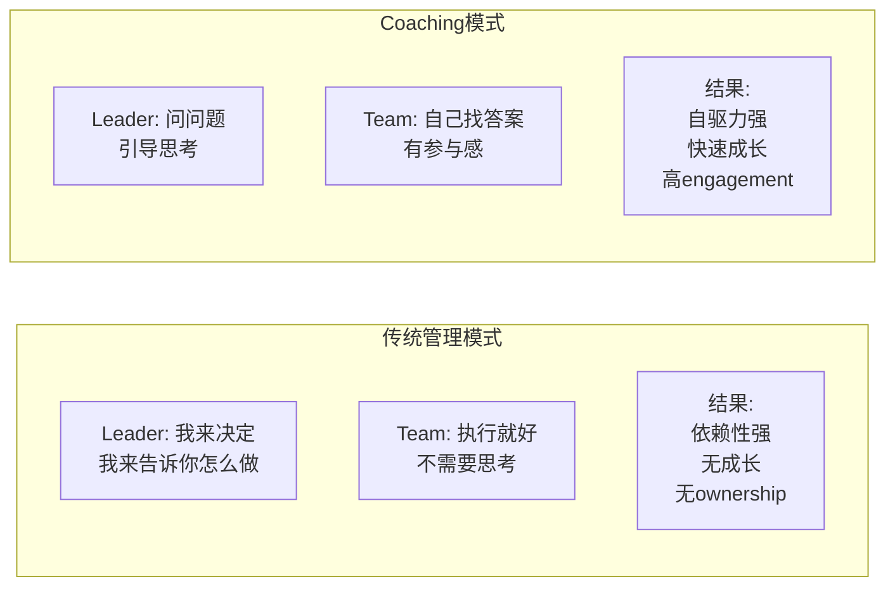

**核心洞察**：
> 当你给员工答案时，你创造了一个follower。
>
> 当你问员工问题时，你创造了一个thinker。

#### 提问的力量：盗梦空间式的管理哲学

实践经验用了一个非常形象的比喻："你应该在思想里埋下一个种子。"

这与**Coaching（教练式领导）**的理念完全一致：

```
传统管理:
Leader → (告诉答案) → Team → (执行)

Coaching管理:
Leader → (提问) → Team → (思考) → (给出方案)
         → (追问细节) → Team → (完善方案)
         → (继续追问) → Team → (最终方案 = Leader想要的)
         → ("太棒了！你的想法很棒") → Team → (高ownership + 高motivation)
```

**关键点**：最终方案可能是leader心中已有的，但**因为是员工自己"想出来"的，所以执行时会更有激情、更负责任。**

### 8.2 五大管理沟通技术

#### 技术一：引导（Guiding）—— 用提问驱动思考

##### 核心原则：永远不要直接给答案

需要认识到："永远不要给员工答案，要让员工给你答案，而且不要只给一个答案，一定要给多个答案。"

**实操SOP**：

```
Step 1: 员工带着问题来找你
Step 2: 不要直接回答，而是反问：
   "你是怎么想的？"
   "你有什么方案？"
Step 3: 员工给出方案A
Step 4: 如果A不是你要的（或不够好），不要否定，
     而是用问题引导：
   "如果采用方案A，当[情况X]发生时，会怎样？"
   "方案A解决了问题P，但会不会带来新问题Q？"
Step 5: 员工修正为方案B（更接近你要的）
Step 6: 继续用问题引导，直到达到满意的结果
Step 7: 给予positive reinforcement:
   "这个想法很棒！我同意我们按这个方向走。"
```

**适用场景矩阵**：

| 场景 | ❌ 不该做 | ✅ 应该做 |
|------|----------|---------|
| **任务分配** | "这个任务给你，两周完成" | "你觉得这个任务需要多久？有什么方案？" |
| **技术选型** | "我们应该用Go" | "你觉得Go和Rust在这个场景下各有什么优劣？" |
| **Debug** | "这里应该是race condition" | "你观察到了什么现象？可能的原因有哪些？" |
| **架构设计** | "应该加一层cache" | "如果QPS增长10倍，当前架构会有什么bottleneck？" |
| **绩效改进** | "你需要改掉X习惯" | "你觉得目前最大的提升空间在哪里？" |

**⚠️ 注意事项**：

- **紧急情况除外**：生产事故等需要快速决策时，可以直接给指令
- **新手阶段例外**：对于completely new的junior，初期需要更多guidance
- **时间压力例外**：deadline临近时，平衡"引导"和"效率"

#### 技术二：倾听（Listening）—— 了解你的团队成员

##### 实践经验的真实案例

文中分享了他在汤森路透时对两个不同背景小伙子的观察——一个来自农村要还债（抗压能力极强），一个是家里老五（抗压能力低）。通过倾听了解他们的背景，他能够建立更合理的预期和更精准的任务分配。

**2026年倾听的重要性更加突出**：

| 倾听维度 | 获取的信息 | 管理价值 |
|----------|-----------|---------|
| **工作状态** | 是否overwhelmed/burnout? | 及时调整workload |
| **职业目标** | 想往哪个方向发展？ | 提供growth opportunity |
| **个人困难** | 是否有生活上的挑战？ | 给予support/flexibility |
| **团队看法** | 对公司/团队有什么意见？ | 发现blind spot |
| **自我认知** | 他们如何看待自己的strength/weakness? | 更准确的评估 |

**具体做法：定期1-on-1**

| 要素 | 建议 |
|------|------|
| **频率** | bi-weekly 或 monthly |
| **时长** | 30-45 min |
| **议程** | 工作状态(10min) + 个人发展(15min) + 反馈(10min) + open Q&A |
| **关键原则** | **70% time you listen, 30% you talk** |

#### 技术三：共情（Empathy）—— 换位思考

##### 实践经验的离职谈话案例

当团队成员要辞职时，实践经验的建议是：

> "不要强行让对方留下来，要多谈感情...当你回想起过去一起同甘共苦的日子，难免会心生留恋..."

**共情的三步法**：

```
Step 1: 认可情绪
"我理解这对来说是一个艰难的决定"
"换做是我，可能也会有同样的想法"

Step 2: 分享感受
"说实话，听到你要走我也很难过..."
"我们一起经历了这么多..."

Step 3: 表达支持（即使留不住）
"无论你做什么决定，我都支持你"
"如果需要推荐信或reference，随时告诉我"
```

**2026新增场景：Remote team的共情挑战**

| 挑战 | 应对 |
|------|------|
| **无法看到body language** | 多用文字表达关心："How are you really doing?" |
| **时区差异** | 尊重对方的off-hour，不expect即时回复 |
| **文化差异** | 了解对方的文化背景，避免unintentional offense |
| **孤立感** | 定期non-work chat，创造social connection |

#### 技术四：高维思考（High-Dimensional Thinking）

##### 案例：业务被砍时的团队安抚

文中分享了一个极具挑战的场景：公司战略调整，要砍掉你负责的业务。

**❌ 低维反应（与team站在一起抱怨公司）**：
- 团队情绪更低落
- 你显得没有leadership
- 可能导致集体离职

**✅ 高维反应（实践经验的做法）**：

```
Step 1: 肯定过去（建立连接）
"我们做了很牛的事情，我们的技术积累还在"

Step 2: 承认困难（共情）
"公司的这个决定，我也有点难理解...我们这么辛苦做了这么多"

Step 3: 展望未来（高维视角）
"但我们这个团队是强大的...这个世界就是不完美的...
接下来，无论发生什么，我们都要一起扛！"
```

**高维思维的关键词**：
- **长期 vs 短期**: 这个挫折在职业生涯中只是一个小点
- **内部 vs 外部**: 问题在外部环境，不在团队本身
- **可控 vs 不可控**: 我们能控制的是自己的response
- **危机 = 机会**: 危机中往往蕴含着新的机会

#### 技术五：反馈（Feedback）—— 建立正向循环

##### 1-2-3反馈机制

实践经验介绍了他团队使用的"1-2-3 feedback机制"：

```
Level 1 (1小时):
→ 如果自己搞不定 → 反馈给Senior Engineer

Level 2 (2小时):
→ Senior也搞不定 → 反馈给Team Lead

Level 3 (3小时):
→ Lead也搞不定 → 这是个大事 → 向上feedback
```

**这个机制的价值**：

| 价值 | 说明 |
|------|------|
| **及时性** | 大问题不会隐藏超过3小时 |
| **escalation path清晰** | 每个人知道向谁求助 |
| **去stigmatize** | asking for help is expected, not weakness |
| **learning opportunity** | 每个level都能从上级的处理中学到东西 |

**2026年增强版本**：

除了problem escalation，还可以加入：

| Feedback类型 | 触发条件 | 内容 |
|------------|---------|------|
| **Success feedback** | 完成一个challenge | "太棒了！你是怎么做到的？分享一下方法" |
| **Learning feedback** | 学到新技术/工具 | Team内share session |
| **Process feedback** | 发现流程 inefficiency | 改进建议 |

### 8.3 实践建议：建立你的管理沟通系统

#### 管理者自我检查清单

每周自检：

| 维度 | 自问 | Green/Yellow/Red |
|------|------|-------------------|
| **引导vs告知** | 本周我的指令中有多少是可以用提问替代的？ | >80% / 50-80% / <50% |
| **倾听比例** | 1-on-1中我说了多少vs听了多少？ | 30%:70% / 50:50 / 70:30 |
| **共情意识** | 我是否知道每个direct report的current state? | 全部 / 大部分 / 很少 |
| **反馈及时性** | 我的team是否敢于及时告诉我坏消息？ | 总是 / 经常 | 很少 |
| **高维思维** | 遇到问题时我先考虑大局还是细节？ | 先大局 / 看情况 | 先细节 |

#### 从IC到Manager的角色转换

如果你刚从individual contributor转为manager，这是一个常见的陷阱：

| IC思维 | Manager思维 | 转变 |
|--------|-----------|------|
| "我来解决这个问题" | "谁来解决这个问题最合适？" | 授权 |
| "这是正确答案" | "你怎么看这个问题？" | 引导 |
| "我的代码最好" | "怎么让每个人都写出好代码？" | 赋能 |
| "我要证明自己最强" | "我要让每个人都很强" | 成就他人 |

---

## 九、好好说话的艺术（原106）

### 9.1 为什么"好好说话"这么难？

#### 沟通的本质是人性管理

实践经验开篇就说："好好说话这件事儿，其实真的挺难的。"然后列举了多个真实案例说明这一点。

让我们从认知科学的角度理解**为什么好好说话如此困难**：

```mermaid
flowchart TD
    A[大脑接收到信息] --> B{情绪中心<br/>(Amygdala) 先反应}
    B -->|触发防御| C["Fight/Flight/Freeze<br/>→ 情绪化回应"]
    B -->|平静状态| D[理性中心<br/>(Prefrontal Cortex)<br/>→ 理性分析]

    C --> E["❌ 后悔的话<br/>冲动决策<br/>关系受损"]

    D --> F["✅ 建设性对话<br/>理性决策<br/>关系加强"]

```

**关键洞察**：人类大脑的设计是**先情绪后理性**。当感到被攻击、被否定或压力过大时，amygdala会"hijack"大脑，导致我们说出后悔的话。

#### 2026年的新挑战

| 挑战 | 2020年 | 2026年 |
|------|--------|--------|
| **媒介限制** | 面对面为主 | 文字/视频为主，缺少非语言线索 |
| **受众多样性** | 同文化团队 | 跨时区、跨文化、跨语言团队 |
| **注意力竞争** | 会议+邮件 | Slack+Email+Notion+Jira+...= 信息碎片化 |
| **AI干扰** | 无 | AI生成的内容可能缺乏empathy和nuance |

### 9.2 七大场景的沟通艺术

#### 场景一：一对一会议（1-on-1）

##### 实践经验的核心观点

> "一对一谈话非常重要...管理者需要通过这样的谈话来了解员工的真实想法，建立与员工的信任关系。"

##### 2026年最佳实践

**① 1-on-1的结构化模板**

```markdown
## 1-on-1 Meeting Template

### Check-in (5 min)
- How are you feeling this week? (1-10 scale)
- What's on your mind?

### Work Update (10 min)
- What did you accomplish since last time?
- What are you working on now?
- Any blockers I can help with?

### Development (15 min)
- What skills do you want to develop?
- What kind of projects interest you?
- How can I support your growth?

### Feedback (10 min)
- [Manager → Employee]: One thing you're doing well, one thing to improve
- [Employee → Manager]: Any feedback for me?

### Open Discussion (5 min)
- Anything else on your mind?
```

**② Remote 1-on-1 的特殊注意事项**

| 注意事项 | 做法 |
|----------|------|
| **Video on** | 开启camera，建立human connection |
| **No multitasking** | 关闭其他tab，全神贯注 |
| **Silence is OK** | 给对方思考的时间（async环境下更慢） |
| **Follow up in writing** | 会后发送summary，确保alignment |

#### 场景二：绩效沟通（Performance Review）

##### 实践经验的建议

> "绩效沟通一定要以数据说话，不要说感觉。"

##### 2026年增强版

**① 数据驱动的评估框架**

| 维度 | 数据来源 | 示例指标 |
|------|---------|---------|
| **产出质量** | Code review stats, Bug rate | PR approval rate > 95%, Critical bugs = 0 |
| **交付效率** | Sprint velocity, On-time delivery | 90% of tasks completed within estimate |
| **技术成长** | Learning activities, Certifications | Completed X course, Obtained Y cert |
| **协作能力** | Peer feedback, Cross-team impact | Positive feedback from 3 teams |
| **影响力** | Blog posts, Talks, Open source | Published 3 articles, 50 GitHub stars |

**② 绩效反馈的三明治法（增强版）**

```
Layer 1: 具体的肯定 (Specific Praise)
"这个季度你主导的重构项目非常成功，
将API响应时间降低了40%，这是可量化的impact。"

Layer 2: 建设性的改进建议 (Constructive Feedback)
"有一个可以提升的地方：在code review中，
你的comments有时比较简短。
如果能像你的代码一样详细地解释reasoning，
会让reviewee更容易理解和接受。"

Layer 3: 未来展望 + Support (Future + Support)
"下个季度我希望看到你承担更多architecture
层面的工作。如果你需要任何support or resource，
随时告诉我。"
```

#### 场景三：特立独行的员工

##### 实践经验的分类法

实践经验将这类员工分为三类：

| 类型 | 特征 | 管理策略 |
|------|------|---------|
| **A类: 有性格但有能力** | 有主见、敢说话、能力强 | **尊重+引导**：给他们空间，用提问引导而非指令 |
| **B类: 惹事但无能力** | 制造麻烦、没有实际贡献 | **限期改进or淘汰**：明确expectation，给chance，不行则let go |
| **C类: 能力强但态度差** | 技术牛但难以合作 | **权衡取舍**：如果value > cost，尝试改善；否则考虑separation |

**2026新增维度：Remote环境下的"特立独行"**

在remote环境中，以下行为可能被误读为"特立独行"：
- 不回复Slack消息 → 可能是在deep work mode
- 不参加optional meeting → 可能是timezone原因
- 直接challenge leader's decision → 可能是culture差异

**应对**：先假设善意，直接沟通了解原因。

#### 场景四：离职挽留 / 劝退

##### 挽留离职员工的策略

实践经验给出了一个完整的SOP：

```
Step 1: 了解真实原因
"能告诉我你决定离开的真实原因吗？
不是对HR说的那些套话，是你内心真实的想法"

Step 2: 共情
"我理解...如果我是你，面对同样的情况..."

Step 3: 回忆美好时光
"还记得我们一起做X项目的时候吗？..."

Step 4: 展望可能性
"其实公司正在计划Y...
如果你愿意留下来，我可以为你争取Z..."

Step 5: 尊重决定
"如果这是你经过深思熟虑的决定，
我尊重并支持你。无论你去哪里..."
```

**⚠️ 关键原则**：
- **不要强行挽留**：如果对方心意已决，挽留只会让双方尴尬
- **不要counter-offer immediately**：先了解root cause，有时钱不是问题
- **保持好聚好散**：世界很小，可能未来还会共事

**劝退员工的策略**：

```
Step 1: 准备充分
- 收集数据和事实（performance issues的具体例子）
- 准备severance方案
- 预演对话

Step 2: 选择合适的时机和环境
- 私密空间（或private video call）
- 不要在周五下午（影响weekend）
- 给对方时间消化

Step 3: 直接但尊重
- 用事实说话，不用情绪化语言
- 给对方express的机会
- 提供transition support

Step 4: 快速而干净
- 一旦决定，执行要快（dragging out is cruel）
- 协助knowledge transfer
- 保持professional relationship
```

#### 场景五：客户沟通

##### 实践经验的核心理念

> "对于客户来说，他们不关心你的代码写得有多漂亮，架构有多牛X，他们只关心他们的需求是否得到了满足。"

##### 客户沟通的三大原则

**原则一：翻译官角色**

```
Technical Language:
"We need to implement a circuit breaker pattern with a
fallback mechanism using Redis as the cache layer..."

Customer Language:
"系统偶尔会变慢，我们在加一个保护机制，
即使某个部分出问题，您的用户也不会受到影响。
预计可以将页面加载时间稳定在2秒以内。"
```

**原则二：Under-promise, Over-deliver**

| ❌ 不推荐 | ✅ 推荐 |
|-----------|--------|
| "这很简单，两天就能做完" | "我们需要评估一下，预计一周内给您初步方案" |
| "没问题，什么都能做" | "让我确认一下我们的能力范围，然后给您一个可行的方案" |
| "绝对不会出bug" | "我们会进行充分的测试，将风险降到最低" |

**原则三：坏消息早说**

> 发现问题 → 立即告知客户（附上解决方案）
>
> 不要等到deadline才说"做不完"

#### 场景六：老板沟通（Managing Up）

##### 实践经验的策略

> "跟老板说话，最重要的就是不要让老板有意外感。"

##### 2026年Managing Up框架

**① 定期同步（Proactive Communication）**

| 频率 | 内容 | 形式 |
|------|------|------|
| Weekly | 进度更新、blockers、next week plan | Email / Standup note |
| Monthly | KPI进展、risks、resource needs | 1-on-1 |
| Quarterly | Strategy alignment、goal setting | Formal review |

**② 带方案提问题**

```
❌ "Boss，我们有问题了！"
✅ "Boss，我发现了一个potential issue。
   影响范围：X
   我建议的解决方案：Y
   需要的资源：Z
   如果您同意，我打算本周开始实施"
```

**③ 管理预期（Expectation Management）**

- **Early warning**: 问题刚出现时就alert，不要等到爆炸
- **Honest assessment**: 不要over-promise
- **Bad news first**: 先说坏消息再说好消息（或者至少一起说）

#### 场景七：非暴力谈判（Non-violent Negotiation）

##### 实践经验的谈判哲学

> "谈判的目的不是打败对手，而是找到双方都能接受的方案。"

##### 2026年谈判框架

**准备阶段**：

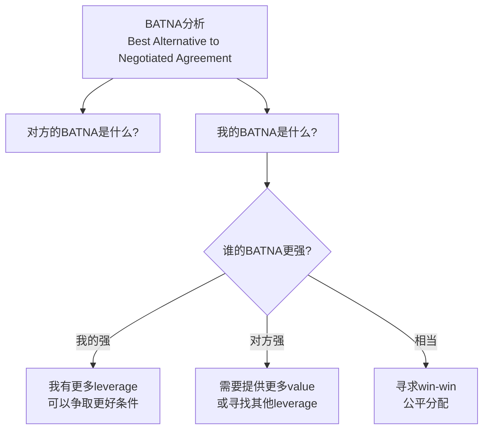

**谈判中的技巧**：

| 技巧 | 说明 | 示例 |
|------|------|------|
| **Anchor effect** | 先提出一个favorable position | 先报高价（卖方）或低价（买方） |
| **Silence power** | 说出offer后保持沉默 | 让对方先打破沉默 |
| **Package deal** | 把多个议题打包讨论 | "如果你们能在价格上让步，我们可以接受更长的交付周期" |
| **Walk away power** | 真正准备好离开 | "如果这个条件不能满足，我们可能需要重新考虑合作" |

**谈判后的follow-up**：

- **书面确认**：所有口头协议都要写成document
- **Relationship maintenance**：谈判结束后继续保持良好关系
- **Review & learn**：每次谈判后复盘，哪些做得好，哪些可以改进

### 9.3 进阶：AI时代的沟通增强

#### AI如何辅助"好好说话"

| 场景 | AI的作用 | ⚠️ 注意事项 |
|------|---------|------------|
| **起草email/message** | 优化措辞、检查tone | 必须加入personal touch |
| **准备difficult conversation** | 练习不同的表达方式 | 最终要用你自己的话 |
| **分析沟通模式** | 回顾过去的沟通，识别pattern | Privacy concerns |
| **翻译跨语言沟通** | 克服language barrier | 可能丢失cultural nuance |
| **Meeting summary** | 自动生成notes | 需要人工验证准确性 |

#### AI不能替代的部分

| AI做不到的 | 为什么重要 | 如何培养 |
|------------|-----------|---------|
| **真正的empathy** | 人与人之间的情感连接 | 多倾听、多观察、多反思 |
| **context awareness** | 理解未言明的潜台词 | 经验积累 + active listening |
| **trust building** | 通过一致性建立信任 | 言行一致、信守承诺 |
| **reading the room** | 感受氛围变化 | 练习observation skill |
| **ethical judgment** | 在复杂情境中做出道德判断 | 建立自己的value system |

---

## 十、总结：高效沟通指南精华浓缩

### 核心要点回顾

**Talk = Code（原101）**：
1. Talk ≥ Code in 2026：沟通能力从soft skill升级为core hard skill
2. 沟通 = 编码-解码-反馈循环：确保信息准确传递的关键是feedback
3. Async-First：异步沟通优先是remote时代的标配
4. 文档写作是核心竞争力：ADR、Runbook、Postmortem等文档类型
5. 信息透明度：打破层级壁垒，建立trust-based culture
6. 日常Checklist：发送前的自检、Code Review标准、会议best practice
7. 向上沟通：用数据说话，带方案提问题

**沟通阻碍（原102）**：
1. 57%的项目失败源于沟通问题——这不是soft skill，是survival skill
2. 六大阻碍：不准确、过多、无交互、表达不当、二手信息、信道被黑
3. BLUF原则：最重要的信息放在最前面
4. Go to the Source：永远到源头验证二手信息
5. Structure saves time：使用模板和checklist减少误解
6. Emotional hygiene：文字沟通注意tone management
7. Transparency builds trust：默认公开，除非有合法理由不公开

**沟通方式（原103）**：
1. 三大基石：尊重（建立基础）、倾听（获取信息）、情绪控制（保持理性）
2. 尊重 ≠ 同意：可以100%尊重对方同时100%不同意其观点
3. 倾听三层论：听到 → 理解 → 共情
4. 文字的情绪放大效应：async沟通要格外注意tone management
5. 三大实战技巧：引起兴趣(Hook)、直达主题(BLUF)、数据说话(Evidence)
6. 从沟通到影响：Communication → Persuasion → Influence → Leadership
7. NVC方法：观察-感受-需求-请求，减少冲突

**沟通技术（原104）**：
1. 逻辑是武器：程序员的天然优势，善用充分/必要条件、反例、归谬法
2. X/Y Problem：不要急着回答表面问题，先挖掘真实需求
3. 维度切换：高维求共识、低维展实力，根据场景灵活切换
4. 化敌为友：共情→共享→共利→共识的四步法
5. 金句力量：犀利的观点让你被记住、被引用、被尊重
6. 读书是捷径：推荐的三本书可以显著提升你的思维质量

**管理沟通（原105）**：
1. 提问 > 告知：coaching式管理激发team潜能和ownership
2. 五步引导法：让员工自己找到答案，哪怕那个答案是你想要的
3. 70/30法则：1-on-1中70%时间你在听，30%你在说
4. 共情三步法：认可情绪 → 分享感受 → 表达支持
5. 高维思维：用更大的框架来解读当前的困境
6. 1-2-3反馈机制：确保问题及时escalation，不让任何人独自struggle
7. 角色转变：从"解决问题的人"变成"帮助别人解决问题的人"

**好好说话（原106）**：
1. 七大实战场景：1-on-1、绩效沟通、特立独行员工、离职挽留/劝退、客户沟通、老板沟通、非暴力谈判
2. 数据驱动的绩效评估框架
3. Under-promise, Over-deliver的客户沟通原则
4. Managing Up：定期同步、带方案提问题、管理预期
5. BATNA分析和谈判技巧
6. AI辅助沟通的边界：AI可以优化表达，但不能替代真正的empathy和trust building

### 实践经验的终极智慧

实践经验在这整个系列中传递了一个贯穿始终的理念：

> **技术能力决定你能走多快，沟通能力决定你能走多远。**
>
> **学习是投资，不是消费；沟通是桥梁，不是表演。**
>
> **做一个有实力的人，同时做一个会表达的人。**

在2026年，这句话的价值比以往任何时候都更加珍贵。

---

## 延伸资源

### 书籍推荐

**沟通类**：
| 书名 | 作者 | 核心价值 |
|------|------|---------|
| *Crucial Conversations* | Patterson et al. | 高难度沟通技巧 |
| *Never Split the Difference* | Chris Voss | FBI谈判专家的沟通术 |
| *The Manager's Path* | Camille Fournier | 技术管理中的沟通 |
| *Radical Candor* | Kim Scott | 坦诚直接又关怀的沟通 |
| *Nonviolent Communication* | Marshall Rosenberg | 非暴力沟通方法论 |
| *Difficult Conversations* | Stone, Patton & Heen | 困难对话处理 |
| *High Output Management* | Andy Grove | 高产出管理中的沟通 |

**思维与技术类**：
| 书名 | 作者 | 核心价值 |
|------|------|---------|
| *Google Developer Documentation Style Guide* | Google | 技术文档写作指南（免费在线）|
| *The Art of Thinking Clearly* | Rolf Dobelli | 52个思维陷阱 |
| *Socratic Logic* | Peter Kreeft | 逻辑学入门 |
| *Rework* | Jason Fried & David Heinemeier Hansson | 打破常规思维 |

### 工具推荐

| 类别 | 工具 | 用途 |
|------|------|------|
| **异步视频** | Loom / Vidyard | 录制screen share+face，异步传达复杂信息 |
| **文档协作** | Notion / Google Docs | 实时协作编辑 |
| **白板协作** | Miro / FigJam | 远程brainstorm和design review |
| **项目管理** | Linear / Jira | 任务追踪和进度可视化 |
| **即时通讯** | Slack / Discord | team沟通（注意channel vs DM的使用） |
| **会议工具** | Zoom / Google Meet | video conference |

### 学习资源

| 资源 | 类型 | 链接/说明 |
|------|------|---------|
| **Google Technical Writing** | 课程 | free online course |
| **GitLab Handbook** | 文档 | 公开的公司handbook范例 |
| **Basecamp's Shape Up** | 方法论 | 关于project management的沟通 |
| **Manager Tools** | 播客/podcast | 一对一沟通技巧 |

### 原版文章链接

- [101 原版文章](https://time.geekbang.org/column/article/28550)
- [102 原版文章](https://time.geekbang.org/column/article/32619)
- [103 原版文章](https://time.geekbang.org/column/article/32796)
- [104 原版文章](https://time.geekbang.org/column/article/32902)
- [105 原版文章](https://time.geekbang.org/column/article/33112)

---

**感谢阅读《高效沟通指南》[2026重制版]！**
**愿每一位技术人都能在专业能力和沟通影响力的双重加持下，走得更远、飞得更高！** 🚀
