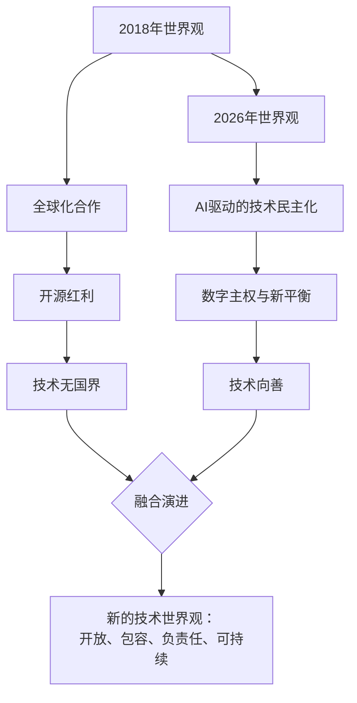
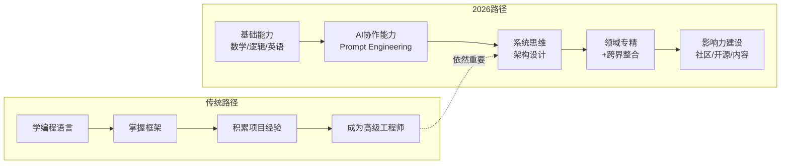
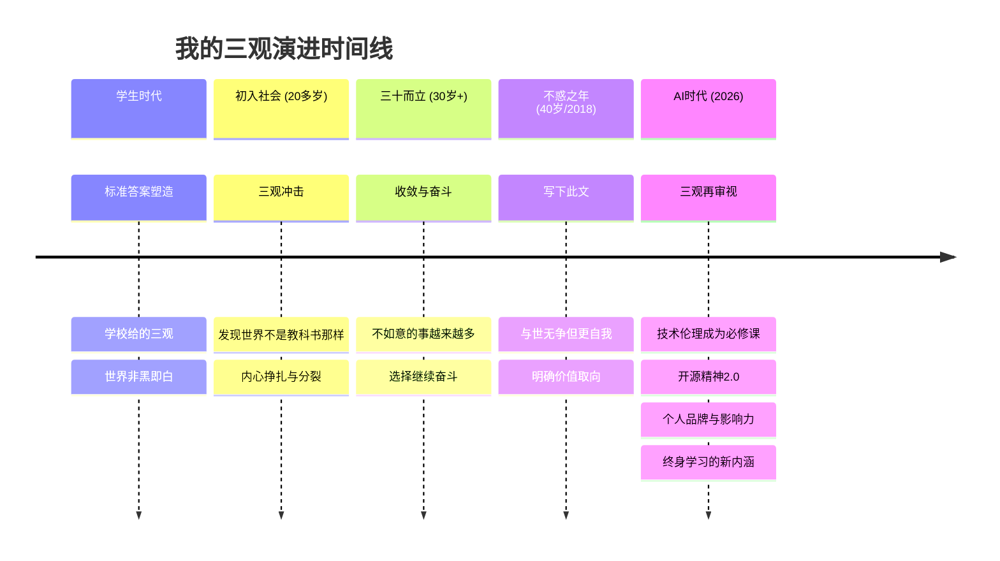

# 加餐 | 谈谈我的"三观" [2026重制版]

## 核心变更说明

本文档基于2018年原版《加餐 | 谈谈我的"三观"》进行2026年重制。核心更新包括：

- **AI时代价值观重塑**：在人工智能飞速发展的背景下，重新审视技术人员的世界观、人生观和价值观
- **技术伦理新维度**：增加对AI伦理、数据隐私、算法偏见等新时代议题的思考
- **开源精神深化**：从代码开源扩展到知识开源、思想开源的更广义理解
- **个人品牌建设**：在社交媒体和AI时代，如何建立真实而有价值的技术影响力
- **全球化2.0视角**：后疫情时代、地缘政治变化下的技术人世界观调整

---

## 内容回顾：原版"三观"体系

### 什么是三观？

我在原文中提到的"三观"指的是：

- **世界观代表你是怎么看这个世界的**——是左还是右，是激进还是保守，是理想还是现实，是乐观还是悲观……
- **人生观代表你想成为什么样的人**——是成为有钱人，还是成为人生的体验者，是成为老师，还是成为行业专家……
- **价值观则代表你觉得什么对你来说更重要**——是名是利，是过程还是结果，是付出还是索取……

### 原版核心观点回顾

#### 面对世界：亲身经历胜过道听途说

年轻的时候，我对世界上的一些国家有很深的偏见。但后来因为有各种机会出国长时间生活和工作，到过加拿大、英国、美国、日本……随着自己经历的丰富与眼界的开阔，自己的三观也发生了很多变化。

**核心认知**：要有一个好的世界观，你需要亲身去经历和体会这个世界，而不是光听别人怎么说。

我对国与国之间关系的态度是：**有礼有节，不卑不亢**。整体而言，我并不觉得我们比国外有多差，也不觉得我们比国外有多好。我们还在成长，还需要帮助与协作。

#### 面对社会：提升自己优于改变他人

在网络争论中，我发现：

1. 很多讨论不是针对事，而是直接骂人，随意给人扣帽子
2. 非黑即白，你说这个不是黑的，他们就会把你划到白的那边
3. 漂移观点，复杂化问题，东拉西扯
4. 杠精很多，不关心你的整体观点

**核心策略**：与其花时间教育这些人，不如花时间提升自己，让自己变得更优秀。

埃莉诺·罗斯福的名言至今仍振聋发聩：
> Great minds discuss ideas（伟人谈论想法）
> Average minds discuss events（普通人谈论事件）
> Small minds discuss people（庸人谈论他人）

#### 面对人生：《教父》式的人生阶梯

《教父》里有这样的人生观：**第一步要努力实现自我价值，第二步要全力照顾好家人，第三步要尽可能帮助善良的人，第四步为族群发声，第五步为国家争荣誉。**

这也是古人的"修身齐家治国平天下"！在你准备开始"平天下"的时候，也得先想想自己的生活有没有过好，家人照顾好了么。

**选择与努力的辩证关系**：有人说选择比努力更重要，我深以为然。选择是有代价的，而不选择的代价更大；选择是要冒险的，你不敢冒险时风险可能更大；选择是需要放弃的，鱼和熊掌不可兼得。

#### 价值取向：六个维度

1. **挣钱**：更多关注怎么提高自己的能力，让自己值那个价钱。越是有能力的人，就越不计较短期得失。
2. **技术**：花时间在技术的原理和本质上，而不是某个专用技术或平台上。
3. **职业**：扎根技术，保持写代码的能力。程序员的技能可以让我更稳定更自由地活着。
4. **打工**：推动公司/部门/团队进步，即使这意味着摩擦。"做正确的事情，等着被开除"。
5. **创业**：为自己事业而活，不是为了逃避。只有在做自己事业的时候，才能不惧困难。
6. **客户**：不完全迁就客户，愿意鲜明地表达观点，拉着用户一起成长。

---

## 2026 视角：AI时代的三观演进

### 一、世界观升级：从全球化到技术无国界

#### 1. AI时代的全球技术格局

2018年时，我们还在讨论云计算、微服务、容器化这些技术。到了2026年，AI已经深刻改变了整个技术生态：

- **大语言模型的普及**：GPT、Claude、Gemini等模型让编程、写作、分析的门槛大幅降低
- **AI辅助开发成为标配**：Copilot、Cursor等工具改变了程序员的工作方式
- **技术壁垒的重构**：某些传统技能的价值被稀释，但对系统思维、架构能力的需求反而增强

**新的世界观认知**：技术不再是少数精英的专利，AI正在实现某种程度的"技术民主化"。但这并不意味着我们可以停止学习——相反，**我们需要学习如何与AI协作，如何判断AI输出的质量，如何在AI时代保持不可替代性**。

#### 2. 开源精神的2.0时代

原文中我提到："在计算机和互联网行业，我们享受了太多开源和开放的红利"。2026年，这个观点需要进一步延伸：

**传统开源** → **知识开源** → **思想开源** → **AI模型开源**

| 维度 | 2018年 | 2026年 |
|------|--------|--------|
| 代码开源 | GitHub繁荣 | GitHub + AI生成代码审查 |
| 知识分享 | 博客、专栏 | 播客、视频、AI摘要 |
| 思想交流 | 论坛、社群 | 去中心化社交、DAO |
| 工具开源 | 开源软件 | 开源AI模型、开源Agent |

**关键洞察**：开源不仅是利他行为，更是建立个人影响力的最佳方式。在AI时代，你的独特见解、实践经验、解决问题的思路，这些"隐性知识"比代码本身更有价值。

#### 3. 技术伦理：新时代的必修课

2018年时，技术伦理还只是学术界的话题。2026年，每个技术人员都必须面对：

- **算法偏见**：AI模型可能继承训练数据中的性别、种族、地域歧视
- **数据隐私**：GDPR、个人信息保护法等技术合规要求
- **AI安全**：深度伪造、自动化攻击、AI武器化
- **就业冲击**：AI替代哪些工作？如何帮助被替代的人群？
- **环境成本**：训练大模型的碳排放问题

**我的立场**：技术人员不能只做"工具人"，我们需要有伦理自觉。当你在设计一个推荐算法时，想一想它是否在制造信息茧房；当你在训练一个AI模型时，想一想训练数据的来源是否公平；当你发布一个开源项目时，想一想它是否可能被滥用。

### 二、人生观重构：在AI时代找到定位

#### 1. 从"技能积累"到"能力组合"

2018年时，程序员的核心竞争力是：掌握某门语言、熟悉某个框架、有丰富的项目经验。

2026年，这些依然重要，但不够了。新的核心竞争力包括：

- **AI协作能力**：知道什么时候用AI、怎么用好AI、如何验证AI输出
- **系统思维**：理解复杂系统的交互关系，而不只是单点优化
- **领域专精+跨界整合**：既要有深度，也要有广度，能在不同领域间建立连接
- **沟通与影响力**：能清晰表达复杂概念，能影响团队和组织决策

#### 2. 终身学习的具体路径

原文中我强调"学习是没有捷径的"，这个观点在AI时代不仅没有过时，反而更加重要：

**被动学习 vs 主动学习（2026版）**：

| 学习方式 | 知识留存率 | 2026年示例 |
|----------|------------|------------|
| 听课、看视频 | 5-10% | 看AI生成的教程 |
| 阅读 | 10-20% | 读技术文档、论文 |
| 社群讨论 | 20-30% | 参与技术论坛、Discord |
| 实践练习 | 50-70% | 用AI辅助做项目 |
| 教授他人 | 70-90% | 写博客、做分享、带新人 |

**ARTS任务的2026进化**：

原版的ARTS（Algorithm、Review、Tip、Share）仍然有效，但可以升级为：

- **A - Algorithm**：保持不变，算法能力依然是基础
- **R - Review**：扩展到阅读AI相关论文、了解最新研究
- **T - Tip**：包括AI使用技巧、效率工具推荐
- **S - Share**：形式更多样——文章、视频、播客、开源项目
- **新增 E - Ethics**：每周思考一个技术伦理问题

#### 3. 选择的艺术：在不确定性中导航

原文中我说："选择比努力更重要"。2026年，这个观点需要补充：

**选择的难度增加了**，因为：
- 技术迭代更快了（AI领域几乎每月都有突破）
- 职业路径更多样化了（传统开发、AI工程、产品、创业...）
- 信息噪音更大了（自媒体、AI生成内容的泛滥）

**但选择的框架更清晰了**：

1. **问自己三个问题**：
   - 这件事10年后还有意义吗？
   - 这件事能让我学到可迁移的能力吗？
   - 这件事符合我的价值观吗？

2. **避免三个陷阱**：
   - 不要因为"FOMO"（错失恐惧）而盲目跟风
   - 不要因为短期利益而牺牲长期成长
   - 不要因为舒适区而拒绝挑战

### 三、价值观进化：技术人的责任与担当

#### 1. 从"技术至上"到"技术向善"

2018年时，技术圈的主流叙事是"技术改变世界"、"代码就是力量"。这种叙事本身没错，但不够完整。

2026年，我们需要补充的是：**技术应该为谁服务？技术可能带来什么负面影响？技术人员有什么社会责任？**

**具体实践建议**：

- 在产品设计阶段就考虑可访问性（Accessibility）
- 在算法设计中主动检测和缓解偏见
- 在开源项目中添加伦理声明和使用指南
- 参与技术公益项目，用技能回馈社会
- 对新手友好，帮助他们成长而非制造门槛

#### 2. 个人品牌：真实胜过完美

原文中我提到："你的影响力不是你对别人说长道短的能力，而是体现在有多少人信赖你并希望得到你的帮助。"

2026年，在社交媒体和AI时代，这个观点更加重要：

**个人品牌建设的原则**：

1. **真实性 > 完美性**：分享失败经验比只展示成功更有价值
2. **长期主义 > 流量思维**：不要为了眼球做标题党
3. **给予 > 索取**：先贡献价值，再考虑回报
4. **专业度 > 泛泛而谈**：在一个领域深耕比什么都懂一点更有影响力
5. **互动 > 广播**：与读者对话，而不是单向输出

**警惕的现象**：
- 为了流量贩卖焦虑
- AI批量生产低质内容
- "技术网红"脱离实际
- 过度包装、名不副实

#### 3. 商业化与理想的平衡

原文中我谈到创业时说："只有在做自己事业的时候，你才能不惧困难"。

2026年，这个观点在面对商业化压力时更需要坚守：

- **开源项目的商业化**：可以收费，但不能违背开源精神
- **知识付费的边界**：可以卖课程，但不能制造焦虑收割韭菜
- **技术服务的定价**：可以赚钱，但不能以次充好
- **广告与合作**：可以接推广，但不能误导受众

**底线**：短期利益不能以牺牲长期信誉为代价。你的名字就是你最宝贵的资产。

---

## 总结升华：穿越周期的智慧

### 三观的动态性与稳定性

回看2018年写的这篇文章，有些观点我至今认同，有些则需要更新。这本身就是三观的特性：**它既是稳定的（核心价值观），又是动态的（随认知深化而演进）**。

### 给2026年技术人的建议

基于这些年的思考和观察，我想给出以下建议：

#### 关于世界观
1. **拥抱变化，但不盲从**：新技术层出不穷，保持好奇心但保持批判性思维
2. **放眼全球，立足本土**：关注国际技术趋势，但解决身边实际问题
3. **开放包容，坚守底线**：欢迎多元观点，但有明确的伦理边界

#### 关于人生观
1. **投资自己，长期主义**：把时间和精力投入到真正能让你成长的地方
2. **找到热爱，坚持深耕**：在一个领域做到前10%，比什么都懂一点更有价值
3. **平衡生活，关爱家人**：工作很重要，但不是全部

#### 关于价值观
1. **技术向善，承担责任**：思考技术的社会影响，不做"工具人"
2. **真诚分享，建立信任**：用真实的内容建立长久的影响力
3. **商业可行，理想不死**：可以赚钱，但不要出卖灵魂

### 最后的话

2018年我写下这篇文章时，正值"不惑之年"。如今又过了8年，世界发生了巨大变化，但我相信一些东西是不变的：

- **对技术的热爱不变**
- **对成长的渴望不变**
- **对真实的追求不变**
- **对他人的善意不变**

正如文末所说：**"我选择了一个正确的专业（计算机科学），待在了一个正确的年代（信息化革命），这样的'狗屎运'几百年不遇"**。

2026年，我想补充的是：**我们又赶上了AI革命的浪潮。这是几百年不遇的机遇，也是几百年不遇的挑战。在这个时代做有价值的事，就是对时代最好的回应。**

愿我们都能在技术的浪潮中，找到属于自己的位置，活出真正的自己。

青山不改，绿水长流，祝各位成长快乐！

---

*本文档基于2018年原版《加餐 | 谈谈我的"三观"》重制，融入2026年AI时代的思考与洞察。原版核心思想保持不变，新增内容旨在帮助技术人在快速变化的时代中建立稳定而开放的价值体系。*
