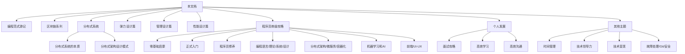
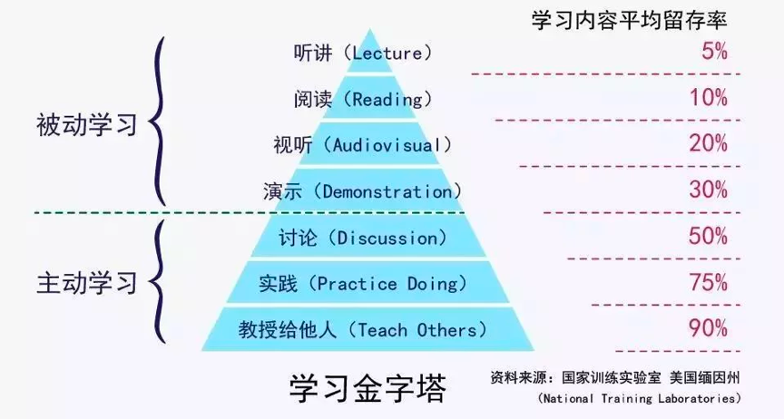
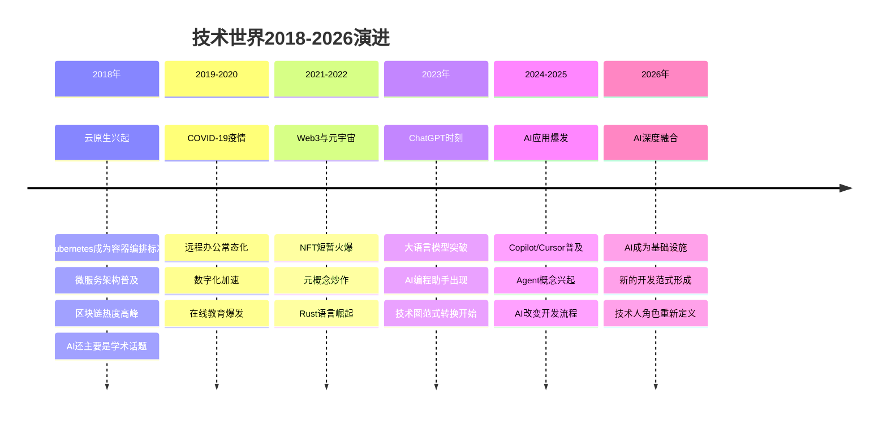
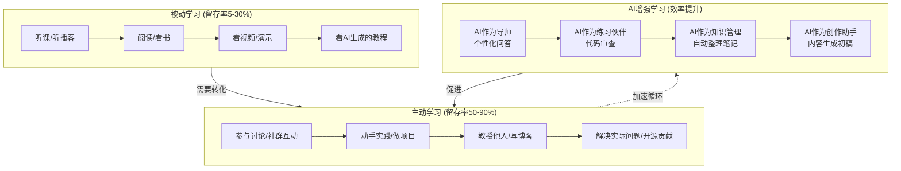
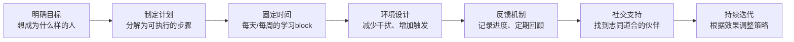

# 结束语 | 业精于勤，行成于思 [2026重制版]

## 核心变更说明

本文档基于2018年原版《结束语 | 业精于勤，行成于思》进行2026年重制。核心更新包括：

- **2018-2026技术世界变迁回顾**：从云计算到AI时代的技术演进
- **对读者的新寄语**：在AI时代如何保持学习热情和成长动力
- **终身学习理念的强化**：结合AI工具的学习方法升级
- **社区与分享的价值再发现**：开源社区、技术社群的新形态
- **ARTS任务的演进与反思**：8年实践后的经验总结

---

## 内容回顾：原版结束语的核心信息

### 专栏创作始末

2017年10月10日，本文档上线，它是极客时间平台上最早交付的几门课程之一。在一年内，我们更新了110多讲内容。

老实说，在本文档刚开始的时候，我对于这些内容要写点什么是完全没有什么清晰的想法。一方面，我从来没有干过这样的事，这么高频度发表文章的玩法，在一开始来说我其实是相当懵逼的。另一方面，我内心对于收费这个事是很有压力的。

所以，在不知道要写什么专题的情况下，只能起个"本文档"这么烂的名字。这也是为什么一开始专栏的文章比较散乱，也没什么主线的原因。

### 专栏内容体系

直到后来，才逐渐形成了完整的知识体系：

这些选题基本上都是我给其它公司做的咨询的内容，或是我到一些公司里分享中的内容，其中的很多内容都是对公司收费的。除此之外，还有很多比较私房的经验，只会跟我关系比较近、或是我觉得值得帮的人才会分享。

### 创作过程中的收获

在写这些内容的过程中：

1. **挑战了自己**：我发现居然可以这么高产，有这么多的东西可以写下来
2. **系统梳理了思考**：创业过程中见的人接收到的信息是以前打工时代的一百倍以上，正好用这个机会把思考和想法总结下来
3. **个人成长大于收入**：这种成长的感觉是多少钱都换不来的

### 核心观点：学习没有捷径

我在专栏中不断强调：**学习是没有捷径的，是逆人性的，你需要长期地付出时间和精力**。

如果一个人订一个收费专栏就可以成为高手，那么这种"高手"早就被"北大青鸟"这样的培训公司"量产"了。

#### 学习金字塔（原版）

这个世界上的学习只有两种：
- **被动学习**：听课、看书、看视频、看别人的演讲——知识留存度最多30%
- **主动学习**：与别人讨论、实践、传授给别人——可以掌握知识的50%到90%以上

### ARTS任务：实践导向的学习方法

我在读者群中推荐了ARTS任务：
- **A**lgorithm：每周至少做一个LeetCode算法题
- **R**eview：阅读并点评至少一篇英文技术文章
- **T**ip：学习至少一个技术技巧
- **S**hare：分享一篇有观点和思考的技术文章

然而现实是残酷的：建立了近500人的读者微信群，进群的人需要承诺做ARTS。但敢进群的人已经很少了，进来的过了三个月后还在坚持做的，只有个位数的人。

### 关于"硬核知识"

有很多知识我把其称作为"硬核知识"，这类的知识就像硬核桃一样，相当难啃。就像那些数学公式、计算机底层原理、复杂的网络协议和操作系统的调度等等，这些知识你除了死磕之外，没有其它的办法。

不要说某某技术因为太复杂了所以是"反人类的"，那些"硬核技术"不是反人类的，是**"反低能人类"的**。

---

## 2026 视角：八年后的回望与前瞻

### 一、2018-2026 技术世界的变化

#### 1. 从"学不完"到"学什么"

2018年时，程序员的焦虑是"技术太多学不完"——前端框架层出不穷，后端技术日新月异，DevOps工具眼花缭乱。

2026年，焦虑变成了"AI会不会替代我"——代码生成、自动化测试、智能运维，AI正在蚕食传统程序员的领地。

**但核心问题没变**：如何保持不可替代性？

2018年的答案：深入理解原理，掌握"硬核知识"
2026年的答案：**在AI时代，人类的优势在于判断力、创造力和系统思维**

#### 2. 知识获取方式的变革

| 维度 | 2018年 | 2026年 |
|------|--------|--------|
| 学习资源 | 博客、书籍、视频课程 | + AI对话式学习、个性化路径 |
| 问题解决 | Google搜索、Stack Overflow | + AI直接回答、代码生成 |
| 代码编写 | 手写为主 | AI辅助生成占比50%+ |
| 技术选型 | 经验+社区讨论 | + AI对比分析 |
| 代码审查 | 人工Code Review | + AI静态分析+安全扫描 |

**关键洞察**：工具变了，但学习的本质没变。AI可以提高效率，但不能替代深度理解和实践。

#### 3. "硬核知识"的新定义

2018年我说："硬核知识就像硬核桃一样，相当难啃"——数学公式、计算机底层原理、网络协议、操作系统调度。

2026年，我想补充新的"硬核知识"：

**传统硬核知识（依然重要）**：
- 数据结构与算法
- 操作系统原理
- 计算机网络
- 编译原理
- 数据库 internals

**新增硬核知识**：
- **AI/ML基础**：机器学习原理、神经网络、Transformer架构
- **系统工程**：分布式系统设计、高可用架构、可观测性
- **领域知识**：业务领域建模、行业know-how
- **软技能升级**：跨团队协作、技术决策、影响力建设
- **伦理与责任**：AI伦理、数据隐私、算法公平性

### 二、对读者的寄语（2026版）

#### 1. 关于学习的真相

原文中我说："你真的千万不要以为你订几个专栏，买几本书，听高手讲几次课，你就可以变成高手了。"

2026年，这句话变成了：**"你真的千万不要以为有了AI，你就可以不学习了。"**

AI是一个强大的工具，但：
- AI可以帮你写代码，但不能帮你理解为什么这样写
- AI可以帮你查bug，但不能帮你培养调试思维
- AI可以帮你做方案，但不能帮你做技术决策
- AI可以帮你学知识，但不能替你建立知识体系

**学习的本质没有变**：输入→内化→输出→反馈→迭代

#### 2. 关于"被App消费"

原文中我说："现在的人都被微博、微信、知乎、今日头条、抖音等这些App消费着……人被App消费"。

2026年，这个问题更严重了：

- **短视频算法**：15秒一个刺激，注意力碎片化
- **信息茧房**：只看到你想看到的东西
- **AI生成内容泛滥**：真假难辨，质量参差不齐
- **FOMO焦虑**：总觉得错过了什么重要信息

**应对策略**：
1. **主动选择信息源**：而不是被动接受推送
2. **深度阅读习惯**：每天留出不受打扰的时间读长文
3. **定期数字 detox**：每周有一天远离社交媒体
4. **创造而非消费**：多产出内容，少刷屏

#### 3. 关于坚持的力量

原文中提到ARTS任务的执行情况：500人的群，三个月后坚持的只有个位数。

这不是失败，这是**真实的人性**。

2026年，我想说：

**坚持本身就是稀缺能力**。在一个即时满足的时代，能够延迟满足、长期投入的人越来越少，这也意味着坚持的价值越来越大。

如果你能做到：
- 每周坚持做一个算法题（哪怕用AI辅助）
- 每周坚持读一篇英文技术文章
- 每周坚持总结一个技术Tip
- 每周坚持分享一次你的思考

坚持一年，你就会超过90%的人。坚持三年，你会进入前1%。坚持十年，你会成为真正的专家。

**不需要完美，只需要持续。**

### 三、终身学习的理念强化

#### 1. 学习金字塔的2026版本

#### 2. AI时代的有效学习方法

**原则一：AI是杠杆，不是替代**

正确用法：
- 用AI解释你不理解的概念
- 用AI生成练习题来检验掌握程度
- 用AI帮你找到学习资源和路径
- 用AI辅助代码编写，但你必须理解每一行

错误用法：
- 直接复制AI答案交差
- 让AI替你思考
- 完全依赖AI而不建立自己的知识体系

**原则二：费曼技巧依然有效**

2026版的费曼技巧：
1. 选择一个概念
2. 尝试用简单语言向AI解释它
3. AI会指出你的漏洞和不准确之处
4. 回去补充学习，然后再次解释
5. 直到你能让"小白"（或AI模拟的小白）听懂

**原则三：项目驱动学习不变**

最好的学习方式依然是做项目。2026年的变化是：
- 项目可以更复杂（因为有AI辅助）
- 可以更快地验证想法（因为AI降低原型成本）
- 但核心技能要求更高（因为你需要驾驭AI）

#### 3. 建立你的学习系统

不要依赖意志力，要建立系统：

### 四、社区与分享的价值再发现

#### 1. 为什么分享如此重要？

原文中我说："我希望我的专栏没有给你带来那种速成的幻觉，而是让你有了可以付出汗水的理由和信心。"

2026年，我想补充分享的多重价值：

**对他人**：
- 帮助别人少走弯路
- 建立正向的技术文化
- 促进知识传播和创新

**对自己**：
- **输出倒逼输入**：为了写清楚，你必须先理解透彻
- **建立个人品牌**：让你的专业能力被看见
- **积累社会资本**：认识更多优秀的人
- **获得反馈**：别人的问题和质疑会让你思考更深

**对社区**：
- 形成良性循环的知识生态
- 提升整个行业的水平
- 吸引更多人加入技术领域

#### 2. 分享形式的新可能

2018年的分享方式：博客文章、技术演讲、开源项目

2026年的分享方式（更丰富）：

| 形式 | 特点 | 适合场景 |
|------|------|----------|
| 长文/博客 | 深度、系统 | 知识总结、经验沉淀 |
| 短视频 | 直观、传播快 | 技术tip、快速演示 |
| 播客 | 亲切、伴随性强 | 行业观察、职业发展 |
| 开源项目 | 实践、可复用 | 工具、框架、示例 |
| 直播/录屏 | 交互、实时 | 教程、答疑、code review |
| 社区回答 | 及时、互助 | Stack Overflow、论坛 |
| AI训练数据 | 隐形但重要 | 你的高质量内容可能训练未来的AI |

**建议**：选择1-2种你擅长的形式深耕，而不是什么都做。

#### 3. 技术社群的新形态

2018年：微信群、QQ群、GitHub、Stack Overflow、技术论坛

2026年：
- **Discord/Slack**：实时交流的社区平台
- **Twitter/X技术圈**：短平快的观点分享
- **YouTube/B站**：视频教程和直播
- **Mastodon/Bluesky**：去中心化社交
- **DAO/Web3社区**：新型的组织形式（虽然泡沫破裂了，但有些理念留存）
- **AI驱动的学习社群**：AI辅助匹配学习伙伴、推荐资源

**不变的真理**：**人与人的连接是最有价值的**。无论技术如何变化，找到一个能互相激励、共同成长的社群，是持续进步的重要保障。

### 五、ARTS任务的八年反思

#### 当年的理想 vs 现实的骨感

2018年推出ARTS任务时，我是理想的：
- 每周一个Algorithm
- 每周Review一篇英文文章
- 每周学一个Tip
- 每周Share一次

现实是：500人群，三个月后坚持的个位数。

#### 八年后的反思

**为什么这么难坚持？**

1. **门槛其实不低**：对于工作忙的人来说，每周完成四项任务确实有挑战
2. **缺乏即时反馈**：短期看不到明显收益，容易放弃
3. **孤独感**：一个人坚持很难，群体动力不足
4. **生活变故**：换工作、家庭事务等都可能打断节奏

**但也看到了成功案例**：

那些坚持下来的人，确实获得了超预期的成长：
- 有人从普通工程师成长为Tech Lead
- 有人通过Share建立了个人品牌，获得了更好的机会
- 有人通过Review跟踪到了前沿技术，提前布局
- 有人通过Algorithm训练保持了扎实的编程功底

#### 2026版ARTS建议

如果你想开始一个类似的学习计划，我的建议是：

**1. 从小做起**
- 不要一上来就四项全做
- 先从一项开始，比如每周一道算法题
- 养成习惯后再逐步增加

**2. 降低门槛**
- Algorithm：可以用Easy难度开始，甚至用AI辅助理解
- Review：可以先读中文翻译，再尝试英文原文
- Tip：可以很小，比如学会一个git命令的用法
- Share：可以很短，比如一条推特/朋友圈

**3. 找到同伴**
- 一个人走得快，一群人走得远
- 找2-3个志同道合的朋友互相监督
- 或者加入已有的学习小组

**4. 允许中断**
- 生活总有意外，错过一周没关系
- 关键是不要因为错过就彻底放弃
- 下周继续就好

**5. 记录进度**
- 用简单的表格或app记录
- 看着自己的积累会有成就感
- 定期回顾，感受成长

---

## 总结升华：穿越周期的智慧

### 不变的道理

回看2018年写的结束语，有些话在今天依然振聋发聩：

> "学习是没有捷径的，是逆人性的，你需要长期地付出时间和精力。"
>
> "这个世界不存在知识不够的情况……问题是，大多数人都失去了获取知识的能力。"
>
> "要学会不断地挑战自己……让自己像凤凰一样在浴火中涅槃重生！"

这些道理之所以"不变"，是因为它们触及的是**人性和认知的本质**，而这些本质不会因为技术的进步而改变。

### 变化的挑战

但同时，我们也必须承认：

1. **信息环境更复杂了**：噪音更多、真伪难辨、注意力更稀缺
2. **竞争格局变化了**：AI降低了某些技能的门槛，也提高了对另一些能力的要求
3. **职业路径多元化了**：不再只有"程序员→高级程序员→架构师→CTO"这一条路
4. **学习工具更强了**：但这也意味着对"如何使用工具"的能力要求更高

### 给2026年读者的最后建议

#### 关于技术

- **基础永远重要**：无论AI多强大，底层原理的理解让你能判断AI输出的质量
- **保持好奇心**：新技术层出不穷，保持学习的好奇心和热情
- **深度优于广度**：在一个领域做到精通，比什么都懂一点皮毛更有价值
- **动手实践**：看一百遍不如自己做一遍，这个真理永远不会过时

#### 关于成长

- **长期主义**：不要追求速成，接受成长的非线性
- **系统思维**：不要只关注单点，要理解系统和全局
- **反馈循环**：建立"学习→实践→反馈→改进"的正向循环
- **身体健康**：身体是革命的本钱，这话虽然老套但绝对正确

#### 关于人生

- **找到意义**：不只是为了赚钱或升职，找到让你热血沸腾的事情
- **平衡生活**：工作很重要，但家人、朋友、健康、爱好同样重要
- **保持善良**：技术能力强的人很多，既强又善良的人很少
- **享受过程**：结果固然重要，但过程中的成长和体验同样珍贵

### 最后的话

2018年我写道：

> "青山不改，绿水长流，祝各位成长快乐！再见！"

2026年，我想说：

**青山依旧，绿水长流，技术在变，但成长的渴望不变。**

感谢每一位读过这些内容的同学。无论你是2018年就开始的老读者，还是2026年才遇到这篇文章的新朋友，我都希望这些文字能在某个时刻给你带来启发、鼓励或力量。

学习没有捷径，但学习本身就是一个美好的旅程。享受这个过程吧，因为在AI可以帮我们做很多事情的时代，**"成为一个更好的人"这件事，依然只能靠自己。**

愿你在技术的道路上：
- **业精于勤**——持续精进，永不止步
- **行成于思**——深度思考，知行合一

我们江湖再见！

---

*本文档基于2018年原版《结束语 | 业精于勤，行成于思》重制，融入2026年AI时代的思考与洞察。原版核心思想——学习无捷径、主动学习的重要性、坚持的力量——保持不变，新增内容旨在帮助技术人在快速变化的时代中找到方向和动力。*

*特别说明：本文档截至2026年已有近120讲内容，累计服务数十万学习者。每一份收藏、每一条笔记、每一次划线，都是我们一起学习、共同成长的见证。感谢你们！*
