# 架构定义与本质 | 系统·模块·组件·框架·4R定义

## 章节导言

对于技术人员来说，"架构"是一个再常见不过的词了。我们会对新员工培训整个系统的架构，参加架构设计评审，学习业界开源系统（例如MySQL和Hadoop）的架构，研究大公司的架构实现（例如微信架构和淘宝架构）……

虽然"架构"这个词很常见，但如果深究一下，"架构"到底是指什么，大部分人就搞不清楚了。例如：

1. 微信有架构，微信的登录系统也有架构，微信的支付系统也有架构，当我们谈微信架构时，到底是在谈什么架构？
2. Linux有架构，MySQL有架构，JVM也有架构，使用Java开发、MySQL存储、跑在Linux上的业务系统也有架构，应该关注哪个架构呢？
3. 架构和框架是什么关系？有什么区别？

身为架构师，如果连架构的定义都搞不清楚，那么无论是自己设计架构、给别人讲解架构，还是学习别人的架构，都会暴露问题——要么无从下手，要么张冠李戴。比如有些同学明明在系统架构上做了不少有价值的工作，但在给晋升面试的评委讲解时，只会说"我们是微服务架构"，然后就不知道讲什么了，结果评价大打折扣。

要想准确地理解架构的定义，关键在于把三组容易混淆的概念梳理清楚：**系统与子系统、模块与组件、框架与架构**。

**核心问题**：
1. 系统、子系统、模块、组件各自的定义和区别？
2. 框架和架构的关系与区别？
3. 4R架构定义如何精确描述架构？
4. 不同视角下的架构为何看起来不同？

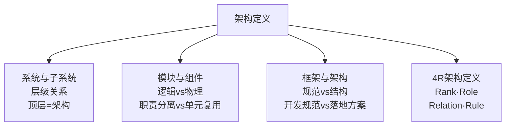

---

## 一、系统与子系统

### 1.1 系统的定义

维基百科对"系统"的定义：

> 系统泛指由一群有关联的个体组成，根据某种规则运作，能完成个别元件不能单独完成的工作的群体。它的意思是"总体""整体"或"联盟"。

提炼三个关键要素：

| 要素 | 含义 | 示例 |
|------|------|------|
| **关联** | 系统由有关联的个体组成，无关联的个体堆在一起不是系统 | 发动机+PC放在一起不是系统；发动机+底盘+轮胎+车架=汽车 |
| **规则** | 个体按指定规则运作，规则规定分工和协作方式 | 汽车发动机产生动力→变速器→传动轴→车轮→驱动前进 |
| **能力** | 系统能力≠个体能力之和，而是产生新的能力 | 汽车能载重前进，但发动机、变速器、车轮本身都不具备此能力 |

**核心洞察**：系统能力是"涌现"（Emergence）——整体大于部分之和。这正是架构设计要追求的目标：通过合理的组合产生新的能力。

### 1.2 子系统的定义

> 子系统也是由一群有关联的个体所组成的系统，多半会是更大系统中的一部分。

子系统的定义和系统定义**完全一样**，只是观察的角度有差异——一个系统可能是另外一个更大系统的子系统。

### 1.3 系统的层级结构

以微信为例：

```
微信（L0）
├── 聊天子系统（L1）
│   ├── 消息收发（L2）
│   ├── 消息存储（L2）
│   └── 消息同步（L2）
├── 登录子系统（L1）
├── 支付子系统（L1）
└── 朋友圈子系统（L1）
    ├── 动态（L2）
    ├── 评论（L2）
    │   ├── 防刷子系统（L3）
    │   ├── 审核子系统（L3）
    │   ├── 发布子系统（L3）
    │   └── 存储子系统（L3）
    └── 点赞（L2）
```

**关键结论**：一个系统的架构，只包括**顶层**这一个层级的架构，而不包括下属子系统层级的架构。所以"微信架构"就是指微信系统L0层级的架构。当然，微信的子系统（如支付系统）也有它自己的架构，同样只包括其顶层。

> **深度注记**：架构的"顶层"原则在实践中极易被违反——很多架构图把L0到L3的内容全部糅杂在一起，导致架构图复杂难懂。正确做法是"自顶向下，逐步细化"，一般建议不超过5层（L0~L4）。

---

## 二、模块与组件

### 2.1 定义

维基百科定义：

> 软件模块（Module）是一套一致而互相有紧密关连的软件组织。它分别包含了程序和数据结构两部分。现代软件开发往往利用模块作为合成的单位。模块的接口表达了由该模块提供的功能和调用它时所需的元素。

> 软件组件（Component）定义为自包含的、可编程的、可重用的、与语言无关的软件单元，软件组件可以很容易被用于组装应用程序中。

这两个定义看起来很相似，容易混淆。根本原因是：**模块和组件都是系统的组成部分，只是从不同的角度拆分系统而已**。

### 2.2 核心区别

| 维度 | 模块（Module） | 组件（Component） |
|------|---------------|------------------|
| **拆分角度** | 业务逻辑角度 | 物理部署角度 |
| **划分目的** | 职责分离 | 单元复用 |
| **特征** | 逻辑内聚、接口清晰 | 自包含、可替换、可重用 |
| **英文联想** | — | Component也可译为"零件"——物理概念 |

### 2.3 学生管理系统示例

以一个学生信息管理系统为例：

**从逻辑角度拆分（模块）**：
- 登录注册模块
- 个人信息模块
- 个人成绩模块

**从物理角度拆分（组件）**：
- Nginx（反向代理）
- Web服务器（应用服务器）
- MySQL（数据库）

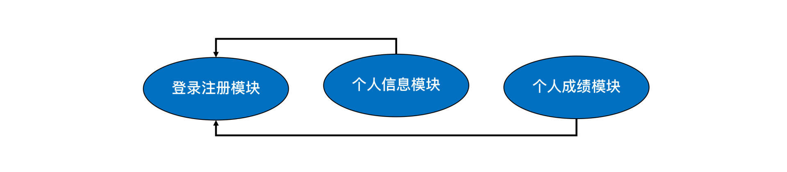

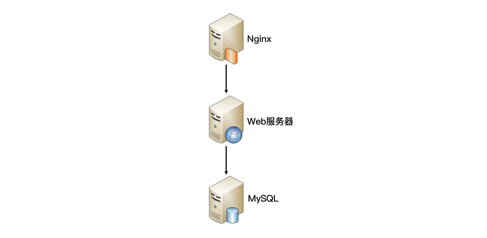

**架构师的关注点**：作为业务系统的架构师，首先需要思考怎么从业务逻辑角度把系统拆分成一个个模块**角色**，其次需要思考怎么从物理部署角度把系统拆分成组件**角色**（例如选择MySQL作为存储系统）。但对于MySQL内部的体系架构（Parser、Optimizer、Caches&Buffers、Storage Engines等），不需要在业务系统架构中展现。

---

## 三、框架与架构

### 3.1 框架的定义

> 软件框架（Software framework）通常指的是为了实现某个业界标准或完成特定基本任务的软件组件规范，也指为了实现某个软件组件规范时，提供规范所要求之基础功能的软件产品。

提炼两个关键点：

1. **框架是组件规范**：MVC就是一种最常见的开发规范，类似的还有MVP、MVVM、Jakarta EE（原 J2EE）等
2. **框架提供基础功能的产品**：Spring MVC是MVC的开发框架，除了满足MVC规范，还提供注解（@Controller等）、Spring Security、Spring JPA等基础功能

### 3.2 架构的定义

> 软件架构指软件系统的"基础结构"，创造这些基础结构的准则，以及对这些结构的描述。

### 3.3 框架 vs 架构

| 维度 | 框架（Framework） | 架构（Architecture） |
|------|------------------|---------------------|
| **关注点** | 规范（Norm） | 结构（Structure） |
| **英文** | Framework | Architecture |
| **含义** | 一整套开发规范 | 某套规范下的具体落地方案 |
| **包含** | 规范 + 基础功能产品 | 模块组合关系 + 协作运作规则 |

Spring MVC的英文文档标题就是"Web MVC framework"——它是框架，不是架构。

### 3.4 为何"XX架构"说法有时也对？

实际工作中常听到这些说法：
- "我们的系统是MVC架构"
- "我们需要将Android App重构为MVP架构"
- "XX系统是基于Spring MVC框架开发，标准的MVC架构"

这些说法**都是对的**。根本原因在于：架构定义中的"基础结构"并没有明确说是从什么角度来分解的。采用不同的角度或维度，可以将系统划分为不同的结构。

以学生管理系统为例，三种视角下的架构：

| 视角 | 架构描述 |
|------|---------|
| **业务逻辑角度** | 登录注册模块 + 个人信息模块 + 个人成绩模块 |
| **物理部署角度** | Nginx + Web服务器 + MySQL |
| **开发规范角度** | MVC架构（Model + View + Controller） |

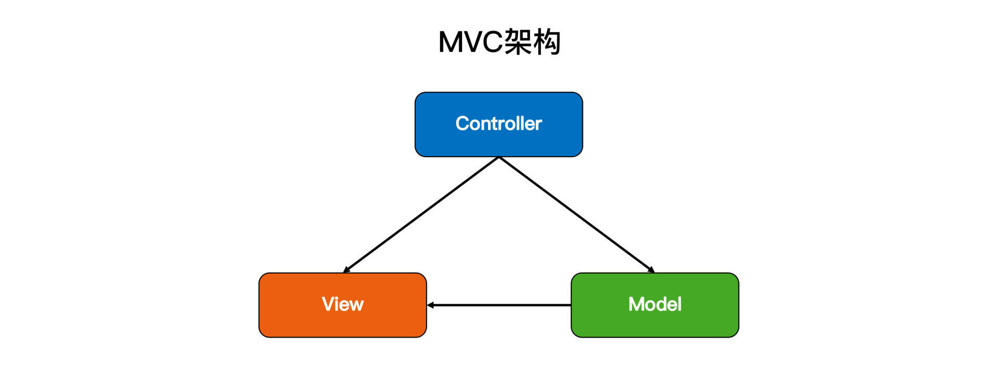

这也是IBM的RUP将软件架构视图分为著名的**"4+1视图"**的原因——不同视角看到不同的架构，都是正确的。

### 3.5 4+1视图模型

| 视图 | 关注点 | 利益相关者 |
|------|--------|-----------|
| **逻辑视图** | 功能需求、类与对象结构 | 最终用户 |
| **进程视图** | 并发与同步、运行时行为 | 系统集成者 |
| **开发视图** | 代码组织、模块划分 | 程序员 |
| **物理视图** | 部署拓扑、节点分配 | 系统运维 |
| **场景视图(+1)** | 核心用例、系统交互 | 所有利益相关者 |

---

## 四、4R架构定义

### 4.1 定义

> 软件架构指软件系统的顶层（Rank）结构，它定义了系统由哪些角色（Role）组成，角色之间的关系（Relation）和运作规则（Rule）。

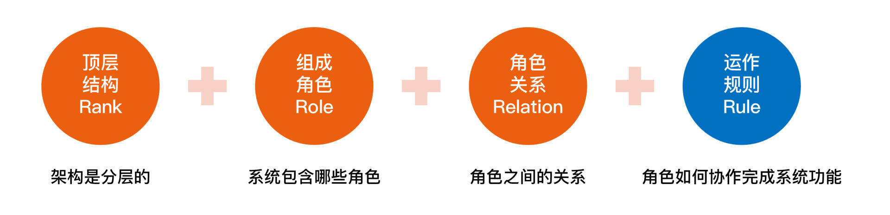

### 4.2 四个R详解

#### Rank——顶层层级

软件架构是分层的，对应"系统"和"子系统"的分层关系。通常只需要关注某一层的架构，最多展示相邻两层的架构。

以微信为例：

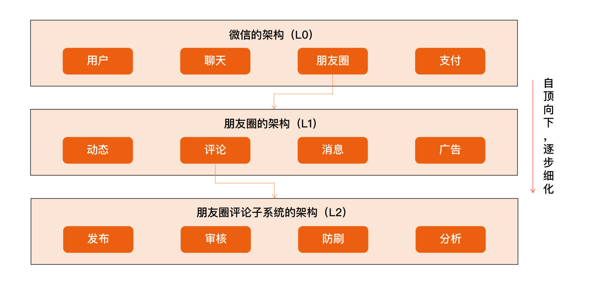

> L0\L1\L2指层级，一个L0往下可以分解多个L1，一个L1可以往下分解多个L2，以此类推，一般建议不超过5层（L0~L4）。

#### Role——角色

软件系统包含哪些角色，每个角色负责系统的一部分功能。架构设计最重要的工作之一就是将系统拆分为多个角色。最常见的微服务拆分其实就是将整体复杂的业务系统按照业务领域的方式，拆分为多个微服务，每个微服务就是系统的一个角色。

#### Relation——关系

软件系统角色之间的关系，对应到架构图中就是连接线。角色之间的关系不能乱连，任何关系最后都需要代码来实现，包括：

| 关系要素 | 示例 |
|---------|------|
| **连接方式** | HTTP、TCP、UDP、串口等 |
| **数据协议** | JSON、XML、二进制等 |
| **具体接口** | 接口路径、参数、返回值 |

#### Rule——规则

软件系统角色之间如何协作来完成系统功能。系统能力不是个体能力之和，而是产生了新的能力——Rule描述的就是这个新能力如何由哪些角色协作完成。在架构设计时，核心的业务场景都需要设计Rule。

### 4.3 4R的表示方式

| R | 表示方式 | 说明 |
|---|---------|------|
| Rank | 架构图的层级 | L0/L1/L2... |
| Role | 架构图的节点 | 每个节点代表一个角色 |
| Relation | 架构图的连接线 | 节点间的连线 |
| Rule | 系统序列图（SSD） | 角色间的交互时序 |

### 4.4 支付系统示例

支付系统架构图：

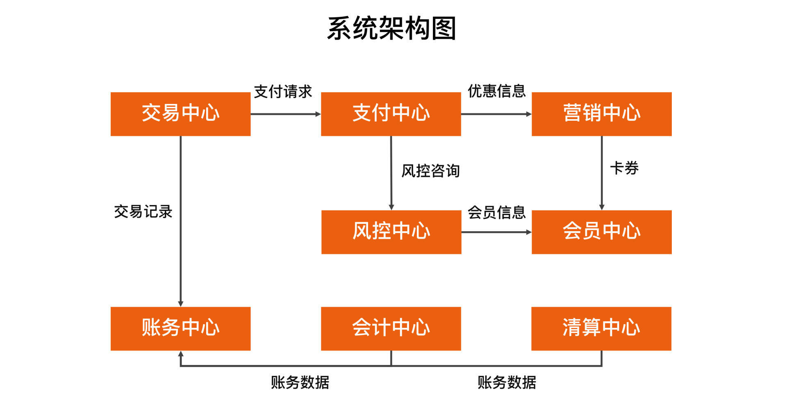

"扫码支付"核心场景的系统序列图：

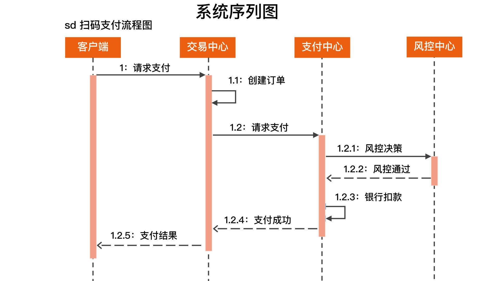

---

## 五、架构的宏观视角：从地基到上层建筑

### 5.1 冯·诺依曼体系结构

所有智能电子设备（手机、汽车等）都可以统一看作由"**中央处理器 + 存储 + 一系列的输入输出设备**"构成。

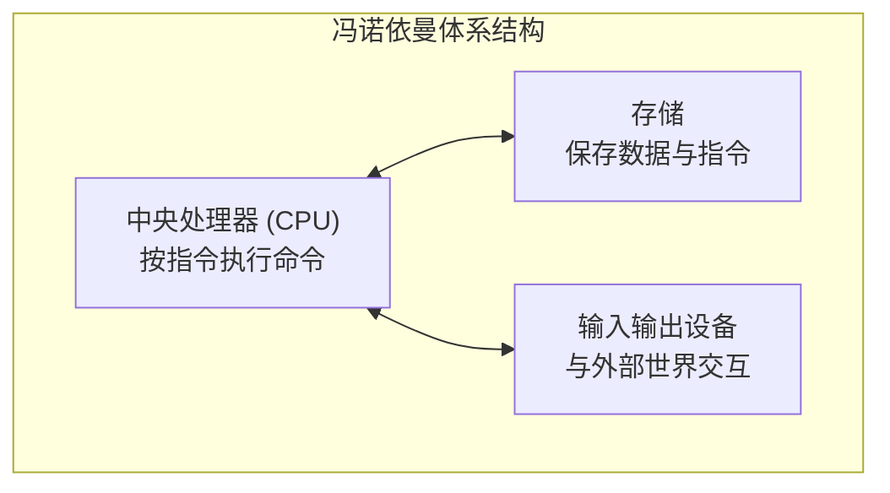

电脑能完成复杂工作依赖两点：

1. **可编程性**：CPU指令集虽然有限（计算类、I/O类、跳转类），但指令序列（程序）不固定，由软件决定，可能性无穷
2. **开放设计的外部设备支持**：CPU不理解设备能力，只和设备交换数据；设备厂商提供硬件+配套软件

> 1945年6月，冯·诺依曼以"关于EDVAC的报告草案"为题起草了101页的总结报告，定义了"冯·诺依曼体系结构"，他因此被称为计算机之父。

### 5.2 编程语言与编译器

直接用机器指令编写软件太累，且像天书一样没人看得懂。**编程语言 + 编译器**的出现，将人类容易理解的语言转换为机器指令，大大解放了编写软件的门槛。

### 5.3 操作系统

多个软件在同一台电脑上共处面临问题：存储地址冲突、设备共享冲突、恶意软件等。**操作系统**解决两大问题：

| 职责 | 具体内容 |
|------|---------|
| **软件治理** | 安全保护（免受恶意软件侵害）+ 协作秩序（存储隔离、设备共享排队） |
| **基础编程接口** | 简化开发 + 多任务环境（窗口系统、焦点窗口管理、文件系统抽象） |

### 5.4 完整的程序架构

**服务端应用程序完整架构**：

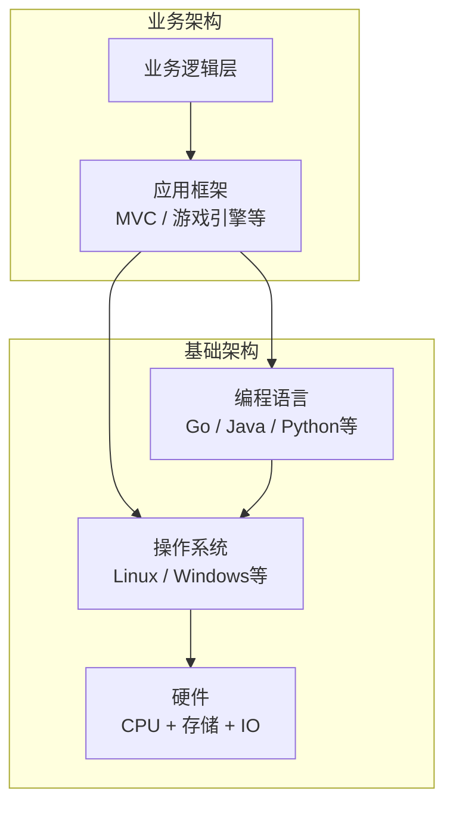

**客户端应用程序完整架构**——面临多样性挑战（操作系统多样性 + 设备种类多样性），需要浏览器或跨平台框架来消除差异：

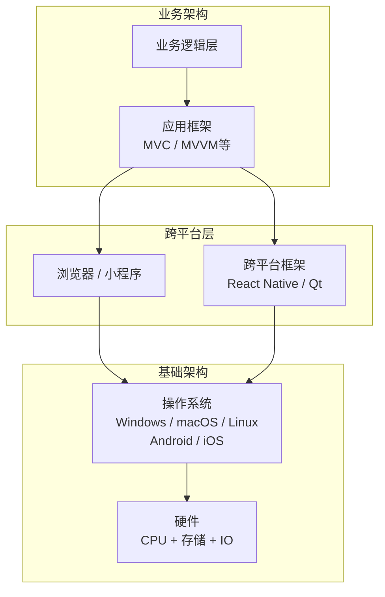

### 5.5 浏览器：OS之上的OS

浏览器的地位非常特殊——可以看作操作系统之上的操作系统。一旦某种浏览器流行起来，开发人员都在浏览器上做应用，必然导致底层操作系统管道化，这是操作系统厂商所不愿意看到的。

而如果浏览器用户量较少，消除不同底层操作系统差异的价值就不存在，开发人员也就不乐意在上面开发应用。这就是浏览器之战的本质。

有趣的是，移动浏览器的战场似乎是从中国开始打起的——微信引发的小程序之战，本质上就是一场浏览器战争。

JavaScript因为指令更高阶，程序尺寸比机器码有优势。但JavaScript是文本指令，表达效率比机器码低。近年来WebAssembly技术开始蓬勃发展，JavaScript作为浏览器机器码的地位会被逐步改变，前端开发将面临更多可能性。

### 5.6 架构师的决策全景

架构师不仅仅想清楚业务怎么分解，整个应用从底到顶每一层都需要决策：


> **深度注记**：架构能力的提升，本质上是对知识脉络的反复梳理与融会贯通的过程。对基础架构了解越全面，做业务架构设计就越从容。架构师不是全栈工程师，而是能系统性地组织知识的人。

---

## 六、架构师的三层境界

许式伟将软件工程师分为三个层次：

| 层次 | 核心能力 | 关注点 |
|------|---------|--------|
| **搬砖师** | 让代码跑起来 | 功能实现 |
| **工程师** | 代码质量：可读性/可扩展性/可测试性/可复用性 | 工程质量 |
| **架构师** | 掌控全局，对执行结果负责 | 系统整体 |

**架构师≠全栈工程师**。全栈是"什么都会做"，架构师是"能系统性地组织知识，做出合理决策"。核心差异在于**判断力和权衡能力**——不是做得更多，而是知道什么该做什么不该做。

架构学习的三大难点：
1. **架构思维**不同于编程思维——前者是判断与权衡，后者是逻辑与实现
2. **没有系统性的训练机制**——架构能力主要靠实战积累
3. **存在大量误区**——需要天才、必须创新、必须高大上、必须高一切

---

## 总结

| 核心要点 | 关键结论 |
|---------|---------|
| 系统定义 | 关联+规则+能力（涌现）；系统能力≠个体能力之和 |
| 系统与子系统 | 定义相同，观察角度不同；架构只看顶层 |
| 模块vs组件 | 逻辑拆分vs物理拆分；职责分离vs单元复用 |
| 框架vs架构 | 规范vs结构；框架是开发规范，架构是规范下的落地方案 |
| 4R架构 | Rank(层级)+Role(角色)+Relation(关系)+Rule(规则) |
| 4+1视图 | 逻辑/进程/开发/物理+场景；不同视角看到不同架构 |
| 冯·诺依曼体系 | CPU+存储+IO；可编程性+开放外部设备=无穷能力 |
| 操作系统 | 软件治理（安全+协作）+ 基础编程接口（简化开发+多任务） |
| 架构师决策全景 | 硬件→OS→语言→基础软件→框架→业务架构，每层都需决策 |
| 架构师vs全栈 | 掌控全局≠什么都会；核心差异是判断力和权衡能力 |

**思考题**：你原来理解的架构是如何定义的？对比4R架构定义，差异在哪里？

**关联阅读**：
- [架构设计历史与心法](02-架构设计历史与心法.md)
- [架构设计目的与评判](04-架构设计目的与评判.md)

---

> **🔍 延伸视角**（许式伟）
>
> 华仔从概念辨析出发，精确定义了架构的4R模型。许式伟从宏观视角补充了架构的"地基"——冯·诺依曼体系结构、操作系统、编程语言这些基础架构，是业务架构的根基。
>
> **1. 4R定义与"抽象·分解·组合"心法的对应**：Rank是抽象（确定关注层级），Role是分解（拆分角色），Relation和Rule是组合（定义协作方式）。4R不是凭空定义，而是架构心法的工程化表达。
>
> **2. "架构只看顶层"与"分层抽象"**：华仔强调架构只包括顶层，许式伟强调"好的抽象"要"最小化、正交、稳定、可组合"——只看顶层就是最小化抽象，避免信息过载。
>
> **3. 架构师决策全景的实践意义**：华仔的4R聚焦"怎么描述架构"，许式伟的决策全景聚焦"架构师要做什么决策"——从硬件到业务，每一层都有选型决策。两者结合：4R描述"架构长什么样"，决策全景描述"架构怎么一步步做出来"。
>
> **4. 基础架构是业务架构的根基**：许式伟强调"你对所依赖的基础架构了解得越全面，做业务架构设计就会越发从容"。冯·诺依曼体系是所有软件的地基，操作系统和编程语言是第一层抽象，基础软件（Linux/Nginx/MySQL）是第二层抽象，应用框架是第三层抽象，业务架构在最上层。每一层抽象都让上层关注点更收敛，开发效率更高。
>
> **融合洞见**：架构定义的完整理解需要"概念+视角+过程"三维度——4R定义（概念），4+1视图（视角），决策全景（过程）。华仔提供了概念和视角，许式伟补充了过程和地基。架构师既要知道"架构是什么"，也要知道"架构站在什么基础上"，更要知道"架构怎么做出来"。
