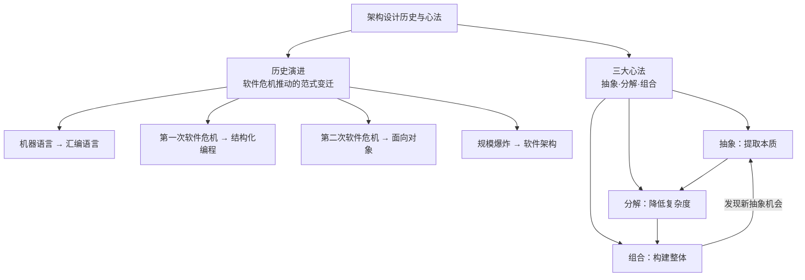
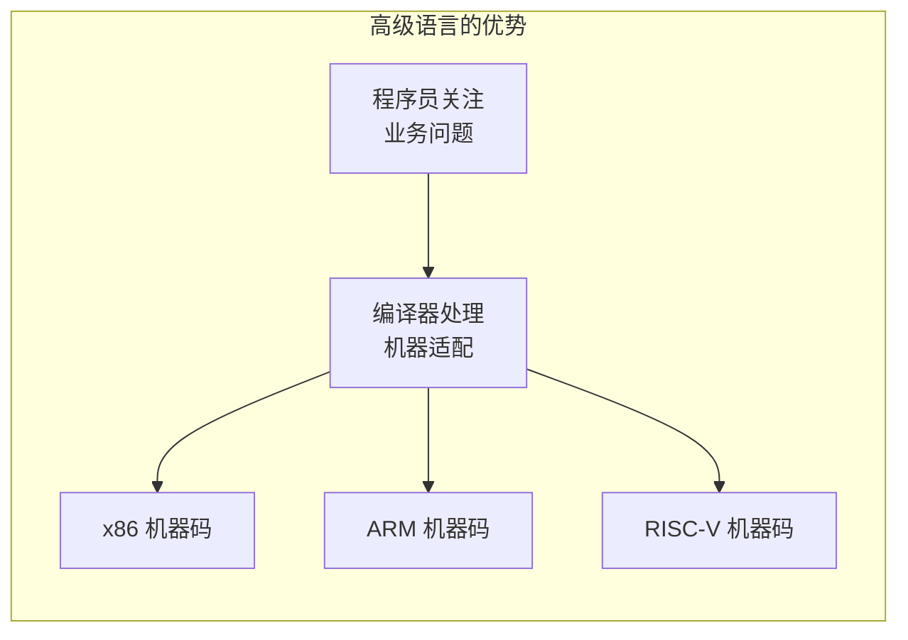
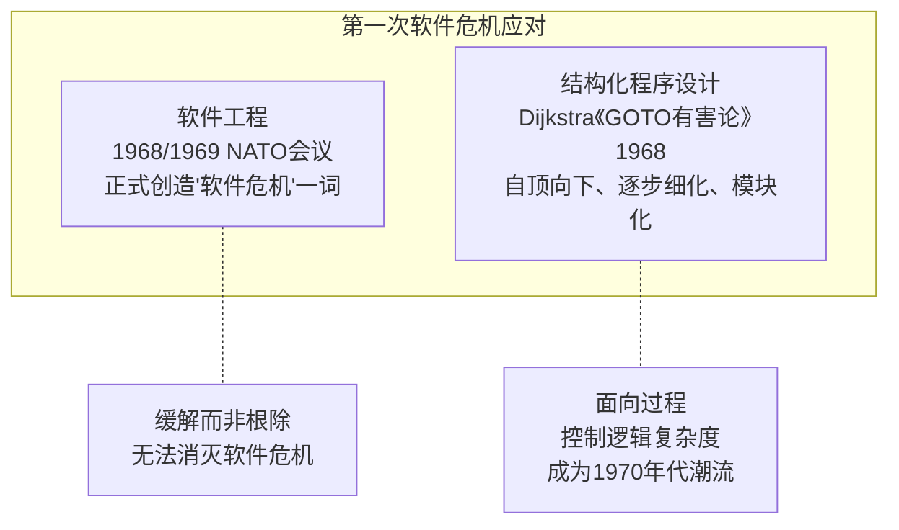
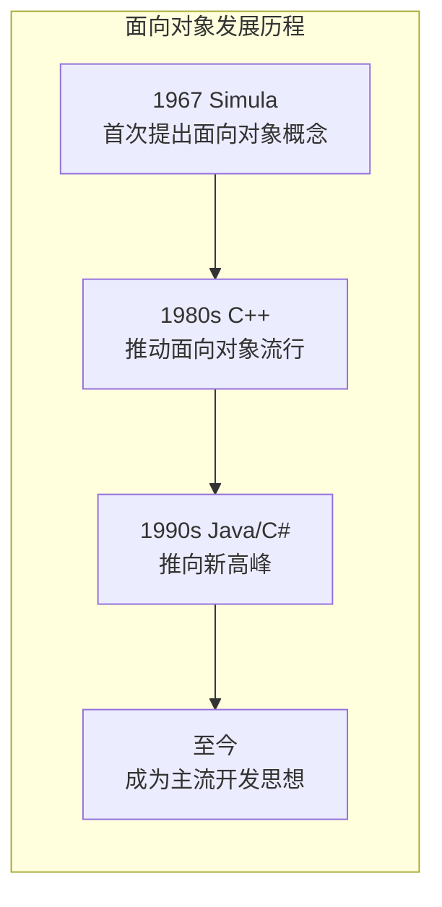
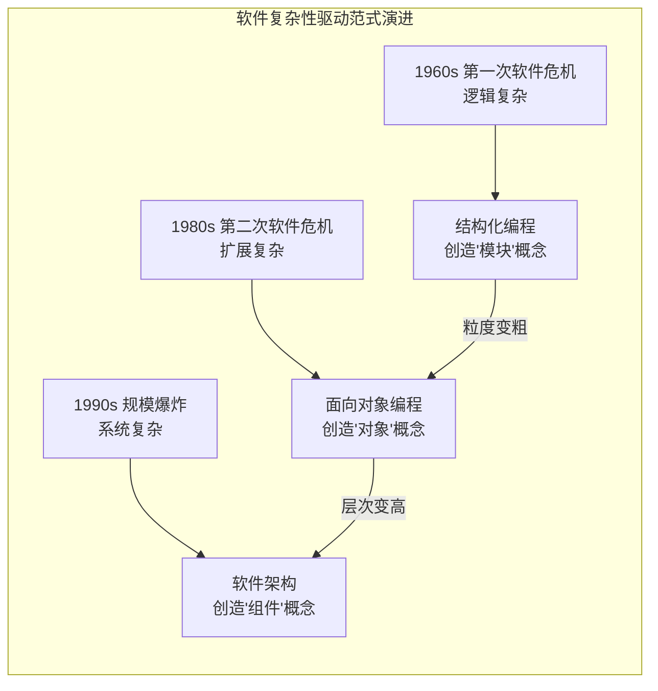

# 架构设计历史与心法 | 从软件危机到抽象·分解·组合

## 章节导言

理解一个事物的本质，最好的方式就是追寻它出现的历史背景和推动因素。软件架构并非凭空诞生——它是在两次软件危机的逼迫下，经历了从机器语言到高级语言、从结构化编程到面向对象的演进后，自然而然出现的设计范式。

与此同时，架构设计虽然千变万化，其核心方法论却可以归结为三个递进而循环的动作：**抽象、分解、组合**。理解历史让我们知道"为什么需要架构"，掌握心法让我们知道"怎么做架构"。

**核心问题**：
1. 软件架构出现的历史必然性是什么？它与前两次软件危机有何关联？
2. 为何结构化编程、面向对象、软件工程都不是银弹？
3. 架构设计的三大心法——抽象、分解、组合——如何循环驱动架构演进？



---

## 一、软件开发的演进历史

### 1.1 机器语言（1940年代之前）

最早的软件开发使用的是**机器语言**，直接使用二进制码0和1来表示机器可以识别的指令和数据。例如，在8086机器上完成"s=768+12288-1280"的数学运算，机器码如下：

```
101110000000000000000011
000001010000000000110000
001011010000000000000101
```

不用多说，不管是当时的程序员，还是现在的程序员，第一眼看到这样一串东西时，肯定是一头雾水，因为这实在是太难看懂了。这还只是一行运算，如果要输出一个"hello world"，面对几十上百行这样的0/1串，眼睛都要花了！

看都没法看，更何况去写这样的程序。如果不小心哪个地方敲错了，将1敲成了0，例如：

```
101100000000000000000011
000001010000000000110000
001011000000000000000101
```

如果要找出这个程序中的错误，程序员的心里阴影面积有多大？

归纳一下，机器语言的主要问题是**三难**：**太难写、太难读、太难改**！

| 困难维度 | 具体表现 | 后果 |
|---------|---------|------|
| **太难写** | 需要记忆大量二进制指令编码，每条指令都是一串0和1 | 编程效率极低，容易出错 |
| **太难读** | 无法直观理解代码含义，需要查表对照指令集 | 代码审查和维护困难 |
| **太难改** | 一个0/1的错误就导致整个程序出错，排查难度极大 | 调试成本极高，修改风险大 |

> **深度注记**：机器语言时代，程序员必须像机器一样思考。这种"人适应机器"的模式，严重限制了软件开发的规模和效率。每一次语言演进，本质上都是在让机器更适应人的思维方式。

### 1.2 汇编语言（1940年代）

为了解决机器语言编写、阅读、修改复杂的问题，**汇编语言**应运而生。汇编语言又叫**符号语言**，用助记符代替机器指令的操作码，用地址符号（Symbol）或标号（Label）代替指令或操作数的地址。

例如，为了完成"将寄存器BX的内容送到AX中"的简单操作，汇编语言和机器语言分别如下：

```
机器语言：1000100111011000
汇编语言：mov ax,bx
```

相比机器语言来说，汇编语言就清晰得多了。mov是操作，ax和bx是寄存器代号，mov ax,bx语句基本上就是"将寄存器BX的内容送到AX"的简化版的翻译，即使不懂汇编，单纯看到这样一串语言，至少也能明白大概意思。

**但汇编语言本质上还是面向机器的**。写汇编语言需要我们精确了解计算机底层的知识，例如CPU指令、寄存器、段地址等底层的细节。这对于程序员来说同样很复杂，因为程序员需要将现实世界中的问题和需求按照机器的逻辑进行翻译。

例如，对于程序员来说，在现实世界中面对的问题是4 + 6 = ？。而要用汇编语言实现这个简单的加法运算，代码如下：

```asm
.section .data
  a: .int 4
  b: .int 6
  format: .asciz "%d\n"
.section .text
.global _start
_start:
  movl a, %edx
  addl b, %edx
  pushl %edx
  pushl $format
  call printf
  movl $0, (%esp)
  call exit
```

这还只是实现一个简单的加法运算所需要的汇编程序，可以想象一下，实现一个四则运算的程序会更加复杂，更不用说用汇编写一个操作系统了！

**汇编语言的另一个复杂之处**：不同CPU的汇编指令和结构是不同的。例如，Intel的CPU和Motorola的CPU指令不同，同样一个程序，为Intel的CPU写一次，还要为Motorola的CPU再写一次，而且指令完全不同。

| 汇编语言的问题 | 具体表现 |
|--------------|---------|
| **面向机器** | 需要了解CPU指令、寄存器、段地址等底层细节 |
| **翻译负担** | 程序员需将现实问题按机器逻辑翻译 |
| **平台相关** | 不同CPU指令不同，程序需为不同平台分别编写 |

### 1.3 高级语言（1950年代）

为了解决汇编语言的问题，计算机前辈们从20世纪50年代开始又设计了多个**高级语言**，最初的高级语言有下面几个，并且这些语言至今还在特定的领域继续使用。

| 语言 | 年份 | 全称 | 发明者 | 特点 |
|------|------|------|--------|------|
| **Fortran** | 1957 | FORmula TRANslator（公式翻译器） | 约翰·巴科斯（John Backus） | 科学计算领域 |
| **LISP** | 1958 | LISt Processor（列表处理器） | 约翰·麦卡锡（John McCarthy） | 人工智能领域 |
| **Cobol** | 1959 | Common Business Oriented Language（通用商业导向语言） | 葛丽丝·霍普（Grace Hopper） | 商业数据处理 |

为什么称这些语言为"高级语言"呢？原因在于这些语言让程序员**不需要关注机器底层的低级结构和逻辑，而只要关注具体的问题和业务即可**。

还是以4 + 6=？这个加法为例，如果用LISP语言实现，只需要简单一行代码即可：

```lisp
(+ 4 6)
```

除此以外，通过编译程序的处理，高级语言可以被编译为适合不同CPU指令的机器语言。程序员只要写一次程序，就可以在多个不同的机器上编译运行，无须根据不同的机器指令重写整个程序。



> **深度注记**：高级语言的出现是软件发展史上的第一次重大飞跃。它实现了"一次编写，多平台运行"的梦想，将程序员从机器细节中解放出来，使其能够专注于问题本身。这种"关注点分离"的思想，后来成为架构设计的核心理念之一。

---

## 二、两次软件危机与范式变迁

### 2.1 第一次软件危机与结构化编程（1960s-1970s）

高级语言的出现，解放了程序员，但好景不长。随着软件的规模和复杂度的大大增加，20世纪60年代中期开始爆发了**第一次软件危机**，典型表现有软件质量低下、项目无法如期完成、项目严重超支等，因为软件而导致的重大事故时有发生。

**典型案例：水手一号火箭发射失败**

1962年美国水手一号（Mariner 1）火箭发射失败事故，就是因为一行FORTRAN代码错误导致的。这是软件危机最直观的体现——一行代码的错误，可能导致数千万美元的损失。

**最著名的案例：IBM System/360操作系统开发**

软件危机最典型的例子莫过于IBM的System/360的操作系统开发。佛瑞德·布鲁克斯（Frederick P. Brooks, Jr.）作为项目主管，率领2000多个程序员夜以继日地工作，共计花费了5000人一年的工作量，写出将近100万行的源码，总共投入5亿美元，是美国的"曼哈顿"原子弹计划投入的1/4。

尽管投入如此巨大，但项目进度却一再延迟，软件质量也得不到保障。布鲁克斯后来基于这个项目经验而总结的《人月神话》一书，成了畅销的软件工程书籍。

| IBM System/360 项目数据 | 数值 |
|------------------------|------|
| 程序员数量 | 2000+ |
| 工作量 | 5000人年 |
| 源代码行数 | 近100万行 |
| 投入资金 | 5亿美元（曼哈顿计划的1/4） |
| 项目结果 | 进度一再延迟，质量堪忧 |

**应对方案一：软件工程**

为了解决问题，在1968、1969年连续召开两次著名的NATO会议，会议正式创造了"软件危机"（Software Crisis）一词，并提出了针对性的解决方法"软件工程"（Software Engineering）。

虽然"软件工程"提出之后也曾被视为软件领域的银弹，但后来事实证明，软件工程同样无法根除软件危机，只能在一定程度上缓解软件危机。

**应对方案二：结构化程序设计**

差不多同一时间，"结构化程序设计"作为另外一种解决软件危机的方案被提了出来。艾兹赫尔·戴克斯特拉（Edsger Dijkstra）于1968年发表了著名的《GOTO有害论》（Go To Statement Considered Harmful）论文，引起了长达数年的论战，并由此产生了**结构化程序设计方法**。同时，第一个结构化的程序语言Pascal也在此时诞生，并迅速流行起来。



**结构化程序设计的主要特点**：

抛弃goto语句，采取"自顶向下、逐步细化、模块化"的指导思想。结构化程序设计本质上还是一种面向过程的设计思想，但通过"自顶向下、逐步细化、模块化"的方法，将软件的复杂度控制在一定范围内，从而从整体上降低了软件开发的复杂度。结构化程序方法成为了20世纪70年代软件开发的潮流。

| 结构化程序设计核心思想 | 说明 |
|---------------------|------|
| **抛弃goto语句** | goto语句导致程序流程混乱，难以理解和维护 |
| **自顶向下** | 从整体到局部，先设计总体结构，再逐步细化 |
| **逐步细化** | 将大问题分解为小问题，逐层解决 |
| **模块化** | 将程序划分为独立的功能模块，降低耦合 |

### 2.2 第二次软件危机与面向对象（1980s）

结构化编程的风靡在一定程度上缓解了软件危机，然而随着硬件的快速发展，业务需求越来越复杂，以及编程应用领域越来越广泛，**第二次软件危机**很快就到来了。

**第二次软件危机的根本原因**：软件生产力远远跟不上硬件和业务的发展。

**两次软件危机的本质区别**：

| 维度 | 第一次软件危机 | 第二次软件危机 |
|------|--------------|--------------|
| **核心矛盾** | 逻辑复杂度失控 | 扩展复杂度失控 |
| **问题根源** | 软件"逻辑"变得非常复杂 | 软件"扩展"变得非常复杂 |
| **结构化编程的作用** | 能缓解逻辑复杂度 | 对业务变化带来的扩展无能为力 |
| **催生的方案** | 结构化编程 + 软件工程 | 面向对象编程 |

结构化程序设计虽然能够解决（也许用"缓解"更合适）软件逻辑的复杂性，但是对于业务变化带来的软件扩展却无能为力。软件领域迫切希望找到新的银弹来解决软件危机，在这种背景下，**面向对象的思想**开始流行起来。

**面向对象的发展历程**：

面向对象的思想并不是在第二次软件危机后才出现的，早在1967年的Simula语言中就开始提出来了，但第二次软件危机促进了面向对象的发展。**面向对象真正开始流行是在20世纪80年代，主要得益于C++的功劳，后来的Java、C#把面向对象推向了新的高峰。到现在为止，面向对象已经成为了主流的开发思想。**

虽然面向对象开始也被当作解决软件危机的银弹，但事实证明，和软件工程一样，面向对象也不是银弹，而只是一种新的软件方法而已。



### 2.3 为何没有银弹？

结构化编程、面向对象、软件工程，都曾被视为解决软件危机的银弹，但事实证明了Frederick Brooks在《没有银弹》（No Silver Bullet）中的论断：**软件的本质复杂性无法消除，只能管理**。

> **深度注记**：每一次范式变迁都不是消灭了前一次的问题，而是在更高层次上管理复杂性。结构化编程管理逻辑复杂性，面向对象管理扩展复杂性，软件架构管理系统复杂性。它们是**递进关系**，而非替代关系。这就像盖房子——砖块技术进步了，但建筑设计的复杂性并没有消失，只是转移到了更高层次。

---

## 三、软件架构的历史必然性

### 3.1 架构为何在1990年代才流行？

虽然早在20世纪60年代，戴克斯特拉这位上古大神就已经涉及软件架构这个概念了，但软件架构真正流行却是从20世纪90年代开始的，由于在Rational和Microsoft内部的相关活动，软件架构的概念开始越来越流行了。

与之前的各种新方法或者新理念不同的是，"软件架构"出现的背景并不是整个行业都面临类似相同的问题，"软件架构"也不是为了解决新的软件危机而产生的，这是怎么回事呢？

**Mary Shaw 和 David Garlan 的经典论述**：

卡内基·梅隆大学的玛丽·肖（Mary Shaw）和戴维·加兰（David Garlan）对软件架构做了很多研究，他们在1994年的一篇文章《软件架构介绍》（An Introduction to Software Architecture）中写到：

> "When systems are constructed from many components, the organization of the overall system—the software architecture—presents a new set of design problems."

**翻译**：随着软件系统规模的增加，计算相关的算法和数据结构不再构成主要的设计问题；当系统由许多部分组成时，整个系统的组织，也就是所说的"软件架构"，导致了一系列新的设计问题。

**为什么先在大公司流行？**

这段话很好地解释了"软件架构"为何先在Rational或者Microsoft这样的大公司开始逐步流行起来。因为只有大公司开发的软件系统才具备较大规模，而只有规模较大的软件系统才会面临软件架构相关的问题，例如：

- 系统规模庞大，内部耦合严重，开发效率低
- 系统耦合严重，牵一发动全身，后续修改和扩展困难
- 系统逻辑复杂，容易出问题，出问题后很难排查和修复

### 3.2 范式演进的统一逻辑

软件架构的出现有其历史必然性。20世纪60年代第一次软件危机引出了"结构化编程"，创造了"模块"概念；20世纪80年代第二次软件危机引出了"面向对象编程"，创造了"对象"概念；到了20世纪90年代"软件架构"开始流行，创造了"组件"概念。



**统一逻辑**："模块""对象""组件"本质上都是对达到一定规模的软件进行**拆分**，差别只是随着软件复杂度不断增加，拆分的粒度越来越粗、拆分的层次越来越高。

| 范式 | 创造的概念 | 解决的问题 | 拆分粒度 |
|------|----------|----------|---------|
| 结构化编程 | 模块 | 逻辑复杂度 | 函数级别 |
| 面向对象 | 对象 | 扩展复杂度 | 类级别 |
| 软件架构 | 组件 | 系统复杂度 | 子系统级别 |

> **深度注记**：《人月神话》中提到的IBM 360大型系统，开发时间是1964年，那个时候结构化编程都还没有提出来，更不用说软件架构了。如果IBM 360系统放在20世纪90年代开发，不管是质量还是效率、成本，都会比1964年开始做要好得多。当然，这样的话我们可能就看不到《人月神话》了。历史告诉我们，架构不是可有可无的锦上添花，而是规模达到一定程度后的**必然需求**。

---

## 四、架构设计的三大心法：抽象·分解·组合

**架构设计的本质，可以归纳为三个核心动作：抽象、分解、组合。**三者层层递进、循环往复。本节给出要点概览，完整展开见 [架构设计的核心心法](03-架构设计的核心心法.md)。

- **抽象**：忽略非关键细节、保留关键特征，建立通用模型。冯·诺依曼体系结构就是典范——无论 x86 还是 ARM、内存还是磁盘、键盘还是马达，最终都抽象为"CPU + 存储 + IO"三元组。
- **分解**：核心目标是降低复杂度。人脑能同时处理的概念数量有限（Miller 定律：7±2），当模块数量超出这个范围，就需要进一步分组形成层次化结构，让各模块可独立理解、修改、测试。
- **组合**：分解的目的是更好地组合——架构设计的最终目标不是拆解系统，而是构建系统。典型组合方式包括管道、分层、事件驱动、插件化与微服务；Unix 哲学（每个程序只做一件事、程序的输出可作为另一个程序的输入）是其最佳实践，简单工具经管道组合能产生惊人的涌现能力。

三者循环往复：先对问题域抽象，再将系统分解为可管理的模块，通过组合验证分解是否合理，并在组合中发现新的抽象机会，回到第一步。每一次循环，对系统的理解就更加深入。对应到架构层次上：**越是底层的架构，抽象越需要稳定**（上层都依赖它）；**越是上层的架构，组合越需要灵活**（业务变化最快）。

---

## 五、总结

### 核心要点总结表

| 核心要点 | 关键结论 |
|---------|---------|
| **软件开发演进** | 机器语言 → 汇编语言 → 高级语言，每次演进都在提升人与机器之间的抽象层次 |
| **机器语言三难** | 太难写、太难读、太难改——人必须像机器一样思考 |
| **汇编语言局限** | 面向机器、翻译负担、平台相关——仍需了解底层细节 |
| **高级语言突破** | 关注业务而非机器、一次编写多平台运行——关注点分离 |
| **第一次软件危机** | 逻辑复杂度失控 → 结构化编程（模块概念）+ 软件工程 |
| **第二次软件危机** | 扩展复杂度失控 → 面向对象（对象概念） |
| **软件架构出现** | 系统规模爆炸 → 架构设计（组件概念），拆分粒度更粗、层次更高 |
| **范式演进统一逻辑** | 模块→对象→组件，都是对规模软件的拆分，差别在粒度和层次 |
| **没有银弹** | 软件本质复杂性无法消除，只能管理；各范式是递进关系而非替代关系 |
| **抽象心法** | 忽略非关键细节，保留关键特征，建立通用模型；警惕过度抽象/抽象泄漏/错误抽象 |
| **好的抽象特征** | 最小化、正交性、稳定性、可组合性 |
| **分解心法** | 高内聚低耦合、单一职责、信息隐藏、稳定依赖；粒度准则：一人可理解+交互够少 |
| **分解维度** | 按功能、按层次、按变化率、按领域（DDD） |
| **组合心法** | 追求涌现性（1+1>2）；方式包括管道、分层、事件驱动、插件化、微服务 |
| **三法循环** | 抽象→分解→组合→发现新抽象→循环往复，每一轮理解更深、架构更成熟 |
| **度的把握** | 抽象到什么程度、分解到什么粒度、组合到什么边界——没有标准答案，这是架构师的核心价值 |

### 思考题

1. **为何结构化编程、面向对象编程、软件工程、架构设计最后都没有成为软件领域的银弹？**

   提示：从软件本质复杂性的角度思考，以及各范式之间的递进关系。

2. **抽象、分解、组合三大心法中，哪一个最难掌握？为什么？**

   提示：考虑实际项目中的经验，以及"度"的把握难度。

3. **如果让你重新设计IBM System/360操作系统，你会如何应用今天学到的知识？**

   提示：结合历史背景和三大心法，思考架构设计的实际应用。

### 关联阅读

- [架构定义与本质](01-架构定义与本质.md)——理解架构的基本概念
- [架构设计的目的与评判](04-架构设计目的与评判.md)——深入理解为何需要架构、如何评判架构的好坏

---

## 延伸视角：华仔 vs 许式伟

两位作者对架构本质的理解形成了有趣的互补：

### 华仔的视角（历史驱动）

从两次软件危机的历史出发，揭示架构是规模增长的必然产物。"模块→对象→组件"的演进逻辑，本质上都是在做**分解**——只是粒度和层次不同。这印证了架构的核心驱动力是**复杂度管理**。

华仔的叙事方式让我们看到：
- 架构不是凭空发明的，而是问题倒逼的结果
- 每一次范式变迁都留下了宝贵的遗产（模块、对象、组件）
- 历史是最好的老师——理解过去才能预判未来

### 许式伟的视角（心法驱动）

将架构方法论提炼为"抽象→分解→组合"的循环，比单纯的历史叙事更具**可操作性**。特别值得注意的是"组合"这一环——很多架构师擅长拆分却不擅长组装，而架构的终极目标恰恰是构建更强大的整体。

许式伟的方法论让我们看到：
- 架构设计有章可循，不是玄学
- 三大心法是循环往复的过程，不是一次性的动作
- "度的把握"是架构师的核心价值——没有标准答案

### 融合洞见

**历史告诉我们"为什么需要架构"（复杂度驱动），心法告诉我们"怎么做架构"（抽象·分解·组合循环）。**

没有历史理解，心法会变成空洞的方法论；没有心法指导，历史经验就无法转化为可复用的设计能力。

| 视角 | 核心贡献 | 局限性 |
|------|---------|--------|
| 华仔（历史） | 揭示架构的必然性 | 缺乏可操作的方法论 |
| 许式伟（心法） | 提供可操作的方法论 | 缺乏历史纵深感 |
| **融合** | **既有"为什么"又有"怎么做"** | **需要实践来验证** |

> **终极洞见**：架构师的价值不在于掌握多少方法，而在于**在不确定性中做出合理的决策**。历史给了我们判断的依据，心法给了我们行动的指南，但最终的"度的把握"，需要架构师在实践中不断修炼。
