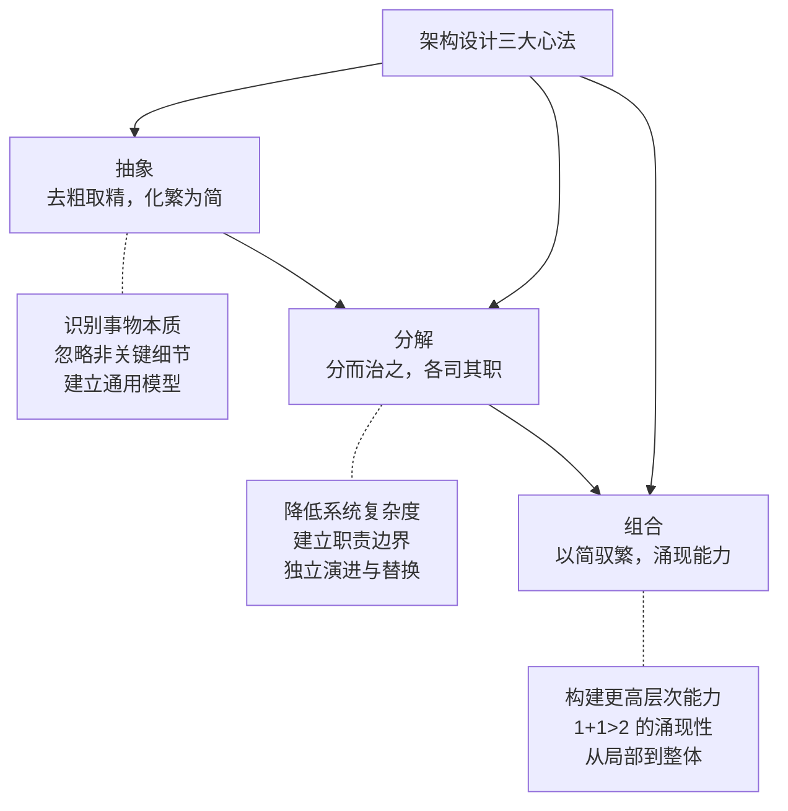
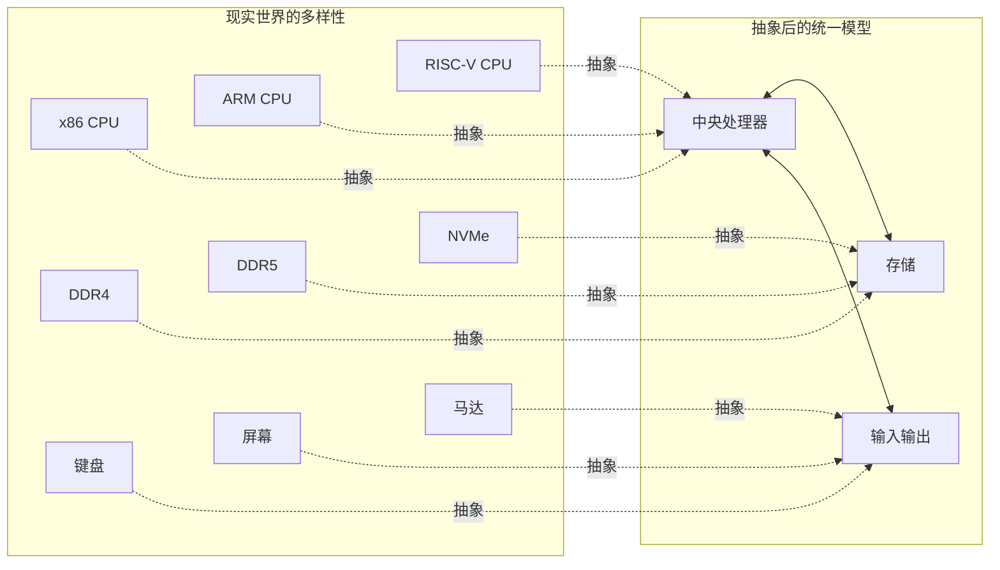
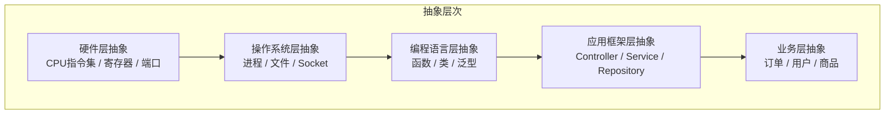
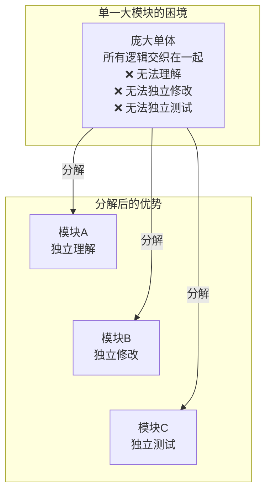
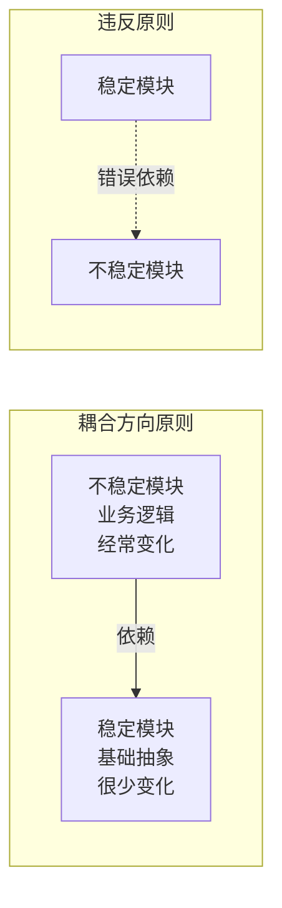
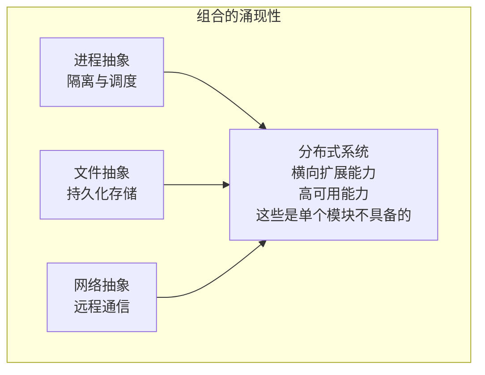
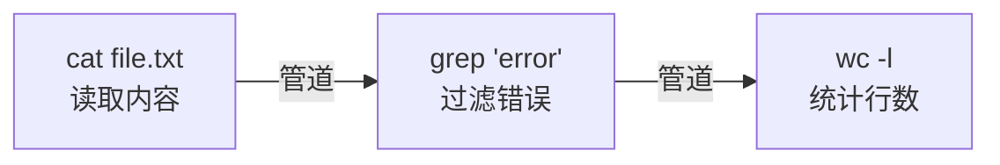
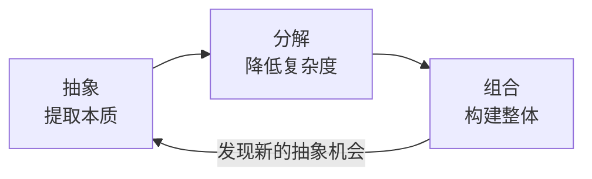
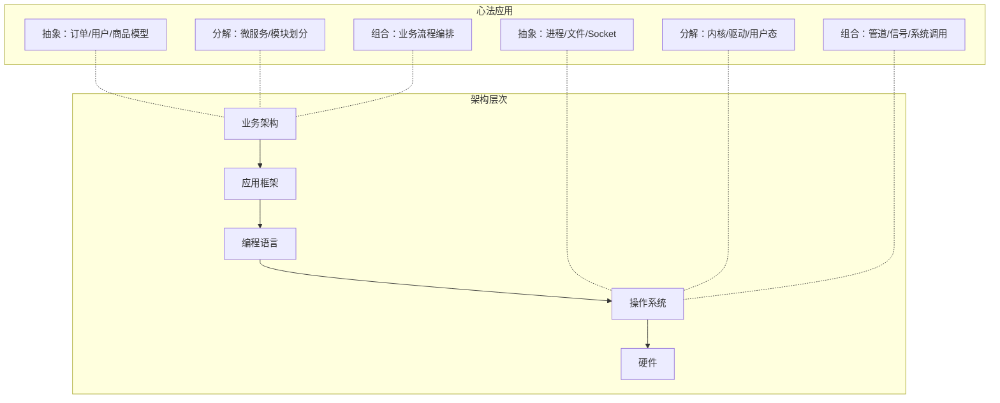

# 架构设计的核心心法

架构师的核心能力在于掌控全局，而掌控全局的关键在于对知识脉络的体系化梳理。那么，架构设计的本质方法论是什么？本文就来聊聊架构设计的核心心法。

## 架构 = 抽象 + 分解 + 组合

在前面一节我们聊到了架构的宏观视角：我们完整地解剖了一个程序的全貌，从基础架构到业务架构，从硬件选型到框架选型。但光知道"有什么"还不够，我们还需要知道"怎么做"。

**架构设计的本质，可以归纳为三个核心动作：抽象、分解、组合。**

这三大心法不是孤立的，而是**层层递进、循环往复**的关系。我们先通过抽象提取事物的本质，再通过分解将复杂系统拆解为可管理的模块，最后通过组合将模块重新组装为更强大的整体。

## 心法一：抽象

抽象是架构设计的起点。没有抽象，我们就无法在纷繁复杂的现实问题中找到规律，也无法在软件世界中建立模型。

### 抽象的本质

**抽象的核心是忽略非关键细节，保留关键特征，从而建立通用模型。**

我们回看上一节的内容，冯·诺依曼体系结构本身就是一次伟大的抽象：无论你是 x86 还是 ARM，无论你的存储是内存还是磁盘，无论你的 IO 设备是键盘还是马达，最终都抽象为"CPU + 存储 + IO"的三元组。

### 抽象的层次

抽象不是一步到位的，而是分层次的。每一层抽象都在上一层的基础上，忽略更多的细节，暴露更简洁的接口。

### 好的抽象的特征

一个优秀的抽象应该具备以下特征：

| 特征 | 说明 | 示例 |
|------|------|------|
| **最小化** | 只暴露必要的接口，隐藏实现细节 | 文件系统只提供 open/read/write/close |
| **正交性** | 不同抽象之间互不重叠，可以独立变化 | 进程抽象与文件抽象互不干扰 |
| **稳定性** | 抽象接口相对稳定，实现可以变化 | POSIX 接口稳定，Linux 内核不断演进 |
| **可组合性** | 抽象之间可以自由组合，产生新的能力 | 管道（pipe）将进程的输出组合为另一进程的输入 |

### 抽象的陷阱

抽象虽然是强大的工具，但也有常见的陷阱：

- **过度抽象**：为了未来可能的需求提前做抽象，导致当前系统不必要的复杂度
- **抽象泄漏**：底层实现的细节泄漏到上层抽象中，使得抽象失去意义
- **错误抽象**：抽象的方向错了，使得上层的使用变得别扭

**预测什么不会发生最为重要。只有做到这一点，才能真正防止架构的过度设计。**——这也是架构学习中需要反复强调的核心观点。

## 心法二：分解

有了抽象之后，我们要面对的下一个问题就是分解——把一个复杂的系统拆分为若干个可管理的模块。

### 为什么要分解？

**核心目标只有一个：降低复杂度。**

人脑能够同时处理的概念数量是有限的（Miller 定律：7±2）。当一个系统的模块数量超过这个范围时，我们就需要将它们进一步分组，形成层次化的结构。

### 分解的原则

分解不是随意切割，而需要遵循一定的原则：

1. **高内聚、低耦合**：每个模块内部的功能高度相关，模块之间的依赖尽量少
2. **单一职责**：每个模块只负责一件事，且只有一个变化的理由
3. **信息隐藏**：模块内部实现细节对其他模块不可见，只通过接口交互
4. **稳定的依赖**：依赖关系应该指向更稳定的方向（依赖倒置）

### 分解的维度

同一个系统可以从不同的维度进行分解：

| 分解维度 | 适用场景 | 示例 |
|----------|----------|------|
| **按功能** | 业务系统 | 订单模块、用户模块、支付模块 |
| **按层次** | 技术架构 | 表现层、业务层、持久层 |
| **按变化率** | 需求频繁变化的系统 | 稳定核心 + 可插拔扩展 |
| **按领域** | 复杂业务系统 | DDD 限界上下文 |

### 分解的粒度

分解的粒度是架构决策中的关键问题。粒度过粗，模块内部仍然复杂；粒度过细，模块间的协调成本上升。

**合适的粒度应该使得：一个模块能够被一个人完整理解，同时模块间的交互次数足够少。**

## 心法三：组合

分解的目的是为了更好地组合。**架构设计的最终目标不是拆解系统，而是构建系统。**组合是将分解后的模块重新组装为更强大的整体。

### 组合的涌现性

组合最令人着迷的特性是**涌现性（Emergence）**：整体具备部分所没有的能力。

### 组合的方式

| 组合方式 | 说明 | 示例 |
|----------|------|------|
| **管道（Pipeline）** | 将一个模块的输出作为下一个模块的输入 | Unix 管道 `ls \| grep \| wc` |
| **分层（Layering）** | 上层调用下层，下层不知道上层的存在 | 网络协议栈 |
| **事件驱动** | 模块通过事件进行松耦合通信 | GUI 事件循环 |
| **插件化** | 核心系统定义扩展点，插件按需注入 | IDE 插件体系 |
| **微服务** | 独立部署的服务通过 API 组合 | 电商系统的订单/支付/物流服务 |

### Unix 哲学：组合的典范

Unix 哲学是组合心法的最佳实践：

1. **每个程序只做一件事**（分解 + 单一职责）
2. **程序的输出可以作为另一个程序的输入**（管道组合）
3. **快速原型，持续迭代**（不要过度设计）

一个简单的管道组合，就实现了"统计文件中错误行数"的能力，而这个能力是任何一个单独命令都不具备的。

## 三大心法的循环

抽象、分解、组合并非一次完成的，而是在架构设计中不断循环往复的过程：

1. 先对问题域进行抽象，识别核心概念
2. 将抽象后的系统分解为可管理的模块
3. 通过组合验证分解是否合理
4. 在组合的过程中发现新的抽象机会，回到第一步

每一次循环，我们对系统的理解就更加深入，架构就更加成熟。

## 心法与架构层次的关系

让我们把三大心法与上一节讨论的架构层次对应起来：

在每一个架构层次上，三大心法都在发挥作用。越是底层的架构，抽象越需要稳定（因为上层都依赖它）；越是上层的架构，组合越需要灵活（因为业务变化最快）。

## 结语

本节聊了架构设计的三大核心心法：**抽象、分解、组合**。它们不是三个独立的方法，而是一个循环往复的架构思维过程。

抽象帮我们看清本质，分解帮我们降低复杂度，组合帮我们构建更强大的整体。而在组合的过程中，我们又会发现新的抽象机会，从而进入下一轮循环。

三大心法说起来简单，但在实际应用中，最大的挑战在于**度的把握**：抽象到什么程度？分解到什么粒度？组合到什么边界？这些问题没有标准答案，需要架构师结合具体的业务场景、团队能力和技术约束来做出判断。

**这正是架构师的价值所在：在不确定性中做出合理的决策。**

在掌握这三大心法之后，可以进一步深入计算机系统的核心抽象，从 CPU 的指令集开始，逐层理解架构的基础。

---

**关键要点**

1. **架构三大心法**：抽象（提取本质）→ 分解（降低复杂度）→ 组合（构建整体），循环往复
2. **好的抽象**：最小化、正交性、稳定性、可组合性
3. **分解的核心原则**：高内聚低耦合、单一职责、信息隐藏、稳定依赖
4. **组合的涌现性**：整体具备部分所没有的能力，这是架构设计的终极追求
5. **度的把握**：抽象到什么程度、分解到什么粒度、组合到什么边界——没有标准答案，这是架构师的核心价值