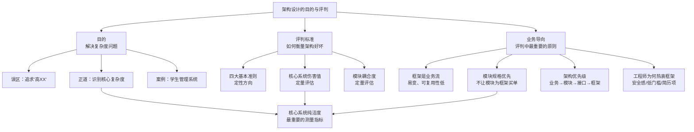
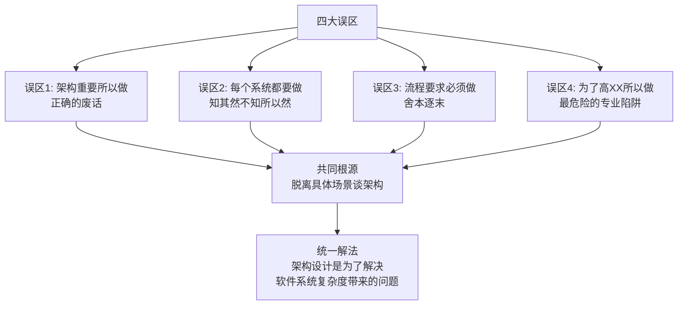
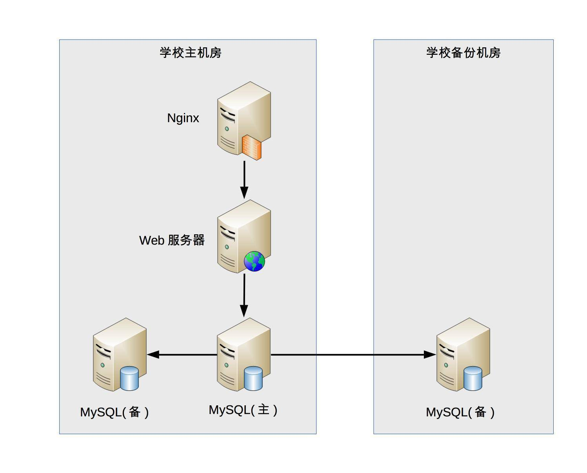
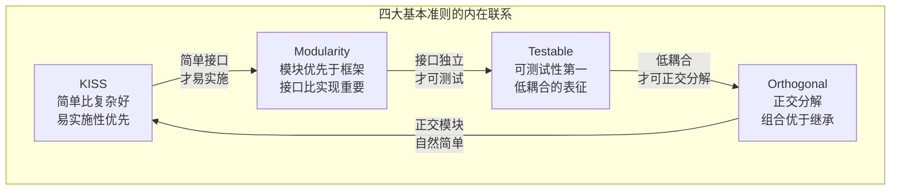
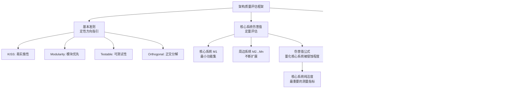
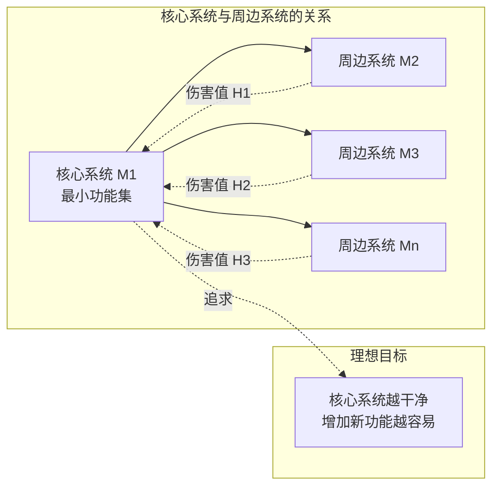
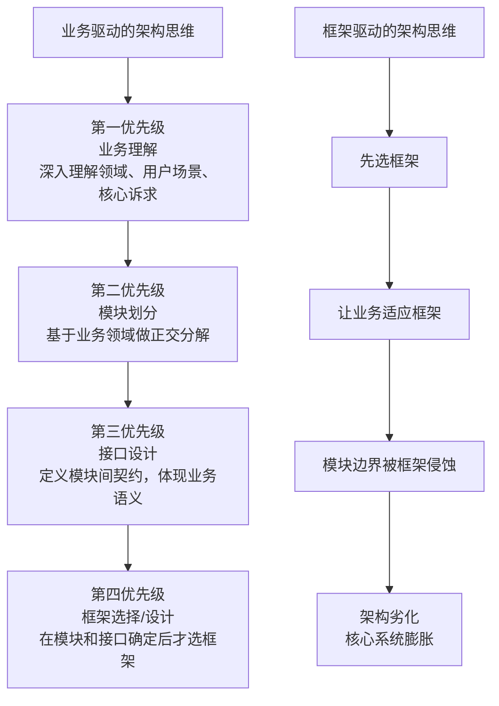
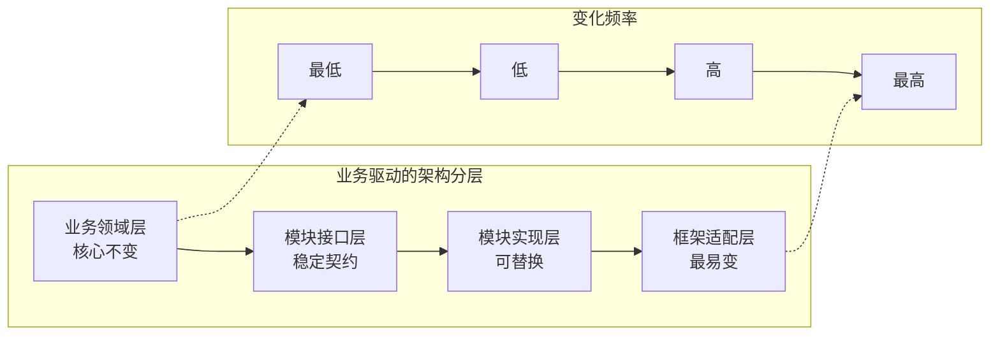
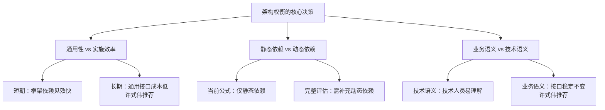

# 架构设计的目的与评判 | 复杂度驱动·业务导向

## 章节导言

"为什么要做架构设计？"——这个看似简单的问题，却鲜有人能给出清晰、自洽的回答。最常见的误区是将架构设计等同于追求"高性能、高可用、高扩展"，结果不管什么系统都往上堆"高XX"，导致架构复杂无比、项目落地遥遥无期。

架构设计的真正目的，从历史中可以找到答案：整个软件技术发展的历史，就是一部与"复杂度"斗争的历史。**架构设计的主要目的是为了解决软件系统复杂度带来的问题**——这条准则，是架构设计过程中需要时刻铭记的核心指南。

但识别复杂度只是第一步，如何评判架构方案的优劣？评判中最重要的标准是什么？答案是回归业务：**架构是否服务于业务，还是业务被迫适应架构？**

许式伟从基本准则出发，逐步推导出定量的经验公式，为架构质量评估提供了可操作的框架。然而，仅有评判标准还不够。软件行业有一个普遍现象：工程师热衷于谈论框架、追逐技术潮流，却对业务逻辑避之不及。许式伟一针见血地指出，**框架并不重要，重要的是业务**。这不是反技术的宣言，而是对架构思维本源的回归——所有技术手段都应该服务于业务目标，脱离业务谈框架，无异于缘木求鱼。

**核心问题**：
1. 架构设计的常见误区有哪些？它们为何会带来灾难？
2. 如何识别系统的核心复杂度，做到有的放矢？
3. 评判架构优劣有哪些量化方法？为什么业务导向是最终标准？
4. 为什么工程师热衷框架？这对架构师意味着什么？



---

## 一、架构设计的常见误区

### 1.1 误区一："架构很重要，所以要做架构设计"

这是一句正确的废话。架构确实很重要，但"为何重要"才是关键问题。很多人从未深入思考过这个"为何"，只是模糊地觉得重要就去做。

让我们用三个反问来检验这个误区：

**反问1：不做架构设计系统就跑不起来么？**

其实不然。很多朋友尤其是经历了创业公司的朋友可能会发现，公司的初始产品可能没有架构设计，大伙撸起袖子简单讨论一下就开始编码了，根本没有正规的架构设计过程，而且也许产品开发速度还更快，上线后运行也还不错。

**反问2：做了架构设计就能提升开发效率么？**

也不尽然。实际上有时候最简单的设计开发效率反而是最高的，架构设计毕竟需要投入时间和人力，这部分投入如果用来尽早编码，项目也许会更快。

**反问3：设计良好的架构能促进业务发展么？**

好像有一定的道理，例如设计高性能的架构能够让用户体验更好。但反过来想，我们照抄微信的架构，业务就能达到微信的量级么？肯定不可能，不要说达到微信的量级，达到微信的1/10做梦都要笑醒了。

### 1.2 误区二："不是每个系统都要做架构设计吗"

这其实是知其然不知其所以然。系统确实要做架构设计，但还是不知道为何要做架构设计，反正大家都要做架构设计，所以做架构设计肯定没错。

这样的架构师或者设计师很容易走入**生搬硬套**业界其他公司已有架构的歧路，美其名曰"参考""微改进"。一旦强行引入其他公司架构后，很可能会发现架构水土不服，或者运行起来很别扭等各种情况，最后往往不得不削足适履，或者不断重构，甚至无奈推倒重来。

**典型场景**：某创业公司看到大厂用了微服务架构，于是也强行上微服务。结果团队只有5个开发人员，服务拆了十几个，每天的时间都花在服务间通信、部署运维上，业务开发效率反而大幅下降。这就是典型的"知其然不知其所以然"——只看到大厂用了微服务，却不理解大厂用微服务是为了解决什么复杂度问题。

### 1.3 误区三："公司流程要求系统开发过程中必须有架构设计"

与此答案类似还有因为"架构师总要做点事情"，所以要做架构设计，其实都是舍本逐末。

因为流程有规定，所以要做架构设计；因为架构师要做事，所以要做架构设计，这都是很表面地看问题，并没有真正理解为何要做架构设计，而且很多需求并不一定要进行架构设计。

如果认为架构师一定要找点事做，流程一定要进行架构设计，就会出现**事实上不需要架构设计但形式上却继续去做架构设计**，不但浪费时间和人力，还会拖慢整体的开发进度。

**深层问题**：这种误区催生了"形式主义架构师"——他们产出厚厚的架构设计文档，画了精美的架构图，但文档与实际开发脱节，架构图成了墙上的装饰品。团队在开发时完全不看架构文档，按照自己的理解去写代码，最终架构设计与实际系统南辕北辙。

### 1.4 误区四："为了高性能、高可用、可扩展，所以要做架构设计"

能够给出这个答案，说明已经有了一定的架构经历或者基础，毕竟确实很多架构设计都是冲着高性能、高可用……等"高XX"的目标去的。

但往往持有这类观点的架构师和设计师会给项目带来**巨大的灾难**，这绝不是危言耸听，而是很多实际发生的事情。为什么会这样呢？因为这类架构师或者设计师不管三七二十一，不管什么系统，也不管什么业务，上来就要求"高性能、高可用、高扩展"，结果就会出现：

- 架构设计复杂无比
- 项目落地遥遥无期
- 团队天天吵翻天
- 费尽九牛二虎之力上线后，运行不够稳定
- 经常出问题，出了问题很难解决
- 加个功能要改1个月

**这是最危险的误区**，因为它披着"专业"的外衣。新手架构师可能觉得追求"高XX"就是做架构设计的正确方向，殊不知脱离具体业务场景谈"高XX"，就像给一辆自行车装上飞机引擎——不仅浪费，还会让自行车根本无法骑行。

### 1.5 误区的根源与统一解法

所有误区的共同特征是**脱离具体场景谈架构**——要么不知道为什么做（前三种），要么做了错误的方向（第四种）。



正确的方法是回到问题本源：**架构设计是为了解决软件系统复杂度带来的问题**。从前文介绍的架构设计的历史背景可以看到，整个软件技术发展的历史，其实就是一部与"复杂度"斗争的历史，架构的出现也不例外。简而言之，架构也是为了应对软件系统复杂度而提出的一个解决方案。

---

## 二、架构设计的真正目的：解决复杂度

### 2.1 核心准则

> **架构设计的主要目的是为了解决软件系统复杂度带来的问题。**

这个结论虽然很简洁，但却是架构设计过程中需要时刻铭记在心的一条准则。为什么这样说呢？

### 2.2 对新手架构师：心中有数，而不是一头雾水

新手架构师开始做架构设计的时候，心情都很激动，希望大显身手，甚至恨不得一出手就设计出世界上最牛的XX架构，从此走上人生巅峰。但真的面对具体的需求时，往往都会陷入一头雾水的状态：

**困惑1："这么多需求，从哪里开始下手进行架构设计呢？"**

——通过熟悉和理解需求，识别系统复杂性所在的地方，然后针对这些复杂点进行架构设计。

**困惑2："架构设计要考虑高性能、高可用、高扩展……这么多高XX，全部设计完成估计要1个月，但老大只给了1周时间"**

——架构设计并不是要面面俱到，不需要每个架构都具备高性能、高可用、高扩展等特点，而是要识别出复杂点然后有针对性地解决问题。

**困惑3："业界A公司的架构是X，B公司的方案是Y，两个差别比较大，该参考哪一个呢？"**

——理解每个架构方案背后所需要解决的复杂点，然后才能对比自己的业务复杂点，参考复杂点相似的方案。

| 困惑 | 基于复杂度准则的回答 |
|------|-------------------|
| "这么多需求，从哪里下手？" | 识别系统复杂性所在的地方，针对复杂点进行架构设计 |
| "高性能/高可用/高扩展都要，但只给了1周" | 不需要每个架构都具备所有"高XX"，识别复杂点后有针对性地解决 |
| "A公司方案X，B公司方案Y，参考哪个？" | 理解每个方案背后解决的复杂点，对比自己的业务复杂点 |

### 2.3 对老鸟架构师：有的放矢，而不是贪大求全

技术人员往往都希望自己能够做出最牛的东西，架构师也不例外，尤其是一些"老鸟"架构师，为了证明自己的技术牛，可能会陷入贪大求全的焦油坑而无法自拔。

**表现1："我们的系统一定要做到每秒TPS 10万"**

——如果系统的复杂度不是在性能这部分，TPS做到10万并没有什么用。

**表现2："淘宝的架构是这么做的，我们也要这么做"**

——淘宝的架构是为了解决淘宝业务的复杂度而设计的，淘宝的业务复杂度并不就是我们的业务复杂度，绝大多数业务的用户量都不可能有淘宝那么大。

**表现3："Docker现在很流行，我们的架构应该将Docker应用进来"**

——Docker不是万能的，只是为了解决资源重用和动态分配而设计的，如果我们的系统复杂度根本不是在这方面，引入Docker没有什么意义。

| 贪大求全的表现 | 基于复杂度准则的判断 |
|--------------|-------------------|
| "系统一定要做到TPS 10万" | 如果复杂度不在性能，TPS 10万没有意义 |
| "淘宝架构这么做，我们也要" | 淘宝架构解决淘宝业务的复杂度，不等于我们的复杂度 |
| "Docker很流行，我们应该用" | Docker解决资源重用和动态分配，如果复杂度不在此处则无意义 |

**深层洞察**：贪大求全的本质是**用技术复杂度替代业务复杂度**。架构师不去分析业务真正的复杂点在哪里，而是用"高XX"的技术方案来填充设计，这实际上是在回避真正的问题。一个TPS只有100的系统，花大量精力设计TPS 10万的架构，这不是在做架构设计，而是在做技术表演。

### 2.4 复杂度分析案例：学生管理系统

我来分析一个简单的案例，一起来看看如何将"架构设计的真正目的是为了解决软件系统复杂度带来的问题"这个指导思想应用到实践中。

假设我们需要设计一个大学的学生管理系统，其基本功能包括登录、注册、成绩管理、课程管理等。当我们对这样一个系统进行架构设计的时候，首先应识别其复杂度到底体现在哪里。

#### 性能维度分析

一个学校的学生大约1~2万人，学生管理系统的访问频率并不高，平均每天单个学生的访问次数平均不到1次，因此性能这部分并不复杂，存储用MySQL完全能够胜任，缓存都可以不用，Web服务器用Nginx绰绰有余。

**计算验证**：2万学生 × 日均1次访问 = 2万次/天。按8小时工作时间计算，平均每秒不到1次请求（20000 / 8 / 3600 ≈ 0.7 QPS）。即使考虑峰值（假设集中在2小时内），峰值QPS也仅为 20000 / 2 / 3600 ≈ 2.8 QPS。这个量级，单台MySQL + 单台Nginx完全足够，根本不需要缓存、分库分表等复杂方案。

#### 可扩展性维度分析

学生管理系统的功能比较稳定，可扩展的空间并不大，因此可扩展性也不复杂。大学的学生管理流程相对固定——入学、选课、考试、毕业——这些核心流程多年不变。即使有新需求（如新增"在线请假"功能），也只是增加一个模块，不会对现有架构造成冲击。

#### 高可用维度分析

学生管理系统即使宕机2小时，对学生管理工作影响并不大，因此可以不做负载均衡，更不用考虑异地多活这类复杂的方案了。

但是，如果学生的数据全部丢失，修复是非常麻烦的，只能靠人工逐条修复，这个很难接受，因此需要考虑**存储高可靠**，这里就有点复杂了。我们需要考虑多种异常情况：

- **机器故障**：需要设计MySQL同机房主备方案
- **机房故障**：需要设计MySQL跨机房同步方案

**关键判断**：高可用不是"所有环节都要高可用"，而是"数据不可丢失的环节必须高可靠"。学生管理系统的计算层可以容忍短暂不可用，但存储层必须保证数据安全。

#### 安全性维度分析

学生管理系统存储的信息有一定的隐私性，例如学生的家庭情况，但并不是和金融相关的，也不包含强隐私（例如玉照、情感）的信息，因此安全性方面只要做3个事情就基本满足要求了：

1. Nginx提供ACL控制
2. 用户账号密码管理
3. 数据库访问权限控制

不需要考虑加密存储、安全审计、防SQL注入框架等复杂安全方案。

#### 成本维度分析

由于系统很简单，基本上几台服务器就能够搞定，对于一所大学来说完全不是问题，可以无需太多关注。

#### 综合分析结论

| 维度 | 分析 | 结论 |
|------|------|------|
| **性能** | 1~2万学生，日均访问<1次 | MySQL完全胜任，缓存不用，Nginx绰绰有余 |
| **可扩展性** | 功能稳定，扩展空间不大 | 不复杂 |
| **高可用** | 宕机2小时影响不大，但数据丢失不可接受 | 不做负载均衡和异地多活，但需要**存储高可靠** |
| **安全性** | 有一定隐私性但非金融级 | Nginx ACL + 账号密码 + 数据库权限 |
| **成本** | 几台服务器即可 | 无需关注 |

**核心复杂度：存储可靠性**。需要应对机器故障（MySQL同机房主备）和机房故障（MySQL跨机房同步）。



> **深度注记**：这个案例虽然简单，但麻雀虽小五脏俱全，涵盖了复杂度分析的各个方面，而且绝大部分技术人员都曾经自己设计或者接触过类似的系统。关键方法论是：**逐一分析每个复杂度维度，找出核心复杂点，有针对性地设计方案**——而非面面俱到地追求"高XX"。如果将这个案例和自己的经验对比，相信会有更多的收获。

#### MySQL主从架构决策的深层思考

学生管理系统的架构决策中，最值得深思的是MySQL主备方案的选择。为什么不是更"先进"的分布式数据库？为什么不是分库分表？

- **分布式数据库**（如TiDB、OceanBase）：解决的是海量数据+高并发+强一致的复杂度，学生管理系统2万人的数据量完全不需要
- **分库分表**：解决的是单机存储容量和写入性能瓶颈，学生管理系统的数据量和写入频率远未达到瓶颈
- **MySQL主备**：解决的是单机故障导致数据丢失的风险，这正是学生管理系统的核心复杂度

这个决策过程完美体现了"架构设计是为了解决复杂度"的准则——不是选最先进的方案，而是选最匹配复杂度的方案。

---

## 三、架构设计的评判标准

识别了复杂度、设计了方案之后，如何评判方案的优劣？许式伟从定性准则到定量公式，构建了完整的架构质量评估框架。

### 3.1 四大基本准则

#### KISS：简单比复杂好

KISS（Keep it Simple, Stupid）的核心主张是**易实施性**。让模块容易实现，实现时心智负担低，比复杂的优化更重要。KISS的"简单"还主张代码和接口符合惯例——接口语义自然，一看方法名就知道怎么回事，避免惊异。

> 正确理解系统需求之后才进行设计。要避免过度设计，除非有人为复杂性买单。

**KISS的深层含义**：简单不是简陋。KISS追求的是"恰到好处的简单"——用最少的机制解决当前的问题，而不是用最复杂的机制预防未来可能的问题。过度设计的本质是"现在为未来的复杂性买单"，但未来的复杂性往往与预测不同，提前买单反而可能买错。

**实践要点**：
- 接口命名自然，一看就懂，不需要翻文档
- 参数设计符合直觉，不需要记忆特殊规则
- 错误处理明确，不隐藏异常
- 避免配置项爆炸——每个配置项都是复杂性的来源

#### Modularity：着眼于模块而非框架

从架构设计角度，**模块的规格（接口）比模块的实现机制更重要**。框架是易变的，框架是业务流，可复用性相对更低。框架都将经历不断发展演化的过程。所以——**不让模块为框架买单**。

模块设计时应忽略框架的存在，认真审视模块接口中"过度的（或多余的）约束条件"，把它提高到足够通用、普适的场景来看。

**为什么模块规格比实现机制更重要？**

1. **接口是契约，实现是细节**：接口定义了模块与外界的交互方式，一旦确定就应尽量稳定；实现是内部细节，可以随时替换
2. **接口影响面广，实现影响面窄**：接口变更会影响所有依赖方，实现变更只影响模块自身
3. **接口决定复用性，实现决定效率**：好的接口让模块可以跨场景复用，好的实现让模块运行更高效——但复用性的价值通常高于单点效率

#### Testable：保证可测试性

设计应该以可测试性为第一目标。可测试往往意味着低耦合。模块测试的第一步是环境模拟——模块依赖的模块列表、模块的输入输出，既是模块测试的需要，也是模块耦合度的表征。

更重要的是，测试让我们能够发现模块架构调整的潜在问题。通常模块在架构调整期（代码重构）最容易引入Bug，只有在开发过程中就不断积累典型测试数据，以案例形式固化所有已知Bug，才可能在架构调整时获得最佳效果。

**可测试性与架构质量的关系**：

- **可测试 = 低耦合**：如果一个模块很难测试，通常是因为它依赖了太多外部模块，耦合度太高
- **可测试 = 可替换**：如果一个模块可以方便地用Mock替代其依赖进行测试，说明模块的接口设计良好，依赖方向正确
- **可测试 = 可重构**：有了充分的测试覆盖，架构师才有信心进行重构，否则"不敢动"的代码就是架构腐化的开始

#### Orthogonal Decomposition：正交分解

架构就是不断对系统进行正交分解的过程。"优先考虑组合，而不是继承"——从正交分解的角度诠释，它本质上是鼓励我们做**乘法而不是加法**。

- **组合是乘法**：用相互正交、完全没有相关性的模块组合出业务场景。每个模块独立变化，互不影响
- **继承是加法**：通过叠加能力把一个模块改造成另一个模块。子类与父类耦合，变化互相影响

**正交分解的数学直觉**：假设有3个独立维度，每个维度2种选择。用组合方式，2×2×2=8种组合，只需6个基本模块；用继承方式，需要8个类（每种组合一个），且修改任一维度的影响面难以控制。

| 准则 | 核心主张 | 关键要点 |
|------|---------|---------|
| **KISS** | 易实施性 > 复杂优化 | 接口语义自然，避免惊异；正确理解需求后才设计 |
| **Modularity** | 模块规格（接口） > 实现机制 | 不让模块为框架买单；接口提高到通用、普适场景 |
| **Testable** | 可测试性是第一目标 | 可测试 = 低耦合；测试数据固化已知Bug，保障架构调整安全 |
| **Orthogonal Decomposition** | 正交分解，组合优于继承 | 组合是乘法（正交模块相乘），继承是加法（叠加能力改造） |



### 3.2 架构质量评估框架

四大基本准则提供了定性的方向指引，但仅有定性判断是不够的。许式伟进一步提出了定量的评估方法，使架构评判从"我感觉这个更好"升级为可计算、可比较的工程化评估。



### 3.3 核心系统伤害值：最重要的测量公式

正交分解的第一步是分出**核心系统**与**周边子系统**。核心系统构成业务的最小功能集，通过不断增加新的周边功能演变为复杂系统。**核心系统的变更要额外小心。**

#### 伤害值经验公式

假设架构方案将系统分为n个模块 `[M1, M2, ..., Mn]`，其中M1是核心系统，其他为周边系统。为简化，假设周边系统间相互正交、没有耦合。则周边功能对核心系统的总伤害值为：

$$H = \sum_{\text{每一处修改}} \log_2(\text{修改行数} + 1)$$

其中：
- 同一个周边功能相邻的代码行算作一处修改
- 不同周边功能的修改哪怕相邻也算作多处

**公式含义**：修改处数越多，伤害越大。对于每一处修改，鼓励尽可能减少到只修改一行，更多代码放到周边模块自己那里去。

#### 公式设计的精妙之处

**为什么用log2？** log2函数的增长速度远慢于线性函数，这意味着：
- 修改1行：log2(1+1) = 1
- 修改3行：log2(3+1) = 2
- 修改7行：log2(7+1) = 3
- 修改15行：log2(15+1) = 4

这体现了"边际递减"的思想——从1行改到3行，伤害增加1；从7行改到15行，伤害也只增加1。公式鼓励的是**减少修改处数**，而不是在每一处减少修改行数。换句话说，宁可一处改5行，也不要5处各改1行。

**为什么"+1"？** 避免log2(0)无定义的情况，同时确保修改1行的伤害值为1（log2(1+1)=1），而非0。

**为什么"不同周边功能的修改即使相邻也计为多处"？** 因为不同周边功能对核心系统的侵入是独立的，即使代码行相邻，它们代表的是不同的"侵蚀方向"，应该分别计算。

#### 计算示例

假设核心系统有3处被周边功能修改：

| 修改来源 | 修改行数 | 伤害值 |
|---------|---------|--------|
| 周边功能M2，修改1处，3行 | log2(3+1) = 2 | 2 |
| 周边功能M3，修改2处，分别1行和5行 | log2(1+1) + log2(5+1) = 1 + 2.58 = 3.58 | 3.58 |
| 周边功能M4，修改1处，1行 | log2(1+1) = 1 | 1 |

**总伤害值 H = 2 + 3.58 + 1 = 6.58**



**核心系统纯洁度**是最重要的架构质量测量指标——核心系统越干净，增加新功能越容易。这本质上是对"业务核心是否被周边功能侵蚀"的量化度量。

### 3.4 模块耦合度测量公式

模块自身质量包括接口质量和实现质量。接口质量取决于两方面：

1. **接口与业务的匹配性**：接口越自然体现业务越好（不可计算，依赖主观判断）
2. **接口的外部依赖**：模块接口对外部环境的耦合度

#### 耦合度公式

模块实现（或接口）与依赖模块A的耦合度：

$$C_A = \sum_{\text{每一个依赖的符号}} \log_2(\text{符号出现次数} + 1)$$

依赖的符号（symbol）包括：被引用的类型（typedef/class/struct）、被引用的全局变量、全局函数或成员函数。

#### 总耦合度公式

模块的总耦合度为：

$$C_{total} = \sum_{\text{每一个依赖模块 A}} C_A \times \text{不成熟度系数}_A$$

其中不成熟度系数A：完全成熟（不再改变）为0；规格都完全没法确定为1。

#### 公式解读与关键洞察

**不成熟度系数的设计意图**：

- 完全成熟的模块（如标准库的int、string）不成熟度系数为0，意味着依赖它们不增加耦合度
- 规格完全无法确定的模块不成熟度系数为1，意味着对它的依赖会100%计入耦合度
- 这鼓励我们**依赖成熟稳定的外部模块**，而非依赖频繁变化的内部模块

**关键洞察**：

1. **鼓励依赖外部成熟模块**：成熟模块的不成熟度系数为0，依赖它不增加耦合度
2. **理论上完全成熟的模块可能只有语言内置类型**（int、string等），所以还是尽量减少外部依赖
3. **将接口参数改为 `object` 或 `interface{}` 并不能降低耦合度**——interface的耦合度要看功能实际使用时存在的各种可能类型。这是一个常见的误区：很多人以为用interface就解耦了，但实际上interface背后隐含的类型约束才是真正的耦合

**计算示例**：

假设模块M依赖模块A的3个符号：ClassA出现5次，funcA出现3次，globalVarA出现2次。模块A的不成熟度系数为0.5。

$$C_A = \log_2(5+1) + \log_2(3+1) + \log_2(2+1) = 2.58 + 2 + 1.58 = 6.16$$

$$C_{total\_from\_A} = 6.16 \times 0.5 = 3.08$$

> **重要提醒**：耦合度测量公式是经验公式，代表某种价值主张。计算得到的具体值并无物理含义，只能用来对比**相同功能**的不同架构方案。功能完全不同的系统，其计算结果不能用于评判彼此好坏。

---

## 四、业务导向：少谈框架，多谈业务

### 4.1 框架的本质：业务流的一种抽象

框架是什么？框架是对业务流的抽象。它解决的问题场景通常是一个具体的业务领域。因此，框架的生命周期与业务紧密绑定：

| 框架特征 | 含义 | 架构影响 |
|---------|------|---------|
| **框架是业务流** | 描述"如何做事情"的流程，属于实现层面 | 框架描述的是"怎么做"，而非"做什么" |
| **框架是易变的** | 业务不断演化，框架也不断演化 | 依赖框架意味着依赖变化 |
| **框架可复用性相对更低** | 业务场景差异导致框架难以通用 | 跨业务复用框架往往需要大量适配 |

**框架 vs 库的区别**：框架控制流程（好莱坞原则："Don't call us, we'll call you"），库被业务代码调用。框架的"控制反转"特性意味着一旦选择框架，业务代码就被框架的流程所约束——这正是"框架侵蚀模块边界"的技术根源。

### 4.2 模块与框架的根本区别

模块与框架的区别，是理解"少谈框架、多谈业务"的关键：

| 维度 | 模块（Module） | 框架（Framework） |
|------|---------------|------------------|
| 关注点 | 规格即接口——**做什么** | 实现即机制——**怎么做** |
| 稳定性 | 接口稳定，变的是实现 | 流程稳定，变的是扩展点 |
| 可复用性 | 高——跨业务场景复用 | 低——与特定业务流绑定 |
| 设计原则 | 不为框架买单 | 为业务流服务 |
| 依赖方向 | 业务依赖模块接口 | 框架驱动业务流程 |
| 变化频率 | 低（接口一旦确定尽量不变） | 高（随业务演化不断变化） |
| 测试方式 | 接口Mock，独立测试 | 需要启动框架上下文 |

**核心论断**：**模块的规格（接口）比模块的实现机制更重要。不应该让模块为框架买单。**

### 4.3 业务架构的核心地位

当我们回归业务时，架构的优先级应该是：

1. **业务理解**：深入理解业务领域、用户场景、核心诉求
2. **模块划分**：基于业务领域做正交分解，识别出核心模块与周边模块
3. **接口设计**：定义模块间的契约（接口），确保接口自然体现业务语义
4. **框架选择/设计**：在模块和接口确定之后，才选择或设计框架来串联业务流





### 4.4 "不让模块为框架买单"的深层含义

模块设计时应该忽略框架的存在，认真审视模块接口中"过度的（或多余的）约束条件"，把它提高到足够通用、普适的场景来看。这意味着：

- **接口设计去框架化**：模块接口不应暴露框架特定的类型、概念或约定
- **实现可以依赖框架**：模块的实现层可以使用特定框架，但接口层必须保持独立
- **业务语义优先**：接口命名、参数设计应体现业务语义，而非技术框架语义

**具体实践**：

| 层次 | 正确做法 | 错误做法 |
|------|---------|---------|
| 接口层 | 使用业务领域类型（如 `UserId`、`Order`） | 使用框架特定类型（如 `ActiveRecord`、`HttpServletRequest`） |
| 接口层 | 方法名体现业务动作（如 `placeOrder`） | 方法名体现技术操作（如 `saveToDB`、`postHTTP`） |
| 实现层 | 可以使用ORM框架操作数据库 | —— |
| 实现层 | 可以使用Web框架处理HTTP | —— |
| 适配层 | 框架特定代码集中在适配层 | 框架代码散落在业务逻辑各处 |

### 4.5 深层反思：为什么工程师热衷框架？

许式伟一针见血地指出了这个普遍现象，并分析了深层原因：

1. **框架提供安全感**：有最佳实践、有社区支持，降低了决策负担。选择Spring Boot比自己设计一个Web框架"安全"得多——出了问题可以搜Stack Overflow，可以问社区。但这种安全感可能掩盖业务理解不足——用框架的"正确方式"做错误的事情，比用"错误方式"做正确的事情更危险。

2. **框架降低入门门槛**：不需要深入理解业务就能开始编码。一个新入职的工程师，学会Spring Boot的注解就能写出能运行的代码，但理解业务领域可能需要几个月。框架让"写代码"变得容易，但让"写正确的代码"变得更难——因为正确的代码必须基于对业务的深入理解。

3. **框架是简历加分项**：技术栈比业务知识更容易量化展示。"精通Spring Cloud微服务架构"比"深入理解供应链金融业务"更容易写进简历、更容易在面试中展示。但这三者恰恰是架构师需要警惕的——安全感可能掩盖业务理解不足，入门门槛低可能意味着深度不够，简历加分项与架构质量无关。

**框架陷阱的完整链条**：

```
工程师热衷框架 → 先选框架再理解业务 → 业务被迫适应框架
→ 模块边界被框架侵蚀 → 核心系统膨胀 → 架构劣化
→ 新功能越来越难加 → 引入更多框架"解决"问题 → 恶性循环
```

---

## 五、设计原则与权衡（Trade-off 分析）

### 5.1 评判标准的权衡

| 评估维度 | 价值主张 | 量化方法 | 局限性 |
|---------|---------|---------|-------|
| 核心系统纯洁度 | 核心系统越干净越好 | 伤害值公式 | 仅考虑静态修改，未考虑运行时影响 |
| 模块耦合度 | 依赖越少、越成熟越好 | 耦合度公式 | 仅考虑静态依赖，未考虑动态依赖（调用频率等） |
| 接口业务匹配性 | 接口自然体现业务 | 无量化方法 | 完全依赖主观判断 |
| 正交性 | 模块间相互独立 | 周边系统间零耦合假设 | 现实中周边系统间可能存在耦合 |

**核心权衡：静态依赖 vs 动态依赖。** 上述公式只考虑了静态依赖关系。例如网络模块A调用B：A调用B的网络接口数量越多，静态依赖越大（已考虑）；A调用B的网络接口的次数越多，动态依赖越大（未考虑）。完整的评估需要同时考量两者。

**重要提醒**：耦合度测量公式是经验公式，代表某种价值主张。计算得到的具体值并无物理含义，只能用来对比**相同功能**的不同架构方案。功能完全不同的系统，其计算结果不能用于评判彼此好坏。

### 5.2 通用性 vs 实施效率

| 选择 | 优势 | 劣势 |
|------|------|------|
| 追求通用接口 | 模块可跨框架复用，架构灵活 | 设计成本高，初期开发慢 |
| 接口依赖框架 | 初期开发快，框架功能直接用 | 框架切换成本高，模块耦合 |
| 业务语义接口 | 自然易懂，变化频率低 | 需要深入理解业务 |
| 技术语义接口 | 技术人员容易理解 | 业务变化时接口不稳定 |

**许式伟的建议**：长期来看，通用性和业务语义的优势远大于短期实施效率的收益。框架都会经历不断发展演化的过程，让模块为框架买单的短期便利，会变成长期的技术债。

### 5.3 业务语义 vs 技术语义

接口命名和参数设计应该体现业务语义还是技术语义？这是一个看似简单但影响深远的决策。

**业务语义接口示例**：
```java
// 业务语义：自然体现业务动作
OrderService.placeOrder(Order order)
PaymentService.charge(UserId userId, Money amount)
InventoryService.reserve(ProductId productId, Quantity qty)
```

**技术语义接口示例**：
```java
// 技术语义：体现技术操作
DataService.save(OrderEntity entity)
HttpHandler.post(Request req, Response resp)
CacheManager.put(String key, Object value)
```

业务语义接口的优势在于：当业务变化时（如"下单"流程调整），接口名和参数仍然有意义；而技术语义接口在业务变化时往往需要重命名或重构，因为"save"可能不再只是"保存"，"post"可能不再只是"HTTP请求"。



---

## 六、实践案例与反模式

### 6.1 正面案例：插件机制——伤害值为零

是否有可能把功能添加对核心系统的影响降低到零（不改一行代码）？这是可能的，要求核心系统提供**插件机制**。这是开闭原则（OCP）在架构层面的体现。

**插件机制的核心思想**：核心系统定义扩展点（接口），周边功能以插件形式实现扩展点，核心系统通过配置或发现机制加载插件。新增功能时，只需添加新插件，核心系统零修改。

**伤害值计算**：H = 0（核心系统无任何修改）

**适用场景**：IDE（如VSCode的扩展机制）、浏览器（Chrome扩展）、构建工具（Maven插件、Webpack插件）。

### 6.2 正面案例：Office软件的架构演进

以Office文档处理为例，正确的架构是：

1. **核心文档模型**作为独立模块，接口不依赖任何具体的文件格式框架
2. **IO子系统**作为独立模块，负责各种格式的读写
3. **文件格式框架**（如XML解析框架）仅存在于IO模块的实现层
4. 新增文件格式支持，只需在IO模块添加适配器，核心文档模型零修改

**伤害值分析**：新增文件格式（如从Word+RTF扩展到Word+RTF+PDF+ODF），核心文档模型的伤害值为0，所有修改集中在IO子系统内部。

**架构分层**：
- 业务领域层：核心文档模型（Document、Paragraph、Table等）
- 模块接口层：IDocumentIO接口（read/write方法）
- 模块实现层：WordIO、RTFIO、PDFIO等具体实现
- 框架适配层：XML解析框架、PDF生成库等

### 6.3 反面案例：OOP思想的误用

以Office软件的IO子系统为例，如果按OOP思想把读盘存盘代码散落在核心系统各处——每个类都需要SaveWord、LoadWord、SaveRTF、LoadRTF——则核心系统伤害值极高。

**问题分析**：

1. **伤害值飙升**：每新增一种文件格式，核心系统中每个类都要加Save/Load方法，修改处数 = 类的个数，每处修改行数 ≥ 2
2. **核心系统膨胀**：文件格式层出不穷、难以收敛，核心系统却被迫不断膨胀
3. **违反正交分解**：文档模型和文件IO是两个正交的维度，应该用组合（乘法）而非继承（加法）来处理

**这正是缺乏正交分解思维的典型表现**——文档模型是"做什么"（What），文件IO是"怎么做"（How），两者应该正交分解，而非耦合在一起。

### 6.4 反面案例：框架侵蚀模块边界

典型的反模式：

- **MVC框架中的Model层直接暴露ActiveRecord对象到View层**——模块接口被框架类型污染。View层本应依赖业务模型接口，却直接依赖了ActiveRecord（框架特定类型），导致View层与数据库框架耦合
- **微服务框架强制所有服务实现特定基类**——模块为框架买单。业务服务本应只关心业务逻辑，却被强制继承框架的基类，导致业务代码与框架耦合
- **ORM框架导致业务逻辑散落在数据模型中**——模块边界被框架侵蚀。Active Record模式让数据模型同时承担数据访问和业务逻辑两个职责，违反了单一职责原则

**这些反模式的共同特征**：框架的类型、概念、约定渗透到了模块接口层，导致模块无法独立变化、独立测试、独立替换。

### 6.5 学生管理系统：从评判标准重新审视

回到华仔的学生管理系统案例，我们可以用许式伟的评判标准来验证架构决策：

| 评判标准 | 学生管理系统架构的评估 |
|---------|---------------------|
| KISS | MySQL主备方案简单直接，心智负担低 |
| Modularity | 存储模块接口不依赖特定框架，Nginx/MySQL可独立替换 |
| Testable | 各模块可独立测试，Mock数据库即可测试业务逻辑 |
| Orthogonal | Web层、业务层、存储层正交分解，互不影响 |
| 核心系统伤害值 | 周边功能（如"在线请假"）对核心（成绩管理）的侵入极低 |
| 模块耦合度 | 业务层依赖存储接口而非MySQL实现，耦合度低 |

**验证结论**：学生管理系统的架构虽然简单，但符合所有评判标准。这再次证明——好的架构不等于复杂的架构，而是**恰好解决核心复杂度**的架构。

---

## 七、总结

### 7.1 核心要点总结

| 核心要点 | 关键结论 |
|---------|---------|
| 架构设计目的 | **解决软件系统复杂度带来的问题**——非追求"高XX"，非面面俱到 |
| 四大误区 | "架构重要所以做"/"每个系统都要做"/"流程要求必须做"/"为了高XX所以做"——共同根源是脱离具体场景谈架构 |
| 复杂度识别 | 逐一分析每个维度（性能/可用/扩展/安全/成本），找出核心复杂点有针对地设计 |
| 四大基本准则 | KISS（易实施）、Modularity（模块优先）、Testable（可测试）、Orthogonal（正交分解） |
| 核心系统伤害值 | 最重要的测量指标；H = sum of log2(修改行数+1)；修改处数越多伤害越大；鼓励每处只改一行 |
| 模块耦合度 | C_total = sum of C_A × 不成熟度系数_A；鼓励依赖成熟模块；interface{}不能降低耦合度；仅考虑静态依赖 |
| 框架本质 | 业务流的抽象，易变且可复用性低；不应让模块为框架买单 |
| 架构优先级 | **业务→模块→接口→框架**；框架驱动是架构劣化的常见根源 |
| 工程师框架陷阱 | 安全感掩盖业务理解不足；低门槛意味着深度不够；简历项与架构质量无关 |
| 评判终极标准 | 架构是否服务于业务，还是业务被迫适应架构？ |

### 7.2 两位作者的融合洞见

华仔和许式伟对"架构设计目的"的理解形成了深刻互补：

**华仔的视角（复杂度驱动）**：从历史出发，推导出架构的唯一目的是解决复杂度。这一定位极其务实——它直接否定了"每个系统都要高性能高可用"的思维惯性，迫使架构师面对具体问题具体分析。学生管理系统的案例清晰地展示了如何**逐一排查复杂度维度，锁定核心复杂点**。

**许式伟的视角（业务导向）**：在复杂度识别的基础上，进一步追问"解决复杂度之后，如何评判方案优劣"。他提出了从定性（四大准则）到定量（伤害值公式、耦合度公式）的完整评估框架，并将评判的终极标准锚定在**业务**上——"少谈框架，多谈业务"。

**融合洞见**：华仔回答了"架构解决什么问题"（复杂度），许式伟回答了"解决得好不好如何评判"（业务导向+量化度量）。两者合在一起，构成了完整的架构设计决策框架：

```
识别核心复杂度 → 设计方案 → 用业务导向评判优劣 → 用量化公式度量质量
```

### 7.3 思考题

1. 请按照"架构设计的主要目的是为了解决软件复杂度带来的问题"这个指导思想来分析一下你目前的业务系统架构，看看是否和你当时分析的结果一样？
2. 尝试用伤害值公式计算你当前系统中，最近新增的一个功能对核心系统的伤害值。这个值是否让你意外？
3. 你的系统中是否存在"模块为框架买单"的情况？如果有，重构的第一步应该是什么？
4. 为什么将接口参数改为 `interface{}` 并不能降低耦合度？请结合你项目中的具体例子说明。
5. 如果两个架构方案的核心系统伤害值相同，但模块耦合度不同，你会如何选择？为什么？

### 7.4 关联阅读

- [架构定义与本质](01-架构定义与本质.md)
- [架构设计历史与心法](02-架构设计历史与心法.md)
- [复杂度来源](05-复杂度来源.md)
- [架构设计原则](06-架构设计原则.md)——开闭原则与接口设计

---

> **延伸视角**（华仔 vs 许式伟）
>
> 两位作者的方法论差异也值得深思：
>
> **华仔的方法论**是"减法思维"——从所有可能的架构目标中，减去那些不是当前系统复杂度的目标，剩下的才是架构设计要解决的问题。这种方法强调**克制**，不做不需要的设计。
>
> **许式伟的方法论**是"度量思维"——用公式量化架构质量，让评判从感性走向理性。伤害值公式和耦合度公式虽然都是经验公式，但它们提供了**可计算、可比较**的评估手段，比"我觉得这个架构更好"要可靠得多。
>
> 两种方法论的互补性在于：减法思维告诉我们"不要做什么"，度量思维告诉我们"做得怎么样"。一个完整的架构设计流程，应该是先用减法思维确定方向，再用度量思维验证质量。
>
> 更深层的统一在于：两者都指向**业务**。减法思维的"减"，减掉的是与业务复杂度无关的技术复杂度；度量思维的"量"，量的核心是业务核心系统是否被侵蚀。业务，是架构设计目的与评判的交汇点。
