# 复杂度来源 | 架构设计的六大挑战

## 章节导言

架构设计的核心目的是解决软件系统复杂度带来的问题。但"复杂度"本身是什么？它从何而来？

复杂度并非单一维度的概念，而是至少来自六个方向：**高性能、高可用、可扩展性、低成本、安全、规模**。每个来源都有其独特的内在矛盾和解决难点，而且它们之间并非独立——高性能与低成本天然冲突，高可用与一致性相互制约，可扩展性与实现效率此消彼长。

理解复杂度的来源，是架构设计"识别复杂度"这一关键步骤的前提。只有精准识别了复杂度所在，才能做到有的放矢而非贪大求全。

**核心问题**：
1. 高性能的复杂度体现在单机和集群两个层面，各自的核心矛盾是什么？
2. 高可用为何本质上是"冗余"问题？存储高可用的根本难点在哪里？状态决策为何不可能完全正确？
3. 可扩展性的两大条件"预测变化"和"应对变化"，各自有何内在矛盾？"2年法则"和"1写2抄3重构"如何指导实践？
4. 低成本、安全、规模这三种复杂度来源，各自的特殊性在哪里？为什么低成本往往需要创新？

**六大来源速览**：

| 复杂度来源 | 一句话概括 | 核心矛盾 |
|-----------|-----------|---------|
| 高性能 | 性能越高，系统越复杂 | 单机多模型选择 + 集群分解粒度把握 |
| 高可用 | 冗余是唯一手段，但冗余引入新问题 | 冗余带来数据不一致 + 状态决策不可能完全正确 |
| 可扩展性 | 预测变化的"度"难以把握 | 不能每点都考虑，也不能完全不考虑 |
| 低成本 | 与高性能/高可用天然冲突 | 只有创新才能低成本，但创新本身复杂 |
| 安全 | 功能安全渐进博弈，架构安全缺乏通用方案 | "防小偷"靠积累，"防强盗"缺方案 |
| 规模 | 量变引起质变 | 功能连接平方级增长，数据超阈值质变 |

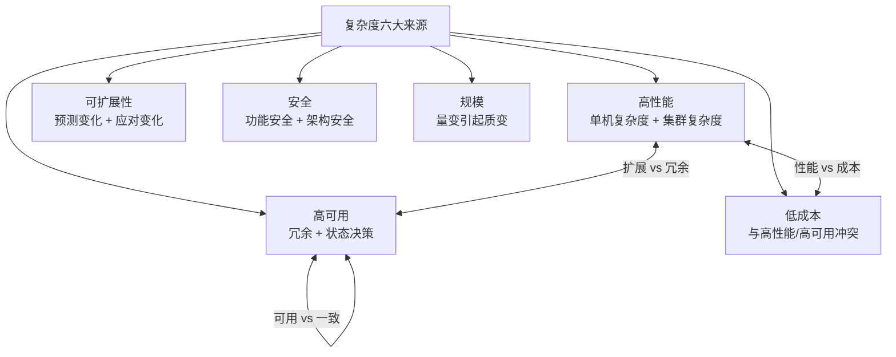
```mermaid
graph TD
    A[复杂度六大来源] --> B1[高性能<br/>单机复杂度 + 集群复杂度]
    A --> B2[高可用<br/>冗余 + 状态决策]
    A --> B3[可扩展性<br/>预测变化 + 应对变化]
    A --> B4[低成本<br/>与高性能/高可用冲突]
    A --> B5[安全<br/>功能安全 + 架构安全]
    A --> B6[规模<br/>量变引起质变]

    B1 <-->|"扩展 vs 冗余"| B2
    B1 <-->|"性能 vs 成本"| B4
    B2 <-->|"可用 vs 一致"| B2

```

---

## 一、高性能

对性能孜孜不倦的追求是整个人类技术不断发展的根本驱动力。计算机从电子管到晶体管再到集成电路，运算性能从每秒几次提升到每秒几亿次；但伴随性能越来越高，相应的方法和系统复杂度也越来越高。现代CPU集成了几亿颗晶体管，逻辑复杂度和制造复杂度相比最初的晶体管计算机，根本不可同日而语。

软件系统也存在同样的现象：从最初的计算机只能进行简单科学计算，到现在Google能够支撑每秒几万次搜索；系统规模从单台计算机扩展到上万台计算机；从单用户单工的字符界面DOS操作系统，到现在的多用户多工的Windows 10图形操作系统。

**重要区分**：技术发展带来的性能提升，不一定带来复杂度的提升。例如硬件存储从纸带→磁带→磁盘→SSD，并没有显著增加系统复杂度，因为新技术逐步淘汰旧技术，直接用新技术即可。只有那些并非用来取代旧技术、而是开辟全新领域的技术，才会给软件系统带来复杂度——因为软件系统设计时需要在这些技术之间进行判断、选择或组合。就像汽车的发明无法取代火车，飞机的出现也不能完全取代火车，出行时需要考虑选择汽车、火车还是飞机，这个选择过程涉及价格、时间、速度、舒适度等各种因素。

软件系统中高性能带来的复杂度主要体现在两方面：**单台计算机内部为了高性能带来的复杂度**；**多台计算机集群为了高性能带来的复杂度**。

**高性能复杂度的两层结构**：

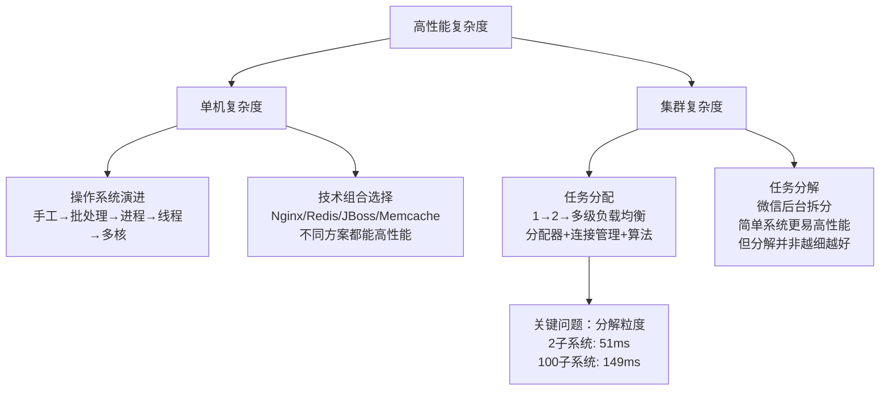
```mermaid
graph TD
    A[高性能复杂度] --> B[单机复杂度]
    A --> C[集群复杂度]

    B --> B1[操作系统演进<br/>手工→批处理→进程→线程→多核]
    B --> B2[技术组合选择<br/>Nginx/Redis/JBoss/Memcache<br/>不同方案都能高性能]

    C --> C1[任务分配<br/>1→2→多级负载均衡<br/>分配器+连接管理+算法]
    C --> C2[任务分解<br/>微信后台拆分<br/>简单系统更易高性能<br/>但分解并非越细越好]

    C1 --> D["关键问题：分解粒度<br/>2子系统: 51ms<br/>100子系统: 149ms"]

```

### 1.1 单机复杂度

计算机内部复杂度最关键的地方就是操作系统。计算机性能的发展本质上是由硬件发展驱动的，尤其是CPU的性能发展。著名的"摩尔定律"表明CPU的处理能力每隔18个月就翻一番；而将硬件性能充分发挥出来的关键就是操作系统，所以操作系统本身也是跟随硬件的发展而发展的。操作系统是软件系统的运行环境，操作系统的复杂度直接决定了软件系统的复杂度。

操作系统和性能最相关的就是**进程**和**线程**。其演进历程如下：

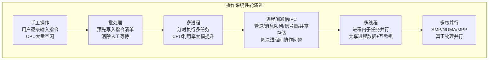
```mermaid
graph TB
    subgraph 操作系统性能演进
        A["手工操作<br/>用户逐条输入指令<br/>CPU大量空闲"] --> B["批处理<br/>预先写入指令清单<br/>消除人工等待"]
        B --> C["多进程<br/>分时执行多任务<br/>CPU利用率大幅提升"]
        C --> D["进程间通信IPC<br/>管道/消息队列/信号量/共享存储<br/>解决进程间协作问题"]
        D --> E["多线程<br/>进程内子任务并行<br/>共享进程数据+互斥锁"]
        E --> F["多核并行<br/>SMP/NUMA/MPP<br/>真正物理并行"]
    end
```

**各阶段详解**：

**手工操作**：最早的计算机没有操作系统，只有输入、计算和输出功能。用户输入一个指令，计算机完成操作，大部分时候计算机都在等待用户输入指令。人的输入速度远远比不上计算机的运算速度，处理性能很显然很低效。

**批处理**：为了解决手工操作带来的低效，批处理操作系统应运而生。先把要执行的指令预先写下来（写到纸带、磁带、磁盘等），形成一个指令清单（即"任务"），然后交给计算机去执行。批处理操作系统负责读取指令清单并进行处理，计算机执行过程中无须等待人工手工操作，性能有了很大的提升。

**多进程**：批处理大大提升了处理性能，但有一个明显缺点：计算机一次只能执行一个任务。如果某个任务需要从I/O设备读取大量数据，在I/O操作过程中CPU其实是空闲的。为了进一步提升性能，人们发明了"进程"——用进程来对应一个任务，每个任务都有自己独立的内存空间，进程间互不相关，由操作系统来进行调度。此时CPU还没有多核和多线程的概念，为了达到多进程并行运行的目的，采取了分时的方式——把CPU的时间分成很多片段，每个片段只能执行某个进程中的指令。虽然从操作系统和CPU的角度来说还是串行处理的，但由于CPU处理速度很快，从用户的角度来看感觉是多进程在并行处理。

**进程间通信**：多进程要求每个任务都有独立的内存空间、进程间互不相关，但从用户的角度来看，两个任务之间能够在运行过程中就进行通信，会让任务设计变得更加灵活高效。否则如果两个任务运行过程中不能通信，只能是A任务将结果写到存储、B任务再从存储读取进行处理，不仅效率低，而且任务设计更加复杂。为了解决这个问题，进程间通信的各种方式被设计出来了，包括管道、消息队列、信号量、共享存储等。

**多线程**：多进程让多任务能够并行处理任务，但单个进程内部只能串行处理。实际上很多进程内部的子任务并不要求严格按照时间顺序来执行，也需要并行处理。例如一个餐馆管理进程，排位、点菜、买单、服务员调度等子任务必须能够并行处理，否则就会出现某个客人买单时间比较长（比如说信用卡刷不出来），其他客人都不能点菜的情况。为了解决这个问题，人们又发明了线程——线程是进程内部的子任务，但这些子任务都共享同一份进程数据。为了保证数据的正确性，又发明了互斥锁机制。有了多线程后，操作系统调度的最小单位就变成了线程，而进程变成了操作系统分配资源的最小单位。

**多核并行**：多进程多线程虽然让多任务并行处理的性能大大提升，但本质上还是分时系统，并不能做到时间上真正的并行。解决这个问题的方式显而易见：让多个CPU同时执行计算任务，实现真正意义上的多任务并行。目前这样的解决方案有3种：

| 方案 | 全称 | 说明 |
|------|------|------|
| **SMP** | Symmetric Multi-Processor，对称多处理器结构 | 最常见，目前流行的多核处理器就是SMP方案 |
| **NUMA** | Non-Uniform Memory Access，非一致存储访问结构 | 多个CPU模块，每个模块有自己的本地内存 |
| **MPP** | Massive Parallel Processing，海量并行处理结构 | 大规模并行处理，每个节点有独立的操作系统 |

**关键要点**：多进程、多线程、进程间通信、多线程并发等技术**并非最新的就是最好的，也不是非此即彼的选择**。在做架构设计的时候，需要花费很大的精力来结合业务进行分析、判断、选择、组合，这个过程同样很复杂。举一个最简单的例子：

| 系统 | 并发模型 | 说明 |
|------|---------|------|
| Nginx | 多进程 | 用多进程实现高性能 |
| JBoss | 多线程 | 用多线程实现高性能 |
| Redis | 单进程 | 单进程事件循环实现高性能（6.0 起网络 I/O 可多线程，命令执行仍为单线程） |
| Memcache | 多线程 | 用多线程实现高性能 |

这些系统都实现了高性能，但内部实现差异却很大。架构设计需要结合业务进行分析、判断、选择、组合，这个过程本身就是复杂度的来源。

### 1.2 集群的复杂度

虽然计算机硬件的性能快速发展，但和业务的发展速度相比还是小巫见大巫，尤其是进入互联网时代后，业务的发展速度远远超过了硬件的发展速度：

- 2016年"双11"支付宝每秒峰值达12万笔支付
- 2017年春节微信红包收发红包每秒达到76万个

要支持支付和红包这种复杂的业务，单机的性能无论如何是无法支撑的，必须采用机器集群的方式来达到高性能。例如支付宝和微信这种规模的业务系统，后台系统的机器数量都是万台级别的。

通过大量机器来提升性能，并不仅仅是增加机器这么简单。让多台机器配合起来达到高性能的目的，是一个复杂的任务。

#### 1.2.1 任务分配

任务分配的意思是指每台机器都可以处理完整的业务任务，不同的任务分配到不同的机器上执行。

我从最简单的一台服务器变两台服务器开始，来讲任务分配带来的复杂性。

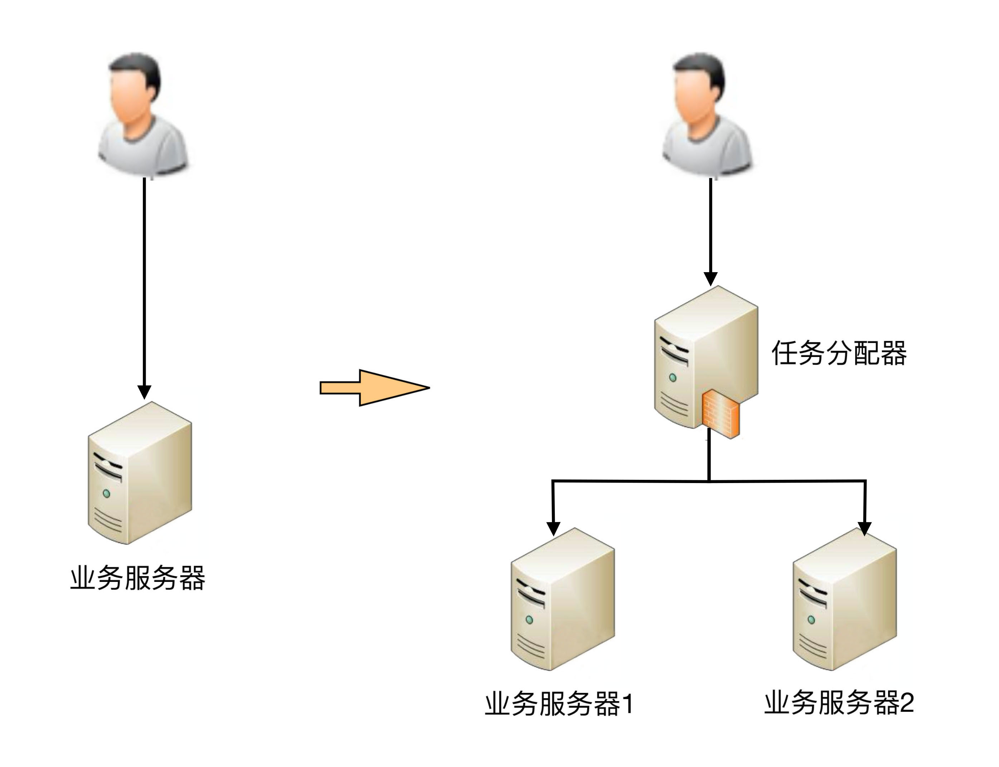

从图中可以看到，1台服务器演变为2台服务器后，架构上明显要复杂多了，主要体现在：

- **需要增加一个任务分配器**：这个分配器可能是硬件网络设备（例如F5、交换机等），可能是软件网络设备（例如LVS），也可能是负载均衡软件（例如Nginx、HAProxy），还可能是自己开发的系统。选择合适的任务分配器也是一件复杂的事情，需要综合考虑性能、成本、可维护性、可用性等各方面的因素。

- **任务分配器和真正的业务服务器之间有连接和交互**：需要选择合适的连接方式，并且对连接进行管理。例如，连接建立、连接检测、连接中断后如何处理等。

- **任务分配器需要增加分配算法**：例如，是采用轮询算法，还是按权重分配，又或者按照负载进行分配。如果按照服务器的负载进行分配，则业务服务器还要能够上报自己的状态给任务分配器。

上面这个架构只是最简单地增加1台业务机器，我们假设单台业务服务器每秒能够处理5000次业务请求，那么这个架构理论上能够支撑10000次请求，实际上的性能一般按照8折计算，大约是8000次左右。

如果性能要求继续提高，假设要求每秒提升到10万次，是不是将业务服务器增加到25台就可以了呢？显然不是——随着性能的增加，任务分配器本身又会成为性能瓶颈。

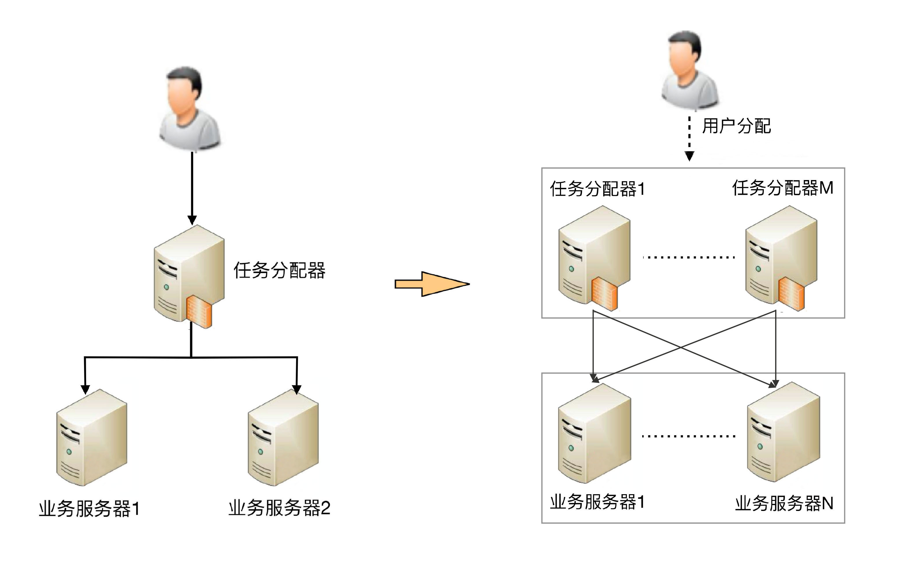

这个架构比2台业务服务器的架构要复杂，主要体现在：

- 任务分配器从1台变成了多台，这个变化带来的复杂度就是需要将不同的用户分配到不同的任务分配器上。常见的方法包括DNS轮询、智能DNS、CDN（Content Delivery Network，内容分发网络）、GSLB设备（Global Server Load Balance，全局负载均衡）等。

- 任务分配器和业务服务器的连接从简单的"1对多"变成了"多对多"的网状结构。

- 机器数量从3台扩展到30台（假设业务服务器25台，任务分配器5台），状态管理、故障处理复杂度也大大增加。

"任务"涵盖的范围很广，**可以指完整的业务处理，也可以单指某个具体的任务**。例如，"存储""运算""缓存"等都可以作为一项任务，因此存储系统、运算系统、缓存系统都可以按照任务分配的方式来搭建架构。此外，"任务分配器"也并不一定只能是物理上存在的机器或者一个独立运行的程序，也可以是嵌入在其他程序中的算法，例如Memcache的集群架构。

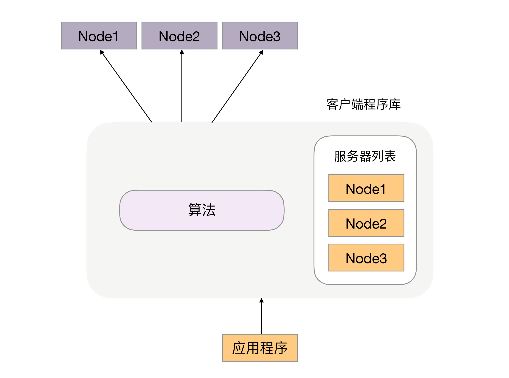

#### 1.2.2 任务分解

通过任务分配的方式，我们能够突破单台机器处理性能的瓶颈，通过增加更多的机器来满足业务的性能需求。但如果业务本身也越来越复杂，单纯只通过任务分配的方式来扩展性能，收益会越来越低。

例如，业务简单的时候1台机器扩展到10台机器，性能能够提升8倍（需要扣除机器群带来的部分性能损耗）；但如果业务越来越复杂，1台机器扩展到10台，性能可能只能提升5倍。造成这种现象的主要原因是业务越来越复杂，单台机器处理的性能会越来越低。为了能够继续提升性能，我们需要采取第二种方式：**任务分解**。

继续以上面"任务分配"中的架构为例，"业务服务器"如果越来越复杂，我们可以将其拆分为更多的组成部分。以微信的后台架构为例：

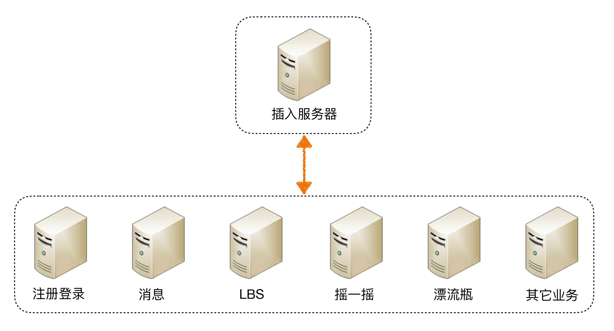

通过上面的架构示意图可以看出，微信后台架构从逻辑上将各个子业务进行了拆分，包括：接入、注册登录、消息、LBS、摇一摇、漂流瓶、其他业务（聊天、视频、朋友圈等）。

通过这种任务分解的方式，能够把原来大一统但复杂的业务系统，拆分成小而简单但需要多个系统配合的业务系统。从业务的角度来看，任务分解既不会减少功能，也不会减少代码量（事实上代码量可能还会增加，因为从代码内部调用改为通过服务器之间的接口调用），那为何通过任务分解就能够提升性能呢？

主要有两方面的因素：

**因素一：简单的系统更加容易做到高性能**

系统的功能越简单，影响性能的点就越少，就更加容易进行有针对性的优化。而系统很复杂的情况下，首先是比较难以找到关键性能点，因为需要考虑和验证的点太多；其次是即使花费很大力气找到了，修改起来也不容易，因为可能将A关键性能点提升了，但却无意中将B点的性能降低了，整个系统的性能不但没有提升，还有可能会下降。

**因素二：可以针对单个任务进行扩展**

当各个逻辑任务分解到独立的子系统后，整个系统的性能瓶颈更加容易发现，而且发现后只需要针对有瓶颈的子系统进行性能优化或者提升，不需要改动整个系统，风险会小很多。以微信的后台架构为例，如果用户数增长太快，注册登录子系统性能出现瓶颈的时候，只需要优化登录注册子系统的性能（可以是代码优化，也可以简单粗暴地加机器），消息逻辑、LBS逻辑等其他子系统完全不需要改动。

**关键边界：任务分解并非越细越好**

既然将一个大一统的系统分解为多个子系统能够提升性能，那是不是划分得越细越好呢？例如，上面的微信后台目前是7个逻辑子系统，如果我们把这7个逻辑子系统再细分，划分为100个逻辑子系统，性能是不是会更高呢？

其实不然，这样做性能不仅不会提升，反而还会下降，最主要的原因是如果系统拆分得太细，为了完成某个业务，系统间的调用次数会随子系统数量成倍增加，而系统间的调用通道目前都是通过网络传输的方式，性能远比系统内的函数调用要低得多。

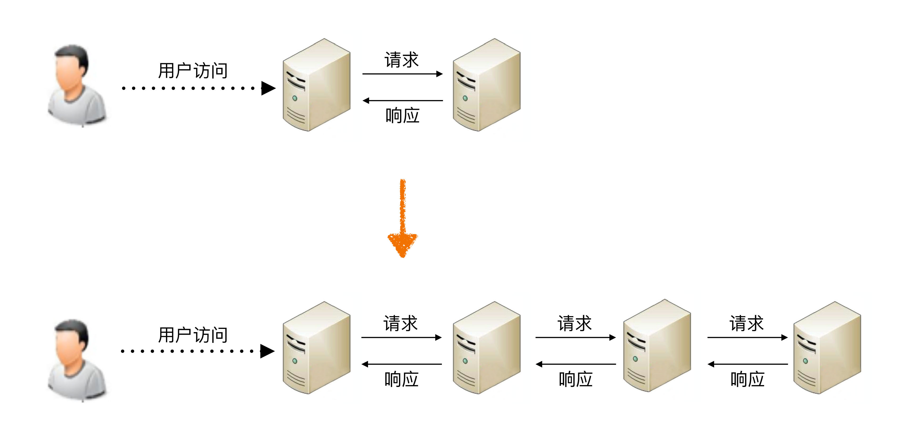

从图中可以看到，当系统拆分2个子系统的时候，用户访问需要1次系统间的请求和1次响应；当系统拆分为4个子系统的时候，系统间的请求次数从1次增长到3次；假如继续拆分下去为100个子系统，为了完成某次用户访问，系统间的请求次数变成了99次。

为了描述简单，我抽象出来一个最简单的模型：假设这些系统采用IP网络连接，理想情况下一次请求和响应在网络上耗费为1ms，业务处理本身耗时为50ms。我们也假设系统拆分对单个业务请求性能没有影响，那么：

| 子系统数量 | 系统间请求次数 | 网络开销 | 总耗时 | 相比单体增幅 |
|-----------|--------------|---------|--------|------------|
| 1（单体） | 0次 | 0ms | 50ms | 基准 |
| 2个 | 1次 | 1ms | 51ms | +2% |
| 4个 | 3次 | 3ms | 53ms | +6% |
| 10个 | 9次 | 9ms | 59ms | +18% |
| 100个 | 99次 | 99ms | 149ms | +198% |

系统拆分为2个子系统的时候，处理一次用户访问耗时为51ms；而系统拆分为100个子系统的时候，处理一次用户访问耗时竟然达到了149ms——几乎是3倍的差距！

**任务分解提升性能的两个因素再思考**：

回顾一下，任务分解提升性能靠两个因素——"简单系统更容易做到高性能"和"可以针对单个任务进行扩展"。但这两个因素的作用是有边界的：

- "简单系统更容易做到高性能"——这个因素只在分解初期有效。当系统已经足够简单时，继续分解不再带来显著收益
- "可以针对单个任务进行扩展"——这个因素一直有效，但扩展本身也需要成本（增加机器、运维复杂度等）

因此，任务分解带来的性能收益呈现**先升后降的曲线**：分解初期收益大于开销，后期开销大于收益。架构师需要找到曲线的拐点——这就是"分解粒度"的最优值。

虽然系统拆分可能在某种程度上能提升业务处理性能，但提升性能也是有限的，不可能系统不拆分的时候业务处理耗时为50ms，系统拆分后业务处理耗时只要1ms，因为最终决定业务处理性能的还是业务逻辑本身。业务逻辑本身没有发生大的变化下，理论上的性能是有一个上限的，系统拆分能够让性能逼近这个极限，但无法突破这个极限。因此，任务分解带来的性能收益是有一个度的，并不是任务分解越细越好，而对于架构设计来说，如何把握这个粒度就非常关键了。

> **深度注记**：任务分解的粒度是架构设计的关键决策之一。分解能让性能逼近业务逻辑的理论上限，但无法突破这个上限。架构师需要在"分解带来的性能收益"与"系统间调用开销"之间找到最优点。这个最优点的判断依据，与业务的复杂度、网络延迟、系统间调用的频率等因素密切相关，没有放之四海而皆准的答案。一个实用的判断方法：当系统间调用的网络开销超过了分解带来的性能收益时，就说明分解过度了。

---

## 二、高可用

### 2.1 定义与本质

参考维基百科，高可用的定义为：

> 系统无中断地执行其功能的能力，代表系统的可用性程度，是进行系统设计时的准则之一。

这个定义的关键在于"**无中断**"，但恰好难点也在"无中断"上面。因为无论是单个硬件还是单个软件，都不可能做到无中断：硬件会出故障，软件会有bug；硬件会逐渐老化，软件会越来越复杂和庞大……

除了硬件和软件本质上无法做到"无中断"，外部环境导致的不可用更加不可避免、不受控制。例如断电、水灾、地震，这些事故或者灾难也会导致系统不可用，而且影响程度更加严重，更加难以预测和规避。

所以，系统的高可用方案五花八门，但万变不离其宗，本质上都是通过"**冗余**"来实现高可用。通俗点来讲，就是一台机器不够就两台，两台不够就四台；一个机房可能断电，那就部署两个机房；一条通道可能故障，那就用两条，两条不够那就用三条（移动、电信、联通一起上）。

**高性能 vs 高可用的根本区别**：

高可用的"冗余"解决方案，单纯从形式上来看，和之前讲的高性能是一样的，都是通过增加更多机器来达到目的，但其实本质上是有根本区别的：

| 维度 | 高性能 | 高可用 |
|------|-------|-------|
| 增加机器的目的 | **扩展**处理性能 | **冗余**处理单元 |
| 形式 | 相似（都是增加机器） | 相似 |
| 本质 | 提升吞吐量 | 确保不中断 |

**高可用复杂度的两层结构**：

```mermaid
graph TD
    A[高可用复杂度] --> B[计算高可用]
    A --> C[存储高可用]
    A --> D[状态决策]

    B --> B1[同样算法+输入=同样结果<br/>任务分配器+算法选择<br/>主备/主主/集群"]
    C --> C1[数据传输延迟→不一致<br/>传输中断→不一致<br/>CAP: 最多满足两个"]
    D --> D1[独裁式: 单点故障<br/>协商式: 连接中断困境<br/>民主式: 脑裂问题"]

    C1 --> E["核心难点:<br/>不在于备份数据<br/>而在于规避不一致"]

```

通过冗余增强了可用性，但同时也带来了复杂性。下面根据不同的应用场景逐一分析。

### 2.2 计算高可用

这里的"计算"指的是业务的逻辑处理。计算有一个特点就是**无论在哪台机器上进行计算，同样的算法和输入数据，产出的结果都是一样的**，所以将计算从一台机器迁移到另外一台机器，对业务并没有什么影响。既然如此，计算高可用的复杂度体现在哪里呢？

以最简单的单机变双机为例进行分析：

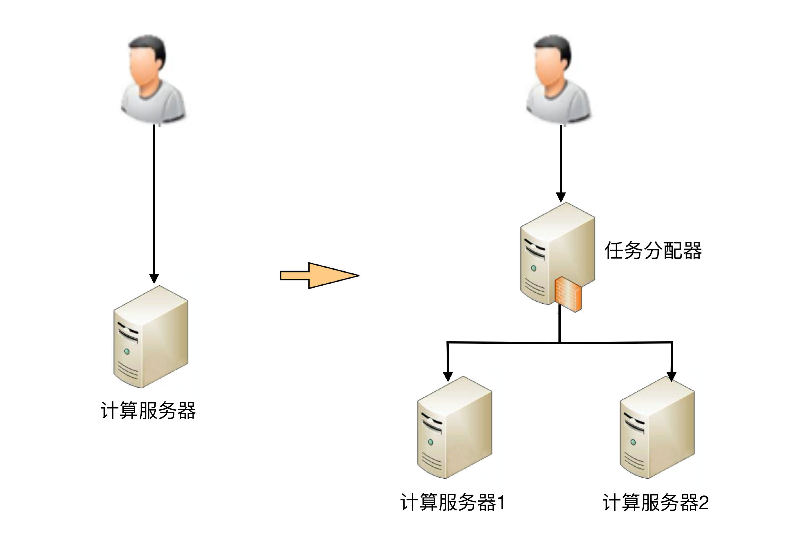

你可能会发现，这个双机的架构图和上面"高性能"讲到的双机架构图是一样的，因此复杂度也是类似的，具体表现为：

- 需要增加一个任务分配器，选择合适的任务分配器也是一件复杂的事情，需要综合考虑性能、成本、可维护性、可用性等各方面因素。

- 任务分配器和真正的业务服务器之间有连接和交互，需要选择合适的连接方式，并且对连接进行管理。例如，连接建立、连接检测、连接中断后如何处理等。

- 任务分配器需要增加分配算法。例如，常见的双机算法有主备、主主，主备方案又可以细分为冷备、温备、热备。

上面这个示意图只是简单的双机架构，再看一个复杂一点的高可用集群架构：

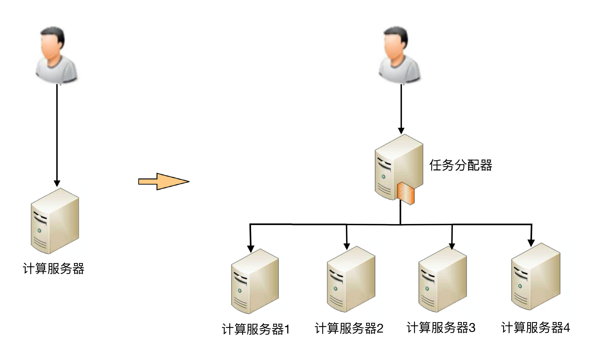

这个高可用集群相比双机来说，分配算法更加复杂，可以是1主3备、2主2备、3主1备、4主0备。具体应该采用哪种方式，需要结合实际业务需求来分析和判断，并不存在某种算法就一定优于另外的算法。例如，ZooKeeper采用的就是1主多备，而Memcached采用的就是全主0备。

### 2.3 存储高可用

对于需要存储数据的系统来说，整个系统的高可用设计关键点和难点就在于"存储高可用"。存储与计算相比，有一个本质上的区别：**将数据从一台机器搬到另一台机器，需要经过线路进行传输**。

线路传输的速度是毫秒级别：同一机房内部能够做到几毫秒；分布在不同地方的机房，传输耗时需要几十甚至上百毫秒。例如，从广州机房到北京机房，稳定情况下ping延时大约是50ms，不稳定情况下可能达到1s甚至更多。

虽然毫秒对于人来说几乎没有什么感觉，但是对于高可用系统来说，就是本质上的不同——这意味着整个系统在某个时间点上，数据肯定是不一致的。按照"**数据 + 逻辑 = 业务**"这个公式来套的话，数据不一致，即使逻辑一致，最后的业务表现就不一样了。

以最经典的银行储蓄业务为例：假设用户的数据存在北京机房，用户存入了1万块钱，然后他查询的时候被路由到了上海机房，北京机房的数据没有同步到上海机房，用户会发现他的余额并没有增加1万块。想象一下，此时用户肯定会背后一凉，马上会怀疑自己的钱被盗了，然后赶紧打客服电话投诉，甚至打110报警——即使最后发现只是因为传输延迟导致的问题，站在用户的角度来说，这个过程的体验肯定很不好。

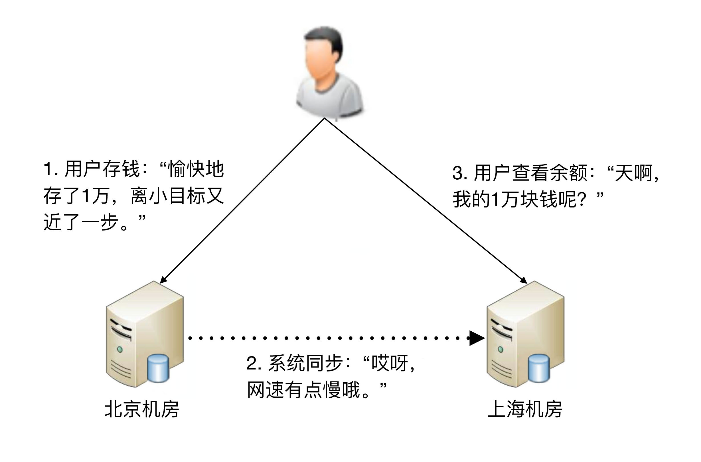

除了物理上的传输速度限制，传输线路本身也存在可用性问题：传输线路可能中断、可能拥塞、可能异常（错包、丢包），并且传输线路的故障时间一般都特别长，短的十几分钟，长的几个小时都是可能的。例如：

- 2015年支付宝因光缆被挖断出现大规模故障，业务影响约2小时
- 海底光缆等长途传输线路的中断故障也时有发生，恢复往往以小时计

在传输线路中断的情况下，就意味着存储无法进行同步，在这段时间内整个系统的数据是不一致的。

**核心矛盾**：

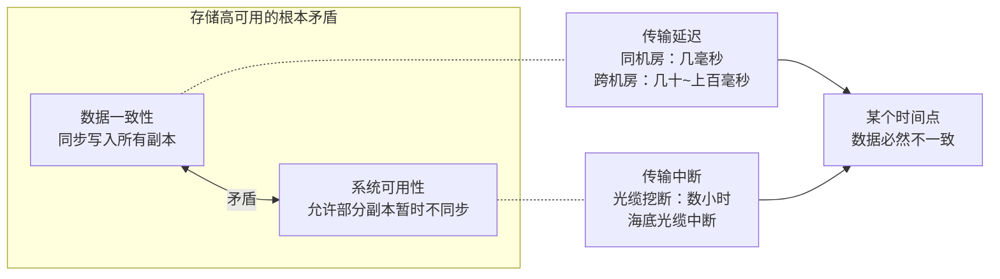
```mermaid
graph LR
    subgraph 存储高可用的根本矛盾
        A["数据一致性<br/>同步写入所有副本"] <-->|"矛盾"| B["系统可用性<br/>允许部分副本暂时不同步"]
    end

    A -.- C["传输延迟<br/>同机房：几毫秒<br/>跨机房：几十~上百毫秒"]
    B -.- D["传输中断<br/>光缆挖断：数小时<br/>海底光缆中断"]

    C --> E["某个时间点<br/>数据必然不一致"]
    D --> E

```

综合分析，无论是正常情况下的传输延迟，还是异常情况下的传输中断，都会导致系统的数据在某个时间点或者时间段是不一致的，而数据的不一致又会导致业务问题；但如果完全不做冗余，系统的整体高可用又无法保证。所以**存储高可用的难点不在于如何备份数据，而在于如何减少或者规避数据不一致对业务造成的影响**。

分布式领域里面有一个著名的CAP定理，从理论上论证了存储高可用的复杂度。也就是说，存储高可用不可能同时满足"一致性（Consistency）、可用性（Availability）、分区容错性（Partition tolerance）"，最多满足其中两个，这就要求我们在做架构设计时结合业务进行取舍。

### 2.4 高可用状态决策

无论是计算高可用还是存储高可用，其基础都是"**状态决策**"，即系统需要能够判断当前的状态是正常还是异常，如果出现了异常就要采取行动来保证高可用。如果状态决策本身都是有错误或者有偏差的，那么后续的任何行动和处理无论多么完美也都没有意义和价值。

但在具体实践的过程中，恰好存在一个本质的矛盾：**通过冗余来实现的高可用系统，状态决策本质上就不可能做到完全正确**。下面基于几种常见的决策方式进行详细分析。

#### 2.4.1 独裁式

独裁式决策指的是存在一个独立的决策主体（"决策者"），负责收集信息然后进行决策；所有冗余的个体（"上报者"），都将状态信息发送给决策者。

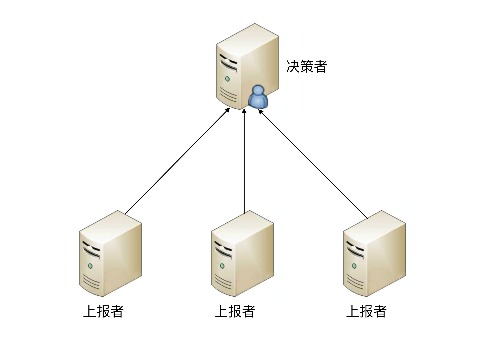

独裁式的决策方式不会出现决策混乱的问题，因为只有一个决策者。但问题也正是在于只有一个决策者——当决策者本身故障时，整个系统就无法实现准确的状态决策。如果决策者本身又做一套状态决策，那就陷入一个递归的死循环了。

#### 2.4.2 协商式

协商式决策指的是两个独立的个体通过交流信息，然后根据规则进行决策，**最常用的协商式决策就是主备决策**。

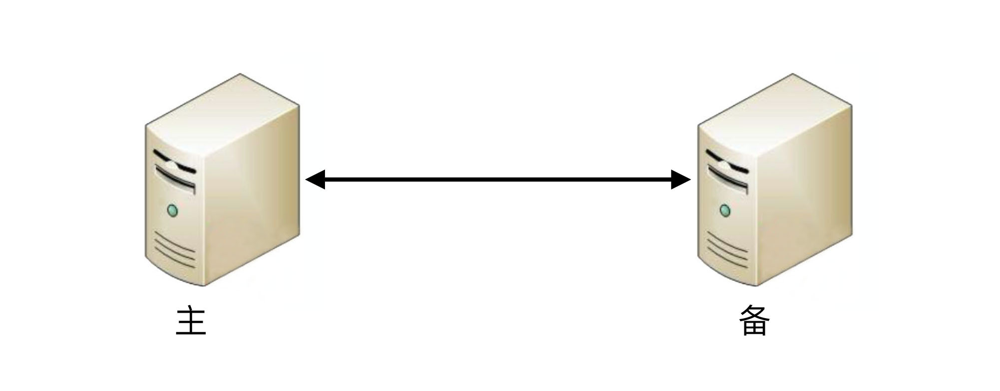

这个架构的基本协商规则可以设计成：

- 2台服务器启动时都是备机
- 2台服务器建立连接
- 2台服务器交换状态信息
- 某1台服务器做出决策，成为主机；另一台服务器继续保持备机身份

协商式决策的架构不复杂，规则也不复杂，其难点在于：如果两者的信息交换出现问题（比如主备连接中断），此时状态决策应该怎么做？

**困境一：备机认为主机故障**

如果备机在连接中断的情况下认为主机故障，那么备机需要升级为主机。但实际上此时主机并没有故障，那么系统就出现了两个主机，这与设计初衷（1主1备）是不符合的。

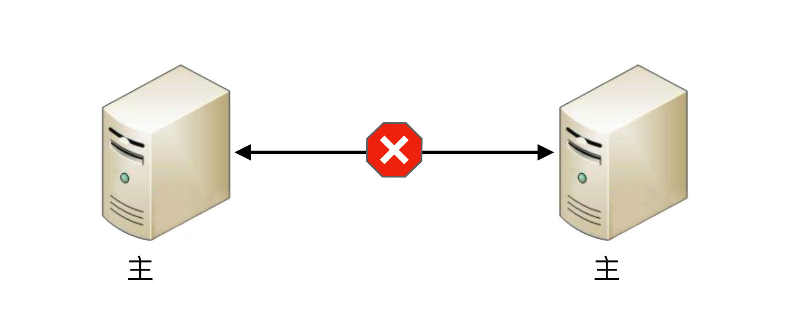

**困境二：备机不认为主机故障**

如果备机在连接中断的情况下不认为主机故障，则此时如果主机真的发生故障，那么系统就没有主机了，这同样与设计初衷（1主1备）是不符合的。

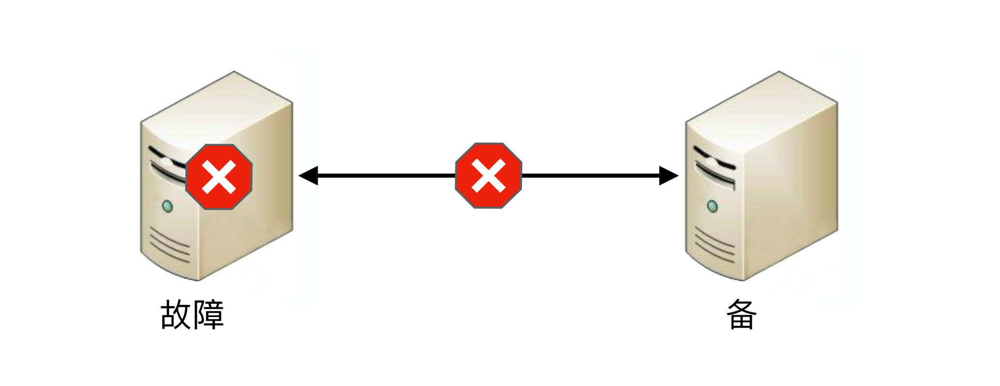

**困境三：增加更多连接**

如果为了规避连接中断对状态决策带来的影响，可以增加更多的连接（例如双连接、三连接）。这样虽然能够降低连接中断对状态带来的影响（注意：只能降低，不能彻底解决），但同时又引入了这几条连接之间信息取舍的问题——如果不同连接传递的信息不同，应该以哪个连接为准？实际上这也是一个无解的答案，无论以哪个连接为准，在特定场景下都可能存在问题。

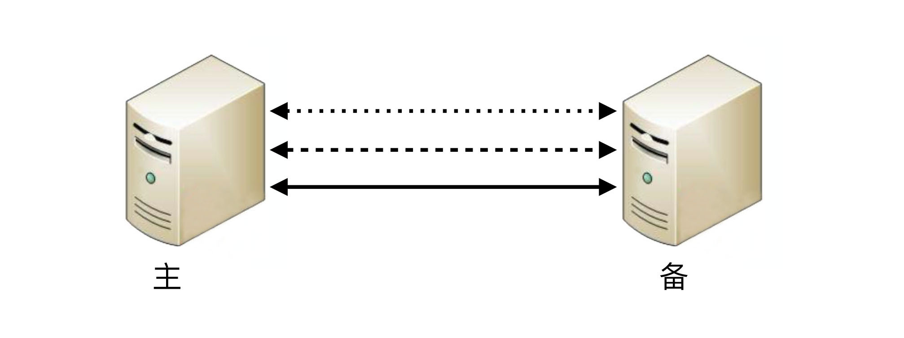

综合分析，协商式状态决策在某些场景总是存在一些问题的。这个困境的本质是：**在有限的信息下做出确定的决策，是不可能的**。连接中断后，备机无法区分"主机真的故障了"和"只是连接断了但主机还活着"——这需要"上帝视角"才能做到，而分布式系统中不存在上帝视角。

#### 2.4.3 民主式

民主式决策指的是多个独立的个体通过投票的方式来进行状态决策。例如，ZooKeeper集群在选举leader时就是采用这种方式。

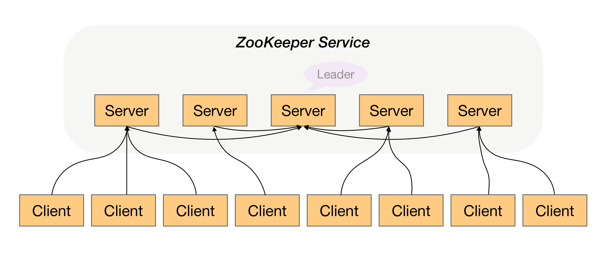

民主式决策和协商式决策比较类似，其基础都是独立的个体之间交换信息，每个个体做出自己的决策，然后按照"**多数取胜**"的规则来确定最终的状态。不同点在于民主式决策比协商式决策要复杂得多——ZooKeeper的选举算法ZAB，绝大部分人都看得云里雾里，更不用说用代码来实现这套算法了。

**脑裂问题**：民主式决策还有一个固有的缺陷——脑裂。这个词来源于医学，指人体左右大脑半球的连接被切断后，左右脑因为无法交换信息，导致各自做出决策，然后身体受到两个大脑分别控制，会做出各种奇怪的动作。例如：当一个脑裂患者更衣时，他有时会一只手将裤子拉起，另一只手却将裤子往下脱。

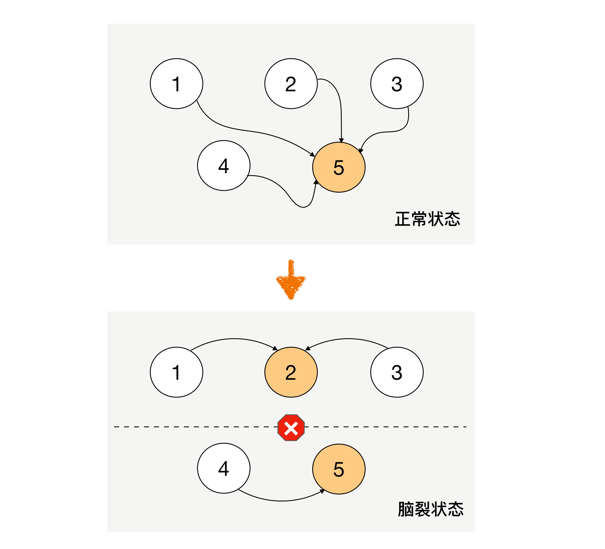

脑裂的根本原因是，原来统一的集群因为连接中断，造成了两个独立分隔的子集群，每个子集群单独进行选举，于是选出了2个主机。从图中可以看到：正常状态的时候，节点5作为主节点，其他节点作为备节点；当连接发生故障时，节点1、节点2、节点3形成了一个子集群，节点4、节点5形成了另外一个子集群，这两个子集群的连接已经中断，无法进行信息交换。按照民主决策的规则和算法，两个子集群分别选出了节点2和节点5作为主节点——此时整个系统就出现了两个主节点，系统状态混乱了。

**解决脑裂的代价**：为了解决脑裂问题，民主式决策的系统一般都采用"投票节点数必须超过系统总节点数一半"规则来处理。如图中那种情况，节点4和节点5形成的子集群总节点数只有2个，没有达到总节点数5个的一半，因此这个子集群不会进行选举。这种方式虽然解决了脑裂问题，但同时降低了系统整体的可用性——如果系统不是因为脑裂问题导致投票节点数过少，而真的是因为节点故障（例如节点1、节点2、节点3真的发生了故障），此时系统也不会选出主节点，整个系统就相当于宕机了，尽管此时还有节点4和节点5是正常的。

**三种决策方式对比**：

| 决策方式 | 原理 | 优势 | 缺陷 | 典型应用 |
|---------|------|------|------|---------|
| **独裁式** | 单一决策者收集信息并决策 | 不会决策混乱，实现简单 | 决策者本身故障时系统瘫痪；递归问题 | 主备切换中的Keepalived |
| **协商式** | 两个体通过交流信息+规则决策 | 架构不复杂，适合双机 | 连接中断时：认为主机故障→双主；不认为→无主 | MySQL主备复制 |
| **民主式** | 多个体投票，多数取胜 | 分布式决策，无单点 | **脑裂**问题；防脑裂方案降低可用性；算法复杂 | ZooKeeper ZAB选举 |

**三种方式的本质矛盾**：

独裁式的矛盾是"谁来监督监督者"——决策者本身不可靠时系统就失去决策能力。协商式的矛盾是"有限信息下的确定性判断不可能"——连接中断后无法区分真故障和假故障。民主式的矛盾是"分区容忍与一致性的取舍"——防止脑裂需要牺牲可用性，保持可用性就冒脑裂的风险。

这三种矛盾归结到一点：**分布式系统中不存在完美的状态决策方案**。这不是技术能力的问题，而是由分布式系统的本质特征决定的——信息传递有延迟、有丢失、有乱序，在这些约束下做到完全正确的决策是不可能的。

> **深度注记**：无论采取何种方案，状态决策都不可能任何场景下都没有问题。但完全不做高可用方案又会产生更大的问题。架构师的核心工作是在各种不完美方案中**权衡选择最适合当前业务的方案**——这再次印证了架构设计"判断和取舍"的本质。选择的关键在于：业务能容忍哪种缺陷？如果脑裂的代价远大于短暂不可用，就选择防脑裂方案；如果短暂不可用的代价远大于脑裂风险，就选择优先保证可用性的方案。

---

## 三、可扩展性

### 3.1 定义与两大条件

> **可扩展性**：系统为了应对将来需求变化而提供的一种扩展能力，当有新需求出现时，系统不需要或者仅需要少量修改就可以支持，无须整个系统重构或者重建。

由于软件系统固有的多变性，新的需求总会不断提出来，因此可扩展性显得尤其重要。在软件开发领域，面向对象思想的提出，就是为了解决可扩展性带来的问题；后来的设计模式，更是将可扩展性做到了极致。得益于设计模式的巨大影响力，几乎所有的技术人员对于可扩展性都特别重视。

设计具备良好可扩展性的系统，有两个基本条件：

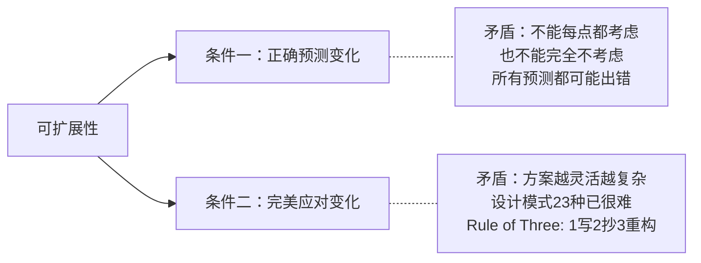
```mermaid
graph LR
    A[可扩展性] --> B["条件一：正确预测变化"]
    A --> C["条件二：完美应对变化"]

    B -.- B1["矛盾：不能每点都考虑<br/>也不能完全不考虑<br/>所有预测都可能出错"]
    C -.- C1["矛盾：方案越灵活越复杂<br/>设计模式23种已很难<br/>Rule of Three: 1写2抄3重构"]

```

### 3.2 预测变化的内在矛盾

软件系统与硬件或者建筑相比，有一个很大的差异：软件系统在发布后，还可以不断地修改和演进。这就意味着**不断有新的需求需要实现**。

如果新需求能够少改代码甚至不改代码就可以实现，那当然是皆大欢喜；否则来一个需求就要求系统大改一次，成本会非常高，程序员心里也不爽（改来改去），产品经理也不爽（做得那么慢），老板也不爽（那么多人就只能干这么点事）。

因此作为架构师，我们总是试图去预测所有的变化，然后设计完美的方案来应对。当下一次需求真正来临时，架构师可以自豪地说："这个我当时已经预测到了，架构已经完美地支持，只需要一两天工作量就可以了！"

然而理想是美好的，现实却是复杂的。有一句谚语："唯一不变的是变化。"如果按照这个标准去衡量，架构师每个设计方案都要考虑可扩展性：

- 架构师准备设计一个简单的后台管理系统，当架构师考虑用MySQL存储数据时，是否要考虑后续需要用Oracle来存储？
- 当架构师设计用HTTP做接口协议时，是否要考虑要不要支持ProtocolBuffer？
- 甚至更离谱一点，架构师是否要考虑VR技术对架构的影响从而提前做好可扩展性？

如果每个点都考虑可扩展性，架构师会不堪重负，架构设计也会异常庞大且最终无法落地。但架构师也不能完全不做预测，否则可能系统刚上线，马上来新的需求就需要重构，这同样意味着前期很多投入的工作量也白费了。

同时，"预测"这个词本身就暗示了不可能每次预测都是准确的。如果预测的事情出错，我们期望中的需求迟迟不来，甚至被明确否定，那么基于预测做的架构设计就没什么作用，投入的工作量也就白费了。

综合分析，预测变化的复杂性在于：

| 极端 | 表现 | 后果 |
|------|------|------|
| 每个点都考虑可扩展性 | 架构异常庞大，无法落地 | 架构师不堪重负 |
| 完全不考虑可扩展性 | 系统刚上线就来新需求 | 重构成本高，前期投入白费 |
| 所有预测都准确 | —— | 不可能——预测本身就暗示可能出错 |

对于架构师来说，如何把握预测的程度和提升预测结果的准确性，是一件很复杂的事情，而且没有通用的标准可以简单套上去，更多是靠自己的经验、直觉。所以架构设计评审的时候，经常会出现两个设计师对某个判断争得面红耳赤的情况，原因就在于没有明确标准，不同的人理解和判断有偏差，而最终又只能选择其中一个判断。

**2年法则**：

那么我们设计架构的时候要怎么办呢？根据以往的职业经历和思考，我提炼出一个"2年法则"供你参考：**只预测2年内的可能变化，不要试图预测5年甚至10年后的变化。**

当然，你可能会有疑问：为什么一定是2年呢？有的行业变化快，有的行业变化慢，不应该是按照行业特点来选择具体的预测周期吗？

理论上来说确实如此，但实际操作的时候你会发现，如果你要给出一个让大家都信服的行业预测周期，其实是很难的。我之所以说要预测2年，是因为变化快的行业，你能够预测2年已经足够了；而变化慢的行业，本身就变化慢，预测本身的意义不大，预测5年和预测2年的结果是差不多的。所以"2年法则"在大部分场景下都是适用的。

### 3.3 应对变化的两种方案

假设架构师经验非常丰富，目光非常敏锐，看问题非常准，所有的变化都能准确预测，是否意味着可扩展性就很容易实现了呢？也没那么理想！因为预测变化是一回事，采取什么方案来应对变化，又是另外一个复杂的事情。即使预测很准确，如果方案不合适，则系统扩展一样很麻烦。

#### 方案一：提炼出"变化层"和"稳定层"

第一种应对变化的常见方案是：**将不变的部分封装在一个独立的"稳定层"，将"变化"封装在一个"变化层"（也叫"适配层"）。这种方案的核心思想是通过变化层来隔离变化。**

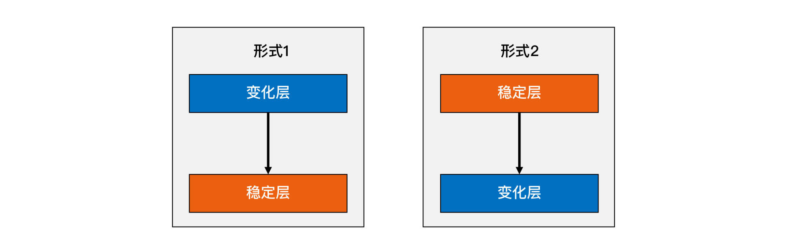

无论是变化层依赖稳定层，还是稳定层依赖变化层都是可以的，需要根据具体业务情况来设计。

如果系统需要支持XML、JSON、ProtocolBuffer三种接入方式，那么最终的架构就是"形式1"架构；如果系统需要支持MySQL、Oracle、DB2数据库存储，那么最终的架构就变成了"形式2"的架构了。

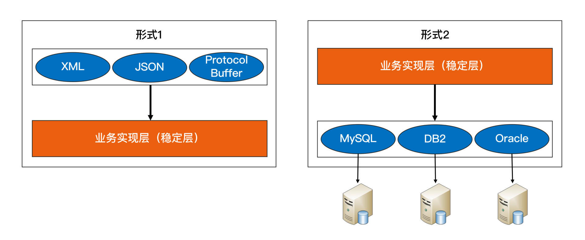

无论采取哪种形式，通过剥离变化层和稳定层的方式应对变化，都会带来两个主要的复杂性相关的问题：

**问题一：变化层和稳定层如何拆分？**

对于哪些属于变化层、哪些属于稳定层，很多时候并不是像前面的示例（不同接口协议或者不同数据库）那样明确。不同的人有不同的理解，导致架构设计评审的时候可能吵翻天。

**问题二：变化层和稳定层之间的接口如何设计？**

对于稳定层来说，接口肯定是越稳定越好；但对于变化层来说，在有差异的多个实现方式中找出共同点，并且还要保证当加入新的功能时，原有的接口不需要太大修改，这是一件很复杂的事情，所以接口设计同样至关重要。

例如，MySQL的REPLACE INTO和Oracle的MERGE INTO语法和功能有一些差异，那么存储层如何向稳定层提供数据访问接口呢？是采取MySQL的方式，还是采取Oracle的方式，还是自适应判断？如果再考虑DB2的情况呢？

#### 方案二：提炼出"抽象层"和"实现层"

第二种常见的应对变化的方案是：**提炼出一个"抽象层"和一个"实现层"。**如果说方案一的核心思想是通过变化层来隔离变化，那么方案二的核心思想就是通过实现层来**封装变化**。

因为抽象层的接口是稳定的不变的，我们可以基于抽象层的接口来实现统一的处理规则，而实现层可以根据具体业务需求定制开发不同的实现细节，所以当加入新的功能时，只要遵循处理规则然后修改实现层，增加新的实现细节就可以了，无须修改抽象层。

方案二典型的实践就是设计模式和规则引擎。考虑到绝大部分技术人员对设计模式都非常熟悉，我以设计模式为例来说明这种方案的复杂性。

下面是设计模式的"装饰者"模式的类关系图：

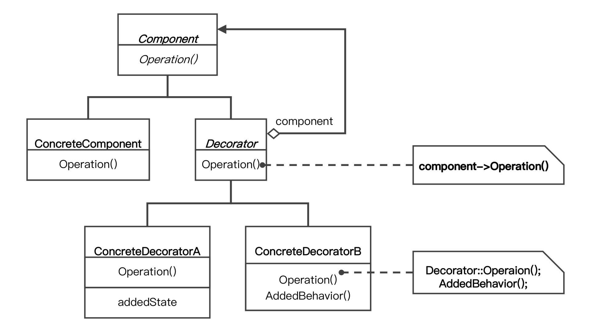

图中的Component和Decorator就是抽象出来的规则，这个规则包括几部分：

1. Component和Decorator类
2. Decorator类继承Component类
3. Decorator类聚合了Component类

这个规则一旦抽象出来后就固定了，不能轻易修改。例如把规则3去掉，就无法实现装饰者模式的目的了。

装饰者模式相比传统的继承来实现功能，确实灵活很多。例如，《设计模式》中装饰者模式的样例"TextView"类的实现，用了装饰者之后，能够灵活地给TextView增加额外更多功能，包括可以增加边框、滚动条和背景图片等。这些功能上的组合不影响规则，只需要按照规则实现即可。

但装饰者模式相对普通的类实现模式，明显要复杂多了。本来一个函数或者一个类就能搞定的事情，现在要拆分成多个类，而且多个类之间必须按照装饰者模式来设计和调用。

规则引擎和设计模式类似，都是通过灵活的设计来达到可扩展的目的，但"灵活的设计"本身就是一件复杂的事情——不说别的，光是把23种设计模式全部理解和备注，都是一件很困难的事情。

### 3.4 实践原则：1写2抄3重构

那么，我们在实际工作中具体如何来应对变化呢？Martin Fowler在他的经典书籍《重构》中给出一个"Rule of three"的原则，原文是"Three Strikes And You Refactor"，中文一般翻译为"事不过三，三则重构"。

而我将其翻译为"1写2抄3重构"，也就是说你不要一开始就考虑复杂的可扩展性应对方法，而是等到第三次遇到类似的实现的时候再来重构，重构的时候采取隔离或者封装的方案。

**为什么是"三次"而不是"一次"或"两次"？**

- 一次就抽象：没有足够的相似需求来验证抽象方向是否正确，很可能方向就是错的
- 两次就抽象：相似的模式已经出现，但可能只是巧合，还不确定是否会继续出现
- 三次才抽象：模式已经确认，抽象方向可靠，投入产出比合理

| 阶段 | 做法 | 适用场景 | 核心理由 | 风险 |
|------|------|---------|---------|------|
| **1写** | 直接快速实现，不考虑可扩展性 | 业务能否做起来还不确定 | 过早抽象方向可能错 | 抽象方向错误，浪费精力 |
| **2抄** | 拷贝已有代码，快速修改上线 | 第二个相似需求，仍不抽象 | 两次不足以确认模式 | 代码重复，维护成本上升 |
| **3重构** | 用隔离或封装方案重构 | 第三次相似需求出现，模式已确认 | 三次确认，抽象方向可靠 | 重构成本，但模式已确认所以可控 |

**案例详解：对接第三方支付**——

- **1写**：最开始你们选择了微信钱包对接，此时不需要考虑太多可扩展性，直接快速对照微信支付的API对接即可，因为业务是否能做起来还不确定。如果这时候就设计一套"统一支付接口"，很可能接口的抽象是基于微信支付的API特点，后面接入支付宝时会发现抽象方向错了。

- **2抄**：后来你们发现业务发展不错，决定要接入支付宝，此时还是可以不考虑可扩展，直接把原来微信支付接入的代码拷贝过来，然后对照支付宝的API快速修改上线。这时候你看到了微信支付和支付宝的差异，但只有两个样本，模式还不清晰——是所有支付渠道都有"支付""退款""查询"三个核心操作？还是有的支付渠道有不同的操作流程？

- **3重构**：因为业务发展不错，为了方便更多用户，你们决定接入银联云闪付。此时三个支付渠道的相似模式已经确认：都有"支付""退款""查询"的核心流程，但具体的参数格式、签名方式、回调机制各不相同。这时候就可以放心地重构了——参考设计模式的模板方法和策略模式将支付对接的功能进行封装。模板方法定义统一的支付流程（创建订单→调用支付→处理回调→更新状态），策略模式封装不同支付渠道的差异（签名算法、参数格式、回调解析等）。

**1写2抄3重构与其他原则的关系**：

- 与"2年法则"的关系：2年法则限制预测的时间范围，1写2抄3重构限制抽象的时机——两者都在防止过度设计
- 与"简单原则"的关系：1写2抄是简单原则的实践——不用过早引入复杂的设计模式；3重构是在模式确认后用适当复杂度换取可扩展性
- 与"演化原则"的关系：1写2抄3重构本身就是演化的实践——先简单实现，再逐步优化

> **深度注记**：1写2抄3重构原则与许式伟的"预测什么不会发生最为重要"一脉相承。过早抽象是万恶之源——没有三次以上相似需求佐证的抽象，很可能方向就是错的。而许式伟的"抽象·分解·组合"循环中，每一轮循环都是在积累对变化的认知，第三次循环时抽象才有了坚实的依据。

---

## 四、低成本

### 4.1 与高性能/高可用的天然冲突

当我们的架构方案只涉及几台或者十几台服务器时，一般情况下成本并不是重点关注的目标。但如果架构方案涉及几百上千甚至上万台服务器，成本就会变成一个非常重要的架构设计考虑点。

例如，A方案需要10000台机器，B方案只需要8000台机器，单从比例来看也就节省了20%的成本，但从数量来看，B方案能节省2000台机器。1台机器成本预算每年大约2万元，这样一年下来就能节省4000万元。4000万元不是小数目，给100人的团队发奖金每人可以发40万元了。通过一个架构方案的设计，就能轻松节约几千万元，不但展现了技术的强大力量，也带来了可观的收益。

当我们设计"高性能""高可用"的架构时，通用的手段都是增加更多服务器来满足要求；而低成本正好与此相反，我们需要减少服务器的数量才能达成低成本的目标。因此低成本本质上是与高性能和高可用冲突的，所以低成本很多时候不会是架构设计的首要目标，而是架构设计的**附加约束**。也就是说，我们首先设定一个成本目标，当我们根据高性能、高可用的要求设计出方案时，评估一下方案是否能满足成本目标，如果不行就需要重新设计架构；如果无论如何都无法设计出满足成本要求的方案，那就只能找老板调整成本目标了。

### 4.2 低成本的复杂度：往往需要创新

低成本给架构设计带来的主要复杂度体现在，**往往只有"创新"才能达到低成本目标**。这里的"创新"既包括开创一个全新的技术领域（这个要求对绝大部分公司太高），也包括引入新技术。如果没有找到能够解决自己问题的新技术，那么就真的需要自己创造新技术了。

**引入新技术的案例**：

| 新技术 | 解决的问题 |
|--------|-----------|
| NoSQL（Memcache、Redis等） | 解决关系型数据库无法应对高并发访问带来的访问压力 |
| 全文搜索引擎（Sphinx、Elasticsearch、Solr） | 解决关系型数据库like搜索的低效问题 |
| Hadoop | 解决传统文件系统无法应对海量数据存储和计算的问题 |

**创造新技术的案例**：

| 公司 | 创造的技术 | 解决的问题 |
|------|-----------|-----------|
| Facebook | HipHop PHP → HHVM | 解决PHP的低效问题。HipHop将PHP翻译为C++执行；HHVM将PHP翻译为字节码由虚拟机执行，类似JVM（HHVM 自 4.0 起仅支持 Hack 语言，不再支持 PHP） |
| 新浪微博 | SSD Cache | 将Redis/MC + MySQL扩展为Redis/MC + SSD Cache + MySQL。SSD Cache作为L2缓存，既解决MC/Redis成本过高、容量小的问题，也解决穿透DB带来的数据库访问压力 |
| LinkedIn | Kafka | 为处理每天5千亿的事件，开发了高效的消息系统 |

无论是引入新技术还是自己创造新技术，都是一件复杂的事情。引入新技术的主要复杂度在于需要去熟悉新技术，并且将新技术与已有技术结合起来；创造新技术的主要复杂度在于需要自己去创造全新的理念和技术，并且新技术跟旧技术相比需要有质的飞跃。

相比来说，**创造新技术复杂度更高**，因此一般中小公司基本都是靠引入新技术来达到低成本的目标；而大公司更有可能自己去创造新的技术来达到低成本的目标，因为大公司才有足够的资源、技术和时间去创造新技术。

> **深度注记**：创造新技术的复杂度远高于引入新技术。一般中小公司靠引入新技术，大公司才有可能创造新技术——因为只有大公司才有足够的资源、技术和时间。这也解释了为什么Google、Facebook、LinkedIn是新技术的主要发源地。规模效应使得创新具有可观的回报：当架构涉及几百上千台服务器时，节省20%就是几千万成本。

---

## 五、安全

安全本身是一个庞大而又复杂的技术领域，并且一旦出问题，对业务和企业形象影响非常大：

- 2016年雅虎爆出史上最大规模信息泄露事件，逾5亿用户资料在2014年被窃取
- 2016年10月美国遭史上最大规模DDoS攻击，东海岸网站集体瘫痪
- 2013年10月，为全国4500多家酒店提供网络服务的浙江慧达驿站网络有限公司，因安全漏洞问题，致2千万条入住酒店的客户信息泄露，由此导致很多敲诈、家庭破裂的后续事件

从技术的角度来讲，安全可以分为两类：一类是功能上的安全，一类是架构上的安全。

### 5.1 功能安全："防小偷"

例如，常见的XSS攻击、CSRF攻击、SQL注入、Windows漏洞、密码破解等，本质上是因为系统实现有漏洞，黑客有了可乘之机。黑客会利用各种漏洞潜入系统，这种行为就像小偷一样——黑客和小偷的手法都是利用系统或家中不完善的地方潜入，并进行破坏或者盗取。因此形象地说，**功能安全其实就是"防小偷"**。

从实现的角度来看，功能安全更多地是和具体的编码相关，与架构关系不大。现在很多开发框架都内嵌了常见的安全功能，能够大大减少安全相关功能的重复开发。但框架只能预防常见的安全漏洞和风险（常见的XSS攻击、CSRF攻击、SQL注入等），无法预知新的安全问题，而且框架本身很多时候也存在漏洞（例如，流行的Apache Struts2就多次爆出了调用远程代码执行的高危漏洞，给整个互联网都造成了一定的恐慌）。

所以功能安全是一个逐步完善的过程，而且往往都是在问题出现后才能有针对性的提出解决方案，我们永远无法预测系统下一个漏洞在哪里，也不敢说自己的系统肯定没有任何问题。换句话讲，功能安全其实也是一个"攻"与"防"的矛盾，只能在这种攻防大战中逐步完善，不可能在系统架构设计的时候一劳永逸地解决。

### 5.2 架构安全："防强盗"

如果说功能安全是"防小偷"，那么**架构安全就是"防强盗"**。强盗会直接用大锤将门砸开，或者用炸药将围墙炸倒；小偷是偷东西，而强盗很多时候就是故意搞破坏，对系统的影响也大得多。因此架构设计时需要特别关注架构安全，尤其是互联网时代，理论上来说系统部署在互联网上时，全球任何地方都可以发起攻击。

传统的架构安全主要依靠防火墙，防火墙最基本的功能就是隔离网络，通过将网络划分成不同的区域，制定出不同区域之间的**访问控制策略**来控制不同信任程度区域间传送的数据流。例如，下图是一个典型的银行系统的安全架构：

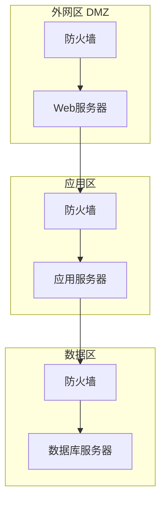
```mermaid
flowchart TB
    subgraph "外网区 DMZ"
        FW1["防火墙"]
        WEB["Web服务器"]
    end

    subgraph "应用区"
        FW2["防火墙"]
        APP["应用服务器"]
    end

    subgraph "数据区"
        FW3["防火墙"]
        DB["数据库服务器"]
    end

    FW1 --> WEB --> FW2 --> APP --> FW3 --> DB
```

从图中你可以看到，整个系统根据不同的分区部署了多个防火墙来保证系统的安全。

防火墙的功能虽然强大，但性能一般，所以在传统的银行和企业应用领域应用较多。但在互联网领域，防火墙的应用场景并不多，原因如下：

| 问题 | 详细说明 |
|------|---------|
| 防火墙性能不足 | 互联网海量用户访问+高并发，防火墙扛不住。传统防火墙设计面向企业级流量，不是面向互联网级流量 |
| DDoS规模惊人 | 2016年知名安全研究人员Brian Krebs的安全博客网站遭遇DDoS攻击，攻击带宽达665Gbps，是目前在网络犯罪领域已知的最大的拒绝服务攻击 |
| 防御成本极高 | 中高端防火墙约10万元/台，每秒抗住约25GB流量。应对665Gbps攻击需约30台防火墙，成本近300万元，还不包括维护成本 |
| 出口带宽被耗尽 | 即使防火墙保住内部系统不受冲击，出口带宽被耗尽时用户也进不来——对用户来说业务已经不可用了。至于是因为用户自己进不去还是因为系统出故障，用户根本不会关心 |
| 平时无用 | 攻击几年才发生一次，设备平时闲置。花费几百万元买一套设备，可能几年都发挥不了任何作用 |

**互联网架构安全的现实选择**：

由于上述原因，互联网系统的架构安全目前并没有太好的设计手段来实现，**更多依靠运营商或云服务商强大的带宽和流量清洗能力**，较少自己设计和实现。这也意味着互联网系统的架构安全是一个"成本与概率"的权衡问题——花几百万买防火墙设备来防御一个几年才发生一次的攻击，投入产出比极低；而通过云服务商的流量清洗服务，按需付费，平时成本几乎为零，攻击时自动生效，是更务实的选择。

**功能安全与架构安全的对比**：

| 维度 | 功能安全（"防小偷"） | 架构安全（"防强盗"） |
|------|-------------------|-------------------|
| 攻击方式 | 利用系统漏洞潜入 | 直接暴力攻击 |
| 典型攻击 | XSS、CSRF、SQL注入 | DDoS、暴力破解 |
| 防御手段 | 框架内嵌安全功能+逐步完善 | 防火墙+带宽+流量清洗 |
| 与架构的关系 | 主要与编码相关，与架构关系不大 | 与架构强相关，但互联网领域缺乏通用方案 |
| 防御特点 | 攻防渐进博弈，无法一劳永逸 | 成本与概率的权衡 |
| 可预测性 | 无法预测下一个漏洞 | 无法预测下一次攻击的规模和时间 |

---

## 六、规模

很多企业级的系统，既没有高性能要求，也没有双中心高可用要求，也不需要什么扩展性，但往往我们一说到这样的系统，很多人都会脱口而出：这个系统好复杂！为什么这样说呢？关键就在于这样的系统往往功能特别多，逻辑分支特别多。特别是有的系统发展时间比较长，不断地往上面叠加功能，后来的人由于不熟悉整个发展历史，可能连很多功能的应用场景都不清楚，或者细节根本无法掌握，面对的就是一个黑盒系统，看不懂、改不动、不敢改、修不了，复杂度自然就感觉很高了。

**规模带来复杂度的主要原因就是"量变引起质变"**，当数量超过一定的阈值后，复杂度会发生质的变化。

### 6.1 功能规模：平方级增长

功能越来越多，导致系统复杂度平方级上升。

我以一个简单的抽象模型来计算一下：假设系统间的功能都是两两相关的，系统的复杂度 = 功能数量 + 功能之间的连接数量。

- 3个功能的系统复杂度 = 3 + C(3,2) = 3 + 3 = 6
- 8个功能的系统复杂度 = 8 + C(8,2) = 8 + 28 = 36

可以看出，具备8个功能的系统的复杂度不是比具备3个功能的系统的复杂度多5，而是多了30——增长速度远超线性，主要原因在于随着系统功能数量增多，功能之间的连接呈平方级（O(n²)）增长。

通过肉眼就可以很直观地看出，具备8个功能的系统复杂度要高得多。

### 6.2 数据规模：超阈值质变

与功能类似，系统数据越来越多时，也会由量变带来质变。最近几年火热的"大数据"就是在这种背景下诞生的。大数据单独成为了一个热门的技术领域，主要原因就是数据太多以后，传统的数据收集、加工、存储、分析的手段和工具已经无法适应，必须应用新的技术才能解决。目前的大数据理论基础是Google发表的三篇大数据相关论文：

| 论文 | 技术领域 | 开创的领域 |
|------|---------|-----------|
| Google File System | 大数据文件存储 | GFS → HDFS |
| Google Bigtable | 列式数据存储 | Bigtable → HBase |
| Google MapReduce | 大数据运算 | MapReduce → Hadoop |

即使我们的数据没有达到大数据规模，数据的增长也可能给系统带来复杂性。最典型的例子莫过于使用关系数据库存储数据。以MySQL为例，MySQL单表的数据因不同的业务和应用场景会有不同的最优值，但不管怎样都肯定是有一定的限度的，一般推荐在5000万行左右。如果因为业务的发展，单表数据达到了10亿行，就会产生很多问题：

- 添加索引会很慢，可能需要几个小时，这几个小时内数据库表是无法插入数据的，相当于业务停机了
- 修改表结构和添加索引存在类似的问题，耗时可能会很长
- 即使有索引，索引的性能也可能会很低，因为数据量太大
- 数据库备份耗时很长

因此，当MySQL单表数据量太大时，我们必须考虑将单表拆分为多表，这个拆分过程也会引入更多复杂性：

- **拆表的规则是什么？** 以用户表为例：是按照用户id拆分表，还是按照用户注册时间拆表？
- **拆完表后查询如何处理？** 以用户表为例：假设按照用户id拆表，当业务需要查询学历为"本科"以上的用户时，要去很多表查询才能得到最终结果，怎么保证性能？

还有很多类似的问题，这些都体现了数据规模带来的复杂度。

### 6.3 规模的本质

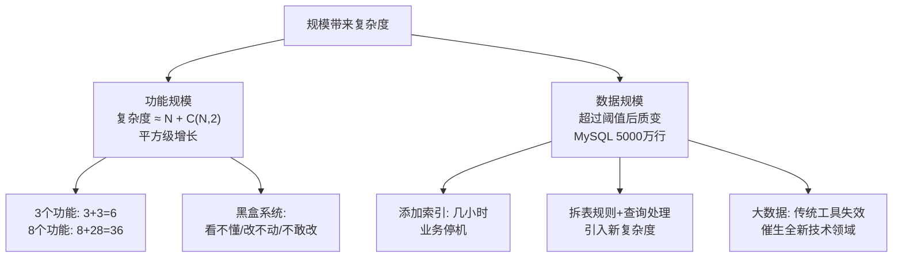
```mermaid
graph TD
    A[规模带来复杂度] --> B["功能规模<br/>复杂度 ≈ N + C(N,2)<br/>平方级增长"]
    A --> C["数据规模<br/>超过阈值后质变<br/>MySQL 5000万行"]

    B --> B1["3个功能: 3+3=6<br/>8个功能: 8+28=36"]
    B --> B2["黑盒系统:<br/>看不懂/改不动/不敢改"]

    C --> C1["添加索引: 几小时<br/>业务停机"]
    C --> C2["拆表规则+查询处理<br/>引入新复杂度"]
    C --> C3["大数据: 传统工具失效<br/>催生全新技术领域"]

```

**规模复杂度的两个维度对比**：

| 维度 | 增长模式 | 阈值 | 典型表现 | 解决方向 |
|------|---------|------|---------|---------|
| 功能规模 | 平方级（N + C(N,2)） | 没有明确阈值，持续恶化 | 黑盒系统、改不动、不敢改 | 模块化分解、微服务化 |
| 数据规模 | 超阈值质变 | MySQL 5000万行 | 索引失效、查询超慢、备份困难 | 分库分表、大数据技术 |

**大数据的本质**：当数据量超出传统工具处理能力时，催生了全新的技术领域（Google三篇论文：GFS、Bigtable、MapReduce）。这不仅是技术升级，而是**范式转换**——原有的技术体系不再适用，必须采用全新的思路和工具。

**规模与其他复杂度来源的关联**：

规模本身可能不是独立的复杂度来源，但它是其他复杂度来源的"催化剂"——当规模超过阈值后，原本不是问题的复杂度变成了主要矛盾：

- 高性能：规模小时单机足够，规模大时必须集群
- 高可用：规模小时一台机器出问题影响有限，规模大时一台机器出问题影响大量用户
- 低成本：规模小时几台机器成本可忽略，规模大时几百台机器成本成为关键
- 安全：规模小时攻击面有限，规模大时成为高价值目标
- 可扩展性：规模小时功能变化不多，规模大时功能和功能间连接快速增长

这解释了为什么"量变引起质变"——规模的增长使得其他复杂度从"可以忽略"变为"必须解决"。

---

## 总结

| 复杂度来源 | 核心矛盾 | 关键洞察 |
|-----------|---------|---------|
| **高性能** | 单机多进程/多线程的复杂性 + 集群任务分配/分解的复杂性 | 分解并非越细越好，系统间调用开销会抵消分解收益；Nginx/Redis/Memcache不同方案都能高性能 |
| **高可用** | 冗余是唯一手段，但冗余引入状态决策问题 | 存储高可用的难点是数据不一致而非数据备份；CAP定理理论论证了不可能三角；状态决策不可能完全正确 |
| **可扩展性** | 预测变化的"度"难以把握 + 应对变化的方案本身复杂 | 2年法则 + 1写2抄3重构；过早抽象是万恶之源；变化层/稳定层 vs 抽象层/实现层两种方案各有难点 |
| **低成本** | 与高性能/高可用天然冲突 | 往往只有创新才能达到低成本；大公司创造新技术，小公司引入新技术；10000台→8000台=年省4000万 |
| **安全** | 功能安全是"攻防"渐进博弈；架构安全缺乏通用方案 | 功能安全="防小偷"（XSS/CSRF/SQL注入）；架构安全="防强盗"（DDoS 665Gbps）；互联网系统更多依赖运营商/云服务商 |
| **规模** | 量变引起质变——功能连接平方级（O(n²)）增长，数据量超阈值质变 | 3功能→6复杂度，8功能→36复杂度；MySQL 5000万行阈值；大数据本质是数据规模超出传统工具能力的质变 |

**复杂度来源之间的关联**：

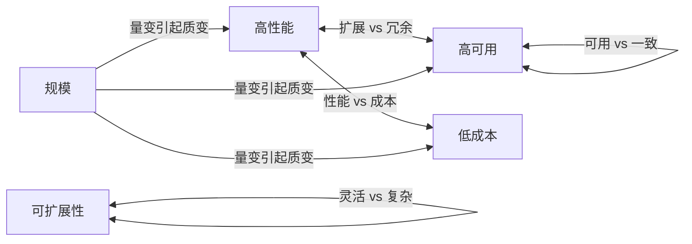
```mermaid
graph LR
    HP[高性能] <-->|"扩展 vs 冗余"| HA[高可用]
    HP <-->|"性能 vs 成本"| LC[低成本]
    HA <-->|"可用 vs 一致"| HA
    SC[可扩展性] <-->|"灵活 vs 复杂"| SC
    SZ[规模] -->|"量变引起质变"| HP
    SZ -->|"量变引起质变"| HA
    SZ -->|"量变引起质变"| LC
```

**思考题**：
1. 你所在的业务体系中，高性能的系统采用的是哪种方式（单机优化/任务分配/任务分解）？目前是否有改进和提升的空间？
2. 高性能和高可用是很多系统的核心复杂度，你认为哪个会更复杂一些？理由是什么？
3. 你在具体代码中使用过哪些可扩展的技术？最终的效果如何？
4. 学习了6大复杂度来源后，结合你所在的业务，分析一下主要的复杂度是这其中的哪些部分？是否还有其他复杂度原因？

**关联阅读**：
- [架构设计目的与评判](04-架构设计目的与评判.md)
- [架构设计原则](06-架构设计原则.md)
- [架构设计流程：识别复杂度](07-架构设计流程.md)
- [CAP理论](10-CAP理论与高可用存储.md)

---

> **延伸视角**（许式伟）
>
> 华仔对六大复杂度来源的系统化分析，为架构设计提供了清晰的"诊断框架"。从许式伟的"抽象·分解·组合"心法来看，六大复杂度恰好对应了不同层面的"分解"挑战：
>
> - **高性能**：计算层面的分解（单机→多机，单体→微服务），但分解过度会增加组合开销
> - **高可用**：冗余层面的分解（主机→备机），但冗余引入了状态决策的组合难题
> - **可扩展性**：时间维度的分解（变化层/稳定层），但预测变化的准确性决定了分解方向是否正确
> - **低成本**：资源层面的约束，迫使架构师在分解与组合中寻求更优解（创新）
> - **安全**：信任边界的分解（网络隔离），但互联网环境使得传统边界失效
> - **规模**：量变到质变的临界点，当规模超过阈值后，原有的抽象和分解方案不再适用
>
> **融合洞见**：六大复杂度来源不是孤立存在的，它们往往**同时出现且相互制约**。架构设计的本质，就是在这些相互冲突的复杂度之间做出**权衡取舍**——这正是架构设计"判断和取舍"思维（而非"逻辑和实现"思维）的集中体现。
