# 架构设计原则 | 合适·简单·演化·开闭

## 章节导言

架构设计的核心挑战在于**不确定性**——同样的系统，不同公司做出来的架构差异很大但都能正常运行；同样的方案，不同设计师有截然不同的判断。编程有语法约束，架构设计没有通用规范，更多是面对多种可能性时进行选择。

可是一旦涉及"选择"，就很容易让架构师陷入两难的境地：

- 是要选择业界最先进的技术，还是选择团队目前最熟悉的技术？如果选了最先进的技术后出了问题怎么办？如果选了目前最熟悉的技术，后续技术演进怎么办？
- 是要选择Google的Angular方案来做，还是选择Facebook的React来做？Angular看起来更强大，但React看起来更灵活？
- 是要选MySQL还是MongoDB？团队对MySQL很熟悉，但是MongoDB更加适合业务场景？
- 淘宝的电商网站架构很完善，我们新做一个电商网站，是否简单地照搬淘宝就可以了？

业务千变万化，技术层出不穷，设计理念也是百花齐放，看起来似乎很难有一套通用的规范来适用所有的架构设计场景。但是在研究了架构设计的发展历史、多个公司的架构发展过程（QQ、淘宝、Facebook等）、众多的互联网公司架构设计后，可以提炼出几条共性的隐含原则。李运华提出了三条实践原则——**合适、简单、演化**；许式伟则从架构治理的哲学高度提出了**开闭原则（OCP）**作为架构设计的根本原则。两者并非矛盾，而是互补：前者指导"如何做选择"，后者回答"如何让架构稳定与灵活"。

**核心问题**：
1. 为什么"合适优于业界领先"？"亿级用户平台"为何必然失败？BAT架构师到创业团队为何做不出成绩？
2. 为什么软件领域的"复杂"代表问题，而非先进？结构复杂性和逻辑复杂性各自带来哪些具体问题？
3. 为何"演化优于一步到位"？淘宝六阶段和手机QQ四阶段的架构如何印证演化原则？演化是否包含"革命式重构"？
4. 开闭原则如何与三原则统一？架构如何做到"稳定"与"灵活"兼得？接口设计如何精确落地OCP？

**原则速览**：

| 原则 | 宣言 | 一句话解释 |
|------|------|-----------|
| 合适原则 | 合适优于业界领先 | 架构设计必须基于当前约束，而非对"业界领先"的向往 |
| 简单原则 | 简单优于复杂 | 软件的复杂影响整个生命周期，不是设计时的问题而是长期的问题 |
| 演化原则 | 演化优于一步到位 | 软件需要根据业务发展不断变化，不存在一劳永逸的架构 |
| 开闭原则 | 对扩展开放，对修改关闭 | 模块业务确定性（闭）+ 变化点开放（开）= 可治理的架构 |

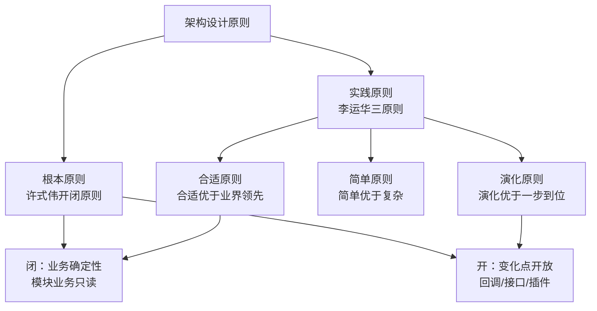

---

## 一、合适原则

### 1.1 宣言

> **合适优于业界领先**

优秀的技术人员都有很强的技术情结，当他们做方案或者架构时，总想不断地挑战自己，想达到甚至优于业界领先水平是其中一个典型表现，因为这样才能够展现自己的优秀，才能在年终KPI绩效总结里面骄傲地写上"设计了XX方案，达到了和Google相同的技术水平""XX方案的性能测试结果大大优于阿里集团的YY方案"。

但现实是，**大部分这样想和这样做的架构，最后可能都以失败告终！**

### 1.2 失败的三重根因

| 根因 | 表现 | 说明 |
|------|------|------|
| **将军难打无兵之仗** | 没那么多人，却想干那么多活 | 大公司分工细，一个小系统可能就是十几个人；而大部分公司某个业务团队可能就十几个人。十几个人的团队想做几十个人团队的事，难度可想而知 |
| **罗马不是一天建成的** | 没那么多积累，却想一步登天 | 业界领先的方案不是天才灵机一动做出来的，而是经过几年时间才逐步完善。阿里中间件团队2008年成立，发展十年才成熟。单纯靠拍脑袋或头脑风暴，不可能和真正的实战相比 |
| **冰山下面才是关键** | 没有那么卓越的业务场景，却幻想灵光一闪 | 业界领先的方案其实都是"逼"出来的——业务发展到一定阶段，量变导致质变，出现新问题，已有方式无法应对，通过创新和尝试才有了新方案。GFS为何在Google诞生而不是Microsoft？因为Google有庞大数据，而非工程师更聪明 |

### 1.3 案例："亿级用户平台"的失败

2011年，某个几个人规模的业务团队，雄心勃勃地提出要做一个和腾讯QQ（那时候微信还没起来）一拼高下的"亿级用户平台"。最后结果当然是不出所料的失败了。

分析原因：没有腾讯那么多的人（当然钱差得更多），没有QQ那样海量用户的积累，没有QQ那样的业务——上面提到的3个失败原因全占了。注意这里的失败不是说系统做不出来，而是系统没有按照最初的目标来实现。

**过度设计的恶果**：

这个案例也揭示了过度设计的典型后果——该团队一开始就设计出了40多个子系统，投入大量人力开发了将近1年时间才跌跌撞撞正式上线。上线后发现：

- 系统复杂无比，运维效率低下，每次业务版本升级都需要十几个子系统同步升级，操作步骤复杂，容易出错，出错后回滚还可能带来二次问题
- 每次版本开发和升级都需要十几个子系统配合，开发效率低下
- 子系统数量太多，关系复杂，小问题不断，而且出问题后定位困难
- 开始设计的号称TPS 50000/秒的系统，实际TPS连500都不到

由于业务没有发展，最初的设计人员陆续离开。后来接手的团队，无奈又花了2年时间将系统重构，合并很多子系统，将原来40多个子系统合并成不到20个子系统，整个系统才逐步稳定下来。

### 1.4 合适原则的本质

真正优秀的架构都是在企业当前人力、条件、业务等各种约束下设计出来的，能够合理地将资源整合在一起并发挥出最大功效，并且能够快速落地。这也是很多BAT出来的架构师到了小公司或者创业团队反而做不出成绩的原因——没有了大公司的平台、资源、积累，只是生搬硬套大公司的做法，失败的概率非常高。

> **深度注记**：合适原则的本质是**约束思维**：架构设计必须基于当前约束（人力、时间、技术积累、业务规模），而非基于对"业界领先"的向往。这与许式伟强调的"预测什么不会发生最为重要"一脉相承——认清约束，才能防止过度设计。没有约束的"理想方案"不是架构设计，是技术幻想。

**合适原则的实践检查清单**：

在做架构设计时，可以用以下问题来检验是否遵循了合适原则：

- [ ] 当前团队有多少人？方案需要多少人来实现和维护？
- [ ] 团队对方案涉及的技术有多熟悉？学习曲线有多陡？
- [ ] 业务当前的数据量和用户量是多少？方案的设计容量是否远超当前需求？
- [ ] 方案设计的子系统数量是否与团队规模匹配？10个人的团队维护40个子系统现实吗？
- [ ] 有没有参考业界类似规模公司的方案，而非直接参考BAT的方案？
- [ ] 方案能否在可接受的时间范围内落地？如果需要1年以上，业务能否等待？

---

## 二、简单原则

### 2.1 宣言

> **简单优于复杂**

软件架构设计是一门技术活。从历史上看，无论是瑞士的钟表还是瓦特的蒸汽机，无论是莱特兄弟发明的飞机还是摩托罗拉发明的手机，无一不是越来越精细、越来越复杂。因此当我们进行架构设计时，会自然而然地想把架构做精美、做复杂，这样才能体现我们的技术实力，也才能够将架构做成一件艺术品。

由于软件架构和建筑架构表面上的相似性，我们也会潜意识地将对建筑的审美观点移植到软件架构上面。我们惊叹于长城的宏伟、泰姬陵的精美、悉尼歌剧院的艺术感、迪拜帆船酒店的豪华感，因此对于我们自己亲手打造的软件架构，我们也希望它宏伟、精美、艺术、豪华……总之就是不能寒酸、不能简单。

团队的压力有时也会有意无意地促进我们走向复杂的方向。因为大部分人在评价一个方案水平高低的时候，复杂性是其中一个重要的参考指标。例如设计一个主备方案，如果你用心跳来实现，可能大家都认为这太简单了；但如果你引入ZooKeeper来做主备决策，可能很多人会认为这个方案更加"高大上"一些，毕竟ZooKeeper使用的是ZAB协议，而ZAB协议本身就很复杂。其实真正理解ZAB协议的人很少，但并不妨碍我们都知道ZAB协议很优秀。

然而，"复杂"在制造领域代表先进，在建筑领域代表领先，但在**软件领域，却恰恰相反，代表的是"问题"**。

### 2.2 为何软件的"复杂"是问题？

软件与建筑的本质差异：**建筑一旦完成（甚至一旦开建）就不可再变，而软件却需要根据业务的发展不断地变化**。复杂的电路意味着更强大的功能，因为电路一旦设计好后进入生产就不会再变，复杂性只是在设计时带来影响；而一个软件系统在投入使用后，后续还有源源不断的需求要实现，因此要不断地修改系统，复杂性在整个系统生命周期中都有很大影响。

复杂的两个维度：

#### 结构复杂性

结构复杂的系统几乎毫无例外具备两个特点：组成复杂系统的组件数量更多；同时这些组件之间的关系也更加复杂。

组件数量递增带来的复杂性：

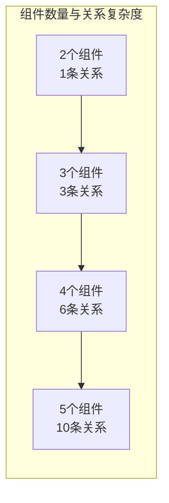

模块设计四原则：

1. **模块边界清晰** — 模块之间的关系应该通过接口来表达，模块内部实现不应该对外暴露
2. **依赖关系稳定** — 稳定的模块不要依赖不稳定的模块，应该反过来
3. **接口越小越好** — 接口应该体现该模块的职能，而不是把所有东西都堆在一起
4. **最小惊讶原则** — 接口的行为应该与使用者的预期一致，不能出现奇奇怪怪的副作用

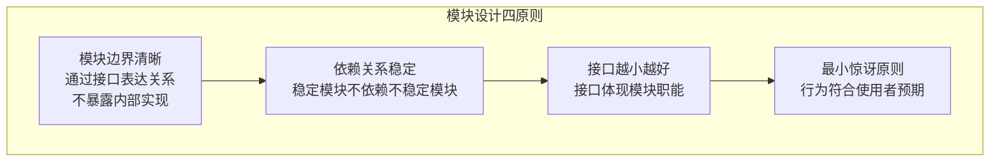

贫血模型 vs 充血模型 vs 六边形架构演进：

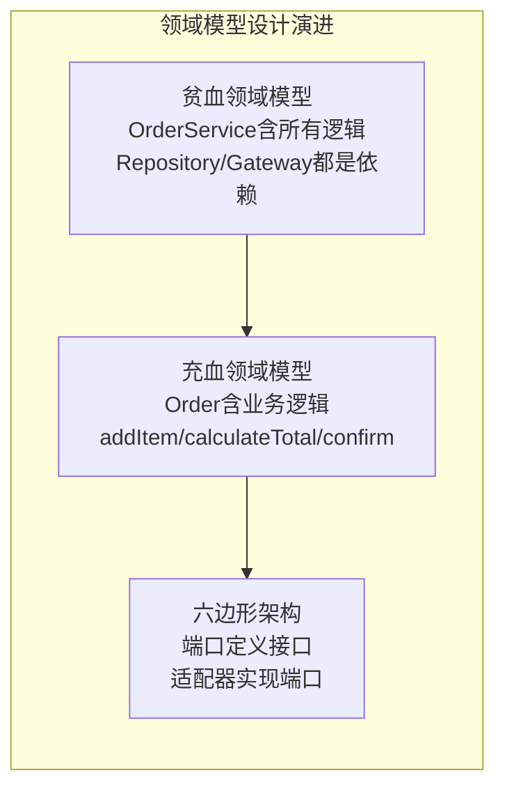

- 贫血模型：业务逻辑散落在 Service 层，对外部组件的依赖侵入核心
- 充血模型：业务逻辑收敛到领域对象，外部依赖通过接口注入
- 六边形架构：核心领域模型通过端口与外部适配器解耦

结构上的复杂性存在三个问题：

| 问题 | 说明 | 量化示例 |
|------|------|---------|
| **组件越多越容易出故障** | 某个组件故障导致系统故障 | 假设组件故障率10%：3组件系统可用性72.9%，5组件系统59%，两者相差13% |
| **组件改动影响面大** | 某个组件改动会递归影响关联组件 | 5组件系统中A修改影响B/C/E，D又影响E；变更涉及外部系统时需协调各方统一进行方案评估、资源协调、上线配合 |
| **问题定位更困难** | 每个组件都有嫌疑，表现故障的组件未必是根源 | 组件多→逐一排查；关系复杂→故障传播链长 |

#### 逻辑复杂性

意识到结构的复杂性后，第一反应可能就是"降低组件数量"——最简单的结构当然就是整个系统只有一个组件，所有的功能和逻辑都在这一个组件中实现。不幸的是，这样做是行不通的，因为还有逻辑的复杂性。

逻辑复杂的组件，一个典型特征就是**单个组件承担了太多的功能**。以电商业务为例，常见的功能有：商品管理、商品搜索、商品展示、订单管理、用户管理、支付、发货、客服……把这些功能全部在一个组件中实现，就是典型的逻辑复杂性。

逻辑复杂几乎会导致软件工程的每个环节都有问题。假设现在淘宝将这些功能全部在单一的组件中实现，可以想象这个恐怖的场景：

- 系统会很庞大，可能是上百万、上千万的代码规模，"clone"一次代码要30分钟
- 几十、上百人维护这一套代码，某个"菜鸟"不小心改了一行代码，导致整站崩溃
- 需求像雪片般飞来，为了应对，开几十个代码分支，然后各种分支合并、各种分支覆盖
- 产品、研发、测试、项目管理不停地开会讨论版本计划，协调资源，解决冲突
- 版本太多，每天都要上线几十个版本，系统每隔1个小时重启一次
- 线上运行出现故障，几十个人扑上去定位和处理，一间小黑屋都装不下所有人，整个办公区闹翻天

功能复杂的组件，另一个典型特征就是**采用了过于复杂的算法**。复杂算法导致的问题主要是难以理解，进而导致难以实现、难以修改，并且出了问题难以快速解决。

以ZooKeeper为例，ZooKeeper本身的功能主要就是选举，为了实现分布式下的选举，采用了ZAB协议，所以ZooKeeper功能虽然相对简单，但系统实现却比较复杂。相比之下，etcd就要简单一些，因为etcd采用的是Raft算法，相比ZAB协议，Raft算法更加容易理解，更加容易实现。

综合分析，无论是结构的复杂性还是逻辑的复杂性，都会存在各种问题，所以架构设计时如果简单的方案和复杂的方案都可以满足需求，最好选择简单的方案。《UNIX编程艺术》总结的KISS（Keep It Simple, Stupid!）原则一样适用于架构设计。

**结构复杂性与逻辑复杂性的双重控制**：

架构设计需要在"结构复杂性"和"逻辑复杂性"之间找到平衡——

- 组件太少（如只有一个大组件）→ 逻辑复杂性飙升（百万行代码、几十人维护、改一行全站崩溃）
- 组件太多（如40个子系统）→ 结构复杂性飙升（组件间关系复杂、故障概率高、问题定位困难）
- **最优点**：组件数量适中，每个组件内部逻辑也适中

这个最优点没有固定的数值，取决于团队规模、业务复杂度、技术能力等因素。但一个实用的判断方法是：**如果组件间关系的复杂度开始抵消组件内逻辑简化的收益，就说明组件分得过细了；如果某个组件的内部逻辑复杂到无法快速理解和修改，就说明组件分得过粗了。**

### 2.3 简单与分解的平衡

简单原则与"分解"心法并不矛盾。将复杂系统分解为简单模块，每个模块自身保持简单——这正是"结构复杂性"和"逻辑复杂性"的双重控制。关键在于分解的粒度：过于粗糙则模块内部逻辑复杂，过于精细则模块间关系复杂。

**简单原则的实践检查清单**：

在设计方案时，可以用以下问题来检验是否遵循了简单原则：

- [ ] 如果两个方案都能满足需求，是否选择了更简单的那个？
- [ ] 方案引入了多少个组件？组件越多越容易出故障，3组件可用性72.9%，5组件59%
- [ ] 方案中的技术是否都是必要的？有没有"高大上"但不实用的技术？
- [ ] 团队中有多少人能理解方案的每个技术选型？不理解就无法维护
- [ ] 方案的设计是否遵循了KISS原则——让人一眼就能看懂？
- [ ] 如果要用ZooKeeper做主备决策，是否考虑过更简单的心跳方案？两者都能满足需求时，心跳更简单

**简单原则在不同架构风格中的应用**：

| 架构风格 | 简单原则的体现 | 过度设计的陷阱 |
|---------|-------------|-------------|
| 单体架构 | 代码在一个模块中，结构简单 | 一个模块承担所有功能→逻辑复杂 |
| 分层架构 | 每层职责明确，结构相对简单 | 层次过多→结构复杂 |
| 微服务 | 每个服务功能单一，逻辑简单 | 服务过多→结构复杂+运维复杂 |
| 事件驱动 | 组件通过事件解耦，结构简单 | 事件链过长→逻辑追踪困难 |

**简单原则与架构决策的关系**：

简单原则不是"选择最简单的架构"，而是"在满足需求的方案中选择最简单的那个"。例如，如果单体架构能满足当前需求，就不要引入微服务；如果简单的轮询负载均衡能满足性能需求，就不要引入复杂的动态负载分配。

---

## 三、演化原则

### 3.1 宣言

> **演化优于一步到位**

软件架构从字面意思理解和建筑结构非常类似，事实上"架构"这个词就是建筑领域的专业名词。维基百科对"软件架构"的定义中有一段话描述了这种相似性：

> 从和目的、主题、材料和结构的联系上来说，软件架构可以和建筑物的架构相比拟。

例如，软件架构描述的是一个软件系统的结构，包括各个模块以及这些模块的关系；建筑架构描述的是一幢建筑的结构，包括各个部件以及这些部件如何有机地组成一幢完美的建筑。

然而，字面意思上的相似性却掩盖了一个本质上的差异：**建筑一旦完成（甚至一旦开建）就不可再变，而软件却需要根据业务的发展不断地变化！**

- 古埃及的吉萨大金字塔，4000多年前完成的，到现在还是当初的架构
- 中国的明长城，600多年前完成的，现在保存下来的长城还是当年的结构
- 美国白宫，1800年建成，200多年来进行了几次扩展，但整体结构并无变化，只是在旁边的空地扩建或者改造内部的布局

对比一下软件架构：

Windows系统的发展历史：

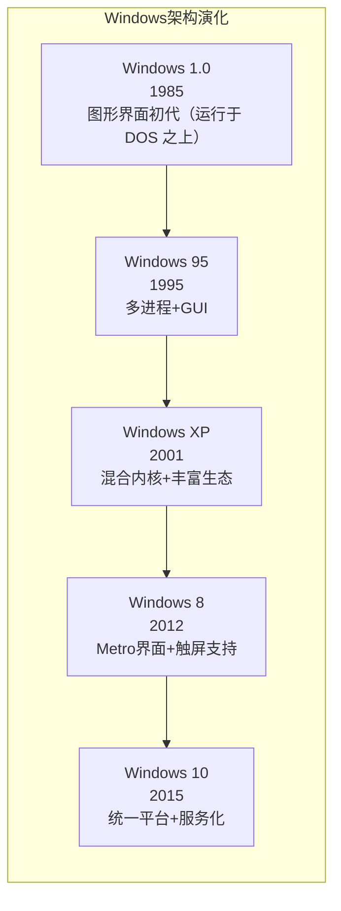

如果对比Windows 8的架构和Windows 1.0的架构，就会发现它们其实是两个不同的系统了！

Android的发展历史：

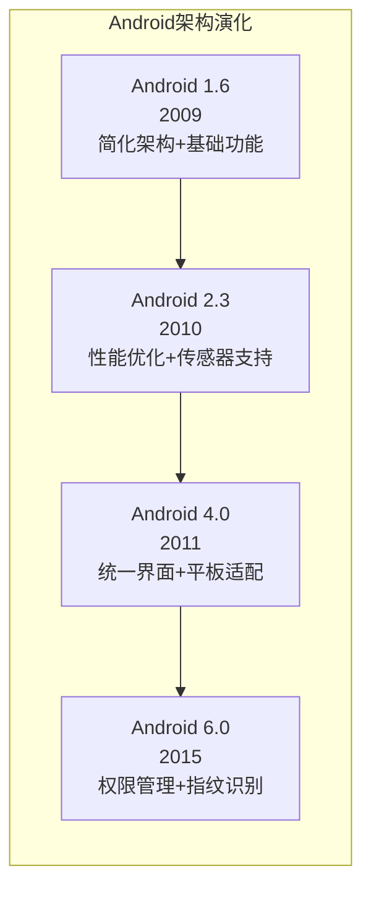

同样，Android 6.0和Android 1.6的差异也很大。

**对于建筑来说，永恒是主题；而对于软件来说，变化才是主题**。软件架构需要根据业务的发展而不断变化。设计Windows和Android的人都是顶尖的天才，即便如此，他们也不可能在1985年设计出Windows 8，不可能在2009年设计出Android 6.0。

如果没有把握"软件架构需要根据业务发展不断变化"这个本质，在做架构设计的时候就很容易陷入一个误区：试图一步到位设计一个软件架构，期望不管业务如何变化，架构都稳如磐石。

为了实现这样的目标，要么照搬业界大公司公开发表的方案；要么投入庞大的资源和时间来做各种各样的预测、分析、设计。无论哪种做法，后果都很明显：投入巨大，落地遥遥无期。更让人沮丧的是，就算跌跌撞撞拼死拼活终于落地，却发现很多预测和分析都是不靠谱的。

### 3.2 软件架构的演化类比

考虑到软件架构需要根据业务发展不断变化这个本质特点，**软件架构设计其实更加类似于大自然"设计"一个生物，通过演化让生物适应环境，逐步变得更加强大**：

| 生物演化 | 软件架构演化 | 深层含义 |
|---------|------------|---------|
| 生物要适应当时的环境 | 架构要满足当时的业务需要 | 不存在"适应未来所有环境"的生物，也不存在"适应未来所有变化"的架构 |
| 不断繁殖，将有利的基因传递下去，将不利的基因剔除或者修复 | 在实际应用过程中迭代，保留优秀的设计，修复有缺陷的设计，改正错误的设计，去掉无用的设计，使得架构逐渐完善 | 演化是增量的——在已有基础上修改，而非推倒重来（除非必要） |
| 当环境变化时，生物要能够快速改变以适应环境变化；如果生物无法调整就被自然淘汰 | 当业务发生变化时，架构要扩展、重构甚至重写；代码也许会重写，但有价值的经验、教训、逻辑、设计等（类似生物体内的基因）却可以在新架构中延续 | 演化不总是渐进的——环境剧变时可能需要"物种灭绝+新物种诞生"式的重构 |

架构师在进行架构设计时需要牢记这个原则，时刻提醒自己不要贪大求全，或者盲目照搬大公司的做法。应该认真分析当前业务的特点，明确业务面临的主要问题，设计合理的架构，快速落地以满足业务需要，然后在运行过程中不断完善架构，不断随着业务演化架构。

即使是大公司的团队，在设计一个新系统的架构时，也需要遵循演化的原则，而不应该认为团队人员多、资源多，不管什么系统上来就要一步到位，因为业务的发展和变化是很快的，不管多牛的团队，也不可能完美预测所有的业务发展和变化路径。

**演化原则与"一步到位"的根本分歧**：

| 思维方式 | 演化思维 | 一步到位思维 |
|---------|---------|------------|
| 出发点 | 当前业务需要 | 未来可能的需要 |
| 设计目标 | 满足当前需求+易于扩展 | 满足所有可预见的需求 |
| 风险 | 短期内需要重构 | 长期无法落地 |
| 现实案例 | 淘宝从买来的PHP系统起步 | "亿级用户平台"设计40个子系统却TPS只有500 |
| 理论依据 | 生物演化——适应环境→积累变异→质变 | 智能设计——一次性设计出完美方案 |

> 一步到位思维的致命缺陷：它假设架构师能够完美预测未来——但这在逻辑上就是不可能的。Windows 1.0的设计师不可能预测到Windows 8的需求，Android 1.6的设计师不可能预测到Android 6.0的架构。即使是最顶尖的天才，也只能基于当前的信息做出最好的决策，然后随着信息的变化不断调整。

### 3.3 案例一：淘宝架构的六阶段演化

注：以下部分内容摘自《淘宝技术发展》。

淘宝技术发展主要经历了"个人网站"→"Oracle/支付宝/旺旺"→"Java时代1.0"→"Java时代2.0"→"Java时代3.0"→"分布式时代"六个阶段。

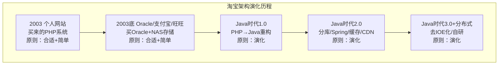

#### 阶段一：个人网站

> 2003年4月7日马云提出成立淘宝，2003年5月10日淘宝就上线了，中间只有1个月，怎么办？淘宝的答案就是：买一个。

> 估计大部分人很难想象如今技术牛气冲天的阿里最初的淘宝竟然是买来的。当时对整个项目组来说压力最大的就是时间，怎么在最短的时间内把一个从来就没有的网站从零开始建立起来？

淘宝当时在初创时，没有过多考虑技术是否优越、性能是否海量以及稳定性如何，主要的考虑因素就是：**快！**因为此时业务要求快速上线，时间不等人，等你花几个月甚至十几个月搞出一个强大的系统出来，可能市场机会就没有了，黄花菜都凉了。

同样，在考虑如何买的时候，淘宝的决策依据主要也是"快"。

> 买一个网站显然比做一个网站要省事一些，但是他们的梦想可不是做一个小网站而已，要做大，就不是随便买个就行的，要有比较低的维护成本，要能够方便地扩展和二次开发。那接下来就是第二个问题：买一个什么样的网站？答案是：轻量一点的，简单一点的。

**买一个系统是为了"快速可用"，而买一个轻量级的系统是为了"快速开发"**。因为系统上线后肯定有大量的需求需要做，这时能够快速开发就非常重要。

从这个实例我们可以看到：淘宝最开始的时候业务要求就是"快"，因此反过来要求技术同样要"快"，业务决定技术，这里架构设计和选择主要遵循的是"合适原则"和"简单原则"。

第一代的技术架构如图所示：

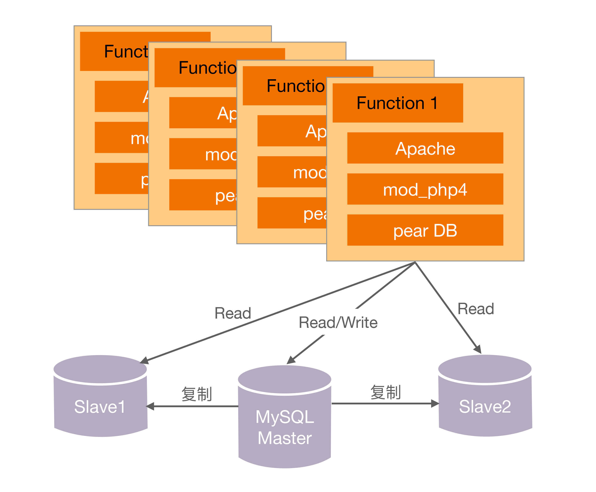

#### 阶段二：Oracle/支付宝/旺旺

淘宝网推出后，由于正好碰到"非典"，网购很火爆，加上采取了成功的市场运作，流量和交易量迅速上涨，业务发展很快，在2003年底MySQL已经撑不住了。

一般人或者团队在这个时候，可能就开始优化系统、优化架构、分拆业务了。那我们来看看淘宝这个时候怎么采取的措施：

> 技术的替代方案非常简单，就是换成Oracle。换Oracle的原因除了它容量大、稳定、安全、性能高，还有人才方面的原因。

可以看出这个时候淘宝的策略主要还是"买"，买更高配置的Oracle，这个是当时情况下最快的方法。

除了购买Oracle，后来为了优化又买了更强大的存储：

> 后来数据量变大了，本地存储不行了。买了NAS（Network Attached Storage，网络附属存储），NetApp的NAS存储作为了数据库的存储设备，加上Oracle RAC（Real Application Clusters，实时应用集群）来实现负载均衡。

为什么淘宝在这个时候继续采取"买"的方式来快速解决问题？从时间上可以看出端倪：此时离刚上线才半年不到，业务飞速发展，最快的方式支撑业务的发展还是去买。如果说第一阶段买的是"方案"，这个阶段买的就是"性能"，这里架构设计和选择主要遵循的还是"合适原则"和"简单原则"。

换上Oracle和昂贵的存储后，第二代架构如图所示：

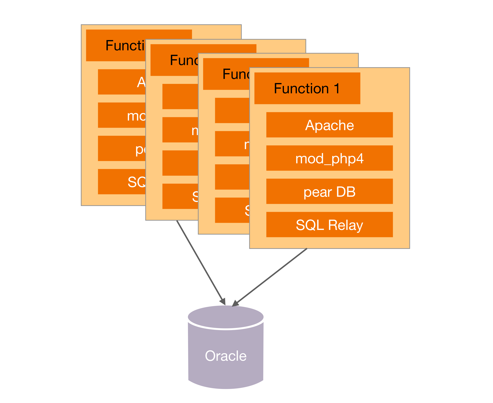

#### 阶段三：脱胎换骨的Java时代1.0

> 淘宝切换到Java的原因很有趣，主要因为找了一个PHP的开源连接池SQL Relay连接到Oracle，而这个代理经常死锁，死锁了就必须重启，而数据库又必须用Oracle，于是决定换个开发语言。最后淘宝挑选了Java，而且当时挑选Java也是请Sun公司的人，这帮人很厉害，先是将淘宝网站从PHP热切换到了Java，后来又做了支付宝。

这次切换的最主要原因是因为技术影响了业务的发展，频繁的死锁和重启对用户业务产生了严重的影响，从业务的角度来看这是不得不解决的技术问题。

但这次淘宝为什么没有去"买"呢？我们看最初选择SQL Relay的原因：

> 但对于PHP语言来说，它是放在Apache上的，每一个请求都会对数据库产生一个连接，它没有连接池这种功能（Java语言有Servlet容器，可以存放连接池）。那如何是好呢？这帮人打探到eBay在PHP下面用了一个连接池的工具，是BEA卖给他们的。我们知道BEA的东西都很贵，我们买不起，于是多隆在网上寻寻觅觅，找到一个开源的连接池代理服务SQL Relay。

淘宝选择Java语言的理由：

> Java是当时最成熟的网站开发语言，它有比较良好的企业开发框架，被世界上主流的大规模网站普遍采用，另外有Java开发经验的人才也比较多，后续维护成本会比较低。

综合来看，这次架构的变化没有再简单通过"买"来解决，而是通过重构来解决，架构设计和选择遵循了"演化原则"。

从PHP改为Java后，第三代技术架构如图所示：

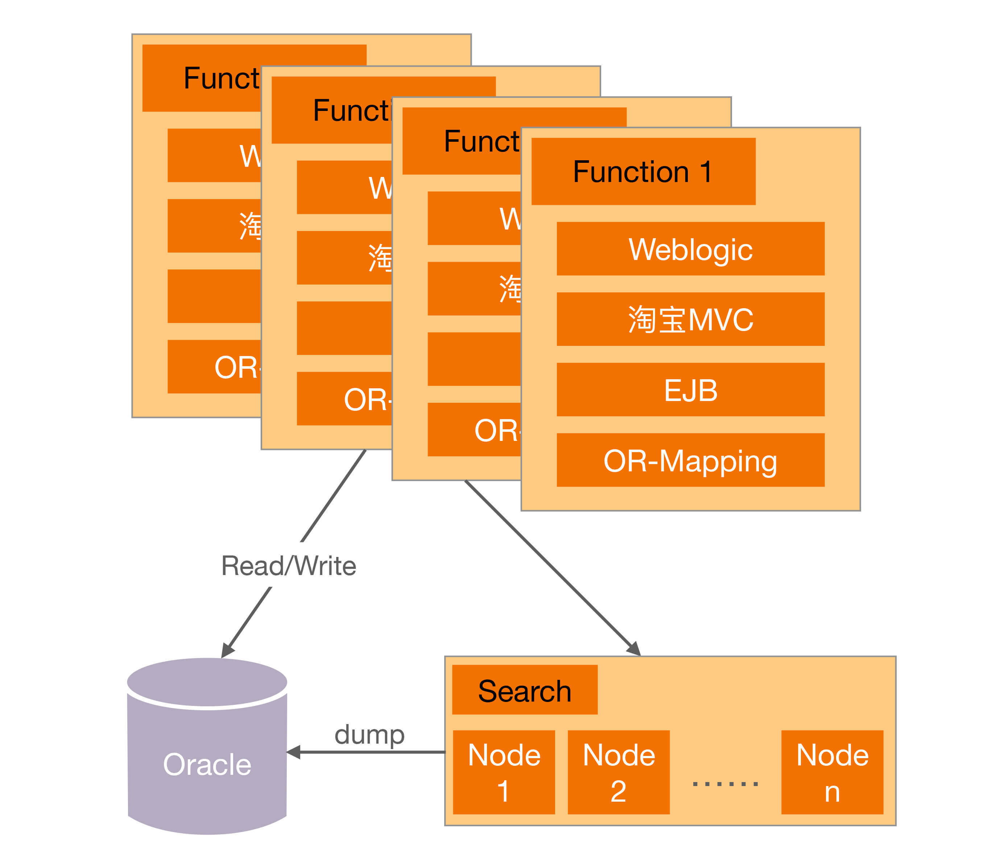

#### 阶段四：坚若磐石的Java时代2.0

Java时代2.0，淘宝做了很多优化工作：数据分库、放弃EJB、引入Spring、加入缓存、加入CDN、采用开源的JBoss。原文作者很好地概括了做这些动作的原因：

> 这些杂七杂八的修改，我们对数据分库、放弃EJB、引入Spring、加入缓存、加入CDN、采用开源的JBoss，看起来没有章法可循，其实都是围绕着提高容量、提高性能、节约成本来做的。

为什么在前面的阶段淘宝考虑的都是"快"，而现在开始考虑"容量、性能、成本"了？而且为什么这个时候不采取"买"的方式来解决？

简单来说，就是"买"也搞不定了：

> 随着数据量的继续增长，到了2005年，商品数有1663万，PV有8931万，注册会员有1390万，这给数据和存储带来的压力依然很大，数据量大，性能就慢。

原有的方案存在固有缺陷，随着业务的发展已经不是靠"买"就能够解决问题了。例如Oracle再强大，在做like类搜索的时候也不可能做到纯粹的搜索系统如Solr、Sphinx等的性能，因为这是机制决定的。

另外，随着规模的增大，纯粹靠买的一个典型问题开始成为重要的考虑因素——**成本**。当买一台两台Oracle的时候可能对成本并不怎么关心，但如果要买100台Oracle，成本就是一个关键因素了。这就是"量变带来质变"的一个典型案例，业务和系统发生质变后，架构设计遵循"演化原则"的思想，需要再一次重构甚至重写。

Java架构经过各种优化，第四代技术架构如图所示：

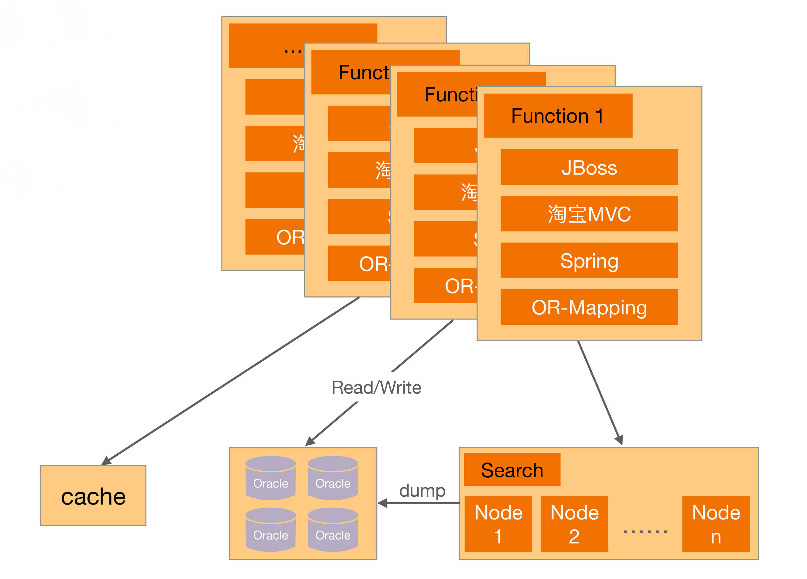

#### 阶段五和六：Java时代3.0和分布式时代

> Java时代3.0我个人认为是淘宝技术飞跃的开始，简单来说就是淘宝技术从商用转为"自研"，典型的就是去IOE化。
>
> 分布式时代我认为是淘宝技术的修炼成功，到了这个阶段，自研技术已经自成一派，除了支撑本身的海量业务，也开始影响整个互联网的技术发展。

到了这个阶段，业务规模急剧上升后，原来并不是主要复杂度的IOE成本开始成为了主要的问题，因此通过自研系统来降低IOE的成本，去IOE也是系统架构的再一次演化。

**淘宝演化总结**：

| 阶段 | 核心驱动力 | 遵循原则 |
|------|----------|---------|
| **个人网站** | "快"——一个月上线，买一个现成系统 | 合适+简单 |
| **Oracle时代** | "快"——MySQL撑不住，买Oracle最快 | 合适+简单 |
| **Java 1.0** | SQL Relay死锁影响业务，必须重构；选Java为长期发展铺垫 | 演化 |
| **Java 2.0** | "买"搞不定了——规模增长导致成本问题，必须架构级调整 | 演化 |
| **Java 3.0+分布式** | IOE成本成为主要问题，去IOE化/自研 | 演化 |

**关键洞察**：淘宝前两阶段的核心驱动力是"快"（合适+简单），后三阶段是"撑不住"（演化）。业务决定技术，"买"的策略在规模小时最优，规模大时失效。这揭示了一个深层规律：**架构演化的驱动力不是"技术追求"，而是"业务压力"**——当业务量级迫使原有方案无法支撑时，架构才不得不演化。正如"冰山下面才是关键"所说，业界领先的方案都是"逼"出来的。

**淘宝演化与演化原则的呼应**：

| 演化原则要点 | 淘宝实践 |
|------------|---------|
| 设计出来的架构要满足当时的业务需要 | 每个阶段的架构都刚好满足当时需求——初始用PHP够快，后来买Oracle够撑 |
| 架构要不断在实际应用过程中迭代 | 从个人网站到Oracle到Java到分库到去IOE，每一步都是在前一步基础上迭代 |
| 业务变化时架构要扩展、重构甚至重写 | 从PHP切换到Java是重构；从Oracle到去IOE是重写；代码变了但Java语言的"基因"延续 |
| 有价值的经验教训可以在新架构中延续 | 淘宝的业务逻辑、数据模型、交易流程在架构切换中都被保留

### 3.4 案例二：手机QQ架构的四阶段演化

注：以下部分内容摘自《QQ 1.4亿在线背后的故事》。

手机QQ的发展历程按照用户规模可以粗略划分为4个阶段：十万级、百万级、千万级、亿级。不同的用户规模，IM后台的架构也不同，而且基本上都是用户规模先上去，然后产生各种问题，倒逼技术架构升级。

#### 阶段一：十万级 IM 1.X

最开始的手机QQ后台可以说是简单得不能再简单、普通得不能再普通的一个架构了，因为当时业务刚开始，架构设计遵循的是"合适原则"和"简单原则"。

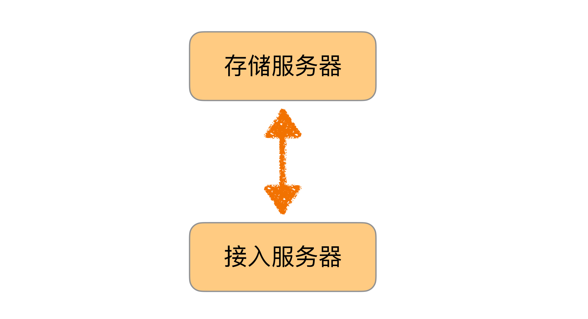

#### 阶段二：百万级 IM 2.X

随着业务发展到2001年，QQ同时在线人数突破了一百万。第一代架构很简单，明显不可能支撑百万级的用户规模，主要的问题有：

- 以接入服务器的内存为例，单个在线用户的存储量约为2KB，索引和在线状态为50字节，好友表400个好友 x 5字节/好友 = 2000字节，大致来说2GB内存只能支持一百万在线用户
- CPU/网卡包量和流量/交换机流量等瓶颈
- 单台服务器支撑不下所有在线用户/注册用户

于是针对这些问题做架构改造，按照"演化原则"的指导进行了重构。重构的方案相比现在来说也还是简单得多，因此当时做架构设计时也遵循了"合适原则"和"简单原则"。

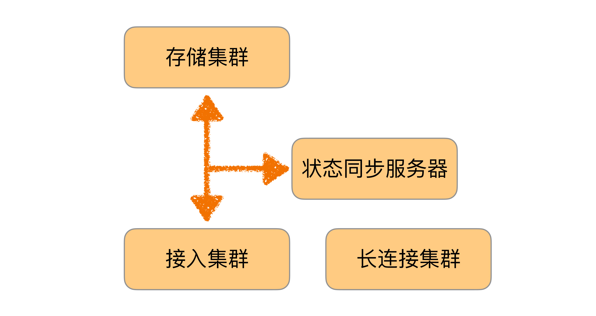

#### 阶段三：千万级 IM 3.X

业务发展到2005年，QQ同时在线人数突破了一千万。第二代架构支撑百万级用户是没问题的，但支撑千万级用户又会产生新问题：

- 同步流量太大，状态同步服务器遇到单机瓶颈
- 所有在线用户的在线状态信息量太大，单台接入服务器存不下，如果在线数进一步增加，甚至单台状态同步服务器也存不下
- 单台状态同步服务器支撑不下所有在线用户
- 单台接入服务器支撑不下所有在线用户的在线状态信息

针对这些问题，架构需要继续改造升级，再一次"演化"。

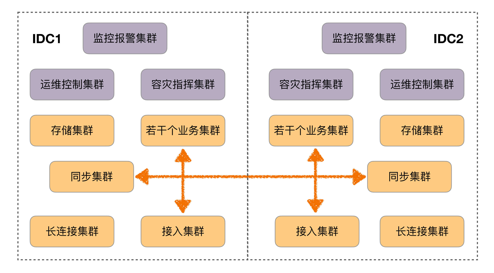

#### 阶段四：亿级 IM 4.X

业务发展到2010年3月，QQ同时在线人数过亿。第三代架构此时也不适应了，主要问题有：

- 灵活性很差：比如"昵称"长度增加一半需要两个月；增加"故乡"字段需要两个月；最大好友数从500变成1000需要三个月
- 无法支撑某些关键功能：比如好友数上万、隐私权限控制、PC QQ与手机QQ不可互踢、微信与QQ互通、异地容灾

除了不适应，还有一个更严重的问题：

> IM后台从1.0到3.5都是在原来基础上做改造升级的，但是持续打补丁已经难以支撑亿级在线，IM后台4.0必须从头开始，重新设计实现！

这里再次遵循了"演化原则"，决定重新打造一个这么复杂的系统——不得不佩服当时决策人的勇气和魄力！

重新设计的IM 4.0架构分为两个主要的架构：存储架构和通信架构。

- 存储架构：

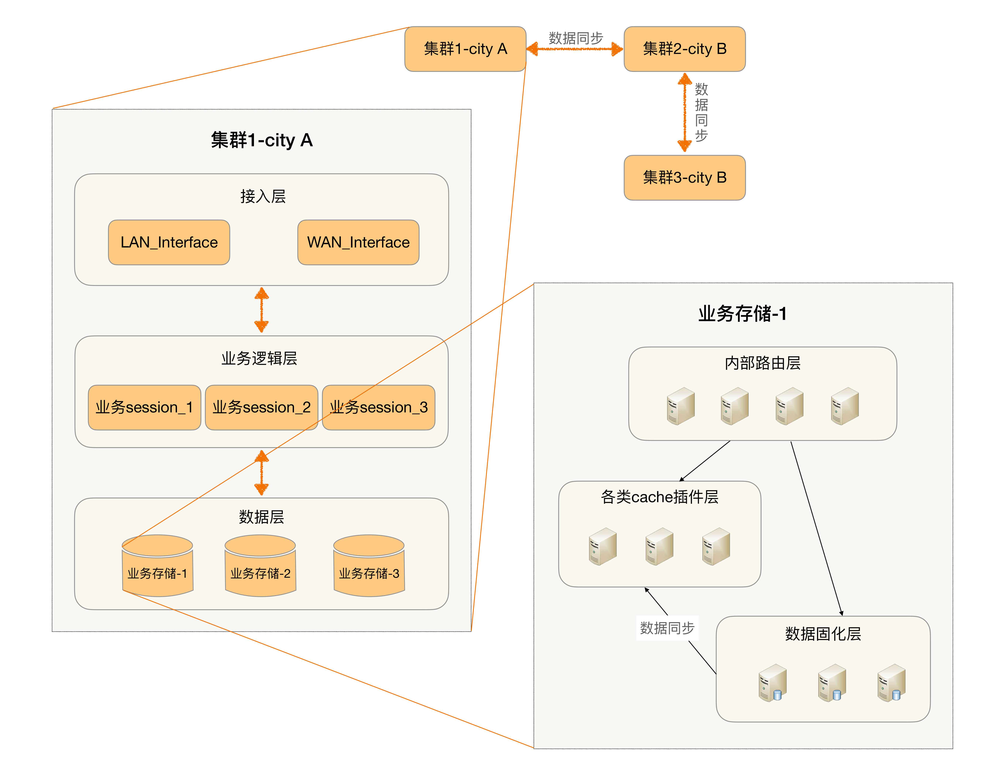

**手机QQ演化总结**：

| 阶段 | 用户规模 | 核心问题 | 遵循原则 |
|------|---------|---------|---------|
| **IM 1.X** | 十万级 | 刚开始，架构极简 | 合适+简单 |
| **IM 2.X** | 百万级 | 内存/CPU/网卡/单机瓶颈 | 演化（重构）+合适+简单 |
| **IM 3.X** | 千万级 | 同步流量大、状态信息存不下 | 演化（架构升级） |
| **IM 4.X** | 亿级 | 灵活性差、无法支撑关键功能、持续打补丁撑不住 | 演化（**从头重写**） |

**手机QQ演化与演化原则的呼应**：

| 演化原则要点 | 手机QQ实践 |
|------------|-----------|
| 设计出来的架构要满足当时的业务需要 | IM 1.X极简架构满足十万级；IM 2.X满足百万级 |
| 架构要不断在实际应用过程中迭代 | 从1.X到2.X到3.X，每次都在前一代基础上改造升级 |
| 业务变化时架构要扩展、重构甚至重写 | IM 4.X从头重写——"持续打补丁已经难以支撑亿级在线" |
| 有价值的经验教训可以在新架构中延续 | IM 4.X分为存储架构+通信架构，是对3.X问题经验的总结和重新设计 |

**手机QQ演化的深层启示**：

IM 4.X的决策是最震撼的——从1.0到3.5都是在原来基础上改造升级，但持续打补丁已经难以支撑亿级在线。这揭示了一个重要规律：**渐进式演化有极限**。当系统的基础架构与业务量级产生根本性冲突时，修修补补已经无济于事，必须推倒重来。

但"从头重写"并不意味着"从零开始"——IM 4.X的设计充分吸收了前几代的经验教训：拆分为存储架构和通信架构正是对3.X中"同步流量太大""状态信息存不下"等问题的根本性解决。有价值的设计"基因"在新架构中得到了延续。

> **深度注记**：演化原则与"1写2抄3重构"的实践原则完美呼应。1写2抄是演化初期的"合适+简单"，3重构是演化后期的"重构甚至重写"。演化不是线性的，当量变积累到质变时，架构需要跨越式演化。淘宝从买来的PHP系统到分布式自研，手机QQ从极简架构到从头重写，都是"量变→质变→跨越式演化"的典型路径。

---

## 四、开闭原则：架构治理的根本哲学

### 4.1 OCP的两层含义

许式伟对开闭原则的解读直指内核：**开闭原则的背后，推崇的是模块业务的确定性**。与其修改模块的业务，不如实现一个新业务。只要业务分解一直被正确执行，实现新的业务模块来完成新的业务范畴，是一件极其轻松的事情。

| 层次 | 含义 | 实现手段 |
|------|------|---------|
| **闭** | 模块的业务要稳定（只读） | 每个模块的业务范畴确定后不再变化；"每一个模块都应该是可完成的" |
| **开** | 模块业务的变化点要开放 | 简单变化点→回调函数或接口；复杂变化点→插件机制把系统分解为"最小化的核心系统 + 多个彼此正交的周边系统" |

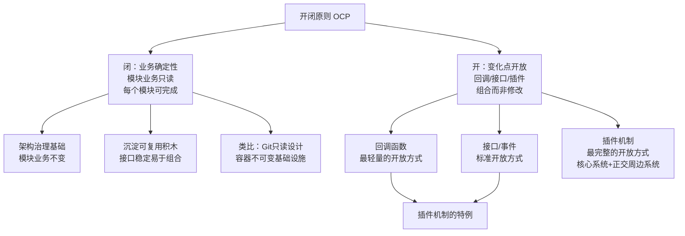

### 4.2 OCP的历史根源：CPU的开闭设计

一种广泛的误解认为开闭原则是OOP领域提出的编程思想。但开闭原则思想的应用贯穿整个信息科技发展历程，它是信息技术架构的基本原则——不仅适用于软件设计。

CPU的设计完美体现了开闭原则：

- **指令是稳定的**（闭），但**指令序列是变化的**（开）——由此发明了软件
- **计算是稳定的**（闭），但**数据交换是多变的**（开）——由此定义了输入输出规范
- **缺页中断**（闭中的开）：CPU通过中断将自身与多变的外设演进解耦

> 我们不必去修改CPU，但我们却支持了如此多姿多彩的信息世界。多么优雅的设计。它与面向对象无关，完全是开闭原则带来的威力。

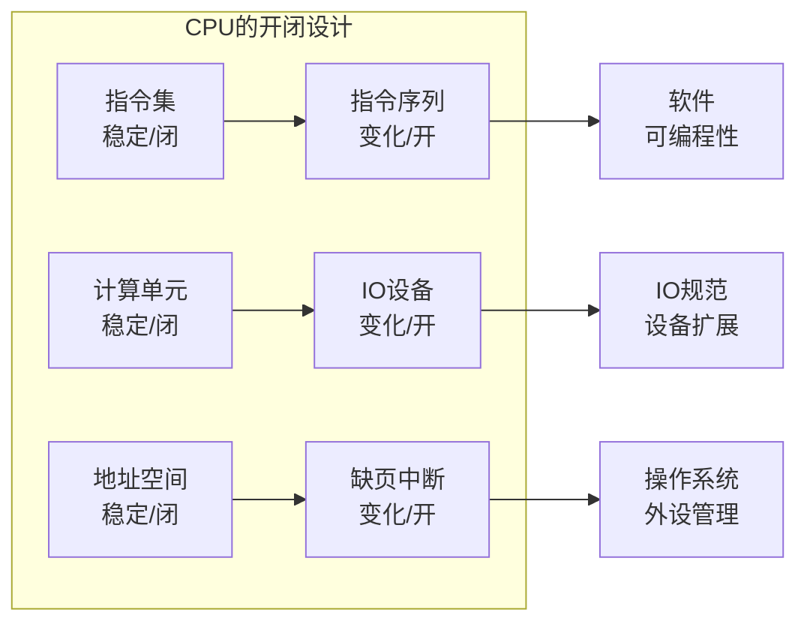

### 4.3 OCP与业务正交分解的统一

开闭原则与"架构的本质是业务的正交分解"一脉相承：

- **闭**：业务分解的确定性——每个模块的业务范畴确定后不再变化
- **开**：业务组合的灵活性——通过组合已有模块来完成新的业务

**"闭"如何保证业务分解的确定性**：

当每个模块的业务范畴确定后不再变化，就意味着：
- 模块的接口是稳定的——不需要因为新需求而修改
- 模块的实现是可完成的——不需要不断追加功能
- 模块之间的边界是清晰的——不需要频繁调整职责

这就像搭积木——每块积木的形状是确定的（闭），但通过不同的组合方式可以搭建出不同的造型（开）。如果积木的形状不断变化，就无法稳定地搭建任何造型。

**"开"如何保证业务组合的灵活性**：

当变化点通过接口开放出去，就意味着：
- 新功能可以通过实现新模块来完成，而不需要修改已有模块
- 不同的模块可以独立开发和部署，互不影响
- 系统的整体行为可以通过组合不同的模块来改变

**核心系统伤害值为零的理想状态**：当核心系统提供插件机制时，新增功能不改核心系统一行代码——这正是OCP在架构层面的完美实现。但现实中很难完全做到，因为：
- 并非所有变化点都能提前预判
- 插件机制本身增加了核心系统的复杂度
- 有些变化涉及核心系统的根本性修改（如数据模型变更）

**OCP与SRP的统一**：单一职责原则（SRP）强调每个模块只负责一个业务。开闭原则强调把模块业务的变化点抽离出来，包给其他模块。它们谈的是**同一个问题的两个面**：

- SRP = 内聚性（每个模块一个业务，所有代码服务于同一业务）
- OCP = 开放性（变化点交给其他模块，模块间低耦合）
- 统一 = 业务的正交分解

**正交分解的含义**：如果两个模块的业务是"正交"的（不重叠、不依赖），那么修改一个模块不会影响另一个模块——这正是OCP"闭"的理想状态。而如果两个模块的业务有重叠，修改一个就可能影响另一个——这就违反了SRP和OCP。

### 4.4 插件机制：OCP的完整实践

#### 插件机制的三个组成部分

1. **DOM API**：软件自身能力的暴露，插件以此调用已有功能
2. **插件加载机制**：通常基于文件系统（指定插件目录）或注册表
3. **事件监听**：这是关键——没有事件，插件没有机会介入业务

#### 事件的三种类型

| 事件类型 | 说明 | 示例 |
|---------|------|------|
| 界面操作类 | 高级界面事件（不暴露底层鼠标/键盘） | 菜单项点击、按钮点击 |
| 数据变更类 | 数据变化时触发 | onSelectionChanged、onDataChanged |
| 业务流程类 | 业务流中间或完成后触发 | 打开文件前后、保存前后 |

#### 轻量级插件案例：Go image包

```go
import "image"
import _ "image/jpeg"  // 加载 jpeg 插件
import _ "image/png"   // 加载 png 插件
```

这里最大的简化是放弃了插件加载机制——手工加载插件。只要提供`Decode`和`DecodeConfig`功能，就可以增加格式支持，无需修改image包。这是OCP与接口设计完美结合的范例：接口精确（只要求两个方法），开放充分（任意扩展格式），侵入最小（无需修改核心）。

#### 插件机制的成本与前提

- **成本**：插件机制本身是核心系统的一个功能，也需要考虑与其他功能的耦合度
- **前提**：维持足够的通用性——如果插件没有多少客户，投入产出不成比例

### 4.5 接口设计：OCP落地的精确手段

OCP的"开"——无论回调、接口还是插件——都离不开一个核心要素：**接口设计**。接口是业务的抽象，是模块间的契约，是架构治理的落脚点。接口在不同语境下有两层含义：

| 含义 | 关注点 | 设计准则 | 典型反模式 |
|------|-------|---------|-----------|
| **模块的使用界面（规格）** | 对外提供什么能力 | KISS原则——语义自然，一看就懂；符合惯例；符合语言约定；避免惊异 | `service interface{}`——看似泛化，实际有更强假设 |
| **模块对依赖环境的抽象（契约）** | 需要外部提供什么 | 最小依赖原则——只依赖必要的接口 | 抽象数据库依赖以便在MySQL和MongoDB间切换——过度设计 |

**接口双重含义的案例**：

以Go语言标准库为例，`io.Reader`和`io.Writer`是接口设计的典范：

- **使用界面**：命名符合Go惯例，一看就知道是读写操作；极简接口（一个方法），覆盖文件、网络、缓冲区、压缩等所有IO场景
- **环境依赖**：`*os.File` → `io.Reader` / `io.Writer`，从文件泛化到任意读写器——这是使用界面依赖的参数泛化

**环境依赖的两种类型**：

- **使用界面依赖**：用户使用模块时自然涉及的依赖。接口定义更多考虑对参数的泛化与抽象，以适应更广泛的场景（如`*os.File` → `io.Reader` / `io.Writer`）
- **实现依赖**：模块当前实现方案涉及的组件，换实现方案可能就不再存在。大部分情况下应该直接依赖组件而不必去抽象它——如无必要，勿增实体

**抽象接口的三种正当理由**：

1. **需要提供多种选择**：典型如日志组件Logger——绝大部分业务模块不希望绑定Logger的选择。但注意：抽象数据库依赖以便在MySQL和MongoDB间切换，通常是**过度设计**——选择数据库应该是非常谨慎的行为。不同数据库的数据模型、查询能力、一致性保证差异巨大，"透明切换"几乎不可能实现。
2. **解除庞大外部系统的依赖**：不是为了多选择，而是外部依赖过重，测试时需要mock。例如依赖一个远程服务，测试时需要启动整个服务——成本太高，不如抽象接口用mock替代。
3. **外部系统为可选组件**：模块实现一个mock组件，初始化时将接口设为mock，客户可以当模块不存在这个配置项，降低学习门槛。

**重要洞察**：形式泛化不等于真正泛化。`interface{}`看似更泛化，实际上可能有更强假设（通过反射实现路由分派）；`io.Reader`看似更具体，实际上是更恰如其分的抽象。让系统足够简单，却又不失扩展性——其中的平衡完全依赖对业务的理解。

### 4.6 正面案例与反面案例

**正面案例**：

- **Git的只读设计**：每次提交都是不可变的快照（闭），分支和合并通过组合已有提交来创建新的历史线（开）
- **容器技术的不可变基础设施**：Docker容器镜像层是只读的（闭），容器运行时通过叠加可写层来扩展（开）
- **Go标准库的io.Reader/io.Writer**：极简接口（一个方法），覆盖文件、网络、缓冲区、压缩等所有IO场景

**反面案例**：

- **过度修改模块业务**：每当新需求到来，就修改既有模块的业务范畴——给它加功能、改接口、调整设计。一个需求捏着鼻子做，两个需求捏着鼻子做，系统不堪重负。这正是违反OCP"闭"的典型表现。具体表现如：一个原本只负责"用户注册"的模块，今天加"密码重置"，明天加"用户封禁"，后天加"用户画像"——最终变成了一个边界模糊的"用户大杂烩"模块。

- **插件机制的过度设计**：如果某个插件机制只有一两个客户使用，而它的代码散落在核心系统各处，投入产出不成比例。具体表现如：为了支持"未来可能需要的"自定义字段功能，在核心系统中增加了复杂的字段注册、字段校验、字段存储的插件机制——但这个功能实际上只有两个客户使用，而核心系统因为这段代码增加了30%的复杂度。

- **数据库抽象的过度设计**：抽象数据库依赖以便在MySQL和MongoDB间切换——不同数据库的数据模型、查询能力、一致性保证差异巨大，"透明切换"几乎不可能实现。具体表现如：定义了一个"通用数据库接口"，包含`find(id)`、`query(condition)`、`save(entity)`等方法——看起来很通用，但MySQL的实现用的是SQL，MongoDB的实现用的是查询文档，两者在事务、索引、性能优化等方面完全不同，"通用接口"只是一种幻觉。

**OCP实践的核心判断标准**：

| 判断维度 | 遵循OCP | 违反OCP |
|---------|--------|--------|
| 新增功能时 | 新增模块/插件/实现 | 修改已有模块的代码 |
| 接口变更时 | 增加新接口，旧接口保持 | 修改旧接口的签名 |
| 业务变化时 | 实现新的业务模块 | 在旧模块中追加业务 |
| 扩展机制 | 回调/接口/插件，侵入小 | if-else/switch-case，侵入大 |

---

## 五、四原则的统一

### 5.1 三原则与开闭原则的映射

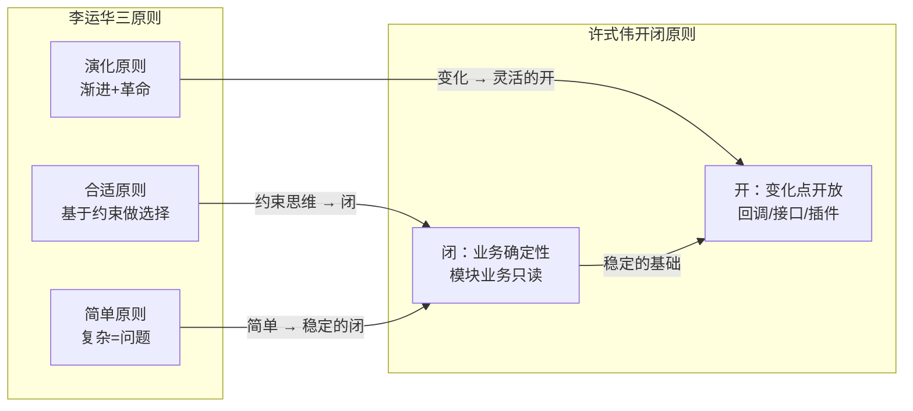

| 三原则 | 对应OCP | 统一解读 |
|-------|---------|---------|
| **合适原则** | "闭"的约束 | 基于当前约束确定模块的业务边界，边界确定后不再变化（闭） |
| **简单原则** | "闭"的质量 | 简单的模块更容易做到业务确定性（闭），复杂模块容易边界模糊 |
| **演化原则** | "开"的机制 | 架构随业务变化而演化，通过回调/接口/插件机制开放变化点（开） |

### 5.2 统一的架构决策框架

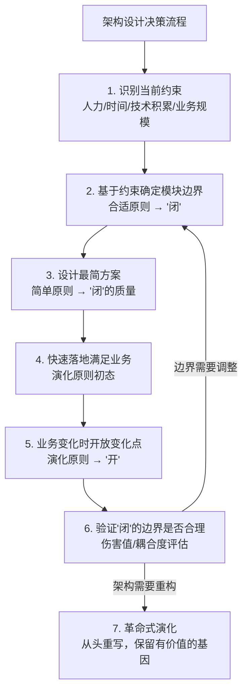

### 5.3 OCP与接口设计的深层张力

OCP追求开放性，接口设计追求精确性。如何在"开放"与"精确"之间找到平衡，是架构设计的核心命题。

- 过度追求"闭"（稳定）：模块僵化，无法适应新需求
- 过度追求"开"（扩展）：插件机制过于复杂，核心系统负担增加
- **理想状态**：核心系统最小化且稳定，变化通过周边系统的组合来适应

实践准则：
1. 闭的边界用KISS定义——简单明了的接口是"闭"的最佳保障
2. 开的方式用最小依赖约束——开放的接口应该只暴露必要的最小信息
3. 开闭之间的接口即业务契约——接口定义了"闭"的边界和"开"的方式

**四原则统一的实践案例**：

以"消息队列系统设计"为例，看四原则如何协同工作：

1. **合适原则** → 确定当前约束：6人团队、Java技术栈、QPS 13800、单机房 → "闭"的边界确定
2. **简单原则** → 选择MySQL存储而非自研存储 → "闭"的质量保障（简单模块更容易做到业务确定性）
3. **演化原则** → 当前用MySQL存储够用，未来可扩展为自研存储 → "开"的机制设计（通过存储接口的抽象为未来演化留空间）
4. **开闭原则** → 消息队列的SDK接口定义 → "闭"（SDK接口稳定不变）+ "开"（底层存储实现可替换）

---

## 总结

| 核心要点 | 关键结论 |
|---------|---------|
| 合适原则 | 合适优于业界领先；失败三根因：无人、无积累、无业务场景；"亿级用户平台"40子系统→实际TPS 500→2年重构合并为20子系统 |
| 简单原则 | 简单优于复杂；软件的复杂性影响整个生命周期（结构复杂+逻辑复杂）；ZAB vs Raft：同样功能，简单算法更优；KISS原则适用于架构设计 |
| 演化原则 | 演化优于一步到位；建筑永恒vs软件变化；渐进式改良+革命式重构；业务决定技术；淘宝六阶段和手机QQ四阶段印证 |
| 开闭原则 | 闭=业务确定性（模块只读），开=变化点开放（回调/接口/插件）；CPU设计是OCP的经典实践；OCP不只是OOP原则 |
| 插件机制 | DOM API + 加载机制 + 事件监听；Go image包是轻量级插件范例；插件前提是足够通用性 |
| 接口设计 | 使用界面遵循KISS，环境依赖遵循最小依赖；形式泛化≠真正泛化；`interface{}`看似泛化实则更强假设 |
| 四原则统一 | 合适→确定"闭"的边界；简单→保证"闭"的质量；演化→驱动"开"的机制；OCP落地→接口是精确手段 |

**四原则的优先级**：

三条原则是否有优先级？从实际案例来看：
- **合适原则**通常是第一优先级——因为只有在当前约束下确定了合理的模块边界，后续的简单和演化才有意义
- **简单原则**通常是第二优先级——因为简单的方案更容易落地和演化，复杂方案往往还未演化就已经失败
- **演化原则**是长期维度的——它不是一次性决策，而是持续的迭代过程

但这不是绝对的顺序。在某些场景下，简单原则可能比合适原则更重要（例如紧急上线场景）；在某些场景下，演化原则可能比简单原则更重要（例如已经有成熟系统需要改造）。

**思考题**：
1. 这三条架构设计原则是否每次都要全部遵循？是否有优先级？
2. 搜索一个互联网大厂的架构发展案例，分析哪些地方体现了三条架构设计原则。
3. 你在实际项目中如何应用开闭原则？遇到过哪些过度设计或设计不足的情况？
4. 如果一个团队只有 3 个人，却需要支撑一个日活百万的业务，你会如何运用合适原则与演化原则来设计架构？

**关联阅读**：
- [架构设计目的与评判](04-架构设计目的与评判.md)
- [复杂度来源](05-复杂度来源.md)
- [架构设计流程：识别复杂度](07-架构设计流程.md)

---

> **延伸视角**（许式伟）
>
> 华仔的三原则是从大量实践案例中归纳出来的经验法则，具有很强的可操作性。但从架构治理的哲学高度来看，三原则可以统一到开闭原则的框架下：
>
> **合适原则 = "闭"的前提**。只有在当前约束下确定了合理的模块边界（闭），才能谈得上"开"。没有"闭"的基础就谈"开"，只能是漫无目的的灵活。淘宝前两个阶段"买"的策略，正是在"闭"——确定当前只需要能跑起来。
>
> **简单原则 = "闭"的质量保证**。简单的模块更容易做到业务确定性（闭），复杂的模块边界容易模糊，"闭"的质量就无法保证。KISS原则本质上是在保障"闭"的纯洁性。ZooKeeper的ZAB协议复杂度高，导致"闭"的边界模糊；etcd的Raft更简单，"闭"的质量更高。
>
> **演化原则 = "开"的实践路径**。演化不是随意的，而是有方向性的——通过回调/接口/插件机制开放变化点（开），使得架构能够在不修改已有模块业务（闭）的前提下，通过组合实现新功能。手机QQ从1.X到4.X的演化，就是在不断扩展"开"的方式——从简单的主备到复杂的分布式架构。
>
> **融合洞见**：许式伟的"框架是业务流的抽象，模块的规格比实现更重要"与华仔的"合适原则"深层一致——模块的规格（闭）应该基于业务约束来确定，而非基于框架（开）的约束。这正是"不让模块为框架买单"在三原则层面的体现。
