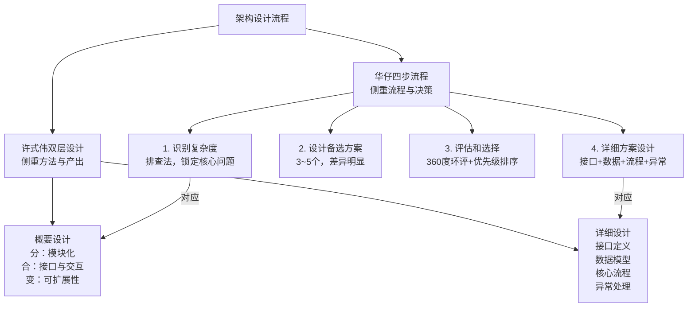
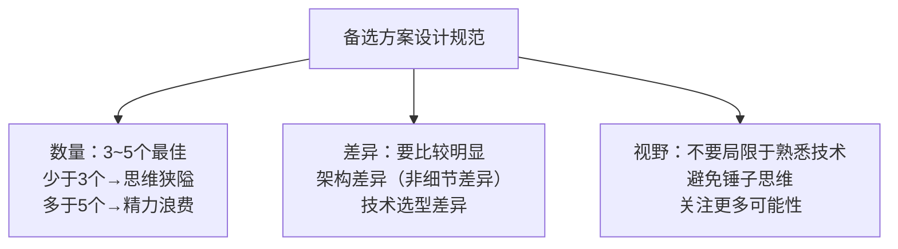
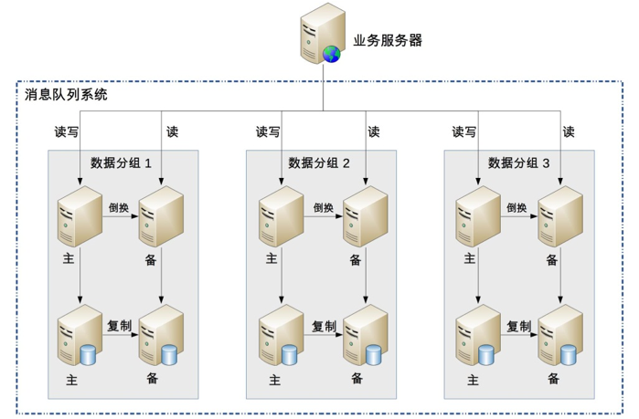
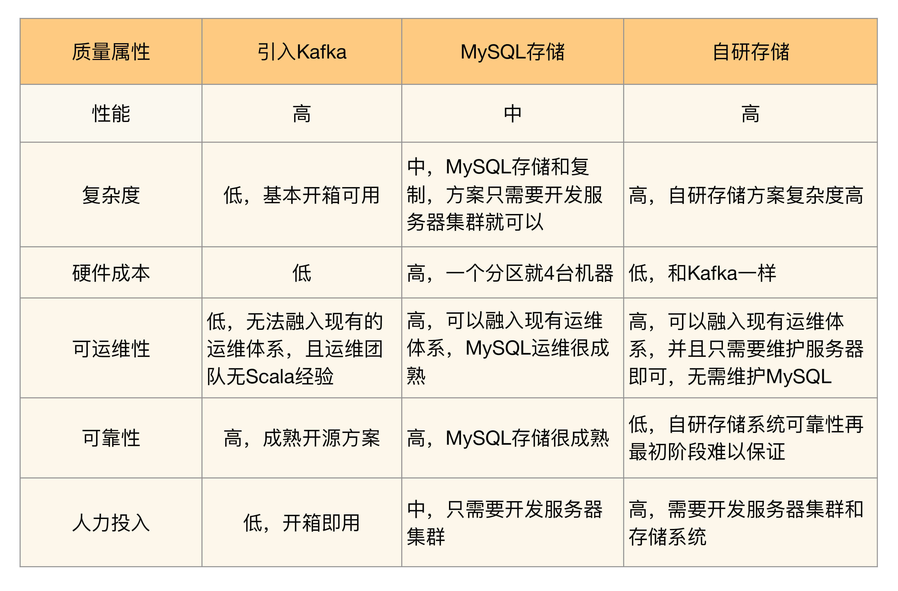
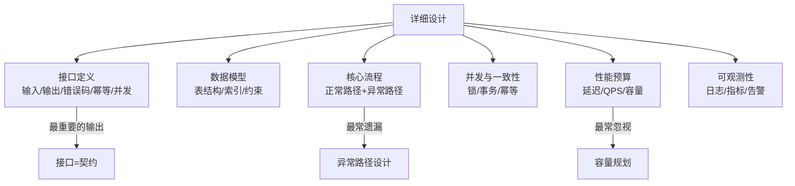
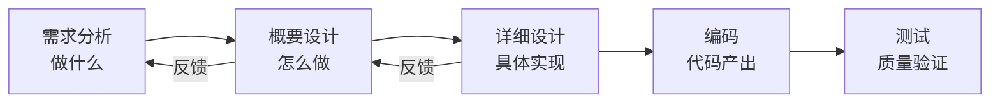
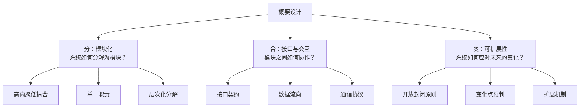
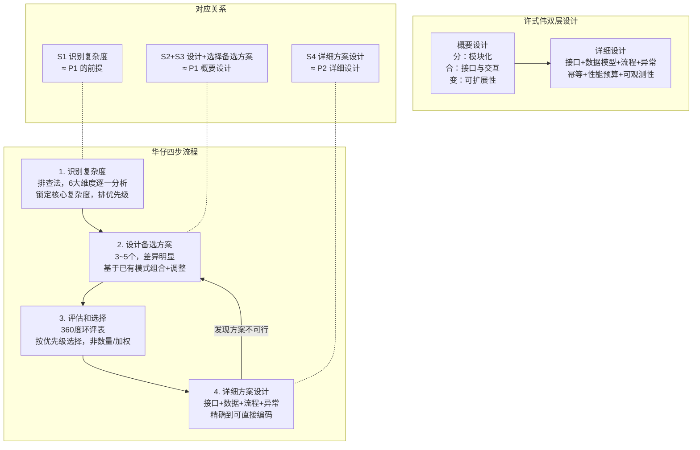

# 架构设计流程 | 识别复杂度→备选方案→评估选择→详细设计

## 章节导言

架构设计的本质目的是解决软件系统复杂度带来的问题，但"识别复杂度"只是第一步。从识别问题到最终落地，还需要经历**设计备选方案、评估选择、详细设计**三个关键步骤。

这四个步骤构成了架构设计的完整流程，每一步都有其独特的挑战和常见陷阱：识别复杂度容易南辕北辙，设计备选方案容易只做一个或过于详细，评估选择容易陷入"最简/最牛/最熟/领导"派，详细设计容易遗漏异常路径。

与此同时，许式伟从概要设计和详细设计两个维度给出了补充框架：概要设计回答"分、合、变"三个核心问题，详细设计回答"接口、数据、流程、异常"四个核心要素。两种视角互补——华仔的四步流程更侧重"流程与决策"，许式伟的双层设计更侧重"方法与产出"。

**核心问题**：
1. 如何用"排查法"精准识别系统的核心复杂度？性能预估的具体方法是什么？
2. 设计备选方案时有哪些常见错误？如何保证方案差异明显？"架构差异"与"细节差异"如何区分？
3. 如何用"360度环评+按优先级选择"避免主观偏见？数量对比法和加权法为何行不通？
4. 详细设计的核心输出是什么？为什么异常路径最常被遗漏？什么是"PPT架构师"？
5. 概要设计的"分、合、变"三个问题如何与四步流程衔接？接口的三层含义是什么？

**四步流程速览**：

| 步骤 | 核心任务 | 常见陷阱 | 关键方法 |
|------|---------|---------|---------|
| 1. 识别复杂度 | 锁定核心问题 | 南辕北辙——判断错误则全盘皆输 | 排查法（6大维度逐一分析） |
| 2. 设计备选方案 | 3~5个差异化方案 | 追求最优秀/只做一个/过于详细 | 组合已有模式+适度创新 |
| 3. 评估和选择 | 综合约束选最优 | 最简派/最牛派/最熟派/领导派 | 360度环评+按优先级选择 |
| 4. 详细方案设计 | 细化到可直接编码 | 遗漏异常路径/性能目标模糊 | 接口先行+异常列举+量化目标 |

---

## 一、第一步：识别复杂度

### 1.1 核心原则

**如果对系统的复杂度判断错误，即使后续方案再完美再先进，都是南辕北辙——做得越好，错得越离谱。**

例如，如果一个系统的复杂度本来是业务逻辑太复杂、功能耦合严重，架构师却设计了一个TPS达到50000/秒的高性能架构，即使这个架构最终的性能再优秀也没有任何意义，因为架构没有解决正确的复杂性问题。

架构的复杂度主要来源于"高性能""高可用""可扩展"等几个方面，但架构师在具体判断复杂性的时候，不能生搬硬套，认为任何时候架构都必须同时满足这三方面的要求。实际上：

- 大部分场景下，复杂度只是其中的某一个
- 少数情况下包含其中两个
- 如果真的出现同时需要解决三个或者三个以上的复杂度，要么说明这个系统之前设计的有问题，要么可能就是架构师的判断出现了失误
- 即使真的认为要同时满足这三方面的要求，也**必须进行优先级排序**

**案例回顾："亿级用户平台"的过度设计**

专栏前面提到过的"亿级用户平台"失败的案例，设计对标腾讯的QQ，按照腾讯QQ的用户量级和功能复杂度进行设计，高性能、高可用、可扩展、安全等技术一应俱全，一开始就设计出了40多个子系统，然后投入大量人力开发了将近1年时间才跌跌撞撞地正式上线。上线后发现之前的过度设计完全是多此一举，而且带来很多问题：

- 系统复杂无比，运维效率低下，每次业务版本升级都需要十几个子系统同步升级，操作步骤复杂，容易出错，出错后回滚还可能带来二次问题
- 每次版本开发和升级都需要十几个子系统配合，开发效率低下
- 子系统数量太多，关系复杂，小问题不断，而且出问题后定位困难
- 开始设计的号称TPS 50000/秒的系统，实际TPS连500都不到

由于业务没有发展，最初的设计人员陆续离开，后来接手的团队无奈又花了2年时间将系统重构，合并很多子系统，将原来40多个子系统合并成不到20个子系统，整个系统才逐步稳定下来。

### 1.2 多复杂度问题的处理策略

如果运气真的不好，接手了一个每个复杂度都存在问题的系统，那应该怎么办呢？答案是**一个个来解决问题，不要幻想一次架构重构解决所有问题**。

例如这个"亿级用户平台"的案例，后来接手的团队其实面临几个主要的问题：系统稳定性不高，经常出各种莫名的小问题；系统子系统数量太多，系统关系复杂，开发效率低；不支持异地多活，机房级别的故障会导致业务整体不可用。如果同时要解决这些问题，就可能会面临这些困境：

- 要做的事情太多，反而感觉无从下手
- 设计方案本身太复杂，落地时间遥遥无期
- 同一个方案要解决不同的复杂性，有的设计点是互相矛盾的。例如要提升系统可用性就需要将数据及时存储到硬盘上，而硬盘刷盘反过来又会影响系统性能

因此，正确的做法是**将主要的复杂度问题列出来，然后根据业务、技术、团队等综合情况进行排序，优先解决当前面临的最主要的复杂度问题**。"亿级用户平台"这个案例，团队就优先选择将子系统的数量降下来。后来发现子系统数量降下来后，不但开发效率提升了，原来经常发生的小问题也基本消失了。于是团队再在这个基础上做了异地多活方案，也取得了非常好的效果。

**按优先级逐一解决的效果**：

这个案例揭示了一个重要规律：**复杂度问题之间往往存在因果关系**。子系统数量太多导致了系统关系复杂，系统关系复杂导致了小问题不断。优先解决子系统数量问题后，"小问题不断"这个看似独立的复杂度问题也跟着消失了。这说明排序解决复杂度时，应该优先解决"根因"而非"症状"。

**关于优先级解决的担忧**：有人会担心——如果按照优先级来解决复杂度，可能会出现解决了优先级排在前面的复杂度后，解决后续复杂度的方案需要将已经落地的方案推倒重来。

这个担忧理论上是可能的，但现实中几乎是不可能出现的，原因在于软件系统的可塑性和易变性。对于同一个复杂度问题，软件系统的方案可以有多个，总是可以挑出综合来看性价比最高的方案。

即使架构师决定要推倒重来，这个新的方案也必须能够同时解决已经被解决的复杂度问题。一般来说能够达到这种理想状态的方案基本都是依靠新技术的引入。例如Hadoop能够将高可用、高性能、大容量三个大数据处理的复杂度问题同时解决。

**识别复杂度时的常见误区**：

| 误区 | 表现 | 正确做法 |
|------|------|---------|
| 生搬硬套 | 认为任何系统都必须高性能+高可用+可扩展 | 大部分场景核心复杂度只有一个 |
| 同时解决 | 试图一次重构解决所有问题 | 按优先级逐一解决 |
| 过度预估 | 按照TPS 50000设计，实际只有TPS 500 | 基数低×4，基数高×2，不超过10倍 |
| 忽略约束 | 不考虑团队规模和技术能力 | 6人团队和60人团队的复杂度判断不同 |

### 1.3 排查法

识别复杂度对架构师来说是一项挑战，因为原始的需求中并没有哪个地方会明确地说明复杂度在哪里，需要架构师在理解需求的基础上进行分析。有经验的架构师可能一看需求就知道复杂度大概在哪里；如果经验不足，那只能采取**"排查法"**——从不同的角度逐一进行分析。

| 排查维度 | 分析方法 | 判断标准 |
|---------|---------|---------|
| 高性能 | 计算当前TPS/QPS，预估峰值，设定设计目标 | 当前基数低则乘4，基数高则乘2；一般不超过10倍 |
| 高可用 | 分析各类故障场景的业务影响 | 丢消息的后果有多严重？宕机多久可接受？ |
| 可扩展性 | 评估功能稳定性 | 功能是否基本稳定，有无明确扩展需求？ |
| 低成本 | 评估服务器规模和成本约束 | 涉及多少台机器？成本预算？ |
| 安全 | 评估数据敏感度和攻击面 | 数据隐私级别？是否面向公网？ |
| 规模 | 评估数据量和功能数量 | 单表行数？功能间关联度？ |

### 1.4 实战案例：前浪微博消息队列

我们假想一个创业公司，名称叫作"前浪微博"。前浪微博的业务发展很快，系统也越来越多，系统间协作的效率很低，例如：

- 用户发一条微博后，微博子系统需要通知审核子系统进行审核，然后通知统计子系统进行统计，再通知广告子系统进行广告预测，接着通知消息子系统进行消息推送……一条微博有十几个通知，目前都是系统间通过接口调用的。每通知一个新系统，微博子系统就要设计接口、进行测试，效率很低，问题定位很麻烦，经常和其他子系统的技术人员产生分歧，微博子系统的开发人员不胜其烦。
- 用户等级达到VIP后，等级子系统要通知福利子系统进行奖品发放，要通知客服子系统安排专属服务人员，要通知商品子系统进行商品打折处理……等级子系统的开发人员也是不胜其烦。

新来的架构师在梳理这些问题时，结合自己的经验，敏锐地发现了这些问题背后的根源在于架构上各业务子系统强耦合，而消息队列系统正好可以完成子系统的解耦，于是提议要引入消息队列系统。

**背景信息**：
- 中间件团队规模不大，大约6人左右
- 中间件团队熟悉Java语言，但有一个新同事C/C++很牛
- 开发平台是Linux，数据库是MySQL
- 目前整个业务系统是单机房部署，没有双机房

**排查分析过程**：

**排查一：这个消息队列是否需要高性能？**

我们假设前浪微博系统用户每天发送1000万条微博，那么微博子系统一天会产生1000万条消息。我们再假设平均一条消息有10个子系统读取，那么其他子系统读取的消息大约是1亿次。

1000万和1亿看起来很吓人，但对于架构师来说，关注的不是一天的数据，而是1秒的数据，即TPS和QPS。我们将数据按照秒来计算：

| 指标 | 日均 | 每秒（日均） | 峰值（×3） | 设计目标（×4） |
|------|------|------------|-----------|--------------|
| 消息写入 | 1000万 | 115条 | 345 | **TPS 1380** |
| 消息读取 | 1亿 | 1150条 | 3450 | **QPS 13800** |

TPS为1380并不高，但QPS为13800已经比较高了，因此**高性能读取是复杂度之一**。

注意：这里的设计目标设定为峰值的4倍是根据业务发展速度来预估的，不是固定为4倍。不同的业务可以是2倍，也可以是8倍，但一般不要设定在10倍以上，更不要一上来就按照100倍预估。

**排查二：这个消息队列是否需要高可用性？**

对于微博子系统来说，如果消息丢了，导致没有审核，然后触犯了国家法律法规，则是非常严重的事情；对于等级子系统来说，如果用户达到相应等级后，系统没有给他奖品和专属服务，则VIP用户会很不满意，导致用户流失从而损失收入，虽然也比较关键，但没有审核子系统丢消息那么严重。

综合来看，**消息队列需要高可用性**，包括消息写入、消息存储、消息读取都需要保证高可用性。

**排查三：这个消息队列是否需要高可扩展性？**

消息队列的功能很明确，基本无须扩展，因此可扩展性不是这个消息队列的复杂度关键。

**最终识别**：核心复杂度 = 高性能消息读取 + 高可用消息写入/存储/读取。

**排查法的操作要点总结**：

1. **从日数据换算到秒数据**：架构师关注的是TPS/QPS，不是日总量。1000万/86400 ≈ 115
2. **从均值估算峰值**：峰值一般取平均值的3倍。115 × 3 = 345
3. **预留容量余量**：基数低乘4，基数高乘2。345 × 4 = 1380
4. **不要过度预估**：一般不超过10倍，绝对不要一上来按100倍预估
5. **区分读写**：写入和读取的性能要求可能差异很大（本例TPS 1380 vs QPS 13800）
6. **结合业务影响判断高可用**：不同业务对可用性的要求不同，丢消息的后果有多严重决定了高可用的级别
7. **功能稳定则可扩展性不是重点**：消息队列功能明确，基本无须扩展

> **深度注记**：性能预估的方法——将日数据量换算为秒级（TPS/QPS），再乘以峰值倍数（通常3倍）得到峰值，再乘以容量余量（基数低×4，基数高×2）得到设计目标。不要一上来按100倍预估——这正是"亿级用户平台"失败的原因之一。一个常见的错误是看到"1000万""1亿"这样的日数据量就觉得需要高性能架构，但换算到秒级后可能只需要几百TPS——远不需要分布式架构。

---

## 二、第二步：设计备选方案

### 2.1 核心方法

架构师的工作并不神秘，成熟的架构师需要对已经存在的技术非常熟悉，对已经经过验证的架构模式烂熟于心，然后根据自己对业务的理解，挑选合适的架构模式进行组合，再对组合后的方案进行修改和调整。

虽然软件技术经过几十年的发展，新技术层出不穷，但是经过时间考验、已经被各种场景验证过的成熟技术其实更多。例如，高可用的主备方案、集群方案，高性能的负载均衡、多路复用，可扩展的分层、插件化等技术，绝大部分时候我们有了明确的目标后，按图索骥就能够找到可选的解决方案。

只有当这种方式完全无法满足需求的时候，才会考虑进行方案的创新，而事实上方案的创新绝大部分情况下也都是基于已有的成熟技术：

- **NoSQL**：Key-Value的存储和数据库的索引其实是类似的，Memcache只是把数据库的索引独立出来做成了一个缓存系统
- **Hadoop**大文件存储方案，基础其实是集群方案 + 数据复制方案
- **Docker**虚拟化，基础是LXC（Linux Containers）
- **LevelDB**的内存表（MemTable）采用 Skip List 结构

在《技术的本质》一书中，对技术的组合有清晰的阐述：

> 新技术都是在现有技术的基础上发展起来的，现有技术又来源于先前的技术。将技术进行功能性分组，可以大大简化设计过程，这是技术"模块化"的首要原因。技术的"组合"和"递归"特征，将彻底改变我们对技术本质的认识。

### 2.2 三种常见错误

虽说基于已有的技术或者架构模式进行组合然后调整，大部分情况下就能够得到我们需要的方案，但并不意味着架构设计是一件很简单的事情。因为可选的模式有很多，组合的方案更多，往往一个问题的解决方案有很多个；如果再在组合的方案上进行一些创新，解决方案会更多。因此如何设计最终的方案并不是一件容易的事情，这个阶段也是很多架构师容易犯错的地方。

**错误一：设计最优秀的方案**

很多架构师在设计架构方案时，心里会默认有一种技术情结：我要设计一个优秀的架构，才能体现我的技术能力！例如，高可用的方案中，集群方案明显比主备方案要优秀和强大；高性能的方案中，淘宝的XX方案是业界领先的方案……

根据架构设计原则中"合适原则"和"简单原则"的要求，挑选合适自己业务、团队、技术能力的方案才是好方案；否则要么浪费大量资源开发了无用的系统（例如之前提过的"亿级用户平台"的案例，设计了TPS 50000的系统，实际TPS只有500），要么根本无法实现（例如10个人的团队要开发现在的整个淘宝系统）。

**更深层的问题**：追求"最优秀"方案的架构师，往往在评审时会竭力为方案辩护，忽略方案的缺陷和风险。这种"确认偏误"会导致方案的缺陷被掩盖，上线后才发现问题——这时候修改的成本远大于评审时发现问题。

**错误二：只做一个方案**

很多架构师在做方案设计时，可能心里会简单地对几个方案进行初步的设想，再简单地判断哪个最好，然后就基于这个判断开始进行详细的架构设计了。这样做有很多弊端：

- 心里评估过于简单，可能没有想得全面，只是因为某一个缺点就把某个方案给否决了，而实际上没有哪个方案是完美的，某个地方有缺点的方案可能是综合来看最好的方案
- 架构师再怎么牛，经验知识和技能也有局限，有可能某个评估的标准或者经验是不正确的，或者是老的经验不适合新的情况，甚至有的评估标准是架构师自己原来就理解错了
- 单一方案设计会出现过度辩护的情况，即架构评审时针对方案存在的问题和疑问，架构师会竭尽全力去为自己的设计进行辩护，经验不足的设计人员可能会强词夺理

**单一方案与"锤子思维"**：只做一个方案往往与"锤子思维"相伴——如果你手里有一把锤子，所有的问题在你看来都是钉子。熟悉MySQL的架构师什么存储都用MySQL，熟悉ZooKeeper的架构师什么协调都用ZooKeeper。多个备选方案能够迫使架构师跳出"锤子思维"，审视更多可能性。

**错误三：备选方案过于详细**

有的架构师或者设计师在写备选方案时，错误地将备选方案等同于最终的方案，每个备选方案都写得很细。这样做的弊端显而易见：

- 耗费了大量的时间和精力
- 将注意力集中到细节中，忽略了整体的技术设计，导致备选方案数量不够或者差异不大
- 评审的时候其他人会被很多细节给绕进去，评审效果很差。例如评审的时候针对某个定时器应该是1分钟还是30秒，争论得不可开交

正确的做法是备选阶段关注的是**技术选型**而不是技术细节，技术选型的差异要比较明显。

**三种错误的共同根源**：这三种错误看似不同，但共同根源是**缺乏对"架构设计是权衡取舍"这一本质的认知**。追求最优秀方案是忘记了"合适原则"；只做一个方案是忘记了"没有完美方案"；过于详细是忘记了"备选阶段是探索方向而非确定细节"。

### 2.3 备选方案设计规范

**关键区别**：架构差异 vs 细节差异

- ZooKeeper vs Keepalived（不同技术选型）→ **架构差异**，适合做不同方案
- 集群 vs 主备（不同架构模式）→ **架构差异**，适合做不同方案
- 同用ZooKeeper，检测周期1分钟 vs 5分钟 → **细节差异**，不适合做不同方案
- 同用ZooKeeper，节点路径`/service/node/master` vs `/company/service/master` → **细节差异**，不适合做不同方案

**关于技术视野的提醒**：设计架构时，架构师需要将视野放宽，考虑更多可能性。很多架构师或者设计师积累了一些成功的经验，出于快速完成任务和降低风险的目的，可能自觉或者不自觉地倾向于使用自己已经熟悉的技术，对于新的技术有一种不放心的感觉。就像那句俗语说的："如果你手里有一把锤子，所有的问题在你看来都是钉子"。例如架构师对MySQL很熟悉，因此不管什么存储都基于MySQL去设计方案，系统性能不够了首先考虑的就是MySQL分库分表，而事实上也许引入一个Memcache缓存就能够解决问题。

### 2.4 实战案例：前浪微博消息队列备选方案

还是回到"前浪微博"的场景，前文我们通过"排查法"识别了消息队列的复杂性主要体现在：高性能消息读取、高可用消息写入、高可用消息存储、高可用消息读取。接下来进行第2步，设计备选方案。

**备选方案1：采用开源的Kafka**

Kafka是成熟的开源消息队列方案，功能强大，性能非常高，而且已经比较成熟，很多大公司都在使用。

**备选方案2：集群 + MySQL存储**

首先考虑单服务器高性能。高性能消息读取属于"计算高可用"的范畴，单服务器高性能备选方案有很多种。考虑到团队的开发语言是Java，虽然有人觉得C/C++语言更加适合写高性能的中间件系统，但架构师综合来看认为无须为了语言的性能优势而让整个团队切换语言，消息队列系统继续用Java开发。由于Netty是Java领域成熟的高性能网络库，因此架构师选择基于Netty开发消息队列系统。

由于系统设计的QPS是13800，即使单机采用Netty来构建高性能系统，单台服务器支撑这么高的QPS还是有很大风险的，因此架构师选择采取集群方式来满足高性能消息读取，集群的负载均衡算法采用简单的轮询即可。

同理，"高可用写入"和"高性能读取"一样可以采取集群的方式来满足。因为消息只要写入集群中一台服务器就算成功写入，因此"高可用写入"的集群分配算法和"高性能读取"也一样采用轮询，即正常情况下客户端将消息依次写入不同的服务器；某台服务器异常的情况下，客户端直接将消息写入下一台正常的服务器即可。

整个系统中最复杂的是"高可用存储"和"高可用读取"。"高可用存储"要求已经写入的消息在单台服务器宕机的情况下不丢失；"高可用读取"要求已经写入的消息在单台服务器宕机的情况下可以继续读取。架构师第一时间想到的就是可以利用MySQL的主备复制功能来达到"高可用存储"的目的，通过服务器的主备方案来达到"高可用读取"的目的。

具体方案：
- 采用数据分散集群的架构，集群中的服务器进行分组，每个分组存储一部分消息数据
- 每个分组包含一台主MySQL和一台备MySQL，分组内主备数据复制，分组间数据不同步
- 正常情况下，分组内的主服务器对外提供消息写入和消息读取服务，备服务器不对外提供服务；主服务器宕机的情况下，备服务器对外提供消息读取的服务
- 客户端采取轮询的策略写入和读取消息

**备选方案3：集群 + 自研存储方案**

在备选方案2的基础上，将MySQL存储替换为自研实现存储方案。因为MySQL的关系型数据库的特点并不是很契合消息队列的数据特点，参考Kafka的做法，可以自己实现一套文件存储和复制方案。

可以看出，高性能消息读取单机系统设计这部分并没有多个备选方案可选，备选方案2和备选方案3都采取基于Netty的网络库用Java语言开发，原因就在于团队的Java背景约束了备选的范围。通常情况下，成熟的团队不会轻易改变技术栈，反而是新成立的技术团队更加倾向于采用新技术。

**三个方案对比**：

| 方案 | 核心设计 | 关键差异 | 优势 | 劣势 |
|------|---------|-------|------|------|
| **方案1：Kafka** | 引入开源方案 | 技术选型差异（Scala vs Java） | 零开发投入，功能强大，性能高 | 运维体系不匹配，Scala运维困难，设计目标不匹配 |
| **方案2：集群+MySQL** | Netty+Java集群+MySQL主备复制 | 存储选型差异（MySQL vs 自研 vs Kafka） | 简单可靠，融入现有运维，可靠性高 | 性能有限，成本较高，技术不够"高大上" |
| **方案3：集群+自研存储** | Netty+Java集群+自研文件存储 | 存储选型差异+复杂度差异 | 性能最高，可展现技术实力 | 复杂度高，风险大，6人团队无法支撑 |

**方案的差异化分析**：

这三个方案的差异是"架构级差异"而非"细节级差异"——它们在技术选型、架构模式、复杂度等层面都有明显不同。如果三个方案都用MySQL存储，只是分库分表的规则不同，那就不算真正的备选方案差异——那只是细节层面的差异，在详细设计阶段确定即可。

值得注意的是，高性能消息读取部分并没有多个备选方案可选——方案2和方案3都采取基于Netty的网络库用Java语言开发。原因在于团队的Java背景约束了备选的范围。这说明**备选方案的设计受到团队约束的影响**——这就是"合适原则"在备选方案设计阶段的体现。

> **深度注记**：架构师的技术储备越丰富、经验越多，备选方案也会更多。例如开源方案选择可能就包括Kafka、ActiveMQ、RabbitMQ；集群方案的存储既可以考虑用MySQL，也可以考虑用HBase，还可以考虑用Redis与MySQL结合等；自研文件系统也可以有多个，可以参考Kafka，也可以参考LevelDB，还可以参考HBase等。备选方案的丰富程度取决于架构师的技术广度。

---

## 三、第三步：评估和选择备选方案

### 3.1 选择的困难

在完成备选方案设计后，如何挑选出最终的方案也是一个很大的挑战，主要原因有：

- 每个方案都是可行的，如果方案不可行就根本不应该作为备选方案
- 没有哪个方案是完美的。例如，A方案有性能的缺点，B方案有成本的缺点，C方案有新技术不成熟的风险
- 评价标准主观性比较强，比如设计师说A方案比B方案复杂，但另外一个设计师可能会认为差不多，因为比较难将"复杂"一词进行量化

### 3.2 四种错误指导思想

正因为选择备选方案存在这些困难，所以实践中很多设计师或者架构师就采取了下面几种指导思想：

**最简派**：设计师挑选一个看起来最简单的方案。例如我们要做全文搜索功能，方案1基于MySQL，方案2基于Elasticsearch。MySQL的查询功能比较简单，而Elasticsearch的倒排索引设计要复杂得多，写入数据到Elasticsearch要设计索引、设计分布式……全套下来复杂度很高，所以干脆就挑选MySQL来做吧。

**最牛派**：最牛派的做法和最简派正好相反，设计师会倾向于挑选技术上看起来最牛的方案。例如性能最高的、可用性最好的、功能最强大的，或者淘宝用的、微信开源的、Google出品的等。例如缓存方案中的Memcache和Redis，假如我们要挑选一个搭配MySQL使用的缓存，Memcache是纯内存缓存支持基于一致性hash的集群；而Redis同时支持持久化、支持数据字典、支持主备、支持集群，看起来比Memcache好很多啊，所以就选Redis好了。

**最熟派**：设计师基于自己的过往经验，挑选自己最熟悉的方案。例如设计师曾经是一个C++经验丰富的开发人员，现在要设计一个运维管理系统，由于对Python或者Ruby on Rails不熟悉，因此继续选择C++来做运维管理系统。

**领导派**：领导派就更加聪明了，列出备选方案，设计师自己拿捏不定，然后就让领导来定夺，反正最后方案选的对那是领导厉害，方案选的不对？那也是领导"背锅"。

其实这些不同的做法本身并不存在绝对的正确或者绝对的错误，关键是不同的场景应该采取不同的方式。也就是说，有时候我们要挑选最简单的方案，有时候要挑选最优秀的方案，有时候要挑选最熟悉的方案，甚至有时候真的要领导拍板。因此关键问题是：这里的"有时候"到底应该怎么判断？

### 3.3 正确方法：360度环评 + 按优先级选择

**Step 1：360度环评**

具体的操作方式为：**列出我们需要关注的质量属性点，然后分别从这些质量属性的维度去评估每个方案，再综合挑选适合当时情况的最优方案**。

常见的方案质量属性点有：性能、可用性、硬件成本、项目投入、复杂度、安全性、可扩展性等。在评估这些质量属性时，需要遵循架构设计原则1"合适原则"和原则2"简单原则"，避免贪大求全——基本上某个质量属性能够满足一定时期内业务发展就可以了。

假如我们做一个购物网站，现在的TPS是1000，如果我们预期1年内能够发展到TPS 2000（业务一年翻倍已经是很好的情况了），在评估方案的性能时，只要能超过2000的都是合适的方案，而不是说淘宝的网站TPS是每秒10万，我们的购物网站就要按照淘宝的标准也实现TPS 10万。

**关于业务暴增的担忧**：有的设计师会有这样的担心：如果我们运气真的很好，业务直接一年翻了10倍，TPS从1000上升到10000，那岂不是按照TPS 2000做的方案不合适了，又要重新做方案？

这种情况确实有可能存在，但概率很小。如果每次做方案都考虑这种小概率事件，方案会出现过度设计，导致投入浪费。考虑这个问题的时候需要遵循架构设计原则3"演化原则"，避免过度设计、一步到位的想法。即使真的出现这种情况，那就算是重新做方案，代价也是可以接受的——因为业务如此迅猛发展，钱和人都不是问题。例如淘宝和微信的发展历程中，有过多次这样大规模重构系统的经历。

**业务规模的预估方法**：通常情况下，如果某个质量属性评估和业务发展有关系（例如性能、硬件成本等），需要评估未来业务发展的规模时，一种简单的方式是将当前的业务规模乘以2~4即可。如果现在的基数较低可以乘以4；如果现在基数较高可以乘以2。例如现在TPS是1000则按照TPS 4000来设计方案；如果现在TPS是10000则按照TPS 20000来设计方案。

**Step 2：按优先级选择**

完成360度环评后，我们可以基于评估结果整理出360度环评表，一目了然地看到各个方案的优劣点。但是360度环评表也只能帮助我们分析各个备选方案，还是没有告诉我们具体选哪个方案，原因就在于没有哪个方案是完美的，极少出现某个方案在所有对比维度上都是最优的。

面临这种选择上的困难，有几种看似正确但实际错误的做法：

**错误做法一：数量对比法**

简单地看哪个方案的优点多就选哪个。例如总共5个质量属性的对比，其中A方案占优的有3个，B方案占优的有2个，所以就挑选A方案。

这种方案主要的问题在于把所有质量属性的重要性等同，而没有考虑质量属性的优先级。例如对于BAT这类公司来说方案的成本都不是问题，可用性和可扩展性比成本要更重要得多；但对于创业公司来说成本可能就会变得很重要。其次有时候会出现两个方案的优点数量是一样的情况，如果为了数量上的不对称强行再增加一个质量属性进行对比，这个最后增加的不重要的属性反而成了影响方案选择的关键因素。

**错误做法二：加权法**

每个质量属性给一个权重。例如性能的权重高中低分别得10分、5分、3分，成本权重高中低分别是5分、3分、1分，然后将每个方案的权重得分加起来，最后看哪个方案的权重得分最高就选哪个。

这种方案主要的问题是无法客观地给出每个质量属性的权重得分。例如性能权重得分为何是10分、5分、3分，而不是5分、3分、1分？这个分数是很难确定的，没有明确的标准，甚至会出现为了选某个方案设计师故意将某些权重分值调高而降低另外一些权重分值，最后方案的选择就变成了一个数字游戏了。

**正确做法：按优先级选择**

架构师综合当前的业务发展情况、团队人员规模和技能、业务发展预测等因素，将质量属性**按照优先级排序**，首先挑选满足第一优先级的，如果方案都满足那就再看第二优先级……以此类推。

那会不会出现两个或者多个方案每个质量属性的优缺点都一样的情况呢？理论上是可能的，但实际上是不可能的。前面我提到在做备选方案设计时，不同的备选方案之间的差异要比较明显，差异明显的备选方案不可能所有的优缺点都是一样的。

### 3.4 实战案例：前浪微博最终选择

针对前文提出的3个备选方案，架构师组织了备选方案评审会议，参加的人有研发、测试、运维、还有几个核心业务的主管。**这个评审会的组成非常有代表性**——不同角色关注的质量属性完全不同：

| 角色 | 关注的质量属性 | 典型立场 |
|------|-------------|---------|
| 研发 | 开发投入、技术复杂度、技术声誉 | 倾向有挑战性的方案或节省开发投入的方案 |
| 运维 | 可运维性、可维护性、故障恢复 | 倾向融入现有运维体系的方案，反对陌生技术 |
| 测试 | 测试投入、可测试性、稳定性 | 倾向成熟稳定的方案，反对新系统 |
| 业务主管 | 业务可用性、上线速度 | 倾向快速上线的方案，不太关心技术选型 |

这种不同角色关注点的差异，正是360度环评的价值所在——如果只有研发参与评审，很可能会选择技术上最有挑战性的方案（方案3），忽略了运维和测试的顾虑。

**备选方案1：采用开源Kafka方案**

- 业务主管倾向于采用Kafka方案，因为Kafka已经比较成熟，各个业务团队或多或少都了解过Kafka
- 中间件团队部分研发人员也支持使用Kafka，因为使用Kafka能节省大量的开发投入；但部分人员认为Kafka可能并不适合我们的业务场景，因为Kafka的设计目的是为了支撑大容量的日志消息传输，而我们的消息队列是为了业务数据的可靠传输
- 运维代表提出了强烈的反对意见：首先Kafka是Scala语言编写的，运维团队没有维护Scala语言开发的系统的经验，出问题后很难快速处理；其次目前运维团队已经有一套成熟的运维体系，包括部署、监控、应急等，使用Kafka无法融入这套体系，需要单独投入运维人力
- 测试代表也倾向于引入Kafka，因为Kafka比较成熟，无须太多测试投入

**备选方案2：集群 + MySQL存储**

- 中间件团队的研发人员认为这个方案比较简单，但部分研发人员对于这个方案的性能持怀疑态度，毕竟使用MySQL来存储消息数据性能肯定不如使用文件系统；并且有的研发人员担心做这样的方案是否会影响中间件团队的技术声誉，毕竟用MySQL来做消息队列看起来比较"土"
- 运维代表赞同这个方案，因为这个方案可以融入到现有的运维体系中，而且使用MySQL存储数据可靠性有保证，运维团队也有丰富的MySQL运维经验；但运维团队认为这个方案的成本比较高，一个数据分组就需要4台机器（2台服务器 + 2台数据库）
- 测试代表认为这个方案测试人力投入较大，包括功能测试、性能测试、可靠性测试等都需要大量地投入人力
- 业务主管对这个方案既不肯定也不否定，因为反正都不是业务团队来投入人力来开发，对业务团队来说只要保证消息队列系统稳定和可靠即可

**备选方案3：集群 + 自研存储系统**

- 中间件团队部分研发人员认为这是一个很好的方案，既能够展现中间件团队的技术实力，性能上相比MySQL也要高；但另外的研发人员认为这个方案复杂度太高，按照目前的团队人力和技术实力要做到稳定可靠的存储系统需要耗时较长的迭代
- 运维代表不太赞成这个方案，因为运维之前遇到过几次类似的存储系统故障导致数据丢失的问题，损失惨重。例如MongoDB丢数据、Tokyo Tyrant丢数据无法恢复等。运维团队并不相信目前的中间件团队的技术实力足以支撑自己研发一个存储系统
- 测试代表赞同运维代表的意见，并且自研存储系统的测试难度也很高，投入也很大
- 业务主管对自研存储系统也持保留意见，因为从历史经验来看新系统上线肯定有bug，而存储系统出bug是最严重的

**360度环评表**：

**最终选择：备选方案2（集群+MySQL）**

架构师经过思考后给出了最终选择，原因有：

| 排除决策 | 理由 | 对应原则 |
|---------|------|---------|
| 排除方案1（Kafka） | 可运维性差——Kafka是Scala编写，运维团队无Scala经验，无法融入现有运维体系；Kafka设计目标是高性能日志传输，非业务消息可靠传输 | 合适原则 |
| 排除方案3（自研存储） | 复杂度太高——6人团队无法支撑自研存储系统的稳定性和风险 | 简单原则 |

针对备选方案2的缺点，架构师解释是：

- 备选方案2的第一个缺点是性能——业务目前需要的性能并不是非常高，方案2能够满足，即使后面性能需求增加，方案2的数据分组方案也能够平行扩展进行支撑（演化原则）
- 备选方案2的第二个缺点是成本——一个分组就需要4台机器，支撑目前的业务需求可能需要12台服务器，但实际上备机（包括服务器和数据库）主要用作备份，可以和其他系统并行部署在同一台机器上
- 备选方案2的第三个缺点是技术上看起来并不很优越——但我们的设计目的不是为了证明自己（合适原则），而是更快更好地满足业务需求

> **深度注记**：同样的3个备选方案，不同团队会选择不同方案——创业公司可能选Kafka（快速上线），阿里自研了RocketMQ（人多力量大，业务复杂度高）。**没有绝对最优的方案，只有最适合当前约束的方案**。这正是"合适原则"的深刻体现。

---

## 四、第四步：详细方案设计

### 4.1 核心目标

简单来说，详细方案设计就是将方案涉及的关键技术细节给确定下来。完成备选方案的设计和选择后，我们终于可以长出一口气，因为整个架构设计最难的一步已经完成了，但整体方案尚未完成，架构师还需继续努力——接下来我们需要将最终确定的备选方案进行细化，使得备选方案变成一个可以落地的设计方案。

例如：
- 假如我们确定使用Elasticsearch来做全文搜索，那么就需要确定Elasticsearch的索引是按照业务划分还是一个大索引就可以了；副本数量是2个、3个还是4个，集群节点数量是3个还是6个等
- 假如我们确定使用MySQL分库分表，那么就需要确定哪些表要分库分表，按照什么维度来分库分表，分库分表后联合查询怎么处理等
- 假如我们确定引入Nginx来做负载均衡，那么Nginx的主备怎么做，Nginx的负载均衡策略用哪个（权重分配？轮询？ip_hash？）等

可以看到，详细设计方案里面其实也有一些技术点和备选方案类似，但实际上这里的技术方案选择是**很轻量级的**——我们无须像备选方案阶段那样操作，而只需要简单根据这些技术的适用场景选择就可以了。

### 4.2 Nginx负载均衡策略选择示例

以Nginx的负载均衡策略为例，简单按照下面的规则选择就可以了：

| 策略 | 原理 | 适用场景 |
|------|------|---------|
| **轮询**（默认） | 每个请求按时间顺序逐一分配到不同后端服务器 | 后端服务器性能均等 |
| **加权轮询** | 根据权重来进行轮询，权重高的服务器分配更多请求 | 后端服务器性能不均（如新老服务器混用） |
| **ip_hash** | 每个请求按访问IP的hash结果分配 | 解决session问题（如购物车类应用） |
| **fair**（第三方模块） | 按后端服务器响应时间分配，响应时间短的优先 | 后端服务器性能不均衡；防止某台服务器过载造成雪崩 |
| **url_hash**（第三方模块） | 按访问URL的hash结果分配，每个URL定向到同一后端服务器 | 后端服务器能缓存URL响应结果 |

例如一个电商架构，由于和session比较强相关，如果用Nginx来做集群负载均衡，那么选择ip_hash策略是比较合适的。

### 4.3 详细设计的核心要素

详细方案设计阶段需要关注的核心要素：

### 4.4 接口定义：详细设计的核心输出

接口是子系统之间的契约，接口定义必须精确到**可以直接编码**的程度。许式伟将接口分为三个层次：

| 层次 | 内容 | 验证方式 |
|------|------|---------|
| **API接口** | 函数签名、参数、返回值 | 编译器可检查 |
| **协议接口** | 通信格式、序列化规则 | 运行时可验证 |
| **行为接口** | 语义约束、不变式 | 需评审+测试 |

接口设计的原则：

1. **最小化原则**：接口暴露的越少越好，内部实现细节不应泄漏
2. **稳定性原则**：接口一旦发布就应保持稳定，变更必须向后兼容
3. **完备性原则**：接口应覆盖所有合法使用场景，不迫使使用者"绕过"接口

### 4.5 异常路径设计：最常遗漏的部分

大多数详细设计只描述正常路径，但生产环境中**异常路径才是系统稳定性的试金石**。

| 异常场景 | 处理方式 |
|---------|---------|
| 下游超时 | 重试/降级/熔断 |
| 数据冲突 | 返回冲突信息/合并策略 |
| 权限不足 | 返回403/引导授权 |
| 资源不存在 | 返回404/自动创建 |
| 并发冲突 | 乐观锁重试/排队 |
| 存储故障 | 降级为只读/缓存 |

**许式伟的建议**：为每个接口列举**至少5种异常场景**及其处理方式。这不是过度设计，而是生产系统的基本要求。

### 4.6 幂等设计

幂等性是分布式系统中最容易被忽视但最关键的设计约束：

| 类型 | 说明 | 示例 |
|------|------|------|
| **自然幂等** | 多次执行结果相同 | GET/DELETE/PUT |
| **非幂等** | 多次执行可能产生不同结果 | POST创建操作 |

保证幂等的方法：
1. 客户端传入幂等键，服务端去重（如`Idempotency-Key: uuid`）
2. 数据库唯一约束（如`INSERT ON DUPLICATE KEY`）
3. TTL去重表，写入前检查

### 4.7 性能预算

详细设计必须包含**量化的性能目标**，而不是模糊的"要快"：

| 性能维度 | 目标 | 验证方式 |
|---------|------|---------|
| P99延迟 | 关键接口 <= 200ms | 基准测试 |
| QPS上限 | 单机 >= 1000 | 压力测试 |
| 容量规划 | 存储增长量/月、连接数上限 | 灰度验证 |

**性能预算的制定方法**：

1. **从业务需求推导**：前浪微博的QPS 13800就是从日均1000万消息推导出来的——先换算到秒级，再乘峰值倍数，再乘容量余量
2. **从历史数据推算**：现有系统的P99延迟是多少？新方案的目标应该是比现有系统至少提升30%
3. **从竞品参考**：同类系统的性能指标是多少？不需要超过它们，但需要达到可用水平
4. **预留缓冲**：实际性能一般只有理论值的80%左右，所以设计目标应该预留20%的缓冲

**没有量化性能目标的后果**：

如果详细设计中只写"性能要好""要快"这样的模糊目标，会导致：
- 开发人员不知道优化到什么程度就够了，可能过度优化也可能优化不足
- 测试人员不知道测试的标准是什么，无法判断性能是否达标
- 上线后发现性能不够，但没有明确的基线数据来对比和改进

### 4.8 实战案例：前浪微博消息队列详细设计

虽然前文在"前浪微博"消息队列的架构设计挑选了备选方案2作为最终方案，但备选方案设计阶段的方案粒度还比较粗，无法真正指导开发人员进行后续的设计和开发，因此需要在备选方案的基础上进一步细化。

**细化设计点1：数据库表如何设计？**

- 数据库设计两类表：一类是日志表，用于消息写入时快速存储到MySQL中；另一类是消息表，每个消息队列一张表
- 业务系统发布消息时，首先写入到日志表，日志表写入成功就代表消息写入成功；后台线程再从日志表中读取消息写入记录，将消息内容写入到消息表中
- 业务系统读取消息时，从消息表中读取
- 日志表表名为MQ_LOG，包含的字段：日志ID、发布者信息、发布时间、队列名称、消息内容
- 消息表表名就是队列名称，包含的字段：消息ID（递增生成）、消息内容、消息发布时间、消息发布者
- 日志表需要及时清除已经写入消息表的日志数据，消息表最多保存30天的消息数据

**细化设计点2：数据如何复制？**

直接采用MySQL主从复制即可，只复制消息存储表，不复制日志表。

**细化设计点3：主备服务器如何倒换？**

采用ZooKeeper来做主备决策，主备服务器都连接到ZooKeeper建立自己的节点。主服务器的路径规则为"/MQ/server/分区编号/master"，备机为"/MQ/server/分区编号/slave"，节点类型为EPHEMERAL。

备机监听主机的节点消息，当发现主服务器节点断连后，备服务器修改自己的状态，对外提供消息读取服务。

**细化设计点4：业务服务器如何写入消息？**

- 消息队列系统设计两个角色：生产者和消费者，每个角色都有唯一的名称
- 消息队列系统提供SDK供各业务系统调用，SDK从配置中读取所有消息队列系统的服务器信息，SDK采取轮询算法发起消息写入请求给主服务器。如果某个主服务器无响应或者返回错误，SDK将发起请求发送到下一台服务器

**细化设计点5：业务服务器如何读取消息？**

- 消息队列系统提供SDK供各业务系统调用，SDK从配置中读取所有消息队列系统的服务器信息，轮流向所有服务器发起消息读取请求
- 消息队列服务器需要记录每个消费者的消费状态，即当前消费者已经读取到了哪条消息，当收到消息读取请求时返回下一条未被读取的消息给消费者

**细化设计点6：业务服务器和消息队列服务器之间的通信协议如何设计？**

考虑到消息队列系统后续可能会对接多种不同编程语言编写的系统，为了提升兼容性，传输协议用TCP，数据格式为Protocol Buffers。

**6个细化设计点的层次分析**：

这6个细化设计点实际上覆盖了详细设计的三个核心层次：

| 层次 | 细化设计点 | 说明 |
|------|-----------|------|
| 数据层 | 1.数据库表 + 2.数据复制 | 数据如何存储、如何复制 |
| 交互层 | 3.主备倒换 + 4.消息写入 + 5.消息读取 + 6.通信协议 | 组件间如何交互 |
| 接口层 | 以上所有设计点都涉及接口定义 | 模块之间的契约 |

值得注意的是，这些细化设计点都是在定义"接口"和"契约"——数据库表的结构契约、ZooKeeper节点的路径契约、SDK的调用契约、通信协议的格式契约。这正是许式伟所说的"架构=接口+规格"的具体体现。

### 4.9 极端情况：详细设计阶段发现备选方案不可行

详细设计方案阶段可能遇到的一种极端情况就是**在详细设计阶段发现备选方案不可行**，一般情况下主要的原因是备选方案设计时遗漏了某个关键技术点或者关键的质量属性。

例如，我曾经参与过一个项目，在备选方案阶段确定是可行的，但在详细方案设计阶段发现由于细节点太多方案非常庞大，整个项目可能要开发长达1年时间，最后只得废弃原来的备选方案，重新调整项目目标、计划和方案。这个项目的主要失误就是在备选方案评估时忽略了开发周期这个质量属性。

**防范措施**：

1. **架构师不但要进行备选方案设计和选型，还需要对备选方案的关键细节有较深入的理解**。例如架构师选择了Elasticsearch作为全文搜索解决方案，前提必须是架构师自己对Elasticsearch的设计原理有深入的理解（比如索引、副本、集群等技术点），而不能道听途说Elasticsearch很牛所以选择它，更不能成为把"细节我们不讨论"这句话挂在嘴边的"PPT架构师"
2. **通过分步骤、分阶段、分系统等方式尽量降低方案复杂度**——方案本身的复杂度越高，某个细节推翻整个方案的可能性就越高，适当降低复杂性可以减少这种风险
3. 如果方案本身就很复杂，那就采取**设计团队**的方式来进行设计，博采众长，汇集大家的智慧和经验，防止只有1~2个架构师可能出现的思维盲点或者经验盲区

### 4.10 详细设计的黄金法则

| 法则 | 说明 |
|------|------|
| **接口先行** | 先定义接口再定义实现；接口是契约，实现是细节 |
| **异常路径必须列举** | 每个接口至少5种异常场景及处理方式 |
| **性能目标必须量化** | P99延迟、QPS上限、容量增长率——模糊目标=没有目标 |
| **幂等设计必须明确** | 哪些操作需要幂等、如何保证 |
| **待决策项必须标注** | 未决定的选择标注为TODO，不要假装已想清楚 |

---

## 五、补充视角：许式伟的概要设计与详细设计

许式伟从另一个维度给出了架构设计的框架——概要设计与详细设计。这与华仔的四步流程不是替代关系，而是互补关系。

### 5.1 概要设计：回答三个核心问题

概要设计的输入是需求规格说明，输出是**系统分解方案和关键接口定义**。它不是详细设计——不涉及算法选择、数据结构细节——但它是详细设计的约束和指南。

概要设计在工程流程中的位置：

概要设计与详细设计的对比：

| 维度 | 概要设计 | 详细设计 |
|------|---------|---------|
| **关注点** | 模块分解、接口定义、数据流向 | 算法、数据结构、具体实现 |
| **受众** | 架构师、技术负责人 | 开发工程师 |
| **变更成本** | 极高（影响全局） | 中等（影响局部） |
| **验证方式** | 评审、原型、推演 | 单元测试、集成测试 |
| **抽象层次** | 模块/子系统级 | 类/函数级 |

许式伟将概要设计归纳为回答三个核心问题：

**"分"——系统分解**：

系统分解不是随意的切割，而是遵循明确的方法论。许式伟推荐的分解方法：

1. 从需求列表中识别核心业务概念
2. 按概念边界划分模块
3. 定义模块职责
4. 定义模块间接口
5. 验证：场景推演（如果推演中需要"绕过"某个接口，说明设计有缺陷）

分解后必须定义模块间的依赖规则——哪些模块可以依赖哪些模块，反向依赖被禁止。这保证了核心模块的可测试性和可复用性。

**"合"——接口设计**：

许式伟将接口分为三个层次（API接口、协议接口、行为接口），并提出接口设计三原则（最小化、稳定性、完备性）。

接口文档应包含：接口名称与版本、功能描述、前置条件、参数说明、返回值说明、副作用、并发约束、示例。

**"变"——变化点分析**：

许式伟特别强调变化点分析——这是概要设计区别于编码的关键价值：

| 变化场景 | 预期影响范围 | 如果影响范围过大 |
|----------|------------|----------------|
| 新增一种图形 | 只加一个Shape子类 | Shape体系设计有问题 |
| 新增一种工具 | 只加一个Tool子类 | Tool接口设计有问题 |
| 修改文件格式 | 只改序列化层 | 持久化泄漏到了核心层 |
| 替换渲染引擎 | 只改Graphics实现 | 渲染抽象层不够 |

### 5.2 概要设计文档模板

许式伟推荐的概要设计文档包含以下核心章节：

| 章节 | 深度要求 | 常见错误 |
|------|---------|---------|
| 引言 | 背景、目标、范围、术语 | 过于笼统 |
| 系统概述 | 一张架构图 + 三段话说明设计哲学 | 缺乏决策依据 |
| 模块分解 | 每个模块一段职责描述 + 依赖图 | 只有列表没有依赖关系 |
| 接口定义 | 核心 API的签名 + 行为约束 | 只写函数签名不写语义 |
| 数据模型 | 核心数据结构、持久化方案 | 缺少索引和约束 |
| 关键场景 | 核心用例的序列图 | 场景覆盖不全 |
| 非功能性设计 | 性能、安全、可靠性 | 目标模糊不可量化 |
| 开放问题 | 明确列出未决事项 | 回避问题，假装设计已完成 |

### 5.3 详细设计：架构落地的桥梁

详细设计不是写文档的仪式，而是**思维的系统化输出**。一份好的详细设计文档，应该让任何合格的工程师读完就能实现，而不需要反复追问"这个场景怎么处理"。

> 架构师的核心能力不是画图，而是**把模糊的需求转化为精确的规格**。

详细设计与概要设计的关系：

| 维度 | 概要设计 | 详细设计 |
|------|---------|---------|
| 关注点 | 子系统划分、接口定义 | 实现细节、数据模型、异常处理 |
| 受众 | 架构师、技术负责人 | 全体开发工程师 |
| 粒度 | 系统级 | 模块/类级 |
| 变更频率 | 低 | 中 |
| 输出 | 架构文档 | 详细设计文档 |

许式伟推荐的详细设计文档模板：

| 章节 | 核心内容 |
|------|---------|
| 概述 | 背景、目标、范围 |
| 接口定义 | API列表、请求/响应格式 |
| 数据模型 | ER图、表结构、索引 |
| 核心流程 | 时序图、状态机 |
| 异常处理 | 错误码、重试策略、降级方案 |
| 并发与一致性 | 锁策略、事务范围、幂等设计 |
| 性能预算 | P99延迟目标、QPS上限 |
| 可观测性 | 关键指标、告警规则 |
| 风险与待定 | 已知风险、待决策项 |

### 5.4 概要设计与详细设计的验证

**概要设计的验证方法**：

1. **场景推演**：用核心用例走一遍，验证模块分解和接口定义是否足以支撑。如果推演中需要"绕过"某个接口，说明设计有缺陷
2. **接口完整性检查**：每个模块的职责是否有对应接口支撑。如果某个职责没有接口暴露，要么职责多余，要么接口遗漏
3. **依赖规则检查**：是否有循环依赖或反向依赖。循环依赖会导致修改一个模块影响另一个模块，反向依赖会破坏模块的层次结构
4. **变化点分析**：如果需求X变化，需要改几个模块。如果改一个需求要改3个以上模块，说明模块分解有问题
5. **原型验证**：关键路径的最小实现。对于技术风险高的部分，先做原型验证可行性

**概要设计的心法**：

1. **先分后合**：先做模块分解再定义接口——顺序不能反。先分解确保模块职责清晰，再定义接口确保模块间协作顺畅
2. **场景驱动**：用核心场景推演验证设计，而非凭空想象。场景推演能够发现"看似合理但实际走不通"的设计
3. **适度设计**：概要设计解决80%的架构问题，剩余20%在详细设计中解决。不要试图在概要设计阶段解决所有问题
4. **文档即思维**：写文档的过程就是思考的过程，不是为了交差。如果写不下去，说明设计还没有想清楚
5. **持续演进**：设计不是一次性活动，是持续迭代的过程。编码过程中发现设计问题，应该及时回过头来修改设计

**最常见的反模式**是把概要设计文档当作"交付物"而非"思考工具"——复制粘贴需求文档作为"系统概述"、只画架构图不定义接口、不做场景推演就进入编码、文档写完就束之高阁与代码脱节。正确态度是：概要设计是活的文档——它应该在编码过程中持续更新，反映架构的实际状态。

**详细设计的验证方法**：

1. **接口审查**：让没有参与设计的工程师阅读接口定义，看是否能直接编码——如果不能，说明接口定义不够精确
2. **异常场景走查**：对每个接口逐一走查5种以上异常场景，确认处理方式已定义
3. **性能基线确认**：确认性能目标是量化且可验证的——"P99延迟 <= 200ms"是量化的，"要快"不是
4. **待决策项跟踪**：所有标注TODO的待决策项是否有明确的决策时间和责任人

---

## 六、完整流程的统一视图

**两种视角的对应关系**：

| 华仔四步流程 | 许式伟双层设计 | 统一解读 |
|-------------|-------------|---------|
| 1. 识别复杂度 | 概要设计的前提 | 识别复杂度是概要设计"分"的前提——不知道问题在哪就无法分解 |
| 2. 设计备选方案 | 概要设计的"分+合+变" | 不同备选方案对应不同的模块分解和接口设计方案 |
| 3. 评估和选择 | 概要设计的验证 | 360度环评本质上是验证"分+合+变"的方案是否合理 |
| 4. 详细方案设计 | 详细设计 | 两者核心产出一致：接口+数据+流程+异常 |

---

## 总结

| 核心要点 | 关键结论 |
|---------|---------|
| 识别复杂度 | 排查法逐一分析6大维度；大部分场景核心复杂度只有一个；多复杂度需排优先级逐一解决 |
| 性能预估方法 | 日量→秒级→×3(峰值)→×2~4(容量余量)；基数低×4，基数高×2；不要按100倍预估 |
| 设计备选方案 | 3~5个；差异明显（架构级差异非细节差异）；不局限于熟悉技术；关注技术选型非技术细节 |
| 三种常见错误 | 追求最优秀方案、只做一个方案、备选方案过于详细 |
| 评估和选择 | 360度环评+按优先级选择；不用数量对比法和加权法；选择基于业务/团队/技术约束的综合判断 |
| 详细设计 | 核心输出是接口定义；异常路径最常遗漏；性能目标必须量化；待决策项必须标注 |
| 概要设计三问 | 分（模块化）、合（接口与交互）、变（可扩展性）；场景推演验证设计 |
| 流程回溯 | 详细设计阶段发现方案不可行时，需回退到备选方案阶段重新选择 |

**思考题**：
1. 尝试用排查法分析一下你参与过或研究过的系统的复杂度，然后与你以前的理解对比一下，看看是否有什么新发现？
2. 除了前浪微博的三个备选方案，如果让你来设计第四个备选方案，你的方案是什么？
3. RocketMQ和Kafka有什么区别，阿里为何选择了自己开发RocketMQ？
4. 你见过"PPT架构师"么？他们一般都具备什么特点？

**关联阅读**：
- [架构设计目的与评判](04-架构设计目的与评判.md)
- [复杂度来源](05-复杂度来源.md)
- [架构设计原则](06-架构设计原则.md)

---

> **延伸视角**（许式伟）
>
> 华仔的四步流程提供了非常实操的架构设计指南，尤其"排查法"和"360度环评+按优先级选择"是可立即上手的方法论。从许式伟的视角来看，有几个关键补充：
>
> **1. 详细设计的核心是"接口"而非"实现"**。许式伟反复强调"架构=接口+规格"，详细设计的首要输出应该是接口定义（契约），而非实现细节。接口先行，实现后置——这正是开闭原则在详细设计阶段的体现。前浪微博案例中6个细化设计点，本质上都是在定义接口契约（数据库表的结构契约、ZooKeeper节点的路径契约、SDK的调用契约、通信协议的格式契约）。
>
> **2. 异常路径设计 = "开"的机制设计**。华仔在详细设计中提到了异常处理，但许式伟将其提升到了架构治理的高度：异常路径本质上是"变化点"——哪些会出错、如何降级、如何重试，都是在设计系统的"开放"机制。异常路径设计得越充分，系统对外部变化的适应能力越强。每个接口列举5种异常场景及处理方式，这不是过度设计，而是对"开"的边界进行精确标定。
>
> **3. 待决策项标注 = 诚实面对不确定性**。许式伟的"预测什么不会发生最为重要"与华仔的"2年法则"一脉相承。在详细设计阶段，不如诚实地标注"待决策项"，而非用假设填满设计。这不是偷懒，而是对不确定性的敬畏——也是演化原则的具体实践。
>
> **4. 概要设计的"分+合+变"与四步流程的统一**。识别复杂度是"分"的前提——不知道问题在哪就无法分解；设计备选方案是"分+合+变"的具体实践——不同的方案对应不同的分解方式和组合规则；评估选择是验证"分+合+变"是否合理；详细设计是"分+合+变"的精确落地。四步流程可以看作"抽象→分解→组合"心法的工程化落地：识别复杂度是**抽象**（提取核心问题），设计备选方案是**分解**（拆分为可选路径），评估选择是**组合**（综合约束选出最优），详细设计是再次**抽象**（从实现细节中提炼接口契约）。每一轮架构设计，都是一次完整的心法循环。
