# 存储高性能 | 读写分离·分库分表·NoSQL·缓存

## 章节导言

存储高性能是互联网系统最核心的复杂度之一。关系数据库凭借ACID特性和强大的SQL功能，仍是各类业务系统的核心存储，但其单机性能有物理上限——当数据量达到千万级、访问量达到万级TPS时，单机已无法支撑。

存储高性能的架构演进遵循"读写分离→分库分表→NoSQL→缓存"的递进路径：读写分离分散**访问压力**但不分散存储压力；分库分表同时分散访问和存储压力；NoSQL针对关系数据库的特定缺陷提供专项补强；缓存则在存储系统之上构建一层"空间换时间"的加速层。

理解存储高性能，不能只学方案形式，更要理解每种方案**解决了什么问题、引入了什么新问题、适用什么场景**——这正是"架构设计是为了解决复杂度"原则的实践体现。

**核心问题**：
1. 读写分离的复制延迟如何影响业务？有哪些应对策略？
2. 分库分表的三种路由算法各自适用什么场景？引入了哪些复杂度？
3. 四类NoSQL分别弥补了关系数据库的什么缺陷？代价是什么？
4. 缓存穿透、雪崩、热点三种问题的根源和解决方案是什么？

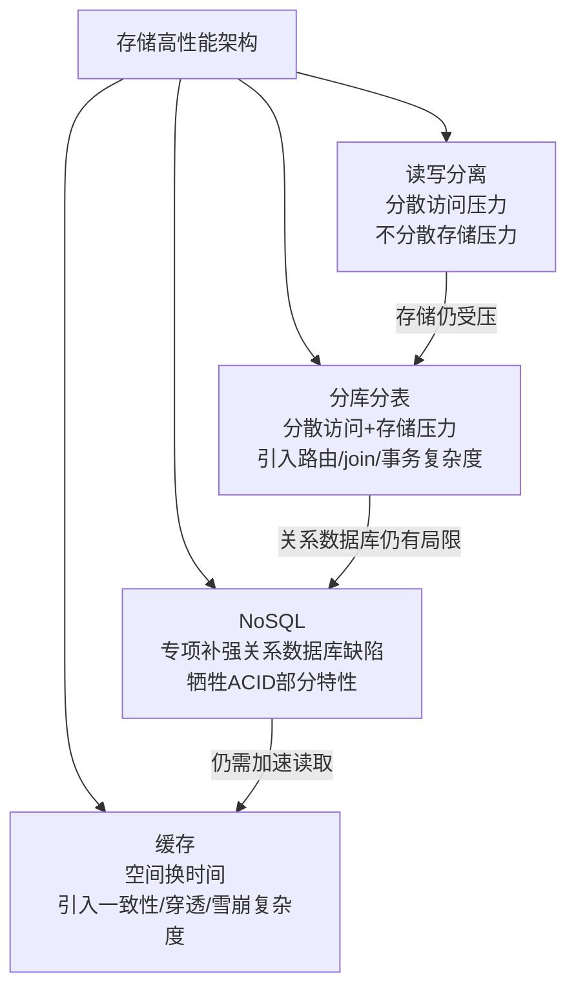

---

## 一、读写分离

### 1.1 原理

**读写分离的基本原理是将数据库读写操作分散到不同的节点上**，其基本实现方式为：

- 数据库服务器搭建主从集群，一主一从、一主多从都可以
- 数据库主机负责读写操作，从机只负责读操作
- 数据库主机通过复制将数据同步到从机，每台数据库服务器都存储了所有的业务数据
- 业务服务器将写操作发给数据库主机，将读操作发给数据库从机

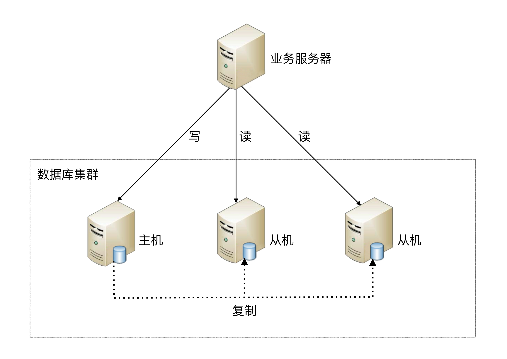

**"主从"与"主备"的区别**：

- **从机**（仆从）：帮主机干活，提供读数据功能
- **备机**：仅提供备份功能，不提供访问功能

使用"主从"还是"主备"取决于场景——需要从机分担读压力用"主从"，仅需要备份容灾用"主备"，二者不可等同。

读写分离的实现逻辑并不复杂，但有两个细节点将引入设计复杂度：**主从复制延迟**和**分配机制**。

### 1.2 复制延迟问题

以MySQL为例，主从复制延迟可能达到1秒，如果有大量数据同步，延迟1分钟也是有可能的。主从复制延迟会带来一个问题：如果业务服务器将数据写入到数据库主服务器后立刻（1秒内）进行读取，此时读操作访问的是从机，主机还没有将数据复制过来，到从机读取数据是读不到最新数据的，业务上就可能出现问题。

**典型场景**：用户刚注册完后立刻登录，业务服务器会提示他"你还没有注册"，而用户明明刚才已经注册成功了。

**三种应对策略**：

| 策略 | 做法 | 优势 | 劣势 |
|------|------|------|------|
| **写后读指向主机** | 写操作后的读操作直接发给数据库主服务器 | 确保读到的数据一定是最新的 | 与业务强绑定，侵入性大；新程序员不知道就会出bug |
| **二次读取** | 读从机失败后再读一次主机 | 与业务无绑定，只需对底层API封装，实现代价小 | 大量二次读取会大大增加主机读压力 |
| **关键业务全走主机** | 关键业务（注册+登录）读写操作全部访问主机，非关键业务采用读写分离 | 分级处理，兼顾安全与性能 | 需要明确划分哪些业务是"关键"的 |

**策略详解**：

1. **写后读指向主机**：例如注册账号完成后，登录时读取账号的读操作也发给数据库主服务器。这种方式和业务强绑定，对业务的侵入和影响较大，如果哪个新来的程序员不知道这样写代码，就会导致一个bug。

2. **二次读取**：这就是通常所说的"二次读取"，二次读取和业务无绑定，只需要对底层数据库访问的API进行封装即可，实现代价较小。不足之处在于如果有很多二次读取，将大大增加主机的读操作压力。例如，黑客暴力破解账号，会导致大量的二次读取操作，主机可能顶不住读操作的压力从而崩溃。

3. **关键业务全走主机**：例如，对于一个用户管理系统来说，注册+登录的业务读写操作全部访问主机，用户的介绍、爱好、等级等业务，可以采用读写分离，因为即使用户改了自己的自我介绍，在查询时却看到了自我介绍还是旧的，业务影响与不能登录相比就小很多，还可以忍受。

> **深度注记**：二次读取策略在攻击场景下尤其危险——黑客暴力破解会导致大量二次读取，主机可能顶不住读操作压力而崩溃。因此关键业务全走主机是最稳妥的策略。在实际架构设计中，通常采用策略3为主、策略1为辅的组合方式。

### 1.3 分配机制

将读写操作区分开来，然后访问不同的数据库服务器，一般有两种方式：**程序代码封装**和**中间件封装**。

#### 程序代码封装

程序代码封装指在代码中抽象一个数据访问层（所以有的文章也称这种方式为"中间层封装"），实现读写操作分离和数据库服务器连接的管理。例如，基于Hibernate进行简单封装，就可以实现读写分离。

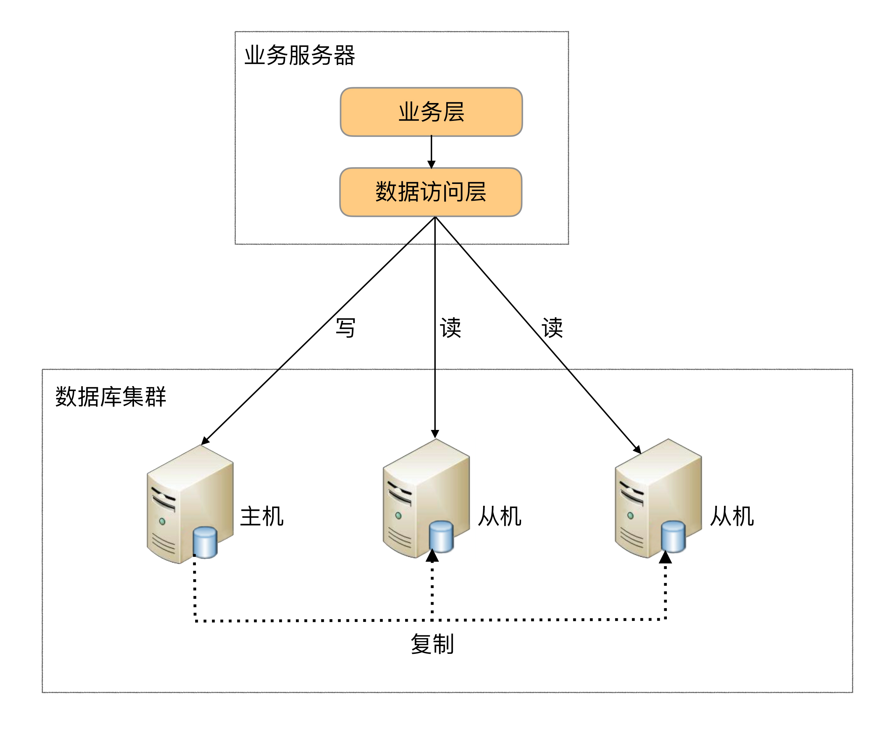

程序代码封装的方式具备几个特点：

- 实现简单，而且可以根据业务做较多定制化的功能
- 每个编程语言都需要自己实现一次，无法通用，如果一个业务包含多个编程语言写的多个子系统，则重复开发的工作量比较大
- 故障情况下，如果主从发生切换，则可能需要所有系统都修改配置并重启

目前开源的实现方案中，淘宝的TDDL（Taobao Distributed Data Layer，外号：头都大了）是比较有名的。它是一个通用数据访问层，所有功能封装在jar包中提供给业务代码调用。其基本原理是一个基于集中式配置的jdbc datasource实现，具有主备、读写分离、动态数据库配置等功能。

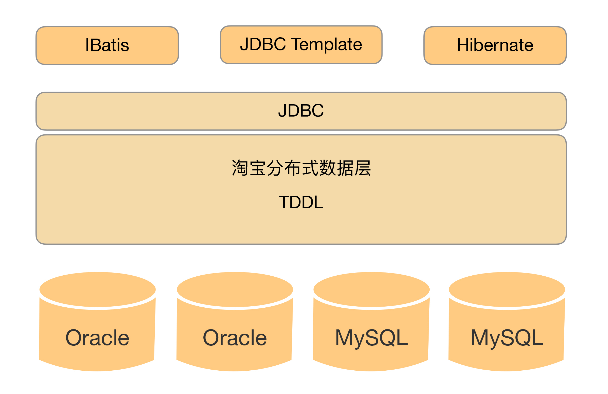

#### 中间件封装

中间件封装指的是独立一套系统出来，实现读写操作分离和数据库服务器连接的管理。中间件对业务服务器提供SQL兼容的协议，业务服务器无须自己进行读写分离。对于业务服务器来说，访问中间件和访问数据库没有区别，事实上在业务服务器看来，中间件就是一个数据库服务器。


数据库中间件的方式具备的特点是：

- 能够支持多种编程语言，因为数据库中间件对业务服务器提供的是标准SQL接口
- 数据库中间件要支持完整的SQL语法和数据库服务器的协议（例如，MySQL客户端和服务器的连接协议），实现比较复杂，细节特别多，很容易出现bug，需要较长的时间才能稳定
- 数据库中间件自己不执行真正的读写操作，但所有的数据库操作请求都要经过中间件，中间件的性能要求也很高
- 数据库主从切换对业务服务器无感知，数据库中间件可以探测数据库服务器的主从状态。例如，向某个测试表写入一条数据，成功的就是主机，失败的就是从机

由于数据库中间件的复杂度要比程序代码封装高出一个数量级，一般情况下建议采用程序语言封装的方式，或者使用成熟的开源数据库中间件。如果是大公司，可以投入人力去实现数据库中间件，因为这个系统一旦做好，接入的业务系统越多，节省的程序开发投入就越多，价值也越大。

**开源方案**：

- **MySQL Router**：MySQL官方推荐，主要功能有读写分离、故障自动切换、负载均衡、连接池等

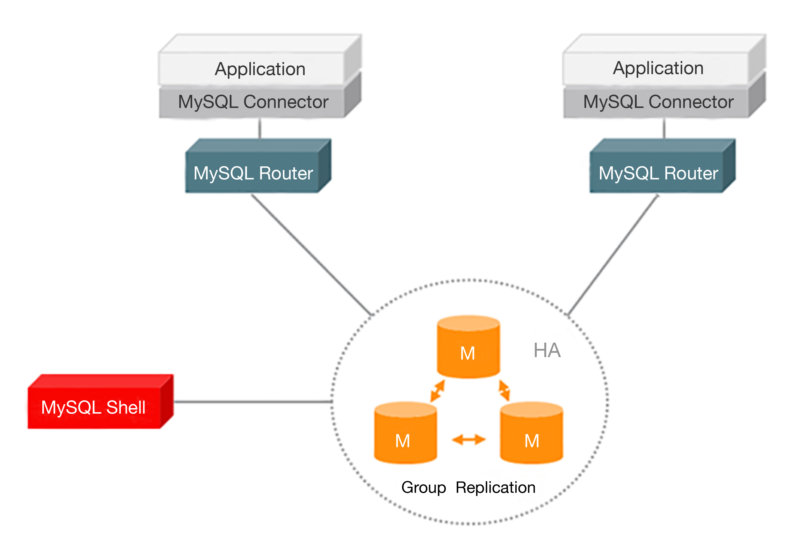

- **Atlas**（奇虎360，已停止维护，仅作技术方案参考）：基于MySQL Proxy实现，位于应用程序与MySQL之间的中间件。在后端DB看来，Atlas相当于连接它的客户端，在前端应用看来，Atlas相当于一个DB。Atlas作为服务端与应用程序通信，它实现了MySQL的客户端和服务端协议，同时作为客户端与MySQL通信。它对应用程序屏蔽了DB的细节，同时为了降低MySQL负担，它还维护了连接池。

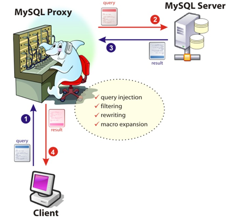

#### 两种方式的对比

| 维度 | 程序代码封装 | 中间件封装 |
|------|------------|-----------|
| 实现复杂度 | 低 | 高（完整SQL+协议） |
| 多语言支持 | 不支持（每种语言实现一次） | 支持（标准SQL接口） |
| 主从切换感知 | 需要改配置重启 | 对业务透明 |
| 定制化 | 容易 | 困难 |
| 稳定性风险 | 低 | 高（易出bug） |
| 性能要求 | 一般 | 高（所有请求经过中间件） |
| 典型方案 | 淘宝TDDL | MySQL Router、Atlas |

**选择建议**：一般用程序代码封装；大公司可投入做中间件（接入业务越多价值越大）。

---

## 二、分库分表

读写分离分散了数据库读写操作的压力，但没有分散存储压力。当数据量达到千万甚至上亿条的时候，单台数据库服务器的存储能力会成为系统的瓶颈，主要体现在：

- 数据量太大，读写的性能会下降，即使有索引，索引也会变得很大，性能同样会下降
- 数据文件会变得很大，数据库备份和恢复需要耗费很长时间
- 数据文件越大，极端情况下丢失数据的风险越高（例如，机房火灾导致数据库主备机都发生故障）

基于上述原因，单个数据库服务器存储的数据量不能太大，需要控制在一定的范围内。为了满足业务数据存储的需求，就需要将存储分散到多台数据库服务器上。

### 2.1 业务分库

**业务分库指的是按照业务模块将数据分散到不同的数据库服务器**。例如，一个简单的电商网站，包括用户、商品、订单三个业务模块，我们可以将用户数据、商品数据、订单数据分开放到三台不同的数据库服务器上，而不是将所有数据都放在一台数据库服务器上。

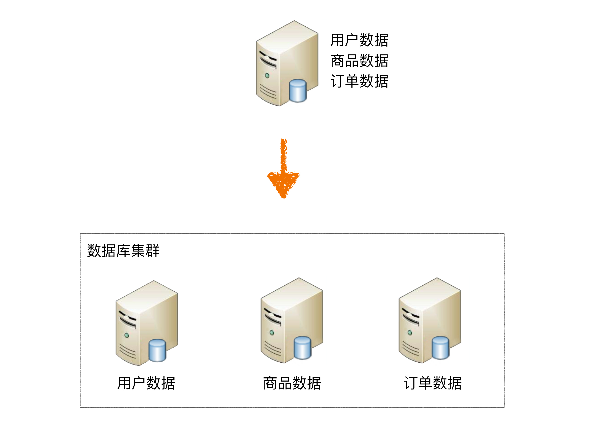

虽然业务分库能够分散存储和访问压力，但同时也带来了新的问题：

#### 问题1：join操作问题

业务分库后，原本在同一个数据库中的表分散到不同数据库中，导致无法使用SQL的join查询。

**示例**："查询购买了化妆品的用户中女性用户的列表"这个功能，虽然订单数据中有用户的ID信息，但是用户的性别数据在用户数据库中，如果在同一个库中，简单的join查询就能完成；但现在数据分散在两个不同的数据库中，无法做join查询，只能采取先从订单数据库中查询购买了化妆品的用户ID列表，然后再到用户数据库中查询这批用户ID中的女性用户列表，这样实现就比简单的join查询要复杂一些。

**解决方案**：接口聚合——在业务代码或服务层中分别查询不同库的数据，然后在内存中进行关联和合并。这种方式虽然可行，但代码复杂度显著增加，且多次查询的性能开销也更大。

#### 问题2：事务问题

原本在同一个数据库中不同的表可以在同一个事务中修改，业务分库后，表分散到不同的数据库中，无法通过事务统一修改。虽然数据库厂商提供了一些分布式事务的解决方案（例如，MySQL的XA），但性能实在太低，与高性能存储的目标是相违背的。

**示例**：用户下订单的时候需要扣商品库存，如果订单数据和商品数据在同一个数据库中，我们可以使用事务来保证扣减商品库存和生成订单的操作要么都成功要么都失败。但分库后就无法使用数据库事务了，需要业务程序自己来模拟实现事务的功能。例如，先扣商品库存，扣成功后生成订单，如果因为订单数据库异常导致生成订单失败，业务程序又需要将商品库存加上；而如果因为业务程序自己异常导致生成订单失败，则商品库存就无法恢复了，需要人工通过日志等方式来手工修复库存异常。

**代价**：分布式事务（如两阶段提交、TCC、Saga等）要么性能低，要么实现复杂，要么只保证最终一致性——这正是"解决一个问题引入更复杂问题"的典型体现。

#### 问题3：成本问题

业务分库同时也带来了成本的代价，本来1台服务器搞定的事情，现在要3台，如果考虑备份，那就是2台变成了6台。

#### 何时引入业务分库

| 场景 | 建议 | 原因 |
|------|------|------|
| **小公司初创业务** | 不建议一开始分库 | 业务不确定性大，分库不能带来价值；join/事务无法简单实现；代码映射逻辑增加工作量拖慢节奏 |
| **大公司新业务** | 建议一开始分库 | 用户量已很大，有成熟解决方案，分库价值明显 |

**按架构设计三原则分析**：

1. **"如果"发生的概率低**：做10个业务有1个能活下去就很不错了，更何况快速发展。如果每个业务上来就按照淘宝、微信的规模去做架构设计，不但会累死自己，还会害死业务。

2. **真的发展快再分库也不迟**：业务发展好，相应的资源投入就会加大，可以投入更多的人和更多的钱，分库带来的代码和业务复杂的问题就可以通过增加人来解决，成本问题也可以通过增加资金来解决。

3. **单台数据库没那么弱**：一般来说，单台数据库服务器能够支撑10万用户量级的业务，初创业务从0发展到10万级用户，并不是想象得那么快。

> **深度注记**：大公司（如淘宝）做新业务时，由于已有成熟的数据库解决方案，用户量也很大，需要在一开始就设计业务分库甚至分表方案——这与初创业务的小公司有本质区别。架构决策不能脱离具体的业务阶段和资源条件。

### 2.2 分表

将不同业务数据分散存储到不同的数据库服务器，能够支撑百万甚至千万用户规模的业务，但如果业务继续发展，同一业务的单表数据也会达到单台数据库服务器的处理瓶颈。例如，淘宝的几亿用户数据，如果全部存放在一台数据库服务器的一张表中，肯定是无法满足性能要求的，此时就需要对单表数据进行拆分。

单表数据拆分有两种方式：**垂直分表**和**水平分表**。

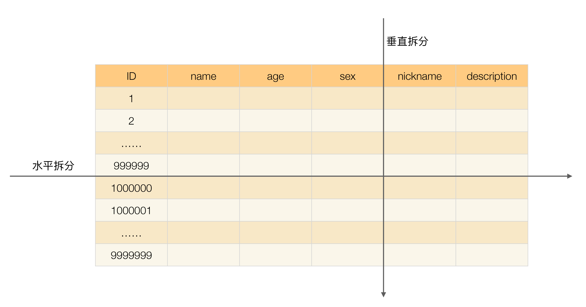

为了形象地理解垂直拆分和水平拆分的区别，可以想象你手里拿着一把刀，面对一个蛋糕切一刀：

- **从上往下切就是垂直切分**：刀的运行轨迹与蛋糕是垂直的，把蛋糕切成高度相等的两部分，对应到表的切分就是表记录数相同但包含不同的列。例如，垂直切分会把表切分为两个表，一个表包含ID、name、age、sex列，另外一个表包含ID、nickname、description列。
- **从左往右切就是水平切分**：刀的运行轨迹与蛋糕是平行的，把蛋糕切成面积相等的两部分，对应到表的切分就是表的列相同但包含不同的行数据。例如，水平切分会把表分为两个表，两个表都包含ID、name、age、sex、nickname、description列，但一个表包含的是ID从1到999999的行数据，另一个表包含的是ID从1000000到9999999的行数据。

实际架构设计过程中并不局限切分的次数，可以切两次，也可以切很多次，就像切蛋糕一样，可以切很多刀。

**重要决策**：单表进行切分后，是否要将切分后的多个表分散在不同的数据库服务器中，可以根据实际的切分效果来确定。如果单表拆分为多表后在同一数据库服务器中性能已满足要求，可以不拆分到多台服务器；如果单台服务器依然无法满足性能要求，就需要再次进行业务分库。

#### 垂直分表

垂直分表适合将表中某些不常用且占了大量空间的列拆分出去。例如，前面示意图中的nickname和description字段，假设我们是一个婚恋网站，用户在筛选其他用户的时候，主要是用age和sex两个字段进行查询，而nickname和description两个字段主要用于展示，一般不会在业务查询中用到。description本身又比较长，因此我们可以将这两个字段独立到另外一张表中，这样在查询age和sex时，就能带来一定的性能提升。

垂直分表引入的复杂性主要体现在表操作的数量要增加。例如，原来只要一次查询就可以获取name、age、sex、nickname、description，现在需要两次查询，一次查询获取name、age、sex，另外一次查询获取nickname、description。

不过相比水平分表，垂直分表的复杂性就是小巫见大巫了。

#### 水平分表

水平分表适合表行数特别大的表，有的公司要求单表行数超过5000万就必须进行分表，这个数字可以作为参考，但并不是绝对标准，关键还是要看表的访问性能。对于一些比较复杂的表，可能超过1000万就要分表了；而对于一些简单的表，即使存储数据超过1亿行，也可以不分表。但不管怎样，当看到表的数据量达到千万级别时，作为架构师就要警觉起来，因为这很可能是架构的性能瓶颈或者隐患。

水平分表相比垂直分表，会引入更多的复杂性，主要表现在**路由**、**join操作**、**count()操作**、**order by操作**等几个方面。

### 2.3 水平分表的三种路由算法

水平分表后，某条数据具体属于哪个切分后的子表，需要增加路由算法进行计算，这个算法会引入一定的复杂性。

#### 范围路由

选取有序的数据列（例如，整形、时间戳等）作为路由的条件，不同分段分散到不同的数据库表中。以最常见的用户ID为例，路由算法可以按照1000000的范围大小进行分段，1 ~ 999999放到数据库1的表中，1000000 ~ 1999999放到数据库2的表中，以此类推。

**设计复杂点**：分段大小的选取。分段太小会导致切分后子表数量过多，增加维护复杂度；分段太大可能会导致单表依然存在性能问题。一般建议分段大小在100万至2000万之间，具体需要根据业务选取合适的分段大小。

| 优势 | 劣势 |
|------|------|
| 可以随着数据的增加**平滑地扩充新的表**——原有数据不需要动 | **分布不均匀**——假如按照1000万分表，某段可能只存1000条，另一段存900万条 |

#### Hash路由

选取某个列（或者某几个列组合也可以）的值进行Hash运算，然后根据Hash结果分散到不同的数据库表中。同样以用户ID为例，假如我们一开始就规划了10个数据库表，路由算法可以简单地用user_id % 10的值来表示数据所属的数据库表编号，ID为985的用户放到编号为5的子表中，ID为10086的用户放到编号为6的子表中。

**设计复杂点**：初始表数量的选取。表数量太多维护比较麻烦，表数量太少又可能导致单表性能存在问题。而用了Hash路由后，增加子表数量是非常麻烦的，所有数据都要重分布。

| 优势 | 劣势 |
|------|------|
| **表分布比较均匀** | **扩充新的表很麻烦**——所有数据都要重分布 |

Hash路由的优缺点和范围路由基本相反，二者互为补充。

#### 配置路由

配置路由就是路由表，用一张独立的表来记录路由信息。同样以用户ID为例，我们新增一张user_router表，这个表包含user_id和table_id两列，根据user_id就可以查询对应的table_id。

| 优势 | 劣势 |
|------|------|
| 设计简单，使用灵活 | 必须多查询一次，影响整体性能 |
| 扩充表时只需迁移指定数据+修改路由表 | 路由表本身如果太大（几亿条），性能同样成为瓶颈 |
| - | 路由表分库分表则又面临路由算法选择的死循环问题 |

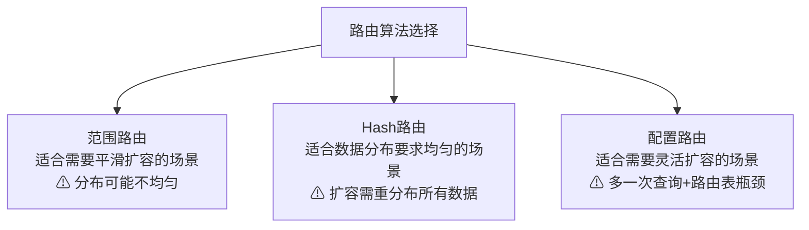

### 2.4 水平分表引入的其他复杂度

#### join操作

水平分表后，数据分散在多个表中，如果需要与其他表进行join查询，需要在业务代码或者数据库中间件中进行多次join查询，然后将结果合并。

**解决方案**：接口聚合——先分别查询各个子表，然后在业务代码中进行内存关联和合并。性能较低，代码复杂度也显著增加。

#### count()操作

水平分表后，虽然物理上数据分散到多个表中，但某些业务逻辑上还是会将这些表当作一个表来处理。例如，获取记录总数用于分页或者展示，水平分表前用一个count()就能完成的操作，在分表后就没那么简单了。

**方案1：count()相加**

具体做法是在业务代码或者数据库中间件中对每个表进行count()操作，然后将结果相加。这种方式实现简单，缺点就是性能比较低。例如，水平分表后切分为20张表，则要进行20次count(*)操作，如果串行的话，可能需要几秒钟才能得到结果。

**方案2：记录数表**

具体做法是新建一张表，假如表名为"记录数表"，包含table_name、row_count两个字段，每次插入或者删除子表数据成功后，都更新"记录数表"。

这种方式获取表记录数的性能要大大优于count()相加的方式，因为只需要一次简单查询就可以获取数据。缺点是复杂度增加不少，对子表的操作要同步操作"记录数表"，如果有一个业务逻辑遗漏了，数据就会不一致；且针对"记录数表"的操作和针对子表的操作无法放在同一事务中进行处理，异常的情况下会出现操作子表成功了而操作记录数表失败，同样会导致数据不一致。

**折中方案**：定时更新——对于不要求记录数实时精确的业务，通过后台定时执行count()相加计算表的记录数，然后更新记录数表中的数据。这实际上是"count()相加"和"记录数表"的结合。

#### order by操作

水平分表后，数据分散到多个子表中，排序操作无法在数据库中完成，只能由业务代码或者数据库中间件分别查询每个子表中的数据，然后汇总进行排序。这意味着排序必须在内存中完成，当数据量很大时内存排序的性能和资源消耗都是需要考虑的问题。

### 2.5 分库分表的实现方式

和数据库读写分离类似，分库分表具体的实现方式也是"程序代码封装"和"中间件封装"，但实现会更复杂。读写分离实现时只要识别SQL操作是读操作还是写操作，通过简单的判断SELECT、UPDATE、INSERT、DELETE几个关键字就可以做到，而分库分表的实现除了要判断操作类型外，还要判断SQL中具体需要操作的表、操作函数（例如count函数)、order by、group by操作等，然后再根据不同的操作进行不同的处理。例如order by操作，需要先从多个库查询到各个库的数据，然后再重新order by才能得到最终的结果。

---

## 三、NoSQL：关系数据库的专项补强

关系数据库经过几十年的发展后已经非常成熟，强大的SQL功能和ACID的属性，使得关系数据库广泛应用于各式各样的系统中，但这并不意味着关系数据库是完美的，关系数据库存在如下缺点：

- **关系数据库存储的是行记录，无法存储数据结构**：以微博的关注关系为例，"我关注的人"是一个用户ID列表，使用关系数据库存储只能将列表拆成多行，然后再查询出来组装，无法直接存储一个列表。
- **关系数据库的schema扩展很不方便**：关系数据库的表结构schema是强约束，操作不存在的列会报错，业务变化时扩充列也比较麻烦，需要执行DDL语句修改，而且修改时可能会长时间锁表（例如，MySQL可能将表锁住1个小时）。
- **关系数据库在大数据场景下I/O较高**：如果对一些大量数据的表进行统计之类的运算，关系数据库的I/O会很高，因为即使只针对其中某一列进行运算，关系数据库也会将整行数据从存储设备读入内存。
- **关系数据库的全文搜索功能比较弱**：关系数据库的全文搜索只能使用like进行整表扫描匹配，性能非常低，在互联网这种搜索复杂的场景下无法满足业务要求。

针对上述问题，分别诞生了不同的NoSQL解决方案。**NoSQL ≠ No SQL，而是NoSQL = Not Only SQL**——NoSQL不是替代关系数据库，而是作为SQL的一个有力补充。每种NoSQL方案带来的优势，本质上是牺牲ACID中的某个或者某几个特性，因此我们不能盲目地迷信NoSQL是银弹，而应该将NoSQL作为SQL的一个有力补充。

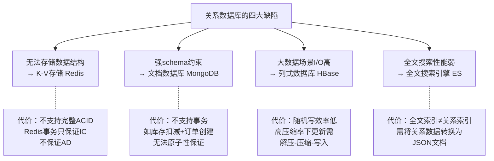

### 3.1 K-V存储：Redis

**解决的问题**：关系数据库无法直接存储数据结构（如列表、集合、哈希）。

Redis是K-V存储的典型代表，它是一款开源（基于BSD许可）的高性能K-V缓存和存储系统。Redis的Value是具体的数据结构，包括string、hash、list、set、sorted set、bitmap和hyperloglog，所以常常被称为数据结构服务器。

以List数据结构为例，Redis提供了下面这些典型的操作：

- LPOP key：从队列的左边出队一个元素
- LINDEX key index：获取一个元素，通过其索引列表
- LLEN key：获得队列（List）的长度
- RPOP key：从队列的右边出队一个元素

以上这些功能，如果用关系数据库来实现，就会变得很复杂。例如，LPOP操作是移除并返回key对应的list的第一个元素。如果用关系数据库来存储，为了达到同样目的，需要进行下面的操作：

- 每条数据除了数据编号（例如，行ID），还要有位置编号，否则没有办法判断哪条数据是第一条。注意这里不能用行ID作为位置编号，因为我们会往列表头部插入数据
- 查询出第一条数据
- 删除第一条数据
- 更新从第二条开始的所有数据的位置编号

可以看出关系数据库的实现很麻烦，而且需要进行多次SQL操作，性能很低。

**Redis各数据结构与关系数据库的对比**：

| Redis数据结构 | 关系数据库实现方式 | 复杂度 |
|--------------|-----------------|--------|
| String | 简单的行存储 | 低 |
| List | 需位置编号+多次SQL（查询+删除+更新位置） | 高 |
| Set | 需唯一约束+多次SQL | 中高 |
| Sorted Set | 需排序字段+复杂查询 | 高 |
| Hash | 需多列或关联表 | 中 |
| Bitmap | 需二进制字段+位操作 | 高 |
| HyperLogLog | 关系数据库无直接对应 | 极高 |

**代价**：Redis并不支持完整的ACID事务。Redis虽然提供事务功能，但Redis的事务和关系数据库的事务不可同日而语，Redis的事务只能保证隔离性和一致性（I和C），无法保证原子性和持久性（A和D）。

> **深度注记**：大部分业务也不需要严格遵循ACID原则——微博关注列表漏了一条，业务影响非常小。架构师应根据业务特性和要求来确定是否可以用Redis，而不能因为Redis不遵循ACID原则就直接放弃。关键在于评估"不遵循ACID的业务影响"与"使用Redis带来的性能收益"之间的取舍。

### 3.2 文档数据库：MongoDB

**解决的问题**：关系数据库schema扩展不便——增列需DDL操作可能锁表1小时。

文档数据库最大的特点就是**no-schema**，可以存储和读取任意的数据。目前绝大部分文档数据库存储的数据格式是JSON（或者BSON），因为JSON数据是自描述的，无须在使用前定义字段，读取一个JSON中不存在的字段也不会导致SQL那样的语法错误。

**no-schema特性带来的三大优势**：

1. **新增字段简单**：业务上增加新的字段，无须再像关系数据库一样要先执行DDL语句修改表结构，程序代码直接读写即可。

2. **历史数据不会出错**：对于历史数据，即使没有新增的字段，也不会导致错误，只会返回空值，此时代码进行兼容处理即可。

3. **可以很容易存储复杂数据**：JSON是一种强大的描述语言，能够描述复杂的数据结构。例如，我们设计一个用户管理系统，用户的信息有ID、姓名、性别、爱好、邮箱、地址、学历信息。其中爱好是列表（可以有多个爱好）；地址是一个结构，包括省市区楼盘地址；学历包括学校、专业、入学毕业年份信息等。如果用关系数据库来存储，需要设计多张表（基本信息、爱好、地址、学历），而使用文档数据库，一个JSON就可以全部描述：

```json
{
   "id": 10000,
   "name": "James",
   "sex": "male",
   "hobbies": ["football", "playing", "singing"],
   "email": "user@google.com",
   "address": {
       "province": "GuangDong",
       "city": "GuangZhou",
       "district": "Tianhe",
       "detail": "PingYun Road 163"
   },
   "education": [
       {
           "begin": "2000-09-01",
           "end": "2004-07-01",
           "school": "UESTC",
           "major": "Computer Science & Technology"
       },
       {
           "begin": "2004-09-01",
           "end": "2007-07-01",
           "school": "SCUT",
           "major": "Computer Science & Technology"
       }
   ]
}
```

**特别适合的业务场景**：

- **电商**：不同商品的属性差异很大。冰箱的属性和笔记本电脑的属性差异非常大，即使是同类商品也有不同的属性（如LCD和LED显示器有不同的参数指标）。使用关系数据库需要为每种商品设计不同的表或者使用EAV模式，非常麻烦；使用文档数据库，每个商品就是一个JSON文档，扩展新属性非常容易。

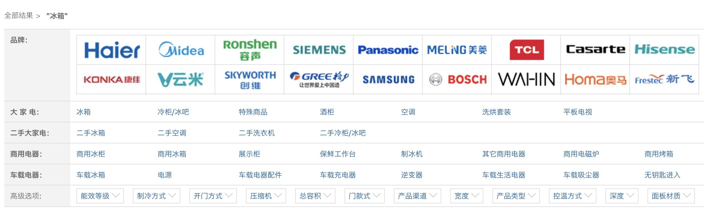

- **游戏**：角色属性多样且经常变化，no-schema特性让属性扩展极其方便。

**代价**：

1. **不支持事务**：使用MongoDB来存储商品库存，系统创建订单的时候首先需要减扣库存，然后再创建订单。这是一个事务操作，用关系数据库来实现就很简单，但如果用MongoDB来实现，就无法做到事务性。异常情况下可能出现库存被扣减了，但订单没有创建的情况。因此某些对事务要求严格的业务场景是不能使用文档数据库的。

2. **无法实现join操作**：例如，我们有一个用户信息表和一个订单表，订单表中有买家用户id。如果要查询"购买了苹果笔记本用户中的女性用户"，用关系数据库一个简单的join操作就搞定了；而用文档数据库是无法进行join查询的，需要查两次：一次查询订单表中购买了苹果笔记本的用户，然后再查询这些用户哪些是女性用户。

### 3.3 列式数据库：HBase

**解决的问题**：关系数据库大数据场景下I/O过高——统计某列数据却需读取整行。

顾名思义，列式数据库就是按照列来存储数据的数据库，与之对应的传统关系数据库被称为"行式数据库"，因为关系数据库是按照行来存储数据的。

关系数据库按照行式来存储数据，主要有以下优势：

- 业务同时读取多个列时效率高，因为这些列都是按行存储在一起的，一次磁盘操作就能够把一行数据中的各个列都读取到内存中
- 能够一次性完成对一行中的多个列的写操作，保证了针对行数据写操作的原子性和一致性

但是行式存储的优势是在特定的业务场景下才能体现。如果不存在这样的业务场景，那么行式存储的优势也将不复存在，甚至成为劣势。

**典型场景——海量数据统计**：计算某个城市体重超重的人员数据，实际上只需要读取每个人的体重这一列并进行统计即可，而行式存储即使最终只使用一列，也会将所有行数据都读取出来。如果单行用户信息有1KB，其中体重只有4个字节，行式存储还是会将整行1KB数据全部读取到内存中，这是明显的浪费。而如果采用列式存储，每个用户只需要读取4字节的体重数据即可，I/O将大大减少。

**列式存储的两大优势**：

1. **大幅节省I/O**：只读需要的列，而非整行
2. **更高的压缩比**：行式数据库一般压缩率在3:1到5:1左右，而列式数据库的压缩率一般在8:1到30:1左右，因为单个列的数据相似度相比行来说更高，能够达到更高的压缩率

**列式存储的劣势**（当场景变化时，优势变成劣势）：

1. **随机写效率低**：列式存储将不同列存储在磁盘上不连续的空间，导致更新多个列时磁盘是随机写操作；而行式存储时同一行多个列都存储在连续的空间，一次磁盘写操作就可以完成
2. **更新需解压→压缩→写入**：列式存储高压缩率在更新场景下成为劣势，因为更新时需要将存储数据解压后更新，然后再压缩，最后写入磁盘

**适用场景**：离线的大数据分析和统计场景——这种场景主要是针对部分列单列进行操作，且数据写入后就无须再更新删除。

> **深度注记**：行式存储与列式存储的选择，本质上是"读多行少列"还是"读少行多列"的取舍。OLTP场景（事务处理）适合行式存储，OLAP场景（分析处理）适合列式存储。现代系统（如TiDB的TiFlash、ClickHouse）则通过"行列混合"来兼顾两种场景。

### 3.4 全文搜索引擎：Elasticsearch

**解决的问题**：关系数据库全文搜索只能用like进行整表扫描，性能极低。

传统的关系型数据库通过索引来达到快速查询的目的，但是在全文搜索的业务场景下，索引也无能为力：

- 全文搜索的条件可以随意排列组合，如果通过索引来满足，则索引的数量会非常多
- 全文搜索的模糊匹配方式，索引无法满足，只能用like查询，而like查询是整表扫描，效率非常低

**典型场景——婚恋网站程序员信息搜索**：

假设我们做一个婚恋网站，程序员信息表包含姓名、性别、地点、单位、爱好、语言、自我介绍等字段。

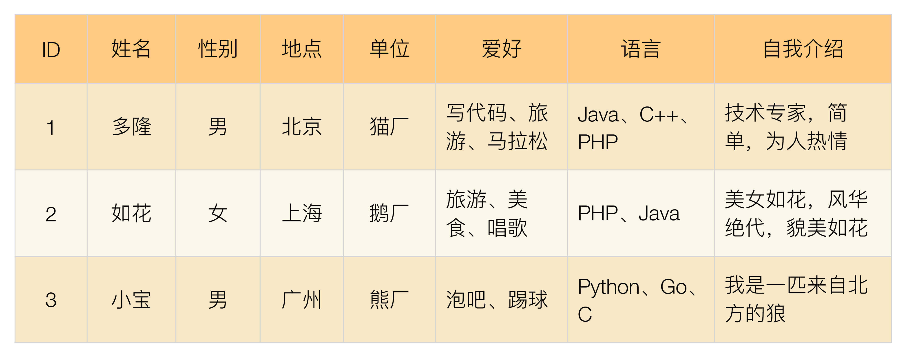

- 美女1搜索"性别 + PHP + 上海"：PHP需模糊匹配"语言"列，上海查"地点"列
- 美女2搜索"性别 + 鹅厂 + 旅游"：旅游需模糊匹配"爱好"列，鹅厂查"单位"列
- 美女3搜索"性别 + 猫厂 + 北京 + Java + 技术专家"：Java和技术专家都只能模糊匹配
- 帅哥4搜索"性别 + 美丽 + 美女"：只能模糊匹配"自我介绍"列

以上只是简单举例，实际上搜索条件是无法列举完全的，各种排列组合非常多，关系数据库在支撑全文搜索时力不从心。

#### 倒排索引原理

全文搜索引擎的技术原理被称为"倒排索引"（Inverted index），也常被称为反向索引，是一种索引方法，其基本原理是建立**单词到文档**的索引。之所以被称为"倒排"索引，是和"正排"索引相对的，"正排索引"的基本原理是建立**文档到单词**的索引。

**正排索引示例**：

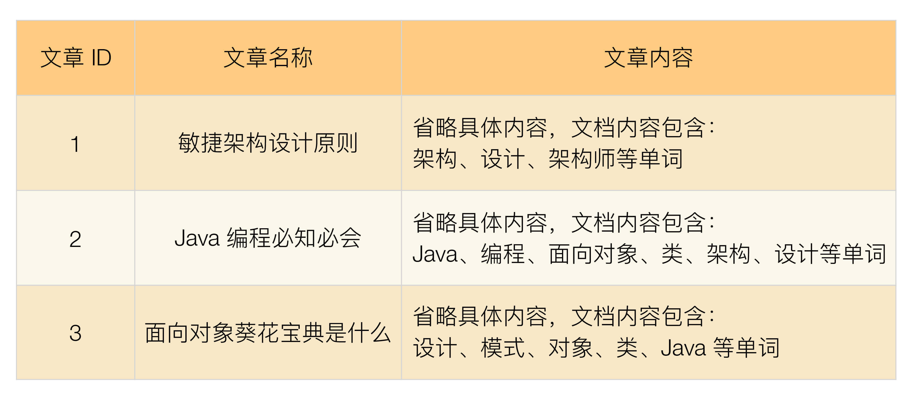

正排索引适用于根据文档名称来查询文档内容。例如，用户在网站上单击了"面向对象葵花宝典是什么"，网站根据文章标题查询文章的内容展示给用户。

**倒排索引示例**：

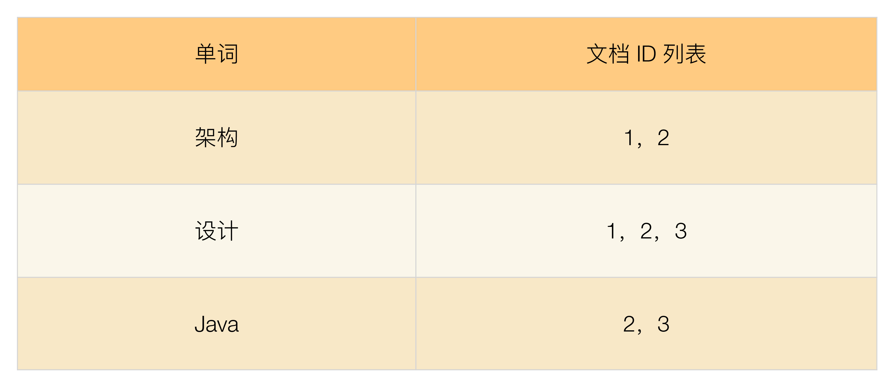

倒排索引适用于根据关键词来查询文档内容。例如，用户只是想看"设计"相关的文章，网站需要将文章内容中包含"设计"一词的文章都搜索出来展示给用户。

| 索引类型 | 映射方向 | 适用场景 |
|---------|---------|---------|
| 正排索引 | 文档→单词 | 根据文档名查内容 |
| 倒排索引 | 单词→文档 | 根据关键词搜索文档 |

#### 全文搜索的使用方式

全文搜索引擎的索引对象是单词和文档，而关系数据库的索引对象是键和行，两者的术语差异很大，不能简单地等同起来。因此，为了让全文搜索引擎支持关系型数据的全文搜索，需要做一些转换操作，即将关系型数据转换为文档数据。

目前常用的转换方式是将关系型数据按照对象的形式转换为JSON文档，然后将JSON文档输入全文搜索引擎进行索引。以程序员信息表为例，转换为JSON文档：

```json
{
 "id": 1,
 "姓名": "多隆",
 "性别": "男",
 "地点": "北京",
 "单位": "猫厂",
 "爱好": "写代码，旅游，马拉松",
 "语言": "Java、C++、PHP",
 "自我介绍": "技术专家，简单，为人热情"
}
```

Elasticsearch的索引原理：每个字段的所有数据都是默认被索引的，即每个字段都有为了快速检索设置的专用倒排索引。而且，能在相同的查询中使用所有倒排索引，并以惊人的速度返回结果。

**四类NoSQL方案对比**：

| 类型 | 代表产品 | 解决的问题 | 核心特性 | 代价 | 适用场景 |
|------|---------|-----------|---------|------|---------|
| K-V存储 | Redis/Memcache | 无法存储数据结构 | Value为数据结构，操作高效 | 不支持完整ACID | 缓存、会话、排行榜 |
| 文档数据库 | MongoDB | schema扩展不便 | no-schema，JSON/BSON格式 | 不支持事务和join | 电商商品、游戏角色 |
| 列式数据库 | HBase/Cassandra | 大数据I/O高 | 按列存储，高压缩比 | 随机写低效 | 离线大数据分析统计 |
| 全文搜索引擎 | Elasticsearch | like搜索性能低 | 倒排索引 | 需数据转换 | 全文搜索、日志分析 |

> **深度注记**：从许式伟的视角来看，B+树是关系数据库索引的基石（面向外存设计，降低树高、顺序化访问），而倒排索引则是全文搜索引擎的基石——两者都是"面向外存访问模型优化"的数据结构，只是优化方向不同：B+树优化范围查询的顺序扫描，倒排索引优化关键词到文档的快速定位。

---

## 四、缓存架构

虽然我们可以通过各种手段来提升存储系统的性能，但在某些复杂的业务场景下，单纯依靠存储系统的性能提升是不够的，典型的场景有：

- **需要经过复杂运算后得出的数据，存储系统无能为力**：例如，一个论坛需要在首页展示当前有多少用户同时在线，如果使用MySQL来存储当前用户状态，则每次获取这个总数都要"count(*)"大量数据，这样的操作无论怎么优化MySQL，性能都不会太高。
- **读多写少的数据，存储系统有心无力**：绝大部分在线业务都是读多写少。例如微博，一个明星发一条微博，可能几千万人来浏览。用户写微博只有一条insert语句，但每个用户浏览时都要select一次，几千万条select语句对MySQL的压力非常大。

**缓存的本质**：将可能重复使用的数据放到内存中，一次生成、多次使用，避免每次使用都去访问存储系统。

**性能数据**：以Memcache为例，单台Memcache服务器简单的key-value查询能够达到TPS 50000以上（示例量级，非实测数据，具体因硬件与数据结构而异）。

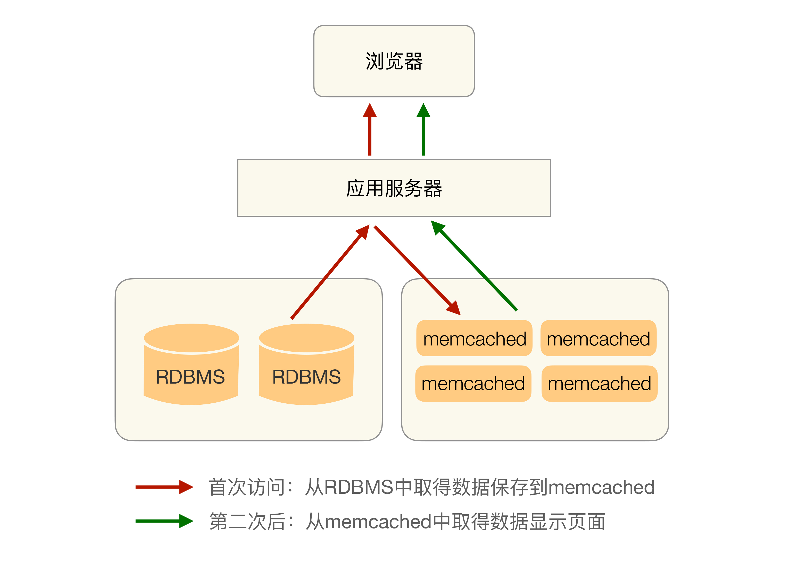

缓存虽然能够大大减轻存储系统的压力，但同时也给架构引入了更多复杂性。架构设计时如果没有针对缓存的复杂性进行处理，某些场景下甚至会导致整个系统崩溃。

### 4.1 缓存的分层体系

```mermaid
graph TB
    subgraph 访问速度递减·容量递增
        CPU["CPU缓存<br/>ns级 / KB级"] --> MEM["内存<br/>ns~μs级 / GB级"]
        MEM --> L1["本地缓存<br/>μs级 / GB级"]
        L1 --> L2["分布式缓存<br/>ms级 / TB级"]
        L2 --> DB["数据库/磁盘<br/>ms~s级 / PB级"]
        DB --> COLD["冷存储<br/>s~min级 / EB级"]
    end

```

**核心定律**：速度越快容量越小成本越高。缓存是在层级链路中插入一个"速度-成本平衡点"。

### 4.2 缓存更新策略

| 策略 | 写操作 | 读操作 | 一致性 | 适用场景 |
|------|--------|--------|--------|---------|
| **Cache-Aside** | 先更新DB再删缓存 | 先查缓存，未命中查DB | 最终一致 | 通用场景（最常用） |
| **Read-Through** | 同Cache-Aside | 缓存层自动加载 | 最终一致 | 简化应用层 |
| **Write-Through** | 同步写DB和缓存 | 同Read-Through | 强一致 | 数据安全优先 |
| **Write-Behind** | 只写缓存异步写DB | 同Read-Through | 弱一致 | 写密集场景 |
| **Write-Around** | 只写DB不更新缓存 | 同Cache-Aside | 最终一致 | 写多读少 |

> **深度注记**：Cache-Aside是最常用的策略，但"先更新DB再删缓存"在极端并发场景下仍可能出现短暂不一致（缓存删除失败或删除后又被旧数据回填）。对此的常见应对是：延迟双删（删缓存→更新DB→延迟再删），或依赖消息队列保证删除成功。

### 4.3 缓存穿透

**缓存穿透**是指缓存没有发挥作用，业务系统虽然去缓存查询数据，但缓存中没有数据，业务系统需要再次去存储系统查询数据。通常情况下有两种情况：

#### 情况1：存储数据不存在

被访问的数据确实不存在。一般情况下，如果存储系统中没有某个数据，则不会在缓存中存储相应的数据，这样就导致用户查询的时候，在缓存中找不到对应的数据，每次都要去存储系统中再查询一遍，然后返回数据不存在。缓存在这个场景中并没有起到分担存储系统访问压力的作用。

通常情况下，业务上读取不存在的数据的请求量并不会太大，但如果出现一些异常情况，例如被黑客攻击，故意大量访问某些读取不存在数据的业务，有可能会将存储系统拖垮。

**解决方案——空值缓存**：如果查询存储系统的数据没有找到，则直接设置一个默认值（可以是空值，也可以是具体的值）存到缓存中，这样第二次读取缓存时就会获取到默认值，而不会继续访问存储系统。

**进阶方案——布隆过滤器**：在缓存之前加一层布隆过滤器，将所有可能存在的数据哈希到一个足够大的bitmap中。当查询一个不存在的数据时，布隆过滤器能直接拦截，避免穿透到存储系统。布隆过滤器的优点是空间效率和查询时间都远超一般算法，缺点是有一定的误判率（存在不一定存在，不存在一定不存在）和删除困难。

#### 情况2：缓存数据生成耗费大量时间或者资源

存储系统中存在数据，但生成缓存数据需要耗费较长时间或者耗费大量资源。如果刚好在业务访问的时候缓存失效了，那么也会出现缓存没有发挥作用，访问压力全部集中在存储系统上的情况。

**典型场景——电商商品分页**：

- 分页缓存的有效期设置为1天，因为设置太长时间的话，缓存不能反应真实的数据
- 通常情况下，用户不会从第1页到最后1页全部看完，一般用户访问集中在前10页，因此第10页以后的缓存过期失效的可能性很大
- 竞争对手每周来爬取数据，爬虫会将所有分类的所有数据全部遍历，从第1页到最后1页全部都会读取，此时很多分页缓存可能都失效了
- 由于很多分页都没有缓存数据，从数据库中生成缓存数据又非常耗费性能（order by limit操作），因此爬虫会将整个数据库全部拖慢

**应对方案**：

- 识别爬虫然后禁止访问（可能影响SEO和推广）
- 做好监控，发现问题后及时处理（爬虫不是攻击，不会暴力破坏，影响是逐步的，有时间处理）
- 对热点分页预生成缓存

### 4.4 缓存雪崩

**缓存雪崩**是指当缓存失效（过期）后引起系统性能急剧下降的情况。当缓存过期被清除后，业务系统需要重新生成缓存，因此需要再次访问存储系统，再次进行运算，这个处理步骤耗时几十毫秒甚至上百毫秒。而对于一个高并发的业务系统来说，几百毫秒内可能会接到几百上千个请求。由于旧的缓存已经被清除，新的缓存还未生成，并且处理这些请求的线程都不知道另外有一个线程正在生成缓存，因此所有的请求都会去重新生成缓存，都会去访问存储系统，从而对存储系统造成巨大的性能压力。这些压力又会拖慢整个系统，严重的会造成数据库宕机，从而形成一系列连锁反应，造成整个系统崩溃。

**缓存雪崩的两种解决方法**：

#### 方案1：更新锁机制

对缓存更新操作进行加锁保护，保证只有一个线程能够进行缓存更新，未能获取更新锁的线程要么等待锁释放后重新读取缓存，要么就返回空值或者默认值。

**分布式场景的挑战**：对于采用分布式集群的业务系统，由于存在几十上百台服务器，即使单台服务器只有一个线程更新缓存，但几十上百台服务器一起算下来也会有几十上百个线程同时来更新缓存，同样存在雪崩的问题。因此分布式集群的业务系统要实现更新锁机制，需要用到分布式锁，如ZooKeeper。

#### 方案2：后台更新机制

由后台线程来更新缓存，而不是由业务线程来更新缓存，缓存本身的有效期设置为永久，后台线程定时更新缓存。

**需要考虑的特殊场景**：当缓存系统内存不够时，会"踢掉"一些缓存数据，从缓存被"踢掉"到下一次定时更新缓存的这段时间内，业务线程读取缓存返回空值，而业务线程本身又不会去更新缓存，因此业务上看到的现象就是数据丢了。

**解决被踢掉问题的两种方式**：

1. **后台线程频繁读取**：后台线程除了定时更新缓存，还要频繁地去读取缓存（例如，1秒或者100毫秒读取一次），如果发现缓存被"踢了"就立刻更新缓存。实现简单，但读取时间间隔不能设置太长，否则缓存被踢后业务访问会拿到空值。

2. **消息队列通知**：业务线程发现缓存失效后，通过消息队列发送一条消息通知后台线程更新缓存。可能会出现多个业务线程都发送了缓存更新消息，但其实对后台线程没有影响，后台线程收到消息后更新缓存前可以判断缓存是否存在，存在就不执行更新操作。这种方式实现依赖消息队列，复杂度会高一些，但缓存更新更及时，用户体验更好。

**两种方案对比**：

| 维度 | 更新锁 | 后台更新 |
|------|--------|---------|
| 复杂度 | 需要分布式锁（如ZooKeeper） | 相对简单 |
| 适用范围 | 单机简单，分布式复杂 | 单机和分布式都适用 |
| 缓存预热 | 不支持 | 支持（系统上线后直接加载缓存） |
| 推荐度 | 一般 | **更优** |

> **深度注记**：后台更新机制更优——既适应单机也适合分布式，比更新锁简单。还适合缓存预热（系统上线后直接加载缓存数据，不等用户访问触发）。实际架构设计中，后台更新是更常用的方案。

**防止雪崩的其他策略**：

- **不同过期时间**：不同缓存设置不同的过期时间，避免大量缓存同时失效
- **备份缓存**：设置主缓存和备份缓存，主缓存失效时先读备份缓存
- **单机缓存**：在分布式缓存之上加一层本地缓存（如Guava Cache），即使分布式缓存全部失效，本地缓存仍可挡住部分请求

### 4.5 缓存热点

虽然缓存系统本身的性能比较高，但对于一些特别热点的数据，如果大部分甚至所有的业务请求都命中同一份缓存数据，则这份数据所在的缓存服务器的压力也很大。例如，某明星微博发布"我们"来宣告恋爱了，短时间内上千万的用户都会来围观。

**缓存热点的解决方案就是复制多份缓存副本，将请求分散到多个缓存服务器上，减轻缓存热点导致的单台缓存服务器压力**。

以微博为例，对于粉丝数超过100万的明星，每条微博都可以生成100份缓存，缓存的数据是一样的，通过在缓存的key里面加上编号进行区分，每次读缓存时都随机读取其中某份缓存。

**关键细节**：不同的缓存副本不要设置统一的过期时间，否则就会出现所有缓存副本同时生成同时失效的情况，从而引发缓存雪崩效应。正确的做法是设定一个过期时间范围，不同的缓存副本的过期时间是指定范围内的随机值。

**本地缓存 + 分布式缓存的两级架构**：

对于热点数据，还可以采用"本地缓存 + 分布式缓存"的两级缓存架构。本地缓存（如Guava Cache）部署在应用服务器上，读取速度极快（微秒级），但容量有限且不共享；分布式缓存（如Redis集群）容量大且共享，但读取速度稍慢（毫秒级）。热点数据同时缓存在本地和分布式缓存中，大部分请求被本地缓存拦截，只有本地缓存未命中时才访问分布式缓存，进一步减轻分布式缓存的压力。

### 4.6 缓存实现方式

由于缓存的各种访问策略和存储的访问策略是相关的，因此上面的各种缓存设计方案通常情况下都是集成在存储访问方案中，可以采用"程序代码实现"的中间层方式，也可以采用独立的中间件来实现。

---

## 五、存储高性能架构的统一视图

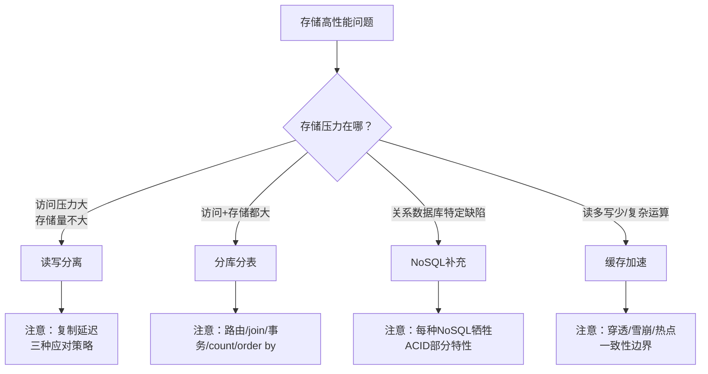

---

## 总结

| 核心要点 | 关键结论 |
|---------|---------|
| 读写分离原理 | 分散访问压力但不分散存储压力；主机负责读写，从机只负责读 |
| 复制延迟 | MySQL主从延迟可达1秒~1分钟；三种策略：写后读指向主机、二次读取、关键业务全走主机 |
| 分配机制 | 程序代码封装（简单可定制，如TDDL）vs 中间件封装（多语言透明但复杂，如MySQL Router/Atlas） |
| 业务分库 | 分散存储和访问压力；引入join/事务/成本问题；小公司不建议一开始分库，大公司建议一开始就分 |
| 垂直分表 | 将不常用且占空间的列拆分出去；复杂度：查询次数增加 |
| 水平分表 | 按规则将行数据分散到多个子表；判断标准看访问性能而非绝对行数 |
| 范围路由 | 平滑扩容但分布不均匀；适合需要逐步扩容的场景 |
| Hash路由 | 分布均匀但扩容需重分布所有数据；适合数据分布要求均匀的场景 |
| 配置路由 | 灵活但多一次查询+路由表可能成为瓶颈；适合需要灵活扩容的场景 |
| 分表衍生问题 | join→接口聚合；count()→相加或记录数表；order by→内存排序 |
| NoSQL定位 | Not Only SQL而非No SQL；每种方案牺牲ACID某特性来换取特定优势 |
| K-V存储 | Redis解决数据结构存储问题；代价是不完整ACID（只保证IC不保证AD） |
| 文档数据库 | MongoDB解决schema扩展问题；代价是不支持事务和join |
| 列式数据库 | HBase解决大数据I/O问题；代价是随机写低效；适合离线分析 |
| 全文搜索引擎 | ES解决like搜索性能问题；核心技术是倒排索引 |
| 缓存穿透 | 数据不存在→空值缓存/布隆过滤器；缓存生成耗资源→监控+识别爬虫 |
| 缓存雪崩 | 更新锁或后台更新；后台更新更简单更通用；还支持缓存预热 |
| 缓存热点 | 复制多份缓存副本+随机过期时间；本地缓存+分布式缓存两级架构 |

**思考题**：
1. 数据库读写分离一般应用于什么场景？能支撑多大的业务规模？
2. 你认为什么时候引入分库分表是合适的？是数据库性能不够的时候就开始分库分表么？
3. 因为NoSQL的方案功能都很强大，有人认为NoSQL = No SQL，架构设计的时候无需再使用关系数据库，对此你怎么看？
4. 分享一下你所在的业务发生过哪些因为缓存导致的线上问题？采取了什么样的解决方案？效果如何？

**关联阅读**：
- [复杂度来源：高性能](05-复杂度来源.md)
- [计算高性能：Reactor与负载均衡](09-计算高性能.md)

---

> **延伸视角**（许式伟）
>
> 华仔从"架构模式"角度系统梳理了存储高性能的四种方案，侧重实践中的问题与解决。许式伟从"数据结构"角度提供了更底层的理解：
>
> **1. 存储即数据结构**。KV存储本质是外存上的HashMap，数据库本质是外存上的B+树+SQL引擎，全文搜索引擎本质是外存上的倒排索引。理解底层数据结构，才能理解每种方案的性能边界——B+树为范围查询优化（顺序扫描叶节点链表），倒排索引为关键词查找优化（单词→文档直接映射），LSM-Tree为写入优化（MemTable→SSTable逐层合并）。
>
> **2. 缓存策略是一致性边界的妥协**。华仔侧重缓存穿透/雪崩/热点的工程解决方案，许式伟则将其归入"一致性边界的妥协"框架：Cache-Aside是最终一致，Write-Through是强一致，Write-Behind是弱一致——选择哪种策略，本质上是在一致性、性能、可靠性之间做权衡取舍。
>
> **3. 存储层级是架构师的决策全景**。从CPU缓存→内存→本地缓存→分布式缓存→数据库→冷存储，每一层都是架构决策点。许式伟的宏观视角要求架构师掌握每一层的访问模型和成本特性，才能做出最优的分层组合。
>
> **4. 分库分表是"分解"心法的存储层体现**。业务分库是按业务维度分解，垂直分表是按列维度分解，水平分表是按行维度分解——三种分法都是"分解"原则的应用。但分解引入的join、事务、路由问题，又需要通过"聚合"（接口聚合、分布式事务、路由表）来弥补，体现了架构设计中"分解与聚合"的辩证统一。
