# 计算高性能 | PPC·TPC·Reactor·Proactor·负载均衡

## 章节导言

计算高性能的架构设计分为两个层面：**单服务器高性能**和**集群高性能**。单服务器性能决定了系统性能的上限（架构设计），实现细节决定了下限（编码优化）。

单服务器高性能的核心是**并发模型**——服务器如何管理连接、如何处理请求，最终都归结为I/O模型（阻塞/非阻塞/同步/异步）和进程模型（单进程/多进程/多线程）的组合。从PPC/TPC到Reactor/Proactor，是并发模型从"每连接一进程/线程"到"I/O多路复用+事件驱动"的演进。

集群高性能的核心是**负载均衡**——将计算任务合理分配到多台服务器。负载均衡不只是"让各服务器负载相等"，不同算法的目标不同：有的追求公平分配，有的追求最低延迟，有的追求会话亲和。

**核心问题**：
1. PPC/TPC的局限是什么？prefork/prethread如何缓解？
2. Reactor三种变体各自适用什么场景？Nginx和Netty为何选择不同？
3. Proactor比Reactor效率更高，为何Linux下仍以Reactor为主？
4. 负载均衡三层架构（DNS→硬件→软件）如何组合？各算法适用什么场景？

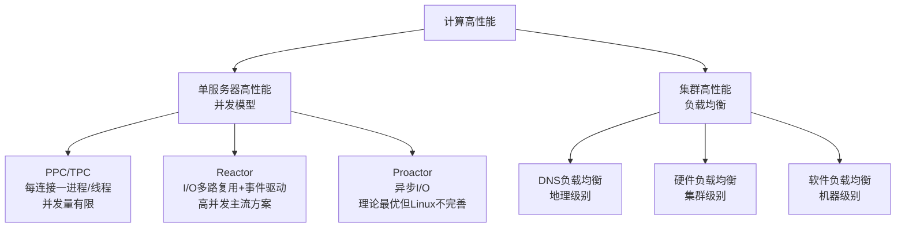

---

## 一、PPC与TPC：传统并发模型

高性能是每个程序员的追求，无论我们是做一个系统还是写一行代码，都希望能够达到高性能的效果，而高性能又是最复杂的一环。磁盘、操作系统、CPU、内存、缓存、网络、编程语言、架构等，每个环节都有可能影响系统达到高性能——一行不恰当的debug日志，就可能将服务器的性能从TPS 30000降低到8000；一个tcp_nodelay参数，就可能将响应时间从2毫秒延长到40毫秒。因此，要做到高性能是一件很复杂很有挑战的事情，软件系统开发过程中的不同阶段都关系着高性能最终是否能够实现。

站在架构师的角度，当然需要特别关注高性能架构的设计。高性能架构设计主要集中在两方面：

- 尽量提升单服务器的性能，将单服务器的性能发挥到极致
- 如果单服务器无法支撑性能，设计服务器集群方案

除了以上两点，最终系统能否实现高性能，还和具体的实现及编码相关。但架构设计是高性能的基础，如果架构设计没有做到高性能，则后面的具体实现和编码能提升的空间是有限的。形象地说，**架构设计决定了系统性能的上限，实现细节决定了系统性能的下限**。

单服务器高性能的关键之一就是**服务器采取的并发模型**，并发模型有如下两个关键设计点：

- 服务器如何管理连接
- 服务器如何处理请求

以上两个设计点最终都和操作系统的I/O模型及进程模型相关：

- I/O模型：阻塞、非阻塞、同步、异步
- 进程模型：单进程、多进程、多线程

在下面详细介绍并发模型时会用到上面这些基础的知识点，建议先检测一下对这些基础知识的掌握情况，更多内容可以参考《UNIX网络编程》三卷本。

### 1.1 PPC（Process Per Connection）

PPC是Process Per Connection的缩写，其含义是指每次有新的连接就新建一个进程去专门处理这个连接的请求，这是传统的UNIX网络服务器所采用的模型。

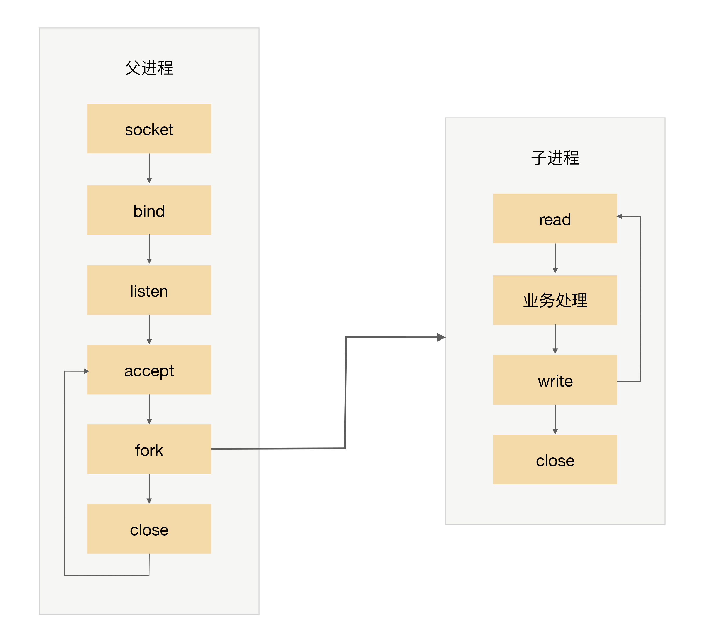

**基本流程**：

1. 父进程接受连接（accept）
2. 父进程"fork"子进程
3. 子进程处理连接的读写请求（read→业务处理→write）
4. 子进程关闭连接（close）

**关键细节**：父进程"fork"子进程后，直接调用了close，看起来好像是关闭了连接，其实只是将连接的文件描述符引用计数减一，真正的关闭连接是等子进程也调用close后，连接对应的文件描述符引用计数变为0后，操作系统才会真正关闭连接。

**PPC模式的三大问题**：

| 问题 | 说明 |
|------|------|
| **fork代价高** | 站在操作系统的角度，创建一个进程的代价是很高的，需要分配很多内核资源，需要将内存映像从父进程复制到子进程。即使现在的操作系统在复制内存映像时用到了Copy on Write（写时复制）技术，总体来说创建进程的代价还是很大的 |
| **父子进程通信复杂** | 父进程"fork"子进程时，文件描述符可以通过内存映像复制从父进程传到子进程，但"fork"完成后，父子进程通信就比较麻烦了，需要采用IPC（Interprocess Communication）之类的进程通信方案。例如，子进程需要在close之前告诉父进程自己处理了多少个请求以支撑父进程进行全局的统计，那么子进程和父进程必须采用IPC方案来传递信息 |
| **支持的并发连接数量有限** | 如果每个连接存活时间比较长，而且新的连接又源源不断的进来，则进程数量会越来越多，操作系统进程调度和切换的频率也越来越高，系统的压力也会越来越大。因此，一般情况下，PPC方案能处理的并发连接数量最大也就几百 |

**适用场景**：PPC模式实现简单，比较适合服务器的连接数没那么多的情况，例如数据库服务器。对于普通的业务服务器，在互联网兴起之前，由于服务器的访问量和并发量并没有那么大，这种模式其实运作得也挺好，世界上第一个web服务器CERN httpd就采用了这种模式。互联网兴起后，服务器的并发和访问量从几十剧增到成千上万，这种模式的弊端就凸显出来了。

### 1.2 prefork

PPC模式中，当连接进来时才fork新进程来处理连接请求，由于fork进程代价高，用户访问时可能感觉比较慢，prefork模式的出现就是为了解决这个问题。

顾名思义，prefork就是提前创建进程（pre-fork）。系统在启动的时候就预先创建好进程，然后才开始接受用户的请求，当有新的连接进来的时候，就可以省去fork进程的操作，让用户访问更快、体验更好。

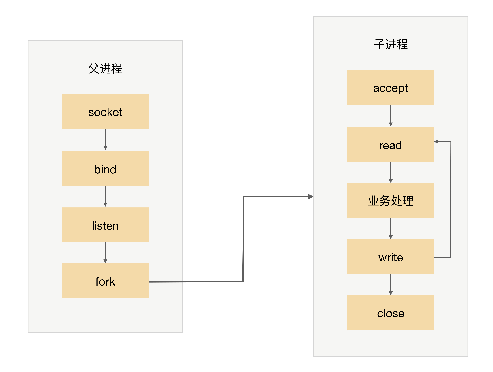

**实现关键**：多个子进程都accept同一个socket，当有新的连接进入时，操作系统保证只有一个进程能最后accept成功。

**"惊群"现象**：虽然只有一个子进程能accept成功，但所有阻塞在accept上的子进程都会被唤醒，这样就导致了不必要的进程调度和上下文切换。幸运的是，操作系统可以解决这个问题，例如Linux 2.6版本后内核已经解决了accept惊群问题。

**遗留问题**：prefork模式和PPC一样，还是存在父子进程通信复杂、支持的并发连接数量有限的问题，因此目前实际应用也不多。Apache服务器提供了MPM prefork模式，推荐在需要可靠性或者与旧软件兼容的站点时采用这种模式，默认情况下最大支持256个并发连接。在Apache官方的说明中，还特别指出了prefork模式的一个优点：如果某个子进程出现了异常，不会影响其他的子进程，稳定性比较高。但这个优点其实是进程模型本身的特性，并非prefork模式所独有的。

### 1.3 TPC（Thread Per Connection）

TPC是Thread Per Connection的缩写，其含义是指每次有新的连接就新建一个线程去专门处理这个连接的请求。与进程相比，线程更轻量级，创建线程的消耗比进程要少得多；同时多线程是共享进程内存空间的，线程通信相比进程通信更简单。因此，TPC实际上是解决或者弱化了PPC fork代价高的问题和父子进程通信复杂的问题。

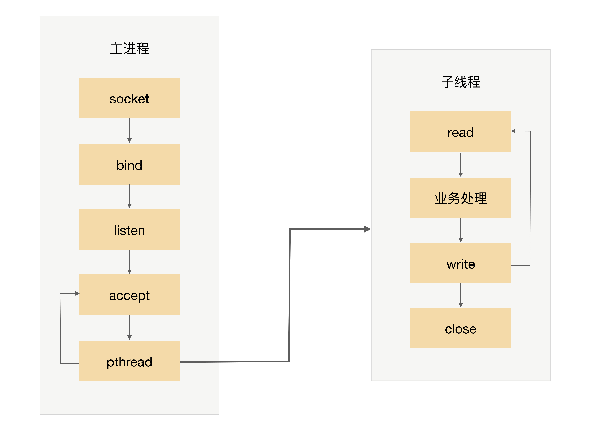

**基本流程**：

1. 父进程接受连接（accept）
2. 父进程创建子线程（pthread）
3. 子线程处理连接的读写请求（read→业务处理→write）
4. 子线程关闭连接（close）

**与PPC的关键区别**：主进程不用"close"连接了。原因在于子线程是共享主进程的进程空间的，连接的文件描述符并没有被复制，因此只需要一次close即可。

**TPC相比PPC的改进与新问题**：

| 相比PPC的改进 | 新引入的问题 |
|-------------|------------|
| 创建线程比创建进程代价低 | 高并发时（每秒上万连接）仍有性能问题 |
| 无须IPC，线程通信简单 | 线程间互斥和共享可能死锁 |
| 主进程不用close连接 | 某线程异常可能导致整个进程退出（如内存越界） |

**TPC的本质局限**：TPC还是存在CPU线程调度和切换代价的问题。因此，TPC方案本质上和PPC方案基本类似，在并发几百连接的场景下，反而更多地是采用PPC的方案，因为PPC方案不会有死锁的风险，也不会多进程互相影响，稳定性更高。

**PPC vs TPC的选择**：虽然TPC解决了PPC的fork代价高和IPC复杂问题，但引入了死锁风险和线程互相影响的问题。在实际工程中，当并发量不高（几百连接）时，PPC的稳定性优势更为重要；当并发量较高（几千连接）时，TPC的轻量级优势才显现出来。但无论PPC还是TPC，都无法应对上万连接的高并发场景——这正是Reactor模式出现的根本原因。

### 1.4 prethread

TPC模式中，当连接进来时才创建新的线程来处理连接请求，虽然创建线程比创建进程要更加轻量级，但还是有一定的代价，而prethread模式就是为了解决这个问题。

和prefork类似，prethread模式会预先创建线程，然后才开始接受用户的请求，当有新的连接进来的时候，就可以省去创建线程的操作，让用户感觉更快、体验更好。

由于多线程之间数据共享和通信比较方便，因此实际上prethread的实现方式相比prefork要灵活一些，常见的实现方式有下面几种：

- 主进程accept，然后将连接交给某个线程处理
- 子线程都尝试去accept，最终只有一个线程accept成功

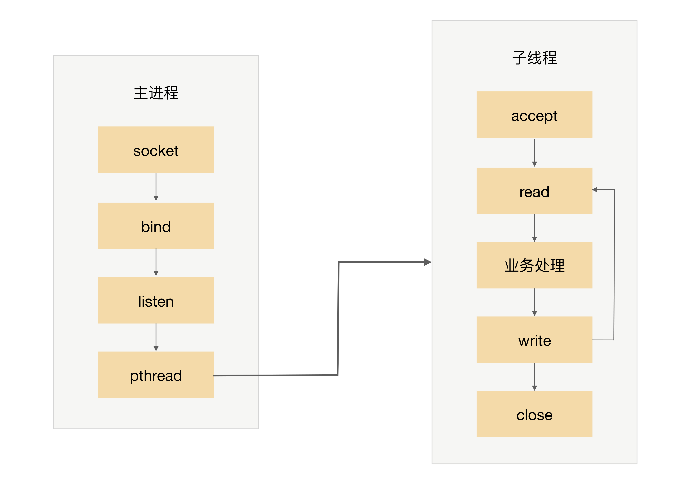

**Apache MPM worker模式**：本质上就是一种prethread方案，但稍微做了改进。Apache服务器会首先创建多个进程，每个进程里面再创建多个线程，这样做主要是为了考虑稳定性，即：即使某个子进程里面的某个线程异常导致整个子进程退出，还会有其他子进程继续提供服务，不会导致整个服务器全部挂掉。这种"多进程+多线程"的混合模式，既利用了线程的轻量级特性提高并发能力，又保留了进程的隔离特性保证稳定性，是一个值得学习的工程折中思路。

prethread理论上可以比prefork支持更多的并发连接，Apache服务器MPM worker模式默认支持16 × 25 = 400个并发处理线程。

**PPC/TPC/prefork/prethread对比总结**：

| 模型 | 并发单元 | 创建时机 | 最大并发 | 稳定性 | 通信复杂度 |
|------|---------|---------|---------|--------|-----------|
| PPC | 进程 | 连接时fork | 几百 | 高（进程隔离） | 高（需IPC） |
| prefork | 进程 | 预创建 | 256（Apache默认） | 高 | 高（需IPC） |
| TPC | 线程 | 连接时创建 | 几百~几千 | 低（线程互相影响） | 低（共享内存） |
| prethread | 线程 | 预创建 | 400（Apache默认） | 中（多进程+多线程） | 低（共享内存） |

> **深度注记**：PPC/TPC的根本问题在于"每连接独占一个执行单元"——无论进程还是线程，当连接数达到一定规模后，创建/调度/切换的开销就会成为瓶颈。解决这个问题的根本思路是"资源复用"——让少量执行单元处理大量连接，这正是Reactor模式的出发点。

---

## 二、Reactor：I/O多路复用+事件驱动

### 2.1 从PPC到Reactor的演进逻辑

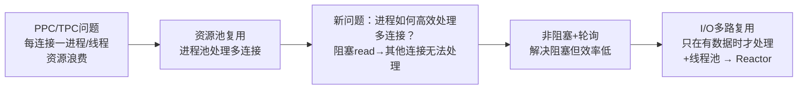

PPC模式最主要的问题就是每个连接都要创建进程（为了描述简洁，这里只以PPC和进程为例，实际上换成TPC和线程，原理是一样的），连接结束后进程就销毁了，这样做其实是很大的浪费。为了解决这个问题，一个自然而然的想法就是**资源复用**，即不再单独为每个连接创建进程，而是创建一个进程池，将连接分配给进程，一个进程可以处理多个连接的业务。

引入资源池的处理方式后，会引出一个新的问题：进程如何才能高效地处理多个连接的业务？当一个连接一个进程时，进程可以采用"read -> 业务处理 -> write"的处理流程，如果当前连接没有数据可以读，则进程就阻塞在read操作上。这种阻塞的方式在一个连接一个进程的场景下没有问题，但如果一个进程处理多个连接，进程阻塞在某个连接的read操作上，此时即使其他连接有数据可读，进程也无法去处理，很显然这样是无法做到高性能的。

解决这个问题的最简单的方式是将read操作改为非阻塞，然后进程不断地轮询多个连接。这种方式能够解决阻塞的问题，但解决的方式并不优雅。首先，轮询是要消耗CPU的；其次，如果一个进程处理几千上万的连接，则轮询的效率是很低的。

为了能够更好地解决上述问题，很容易可以想到，**只有当连接上有数据的时候进程才去处理**，这就是I/O多路复用技术的来源。

**I/O多路复用技术的两个关键实现点**：

1. 当多条连接共用一个阻塞对象后，进程只需要在一个阻塞对象上等待，而无须再轮询所有连接，常见的实现方式有select、epoll、kqueue等
2. 当某条连接有新的数据可以处理时，操作系统会通知进程，进程从阻塞状态返回，开始进行业务处理

I/O多路复用结合线程池，完美地解决了PPC和TPC的问题，而且"大神们"给它取了一个很牛的名字：**Reactor**，中文是"反应堆"。

**Reactor名称解读**：联想到"核反应堆"，听起来就很吓人，实际上这里的"反应"不是聚变、裂变反应的意思，而是"**事件反应**"的意思，可以通俗地理解为"**来了一个事件我就有相应的反应**"，这里的"我"就是Reactor，具体的反应就是我们写的代码，Reactor会根据事件类型来调用相应的代码进行处理。Reactor模式也叫Dispatcher模式（在很多开源的系统里面会看到这个名称的类，其实就是实现Reactor模式的），更加贴近模式本身的含义，即I/O多路复用统一监听事件，收到事件后分配（Dispatch）给某个进程。

**Reactor模式的核心组成部分**：

- **Reactor**：负责监听和分配事件
- **处理资源池**（进程池或线程池）：负责处理事件

### 2.2 Reactor三种典型实现

初看Reactor的实现是比较简单的，但实际上结合不同的业务场景，Reactor模式的具体实现方案灵活多变，主要体现在：

- Reactor的数量可以变化：可以是一个Reactor，也可以是多个Reactor
- 资源池的数量可以变化：以进程为例，可以是单个进程，也可以是多个进程（线程类似）

将上面两个因素排列组合一下，理论上可以有4种选择，但由于"多Reactor单进程"实现方案相比"单Reactor单进程"方案，既复杂又没有性能优势，因此"多Reactor单进程"方案仅仅是一个理论上的方案，实际没有应用。

最终Reactor模式有这三种典型的实现方案：

- 单Reactor单进程/线程
- 单Reactor多线程
- 多Reactor多进程/线程

以上方案具体选择进程还是线程，更多地是和编程语言及平台相关。例如，Java语言一般使用线程（例如，Netty），C语言使用进程和线程都可以。例如，Nginx使用进程，Memcache使用线程。

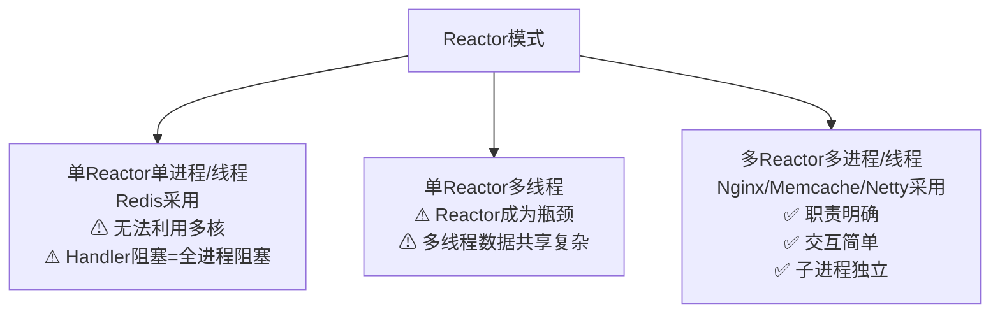

#### 单Reactor单进程/线程

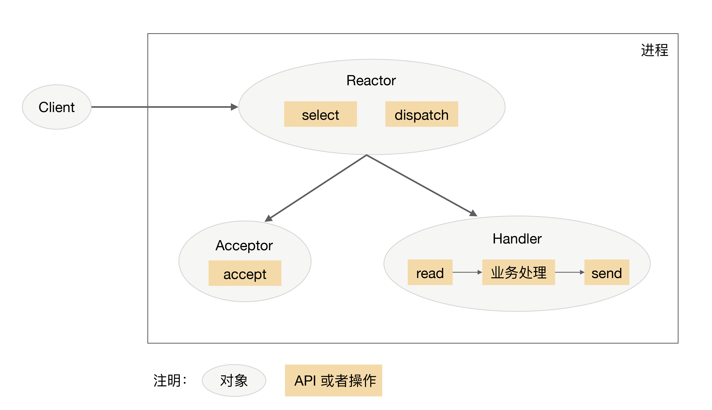

**详细流程**：

1. Reactor对象通过select监控连接事件，收到事件后通过dispatch进行分发
2. 如果是连接建立的事件，则由Acceptor处理，Acceptor通过accept接受连接，并创建一个Handler来处理连接后续的各种事件
3. 如果不是连接建立事件，则Reactor会调用连接对应的Handler（第2步中创建的Handler）来进行响应
4. Handler会完成read→业务处理→send的完整业务流程

**优点**：很简单，没有进程间通信，没有进程竞争，全部都在同一个进程内完成

**缺点**：

- 只有一个进程，无法发挥多核CPU的性能；只能采取部署多个系统来利用多核CPU，但这样会带来运维复杂度
- Handler在处理某个连接上的业务时，整个进程无法处理其他连接的事件，很容易导致性能瓶颈

**适用场景**：**只适用于业务处理非常快速的场景**，目前比较著名的开源软件中使用单Reactor单进程的是Redis。

**C语言与Java的区别**：C语言编写系统一般使用单Reactor单进程，因为没有必要在进程中再创建线程；而Java语言编写的一般使用单Reactor单线程，因为Java虚拟机是一个进程，虚拟机中有很多线程，业务线程只是其中的一个线程而已。

#### 单Reactor多线程

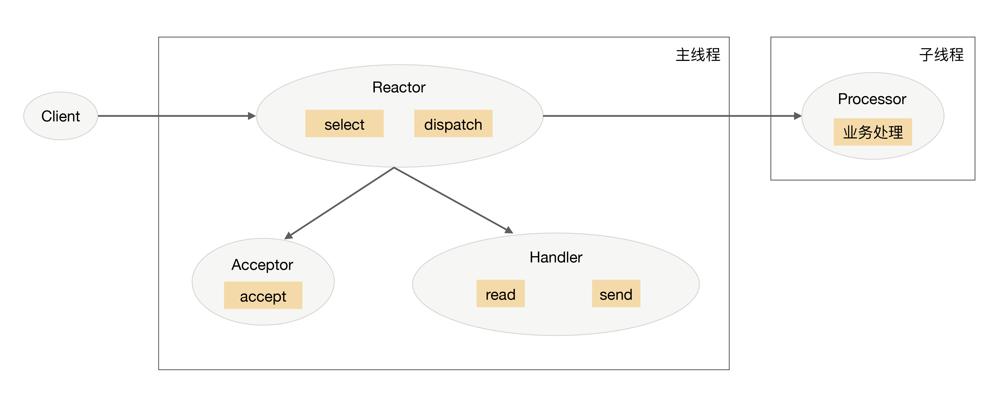

**详细流程**：

1. 主线程中，Reactor对象通过select监控连接事件，收到事件后通过dispatch进行分发
2. 如果是连接建立的事件，则由Acceptor处理，Acceptor通过accept接受连接，并创建一个Handler来处理连接后续的各种事件
3. 如果不是连接建立事件，则Reactor会调用连接对应的Handler来进行响应
4. Handler只负责响应事件，不进行业务处理；Handler通过read读取到数据后，会发给Processor进行业务处理
5. Processor会在独立的子线程中完成真正的业务处理，然后将响应结果发给主进程的Handler处理；Handler收到响应后通过send将响应结果返回给client

**优点**：能够充分利用多核多CPU的处理能力

**缺点**：

- 多线程数据共享和访问比较复杂。例如，子线程完成业务处理后，要把结果传递给主线程的Reactor进行发送，这里涉及共享数据的互斥和保护机制。以Java的NIO为例，Selector是线程安全的，但是通过Selector.selectedKeys()返回的键的集合是非线程安全的，对selected keys的处理必须单线程处理或者采取同步措施进行保护
- Reactor承担所有事件的监听和响应，只在主线程中运行，瞬间高并发时会成为性能瓶颈

**为何没有"单Reactor多进程"方案**：主要原因在于如果采用多进程，子进程完成业务处理后，将结果返回给父进程，并通知父进程发送给哪个client，这是很麻烦的事情。因为父进程只是通过Reactor监听各个连接上的事件然后进行分配，子进程与父进程通信时并不是一个连接。如果要将父进程和子进程之间的通信模拟为一个连接，并加入Reactor进行监听，则是比较复杂的。而采用多线程时，因为多线程是共享数据的，因此线程间通信是非常方便的。虽然要额外考虑线程间共享数据时的同步问题，但这个复杂度比进程间通信的复杂度要低很多。

#### 多Reactor多进程/线程

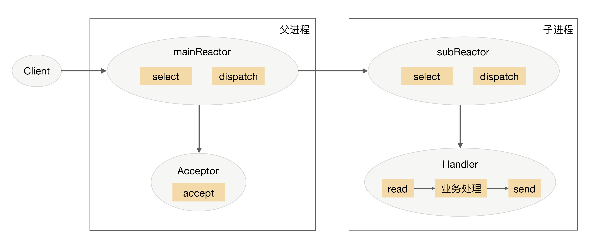

**详细流程**：

1. 父进程中mainReactor对象通过select监控连接建立事件，收到事件后通过Acceptor接收，将新的连接分配给某个子进程
2. 子进程的subReactor将mainReactor分配的连接加入连接队列进行监听，并创建一个Handler用于处理连接的各种事件
3. 当有新的事件发生时，subReactor会调用连接对应的Handler来进行响应
4. Handler完成read→业务处理→send的完整业务流程

**优点**：

- 父进程和子进程的职责非常明确，父进程只负责接收新连接，子进程负责完成后续的业务处理
- 父进程和子进程的交互很简单，父进程只需要把新连接传给子进程，子进程无须返回数据
- 子进程之间是互相独立的，无须同步共享之类的处理（这里仅限于网络模型相关的select、read、send等无须同步共享，"业务处理"还是有可能需要同步共享的）

**实际实现反而更简单**：多Reactor多进程/线程的方案看起来比单Reactor多线程要复杂，但实际实现时反而更加简单，主要原因是职责明确、交互简单、子进程独立。

> **深度注记**：Nginx采用多Reactor多进程，但与标准方案有差异——主进程仅创建监听端口不创建mainReactor，由子进程的Reactor通过锁控制accept，accept后放入自己的Reactor处理，不再分配给其他子进程。这种设计简化了主进程与子进程之间的连接传递，但引入了子进程间的accept竞争问题。

### 2.3 开源系统选型

| 系统 | 并发模式 | 语言 | 选择原因 |
|------|---------|------|---------|
| Redis | 单Reactor单进程 | C | 业务处理极快（内存操作），单进程足够；避免多线程竞争 |
| Nginx | 多Reactor多进程 | C | 利用多核；进程隔离保证稳定性；worker进程独立处理连接 |
| Memcache | 多Reactor多线程 | C | 利用多核；线程共享内存方便缓存管理 |
| Netty | 多Reactor多线程 | Java | Java NIO天然线程模型；boss group=mainReactor，worker group=subReactor |

**三种Reactor变体对比**：

| 维度 | 单Reactor单进程 | 单Reactor多线程 | 多Reactor多进程/线程 |
|------|---------------|---------------|-------------------|
| 利用多核 | 否 | 是 | 是 |
| Reactor瓶颈 | 无（单连接场景） | 是（高并发时） | 否（Reactor分散） |
| 数据共享复杂度 | 无 | 高（线程间同步） | 低（进程间独立） |
| 实现复杂度 | 低 | 中 | 中（但实际更简单） |
| 稳定性 | 高 | 中（线程互相影响） | 高（进程隔离） |
| 典型应用 | Redis | - | Nginx/Memcache/Netty |

---

## 三、Proactor：异步I/O模型

### 3.1 Reactor vs Proactor

Reactor是非阻塞同步网络模型，因为真正的read和send操作都需要用户进程同步操作。这里的"同步"指用户进程在执行read和send这类I/O操作的时候是同步的，如果把I/O操作改为异步就能够进一步提升性能，这就是异步网络模型Proactor。

**Proactor名称解读**：中文翻译为"前摄器"比较难理解，与其类似的单词是proactive，含义为"主动的"，因此我们照猫画虎翻译为"主动器"反而更好理解。Reactor可以理解为"来了事件我通知你，你来处理"，而Proactor可以理解为"**来了事件我来处理，处理完了我通知你**"。这里的"我"就是操作系统内核，"事件"就是有新连接、有数据可读、有数据可写的这些I/O事件，"你"就是我们的程序代码。

| 维度 | Reactor | Proactor |
|------|---------|---------|
| 中文 | 反应堆（事件反应） | 前摄器/主动器（主动处理） |
| 模式 | "来了事件我通知你，你来处理" | "来了事件我来处理，处理完了我通知你" |
| I/O操作执行者 | 用户进程同步执行read/send | 操作系统内核异步完成I/O |
| 理论性能 | 较高 | 更高（I/O与计算重叠，利用DMA） |
| 操作系统支持 | Linux(epoll)/Mac(kqueue)/Windows | Windows(IOCP)完善，Linux(AIO)不完善 |

### 3.2 Proactor流程

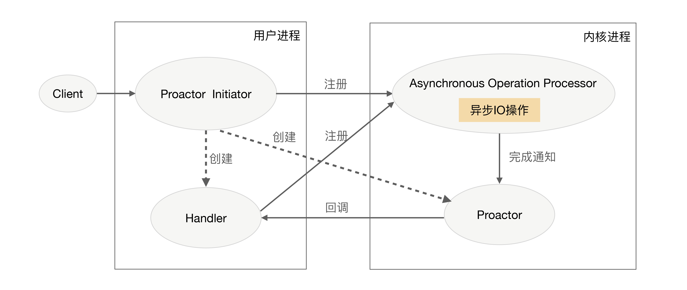

**详细流程**：

1. Proactor Initiator负责创建Proactor和Handler，并将Proactor和Handler都通过Asynchronous Operation Processor注册到内核
2. Asynchronous Operation Processor负责处理注册请求，并完成I/O操作
3. Asynchronous Operation Processor完成I/O操作后通知Proactor
4. Proactor根据不同的事件类型回调不同的Handler进行业务处理
5. Handler完成业务处理，Handler也可以注册新的Handler到内核进程

### 3.3 为何Linux下仍以Reactor为主？

理论上Proactor比Reactor效率要高一些，异步I/O能够充分利用DMA特性，让I/O操作与计算重叠，但要实现真正的异步I/O，操作系统需要做大量的工作。目前Windows下通过IOCP实现了真正的异步I/O，而在Linux系统下的AIO并不完善，因此在Linux下实现高并发网络编程时都是以Reactor模式为主。所以即使Boost.Asio号称实现了Proactor模型，其实它在Windows下采用IOCP，而在Linux下是用Reactor模式（采用epoll）模拟出来的异步模型（新版本 Boost.Asio 也开始提供实验性的 io_uring 后端）。

**Linux AIO的局限**：

- Linux的AIO（libaio）仅支持O_DIRECT标志打开的文件，即绕过页缓存的直接I/O，对于普通的缓冲I/O并不支持真正的异步操作
- 网络I/O方面，Linux没有类似IOCP的真正异步机制，epoll已经是Linux下最高效的I/O多路复用方案
- Linux社区对AIO的设计一直存在争议；io_uring（Linux 5.1 引入，2019 年）发展迅速，已被越来越多的数据库和网络项目采用，但截至审校时点传统 epoll 生态仍是主流

**Windows IOCP的优势**：

- 真正的异步I/O——应用程序发起I/O请求后立即返回，I/O完成后操作系统通知应用
- 完成端口（Completion Port）模型天然支持多线程——多个线程可以等待同一个完成端口
- 内核级别的高效实现，无需用户态的额外开销

> **深度注记**：从许式伟的视角来看，Reactor/Proactor的选择本质上是"I/O模型"这一基础架构层的决策——正如架构师需要从硬件→OS→语言→框架逐层做决策，I/O模型的选择是操作系统层对上层框架的约束。Linux的AIO不完善，是技术约束迫使架构师选择Reactor——这正是"合适原则"的体现：不追求理论最优，而追求在当前约束下的最合适方案。

**Reactor与Proactor的工程选择**：

| 场景 | 推荐模型 | 原因 |
|------|---------|------|
| Linux服务器 | Reactor | Linux AIO不完善，epoll已足够高效 |
| Windows服务器 | Proactor | IOCP是成熟的异步I/O实现 |
| 跨平台框架 | Reactor模拟Proactor | 如Boost.Asio，统一接口底层适配 |
| 极致性能需求 | Proactor（Windows） | 异步I/O理论性能更高 |

---

## 四、负载均衡：分类与架构

单服务器无论如何优化，无论采用多好的硬件，总会有一个性能天花板，当单服务器的性能无法满足业务需求时，就需要设计高性能集群来提升系统整体的处理性能。

高性能集群的本质很简单，通过增加更多的服务器来提升系统整体的计算能力。由于计算本身存在一个特点：同样的输入数据和逻辑，无论在哪台服务器上执行，都应该得到相同的输出。因此高性能集群设计的复杂度主要体现在任务分配这部分，需要设计合理的任务分配策略，将计算任务分配到多台服务器上执行。

**高性能集群的复杂性主要体现在需要增加一个任务分配器，以及为任务选择一个合适的任务分配算法**。对于任务分配器，现在更流行的通用叫法是"负载均衡器"。但这个名称有一定的误导性，会让人潜意识里认为任务分配的目的是要保持各个计算单元的负载达到均衡状态。而实际上任务分配并不只是考虑计算单元的负载均衡，不同的任务分配算法目标是不一样的，有的基于负载考虑，有的基于性能（吞吐量、响应时间）考虑，有的基于业务考虑。考虑到"负载均衡"已经成为了事实上的标准术语，这里也用"负载均衡"来代替"任务分配"，但请时刻记住，**负载均衡不只是为了计算单元的负载达到均衡状态**。

### 4.1 三种负载均衡机制

#### DNS负载均衡

DNS是最简单也是最常见的负载均衡方式，一般用来实现**地理级别**的均衡。例如，北方的用户访问北京的机房，南方的用户访问深圳的机房。DNS负载均衡的本质是DNS解析同一个域名可以返回不同的IP地址。例如，同样是www.baidu.com，北方用户解析后获取的地址是61.135.165.224（北京机房IP），南方用户解析后获取的地址是14.215.177.38（深圳机房IP）。

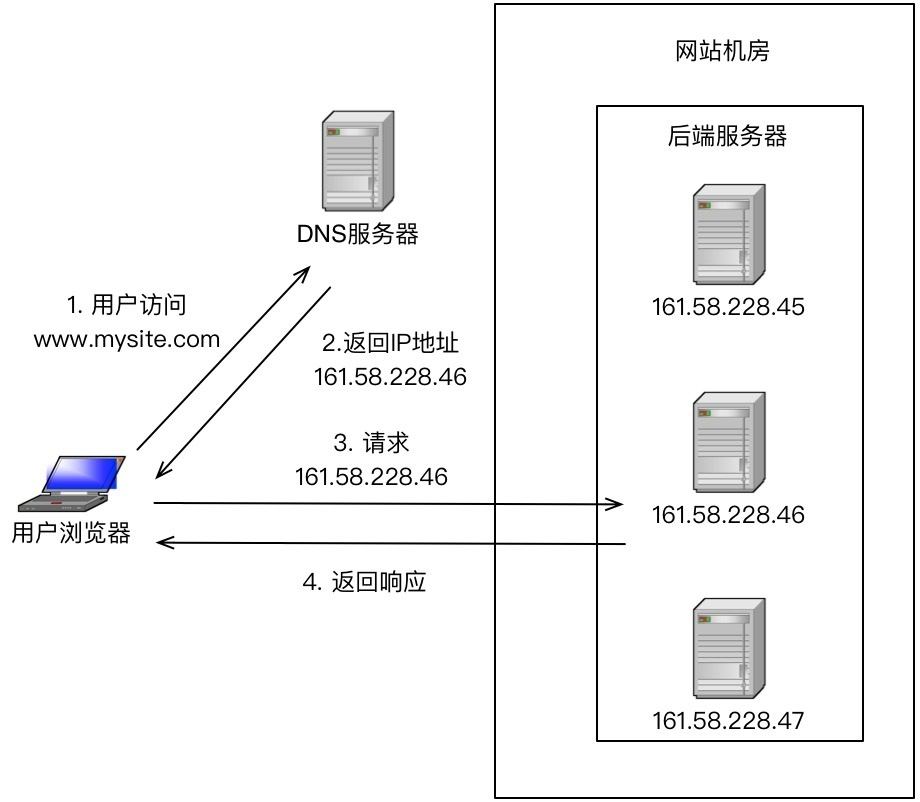

| 优势 | 劣势 |
|------|------|
| 简单、成本低：负载均衡工作交给DNS服务器处理，无须自己开发或维护 | 更新不及时：DNS缓存时间长，修改配置后很多用户继续访问旧IP |
| 就近访问提升速度：根据请求来源IP解析成距离最近的服务器地址 | 扩展性差：控制权在域名商，无法定制化 |
| - | 分配策略简单：支持的算法少，不能区分服务器差异，无法感知后端状态 |

**改进方案——HTTP-DNS**：针对DNS负载均衡的缺点，对于时延和故障敏感的业务，有一些公司自己实现了HTTP-DNS的功能，即使用HTTP协议实现一个私有的DNS系统。这样的方案和通用的DNS优缺点正好相反——更新及时、扩展性强、分配策略灵活，但需要自己开发和维护。HTTP-DNS的核心思路是：客户端不再通过操作系统提供的DNS解析功能来获取IP，而是直接向HTTP-DNS服务器发送HTTP请求来获取IP地址。这样做的好处是，客户端可以实时获取最新的IP地址，不受DNS缓存的影响；同时HTTP-DNS可以根据业务需要返回不同的IP地址（例如，根据服务器负载状况来分配）。典型的HTTP-DNS应用场景包括移动App（可控性强）、视频直播（对延迟敏感）等。

#### 硬件负载均衡

硬件负载均衡是通过单独的硬件设备来实现负载均衡功能，这类设备和路由器、交换机类似，可以理解为一个用于负载均衡的基础网络设备。目前业界典型的硬件负载均衡设备有两款：**F5**和**A10**。这类设备性能强劲、功能强大，但价格都不便宜，一般只有"土豪"公司才会考虑使用此类设备。普通业务量级的公司一是负担不起，二是业务量没那么大，用这些设备也是浪费。

| 优势 | 劣势 |
|------|------|
| 功能强大：全面支持各层级的负载均衡，支持全面的负载均衡算法，支持全局负载均衡 | 价格昂贵：最普通的一台F5就是一辆"马6"，好一点的就是"Q7" |
| 性能强大：支持100万以上的并发（软件负载均衡10万级已经很厉害） | 扩展能力差：硬件设备可根据业务配置，但无法扩展和定制 |
| 稳定性高：商用硬件经过严格测试和大规模使用 | - |
| 支持安全防护：具备防火墙、防DDoS攻击等安全功能 | - |

#### 软件负载均衡

软件负载均衡通过负载均衡软件来实现负载均衡功能，常见的有**Nginx**和**LVS**，其中Nginx是软件的7层负载均衡，LVS是Linux内核的4层负载均衡。除了使用开源的系统进行负载均衡，如果业务比较特殊，也可能基于开源系统进行定制（例如，Nginx插件），甚至进行自研。

**4层 vs 7层负载均衡**：4层和7层的区别就在于**协议**和**灵活性**。

- **LVS**是Linux内核的4层负载均衡（传输层），和协议无关，几乎所有应用都可以做，例如聊天、数据库等
- **Nginx**是软件的7层负载均衡（应用层），支持HTTP、E-mail协议，更灵活但限于特定协议

软件和硬件的最主要区别就在于性能，硬件负载均衡性能远远高于软件负载均衡性能。当然，软件负载均衡的最大优势是便宜，一台普通的Linux服务器批发价大概就是1万元左右，相比F5的价格，那就是自行车和宝马的区别了。

**性能对比**：

| 负载均衡方式 | 性能级别 | 具体数据 |
|------------|---------|---------|
| Nginx（7层） | 万级 | 大约5万/秒 |
| LVS（4层） | 十万级 | 据说可达80万/秒 |
| F5（硬件） | 百万级 | 200万/秒到800万/秒 |

（数据来源网络，仅供参考，如需采用请根据实际业务场景进行性能测试）

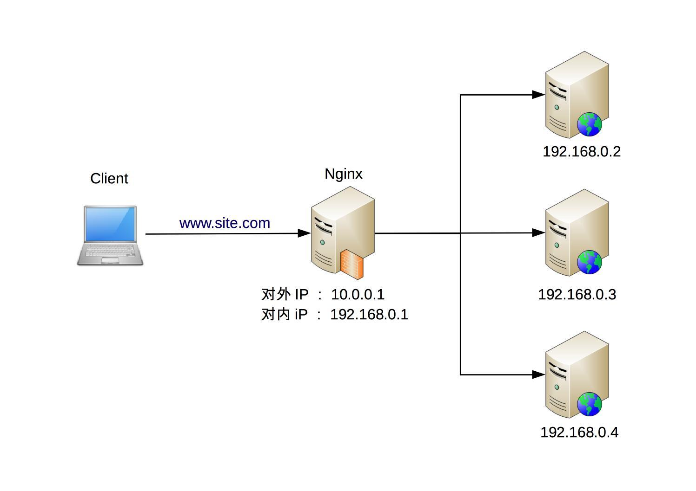

| 优势 | 劣势 |
|------|------|
| 简单：部署和维护都比较简单 | 性能一般：一个Nginx大约能支撑5万并发 |
| 便宜：只要买个Linux服务器，装上软件即可 | 功能没有硬件负载均衡那么强大 |
| 灵活：4层和7层可根据业务选择；可通过Nginx插件定制化 | 一般不具备防火墙和防DDoS攻击等安全功能 |

**三种负载均衡机制对比**：

| 类型 | 层级 | 典型代表 | 性能 | 成本 | 灵活性 | 功能 |
|------|------|---------|------|------|--------|------|
| DNS负载均衡 | 地理级别 | DNS解析 | - | 极低 | 差 | 简单 |
| 硬件负载均衡 | 集群级别 | F5、A10 | 百万级 | 极高 | 差 | 强大+安全 |
| 软件负载均衡 | 机器级别 | Nginx(7层)、LVS(4层) | 万~十万级 | 低 | 高 | 一般 |

### 4.2 三层组合架构

前面介绍了3种常见的负载均衡机制，每种方式都有一些优缺点，但并不意味着在实际应用中只能基于它们的优缺点进行非此即彼的选择，反而是基于它们的优缺点进行**组合使用**。

**组合的基本原则**：DNS负载均衡用于实现地理级别的负载均衡；硬件负载均衡用于实现集群级别的负载均衡；软件负载均衡用于实现机器级别的负载均衡。

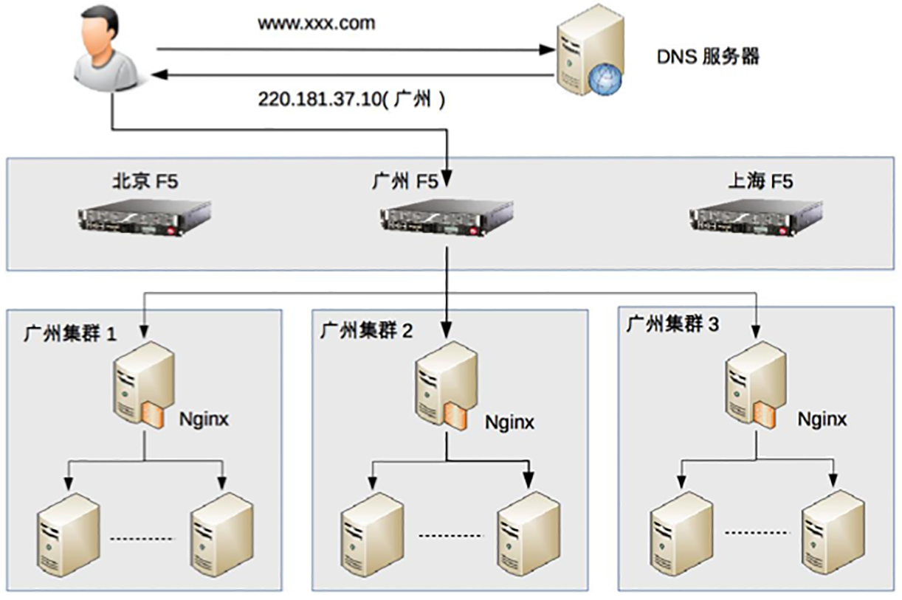

**以假想实例说明三层组合**：

1. **地理级别负载均衡**：www.xxx.com部署在北京、广州、上海三个机房，当用户访问时，DNS会根据用户的地理位置来决定返回哪个机房的IP，图中返回了广州机房的IP地址，这样用户就访问到广州机房了
2. **集群级别负载均衡**：广州机房的负载均衡用的是F5设备，F5收到用户请求后，进行集群级别的负载均衡，将用户请求发给3个本地集群中的一个，假设F5将用户请求发给了"广州集群2"
3. **机器级别负载均衡**：广州集群2的负载均衡用的是Nginx，Nginx收到用户请求后，将用户请求发送给集群里面的某台服务器，服务器处理用户的业务请求并返回业务响应

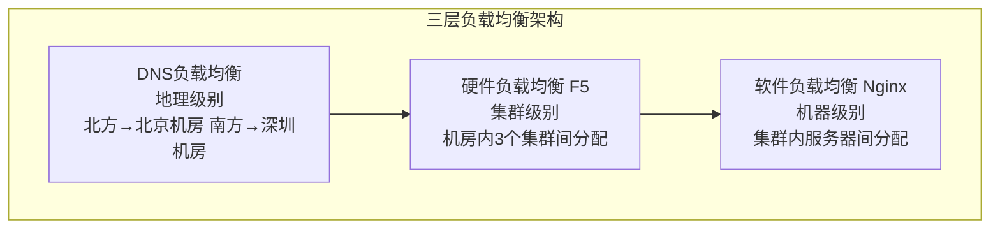

**重要提醒**：上图只是一个示例，一般在大型业务场景下才会这样用，如果业务量没这么大，则没有必要严格照搬这套架构。例如，一个大学的论坛，完全可以不需要DNS负载均衡，也不需要F5设备，只需要用Nginx作为一个简单的负载均衡就足够了。架构设计的"合适原则"在这里同样适用——不要为了架构而架构，要根据实际业务规模选择合适的方案。

**三层架构的设计智慧**：

1. **分层解耦**：每一层只关注自己层级的负载均衡逻辑，DNS不关心集群内部的服务器状态，F5不关心单台服务器的具体负载，Nginx不关心其他机房的存在。这种分层解耦使得每一层都可以独立演进和优化。

2. **逐级收敛**：从DNS的地理级分配到F5的集群级分配再到Nginx的机器级分配，请求的范围逐步缩小，精确度逐步提高。这和互联网的"逐跳路由"思想是一致的。

3. **成本与性能的平衡**：DNS层几乎零成本但粒度最粗，F5层成本最高但性能最强，Nginx层成本低且足够灵活。三层组合实现了成本和性能的最佳平衡点。

---

## 五、负载均衡算法

负载均衡算法数量较多，而且可以根据一些业务特性进行定制开发，抛开细节上的差异，根据算法期望达到的目的，大体上可以分为下面四类：

- **任务平分类**：负载均衡系统将收到的任务平均分配给服务器进行处理，这里的"平均"可以是绝对数量的平均，也可以是比例或者权重上的平均
- **负载均衡类**：负载均衡系统根据服务器的负载来进行分配，这里的负载并不一定是通常意义上我们说的"CPU负载"，而是系统当前的压力，可以用CPU负载来衡量，也可以用连接数、I/O使用率、网卡吞吐量等来衡量系统的压力
- **性能最优类**：负载均衡系统根据服务器的响应时间来进行任务分配，优先将新任务分配给响应最快的服务器
- **Hash类**：负载均衡系统根据任务中的某些关键信息进行Hash运算，将相同Hash值的请求分配到同一台服务器上

### 5.1 轮询类算法

#### 轮询（Round-Robin）

负载均衡系统收到请求后，按照顺序轮流分配到服务器上。

轮询是最简单的一个策略，无须关注服务器本身的状态，例如：

- 某个服务器当前因为触发了程序bug进入了死循环导致CPU负载很高，负载均衡系统是不感知的，还是会继续将请求源源不断地发送给它
- 集群中有新的机器是32核的，老的机器是16核的，负载均衡系统也是不关注的，新老机器分配的任务数是一样的

需要注意的是负载均衡系统无须关注"服务器本身状态"，这里的关键词是"本身"。也就是说，**只要服务器在运行，运行状态是不关注的**。但如果服务器直接宕机了，或者服务器和负载均衡系统断连了，这时负载均衡系统是能够感知的，也需要做出相应的处理。例如，将服务器从可分配服务器列表中删除。

总而言之，"简单"是轮询算法的优点，也是它的缺点。

#### 加权轮询（Weighted Round-Robin）

负载均衡系统根据服务器权重进行任务分配，这里的权重一般是根据硬件配置进行静态配置的，采用动态的方式计算会更加契合业务，但复杂度也会更高。

加权轮询是轮询的一种特殊形式，其主要目的就是为了**解决不同服务器处理能力有差异的问题**。例如，集群中有新的机器是32核的，老的机器是16核的，那么理论上我们可以假设新机器的处理能力是老机器的2倍，负载均衡系统就可以按照2:1的比例分配更多的任务给新机器，从而充分利用新机器的性能。

加权轮询解决了轮询算法中无法根据服务器的配置差异进行任务分配的问题，但同样存在无法根据服务器的状态差异进行任务分配的问题——即使某台高配置服务器当前负载很高，加权轮询仍然会按照权重给它分配更多请求。

#### 平滑加权轮询

普通加权轮询在一段时间内可能会出现请求集中分配给高权重服务器的情况，导致短时间内负载不均。平滑加权轮询（Smooth Weighted Round-Robin）通过动态调整当前权重，使得请求分配更加均匀平滑。

**示例**：服务器A权重5、B权重1、C权重1，平滑加权轮询的分配序列为A-A-B-A-C-A-A，而非A-A-A-A-A-B-C。

Nginx默认采用的就是平滑加权轮询算法。

### 5.2 随机类算法

#### 随机（Random）

负载均衡系统随机选择一台服务器来分配任务。和轮询类似，随机算法也无需关注服务器状态，简单易实现。在请求量较小时，随机算法的分配可能不够均匀；但随着请求量增大，根据概率统计，随机算法的分配效果趋近于轮询。

#### 加权随机（Weighted Random）

根据服务器权重进行随机分配，权重越大的服务器被选中的概率越高。例如，服务器A权重5、B权重3、C权重2，则A被选中的概率为50%，B为30%，C为20%。

加权随机相比加权轮询实现更简单，且在请求量较大时效果相当。

### 5.3 负载最低优先类算法

负载均衡系统将任务分配给当前负载最低的服务器，这里的负载根据不同的任务类型和业务场景，可以用不同的指标来衡量。

| 指标 | 适用场景 | 说明 |
|------|---------|------|
| 连接数 | LVS（4层），请求转发模式 | 服务器连接数越大，表明压力越大 |
| HTTP请求数 | Nginx（7层） | 需扩展Nginx内置算法 |
| CPU负载 | CPU密集型业务 | 需收集+确定统计周期（1分钟vs15分钟） |
| I/O负载 | I/O密集型业务 | 同上 |

**最少连接数（least_conn）**：

最少连接数优先的算法要求负载均衡系统统计每个服务器当前建立的连接，其应用场景仅限于负载均衡接收的任何连接请求都会转发给服务器进行处理，否则如果负载均衡系统和服务器之间是固定的连接池方式，就不适合采取这种算法。例如，LVS可以采取这种算法进行负载均衡，而一个通过连接池的方式连接MySQL集群的负载均衡系统就不适合采取这种算法。

**CPU负载最低优先**：

CPU负载最低优先的算法要求负载均衡系统以某种方式收集每个服务器的CPU负载，而且要确定是以1分钟的负载为标准，还是以15分钟的负载为标准，不存在1分钟肯定比15分钟要好或者差。不同业务最优的时间间隔是不一样的，时间间隔太短容易造成频繁波动，时间间隔太长又可能造成峰值来临时响应缓慢。

**负载最低优先的代价**：

负载最低优先算法基本上能够比较完美地解决轮询算法的缺点，因为采用这种算法后，负载均衡系统需要感知服务器当前的运行状态。当然，其代价是复杂度大幅上升。通俗来讲，轮询可能是5行代码就能实现的算法，而负载最低优先算法可能要1000行才能实现，甚至需要负载均衡系统和服务器都要开发代码。负载最低优先算法如果本身没有设计好，或者不适合业务的运行特点，算法本身就可能成为性能的瓶颈，或者引发很多莫名其妙的问题。所以负载最低优先算法虽然效果看起来很美好，但实际上真正应用的场景反而没有轮询（包括加权轮询）那么多。

### 5.4 性能最优优先类算法

负载最低优先类算法是站在服务器的角度来进行分配的，而性能最优优先类算法则是站在客户端的角度来进行分配的，优先将任务分配给处理速度最快的服务器，通过这种方式达到最快响应客户端的目的。

和负载最低优先类算法类似，性能最优优先类算法本质上也是感知了服务器的状态，只是通过响应时间这个外部标准来衡量服务器状态而已。因此性能最优优先类算法存在的问题和负载最低优先类算法类似，复杂度都很高，主要体现在：

- 负载均衡系统需要收集和分析每个服务器每个任务的响应时间，在大量任务处理的场景下，这种收集和统计本身也会消耗较多的性能
- 为了减少这种统计上的消耗，可以采取采样的方式来统计，即不统计所有任务的响应时间，而是抽样统计部分任务的响应时间来估算整体任务的响应时间。采样统计虽然能够减少性能消耗，但使得复杂度进一步上升，因为要确定合适的**采样率**，采样率太低会导致结果不准确，采样率太高会导致性能消耗较大
- 无论是全部统计还是采样统计，都需要选择合适的**周期**：是10秒内性能最优，还是1分钟内性能最优，还是5分钟内性能最优……没有放之四海而皆准的周期，需要根据实际业务进行判断和选择，甚至出现系统上线后需要不断地调优才能达到最优设计

### 5.5 Hash类算法

负载均衡系统根据任务中的某些关键信息进行Hash运算，将相同Hash值的请求分配到同一台服务器上，这样做的目的主要是为了满足特定的业务需求。

#### 源地址Hash（ip_hash）

将来源于同一个源IP地址的任务分配给同一个服务器进行处理，适合于存在事务、会话的业务。例如，当我们通过浏览器登录网上银行时，会生成一个会话信息，这个会话是临时的，关闭浏览器后就失效。网上银行后台无须持久化会话信息，只需要在某台服务器上临时保存这个会话就可以了，但需要保证用户在会话存在期间，每次都能访问到同一个服务器，这种业务场景就可以用源地址Hash来实现。

#### URL Hash（url_hash）

将同一个URL的请求分配到同一台服务器，适合于缓存场景——同一URL的请求总是命中同一台缓存服务器，提高缓存命中率。

#### ID Hash

将某个ID标识的业务分配到同一个服务器中进行处理，这里的ID一般是临时性数据的ID（如session id）。例如，上述的网上银行登录的例子，用session id hash同样可以实现同一个会话期间，用户每次都是访问到同一台服务器的目的。

#### 一致性Hash

一致性Hash解决了"扩缩容时尽量少迁移请求"的问题——普通Hash在节点数变化时所有数据需重分布，一致性Hash只影响相邻节点。

**基本原理**：

1. 将整个Hash值空间组织成一个虚拟的圆环（Hash Ring），如0~2^32-1
2. 将每个服务器节点通过Hash计算其在这个环上的位置
3. 每个请求也通过Hash计算在环上的位置，顺时针找到的第一个节点就是其归属节点
4. 当增加或删除节点时，只影响该节点在环上逆时针方向到前一个节点之间的请求，其他请求不受影响

**虚拟节点**：当服务器数量较少时，一致性Hash可能出现数据倾斜（大量请求集中到某几个节点）。通过为每个物理节点创建多个虚拟节点，可以使得数据分布更加均匀。例如，只有3台服务器时，每台服务器创建100个虚拟节点，环上就有300个点，数据分布会更加均匀。当某台服务器宕机时，其所有虚拟节点上的请求会分散到相邻的其他服务器的虚拟节点上，而不会全部集中到某一台服务器。

**一致性Hash vs 普通Hash**：

| 维度 | 普通Hash（如user_id % N） | 一致性Hash |
|------|--------------------------|-----------|
| 节点变化影响 | 所有数据需重分布 | 仅影响相邻节点 |
| 分布均匀性 | 节点数多时较均匀 | 需要虚拟节点辅助 |
| 扩容复杂度 | 极高（全量迁移） | 低（增量迁移） |
| 实现复杂度 | 极低 | 中 |
| 适用场景 | 节点数固定的场景 | 需要频繁扩缩容的场景 |

| Hash方式 | 业务场景 | 优势 |
|---------|---------|------|
| 源地址Hash | 网上银行登录——同一会话期间访问同一服务器 | 会话亲和 |
| URL Hash | 缓存场景——同一URL命中同一缓存服务器 | 提高缓存命中率 |
| ID Hash | session id / 用户ID——临时性数据的会话亲和 | 灵活的会话绑定 |
| 一致性Hash | 分布式缓存、分布式存储——扩缩容时少迁移 | 扩缩容影响局部化 |

> **深度注记**：从许式伟的视角来看，一致性Hash是流量调度中最精巧的算法，它将"扩缩容影响局部化"——这正是"分解"心法在负载均衡层面的体现：将全局重分布问题分解为局部迁移问题。

### 5.6 四大类算法对比

| 类别 | 目标 | 典型算法 | 感知服务器状态 | 复杂度 | 实际应用 |
|------|------|---------|-------------|--------|---------|
| 轮询类 | 平均分配 | 轮询、加权轮询、平滑加权轮询 | 否 | 低 | **最广** |
| 随机类 | 概率平均 | 随机、加权随机 | 否 | 低 | 一般 |
| 负载均衡类 | 负载最低 | 最少连接数、CPU负载最低 | 是 | 高 | 较少 |
| 性能最优类 | 响应最快 | 响应时间最优 | 是 | 高 | 较少 |
| Hash类 | 会话亲和 | ip_hash、url_hash、一致性Hash | 否 | 中 | 特定场景 |

---

## 六、计算高性能架构的统一视图

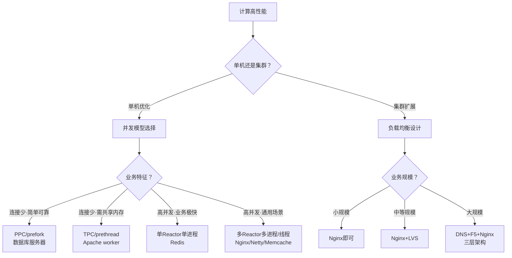

---

## 总结

| 核心要点 | 关键结论 |
|---------|---------|
| PPC | 每连接一进程，实现简单但并发有限（最多几百）；fork代价高、IPC复杂、进程数受限 |
| prefork | 预创建进程省去fork延迟，但并发上限和通信复杂度问题仍在；Apache MPM prefork默认256并发 |
| TPC | 每连接一线程，比PPC轻量但引入死锁风险和线程互相影响；并发几百时PPC反而更稳定 |
| prethread | 预创建线程，Apache MPM worker（多进程×多线程）默认400并发；兼顾性能与稳定性 |
| Reactor本质 | I/O多路复用统一监听+事件分发+资源池处理；是高并发网络编程的主流模式 |
| 单Reactor单进程 | 适用于业务处理极快的场景（Redis）；无法利用多核，Handler阻塞=全进程阻塞 |
| 单Reactor多线程 | 充分利用多核；但Reactor成为瓶颈，多线程共享数据复杂；无"单Reactor多进程"方案 |
| 多Reactor多进程 | 职责明确交互简单，实际实现反而更简单；Nginx/Memcache/Netty采用 |
| Proactor | 异步I/O理论性能更高（I/O与计算重叠），但Linux AIO不完善，实际仍以Reactor为主 |
| DNS负载均衡 | 地理级别，简单低成本但更新不及时、扩展性差；HTTP-DNS是改进方案 |
| 硬件负载均衡 | 集群级别，F5/A10性能百万级但价格昂贵、无法扩展定制 |
| 软件负载均衡 | 机器级别，Nginx(7层)万级/LVS(4层)十万级，简单便宜灵活 |
| 三层组合 | DNS(地理)→硬件(集群)→软件(机器)；按业务规模组合使用，小规模只需Nginx |
| 轮询/加权轮询 | 简单但不感知服务器状态；实际应用最广；Nginx默认平滑加权轮询 |
| 随机/加权随机 | 类似轮询，请求量大时效果相当；实现更简单 |
| 负载最低优先 | 效果好但复杂度高（5行vs1000行代码），实际应用反而不多 |
| 性能最优优先 | 站在客户端角度，需采样统计响应时间，确定采样率和周期，可能需持续调优 |
| Hash类 | 满足会话亲和需求；ip_hash/url_hash/ID Hash/一致性Hash各有适用场景 |
| 一致性Hash | 解决扩缩容时少迁移问题；虚拟节点解决数据倾斜；是流量调度中最精巧的算法 |

**思考题**：
1. 什么样的系统比较适合PPC/TPC高性能模式？原因是什么？
2. 针对"前浪微博"消息队列架构的案例，你觉得采用何种并发模式是比较合适的，为什么？
3. 假设你来设计一个日活跃用户1000万的论坛的负载均衡集群，你的方案是什么？设计理由是什么？
4. 微信抢红包的高并发架构，应该采取什么样的负载均衡算法？谈谈你的分析和理解。

**关联阅读**：
- [复杂度来源：高性能](05-复杂度来源.md)
- [存储高性能](08-存储高性能.md)

---

> **延伸视角**（许式伟）
>
> 华仔从"架构模式"角度系统梳理了计算高性能的并发模型和负载均衡方案。许式伟从"流量调度"角度提供了更全局的视野：
>
> **1. 流量是服务端的血液**。许式伟将负载均衡提升到"流量调度"的系统性工程——不只是分发请求，还涉及路由策略、限流熔断、灰度发布。负载均衡只是流量调度的一个环节，而非全部。
>
> **2. 并发模型是基础架构层的决策**。Reactor/Proactor的选择受操作系统I/O模型约束——Linux AIO不完善迫使选择Reactor。这正是架构师需要"从硬件→OS→语言→框架逐层做决策"的宏观视角的体现。
>
> **3. 一致性Hash是流量调度的精巧算法**。许式伟特别强调一致性Hash解决了"扩缩容时尽量少迁移请求"的问题——这是将全局重分布问题分解为局部迁移问题，体现了"分解"心法在负载均衡层面的应用。
>
> **4. 并发模型的演进是"资源复用"原则的体现**。从PPC/TPC的"每连接独占资源"到Reactor的"资源共享+事件驱动"，本质上是将有限的计算资源从"独占"模式切换到"复用"模式。这与存储高性能中"缓存"的思路一脉相承——缓存是存储资源的复用，Reactor是计算资源的复用。
>
> **融合洞见**：计算高性能的架构决策，从单机并发模型到集群负载均衡，本质上都是在"资源有限"约束下做"分配策略"的选择。PPC/TPC是"每连接独占资源"的策略，Reactor是"资源共享+事件驱动"的策略，负载均衡算法是"集群资源分配"的策略。选择哪种策略，取决于业务特征、技术约束和团队能力——这正是架构设计"判断和取舍"思维的又一次集中体现。
