# CAP理论与高可用存储 | CAP·FMEA·双机架构·集群与分区·计算高可用

## 章节导言

高可用是架构设计六大复杂度来源之一，其本质是通过**冗余**来规避单点故障——"单点"是可用性的天敌，而冗余是唯一解。

但冗余引入了一个根本性矛盾：**数据复制需要时间，而业务要求实时一致**。这个矛盾在分布式系统中无法彻底消除，CAP定理从理论上论证了这一点——一致性(C)、可用性(A)、分区容错性(P)三者最多满足其二。

理解CAP理论是高可用架构设计的理论基石，但仅有理论远远不够。架构师还需要：用FMEA方法**系统排查**可用性隐患；用双机/集群/分区架构**工程实现**存储高可用；在CAP约束下**权衡取舍**，选择最适合业务场景的方案；理解计算高可用与存储高可用的本质差异。

**核心问题**：
1. CAP理论的精确定义是什么？为何说"分布式系统只能选CP或AP"？
2. CAP在落地时有哪些关键细节？ACID和BASE与CAP的关系是什么？
3. FMEA方法如何系统化排查架构中的可用性隐患？
4. 主备/主从/双机切换/主主四种双机架构各自的优劣与适用场景？
5. 数据集中集群与数据分散集群的核心差异？三种分区复制规则如何选择？
6. 计算高可用架构与存储高可用架构有何本质区别？

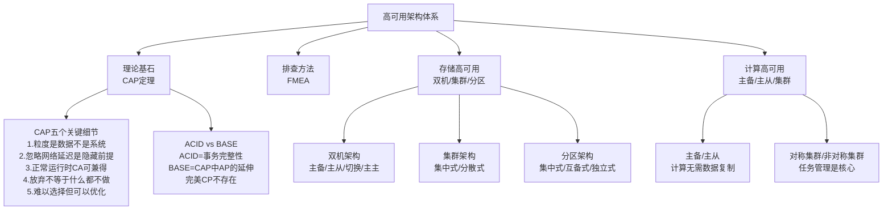
```mermaid
graph TD
    A[高可用架构体系] --> B[理论基石<br/>CAP定理]
    A --> C[排查方法<br/>FMEA]
    A --> D[存储高可用<br/>双机/集群/分区]
    A --> E[计算高可用<br/>主备/主从/集群]

    B --> B1["CAP五个关键细节<br/>1.粒度是数据不是系统<br/>2.忽略网络延迟是隐藏前提<br/>3.正常运行时CA可兼得<br/>4.放弃不等于什么都不做<br/>5.难以选择但可以优化"]
    B --> B2["ACID vs BASE<br/>ACID=事务完整性<br/>BASE=CAP中AP的延伸<br/>完美CP不存在"]

    D --> D1["双机架构<br/>主备/主从/切换/主主"]
    D --> D2["集群架构<br/>集中式/分散式"]
    D --> D3["分区架构<br/>集中式/互备式/独立式"]

    E --> E1["主备/主从<br/>计算无需数据复制"]
    E --> E2["对称集群/非对称集群<br/>任务管理是核心"]

```

---

## 一、CAP理论

### 1.1 CAP的定义与来源

CAP定理（又称布鲁尔定理）由加州大学伯克利分校的计算机科学家Eric Brewer于2000年在ACM PODC上提出猜想，2002年由MIT的Seth Gilbert和Nancy Lynch发表证明，使之成为分布式计算领域公认的定理。

Robert Greiner对CAP有两版解释，第二版更加精确：

> **第一版**：Any distributed system cannot guaranty C, A, and P simultaneously.
>
> **第二版**：In a distributed system (a collection of interconnected nodes that share data.), you can only have two out of the following three guarantees across a write/read pair: Consistency, Availability, and Partition Tolerance - one of them must be sacrificed.

简单翻译：在一个分布式系统（互相连接并共享数据的节点的集合）中，当涉及读写操作时，只能保证一致性、可用性、分区容错性三者中的两个，另外一个必须被牺牲。

**两个关键前提**（第二版相比第一版的核心改进）：
1. **互联且共享数据（interconnected and share data）**：分布式系统并不一定会互联和共享数据。Memcache集群节点间不互联不共享数据，因此不是CAP讨论对象；MySQL主从集群互联且共享数据，才是CAP讨论对象
2. **读写操作对（write/read pair）**：CAP关注的是对数据的读写操作，而不是分布式系统的所有功能。ZooKeeper的选举机制不在CAP讨论范围内

### 1.2 三个要素的精确定义

不同资料对CAP的详细定义有细微差别。以下对比Robert Greiner两版解释的关键差异：

| 要素 | 第一版（不严谨） | 第二版（精确） |
|------|----------------|---------------|
| **一致性** | All nodes see the same data at the same time（所有节点在同一时刻看到相同的数据） | A read is guaranteed to return the most recent write for a given client（对某个指定的客户端来说，读操作保证能够返回最新的写操作结果） |
| **可用性** | Every request gets a response on success/failure（每个请求都能得到成功或失败的响应） | A non-failing node will return a reasonable response within a reasonable amount of time (no error or timeout)（非故障节点在合理时间内返回合理的响应） |
| **分区容错性** | System continues to work despite message loss or partial failure（出现消息丢失或分区错误时系统能继续运行） | The system will continue to function when network partitions occur（当出现网络分区后，系统能够继续"履行职责"） |

**一致性——关键差异解读**：
- 第一版从节点角度（node），第二版从客户端角度（client）——第二版更符合我们观察和评估系统的方式
- 第一版强调"同一时刻"不严谨——事务执行过程中节点间数据不一致是正常的（事务执行中系统处于不一致状态），客户端读操作获取最新写结果才是精确描述
- 第一版的关键词是"see"，第二版的关键词是"read"——节点是"拥有"数据而非"看到"数据
- 第一版强调"same time + same data"，第二版不强调同一时刻——因为事务执行中不同节点数据确实可能不同，但客户端读不到未提交数据

**可用性——关键差异解读**：
- 第二版强调"非故障节点"（non-failing node）——只有非故障节点才能满足可用性要求，发给故障节点的请求不一定能得到响应
- 第二版用"reasonable response"和"reasonable time"——注意"合理"不等于"正确"，返回旧数据是合理的但不正确（应该返回100但返回了90，不正确但是合理）
- 特别强调"no error or timeout"——超时、错误都不算满足可用性。第一版的success/failure定义太泛，超时算失败、错误算失败、结果不正确也算失败

**分区容错性——关键差异解读**：
- 第二版用"function"（履行职责）替代"work"（运行）——返回错误也算work但不算function，只有返回reasonable response才是function
- 第二版直接说现象"network partitions"而非原因"message loss"——丢包只是网络故障的一种，连接中断、拥塞等都可能导致分区，第二版用现象覆盖了所有原因

### 1.3 CAP应用：只能选CP或AP

分布式环境中必须选择P（分区容错），因为网络本身无法做到100%可靠，分区是一个必然现象。

**如果选择CA放弃P**：当发生分区现象时，为保证C需禁止写入（返回error），但这违反了A的要求（no error and no timeout）。因此分布式系统理论上不可能选择CA架构，只能选择CP或者AP。

**CP架构——保证一致性**：

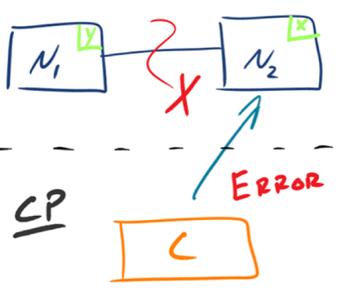

N1数据更新到y，但复制通道中断，数据y无法同步到N2（N2还是x）。客户端访问N2时，N2返回Error——违背了可用性要求，因此CAP三者只能满足CP。

**AP架构——保证可用性**：

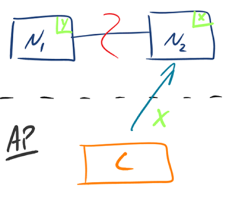

同样的场景，N2将自己拥有的数据x返回给客户端。虽然x不是最新的数据y，但x是旧的数据，并非错乱的值——返回x是一个"合理"的结果，只是不是"正确"的结果。

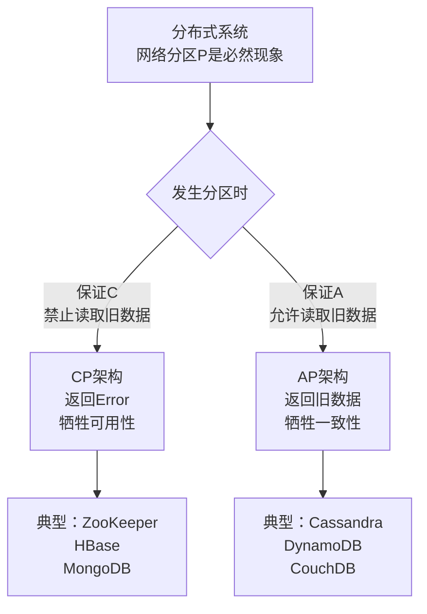
```mermaid
graph TD
    A[分布式系统<br/>网络分区P是必然现象] --> B{发生分区时}

    B -->|"保证C<br/>禁止读取旧数据"| CP["CP架构<br/>返回Error<br/>牺牲可用性"]
    B -->|"保证A<br/>允许读取旧数据"| AP["AP架构<br/>返回旧数据<br/>牺牲一致性"]

    CP --> CP1["典型：ZooKeeper<br/>HBase<br/>MongoDB"]
    AP --> AP1["典型：Cassandra<br/>DynamoDB<br/>CouchDB"]

```

> **深度注记**：CAP告诉我们不存在"完美的"高可用存储方案。架构师的核心工作是**在CP和AP之间根据业务特征做出选择**——用户账号数据选CP（一致性优先），用户行为日志选AP（可用性优先）。

---

## 二、CAP的五个关键细节

### 2.1 细节一：CAP关注的粒度是数据，不是整个系统

> C与A之间的取舍可以在同一系统内以非常细小的粒度反复发生，而每一次的决策可能因为具体的操作，乃至因为牵涉到特定的数据或用户而有所不同。

**常见误区**：整个系统要么选CP，要么选AP。CAP理论的定义中用的都是system、node这类系统级概念，给很多人造成误导。

**正确做法**：系统内的数据按不同应用场景分类，每类数据选择不同策略。以用户管理系统为例：

| 数据类型 | 策略 | 原因 |
|---------|------|------|
| 用户账号（ID、密码） | CP | 数据不一致会导致严重业务错误（同一手机号注册多个账号） |
| 用户信息（昵称、兴趣） | AP | 短暂不一致影响小，可容忍 |

如果限定整个系统为CP，则不符合用户信息数据的应用场景；如果限定整个系统为AP，则又不符合用户账号数据的应用场景。所以在CAP理论落地实践时，需要将系统内的数据按照不同的应用场景和要求进行分类，每类数据选择不同的策略。

### 2.2 细节二：CAP忽略网络延迟——一个隐藏的前提

CAP理论中一致性定义假设数据能"瞬间"复制到所有节点，但现实中从节点A复制数据到节点B总是需要花费一定时间：
- 同机房：几毫秒
- 跨城机房（北京→广州）：几十毫秒
- 跨国机房：几百毫秒

**关键推论**：CAP中的C在实践中不可能完美实现。在数据复制的过程中，节点间的数据并不一致。

对于严苛场景（用户余额、商品库存），理论上要求选择CP，**实际上CP都做不到，只能选择CA**——单点写入，其他节点做备份，无法做到分布式情况下多点写入。

这不意味着这类系统无法应用分布式架构——可以按用户ID分区：

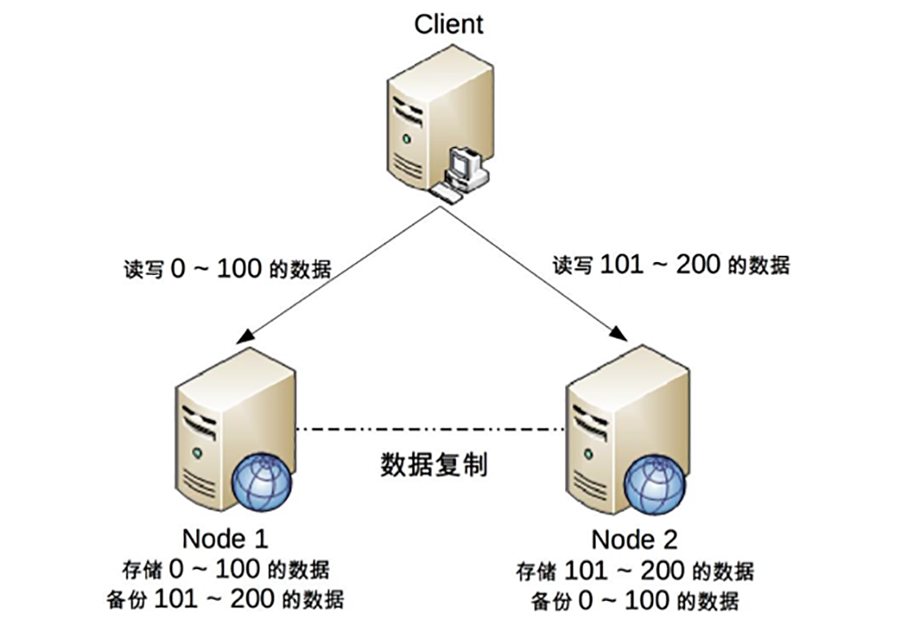

将用户ID 0~100的数据存储在Node 1，101~200存储在Node 2。对于单个用户来说，读写操作都只能在某个节点上进行；对所有用户来说，分散在多节点——兼顾了CA和分布式。

这种设计的问题：某个节点故障时，该节点上的用户无法进行读写操作。但站在整体上，只影响20%的用户比影响所有用户要好。这也是为什么挖掘机挖断光缆后，支付宝只有一部分用户会出现业务异常，而不是所有用户业务异常。

### 2.3 细节三：正常运行时不存在CP和AP的选择，可以同时满足CA

CAP理论告诉我们分布式系统只能选择CP或者AP，但这里的前提是**发生了分区**。如果系统没有发生分区现象（节点间的网络连接一切正常），没有必要放弃C或者A，应该C和A都可以保证。

这就要求架构设计时**既要考虑分区发生时选择CP还是AP，也要考虑分区没有发生时如何保证CA**。

同样是实现CA，不同的数据实现方式也可能不一样：
- 用户账号数据可以采用"消息队列"方式实现CA——消息队列可以比较好地控制实时性，但实现复杂
- 用户信息数据可以采用"数据库同步"方式实现CA——使用简单，某些场景延迟较高

### 2.4 细节四：放弃不等于什么都不做，需要为分区恢复后做准备

CAP理论中的"牺牲"有误导作用——"牺牲"让很多人理解成什么都不做。实际上，分区期间无法保证C或者A，并不意味着永远放弃C和A。

系统整个运行周期中，大部分时间都是正常的：
- 99.99%可用性（4个9）→一年不可用50分钟
- 99.999%可用性（5个9）→一年不可用5分钟

**CP方案分区期间的准备**：节点1可以继续注册新用户，节点2无法注册（返回error），但节点1将新注册但未同步到节点2的用户记录到日志中。当分区恢复后，节点1读取日志中的记录，同步给节点2，重新达到CA状态。

**AP方案分区期间的准备**：节点1和节点2都可以修改用户信息，但两边可能修改不一样。分区恢复后，系统按规则合并数据——"最后修改优先"或"字数最多优先"或报告冲突由人工选择。

### 2.5 细节五：CAP难以选择但可以优化

CAP三者之间没有完美的选择，但架构师可以通过多种手段来优化CAP的表现：
1. **降低分区发生概率**：搭建高速网络、多通道冗余
2. **缩短分区持续时间**：自动故障检测、快速恢复
3. **细化CAP粒度**：按数据特征分别选择CP或AP
4. **分区期间记录操作**：为恢复后的数据同步做准备

### 2.6 ACID与BASE

**ACID**——数据库管理系统保证事务正确性的理论：

| 约束 | 含义 |
|------|------|
| **Atomicity（原子性）** | 事务中的所有操作要么全部完成，要么全部不完成，不会在中间某个环节结束 |
| **Consistency（一致性）** | 事务开始前和结束后，数据库的完整性没有被破坏 |
| **Isolation（隔离性）** | 防止多个事务并发执行时由于交叉执行导致数据不一致。分为读未提交、读提交、可重复读、串行化 |
| **Durability（持久性）** | 事务处理结束后，对数据的修改是永久的，即便系统故障也不会丢失 |

ACID中的A（原子性）和CAP中的A（可用性）意义完全不同，ACID中的C和CAP中的C名称虽然都是一致性，但含义也完全不一样——ACID中的C是指数据库的数据完整性，CAP中的C是指分布式节点中的数据一致性。两者应用领域不同，对比就类似"关公战秦琼"。

**BASE**——CAP中AP方案的延伸和补充：

| 要素 | 含义 | 关键词 |
|------|------|--------|
| **Basically Available（基本可用）** | 故障时允许损失部分可用性，保证核心可用 | "部分"和"核心" |
| **Soft State（软状态）** | 允许系统存在中间状态（数据不一致） | 不影响整体可用性 |
| **Eventual Consistency（最终一致性）** | 所有数据副本经过一定时间后最终一致 | "一定时间"与数据特性强关联 |

**基本可用的关键决策**：选择哪些作为可以损失的业务，哪些是必须保证的业务。用户管理系统——"登录"是核心功能（已注册用户无法登录意味着充了钱的游戏不能玩、云存储不能用），"注册"可以算作非核心功能（未注册用户本来就还没使用系统，注册不了最多流失一部分用户），登录用户数量远远大于新注册用户。

**最终一致性的差异化处理**："一定时间"和数据的特性强关联。用户账号数据最好能在1分钟内就达到一致状态（用户注册或登录后1分钟内可能切换节点），而用户发布的最新微博可以容忍30分钟内达到一致状态（用户看不到某个明星发布的最新微博，基本无感知）。"最终"的含义是不管多长时间，最终还是要达到一致性的状态。

**BASE与CAP的关系**：
- CAP理论忽略延时，完美CP场景不存在——即使几毫秒的复制延迟也不符合CP。CAP中的CP方案实际上也是实现了最终一致性，只是"一定时间"是几毫秒
- AP方案中牺牲一致性只是指分区期间——分区故障恢复后，系统应该达到最终一致性
- **综合：ACID是数据库事务完整性的理论，CAP是分布式系统设计理论，BASE是CAP理论中AP方案的延伸**

> **深度注记**：CAP中的CP方案实际上也实现了最终一致性——只是"一定时间"是几毫秒。BASE本质上是承认了"完美的CP不存在"，将CP降级为"较快的最终一致性"。

---

## 三、FMEA方法：系统排查可用性隐患

### 3.1 FMEA简介

FMEA（Failure Mode and Effects Analysis，故障模式与影响分析）最早由美国军方在20世纪40年代采用，现已广泛应用于半导体加工、餐饮服务、塑料制造、软件及医疗保健行业。FMEA之所以能在差异很大的领域都得到应用，根本原因在于它是一套**分析和思考的方法**，而不是某个领域的技能或者工具。

**关键定位**：FMEA不能指导我们如何做架构设计，而是当我们设计出一个架构后，再使用FMEA对这个架构进行分析，看看架构是否还存在某些可用性的隐患。根据墨菲定律"可能出错的事情最终都会出错"，架构隐患总有一天会导致系统故障。

**FMEA的基本步骤**：
1. 给出初始的架构设计图
2. 假设架构中某个部件发生故障
3. 分析此故障对系统功能造成的影响
4. 根据分析结果，判断架构是否需要进行优化

### 3.2 FMEA分析表的11个要素

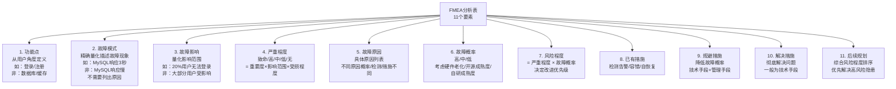
```mermaid
graph TD
    A[FMEA分析表<br/>11个要素] --> B["1. 功能点<br/>从用户角度定义<br/>如：登录/注册<br/>非：数据库/缓存"]

    A --> C["2. 故障模式<br/>精确量化描述故障现象<br/>如：MySQL响应3秒<br/>非：MySQL响应慢<br/>不需要列出原因"]

    A --> D["3. 故障影响<br/>量化影响范围<br/>如：20%用户无法登录<br/>非：大部分用户受影响"]

    A --> E["4. 严重程度<br/>致命/高/中/低/无<br/>= 重要度×影响范围×受损程度"]

    A --> F["5. 故障原因<br/>具体原因列表<br/>不同原因概率/检测/措施不同"]

    A --> G["6. 故障概率<br/>高/中/低<br/>考虑硬件老化/开源成熟度/自研成熟度"]

    A --> H["7. 风险程度<br/>= 严重程度 × 故障概率<br/>决定改进优先级"]

    A --> I["8. 已有措施<br/>检测告警/容错/自恢复"]

    A --> J["9. 规避措施<br/>降低故障概率<br/>技术手段+管理手段"]

    A --> K["10. 解决措施<br/>彻底解决问题<br/>一般为技术手段"]

    A --> L["11. 后续规划<br/>综合风险程度排序<br/>优先解决高风险隐患"]

```

**1. 功能点**：从用户角度来看的功能点。用户管理系统的"登录""注册"才是功能点，数据库存储功能、Redis缓存功能不能作为FMEA分析的功能点。

**2. 故障模式**：系统会出现什么样的故障，包括故障点和故障形式。**不需要给出真正的故障原因**——MySQL响应时间达到3秒可能的原因很多（磁盘坏道、慢查询、网络故障、MySQL bug），我们只需要假设出现某种故障现象即可。**描述要尽量精确，多使用量化描述**——"MySQL响应时间达到3秒"而非"MySQL响应慢"。

**3. 故障影响**：功能点受到什么影响。常见的影响有：功能点偶尔不可用、完全不可用、部分用户不可用、响应缓慢、出错等。**也需要尽量准确**——"20%的用户无法登录"而非"大部分用户无法登录"。数字不需要完全精确（21.25%没有必要），只需预估是20%还是40%。

**4. 严重程度**：站在业务的角度评估故障的影响程度，分为"致命/高/中/低/无"五档。

**严重程度评估公式**：严重程度 = 功能点重要程度 × 故障影响范围 × 功能点受损程度

| 严重程度 | 示例 |
|---------|------|
| **致命** | 超过70%用户无法登录 |
| **高** | 超过30%的用户无法登录 |
| **中** | 所有用户登录时间超过5秒 |
| **低** | 10%的用户登录时间超过5秒 |
| **中** | 所有用户都无法修改资料 |
| **低** | 20%的用户无法修改头像 |

> 对于某个故障影响到底属于哪个档次，有时会出现争议。一般建议相关人员讨论确定即可，争执不下时架构师裁定即可，不建议花费太多时间争论。

**5. 故障原因**：故障模式只描述了现象，这里列出具体的故障原因。为何要单独列出？因为：
- **不同故障原因发生概率不同**：MySQL bug概率远低于没有索引
- **不同故障原因检测手段不同**：磁盘坏道需专用检测系统，慢查询只需配置慢查询日志
- **不同故障原因处理措施不同**：MySQL bug只能升级版本，没有索引则增加索引

**6. 故障概率**：某个具体故障原因发生的概率，一般分为"高/中/低"三档。高中低是相对的，只是为了确定优先级以决定后续的资源投入，没有必要绝对量化。

| 因素 | 高概率 | 低概率 |
|------|--------|--------|
| 硬件 | 使用3年以上的硬盘 | 新硬盘 |
| 开源系统 | 刚发布的版本/初次使用 | 成熟版本/已有使用经验 |
| 自研系统 | 新开发的系统 | 成熟的线上系统 |

**7. 风险程度**：综合严重程度和故障概率判断某个故障的最终等级。

**风险程度 = 严重程度 × 故障概率**

可能出现某个故障影响非常严重，但概率很低，最终风险程度就低。例如"机房业务瘫痪"影响致命，但如果原因是"地震"（广州5级以上地震20世纪才1次，1940年），概率很低；而"机房空调烧坏"可能2年1次，"机架掉电"可能1年1次——同样的故障影响，不同的故障原因有不同的概率，最终得到的风险级别就不同。

**8. 已有措施**：针对具体的故障原因，系统现在是否提供了某些措施来应对：
- **检测告警**：最简单的措施，检测故障后告警，需要人工干预
- **容错**：检测到故障后通过备份手段应对，如MySQL主备切换
- **自恢复**：检测到故障后系统能够自己恢复，如Hadoop将故障机器的副本重新分配到其他机器。注意恢复主要是"业务"上的恢复，一般不太可能将真正的故障恢复

**9. 规避措施**：为了降低故障发生概率而做的事情：
- 技术手段：在MySQL中冗余一份MongoDB数据
- 管理手段：强制统一更换服务时间超过2年的磁盘

**10. 解决措施**：为了能够解决问题而做的事情，一般都是技术手段：
- 增加密码重试次数限制
- 数据库敏感数据加密保存
- 增加白名单控制

> 如果某个故障既可以采取规避措施，又可以采取解决措施，优先选择解决措施——毕竟能解决问题当然是最好的。但很多问题是系统自己无法解决的（磁盘坏道、开源系统bug），这类故障只能采取规避措施；系统能够自己解决的故障，大部分是和系统本身功能相关的。

**11. 后续规划**：综合前面的分析，结合风险程度进行排序，给出后续改进规划。这些规划既可以是技术手段也可以是管理手段，可以是规避措施也可以是解决措施。优先将风险程度高的系统隐患解决。

例如：
- 地震导致机房业务中断：无法解决，只能通过备份中心规避
- 机柜断电导致机房业务中断：将业务机器分散在不同机柜来规避
- 敏感数据泄露：数据库加密的技术手段来解决
- MongoDB断电丢数据：将数据冗余一份在MySQL中，故障情况下重建数据来规避

### 3.3 FMEA实战案例

**初始架构**：Server + MySQL(单机) + Memcache(单机)

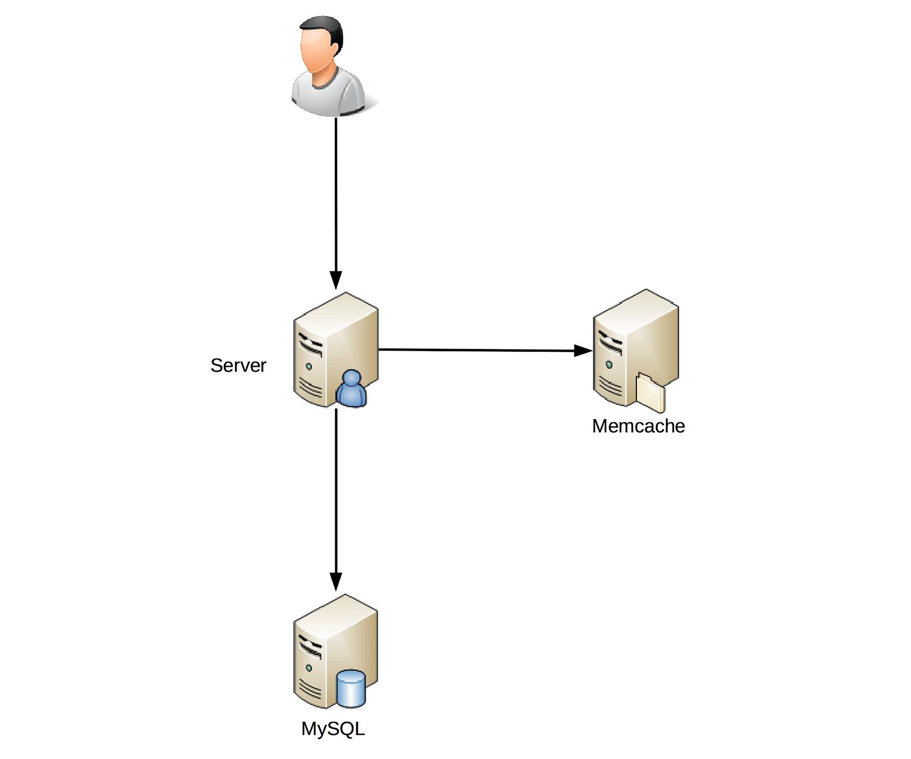

FMEA分析表样例（不完整，可自行补充）：

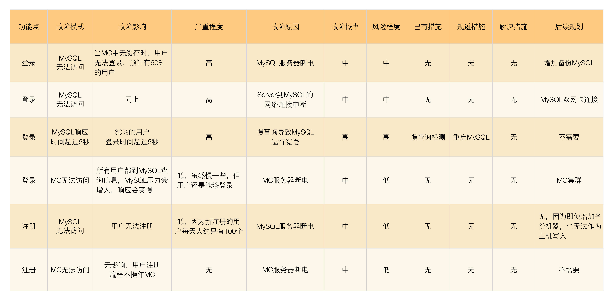

经过FMEA分析，将"后续规划"列的内容汇总，得到需要改进的措施：
- MySQL增加备机
- MC从单机扩展为集群
- MySQL双网卡连接

改进后的架构：

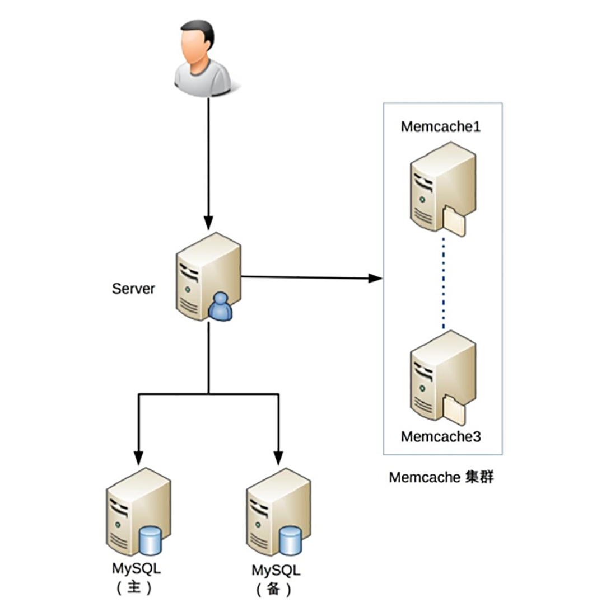

> **深度注记**：FMEA的价值在于"系统化"而非"高深"——逐项排查看似简单，但人的思维天然存在盲区，不做FMEA很容易遗漏关键隐患。正如墨菲定律所说："可能出错的事情最终都会出错"。

---

## 四、双机架构

### 4.1 四种双机架构总览

存储高可用方案的本质是通过将数据复制到多个存储设备，以数据冗余的方式实现高可用，其复杂性主要体现在如何应对复制延迟和中断导致的数据不一致问题。对任何一个高可用存储方案，需要从以下方面思考：
- 数据如何复制？
- 各个节点的职责是什么？
- 如何应对复制延迟？
- 如何应对复制中断？

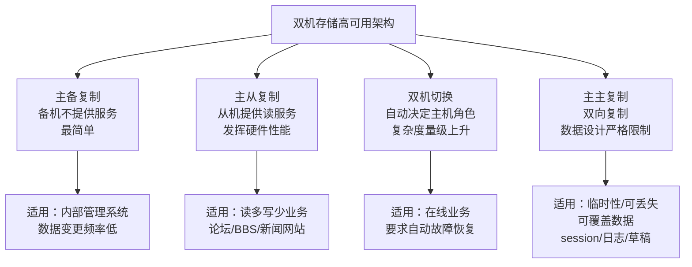
```mermaid
graph TD
    A[双机存储高可用架构] --> B["主备复制<br/>备机不提供服务<br/>最简单"]
    A --> C["主从复制<br/>从机提供读服务<br/>发挥硬件性能"]
    A --> D["双机切换<br/>自动决定主机角色<br/>复杂度量级上升"]
    A --> E["主主复制<br/>双向复制<br/>数据设计严格限制"]

    B --> B1["适用：内部管理系统<br/>数据变更频率低"]
    C --> C1["适用：读多写少业务<br/>论坛/BBS/新闻网站"]
    D --> D1["适用：在线业务<br/>要求自动故障恢复"]
    E --> E1["适用：临时性/可丢失<br/>可覆盖数据<br/>session/日志/草稿"]

```

### 4.2 主备复制

**架构**：主机负责读写，备机仅做备份，不对外提供服务。

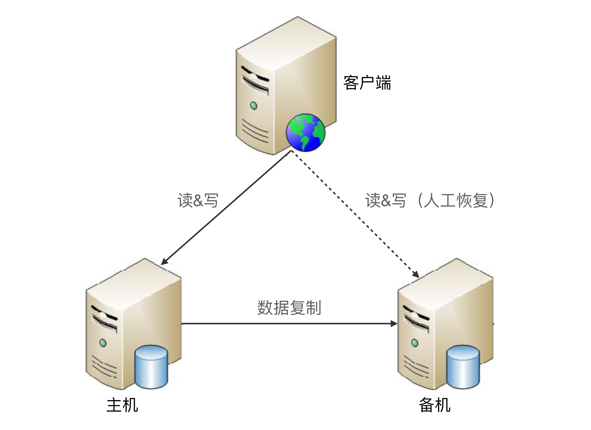

| 优势 | 劣势 |
|------|------|
| 简单——客户端不需要感知备机存在。灾难恢复后原备机被改为主机，对客户端来说只是主机地址换了 | 备机硬件浪费——只做备份不提供读写 |
| 主备只需数据复制，无状态判断和切换操作 | 故障需人工干预——打电话找人可能就耗费10分钟；深更半夜可能没人知道；人工操作容易出错（1年就2-3次的操作，很可能遇到意外问题） |

**冷备 vs 热备**：
- **冷备**：备机上的程序包和配置文件准备好，但业务系统没有启动（服务器是启动的）。故障后需人工启动业务系统并切换
- **热备（温备）**：备机上的业务系统已经启动，只是不对外提供服务。故障后人工只需切换任务分配器即可。冷备可节省一定能源，但温备能大大减少手工操作时间，因此一般情况下推荐温备

**适用场景**：内部后台管理系统（学生管理、假期管理等），数据变更频率低，即使丢失可人工补全。

### 4.3 主从复制

**架构**：主机负责读写，从机提供读服务。"从"意为"随从、仆从"——是要帮主人干活的。

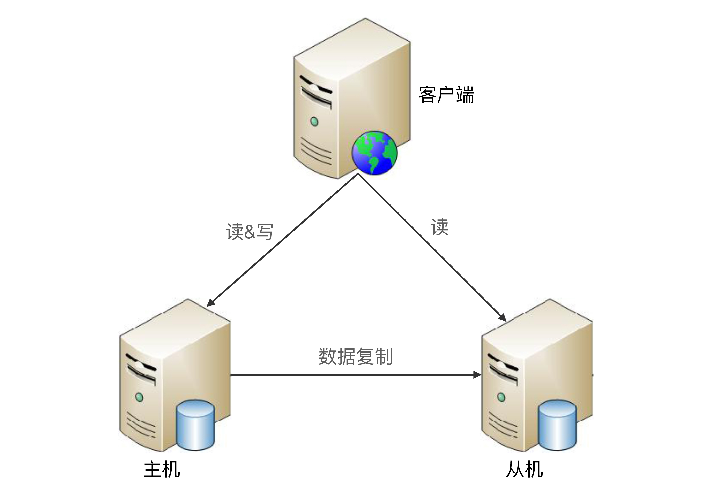

| 相比主备的改进 | 新增问题 |
|-------------|---------|
| 从机提供读操作，发挥了硬件性能 | 客户端需感知主从关系，将不同操作发给不同机器，复杂度上升 |
| 主机故障时读操作相关的业务可以继续运行 | 主从复制延迟大时，业务会因为数据不一致出现问题 |
| — | 故障仍需人工干预 |

**适用场景**：读多写少的业务（论坛、BBS、新闻网站），读操作量是写操作的10倍甚至100倍以上。

### 4.4 双机切换

主备和主从的共同问题：主机故障后写操作不可用 + 需人工指定新主机。双机切换在原有方案基础上增加**自动切换**功能。由于主备切换和主从切换在切换的设计上没有差别，以主备切换为例。

**三个关键设计点**：

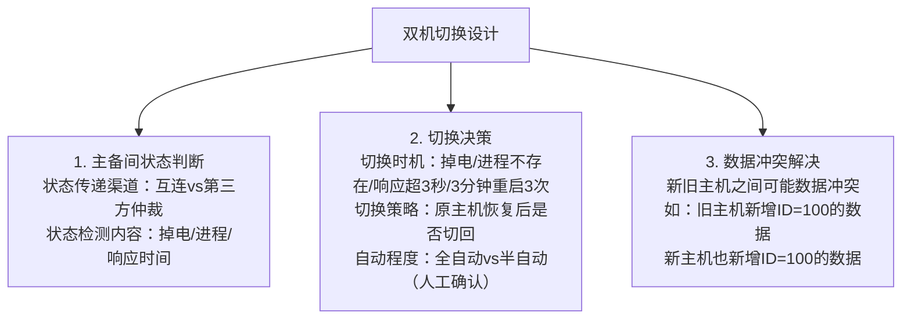
```mermaid
graph TD
    A[双机切换设计] --> B["1. 主备间状态判断<br/>状态传递渠道：互连vs第三方仲裁<br/>状态检测内容：掉电/进程/响应时间"]
    A --> C["2. 切换决策<br/>切换时机：掉电/进程不存在/响应超3秒/3分钟重启3次<br/>切换策略：原主机恢复后是否切回<br/>自动程度：全自动vs半自动（人工确认）"]
    A --> D["3. 数据冲突解决<br/>新旧主机之间可能数据冲突<br/>如：旧主机新增ID=100的数据<br/>新主机也新增ID=100的数据"]

```

> 如果复制方案的代码是1000行，那么切换方案的代码可能就是10000行。多出的9000行就是用于实现上面三个设计点的。

**三种切换架构**：

**互连式**：主备机直接建立状态传递的渠道。

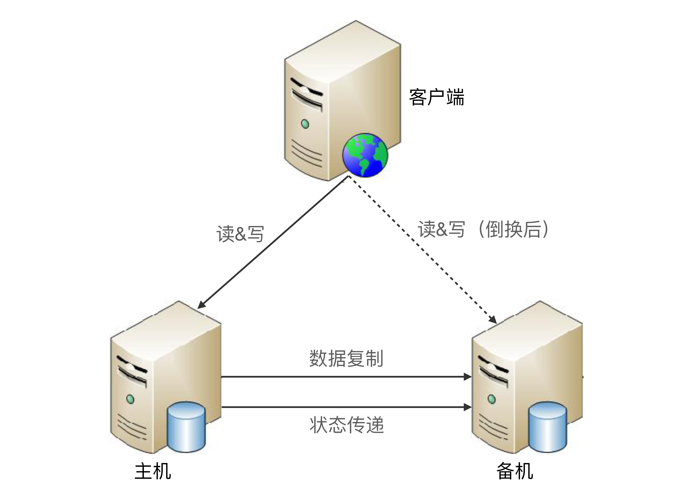

状态传递通道的实现方式很多：网络连接或串口线；主机发送或备机获取；与数据复制通道共用或独立；单通道或多类型通道混合。

客户端配合方式：主备共享虚拟IP（主机绑定）；或客户端记录主备地址，哪个能访问就访问哪个（备机能收到请求但直接拒绝）。

**互连式的主要缺点**：如果状态传递通道本身故障（网线被踢掉），备机会认为主机故障而升级为主机——此时主机并没有故障，出现双主机。多通道可以降低概率但不能根本解决，且通道越多状态决策越复杂——备机可能从不同通道收到不同甚至矛盾的状态信息。

**中介式**：主备两者之外引入第三方中介，主备机都连接中介传递状态。

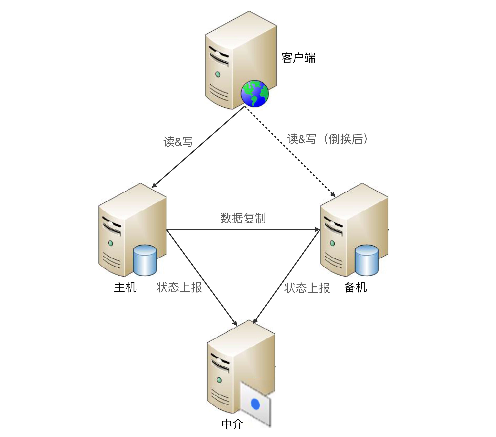

中介式虽然引入了第三方，但状态传递和决策反而更加简单：

**连接管理更简单**：主备机无须建立和管理多种类型的状态传递连接，只需连接到中介即可——实际上是降低了主备机的连接管理复杂度。

**状态决策更简单**：简单算法即可完成——
- 初始状态都是备机，与中介断开连接就降级为备机（可能出现双备机）
- 主机与中介断连后，中介立刻告知备机，备机升级为主机
- 如果是网络中断，主机自己降级为备机，网络恢复后以新备机身份上报
- 如果是掉电重启或进程重启，初始为备机，发现已有主机则保持备机状态
- 正常情况下按实际状态决定是否切换（如响应超3秒就切换）

**中介的高可用**：中介式架构的关键代价在于如何实现中介本身的高可用——陷入递归陷阱：为了高可用引入中介，但中介又要求高可用。幸运的是，ZooKeeper和Keepalived已经解决了中介自身的高可用问题，推荐基于ZooKeeper搭建中介式切换架构。

MongoDB的Replica Set采取的就是这种方式：

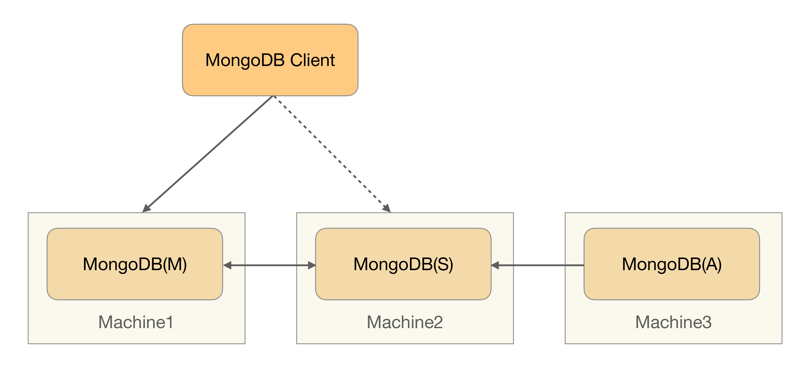

MongoDB(M)表示主节点，MongoDB(S)表示备节点，MongoDB(A)表示仲裁节点。主备节点存储数据，仲裁节点不存储数据。客户端同时连接主节点与备节点，不连接仲裁节点。

**模拟式**：主备机之间不传递状态数据，备机模拟成客户端向主机发起读写操作，根据响应判断主机状态。

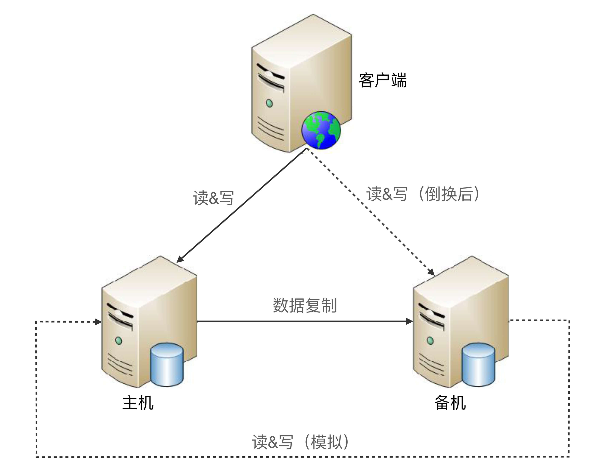

优点：实现最简单，省去了状态传递通道的建立和管理工作。缺点：获取的状态信息有限——只有响应信息（HTTP 404、超时、响应时间等），不像互连式那样多样（CPU负载、I/O负载、吞吐量等），基于有限状态做决策可能出现偏差。

**三种切换架构对比**：

| 架构 | 状态传递方式 | 优势 | 劣势 |
|------|------------|------|------|
| **互连式** | 主备直接连接 | 无需第三方 | 通道本身故障→双主；多通道→决策复杂 |
| **中介式** | 主备都连接第三方中介 | 连接管理简单；状态决策简单 | 中介本身需高可用（可用ZooKeeper/Keepalived） |
| **模拟式** | 备机模拟客户端读写主机 | 实现最简单（省去状态通道） | 获取的状态信息有限（只有响应信息） |

### 4.5 主主复制

**架构**：两台都是主机，互相将数据复制给对方，客户端可任意选择读写。

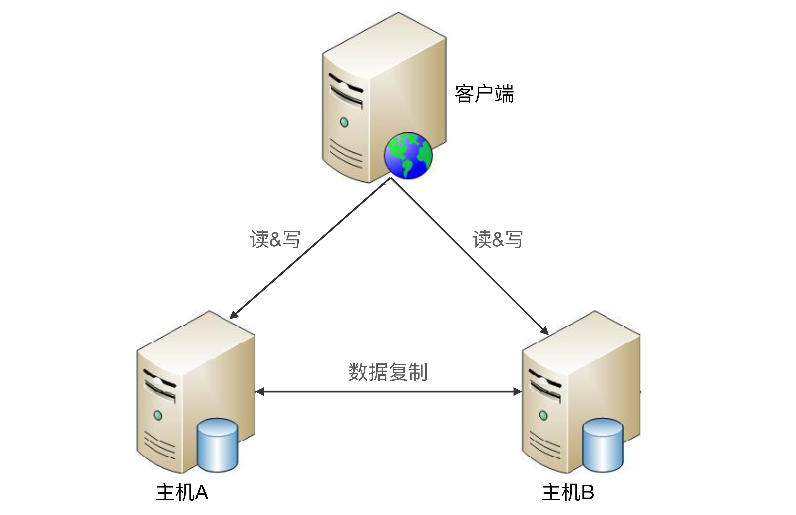

| 优势 | 劣势 |
|------|------|
| 无切换概念——两台都是主机 | 很多数据不能双向复制 |
| 客户端无需区分角色 | 用户ID冲突——按数字增长则两个主机分配相同ID |
| — | 库存/余额冲突——双向复制会导致数据覆盖错误 |

**库存冲突示例**：商品库存100件，主机A减1件变99，主机B减2件变98。A将99复制到B，B原有的98被覆盖变成99，实际正确库存应为97。类似的还有余额数据。

**适用数据**：临时性、可丢失、可覆盖的数据——session（可重新登录生成）、日志（可丢失）、草稿（可丢失）。

**不适用数据**：用户ID（数字递增会冲突）、库存/余额（双向复制导致覆盖错误）。

> **深度注记**：双机架构的复杂度递进关系——主备1000行代码 → 双机切换10000行代码。多出的9000行用于实现状态判断、切换决策、数据冲突解决。架构师需根据业务场景选择合适的复杂度等级。

---

## 五、集群架构

双机架构的隐含假设是主机能够存储所有数据，但主机有极限。当数据量远超单机能力时（如Facebook 2013年有2500亿张上传照片/250PB，每天上传3.5亿张），必须使用多台服务器——集群架构。

简单来说，集群就是多台机器组合形成一个统一的系统，数量上至少3台（主备、主从是2台）。

### 5.1 数据集中集群（1主多备/从）

与主备、主从架构类似，数据只能往主机中写，读操作可灵活设计。

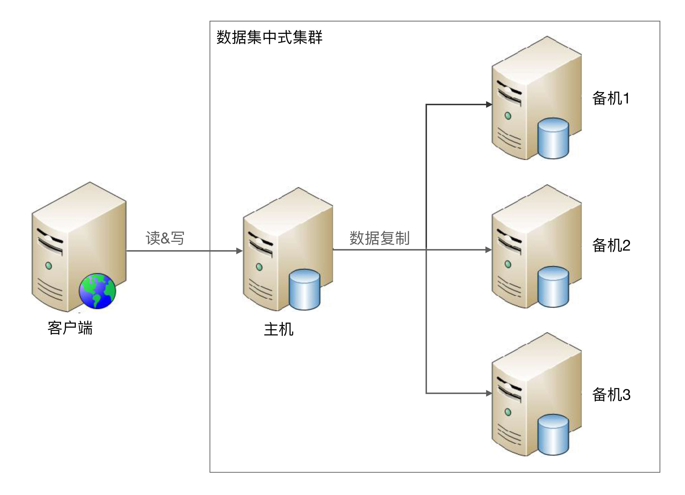

虽然架构类似，但服务器数量更多导致复杂度整体更高：

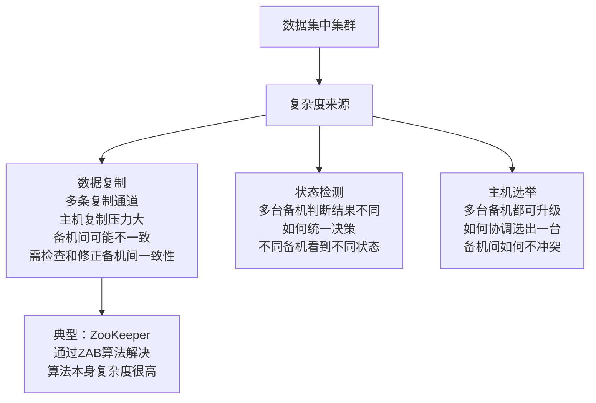
```mermaid
graph TD
    A[数据集中集群] --> B["复杂度来源"]

    B --> B1["数据复制<br/>多条复制通道<br/>主机复制压力大<br/>备机间可能不一致<br/>需检查和修正备机间一致性"]
    B --> B2["状态检测<br/>多台备机判断结果不同<br/>如何统一决策<br/>不同备机看到不同状态"]
    B --> B3["主机选举<br/>多台备机都可升级<br/>如何协调选出一台<br/>备机间如何不冲突"]

    B1 --> C["典型：ZooKeeper<br/>通过ZAB算法解决<br/>算法本身复杂度很高"]

```

**适用场景**：数据量不大、集群机器数量不多（如ZooKeeper推荐5台左右）。

### 5.2 数据分散集群

每台服务器存储一部分数据并备份部分数据，每台都可以处理读写请求。

**数据分配算法的设计要求**：

| 要求 | 说明 |
|------|------|
| **均衡性** | 各服务器数据分区基本均衡，不能存在某台服务器分区数量是另一台的几倍 |
| **容错性** | 部分服务器故障时，算法需要将原分配给故障服务器的分区分配给其他服务器 |
| **可伸缩性** | 集群容量不够扩充新服务器后，算法能够自动将部分分区迁移到新服务器，保证均衡 |

**数据分区管理角色**：

| 方案 | 典型实现 | 特点 |
|------|---------|------|
| 独立服务器管理 | Hadoop（Namenode） | 集中式管理，简单但有单点风险。Namenode管理文件系统名字空间，确定数据块到Datanode的映射 |
| 选举一台服务器管理 | Elasticsearch（Master Node） | 去中心化选举，Master故障后重新选举。负责创建/删除索引、跟踪节点、决定分片分配 |

Hadoop的数据分区管理架构：

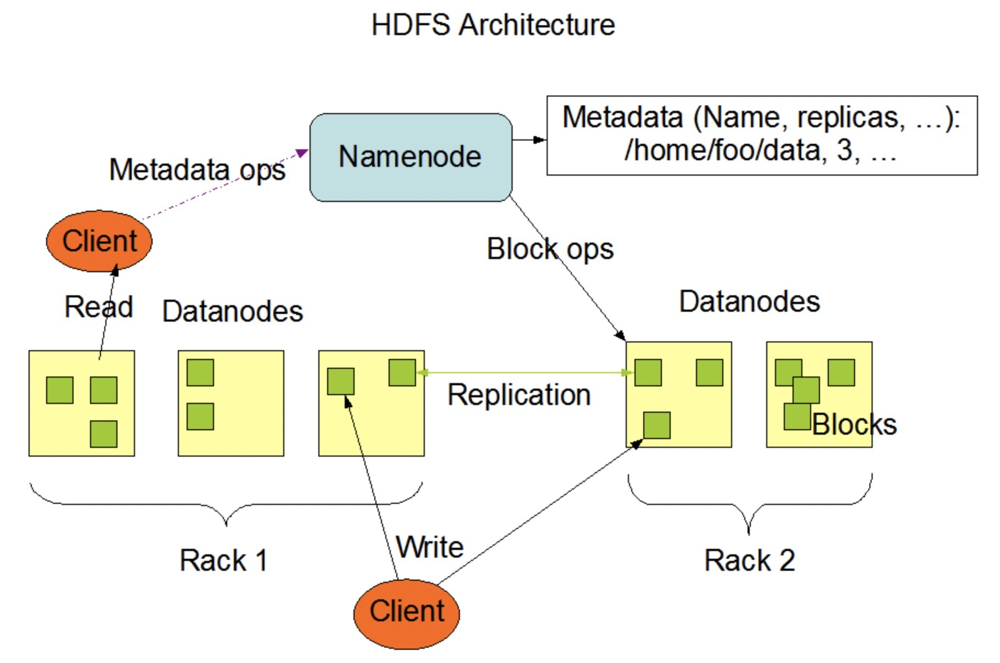

Elasticsearch的数据分区管理架构：

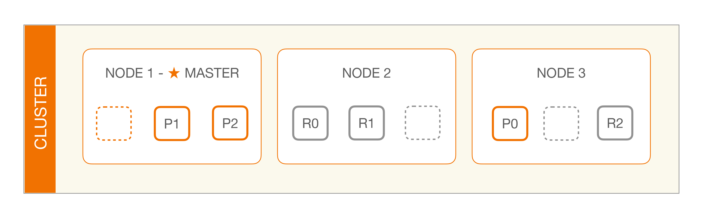

**集中集群 vs 分散集群**：

| 维度 | 数据集中集群 | 数据分散集群 |
|------|------------|------------|
| 写入 | 只能写主机 | 任意服务器可写 |
| 扩展性 | 受限于主机能力 | 良好的可伸缩性 |
| 适用场景 | 数据量不大、机器不多 | 数据量巨大、机器庞大（上百上千台） |
| 典型系统 | ZooKeeper | Hadoop、HBase、Elasticsearch |

---

## 六、数据分区架构

数据分区面向的是**地理级别故障**——机房断电、火灾、地震、水灾等极端灾害可能导致某个地区所有基础设施瘫痪。基于硬件故障设计的高可用架构不再适用，需要基于地理级别的故障来设计高可用架构。

数据分区 = 将数据按规则分区 + 不同分区分布在不同地理位置 + 每个分区存储一部分数据。即使某个地区发生严重灾害，受影响的也只是一部分数据；当故障恢复后，其他地区备份的数据也可以帮助故障地区快速恢复业务。

### 6.1 分区设计的三个维度

| 维度 | 关键考量 |
|------|---------|
| **数据量** | 数据量越大，分区规则越复杂。800台服务器远非4台的200倍——每周都有服务器故障，定位困难；配置修改可能影响所有服务器；需要考虑地理容灾 |
| **分区规则** | 洲际分区（面向不同大洲，跨洲通讯延迟大不适合在线服务，一般仅作备份）→ 国家分区（不同国家不同法律/语言，一般也仅作备份）→ 城市分区（网络延迟低，可同时对外服务，满足异地多活需求） |
| **复制规则** | 每个分区本身的数据也需要备份，否则分区数据损坏同样不可接受 |

### 6.2 三种复制规则

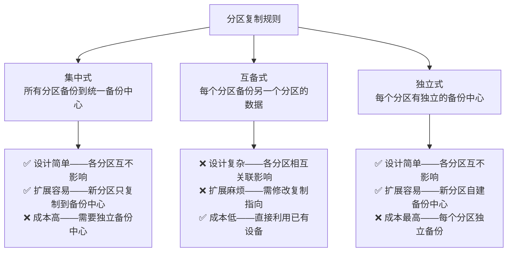
```mermaid
graph TD
    A[分区复制规则] --> B["集中式<br/>所有分区备份到统一备份中心"]
    A --> C["互备式<br/>每个分区备份另一个分区的数据"]
    A --> D["独立式<br/>每个分区有独立的备份中心"]

    B --> B1["✅ 设计简单——各分区互不影响<br/>✅ 扩展容易——新分区只复制到备份中心<br/>❌ 成本高——需要独立备份中心"]
    C --> C1["❌ 设计复杂——各分区相互关联影响<br/>❌ 扩展麻烦——需修改复制指向<br/>✅ 成本低——直接利用已有设备"]
    D --> D1["✅ 设计简单——各分区互不影响<br/>✅ 扩展容易——新分区自建备份中心<br/>❌ 成本最高——每个分区独立备份"]

```

**集中式**：

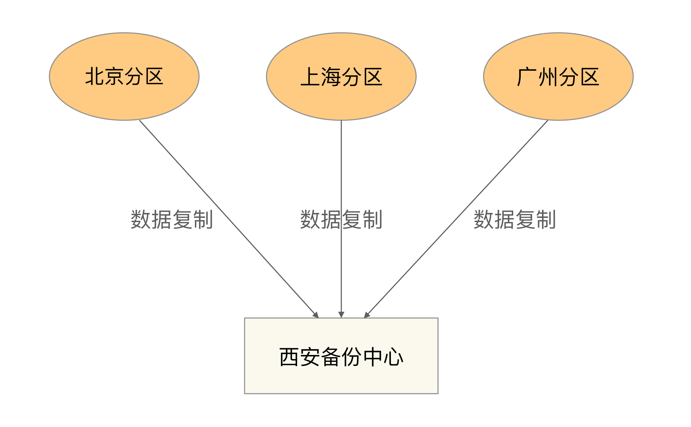

**互备式**：

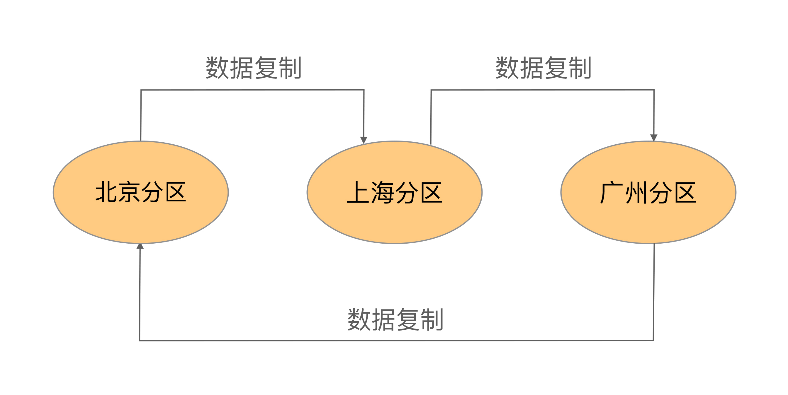

扩展麻烦示例：增加武汉分区，需修改广州分区复制指向武汉，武汉指向北京。原北京已备份的广州数据怎么处理？数据迁移还是保留历史数据？无论哪种方式都很麻烦。

**独立式**：

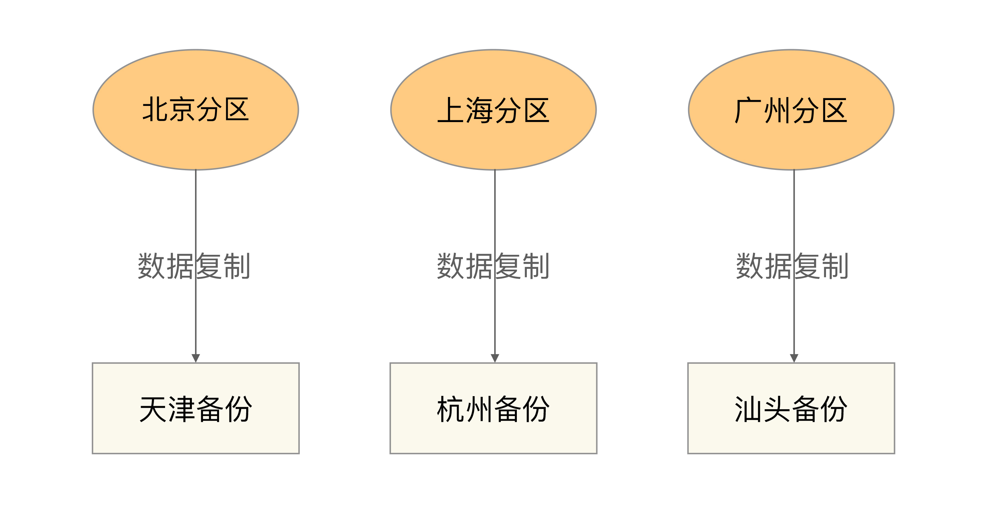

**关键细节**：每个分区的备份不能和原分区在同一城市——北京分区备份放天津，上海分区备份放杭州，广州分区备份放汕头。如果北京机房在朝阳区而备份在通州区，整个北京停电则两个机房都无法工作。备份中心的场地成本是主要成本，因此独立式比集中式成本要高很多。

---

## 七、计算高可用架构

### 7.1 计算高可用的本质

计算高可用的主要设计目标是当出现部分硬件损坏时，计算任务能够继续正常运行。其本质是通过冗余来规避部分故障的风险，设计思想很简单：**通过增加更多服务器来达到计算高可用**。

计算高可用架构的设计复杂度主要体现在**任务管理**方面——当任务在某台服务器上执行失败后，如何将任务重新分配到新的服务器进行执行。关键点有两个：

1. **哪些服务器可以执行任务**
   - 第一种：每个服务器都可以执行任务（类似计算高性能中的集群）
   - 第二种：只有特定服务器（主机）可以执行任务（类似存储高可用中的集群）

2. **任务如何重新执行**
   - 第一种：已分配的任务执行失败不做任何处理，只需保证新任务分配到非故障服务器
   - 第二种：设计任务管理器管理任务，执行完后反馈结果，根据结果决定是否重新分配

> "任务分配器"是逻辑概念，不一定是独立模块。Nginx作为反向代理承担任务分配器职责；ZooKeeper的Follower收到写请求转发给Leader，收到读请求自己处理——Follower就是逻辑上的任务分配器。

### 7.2 计算高可用的三种架构

**主备架构**：主机执行所有计算任务，备机只做备份。主机故障时系统不可用，需人工将备机升为主机。

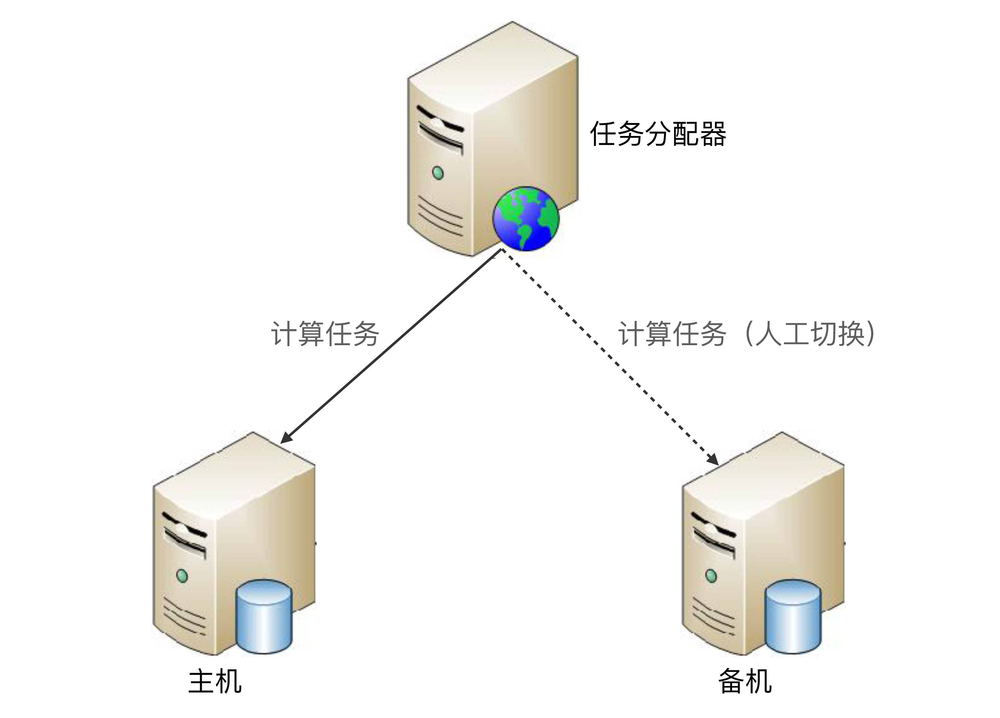

- **冷备**：备机程序包和配置文件准备好，但业务系统未启动。故障后需人工启动并切换
- **温备**：备机业务系统已启动但不对外服务。故障后只需切换任务分配器即可

**主从架构**：主机执行部分任务（任务A），从机执行部分任务（任务B）。主机故障时任务分配器不会自动将任务发给从机。

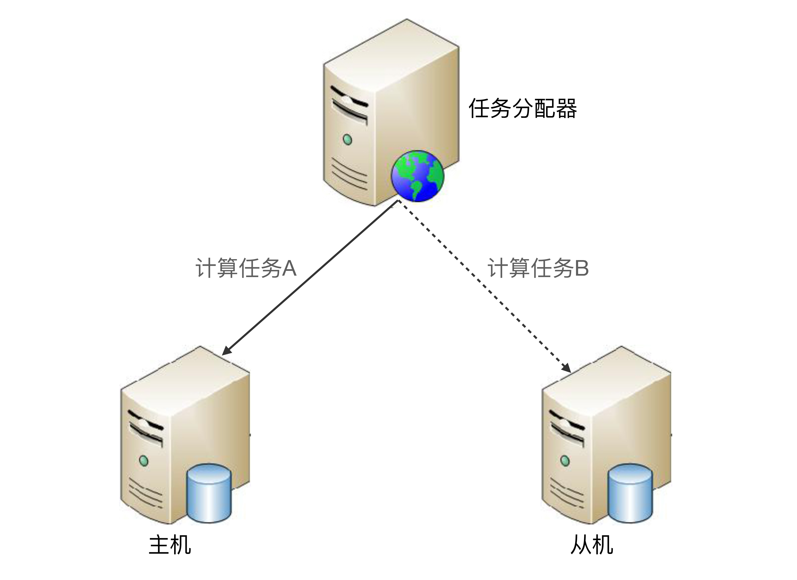

**对称集群（负载均衡集群）**：任务分配器按策略分配任务，故障服务器不再分配，恢复后重新分配。

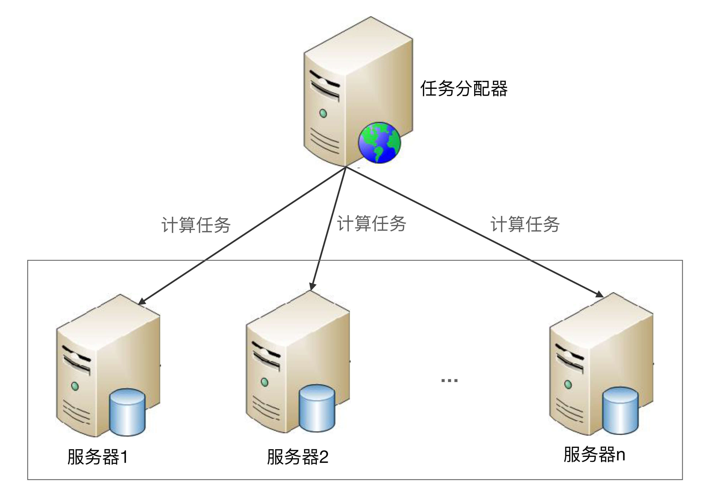

状态判断条件示例：
- 在线页面访问：1分钟内响应超过1秒的页面占80%→认为服务器故障
- 后台统计任务：单个任务超过10分钟未完成→认为服务器故障

**非对称集群**：不同服务器角色不同，不同角色执行不同任务。Master故障需重新选举，Slave故障只需剔除。

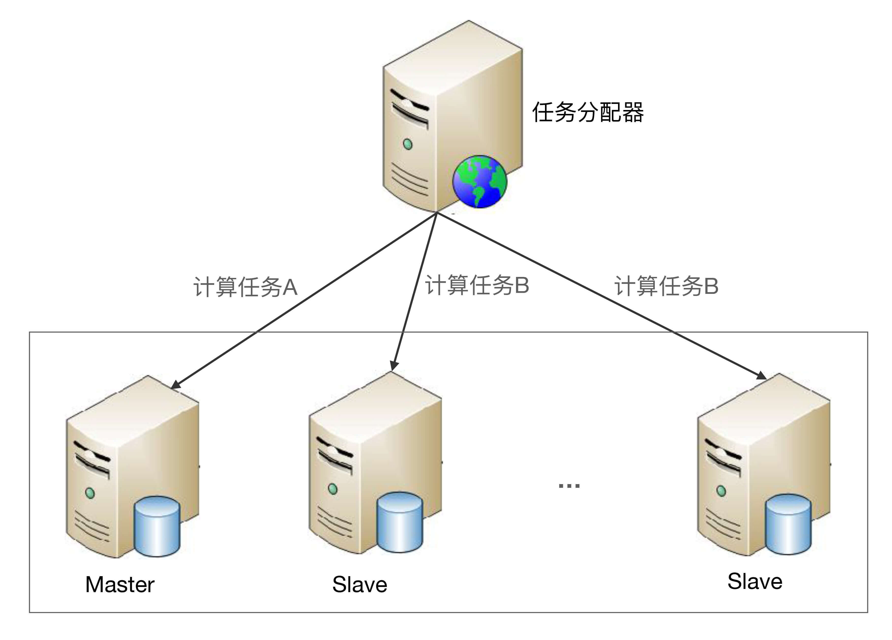

设计复杂度：任务分配策略更复杂（需将任务划分类型分配给不同角色）；角色分配策略更复杂（可能需要ZAB、Raft等算法实现选举）。

ZooKeeper案例：不存在独立任务分配器，每个Server都是任务分配器——Follower收到写请求转发Leader，读请求自己处理；通过ZAB算法选举Leader，Leader故障后所有Follower暂停读写，开始选举，新Leader选出后继续服务。

### 7.3 计算高可用 vs 存储高可用

| 维度 | 计算高可用 | 存储高可用 |
|------|-----------|-----------|
| 核心复杂度 | 任务管理 | 数据一致性 |
| 故障影响 | 任务执行失败 | 数据丢失/不一致 |
| 恢复方式 | 重新分配任务 | 数据恢复/切换 |
| 数据复制 | 无需 | 核心 |

计算高可用无需数据复制，复杂度天然低于存储高可用。存储高可用的"数据复制延迟和中断导致的数据不一致"问题，在计算高可用中不存在。

> **深度注记**：计算高可用集群包含2台服务器的集群，而存储高可用将双机架构和集群架构区分开——因为存储高可用中2台和多台的复杂度有本质区别（数据复制通道数量、选举复杂度等），而计算高可用中2台和多台在设计上没有本质区别。

---

## 八、高可用架构的统一视图

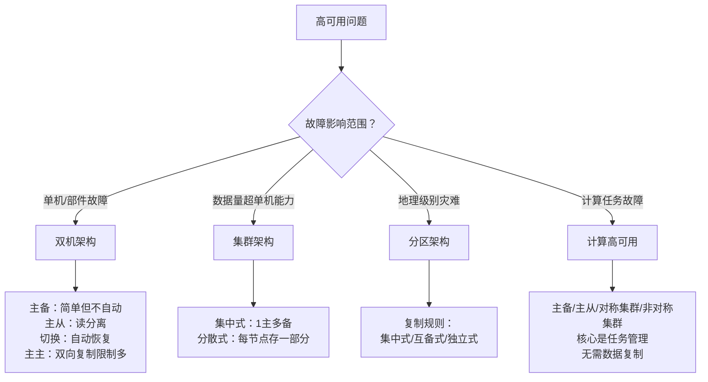
```mermaid
graph TD
    A[高可用问题] --> B{故障影响范围？}

    B -->|"单机/部件故障"| C[双机架构]
    B -->|"数据量超单机能力"| D[集群架构]
    B -->|"地理级别灾难"| E[分区架构]
    B -->|"计算任务故障"| F[计算高可用]

    C --> C1["主备：简单但不自动<br/>主从：读分离<br/>切换：自动恢复<br/>主主：双向复制限制多"]
    D --> D1["集中式：1主多备<br/>分散式：每节点存一部分"]
    E --> E1["复制规则：<br/>集中式/互备式/独立式"]
    F --> F1["主备/主从/对称集群/非对称集群<br/>核心是任务管理<br/>无需数据复制"]

```

**选择决策路径**：
1. 是存储还是计算？→ 存储：继续；计算：主备/主从/集群
2. 是否需要地理级容灾？→ 是：分区架构；否：继续
3. 数据量是否超出单机能力？→ 是：集群架构；否：继续
4. 是否需要自动故障恢复？→ 是：双机切换；否：主备/主从
5. 读操作是否远多于写？→ 是：主从复制；否：主备复制

---

## 总结

| 核心要点 | 关键结论 |
|---------|---------|
| CAP定义 | 分布式系统中C/A/P最多满足两个；互联且共享数据的读写操作才是CAP讨论对象 |
| CAP粒度 | 粒度是数据而非系统；同一系统内不同数据可选不同策略 |
| CAP延迟 | CAP忽略网络延迟；实践中完美CP不存在，严苛场景只能单点写入 |
| CAP正常态 | 正常运行时CA可兼得；分区期间的选择不等于永久放弃 |
| CAP放弃 | 放弃不等于什么都不做；分区期间记录日志/冲突，恢复后同步数据 |
| ACID vs BASE | ACID是数据库事务理论，BASE是CAP中AP方案的延伸；BASE承认"完美CP不存在" |
| FMEA | 11要素分析表系统排查隐患；核心公式：风险程度=严重程度x故障概率 |
| 主备复制 | 最简单；备机不服务、故障需人工；适合内部管理系统 |
| 主从复制 | 从机提供读服务；复制延迟是核心问题；适合读多写少业务 |
| 双机切换 | 自动故障恢复；中介式（ZooKeeper）推荐；复杂度比复制方案高一个量级 |
| 主主复制 | 双向复制；只能用于临时性/可丢失/可覆盖数据 |
| 集群架构 | 集中式适合数据量小机器少；分散式适合数据量巨大机器多 |
| 分区架构 | 面向地理级灾难；三种复制规则权衡简单性与成本；独立式备份不能同城 |
| 计算高可用 | 本质是任务管理；无需数据复制，复杂度低于存储高可用 |

**思考题**：
1. 基于Paxos算法构建的分布式系统，属于CAP架构中的哪一种？
2. 请使用FMEA方法分析HDFS系统的架构，看看HDFS是否存在高可用问题。
3. 既然数据集群就可以做到不同节点之间复制数据，为何不搭建一个远距离分布的集群来应对地理位置级别的故障呢？
4. 计算高可用架构从形式上和存储高可用架构看上去几乎一样，它们的复杂度是一样的么？
5. 如果你来设计一个政府信息公开网站的信息存储系统，你会采取哪种架构？

**关联阅读**：
- [复杂度来源：高可用](05-复杂度来源.md)
- [异地多活架构](11-异地多活架构.md)
- [接口级故障与安全](12-接口级故障与安全.md)

---

> **延伸视角**
>
> 华仔从CAP理论和双机/集群/分区架构角度，系统梳理了存储高可用的工程方案。许式伟从服务治理的宏观视角提供了几个关键补充：
>
> **1. 高可用是治理能力的集中体现**。许式伟将高可用归入服务治理"稳定性治理"维度——不只是架构设计，还涵盖可观测性、故障预案、容量规划。架构设计做好了不等于高可用实现了，还需监控覆盖、告警准确、预案可执行。
>
> **2. 无状态化是降低容灾复杂度的关键**。华仔聚焦存储（有状态）的高可用，复杂度极高。许式伟强调"业务服务无状态，状态集中到中间件"——当业务服务无状态时，故障恢复只需流量切换，无需处理数据一致性。这是从根本上降低高可用复杂度的策略。
>
> **3. 3AZ架构比2AZ更优**。许式伟明确推荐3AZ（三机房）架构：总成本1.5x（vs 2AZ的2x），且一个AZ故障后多数节点仍存活，数据库选举正常——2AZ一个AZ故障意味着一半节点下线，无法选主。
>
> **4. 灰度发布无法发现长潜伏期故障**。数据库规模达到临界点导致的操作异常，故障爆发时点与风险产生时点间隔太远。消除此类风险只能依靠白盒代码审查和全面测试覆盖率。
>
> **融合洞见**：CAP理论从理论上划定了高可用的"天花板"（C/A/P不可兼得），而工程实践的目标是尽可能接近这个天花板。架构师的选择路径是：先通过无状态化将问题从"业务服务"转移到"存储/中间件"（降低面），再在存储层面根据数据特征选择CP或AP（精准点），最后通过FMEA验证是否还有遗漏（系统性检查）。这既是"抽象·分解·组合"心法在高可用领域的完整应用。

---

## 附录：CAP理论与高可用存储的深度延伸

### A.1 CAP理论的证明思路

CAP定理的形式化证明核心思路：

假设系统存在两个节点N1和N2，通过一个网络连接。当网络分区发生时（N1和N2之间的连接中断）：

- 如果系统保证一致性C：客户端写入N1的数据无法同步到N2，N2必须拒绝读请求（返回Error），违反可用性A
- 如果系统保证可用性A：N2必须响应客户端的读请求，但无法返回N1上最新的数据，违反一致性C
- 因此，C和A在网络分区发生时不可兼得

这个证明的关键前提是：网络分区是可能发生的。在实际分布式系统中，网络分区不是一个理论假设，而是一个已经被大量生产事故验证的客观事实——从海底光缆被拖船扯断，到机房网络设备故障，再到配置错误导致的路由异常。

### A.2 双机架构的决策矩阵

根据业务特征选择双机架构的决策矩阵：

| 业务特征 | 推荐架构 | 原因 |
|---------|---------|------|
| 内部管理系统，数据量小，变更频率低 | 主备复制 | 简单优先，故障时人工干预可接受 |
| 读多写少（10:1以上），对外提供服务 | 主从复制 | 从机提供读服务，发挥硬件性能 |
| 在线业务，要求故障自动恢复 | 双机切换（中介式） | ZooKeeper作为中介，自动切换 |
| 临时性数据（session/日志/草稿），写操作均匀 | 主主复制 | 两台都可写，无需切换 |
| 金融核心数据，强一致性要求 | 主备+同城异区 | 单点写入保证一致性，同城保证可用性 |

### A.3 中介式切换的详细状态机

中介式切换架构中，每个节点的状态转换：

```
初始状态: 备机
条件动作:
  - 与中介断开连接 → 降级为备机
  - 与中介连接正常，且中介告知无主机 → 升级为主机
  - 与中介连接正常，且中介告知已有主机 → 保持备机
  - 原主机与中介恢复连接，发现已有新主机 → 以新备机身份上报
```

这个状态机的优雅之处在于：无论发生什么异常（网络中断、节点宕机、进程重启），每个节点都能自动收敛到正确状态，不会出现"双主机"问题。

### A.4 数据分散集群的分片算法对比

| 算法 | 原理 | 均衡性 | 容错性 | 可伸缩性 |
|------|------|--------|--------|---------|
| **Hash取模** | `hash(key) % N` | 均匀 | 差（节点变化时大量数据迁移） | 差 |
| **一致性Hash** | 环形空间，顺时针查找 | 较均匀 | 好（仅影响相邻节点） | 好 |
| **Range分片** | 按Key范围划分 | 可能不均匀 | 好 | 好 |
| **虚拟槽（Redis Cluster）** | 16384个槽，节点负责部分槽 | 均匀 | 好 | 好 |

### A.5 FMEA方法在不同行业的应用对比

| 行业 | FMEA关注点 | 典型故障模式 | 严重程度评估 |
|------|-----------|------------|------------|
| 软件架构 | 系统可用性 | 服务器宕机、数据库慢查询 | 影响用户比例×功能重要度 |
| 半导体加工 | 产品良率 | 工艺偏差、设备故障 | 影响良率×修复成本 |
| 医疗保健 | 患者安全 | 设备故障、流程错误 | 影响患者数量×伤害程度 |
| 航空航天 | 飞行安全 | 部件失效、系统故障 | 影响航班×安全等级 |

虽然行业不同，但FMEA的方法论是通用的——识别潜在故障模式，分析影响和原因，评估风险程度，制定改进措施。这正是FMEA被称为"分析和思考的方法"而非"领域技能"的原因。

### A.6 高可用架构设计的常见反模式

**反模式1：过度冗余**——认为冗余越多越安全，结果系统复杂度急剧上升，冗余带来的数据一致性问题反而降低了可用性。正确做法：根据业务SLA要求选择合适的冗余级别。

**反模式2：忽视网络分区**——假设网络总是可靠的，不在架构设计中考虑分区应对方案。一旦发生分区，系统行为不可预测。正确做法：将网络分区作为常态来设计，确保分区发生时系统有明确的行为。

**反模式3：自动化一切**——试图让所有故障恢复都自动化，包括数据冲突解决等复杂场景。自动化的边界在哪，需要根据业务场景仔细评估。正确做法：简单场景自动化（主机故障切换），复杂场景半自动化（数据冲突需人工确认）。

**反模式4：忽视运维复杂度**——架构设计完美但运维操作极其复杂（如主备切换需要修改10个配置文件）。好的架构不仅要设计简单，还要运维简单。正确做法：架构评审时邀请运维团队参与，确保方案可落地。


### A.7 存储高可用与计算高可用的组合架构

在实际系统中，存储高可用和计算高可用往往需要组合使用。以下是一个典型的电商系统架构：

**计算层**：Web服务集群（对称集群，Nginx做负载均衡和任务分配）
- 无状态设计，任何实例故障不影响用户
- 负载均衡自动重试
- 弹性伸缩应对流量波动

**缓存层**：Redis集群（数据分散集群）
- 一致性哈希分片，节点故障自动迁移
- 本地缓存+分布式缓存二级结构
- 缓存重建机制

**存储层**：MySQL主从集群（数据集中集群）+ 同城异区
- 主从复制提供读写分离
- 同城异区保证机房级容灾
- MySQL双通道复制（内网+公网）保障同步可靠性

**设计原则**：计算层尽量无状态（故障恢复只需流量切换），存储层集中处理数据一致性（是整个高可用架构的复杂度核心）。

### A.8 双机切换的三种实现方式的详细对比

| 对比维度 | 互连式 | 中介式 | 模拟式 |
|---------|-------|--------|--------|
| 状态传递方式 | 主备直接连接 | 主备都连接第三方中介 | 备机模拟客户端读写 |
| 连接管理 | 需管理多种通道 | 只需连接中介（简单） | 无需额外连接（最简单） |
| 状态决策 | 多通道信息可能矛盾→决策复杂 | 简单算法即可（断连→降级） | 只有响应信息（有限） |
| 双主机风险 | 通道故障可能导致双主机 | 中介统一决策→不会双主机 | 模拟读写失败→升级主机 |
| 故障恢复 | 原主机恢复后需手动处理 | 自动收敛（断连→降级→备机） | 需手动处理 |
| 依赖 | 无第三方依赖 | 依赖中介（可用ZooKeeper） | 无第三方依赖 |
| 适用场景 | 简单环境、小规模 | 推荐首选（大生产系统） | 最简单的场景 |

**中介式的递归陷阱**：为了实现高可用引入中介，但中介本身又要求高可用。这个递归问题在实践中已被解决——ZooKeeper本身就是高可用集群（5台服务器形成集群，半数以上存活即可提供服务），因此可以直接使用ZooKeeper作为中介，不需要再为中介设计高可用方案。

### A.9 不同数据类型的异地多活策略映射

结合CAP理论和FMEA方法，不同数据类型的异地多活策略可以形成一个完整的映射矩阵：

| 数据类型 | CAP策略 | 双机架构 | 集群架构 | 异地策略 |
|---------|---------|---------|---------|---------|
| 用户余额/库存 | CA（单点写入） | 主备+同城异区 | 按用户分区 | 同城异区（不能跨城多活） |
| 用户账号/密码 | CP | 主从复制 | 数据集中集群 | 跨城异地（最终一致性） |
| 用户信息 | AP | 主从复制 | 数据分散集群 | 跨城异地（容忍延迟） |
| Session/缓存 | AP | 主主复制 | 数据分散集群 | 路由读取+重新生成 |
| 日志/行为数据 | AP | 主主复制 | 数据分散集群 | MQ异步同步 |

这个映射矩阵的阅读方式：先确定数据类型，然后沿行找到对应的CAP策略、存储架构和异地策略。架构师可以根据业务中涉及的数据类型，快速定位到合适的架构方案。


### A.10 高可用架构设计的检查清单

架构师在设计高可用架构时，可以使用以下检查清单确保方案完备性：

**CAP层面**：
- [ ] 是否识别了系统中所有数据类型？
- [ ] 每类数据是否明确了CAP策略（CP/AP/CA）？
- [ ] 强一致性数据是否避免了跨城分布式？
- [ ] 是否考虑了正常运行时保证CA的方案？
- [ ] 分区期间是否有数据恢复机制（日志/冲突记录）？

**FMEA层面**：
- [ ] 是否对所有核心功能点进行了FMEA分析？
- [ ] 故障模式是否使用量化描述？
- [ ] 严重程度是否按公式评估（重要度×范围×受损程度）？
- [ ] 风险程度是否综合考虑了严重程度和故障概率？
- [ ] 后续规划是否按风险程度排序？

**双机/集群层面**：
- [ ] 是否根据业务特征选择了合适的双机架构？
- [ ] 双机切换是否考虑了三个关键设计点（状态判断/切换决策/数据冲突）？
- [ ] 集群架构是否选择了合适的类型（集中式/分散式）？
- [ ] 数据分区是否选择了合适的复制规则（集中式/互备式/独立式）？
- [ ] 独立式备份是否避免了同城部署？

**计算高可用层面**：
- [ ] 业务服务是否尽量无状态化？
- [ ] 任务分配策略是否合理？
- [ ] 状态检测条件是否根据业务场景定制？

### A.11 从CAP到BASE的演进路径

CAP理论告诉架构师"不可能三角"，BASE理论则给出了"如何接近三角"的实践路径：

```
CAP理论（理论约束）
    ↓
承认"完美CP不存在"（CAP忽略网络延迟）
    ↓
BASE理论（实践指南）
    ├── 基本可用：优先保证核心业务
    ├── 软状态：允许中间状态（数据不一致）
    └── 最终一致性：分区恢复后数据最终一致
    ↓
工程实现
    ├── 数据分类：不同数据选择不同策略
    ├── 差异化同步：MQ/存储同步/二次读取/路由/重新生成
    └── 异常处理：多通道/日志/补偿
```

这个演进路径的核心思想：**从理论约束出发，承认约束的客观存在，找到约束下的最优解，然后通过工程手段逐步逼近理论极限**。

